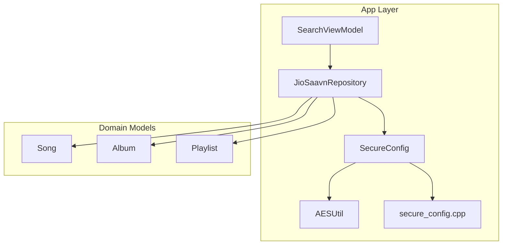
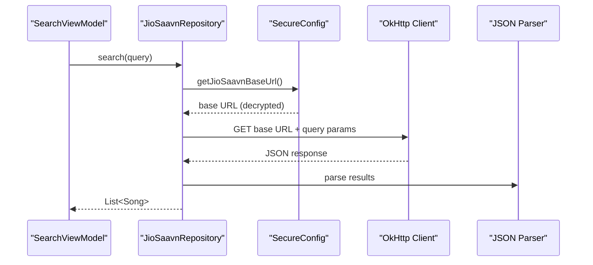
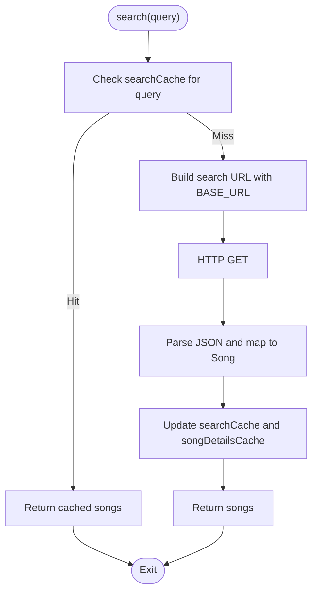
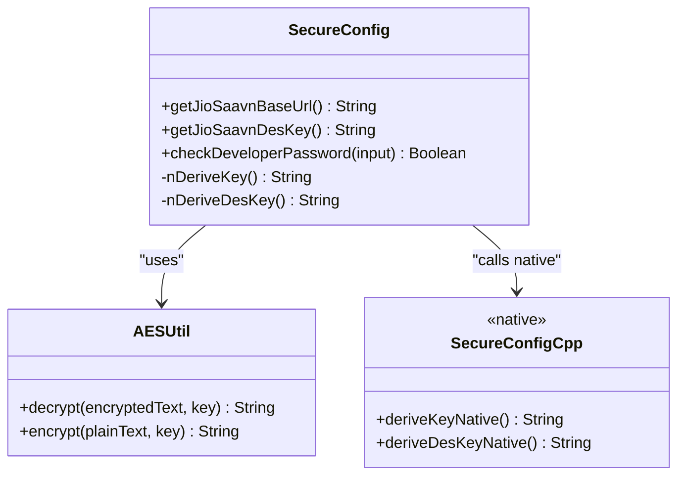
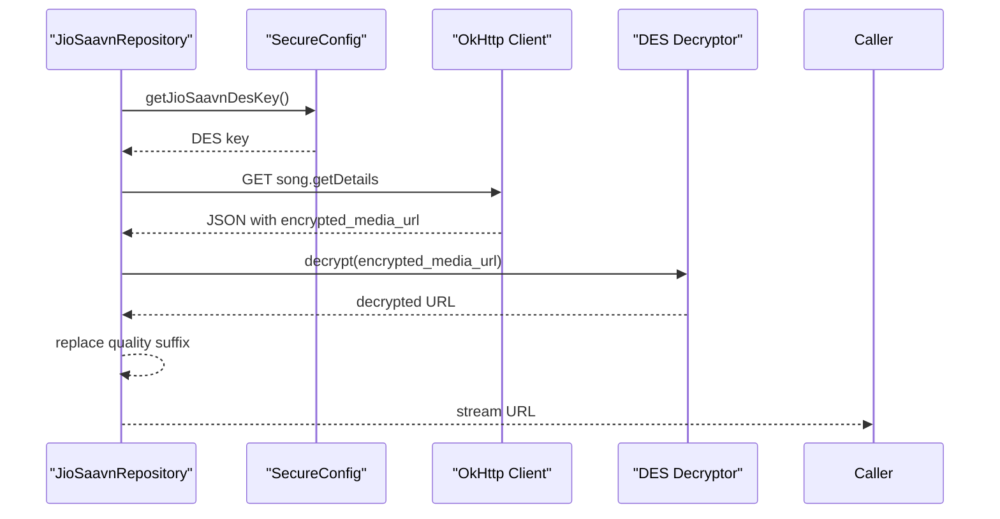
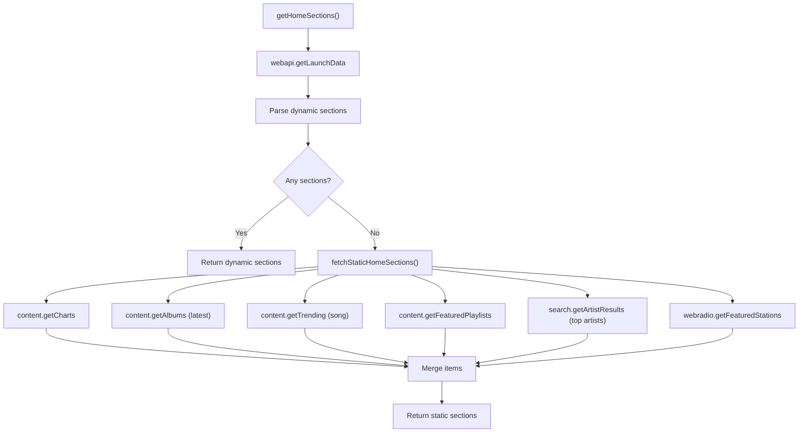
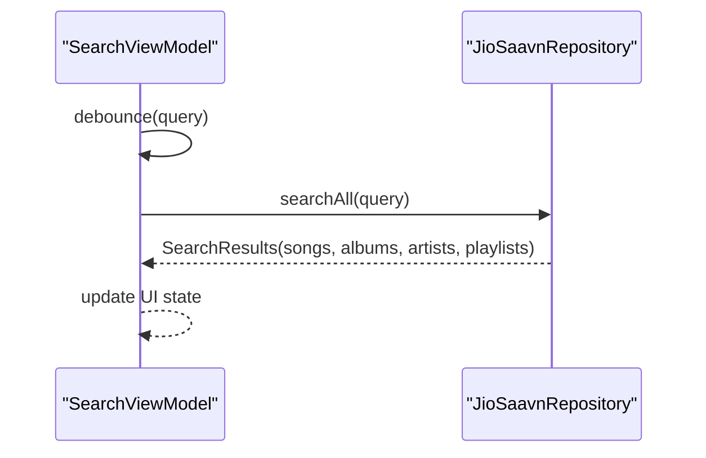
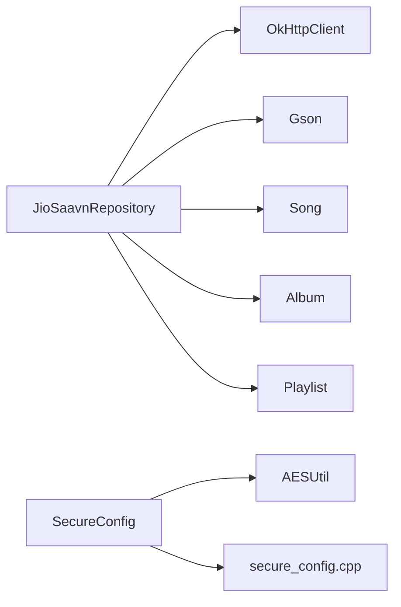

# JioSaavn Integration

<cite>
**Referenced Files in This Document**
- [JioSaavnRepository.kt](file://app/src/main/java/com/suvojeet/suvmusic/data/repository/JioSaavnRepository.kt)
- [SecureConfig.kt](file://app/src/main/java/com/suvojeet/suvmusic/util/SecureConfig.kt)
- [AESUtil.kt](file://app/src/main/java/com/suvojeet/suvmusic/util/AESUtil.kt)
- [secure_config.cpp](file://app/src/main/cpp/secure_config.cpp)
- [Song.kt](file://core/model/src/main/java/com/suvojeet/suvmusic/core/model/Song.kt)
- [Album.kt](file://core/model/src/main/java/com/suvojeet/suvmusic/core/model/Album.kt)
- [Playlist.kt](file://core/model/src/main/java/com/suvojeet/suvmusic/core/model/Playlist.kt)
- [SearchViewModel.kt](file://app/src/main/java/com/suvojeet/suvmusic/ui/viewmodel/SearchViewModel.kt)
- [SessionManager.kt](file://app/src/main/java/com/suvojeet/suvmusic/data/SessionManager.kt)
</cite>

## Table of Contents
1. [Introduction](#introduction)
2. [Project Structure](#project-structure)
3. [Core Components](#core-components)
4. [Architecture Overview](#architecture-overview)
5. [Detailed Component Analysis](#detailed-component-analysis)
6. [Dependency Analysis](#dependency-analysis)
7. [Performance Considerations](#performance-considerations)
8. [Troubleshooting Guide](#troubleshooting-guide)
9. [Conclusion](#conclusion)

## Introduction
This document explains the JioSaavn integration within the SuvMusic application. It covers how the app accesses JioSaavn’s unofficial internal API to discover content, retrieve metadata, resolve streaming URLs, and surface content in the UI. It also documents the security model for API base URL and decryption keys, caching strategies, search capabilities, and integration with the local audio repository for unified content management.

## Project Structure
The JioSaavn integration is implemented primarily in the data layer and utilities:
- Repository layer: JioSaavnRepository orchestrates API calls, parsing, and caching.
- Security utilities: SecureConfig and AESUtil manage encrypted configuration and key derivation.
- Native layer: secure_config.cpp provides secure key derivation resistant to reverse engineering.
- Domain models: Song, Album, and Playlist define the content structures used across the app.
- UI integration: SearchViewModel wires JioSaavn results into the search experience.

**Diagram sources**
- [JioSaavnRepository.kt:31-54](file://app/src/main/java/com/suvojeet/suvmusic/data/repository/JioSaavnRepository.kt#L31-L54)
- [SecureConfig.kt:10-47](file://app/src/main/java/com/suvojeet/suvmusic/util/SecureConfig.kt#L10-L47)
- [AESUtil.kt:12-60](file://app/src/main/java/com/suvojeet/suvmusic/util/AESUtil.kt#L12-L60)
- [secure_config.cpp:17-46](file://app/src/main/cpp/secure_config.cpp#L17-L46)
- [Song.kt:9-29](file://core/model/src/main/java/com/suvojeet/suvmusic/core/model/Song.kt#L9-L29)
- [Album.kt:3-11](file://core/model/src/main/java/com/suvojeet/suvmusic/core/model/Album.kt#L3-L11)
- [Playlist.kt:3-10](file://core/model/src/main/java/com/suvojeet/suvmusic/core/model/Playlist.kt#L3-L10)

**Section sources**
- [JioSaavnRepository.kt:23-54](file://app/src/main/java/com/suvojeet/suvmusic/data/repository/JioSaavnRepository.kt#L23-L54)
- [SecureConfig.kt:10-47](file://app/src/main/java/com/suvojeet/suvmusic/util/SecureConfig.kt#L10-L47)
- [AESUtil.kt:12-60](file://app/src/main/java/com/suvojeet/suvmusic/util/AESUtil.kt#L12-L60)
- [secure_config.cpp:17-46](file://app/src/main/cpp/secure_config.cpp#L17-L46)
- [Song.kt:9-29](file://core/model/src/main/java/com/suvojeet/suvmusic/core/model/Song.kt#L9-L29)
- [Album.kt:3-11](file://core/model/src/main/java/com/suvojeet/suvmusic/core/model/Album.kt#L3-L11)
- [Playlist.kt:3-10](file://core/model/src/main/java/com/suvojeet/suvmusic/core/model/Playlist.kt#L3-L10)

## Core Components
- JioSaavnRepository: Implements search, artist lookup, album/playlist details, lyrics retrieval, and streaming URL resolution. It caches results in memory and uses SecureConfig for API base URL and DES key derivation.
- SecureConfig: Provides runtime decryption of the API base URL and derives the DES key via native code.
- AESUtil: Handles AES decryption of pre-encrypted strings using a derived key.
- secure_config.cpp: Native implementation for key derivation to harden against reverse engineering.
- Domain models: Song, Album, Playlist unify content representation across sources.

Key responsibilities:
- Authentication and API key management: Encrypted base URL and DES key are loaded at runtime.
- Content discovery: Search, artist, album, playlist endpoints.
- Metadata extraction: Parsing JSON responses into strongly typed models.
- Streaming: Resolving encrypted URLs and selecting quality.
- Caching: In-memory caches for search, song details, stream URLs, and playlists.

**Section sources**
- [JioSaavnRepository.kt:31-54](file://app/src/main/java/com/suvojeet/suvmusic/data/repository/JioSaavnRepository.kt#L31-L54)
- [SecureConfig.kt:30-47](file://app/src/main/java/com/suvojeet/suvmusic/util/SecureConfig.kt#L30-L47)
- [AESUtil.kt:41-55](file://app/src/main/java/com/suvojeet/suvmusic/util/AESUtil.kt#L41-L55)
- [secure_config.cpp:36-46](file://app/src/main/cpp/secure_config.cpp#L36-L46)
- [Song.kt:90-115](file://core/model/src/main/java/com/suvojeet/suvmusic/core/model/Song.kt#L90-L115)

## Architecture Overview
The integration follows a layered architecture:
- UI layer (SearchViewModel) triggers queries and displays results.
- Repository layer (JioSaavnRepository) handles HTTP requests, JSON parsing, and caching.
- Security layer (SecureConfig + AESUtil + native) manages encrypted configuration and key derivation.
- Domain models encapsulate content semantics.

**Diagram sources**
- [SearchViewModel.kt:404-416](file://app/src/main/java/com/suvojeet/suvmusic/ui/viewmodel/SearchViewModel.kt#L404-L416)
- [JioSaavnRepository.kt:59-87](file://app/src/main/java/com/suvojeet/suvmusic/data/repository/JioSaavnRepository.kt#L59-L87)
- [SecureConfig.kt:30-36](file://app/src/main/java/com/suvojeet/suvmusic/util/SecureConfig.kt#L30-L36)

## Detailed Component Analysis

### JioSaavnRepository
Responsibilities:
- Search songs, artists, albums, playlists.
- Retrieve song details and album/playlist metadata.
- Resolve encrypted streaming URLs and select quality.
- Provide home sections (dynamic and fallback).
- Internal lyrics retrieval.

Implementation highlights:
- In-memory caches for search results, song details, stream URLs, and playlists.
- Encrypted base URL and DES key derived at runtime.
- Stream URL decryption using DES ECB with PKCS5 padding.
- Quality selection replaces quality suffixes in the decrypted URL.

**Diagram sources**
- [JioSaavnRepository.kt:59-87](file://app/src/main/java/com/suvojeet/suvmusic/data/repository/JioSaavnRepository.kt#L59-L87)

**Section sources**
- [JioSaavnRepository.kt:35-54](file://app/src/main/java/com/suvojeet/suvmusic/data/repository/JioSaavnRepository.kt#L35-L54)
- [JioSaavnRepository.kt:59-87](file://app/src/main/java/com/suvojeet/suvmusic/data/repository/JioSaavnRepository.kt#L59-L87)
- [JioSaavnRepository.kt:197-240](file://app/src/main/java/com/suvojeet/suvmusic/data/repository/JioSaavnRepository.kt#L197-L240)
- [JioSaavnRepository.kt:314-329](file://app/src/main/java/com/suvojeet/suvmusic/data/repository/JioSaavnRepository.kt#L314-L329)

### SecureConfig and Key Derivation
- AESUtil decrypts the pre-encrypted base URL using a derived key.
- SecureConfig loads native library and exposes native functions to derive AES and DES keys.
- secure_config.cpp reconstructs keys from obfuscated fragments and returns them to Kotlin.

**Diagram sources**
- [SecureConfig.kt:10-47](file://app/src/main/java/com/suvojeet/suvmusic/util/SecureConfig.kt#L10-L47)
- [AESUtil.kt:12-60](file://app/src/main/java/com/suvojeet/suvmusic/util/AESUtil.kt#L12-L60)
- [secure_config.cpp:17-46](file://app/src/main/cpp/secure_config.cpp#L17-L46)

**Section sources**
- [SecureConfig.kt:30-47](file://app/src/main/java/com/suvojeet/suvmusic/util/SecureConfig.kt#L30-L47)
- [AESUtil.kt:41-55](file://app/src/main/java/com/suvojeet/suvmusic/util/AESUtil.kt#L41-L55)
- [secure_config.cpp:36-46](file://app/src/main/cpp/secure_config.cpp#L36-L46)

### Streaming URL Resolution and Quality Selection
- Repository calls song.getDetails to retrieve encrypted_media_url.
- Decrypts the URL using DES ECB/PKCS5Padding with the derived DES key.
- Adjusts quality by replacing suffixes (_96.mp4, _160.mp4, _320.mp4).

**Diagram sources**
- [JioSaavnRepository.kt:197-240](file://app/src/main/java/com/suvojeet/suvmusic/data/repository/JioSaavnRepository.kt#L197-L240)
- [JioSaavnRepository.kt:914-925](file://app/src/main/java/com/suvojeet/suvmusic/data/repository/JioSaavnRepository.kt#L914-L925)
- [SecureConfig.kt:41-47](file://app/src/main/java/com/suvojeet/suvmusic/util/SecureConfig.kt#L41-L47)

**Section sources**
- [JioSaavnRepository.kt:197-240](file://app/src/main/java/com/suvojeet/suvmusic/data/repository/JioSaavnRepository.kt#L197-L240)
- [JioSaavnRepository.kt:914-925](file://app/src/main/java/com/suvojeet/suvmusic/data/repository/JioSaavnRepository.kt#L914-L925)

### Content Categories and Home Sections
- Songs, albums, playlists, and artists are supported across search and detail endpoints.
- Home sections are dynamically fetched from webapi.getLaunchData and fall back to static endpoints if needed.
- Radio stations are included as playlist-like items with a special identifier.

**Diagram sources**
- [JioSaavnRepository.kt:335-479](file://app/src/main/java/com/suvojeet/suvmusic/data/repository/JioSaavnRepository.kt#L335-L479)
- [JioSaavnRepository.kt:484-752](file://app/src/main/java/com/suvojeet/suvmusic/data/repository/JioSaavnRepository.kt#L484-L752)

**Section sources**
- [JioSaavnRepository.kt:335-479](file://app/src/main/java/com/suvojeet/suvmusic/data/repository/JioSaavnRepository.kt#L335-L479)
- [JioSaavnRepository.kt:484-752](file://app/src/main/java/com/suvojeet/suvmusic/data/repository/JioSaavnRepository.kt#L484-L752)

### Search and Autocomplete Integration
- SearchViewModel integrates JioSaavn results into the unified search UI.
- Debounced query handling triggers suggestions and auto-search.
- Results are categorized into songs, albums, artists, and playlists.

**Diagram sources**
- [SearchViewModel.kt:124-134](file://app/src/main/java/com/suvojeet/suvmusic/ui/viewmodel/SearchViewModel.kt#L124-L134)
- [SearchViewModel.kt:404-416](file://app/src/main/java/com/suvojeet/suvmusic/ui/viewmodel/SearchViewModel.kt#L404-L416)
- [JioSaavnRepository.kt:933-1001](file://app/src/main/java/com/suvojeet/suvmusic/data/repository/JioSaavnRepository.kt#L933-L1001)

**Section sources**
- [SearchViewModel.kt:124-134](file://app/src/main/java/com/suvojeet/suvmusic/ui/viewmodel/SearchViewModel.kt#L124-L134)
- [SearchViewModel.kt:404-416](file://app/src/main/java/com/suvojeet/suvmusic/ui/viewmodel/SearchViewModel.kt#L404-L416)
- [JioSaavnRepository.kt:933-1001](file://app/src/main/java/com/suvojeet/suvmusic/data/repository/JioSaavnRepository.kt#L933-L1001)

### Local Audio Repository Integration
- The UI supports unified search across local audio and online sources.
- LocalAudioRepository provides local search for songs, albums, and artists.
- This enables a single interface for discovering both local and JioSaavn content.

**Section sources**
- [SearchViewModel.kt:417-421](file://app/src/main/java/com/suvojeet/suvmusic/ui/viewmodel/SearchViewModel.kt#L417-L421)

## Dependency Analysis
- JioSaavnRepository depends on OkHttp for networking and Gson for JSON parsing.
- SecureConfig depends on AESUtil and native code for key derivation.
- Domain models (Song, Album, Playlist) are used across repositories and UI.

**Diagram sources**
- [JioSaavnRepository.kt:32-34](file://app/src/main/java/com/suvojeet/suvmusic/data/repository/JioSaavnRepository.kt#L32-L34)
- [SecureConfig.kt:10-18](file://app/src/main/java/com/suvojeet/suvmusic/util/SecureConfig.kt#L10-L18)
- [Song.kt:9-29](file://core/model/src/main/java/com/suvojeet/suvmusic/core/model/Song.kt#L9-L29)
- [Album.kt:3-11](file://core/model/src/main/java/com/suvojeet/suvmusic/core/model/Album.kt#L3-L11)
- [Playlist.kt:3-10](file://core/model/src/main/java/com/suvojeet/suvmusic/core/model/Playlist.kt#L3-L10)

**Section sources**
- [JioSaavnRepository.kt:32-34](file://app/src/main/java/com/suvojeet/suvmusic/data/repository/JioSaavnRepository.kt#L32-L34)
- [SecureConfig.kt:10-18](file://app/src/main/java/com/suvojeet/suvmusic/util/SecureConfig.kt#L10-L18)

## Performance Considerations
- In-memory caching reduces repeated network calls for search, song details, stream URLs, and playlists.
- Quality suffix replacement avoids redundant decryption per quality level.
- Debounced search queries minimize network churn during typing.
- Static fallback home sections prevent UI stalls when dynamic fetch fails.

Recommendations:
- Persist frequently accessed home sections to disk for offline-first experience.
- Add TTL-based cache invalidation for stale content.
- Implement connection pooling and timeouts for robustness.
- Consider prefetching popular categories to improve perceived performance.

**Section sources**
- [JioSaavnRepository.kt:35-39](file://app/src/main/java/com/suvojeet/suvmusic/data/repository/JioSaavnRepository.kt#L35-L39)
- [JioSaavnRepository.kt:197-201](file://app/src/main/java/com/suvojeet/suvmusic/data/repository/JioSaavnRepository.kt#L197-L201)
- [SearchViewModel.kt:124-134](file://app/src/main/java/com/suvojeet/suvmusic/ui/viewmodel/SearchViewModel.kt#L124-L134)
- [SessionManager.kt:2103-2127](file://app/src/main/java/com/suvojeet/suvmusic/data/SessionManager.kt#L2103-L2127)

## Troubleshooting Guide
Common issues and resolutions:
- Empty or missing search results:
  - Verify BASE_URL decryption via SecureConfig.
  - Confirm network connectivity and endpoint availability.
- Invalid or expired stream URLs:
  - Ensure DES key derivation succeeds.
  - Check quality suffix replacement logic.
- Home sections not loading:
  - Fallback to static sections is automatic; inspect logs for errors.
- Developer-only feature visibility:
  - JioSaavn tab is gated behind developer mode; enable via developer password check.

Operational checks:
- Validate AESUtil decryption and native key derivation.
- Inspect in-memory caches for stale entries.
- Review network request/response logs for malformed JSON.

**Section sources**
- [SecureConfig.kt:30-47](file://app/src/main/java/com/suvojeet/suvmusic/util/SecureConfig.kt#L30-L47)
- [AESUtil.kt:41-55](file://app/src/main/java/com/suvojeet/suvmusic/util/AESUtil.kt#L41-L55)
- [JioSaavnRepository.kt:335-479](file://app/src/main/java/com/suvojeet/suvmusic/data/repository/JioSaavnRepository.kt#L335-L479)
- [JioSaavnRepository.kt:197-240](file://app/src/main/java/com/suvojeet/suvmusic/data/repository/JioSaavnRepository.kt#L197-L240)

## Conclusion
The JioSaavn integration in SuvMusic leverages an unofficial internal API with strong runtime security for base URL and decryption keys. The repository layer provides comprehensive content discovery, metadata retrieval, and streaming URL resolution with caching and quality selection. The UI integrates JioSaavn results alongside local audio for a unified experience. Robust fallbacks and performance optimizations ensure reliability and responsiveness.