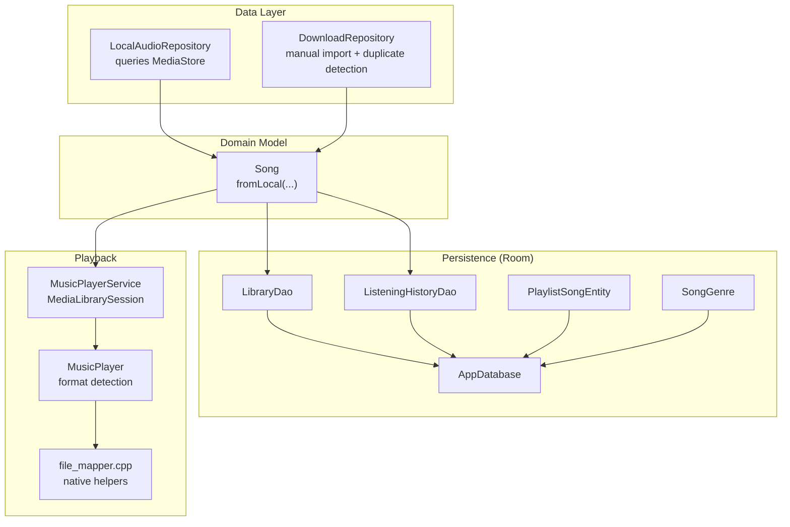
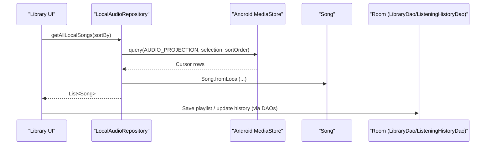
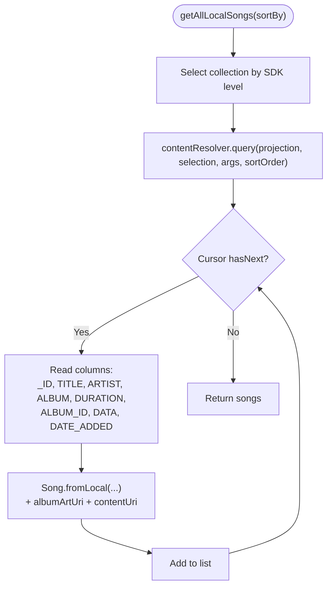
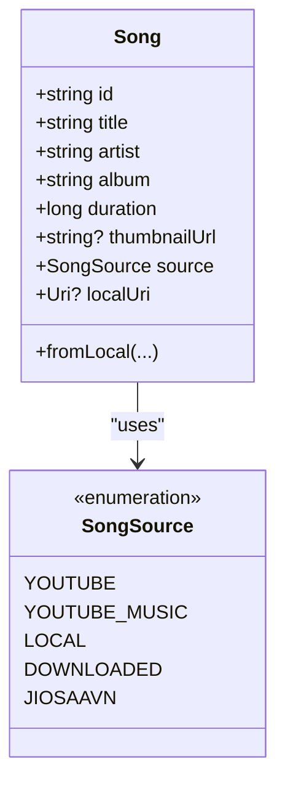
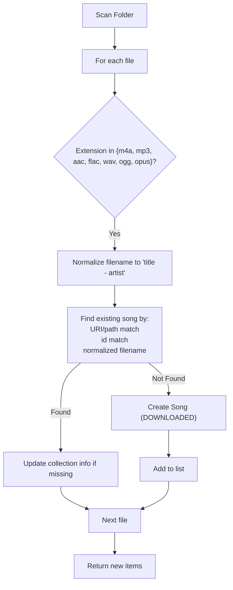
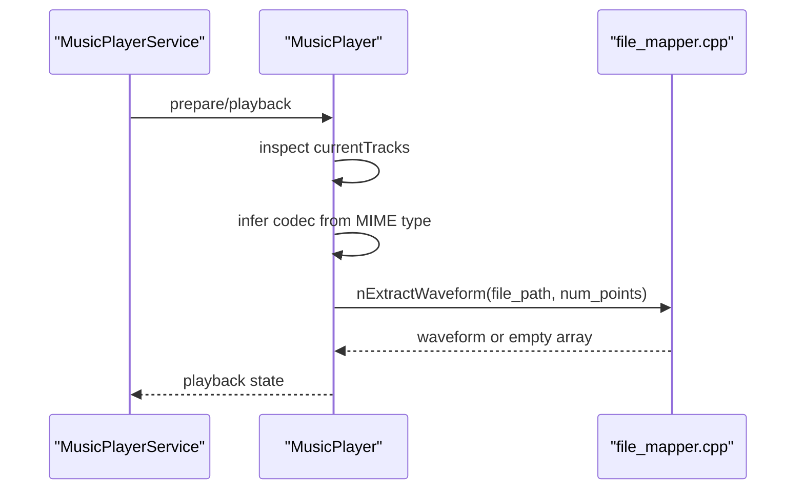
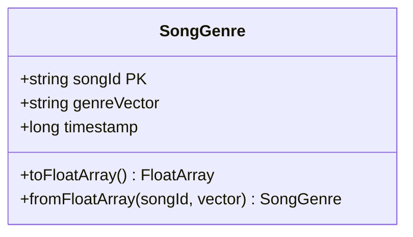
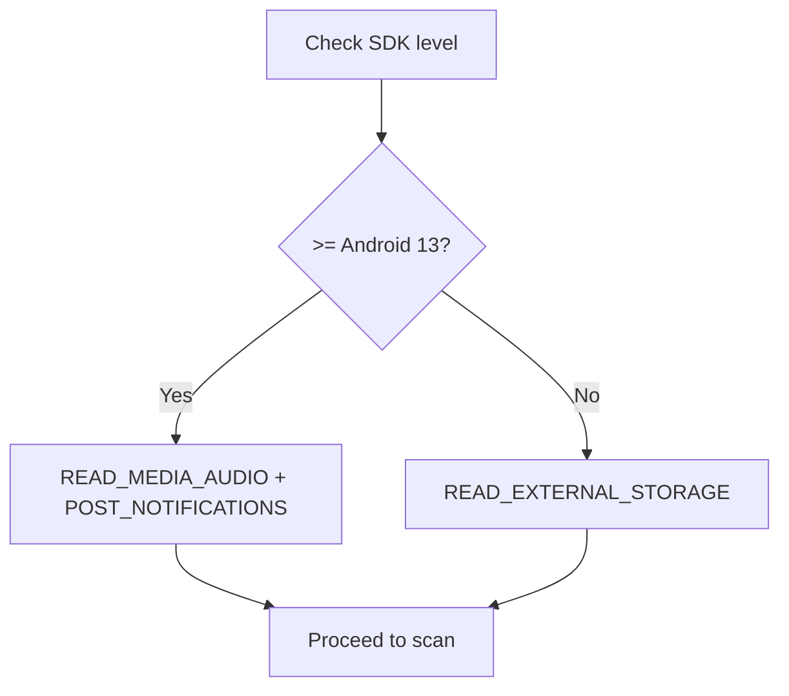
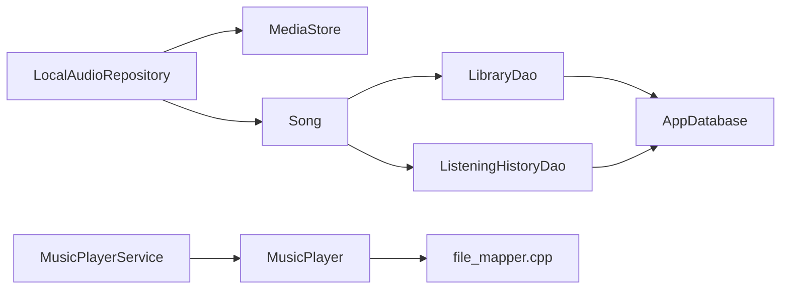

# Local Audio Support

<cite>
**Referenced Files in This Document**
- [LocalAudioRepository.kt](file://app/src/main/java/com/suvojeet/suvmusic/data/repository/LocalAudioRepository.kt)
- [Song.kt](file://core/model/src/main/java/com/suvojeet/suvmusic/core/model/Song.kt)
- [AppDatabase.kt](file://core/data/src/main/java/com/suvojeet/suvmusic/core/data/local/AppDatabase.kt)
- [LibraryDao.kt](file://core/data/src/main/java/com/suvojeet/suvmusic/core/data/local/dao/LibraryDao.kt)
- [ListeningHistoryDao.kt](file://core/data/src/main/java/com/suvojeet/suvmusic/core/data/local/dao/ListeningHistoryDao.kt)
- [ListeningHistory.kt](file://core/data/src/main/java/com/suvojeet/suvmusic/core/data/local/entity/ListeningHistory.kt)
- [LibraryEntity.kt](file://core/data/src/main/java/com/suvojeet/suvmusic/core/data/local/entity/LibraryEntity.kt)
- [PlaylistSongEntity.kt](file://core/data/src/main/java/com/suvojejeet/suvmusic/core/data/local/entity/PlaylistSongEntity.kt)
- [SongGenre.kt](file://core/data/src/main/java/com/suvojeet/suvmusic/core/data/local/entity/SongGenre.kt)
- [PermissionUtils.kt](file://app/src/main/java/com/suvojeet/suvmusic/util/PermissionUtils.kt)
- [file_paths.xml](file://app/src/main/res/xml/file_paths.xml)
- [MusicPlayer.kt](file://app/src/main/java/com/suvojeet/suvmusic/player/MusicPlayer.kt)
- [file_mapper.cpp](file://app/src/main/cpp/file_mapper.cpp)
- [DownloadRepository.kt](file://app/src/main/java/com/suvojeet/suvmusic/data/repository/DownloadRepository.kt)
- [MusicPlayerService.kt](file://app/src/main/java/com/suvojeet/suvmusic/service/MusicPlayerService.kt)
- [LibraryViewModel.kt](file://app/src/main/java/com/suvojeet/suvmusic/ui/viewmodel/LibraryViewModel.kt)
- [SessionManager.kt](file://app/src/main/java/com/suvojeet/suvmusic/data/SessionManager.kt)
</cite>

## Table of Contents
1. [Introduction](#introduction)
2. [Project Structure](#project-structure)
3. [Core Components](#core-components)
4. [Architecture Overview](#architecture-overview)
5. [Detailed Component Analysis](#detailed-component-analysis)
6. [Dependency Analysis](#dependency-analysis)
7. [Performance Considerations](#performance-considerations)
8. [Troubleshooting Guide](#troubleshooting-guide)
9. [Conclusion](#conclusion)
10. [Appendices](#appendices)

## Introduction
This document explains how the application integrates local audio files into the music library. It covers scanning and indexing via the Android MediaStore, metadata extraction, library organization, Room persistence for metadata and listening history, caching strategies, and integration with the playback system. It also documents supported audio formats, tagging considerations, permission handling, and cross-platform compatibility notes.

## Project Structure
The local audio support spans three main areas:
- Data access and scanning: LocalAudioRepository queries MediaStore for songs, albums, and artists.
- Domain model: Song encapsulates local and remote items uniformly.
- Persistence: Room database stores library items, playlists, listening history, and genre vectors.



**Diagram sources**
- [LocalAudioRepository.kt:1-432](file://app/src/main/java/com/suvojeet/suvmusic/data/repository/LocalAudioRepository.kt#L1-L432)
- [Song.kt:1-129](file://core/model/src/main/java/com/suvojeet/suvmusic/core/model/Song.kt#L1-L129)
- [AppDatabase.kt:1-37](file://core/data/src/main/java/com/suvojeet/suvmusic/core/data/local/AppDatabase.kt#L1-L37)
- [LibraryDao.kt:1-90](file://core/data/src/main/java/com/suvojeet/suvmusic/core/data/local/dao/LibraryDao.kt#L1-L90)
- [ListeningHistoryDao.kt:1-99](file://core/data/src/main/java/com/suvojeet/suvmusic/core/data/local/dao/ListeningHistoryDao.kt#L1-L99)
- [PlaylistSongEntity.kt:1-25](file://core/data/src/main/java/com/suvojeet/suvmusic/core/data/local/entity/PlaylistSongEntity.kt#L1-L25)
- [SongGenre.kt:1-45](file://core/data/src/main/java/com/suvojeet/suvmusic/core/data/local/entity/SongGenre.kt#L1-L45)
- [MusicPlayerService.kt:931-1126](file://app/src/main/java/com/suvojeet/suvmusic/service/MusicPlayerService.kt#L931-L1126)
- [MusicPlayer.kt:1950-1980](file://app/src/main/java/com/suvojeet/suvmusic/player/MusicPlayer.kt#L1950-L1980)
- [file_mapper.cpp:1-75](file://app/src/main/cpp/file_mapper.cpp#L1-L75)
- [DownloadRepository.kt:153-740](file://app/src/main/java/com/suvojeet/suvmusic/data/repository/DownloadRepository.kt#L153-L740)

**Section sources**
- [LocalAudioRepository.kt:1-432](file://app/src/main/java/com/suvojeet/suvmusic/data/repository/LocalAudioRepository.kt#L1-L432)
- [Song.kt:1-129](file://core/model/src/main/java/com/suvojeet/suvmusic/core/model/Song.kt#L1-L129)
- [AppDatabase.kt:1-37](file://core/data/src/main/java/com/suvojeet/suvmusic/core/data/local/AppDatabase.kt#L1-L37)

## Core Components
- LocalAudioRepository: Scans external storage via MediaStore, extracts metadata, and builds Song instances with local URIs and album art URIs.
- Song: Unified model supporting local, YouTube, and other sources; includes localUri and source discriminator.
- Room database: Stores library items, playlists, listening history, and genre vectors.
- DAOs: Provide typed access to Room entities for reads, writes, and aggregations.
- Playback integration: MusicPlayerService exposes a MediaLibrarySession; MusicPlayer detects audio formats; native helpers assist waveform extraction.

Key responsibilities:
- MediaStore integration: Queries for songs, albums, artists, and supports search.
- Metadata extraction: Title, artist, album, duration, album art, and content URI.
- Library organization: Playlists, liked/disliked items, and genre vectors.
- Playback: Seamless switching between local and streaming sources.

**Section sources**
- [LocalAudioRepository.kt:54-122](file://app/src/main/java/com/suvojeet/suvmusic/data/repository/LocalAudioRepository.kt#L54-L122)
- [Song.kt:64-88](file://core/model/src/main/java/com/suvojeet/suvmusic/core/model/Song.kt#L64-L88)
- [LibraryDao.kt:13-89](file://core/data/src/main/java/com/suvojeet/suvmusic/core/data/local/dao/LibraryDao.kt#L13-L89)
- [ListeningHistoryDao.kt:10-90](file://core/data/src/main/java/com/suvojeet/suvmusic/core/data/local/dao/ListeningHistoryDao.kt#L10-L90)
- [MusicPlayerService.kt:931-1126](file://app/src/main/java/com/suvojeet/suvmusic/service/MusicPlayerService.kt#L931-L1126)

## Architecture Overview
The local audio pipeline:
- Scanning: LocalAudioRepository queries MediaStore and constructs Song objects.
- Manual import: DownloadRepository scans folders, normalizes filenames, detects duplicates, and enriches metadata.
- Persistence: LibraryDao and ListeningHistoryDao persist library items and playback stats.
- Playback: MusicPlayerService mediates browsing and playback; MusicPlayer inspects audio formats; native code assists with waveform extraction.



**Diagram sources**
- [LocalAudioRepository.kt:54-122](file://app/src/main/java/com/suvojeet/suvmusic/data/repository/LocalAudioRepository.kt#L54-L122)
- [Song.kt:64-88](file://core/model/src/main/java/com/suvojeet/suvmusic/core/model/Song.kt#L64-L88)
- [LibraryDao.kt:13-48](file://core/data/src/main/java/com/suvojeet/suvmusic/core/data/local/dao/LibraryDao.kt#L13-L48)
- [ListeningHistoryDao.kt:10-48](file://core/data/src/main/java/com/suvojeet/suvmusic/core/data/local/dao/ListeningHistoryDao.kt#L10-L48)

## Detailed Component Analysis

### LocalAudioRepository: MediaStore Integration
- Uses MediaStore.Audio.Media and related content URIs to enumerate local music.
- Supports Android Q+ volumes and legacy external URIs.
- Extracts core metadata and constructs Song objects with localUri and albumArtUri.
- Provides album/artist queries and search APIs.



**Diagram sources**
- [LocalAudioRepository.kt:54-122](file://app/src/main/java/com/suvojeet/suvmusic/data/repository/LocalAudioRepository.kt#L54-L122)

**Section sources**
- [LocalAudioRepository.kt:54-432](file://app/src/main/java/com/suvojeet/suvmusic/data/repository/LocalAudioRepository.kt#L54-L432)

### Song Model: Local and Remote Unification
- fromLocal creates a Song with source LOCAL and localUri set to MediaStore content URI.
- Includes optional thumbnailUrl, duration, and metadata fields.



**Diagram sources**
- [Song.kt:9-129](file://core/model/src/main/java/com/suvojeet/suvmusic/core/model/Song.kt#L9-L129)

**Section sources**
- [Song.kt:64-88](file://core/model/src/main/java/com/suvojeet/suvmusic/core/model/Song.kt#L64-L88)

### Room Database Schema and DAOs
- AppDatabase registers entities: ListeningHistory, LibraryEntity, PlaylistSongEntity, DislikedSong/Artist, SongGenre.
- LibraryDao manages library items and playlist-song caches with replace semantics and transactional updates.
- ListeningHistoryDao aggregates play counts, recent/top tracks, and artist stats.

```mermaid
erDiagram
LISTENING_HISTORY {
string songId PK
string songTitle
string artist
string? thumbnailUrl
string album
long duration
string? localUri
int playCount
long totalDurationMs
long lastPlayed
long firstPlayed
int skipCount
float completionRate
boolean isLiked
string? artistId
string source
string? releaseDate
}
LIBRARY_ENTITY {
string id PK
string title
string? subtitle
string? thumbnailUrl
string type
long timestamp
}
PLAYLIST_SONG_ENTITY {
string playlistId PK
string songId PK
string title
string artist
string? album
string? thumbnailUrl
long duration
string source
string? localUri
string? releaseDate
long addedAt
int order
}
SONG_GENRE {
string songId PK
string genreVector
long timestamp
}
LIBRARY_ENTITY ||--o{ PLAYLIST_SONG_ENTITY : "contains"
```

**Diagram sources**
- [AppDatabase.kt:16-36](file://core/data/src/main/java/com/suvojeet/suvmusic/core/data/local/AppDatabase.kt#L16-L36)
- [ListeningHistory.kt:10-39](file://core/data/src/main/java/com/suvojeet/suvmusic/core/data/local/entity/ListeningHistory.kt#L10-L39)
- [LibraryEntity.kt:6-24](file://core/data/src/main/java/com/suvojeet/suvmusic/core/data/local/entity/LibraryEntity.kt#L6-L24)
- [PlaylistSongEntity.kt:6-24](file://core/data/src/main/java/com/suvojeet/suvmusic/core/data/local/entity/PlaylistSongEntity.kt#L6-L24)
- [SongGenre.kt:11-44](file://core/data/src/main/java/com/suvojeet/suvmusic/core/data/local/entity/SongGenre.kt#L11-L44)

**Section sources**
- [AppDatabase.kt:16-36](file://core/data/src/main/java/com/suvojeet/suvmusic/core/data/local/AppDatabase.kt#L16-L36)
- [LibraryDao.kt:13-89](file://core/data/src/main/java/com/suvojeet/suvmusic/core/data/local/dao/LibraryDao.kt#L13-L89)
- [ListeningHistoryDao.kt:10-90](file://core/data/src/main/java/com/suvojeet/suvmusic/core/data/local/dao/ListeningHistoryDao.kt#L10-L90)

### Manual Import and Duplicate Detection
- DownloadRepository scans document folders and filters by audio extensions.
- Normalizes filenames using “title - artist” pattern and deduplicates by URI/path, id match, and normalized filename.
- Updates collection metadata when discovered inside folders (e.g., playlist subfolders).



**Diagram sources**
- [DownloadRepository.kt:153-203](file://app/src/main/java/com/suvojeet/suvmusic/data/repository/DownloadRepository.kt#L153-L203)
- [DownloadRepository.kt:170-191](file://app/src/main/java/com/suvojeet/suvmusic/data/repository/DownloadRepository.kt#L170-L191)

**Section sources**
- [DownloadRepository.kt:153-740](file://app/src/main/java/com/suvojeet/suvmusic/data/repository/DownloadRepository.kt#L153-L740)

### Playback Integration and Format Handling
- MusicPlayerService exposes a MediaLibrarySession for browsing and playback.
- MusicPlayer inspects audio format from selected tracks and infers codec from MIME type.
- Native helpers (file_mapper.cpp) demonstrate file mapping and basic header checks for compressed formats.



**Diagram sources**
- [MusicPlayerService.kt:931-1126](file://app/src/main/java/com/suvojeet/suvmusic/service/MusicPlayerService.kt#L931-L1126)
- [MusicPlayer.kt:1950-1980](file://app/src/main/java/com/suvojeet/suvmusic/player/MusicPlayer.kt#L1950-L1980)
- [file_mapper.cpp:1-75](file://app/src/main/cpp/file_mapper.cpp#L1-L75)

**Section sources**
- [MusicPlayerService.kt:931-1126](file://app/src/main/java/com/suvojeet/suvmusic/service/MusicPlayerService.kt#L931-L1126)
- [MusicPlayer.kt:1950-1980](file://app/src/main/java/com/suvojeet/suvmusic/player/MusicPlayer.kt#L1950-L1980)
- [file_mapper.cpp:1-75](file://app/src/main/cpp/file_mapper.cpp#L1-L75)

### Genre Classification and Caching
- SongGenre entity stores a comma-separated genre vector string and timestamp.
- Provides conversion to/from FloatArray for ML-based genre inference reuse.



**Diagram sources**
- [SongGenre.kt:11-44](file://core/data/src/main/java/com/suvojeet/suvmusic/core/data/local/entity/SongGenre.kt#L11-L44)

**Section sources**
- [SongGenre.kt:22-43](file://core/data/src/main/java/com/suvojeet/suvmusic/core/data/local/entity/SongGenre.kt#L22-L43)

### Permissions and Security
- PermissionUtils enumerates required runtime permissions for audio/media access across Android versions.
- file_paths.xml defines public paths for cache and downloads to enable safe sharing and installation.



**Diagram sources**
- [PermissionUtils.kt:9-28](file://app/src/main/java/com/suvojeet/suvmusic/util/PermissionUtils.kt#L9-L28)
- [file_paths.xml:1-14](file://app/src/main/res/xml/file_paths.xml#L1-L14)

**Section sources**
- [PermissionUtils.kt:9-28](file://app/src/main/java/com/suvojeet/suvmusic/util/PermissionUtils.kt#L9-L28)
- [file_paths.xml:1-14](file://app/src/main/res/xml/file_paths.xml#L1-L14)

## Dependency Analysis
- LocalAudioRepository depends on Android’s ContentResolver and MediaStore.
- Song is a pure model with factory methods; it does not depend on persistence.
- DAOs depend on Room annotations and operate independently of scanning logic.
- Playback relies on MusicPlayerService and MusicPlayer; native code is auxiliary.



**Diagram sources**
- [LocalAudioRepository.kt:1-432](file://app/src/main/java/com/suvojeet/suvmusic/data/repository/LocalAudioRepository.kt#L1-L432)
- [Song.kt:1-129](file://core/model/src/main/java/com/suvojeet/suvmusic/core/model/Song.kt#L1-L129)
- [LibraryDao.kt:1-90](file://core/data/src/main/java/com/suvojeet/suvmusic/core/data/local/dao/LibraryDao.kt#L1-L90)
- [ListeningHistoryDao.kt:1-99](file://core/data/src/main/java/com/suvojeet/suvmusic/core/data/local/dao/ListeningHistoryDao.kt#L1-L99)
- [MusicPlayerService.kt:931-1126](file://app/src/main/java/com/suvojeet/suvmusic/service/MusicPlayerService.kt#L931-L1126)
- [MusicPlayer.kt:1950-1980](file://app/src/main/java/com/suvojeet/suvmusic/player/MusicPlayer.kt#L1950-L1980)
- [file_mapper.cpp:1-75](file://app/src/main/cpp/file_mapper.cpp#L1-L75)

**Section sources**
- [LocalAudioRepository.kt:1-432](file://app/src/main/java/com/suvojeet/suvmusic/data/repository/LocalAudioRepository.kt#L1-L432)
- [Song.kt:1-129](file://core/model/src/main/java/com/suvojeet/suvmusic/core/model/Song.kt#L1-L129)
- [LibraryDao.kt:1-90](file://core/data/src/main/java/com/suvojeet/suvmusic/core/data/local/dao/LibraryDao.kt#L1-L90)
- [ListeningHistoryDao.kt:1-99](file://core/data/src/main/java/com/suvojeet/suvmusic/core/data/local/dao/ListeningHistoryDao.kt#L1-L99)
- [MusicPlayerService.kt:931-1126](file://app/src/main/java/com/suvojeet/suvmusic/service/MusicPlayerService.kt#L931-L1126)
- [MusicPlayer.kt:1950-1980](file://app/src/main/java/com/suvojeet/suvmusic/player/MusicPlayer.kt#L1950-L1980)
- [file_mapper.cpp:1-75](file://app/src/main/cpp/file_mapper.cpp#L1-L75)

## Performance Considerations
- MediaStore queries: Use projections with only required columns; sort on indexed columns (e.g., TITLE, ALBUM_ID).
- Concurrency: Offload IO to Dispatchers.IO in repositories and DAOs.
- Pagination: For large libraries, consider paging in UI and DAO queries.
- Caching: Use DAO Flow streams for reactive UI updates; cache small derived data (e.g., liked songs) in memory or encrypted preferences.
- Background scanning: Schedule periodic scans with WorkManager or on-demand triggers; avoid blocking UI.
- Native helpers: mmap-based waveform extraction should guard against compressed formats and return early for unsupported codecs.

[No sources needed since this section provides general guidance]

## Troubleshooting Guide
- No songs appear:
  - Verify runtime permissions for audio/media access.
  - Confirm files are marked as music and reside under external storage.
- Incorrect metadata:
  - Some devices may lack accurate tags; rely on filename normalization for manual imports.
- Playback fails:
  - Check inferred codec and container; ensure Media3 can handle the format.
- Cache inconsistencies:
  - Clear Room cache tables or reset derived caches when importing large batches.

**Section sources**
- [PermissionUtils.kt:9-28](file://app/src/main/java/com/suvojeet/suvmusic/util/PermissionUtils.kt#L9-L28)
- [DownloadRepository.kt:153-203](file://app/src/main/java/com/suvojeet/suvmusic/data/repository/DownloadRepository.kt#L153-L203)
- [MusicPlayer.kt:1950-1980](file://app/src/main/java/com/suvojeet/suvmusic/player/MusicPlayer.kt#L1950-L1980)

## Conclusion
The application integrates local audio through MediaStore-backed scanning and manual import with robust duplicate detection. Room persists library and listening data, while the playback system seamlessly handles local and streaming sources. Proper permissions, efficient queries, and caching strategies ensure smooth operation across diverse device configurations.

[No sources needed since this section summarizes without analyzing specific files]

## Appendices

### Supported Audio Formats and Tagging Notes
- Automatic scanning leverages MediaStore-provided metadata; compressed formats are supported by the playback stack.
- Manual import recognizes common extensions and normalizes filenames to infer title/artist.
- Native helpers demonstrate header checks for compressed containers; uncompressed PCM is suitable for waveform extraction.

**Section sources**
- [MusicPlayer.kt:1950-1980](file://app/src/main/java/com/suvojeet/suvmusic/player/MusicPlayer.kt#L1950-L1980)
- [file_mapper.cpp:53-73](file://app/src/main/cpp/file_mapper.cpp#L53-L73)
- [DownloadRepository.kt:157-158](file://app/src/main/java/com/suvojeet/suvmusic/data/repository/DownloadRepository.kt#L157-L158)

### Cross-Platform Compatibility
- Android-specific: MediaStore, ContentResolver, and Media3 integration.
- Permissions vary by Android version; use PermissionUtils to request appropriate permissions.
- File paths exposed via file_paths.xml for public downloads and cache sharing.

**Section sources**
- [PermissionUtils.kt:9-28](file://app/src/main/java/com/suvojeet/suvmusic/util/PermissionUtils.kt#L9-L28)
- [file_paths.xml:1-14](file://app/src/main/res/xml/file_paths.xml#L1-L14)