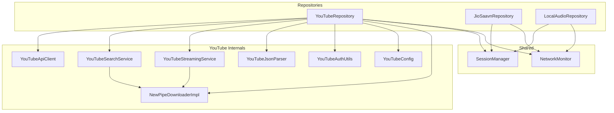
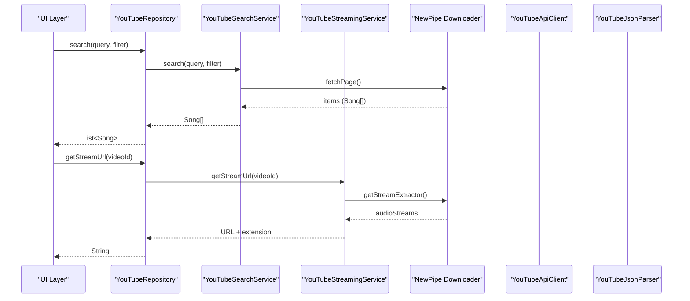
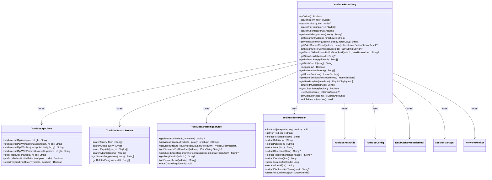
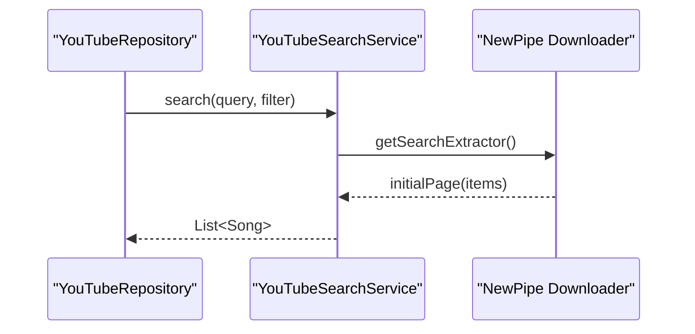
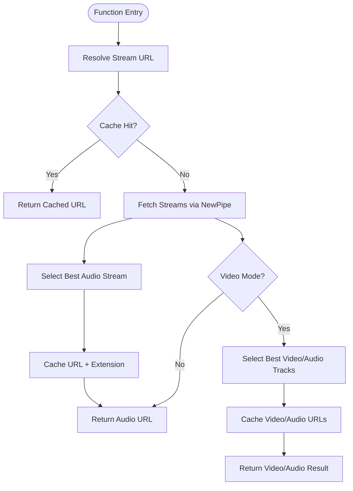
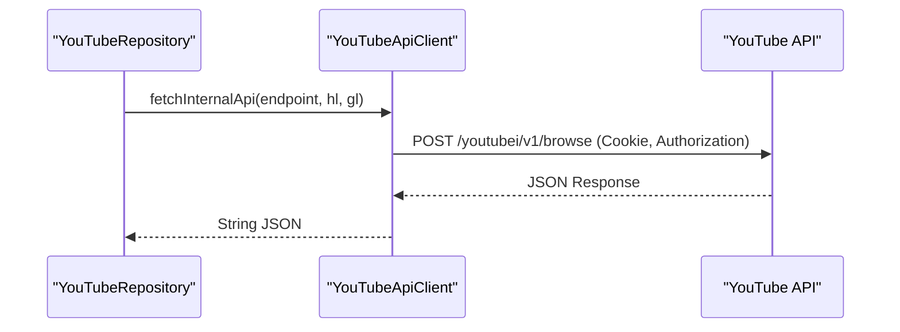
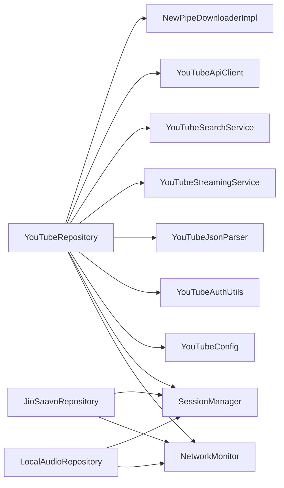

# Multi-Source Streaming

<cite>
**Referenced Files in This Document**
- [YouTubeRepository.kt](file://app/src/main/java/com/suvojeet/suvmusic/data/repository/YouTubeRepository.kt)
- [JioSaavnRepository.kt](file://app/src/main/java/com/suvojeet/suvmusic/data/repository/JioSaavnRepository.kt)
- [LocalAudioRepository.kt](file://app/src/main/java/com/suvojeet/suvmusic/data/repository/LocalAudioRepository.kt)
- [YouTubeApiClient.kt](file://app/src/main/java/com/suvojeet/suvmusic/data/repository/youtube/internal/YouTubeApiClient.kt)
- [YouTubeSearchService.kt](file://app/src/main/java/com/suvojeet/suvmusic/data/repository/youtube/search/YouTubeSearchService.kt)
- [YouTubeStreamingService.kt](file://app/src/main/java/com/suvojeet/suvmusic/data/repository/youtube/streaming/YouTubeStreamingService.kt)
- [YouTubeJsonParser.kt](file://app/src/main/java/com/suvojeet/suvmusic/data/repository/youtube/internal/YouTubeJsonParser.kt)
- [YouTubeAuthUtils.kt](file://app/src/main/java/com/suvojeet/suvmusic/data/YouTubeAuthUtils.kt)
- [YouTubeConfig.kt](file://app/src/main/java/com/suvojeet/suvmusic/data/repository/youtube/internal/YouTubeConfig.kt)
- [NewPipeDownloaderImpl.kt](file://extractor/src/main/java/com/suvojeet/suvmusic/newpipe/NewPipeDownloaderImpl.kt)
- [SessionManager.kt](file://app/src/main/java/com/suvojeet/suvmusic/data/SessionManager.kt)
- [NetworkMonitor.kt](file://app/src/main/java/com/suvojeet/suvmusic/util/NetworkMonitor.kt)
</cite>

## Table of Contents
1. [Introduction](#introduction)
2. [Project Structure](#project-structure)
3. [Core Components](#core-components)
4. [Architecture Overview](#architecture-overview)
5. [Detailed Component Analysis](#detailed-component-analysis)
6. [Dependency Analysis](#dependency-analysis)
7. [Performance Considerations](#performance-considerations)
8. [Troubleshooting Guide](#troubleshooting-guide)
9. [Conclusion](#conclusion)

## Introduction
This document explains SuvMusic’s multi-source streaming architecture, focusing on the unified interface across YouTube Music, JioSaavn, and local audio sources. It covers repository patterns, authentication and API integration, content discovery, metadata extraction, stream quality selection, NewPipe Extractor integration, fallback mechanisms, local file system access, media store integration, cross-source playlist management, seamless switching, and performance optimizations.

## Project Structure
SuvMusic organizes streaming logic by source:
- YouTube Music: Internal API client, search, streaming, and JSON parsing utilities
- JioSaavn: Unofficial API integration with caching and decryption
- Local audio: Android MediaStore access for device libraries
- Shared infrastructure: Session management, network monitoring, and NewPipe integration

**Diagram sources**
- [YouTubeRepository.kt:1-3254](file://app/src/main/java/com/suvojeet/suvmusic/data/repository/YouTubeRepository.kt#L1-L3254)
- [JioSaavnRepository.kt:1-1010](file://app/src/main/java/com/suvojeet/suvmusic/data/repository/JioSaavnRepository.kt#L1-L1010)
- [LocalAudioRepository.kt:1-432](file://app/src/main/java/com/suvojeet/suvmusic/data/repository/LocalAudioRepository.kt#L1-L432)
- [YouTubeApiClient.kt:1-415](file://app/src/main/java/com/suvojeet/suvmusic/data/repository/youtube/internal/YouTubeApiClient.kt#L1-L415)
- [YouTubeSearchService.kt:1-371](file://app/src/main/java/com/suvojeet/suvmusic/data/repository/youtube/search/YouTubeSearchService.kt#L1-L371)
- [YouTubeStreamingService.kt:1-390](file://app/src/main/java/com/suvojeet/suvmusic/data/repository/youtube/streaming/YouTubeStreamingService.kt#L1-L390)
- [YouTubeJsonParser.kt:1-546](file://app/src/main/java/com/suvojeet/suvmusic/data/repository/youtube/internal/YouTubeJsonParser.kt#L1-L546)
- [YouTubeAuthUtils.kt:1-36](file://app/src/main/java/com/suvojeet/suvmusic/data/YouTubeAuthUtils.kt#L1-L36)
- [YouTubeConfig.kt:1-20](file://app/src/main/java/com/suvojeet/suvmusic/data/repository/youtube/internal/YouTubeConfig.kt#L1-L20)
- [NewPipeDownloaderImpl.kt:1-112](file://extractor/src/main/java/com/suvojeet/suvmusic/newpipe/NewPipeDownloaderImpl.kt#L1-L112)
- [SessionManager.kt:1-2416](file://app/src/main/java/com/suvojeet/suvmusic/data/SessionManager.kt#L1-L2416)
- [NetworkMonitor.kt:1-98](file://app/src/main/java/com/suvojeet/suvmusic/util/NetworkMonitor.kt#L1-L98)

**Section sources**
- [YouTubeRepository.kt:1-3254](file://app/src/main/java/com/suvojeet/suvmusic/data/repository/YouTubeRepository.kt#L1-L3254)
- [JioSaavnRepository.kt:1-1010](file://app/src/main/java/com/suvojeet/suvmusic/data/repository/JioSaavnRepository.kt#L1-L1010)
- [LocalAudioRepository.kt:1-432](file://app/src/main/java/com/suvojeet/suvmusic/data/repository/LocalAudioRepository.kt#L1-L432)

## Core Components
- Unified repository interfaces per source:
  - YouTubeRepository: orchestrates internal API browsing, search, streaming, and account management
  - JioSaavnRepository: unofficial API client with caching and decryption for stream URLs
  - LocalAudioRepository: MediaStore-based access to device audio
- Shared services:
  - YouTubeApiClient: builds and executes authenticated YouTube Music API requests
  - YouTubeSearchService: uses NewPipe Extractor for search and suggestions
  - YouTubeStreamingService: resolves audio/video streams with adaptive quality and caching
  - YouTubeJsonParser: robust JSON traversal and parsing helpers
  - YouTubeAuthUtils: generates authorization headers from cookies
  - YouTubeConfig: centralizes client identifiers and base URLs
  - NewPipeDownloaderImpl: custom OkHttp-backed downloader for NewPipe
  - SessionManager: persistent settings and user session storage
  - NetworkMonitor: reactive connectivity checks

**Section sources**
- [YouTubeRepository.kt:1-3254](file://app/src/main/java/com/suvojeet/suvmusic/data/repository/YouTubeRepository.kt#L1-L3254)
- [YouTubeApiClient.kt:1-415](file://app/src/main/java/com/suvojeet/suvmusic/data/repository/youtube/internal/YouTubeApiClient.kt#L1-L415)
- [YouTubeSearchService.kt:1-371](file://app/src/main/java/com/suvojeet/suvmusic/data/repository/youtube/search/YouTubeSearchService.kt#L1-L371)
- [YouTubeStreamingService.kt:1-390](file://app/src/main/java/com/suvojeet/suvmusic/data/repository/youtube/streaming/YouTubeStreamingService.kt#L1-L390)
- [YouTubeJsonParser.kt:1-546](file://app/src/main/java/com/suvojeet/suvmusic/data/repository/youtube/internal/YouTubeJsonParser.kt#L1-L546)
- [YouTubeAuthUtils.kt:1-36](file://app/src/main/java/com/suvojeet/suvmusic/data/YouTubeAuthUtils.kt#L1-L36)
- [YouTubeConfig.kt:1-20](file://app/src/main/java/com/suvojeet/suvmusic/data/repository/youtube/internal/YouTubeConfig.kt#L1-L20)
- [NewPipeDownloaderImpl.kt:1-112](file://extractor/src/main/java/com/suvojeet/suvmusic/newpipe/NewPipeDownloaderImpl.kt#L1-L112)
- [SessionManager.kt:1-2416](file://app/src/main/java/com/suvojeet/suvmusic/data/SessionManager.kt#L1-L2416)
- [NetworkMonitor.kt:1-98](file://app/src/main/java/com/suvojeet/suvmusic/util/NetworkMonitor.kt#L1-L98)

## Architecture Overview
SuvMusic implements a layered repository pattern:
- Presentation/UI consumes unified models (Song, Album, Playlist, Artist)
- Repositories abstract platform differences
- YouTube uses a hybrid approach: NewPipe Extractor for search/suggestions and internal API for browsing/library
- JioSaavn uses unofficial endpoints with caching and decryption
- Local audio uses MediaStore for discovery and playback
- SessionManager and NetworkMonitor provide shared cross-cutting concerns

**Diagram sources**
- [YouTubeRepository.kt:239-273](file://app/src/main/java/com/suvojeet/suvmusic/data/repository/YouTubeRepository.kt#L239-L273)
- [YouTubeSearchService.kt:44-82](file://app/src/main/java/com/suvojeet/suvmusic/data/repository/youtube/search/YouTubeSearchService.kt#L44-L82)
- [YouTubeStreamingService.kt:70-140](file://app/src/main/java/com/suvojeet/suvmusic/data/repository/youtube/streaming/YouTubeStreamingService.kt#L70-L140)
- [NewPipeDownloaderImpl.kt:21-112](file://extractor/src/main/java/com/suvojeet/suvmusic/newpipe/NewPipeDownloaderImpl.kt#L21-L112)
- [YouTubeApiClient.kt:28-72](file://app/src/main/java/com/suvojeet/suvmusic/data/repository/youtube/internal/YouTubeApiClient.kt#L28-L72)
- [YouTubeJsonParser.kt:25-40](file://app/src/main/java/com/suvojeet/suvmusic/data/repository/youtube/internal/YouTubeJsonParser.kt#L25-L40)

## Detailed Component Analysis

### YouTubeRepository: Unified Interface and Hybrid API
- Initializes NewPipe Extractor with a custom Downloader that injects cookies and sets realistic headers
- Provides search across songs, videos, albums, playlists, and artists using NewPipe
- Browses home sections and categories using YouTube’s internal API with pagination support
- Resolves stream URLs with adaptive quality and caching; supports video mode with separate audio/video tracks
- Manages account info, multi-account switching, and liked songs synchronization
- Implements robust deduplication for related content combining internal and streaming sources

**Diagram sources**
- [YouTubeRepository.kt:1-3254](file://app/src/main/java/com/suvojeet/suvmusic/data/repository/YouTubeRepository.kt#L1-L3254)
- [YouTubeApiClient.kt:1-415](file://app/src/main/java/com/suvojeet/suvmusic/data/repository/youtube/internal/YouTubeApiClient.kt#L1-L415)
- [YouTubeSearchService.kt:1-371](file://app/src/main/java/com/suvojeet/suvmusic/data/repository/youtube/search/YouTubeSearchService.kt#L1-L371)
- [YouTubeStreamingService.kt:1-390](file://app/src/main/java/com/suvojeet/suvmusic/data/repository/youtube/streaming/YouTubeStreamingService.kt#L1-L390)
- [YouTubeJsonParser.kt:1-546](file://app/src/main/java/com/suvojeet/suvmusic/data/repository/youtube/internal/YouTubeJsonParser.kt#L1-L546)
- [YouTubeAuthUtils.kt:1-36](file://app/src/main/java/com/suvojeet/suvmusic/data/YouTubeAuthUtils.kt#L1-L36)
- [YouTubeConfig.kt:1-20](file://app/src/main/java/com/suvojeet/suvmusic/data/repository/youtube/internal/YouTubeConfig.kt#L1-L20)
- [NewPipeDownloaderImpl.kt:1-112](file://extractor/src/main/java/com/suvojeet/suvmusic/newpipe/NewPipeDownloaderImpl.kt#L1-L112)
- [SessionManager.kt:1-2416](file://app/src/main/java/com/suvojeet/suvmusic/data/SessionManager.kt#L1-L2416)
- [NetworkMonitor.kt:1-98](file://app/src/main/java/com/suvojeet/suvmusic/util/NetworkMonitor.kt#L1-L98)

**Section sources**
- [YouTubeRepository.kt:106-128](file://app/src/main/java/com/suvojeet/suvmusic/data/repository/YouTubeRepository.kt#L106-L128)
- [YouTubeRepository.kt:239-273](file://app/src/main/java/com/suvojeet/suvmusic/data/repository/YouTubeRepository.kt#L239-L273)
- [YouTubeRepository.kt:348-545](file://app/src/main/java/com/suvojeet/suvmusic/data/repository/YouTubeRepository.kt#L348-L545)
- [YouTubeRepository.kt:747-801](file://app/src/main/java/com/suvojeet/suvmusic/data/repository/YouTubeRepository.kt#L747-L801)

### YouTubeSearchService: NewPipe Integration for Search and Suggestions
- Uses NewPipe Extractor to fetch search results, artist/channel results, playlists, and albums
- Implements search suggestions via YouTube’s autocomplete endpoint
- Retrieves related songs using YouTube Music’s “next” endpoint for official recommendations

**Diagram sources**
- [YouTubeSearchService.kt:44-82](file://app/src/main/java/com/suvojeet/suvmusic/data/repository/youtube/search/YouTubeSearchService.kt#L44-L82)
- [NewPipeDownloaderImpl.kt:21-112](file://extractor/src/main/java/com/suvojeet/suvmusic/newpipe/NewPipeDownloaderImpl.kt#L21-L112)

**Section sources**
- [YouTubeSearchService.kt:44-82](file://app/src/main/java/com/suvojeet/suvmusic/data/repository/youtube/search/YouTubeSearchService.kt#L44-L82)
- [YouTubeSearchService.kt:191-229](file://app/src/main/java/com/suvojeet/suvmusic/data/repository/youtube/search/YouTubeSearchService.kt#L191-L229)
- [YouTubeSearchService.kt:235-276](file://app/src/main/java/com/suvojeet/suvmusic/data/repository/youtube/search/YouTubeSearchService.kt#L235-L276)

### YouTubeStreamingService: Stream Resolution Optimization and Fallbacks
- Resolves audio streams with adaptive bitrate selection based on user preferences and network conditions
- Supports video mode with separate audio/video tracks or muxed streams
- Implements exponential backoff and retry logic for resilience
- Caches resolved URLs with LRU cache and expiration

**Diagram sources**
- [YouTubeStreamingService.kt:70-140](file://app/src/main/java/com/suvojeet/suvmusic/data/repository/youtube/streaming/YouTubeStreamingService.kt#L70-L140)
- [YouTubeStreamingService.kt:155-270](file://app/src/main/java/com/suvojeet/suvmusic/data/repository/youtube/streaming/YouTubeStreamingService.kt#L155-L270)

**Section sources**
- [YouTubeStreamingService.kt:70-140](file://app/src/main/java/com/suvojeet/suvmusic/data/repository/youtube/streaming/YouTubeStreamingService.kt#L70-L140)
- [YouTubeStreamingService.kt:155-270](file://app/src/main/java/com/suvojeet/suvmusic/data/repository/youtube/streaming/YouTubeStreamingService.kt#L155-L270)
- [YouTubeStreamingService.kt:328-365](file://app/src/main/java/com/suvojeet/suvmusic/data/repository/youtube/streaming/YouTubeStreamingService.kt#L328-L365)

### YouTubeApiClient: Authentication and API Integration
- Builds authenticated requests using cookies and generated authorization headers
- Supports internal API browsing, continuation-based pagination, and public endpoints
- Provides playback history reporting by invoking tracking endpoints

**Diagram sources**
- [YouTubeApiClient.kt:28-72](file://app/src/main/java/com/suvojeet/suvmusic/data/repository/youtube/internal/YouTubeApiClient.kt#L28-L72)
- [YouTubeAuthUtils.kt:20-34](file://app/src/main/java/com/suvojeet/suvmusic/data/YouTubeAuthUtils.kt#L20-L34)

**Section sources**
- [YouTubeApiClient.kt:28-72](file://app/src/main/java/com/suvojeet/suvmusic/data/repository/youtube/internal/YouTubeApiClient.kt#L28-L72)
- [YouTubeApiClient.kt:159-196](file://app/src/main/java/com/suvojeet/suvmusic/data/repository/youtube/internal/YouTubeApiClient.kt#L159-L196)
- [YouTubeApiClient.kt:312-413](file://app/src/main/java/com/suvojeet/suvmusic/data/repository/youtube/internal/YouTubeApiClient.kt#L312-L413)

### YouTubeJsonParser: Robust Metadata Extraction
- Deep-searches JSON structures to locate continuation tokens, thumbnails, durations, and subtitles
- Parses run-text arrays and extracts structured metadata reliably across response variants

**Section sources**
- [YouTubeJsonParser.kt:25-40](file://app/src/main/java/com/suvojeet/suvmusic/data/repository/youtube/internal/YouTubeJsonParser.kt#L25-L40)
- [YouTubeJsonParser.kt:254-407](file://app/src/main/java/com/suvojeet/suvmusic/data/repository/youtube/internal/YouTubeJsonParser.kt#L254-L407)

### JioSaavnRepository: Unofficial API, Caching, and Decryption
- Implements search, artist details, albums, playlists, and lyrics retrieval via unofficial endpoints
- Decrypts stream URLs using a symmetric cipher and replaces quality suffixes
- Caches search results, song details, stream URLs, and playlists to reduce server load

**Section sources**
- [JioSaavnRepository.kt:59-87](file://app/src/main/java/com/suvojeet/suvmusic/data/repository/JioSaavnRepository.kt#L59-L87)
- [JioSaavnRepository.kt:197-240](file://app/src/main/java/com/suvojeet/suvmusic/data/repository/JioSaavnRepository.kt#L197-L240)
- [JioSaavnRepository.kt:245-276](file://app/src/main/java/com/suvojeet/suvmusic/data/repository/JioSaavnRepository.kt#L245-L276)
- [JioSaavnRepository.kt:335-479](file://app/src/main/java/com/suvojeet/suvmusic/data/repository/JioSaavnRepository.kt#L335-L479)

### LocalAudioRepository: MediaStore Access and Queries
- Discovers local songs, albums, and artists via MediaStore
- Supports queries by album/artist and search by title/artist
- Produces Song models with content URIs for playback

**Section sources**
- [LocalAudioRepository.kt:57-122](file://app/src/main/java/com/suvojeet/suvmusic/data/repository/LocalAudioRepository.kt#L57-L122)
- [LocalAudioRepository.kt:208-246](file://app/src/main/java/com/suvojeet/suvmusic/data/repository/LocalAudioRepository.kt#L208-L246)
- [LocalAudioRepository.kt:368-430](file://app/src/main/java/com/suvojeet/suvmusic/data/repository/LocalAudioRepository.kt#L368-L430)

### SessionManager and NetworkMonitor: Cross-Cutting Concerns
- SessionManager stores cookies, user preferences, and caches for offline-first behavior
- NetworkMonitor provides reactive connectivity and Wi-Fi detection for adaptive quality

**Section sources**
- [SessionManager.kt:74-106](file://app/src/main/java/com/suvojeet/suvmusic/data/SessionManager.kt#L74-L106)
- [NetworkMonitor.kt:29-76](file://app/src/main/java/com/suvojeet/suvmusic/util/NetworkMonitor.kt#L29-L76)
- [NetworkMonitor.kt:92-96](file://app/src/main/java/com/suvojeet/suvmusic/util/NetworkMonitor.kt#L92-L96)

## Dependency Analysis
- Coupling:
  - YouTubeRepository depends on multiple internal services but encapsulates their complexity behind a unified interface
  - NewPipeDownloaderImpl is injected into repositories to enable extractor-based search and streaming
- Cohesion:
  - Each repository maintains a single responsibility per source
- External dependencies:
  - NewPipe Extractor for YouTube search and streaming metadata
  - OkHttp for HTTP requests and custom downloader
  - Android MediaStore for local audio

**Diagram sources**
- [YouTubeRepository.kt:1-62](file://app/src/main/java/com/suvojeet/suvmusic/data/repository/YouTubeRepository.kt#L1-L62)
- [JioSaavnRepository.kt:31-34](file://app/src/main/java/com/suvojeet/suvmusic/data/repository/JioSaavnRepository.kt#L31-L34)
- [LocalAudioRepository.kt:21-23](file://app/src/main/java/com/suvojeet/suvmusic/data/repository/LocalAudioRepository.kt#L21-L23)
- [NewPipeDownloaderImpl.kt:16-19](file://extractor/src/main/java/com/suvojeet/suvmusic/newpipe/NewPipeDownloaderImpl.kt#L16-L19)
- [YouTubeApiClient.kt:17-20](file://app/src/main/java/com/suvojeet/suvmusic/data/repository/youtube/internal/YouTubeApiClient.kt#L17-L20)
- [YouTubeSearchService.kt:27-31](file://app/src/main/java/com/suvojeet/suvmusic/data/repository/youtube/search/YouTubeSearchService.kt#L27-L31)
- [YouTubeStreamingService.kt:20-23](file://app/src/main/java/com/suvojeet/suvmusic/data/repository/youtube/streaming/YouTubeStreamingService.kt#L20-L23)
- [YouTubeJsonParser.kt](file://app/src/main/java/com/suvojeet/suvmusic/data/repository/youtube/internal/YouTubeJsonParser.kt#L21)
- [YouTubeAuthUtils.kt:8-35](file://app/src/main/java/com/suvojeet/suvmusic/data/YouTubeAuthUtils.kt#L8-L35)
- [YouTubeConfig.kt:7-19](file://app/src/main/java/com/suvojeet/suvmusic/data/repository/youtube/internal/YouTubeConfig.kt#L7-L19)
- [SessionManager.kt:63-65](file://app/src/main/java/com/suvojeet/suvmusic/data/SessionManager.kt#L63-L65)
- [NetworkMonitor.kt:20-22](file://app/src/main/java/com/suvojeet/suvmusic/util/NetworkMonitor.kt#L20-L22)

**Section sources**
- [YouTubeRepository.kt:1-62](file://app/src/main/java/com/suvojeet/suvmusic/data/repository/YouTubeRepository.kt#L1-L62)
- [JioSaavnRepository.kt:31-34](file://app/src/main/java/com/suvojeet/suvmusic/data/repository/JioSaavnRepository.kt#L31-L34)
- [LocalAudioRepository.kt:21-23](file://app/src/main/java/com/suvojeet/suvmusic/data/repository/LocalAudioRepository.kt#L21-L23)

## Performance Considerations
- Caching:
  - YouTubeStreamingService caches resolved stream URLs with LRU and TTL
  - YouTubeRepository caches parsed home sections and continuation tokens
  - JioSaavnRepository caches search results, song details, stream URLs, and playlists
- Adaptive quality:
  - YouTubeStreamingService selects audio/video quality based on user preference and network state (Wi-Fi vs cellular)
- Backoff and retries:
  - YouTubeStreamingService applies exponential backoff for resilient stream resolution
- Offline-first:
  - YouTubeRepository falls back to cached liked songs and library playlists when offline
- Efficient parsing:
  - YouTubeJsonParser uses recursive and targeted extraction to minimize overhead

[No sources needed since this section provides general guidance]

## Troubleshooting Guide
- Authentication failures:
  - Verify cookies and authorization header generation; ensure SAPISIDHASH is present
- Rate limits and captchas:
  - NewPipeDownloaderImpl detects 429 responses and throws ReCaptchaException; retry with backoff
- Connectivity issues:
  - NetworkMonitor determines availability and Wi-Fi state; guard all network-bound operations
- Stream resolution errors:
  - YouTubeStreamingService filters streams by bitrate/resolution and falls back to lower qualities
- Pagination problems:
  - YouTubeApiClient supports continuation-based pagination; ensure continuation tokens are extracted and applied

**Section sources**
- [YouTubeAuthUtils.kt:20-34](file://app/src/main/java/com/suvojeet/suvmusic/data/YouTubeAuthUtils.kt#L20-L34)
- [NewPipeDownloaderImpl.kt:72-74](file://extractor/src/main/java/com/suvojeet/suvmusic/newpipe/NewPipeDownloaderImpl.kt#L72-L74)
- [NetworkMonitor.kt:29-76](file://app/src/main/java/com/suvojeet/suvmusic/util/NetworkMonitor.kt#L29-L76)
- [YouTubeStreamingService.kt:37-64](file://app/src/main/java/com/suvojeet/suvmusic/data/repository/youtube/streaming/YouTubeStreamingService.kt#L37-L64)
- [YouTubeApiClient.kt:77-110](file://app/src/main/java/com/suvojeet/suvmusic/data/repository/youtube/internal/YouTubeApiClient.kt#L77-L110)

## Conclusion
SuvMusic’s multi-source streaming architecture cleanly abstracts platform differences through repository patterns. YouTube integration leverages both NewPipe Extractor and YouTube’s internal API, ensuring rich discovery and reliable streaming. JioSaavn adds a high-quality regional music source with caching and decryption. Local audio access through MediaStore completes the ecosystem. Shared services like SessionManager and NetworkMonitor provide robust cross-cutting capabilities. Together, these components deliver a unified, performant, and resilient multi-source streaming experience.