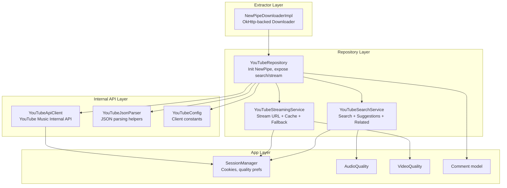
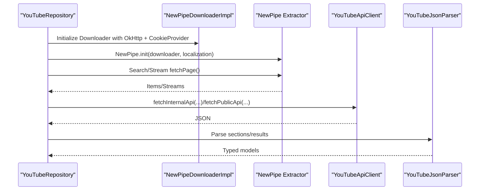
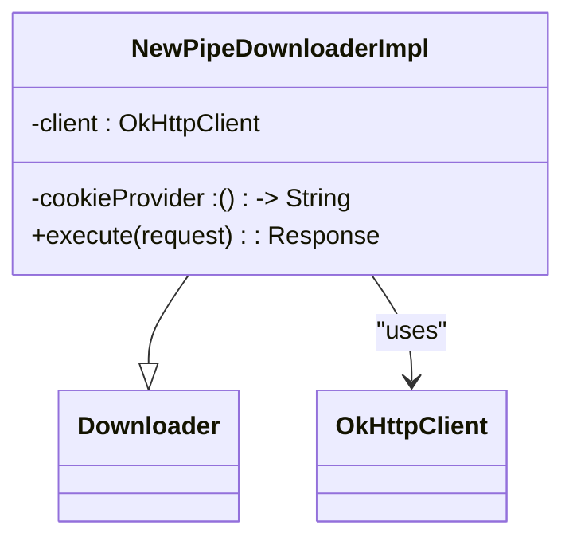
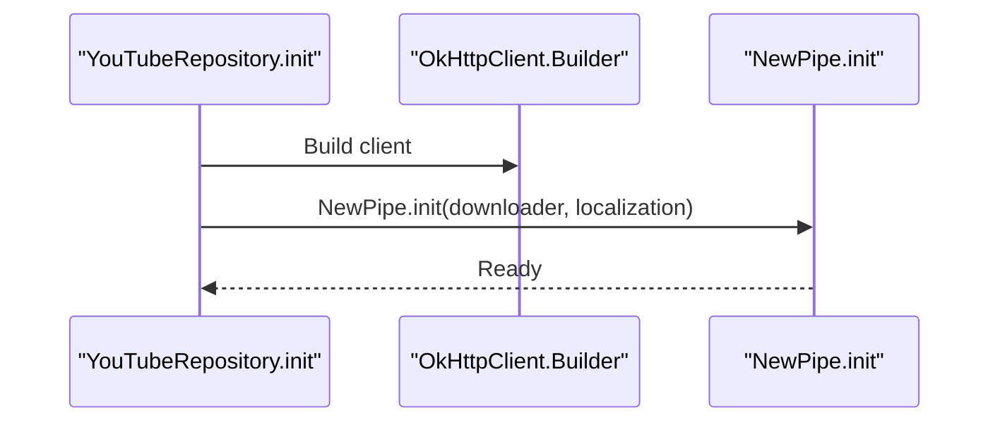
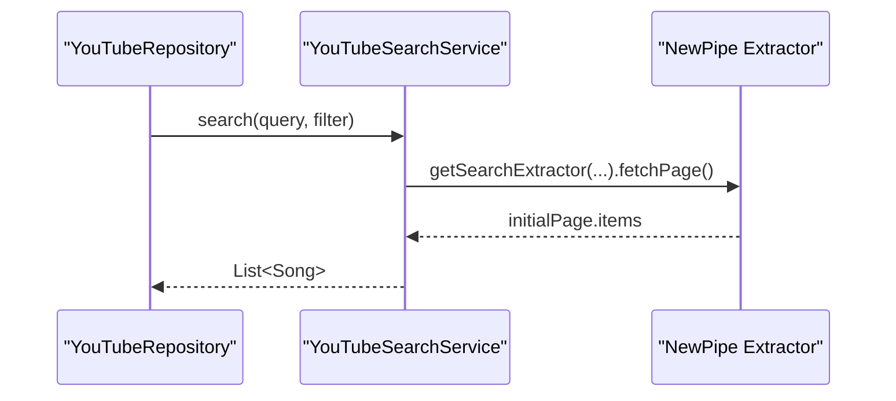
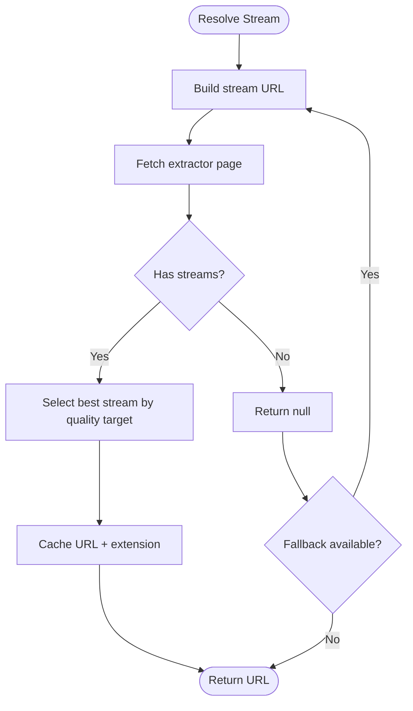
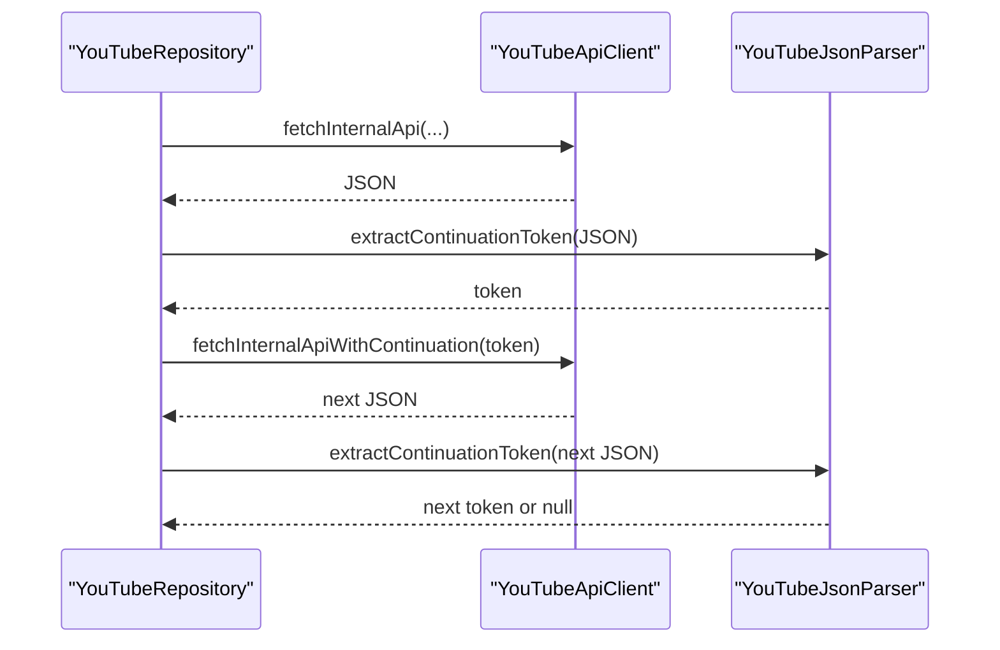
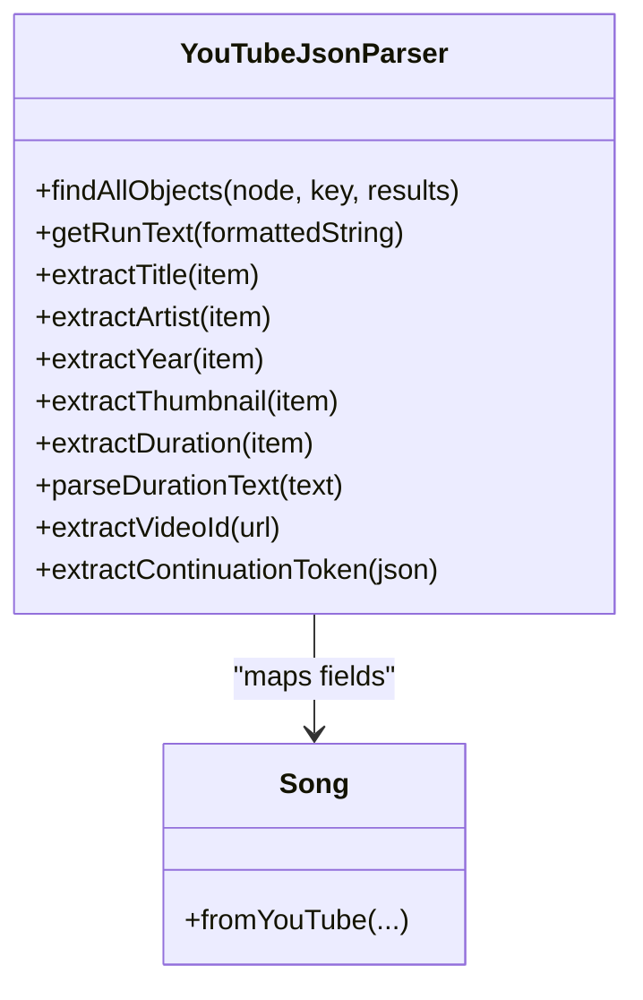
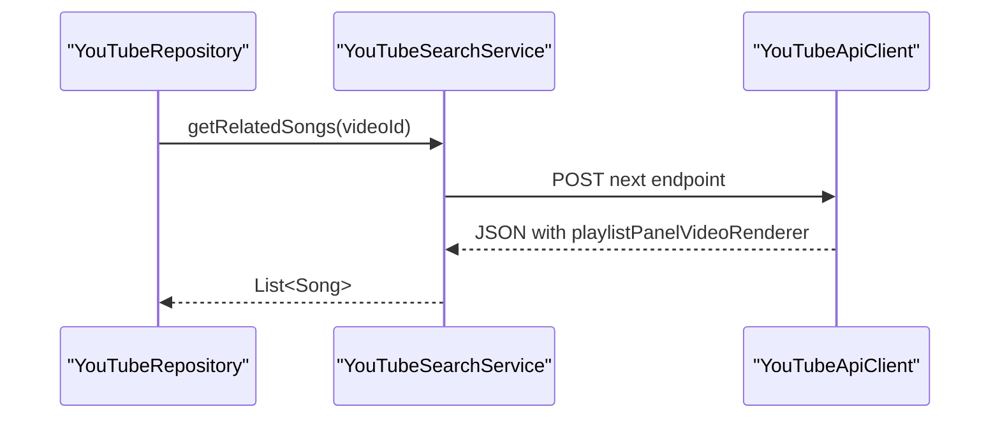
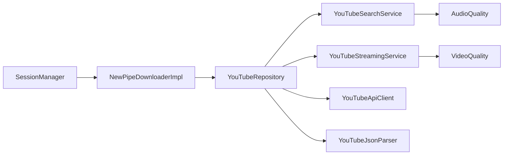

# NewPipe Extractor Integration

<cite>
**Referenced Files in This Document**
- [NewPipeDownloaderImpl.kt](file://extractor/src/main/java/com/suvojeet/suvmusic/newpipe/NewPipeDownloaderImpl.kt)
- [YouTubeRepository.kt](file://app/src/main/java/com/suvojeet/suvmusic/data/repository/YouTubeRepository.kt)
- [YouTubeSearchService.kt](file://app/src/main/java/com/suvojeet/suvmusic/data/repository/youtube/search/YouTubeSearchService.kt)
- [YouTubeStreamingService.kt](file://app/src/main/java/com/suvojeet/suvmusic/data/repository/youtube/streaming/YouTubeStreamingService.kt)
- [YouTubeApiClient.kt](file://app/src/main/java/com/suvojeet/suvmusic/data/repository/youtube/internal/YouTubeApiClient.kt)
- [YouTubeConfig.kt](file://app/src/main/java/com/suvojeet/suvmusic/data/repository/youtube/internal/YouTubeConfig.kt)
- [YouTubeJsonParser.kt](file://app/src/main/java/com/suvojeet/suvmusic/data/repository/youtube/internal/YouTubeJsonParser.kt)
- [SessionManager.kt](file://app/src/main/java/com/suvojeet/suvmusic/data/SessionManager.kt)
- [AudioQuality.kt](file://app/src/main/java/com/suvojeet/suvmusic/data/model/AudioQuality.kt)
- [VideoQuality.kt](file://app/src/main/java/com/suvojeet/suvmusic/data/model/VideoQuality.kt)
- [Comment.kt](file://app/src/main/java/com/suvojeet/suvmusic/data/model/Comment.kt)
</cite>

## Table of Contents
1. [Introduction](#introduction)
2. [Project Structure](#project-structure)
3. [Core Components](#core-components)
4. [Architecture Overview](#architecture-overview)
5. [Detailed Component Analysis](#detailed-component-analysis)
6. [Dependency Analysis](#dependency-analysis)
7. [Performance Considerations](#performance-considerations)
8. [Troubleshooting Guide](#troubleshooting-guide)
9. [Conclusion](#conclusion)

## Introduction
This document explains how SuvMusic integrates NewPipe Extractor to power YouTube content discovery and playback. It covers the custom HTTP client bridge, cookie management, localization, extractor initialization, and the orchestration between NewPipe-based search/streaming and SuvMusic’s internal YouTube Music API. It also documents metadata extraction patterns, search and pagination handling, stream resolution selection, format compatibility checks, fallback strategies, and coordination with repository services.

## Project Structure
The NewPipe integration spans three main areas:
- Custom Downloader bridge for NewPipe Extractor
- Repository orchestration coordinating NewPipe and internal APIs
- Services for search and streaming with caching and adaptive quality selection

**Diagram sources**
- [NewPipeDownloaderImpl.kt:16-112](file://extractor/src/main/java/com/suvojeet/suvmusic/newpipe/NewPipeDownloaderImpl.kt#L16-L112)
- [YouTubeRepository.kt:112-128](file://app/src/main/java/com/suvojeet/suvmusic/data/repository/YouTubeRepository.kt#L112-L128)
- [YouTubeSearchService.kt:44-82](file://app/src/main/java/com/suvojeet/suvmusic/data/repository/youtube/search/YouTubeSearchService.kt#L44-L82)
- [YouTubeStreamingService.kt:70-140](file://app/src/main/java/com/suvojeet/suvmusic/data/repository/youtube/streaming/YouTubeStreamingService.kt#L70-L140)
- [YouTubeApiClient.kt:28-72](file://app/src/main/java/com/suvojeet/suvmusic/data/repository/youtube/internal/YouTubeApiClient.kt#L28-L72)
- [YouTubeJsonParser.kt:25-41](file://app/src/main/java/com/suvojeet/suvmusic/data/repository/youtube/internal/YouTubeJsonParser.kt#L25-L41)
- [YouTubeConfig.kt:7-19](file://app/src/main/java/com/suvojeet/suvmusic/data/repository/youtube/internal/YouTubeConfig.kt#L7-L19)
- [SessionManager.kt:74-81](file://app/src/main/java/com/suvojeet/suvmusic/data/SessionManager.kt#L74-L81)
- [AudioQuality.kt:6-10](file://app/src/main/java/com/suvojeet/suvmusic/data/model/AudioQuality.kt#L6-L10)
- [VideoQuality.kt:6-10](file://app/src/main/java/com/suvojeet/suvmusic/data/model/VideoQuality.kt#L6-L10)
- [Comment.kt:3-11](file://app/src/main/java/com/suvojeet/suvmusic/data/model/Comment.kt#L3-L11)

**Section sources**
- [NewPipeDownloaderImpl.kt:16-112](file://extractor/src/main/java/com/suvojeet/suvmusic/newpipe/NewPipeDownloaderImpl.kt#L16-L112)
- [YouTubeRepository.kt:112-128](file://app/src/main/java/com/suvojeet/suvmusic/data/repository/YouTubeRepository.kt#L112-L128)

## Core Components
- NewPipeDownloaderImpl: Bridges NewPipe Extractor to OkHttp, injects cookies, sets realistic headers, and handles rate limiting.
- YouTubeRepository: Initializes NewPipe with the custom downloader and localization, exposes unified search and streaming APIs.
- YouTubeSearchService: Performs YouTube search with filters, suggestions, and related content retrieval via internal API.
- YouTubeStreamingService: Resolves audio/video streams, applies adaptive quality selection, and caches resolved URLs.
- YouTubeApiClient and YouTubeJsonParser: Handle authenticated and public internal API calls and robust JSON parsing.
- SessionManager: Provides cookies, quality preferences, and user context for authenticated flows.
- Quality models: AudioQuality and VideoQuality define bitrate/resolution targets and AUTO adaptation logic.

**Section sources**
- [YouTubeRepository.kt:112-128](file://app/src/main/java/com/suvojeet/suvmusic/data/repository/YouTubeRepository.kt#L112-L128)
- [YouTubeSearchService.kt:44-82](file://app/src/main/java/com/suvojeet/suvmusic/data/repository/youtube/search/YouTubeSearchService.kt#L44-L82)
- [YouTubeStreamingService.kt:70-140](file://app/src/main/java/com/suvojeet/suvmusic/data/repository/youtube/streaming/YouTubeStreamingService.kt#L70-L140)
- [YouTubeApiClient.kt:28-72](file://app/src/main/java/com/suvojeet/suvmusic/data/repository/youtube/internal/YouTubeApiClient.kt#L28-L72)
- [YouTubeJsonParser.kt:25-41](file://app/src/main/java/com/suvojeet/suvmusic/data/repository/youtube/internal/YouTubeJsonParser.kt#L25-L41)
- [SessionManager.kt:74-81](file://app/src/main/java/com/suvojeet/suvmusic/data/SessionManager.kt#L74-L81)
- [AudioQuality.kt:6-10](file://app/src/main/java/com/suvojeet/suvmusic/data/model/AudioQuality.kt#L6-L10)
- [VideoQuality.kt:6-10](file://app/src/main/java/com/suvojeet/suvmusic/data/model/VideoQuality.kt#L6-L10)

## Architecture Overview
SuvMusic initializes NewPipe Extractor with a custom Downloader that uses OkHttp and injects cookies from SessionManager. The repository layer coordinates:
- NewPipe-based search and related content discovery
- Streaming resolution with adaptive quality and caching
- Internal API calls for authenticated browsing and public content

**Diagram sources**
- [YouTubeRepository.kt:112-128](file://app/src/main/java/com/suvojeet/suvmusic/data/repository/YouTubeRepository.kt#L112-L128)
- [NewPipeDownloaderImpl.kt:16-112](file://extractor/src/main/java/com/suvojeet/suvmusic/newpipe/NewPipeDownloaderImpl.kt#L16-L112)
- [YouTubeApiClient.kt:28-72](file://app/src/main/java/com/suvojeet/suvmusic/data/repository/youtube/internal/YouTubeApiClient.kt#L28-L72)
- [YouTubeJsonParser.kt:25-41](file://app/src/main/java/com/suvojeet/suvmusic/data/repository/youtube/internal/YouTubeJsonParser.kt#L25-L41)

## Detailed Component Analysis

### NewPipeDownloaderImpl
Responsibilities:
- Wraps OkHttp client for NewPipe Extractor
- Injects cookies from SessionManager via cookie provider
- Sets realistic User-Agent and Accept-Language headers
- Handles 429 responses as ReCaptchaException
- Limits response body size for metadata safety
- Converts OkHttp responses to NewPipe Extractor’s Response type

Key behaviors:
- Cookie injection: Adds “Cookie” header if provider returns non-empty string
- User-Agent selection: Chooses Android-like UA for googlevideo/android endpoints, desktop UA otherwise
- Rate limiting: Throws ReCaptchaException on 429
- Safety: Enforces 10 MB limit for metadata bodies to prevent OOM

**Diagram sources**
- [NewPipeDownloaderImpl.kt:16-112](file://extractor/src/main/java/com/suvojeet/suvmusic/newpipe/NewPipeDownloaderImpl.kt#L16-L112)

**Section sources**
- [NewPipeDownloaderImpl.kt:21-112](file://extractor/src/main/java/com/suvojeet/suvmusic/newpipe/NewPipeDownloaderImpl.kt#L21-L112)

### YouTubeRepository Initialization and Orchestration
Responsibilities:
- Initializes NewPipe Extractor with custom Downloader and Localization
- Exposes unified search and streaming APIs
- Coordinates internal API calls for browsing and pagination
- Orchestrates fallbacks between NewPipe and internal API

Initialization flow:
- Builds OkHttpClient with timeouts
- Creates NewPipeDownloaderImpl with cookie provider from SessionManager
- Initializes NewPipe with downloader and localization
- De-duplicates and merges results from internal API and NewPipe

**Diagram sources**
- [YouTubeRepository.kt:106-128](file://app/src/main/java/com/suvojeet/suvmusic/data/repository/YouTubeRepository.kt#L106-L128)

**Section sources**
- [YouTubeRepository.kt:106-128](file://app/src/main/java/com/suvojeet/suvmusic/data/repository/YouTubeRepository.kt#L106-L128)

### Search Functionality and Result Parsing
Responsibilities:
- Search songs, videos, artists, playlists
- Provide search suggestions
- Retrieve related songs via internal API

Patterns:
- Uses ServiceList to obtain YouTube extractor
- Applies filters (music_songs, music_videos, music_albums, music_playlists, channels)
- Parses thumbnails, durations, and artist IDs from extractor items
- For related content, calls internal API next endpoint and parses playlist panels

**Diagram sources**
- [YouTubeSearchService.kt:44-82](file://app/src/main/java/com/suvojeet/suvmusic/data/repository/youtube/search/YouTubeSearchService.kt#L44-L82)

**Section sources**
- [YouTubeSearchService.kt:44-82](file://app/src/main/java/com/suvojeet/suvmusic/data/repository/youtube/search/YouTubeSearchService.kt#L44-L82)
- [YouTubeSearchService.kt:235-276](file://app/src/main/java/com/suvojeet/suvmusic/data/repository/youtube/search/YouTubeSearchService.kt#L235-L276)

### Stream Resolution Selection and Fallbacks
Responsibilities:
- Resolve audio URLs with adaptive bitrate selection
- Resolve video URLs with separate audio fallback or muxed streams
- Cache resolved URLs with expiration
- Apply network-aware quality adaptation

Patterns:
- Audio: Selects best stream under target bitrate; caches by audio key
- Video: Attempts separate audio+video streams first; falls back to muxed streams
- Fallback: Tries www.youtube.com and music.youtube.com URLs
- Retry: Exponential backoff with exceptions handling (e.g., ContentNotAvailable)

**Diagram sources**
- [YouTubeStreamingService.kt:91-140](file://app/src/main/java/com/suvojeet/suvmusic/data/repository/youtube/streaming/YouTubeStreamingService.kt#L91-L140)
- [YouTubeStreamingService.kt:187-270](file://app/src/main/java/com/suvojeet/suvmusic/data/repository/youtube/streaming/YouTubeStreamingService.kt#L187-L270)

**Section sources**
- [YouTubeStreamingService.kt:70-140](file://app/src/main/java/com/suvojeet/suvmusic/data/repository/youtube/streaming/YouTubeStreamingService.kt#L70-L140)
- [YouTubeStreamingService.kt:155-270](file://app/src/main/java/com/suvojeet/suvmusic/data/repository/youtube/streaming/YouTubeStreamingService.kt#L155-L270)

### Pagination Handling
Responsibilities:
- Extract continuation tokens from JSON responses
- Fetch additional pages using internal API continuation endpoint
- Merge and deduplicate results across pages

Patterns:
- Continuation extraction across multiple JSON layouts
- Iterative fetching with attempt limits
- Deduplication by ID and by title/artist fingerprint

**Diagram sources**
- [YouTubeRepository.kt:636-639](file://app/src/main/java/com/suvojeet/suvmusic/data/repository/YouTubeRepository.kt#L636-L639)
- [YouTubeJsonParser.kt:254-407](file://app/src/main/java/com/suvojeet/suvmusic/data/repository/youtube/internal/YouTubeJsonParser.kt#L254-L407)
- [YouTubeApiClient.kt:77-110](file://app/src/main/java/com/suvojeet/suvmusic/data/repository/youtube/internal/YouTubeApiClient.kt#L77-L110)

**Section sources**
- [YouTubeRepository.kt:515-536](file://app/src/main/java/com/suvojeet/suvmusic/data/repository/YouTubeRepository.kt#L515-L536)
- [YouTubeJsonParser.kt:254-407](file://app/src/main/java/com/suvojeet/suvmusic/data/repository/youtube/internal/YouTubeJsonParser.kt#L254-L407)
- [YouTubeApiClient.kt:77-110](file://app/src/main/java/com/suvojeet/suvmusic/data/repository/youtube/internal/YouTubeApiClient.kt#L77-L110)

### Metadata Extraction Patterns for YouTube Content
Responsibilities:
- Extract titles, artists, thumbnails, durations, and video IDs
- Parse structured JSON from internal API responses
- Map extractor items to Song model

Patterns:
- Title extraction from runs or fallbacks
- Artist extraction from multiple fields and subtitle parsing
- Duration parsing from multiple sources (lengthText, runs, accessibility)
- Thumbnail URL selection from highest resolution available

**Diagram sources**
- [YouTubeJsonParser.kt:25-237](file://app/src/main/java/com/suvojeet/suvmusic/data/repository/youtube/internal/YouTubeJsonParser.kt#L25-L237)
- [YouTubeJsonParser.kt:254-407](file://app/src/main/java/com/suvojeet/suvmusic/data/repository/youtube/internal/YouTubeJsonParser.kt#L254-L407)

**Section sources**
- [YouTubeJsonParser.kt:63-237](file://app/src/main/java/com/suvojeet/suvmusic/data/repository/youtube/internal/YouTubeJsonParser.kt#L63-L237)

### Comments Extraction and Related Content Discovery
Responsibilities:
- Provide Comment model for UI
- Discover related songs via internal API next endpoint
- Merge results from internal API and NewPipe extractors

Patterns:
- Comment model captures author, text, likes, replies
- Related content uses playlistId “RDAMVM + videoId” for official radio
- Merging and deduplication across sources

**Diagram sources**
- [YouTubeSearchService.kt:235-276](file://app/src/main/java/com/suvojeet/suvmusic/data/repository/youtube/search/YouTubeSearchService.kt#L235-L276)
- [YouTubeApiClient.kt:256-275](file://app/src/main/java/com/suvojeet/suvmusic/data/repository/youtube/internal/YouTubeApiClient.kt#L256-L275)

**Section sources**
- [Comment.kt:3-11](file://app/src/main/java/com/suvojeet/suvmusic/data/model/Comment.kt#L3-L11)
- [YouTubeSearchService.kt:235-276](file://app/src/main/java/com/suvojeet/suvmusic/data/repository/youtube/search/YouTubeSearchService.kt#L235-L276)

### Cookie Management and Authentication
Responsibilities:
- Provide cookies to NewPipe Downloader
- Use cookies and Authorization headers for internal API calls
- Respect user authentication state

Patterns:
- Downloader receives cookieProvider lambda
- Internal API requests attach Cookie and Authorization headers
- SessionManager stores and retrieves cookies and user preferences

**Section sources**
- [NewPipeDownloaderImpl.kt:44-49](file://extractor/src/main/java/com/suvojeet/suvmusic/newpipe/NewPipeDownloaderImpl.kt#L44-L49)
- [YouTubeApiClient.kt:38-65](file://app/src/main/java/com/suvojeet/suvmusic/data/repository/youtube/internal/YouTubeApiClient.kt#L38-L65)
- [SessionManager.kt:74-81](file://app/src/main/java/com/suvojeet/suvmusic/data/SessionManager.kt#L74-L81)

### Localization and Client Configuration
Responsibilities:
- Set NewPipe localization during initialization
- Configure client names and versions for internal API
- Manage language and region preferences

Patterns:
- Localization passed to NewPipe.init
- ClientName/ClientVersion constants used across internal API calls
- Language code mapping for user preferences

**Section sources**
- [YouTubeRepository.kt:119-121](file://app/src/main/java/com/suvojeet/suvmusic/data/repository/YouTubeRepository.kt#L119-L121)
- [YouTubeConfig.kt:7-19](file://app/src/main/java/com/suvojeet/suvmusic/data/repository/youtube/internal/YouTubeConfig.kt#L7-L19)
- [YouTubeRepository.kt:75-89](file://app/src/main/java/com/suvojeet/suvmusic/data/repository/YouTubeRepository.kt#L75-L89)

## Dependency Analysis
Key dependencies and relationships:
- NewPipeDownloaderImpl depends on OkHttp and SessionManager cookies
- YouTubeRepository orchestrates NewPipe, internal API, and parsers
- YouTubeSearchService and YouTubeStreamingService depend on NewPipe Extractor
- YouTubeApiClient depends on SessionManager for cookies and Authorization
- Quality enums drive adaptive selection in streaming service

**Diagram sources**
- [SessionManager.kt:74-81](file://app/src/main/java/com/suvojeet/suvmusic/data/SessionManager.kt#L74-L81)
- [NewPipeDownloaderImpl.kt:16-19](file://extractor/src/main/java/com/suvojeet/suvmusic/newpipe/NewPipeDownloaderImpl.kt#L16-L19)
- [YouTubeRepository.kt:52-62](file://app/src/main/java/com/suvojeet/suvmusic/data/repository/YouTubeRepository.kt#L52-L62)
- [YouTubeSearchService.kt:27-31](file://app/src/main/java/com/suvojeet/suvmusic/data/repository/youtube/search/YouTubeSearchService.kt#L27-L31)
- [YouTubeStreamingService.kt:20-23](file://app/src/main/java/com/suvojeet/suvmusic/data/repository/youtube/streaming/YouTubeStreamingService.kt#L20-L23)
- [YouTubeApiClient.kt:17-20](file://app/src/main/java/com/suvojeet/suvmusic/data/repository/youtube/internal/YouTubeApiClient.kt#L17-L20)
- [YouTubeJsonParser.kt](file://app/src/main/java/com/suvojeet/suvmusic/data/repository/youtube/internal/YouTubeJsonParser.kt#L21)
- [AudioQuality.kt:6-10](file://app/src/main/java/com/suvojeet/suvmusic/data/model/AudioQuality.kt#L6-L10)
- [VideoQuality.kt:6-10](file://app/src/main/java/com/suvojeet/suvmusic/data/model/VideoQuality.kt#L6-L10)

**Section sources**
- [YouTubeRepository.kt:52-62](file://app/src/main/java/com/suvojeet/suvmusic/data/repository/YouTubeRepository.kt#L52-L62)
- [YouTubeSearchService.kt:27-31](file://app/src/main/java/com/suvojeet/suvmusic/data/repository/youtube/search/YouTubeSearchService.kt#L27-L31)
- [YouTubeStreamingService.kt:20-23](file://app/src/main/java/com/suvojeet/suvmusic/data/repository/youtube/streaming/YouTubeStreamingService.kt#L20-L23)

## Performance Considerations
- Downloader safety: 10 MB response size limit for metadata to prevent OOM
- Stream caching: LruCache with 3-hour expiry reduces repeated resolution
- Adaptive quality: AUTO selects higher quality on Wi-Fi, lower on cellular
- Retry with backoff: Reduces transient failures for stream resolution
- Pagination limits: Cap continuation fetches to avoid excessive network usage

[No sources needed since this section provides general guidance]

## Troubleshooting Guide
Common issues and strategies:
- Rate limiting: Downloader throws ReCaptchaException on 429; consider retry/backoff or reduced frequency
- Content not available: Extractor exceptions are caught and retried with backoff
- Empty results: Repository merges internal API and NewPipe results; verify filters and pagination
- Authentication errors: Ensure cookies are present and Authorization header is set for internal API calls

**Section sources**
- [NewPipeDownloaderImpl.kt:72-74](file://extractor/src/main/java/com/suvojeet/suvmusic/newpipe/NewPipeDownloaderImpl.kt#L72-L74)
- [YouTubeStreamingService.kt:49-53](file://app/src/main/java/com/suvojeet/suvmusic/data/repository/youtube/streaming/YouTubeStreamingService.kt#L49-L53)
- [YouTubeApiClient.kt:277-288](file://app/src/main/java/com/suvojeet/suvmusic/data/repository/youtube/internal/YouTubeApiClient.kt#L277-L288)

## Conclusion
SuvMusic integrates NewPipe Extractor through a custom OkHttp-backed Downloader, enabling robust YouTube search and streaming while leveraging authenticated internal API calls for browsing and recommendations. The design emphasizes adaptive quality, caching, and graceful fallbacks, ensuring reliable playback and discovery across varied network conditions.