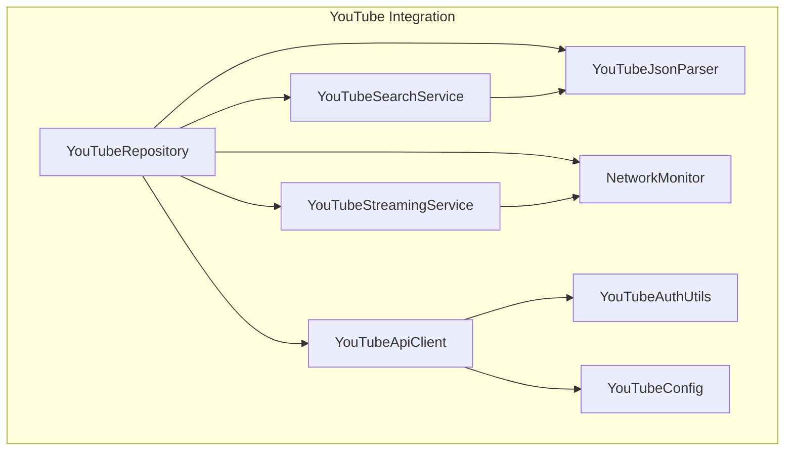
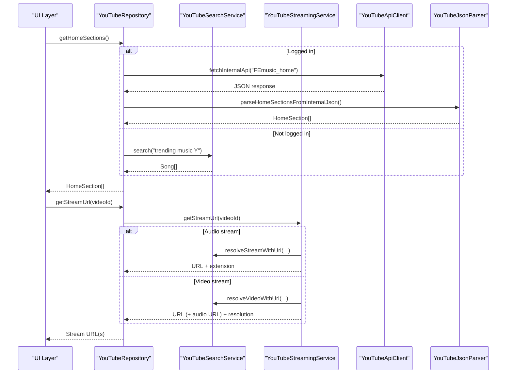
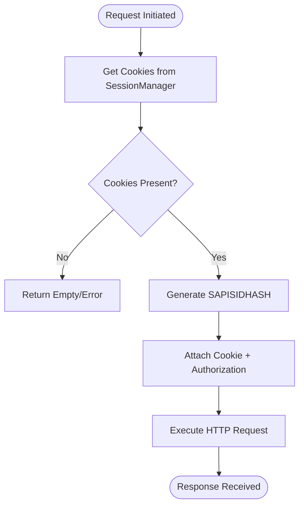
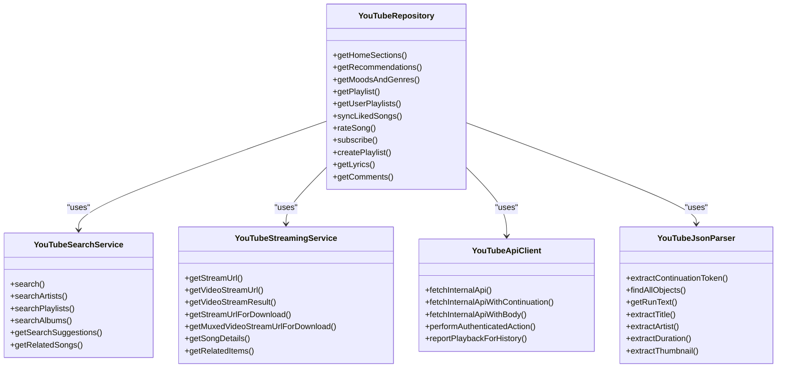
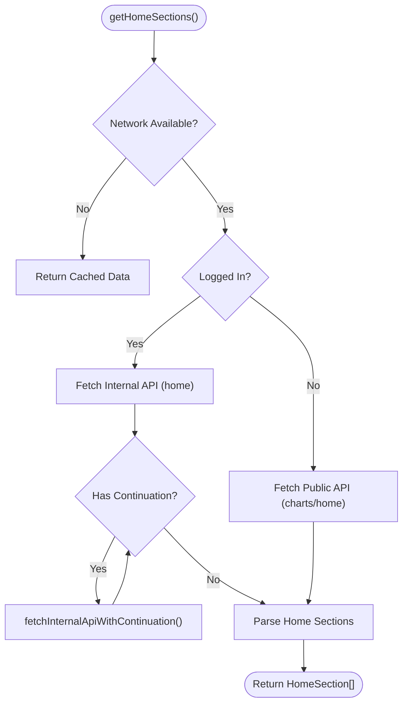
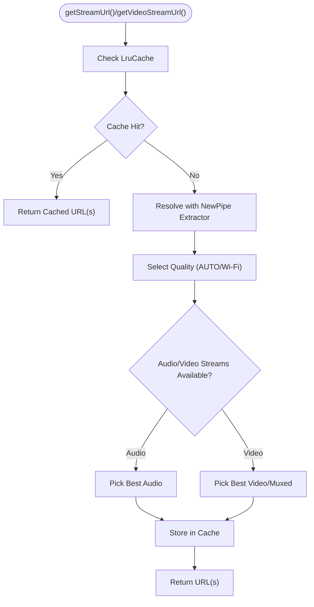
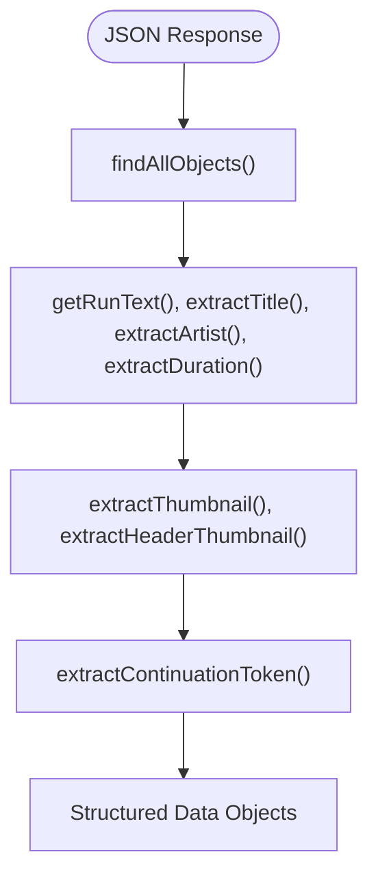
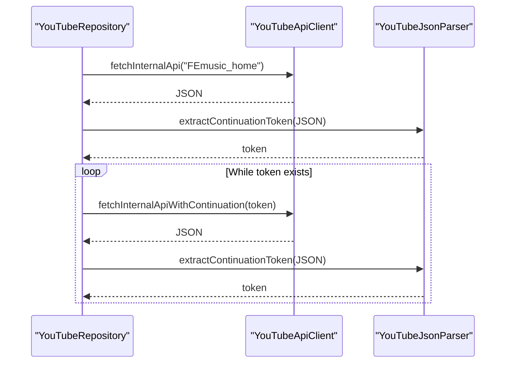
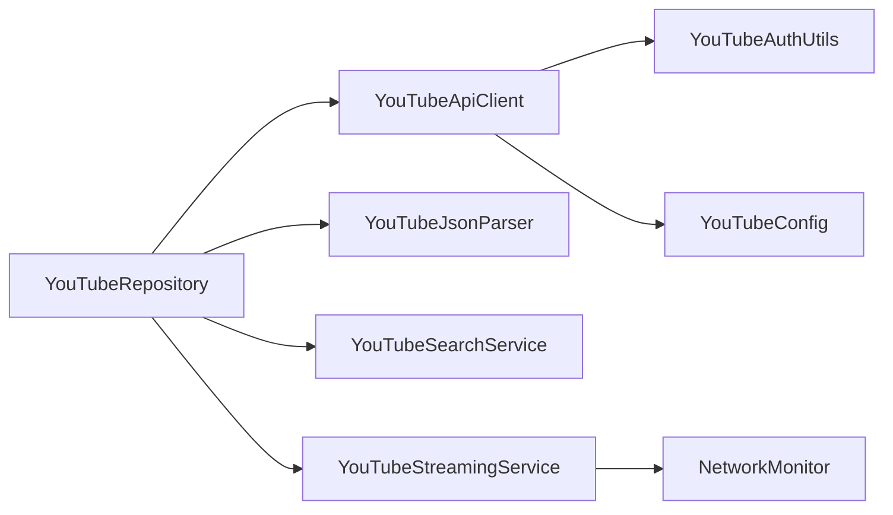

# YouTube Integration

<cite>
**Referenced Files in This Document**
- [YouTubeApiClient.kt](file://app/src/main/java/com/suvojeet/suvmusic/data/repository/youtube/internal/YouTubeApiClient.kt)
- [YouTubeJsonParser.kt](file://app/src/main/java/com/suvojeet/suvmusic/data/repository/youtube/internal/YouTubeJsonParser.kt)
- [YouTubeConfig.kt](file://app/src/main/java/com/suvojeet/suvmusic/data/repository/youtube/internal/YouTubeConfig.kt)
- [YouTubeAuthUtils.kt](file://app/src/main/java/com/suvojeet/suvmusic/data/YouTubeAuthUtils.kt)
- [YouTubeSearchService.kt](file://app/src/main/java/com/suvojeet/suvmusic/data/repository/youtube/search/YouTubeSearchService.kt)
- [YouTubeStreamingService.kt](file://app/src/main/java/com/suvojeet/suvmusic/data/repository/youtube/streaming/YouTubeStreamingService.kt)
- [YouTubeRepository.kt](file://app/src/main/java/com/suvojeet/suvmusic/data/repository/YouTubeRepository.kt)
- [NetworkMonitor.kt](file://app/src/main/java/com/suvojeet/suvmusic/util/NetworkMonitor.kt)
- [HomeSection.kt](file://app/src/main/java/com/suvojeet/suvmusic/data/model/HomeSection.kt)
- [AudioQuality.kt](file://app/src/main/java/com/suvojeet/suvmusic/data/model/AudioQuality.kt)
- [VideoQuality.kt](file://app/src/main/java/com/suvojeet/suvmusic/data/model/VideoQuality.kt)
</cite>

## Table of Contents
1. [Introduction](#introduction)
2. [Project Structure](#project-structure)
3. [Core Components](#core-components)
4. [Architecture Overview](#architecture-overview)
5. [Detailed Component Analysis](#detailed-component-analysis)
6. [Dependency Analysis](#dependency-analysis)
7. [Performance Considerations](#performance-considerations)
8. [Troubleshooting Guide](#troubleshooting-guide)
9. [Conclusion](#conclusion)

## Introduction
This document explains the YouTube Music integration in SuvMusic, detailing the dual-API approach: NewPipe Extractor for metadata and streaming, and YouTube’s internal API for browsing and personalization. It covers authentication via cookies and Authorization headers, the repository pattern with dedicated services, content discovery (home sections, moods, recommendations), stream quality selection and fallbacks, metadata extraction, pagination with continuations, caching strategies, and error handling.

## Project Structure
The YouTube integration is organized around a repository pattern:
- Internal API client and parser under youtube/internal
- Specialized services for search and streaming under youtube/search and youtube/streaming
- A central repository orchestrating both services and managing offline-first behavior
- Supporting models and utilities for quality, sections, and network monitoring

**Diagram sources**
- [YouTubeRepository.kt:52-62](file://app/src/main/java/com/suvojeet/suvmusic/data/repository/YouTubeRepository.kt#L52-L62)
- [YouTubeApiClient.kt:17-20](file://app/src/main/java/com/suvojeet/suvmusic/data/repository/youtube/internal/YouTubeApiClient.kt#L17-L20)
- [YouTubeJsonParser.kt:21-21](file://app/src/main/java/com/suvojeet/suvmusic/data/repository/youtube/internal/YouTubeJsonParser.kt#L21-L21)
- [YouTubeSearchService.kt:27-31](file://app/src/main/java/com/suvojeet/suvmusic/data/repository/youtube/search/YouTubeSearchService.kt#L27-L31)
- [YouTubeStreamingService.kt:20-27](file://app/src/main/java/com/suvojeet/suvmusic/data/repository/youtube/streaming/YouTubeStreamingService.kt#L20-L27)
- [YouTubeConfig.kt:7-19](file://app/src/main/java/com/suvojeet/suvmusic/data/repository/youtube/internal/YouTubeConfig.kt#L7-L19)
- [YouTubeAuthUtils.kt:8-35](file://app/src/main/java/com/suvojeet/suvmusic/data/YouTubeAuthUtils.kt#L8-L35)
- [NetworkMonitor.kt:20-25](file://app/src/main/java/com/suvojeet/suvmusic/util/NetworkMonitor.kt#L20-L25)

**Section sources**
- [YouTubeRepository.kt:52-62](file://app/src/main/java/com/suvojeet/suvmusic/data/repository/YouTubeRepository.kt#L52-L62)
- [YouTubeApiClient.kt:17-20](file://app/src/main/java/com/suvojeet/suvmusic/data/repository/youtube/internal/YouTubeApiClient.kt#L17-L20)
- [YouTubeJsonParser.kt:21-21](file://app/src/main/java/com/suvojeet/suvmusic/data/repository/youtube/internal/YouTubeJsonParser.kt#L21-L21)
- [YouTubeSearchService.kt:27-31](file://app/src/main/java/com/suvojeet/suvmusic/data/repository/youtube/search/YouTubeSearchService.kt#L27-L31)
- [YouTubeStreamingService.kt:20-27](file://app/src/main/java/com/suvojeet/suvmusic/data/repository/youtube/streaming/YouTubeStreamingService.kt#L20-L27)
- [YouTubeConfig.kt:7-19](file://app/src/main/java/com/suvojeet/suvmusic/data/repository/youtube/internal/YouTubeConfig.kt#L7-L19)
- [YouTubeAuthUtils.kt:8-35](file://app/src/main/java/com/suvojeet/suvmusic/data/YouTubeAuthUtils.kt#L8-L35)
- [NetworkMonitor.kt:20-25](file://app/src/main/java/com/suvojeet/suvmusic/util/NetworkMonitor.kt#L20-L25)

## Core Components
- YouTubeApiClient: Builds and executes authenticated and public YouTube Music API requests, handles continuations, and reports playback history.
- YouTubeJsonParser: Robust JSON traversal and extraction utilities for titles, artists, durations, thumbnails, and continuation tokens.
- YouTubeSearchService: Implements search across songs, artists, playlists, albums, and related content using NewPipe Extractor; includes search suggestions and “Up Next” via internal API.
- YouTubeStreamingService: Resolves audio/video streams with adaptive quality selection, caching, and retry/backoff; supports download-quality selection and muxed vs. separate audio/video.
- YouTubeRepository: Orchestrates browsing/home sections, moods/genres, playlists, library sync, and mutating actions; implements offline-first and pagination with continuations.
- YouTubeAuthUtils: Generates SAPISIDHASH authorization headers from cookies.
- YouTubeConfig: Centralizes client identifiers and base URLs.
- NetworkMonitor: Provides connectivity state and Wi-Fi detection for adaptive behavior.

**Section sources**
- [YouTubeApiClient.kt:17-72](file://app/src/main/java/com/suvojeet/suvmusic/data/repository/youtube/internal/YouTubeApiClient.kt#L17-L72)
- [YouTubeJsonParser.kt:21-453](file://app/src/main/java/com/suvojeet/suvmusic/data/repository/youtube/internal/YouTubeJsonParser.kt#L21-L453)
- [YouTubeSearchService.kt:27-371](file://app/src/main/java/com/suvojeet/suvmusic/data/repository/youtube/search/YouTubeSearchService.kt#L27-L371)
- [YouTubeStreamingService.kt:20-390](file://app/src/main/java/com/suvojeet/suvmusic/data/repository/youtube/streaming/YouTubeStreamingService.kt#L20-L390)
- [YouTubeRepository.kt:52-62](file://app/src/main/java/com/suvojeet/suvmusic/data/repository/YouTubeRepository.kt#L52-L62)
- [YouTubeAuthUtils.kt:8-35](file://app/src/main/java/com/suvojeet/suvmusic/data/YouTubeAuthUtils.kt#L8-L35)
- [YouTubeConfig.kt:7-19](file://app/src/main/java/com/suvojeet/suvmusic/data/repository/youtube/internal/YouTubeConfig.kt#L7-L19)
- [NetworkMonitor.kt:20-97](file://app/src/main/java/com/suvojeet/suvmusic/util/NetworkMonitor.kt#L20-L97)

## Architecture Overview
SuvMusic integrates YouTube Music through a hybrid approach:
- NewPipe Extractor for metadata extraction, search, and streaming details
- YouTube internal API for personalized browsing, home sections, moods, and library synchronization
- Cookie-based authentication with SAPISIDHASH generation
- Offline-first caching and atomic playlist replacement for liked songs

**Diagram sources**
- [YouTubeRepository.kt:407-546](file://app/src/main/java/com/suvojeet/suvmusic/data/repository/YouTubeRepository.kt#L407-L546)
- [YouTubeSearchService.kt:44-82](file://app/src/main/java/com/suvojeet/suvmusic/data/repository/youtube/search/YouTubeSearchService.kt#L44-L82)
- [YouTubeStreamingService.kt:70-140](file://app/src/main/java/com/suvojeet/suvmusic/data/repository/youtube/streaming/YouTubeStreamingService.kt#L70-L140)
- [YouTubeApiClient.kt:28-72](file://app/src/main/java/com/suvojeet/suvmusic/data/repository/youtube/internal/YouTubeApiClient.kt#L28-L72)
- [YouTubeJsonParser.kt:454-544](file://app/src/main/java/com/suvojeet/suvmusic/data/repository/youtube/internal/YouTubeJsonParser.kt#L454-L544)

## Detailed Component Analysis

### Authentication and Authorization
- Cookie-based sessions are retrieved from the session manager and attached to requests.
- Authorization header is generated using SAPISIDHASH with a timestamp and origin.
- Authenticated actions (like, subscribe, playlist edits) use the Authorization header and Cookie.

**Diagram sources**
- [YouTubeAuthUtils.kt:20-34](file://app/src/main/java/com/suvojeet/suvmusic/data/YouTubeAuthUtils.kt#L20-L34)
- [YouTubeApiClient.kt:29-65](file://app/src/main/java/com/suvojeet/suvmusic/data/repository/youtube/internal/YouTubeApiClient.kt#L29-L65)

**Section sources**
- [YouTubeAuthUtils.kt:8-35](file://app/src/main/java/com/suvojeet/suvmusic/data/YouTubeAuthUtils.kt#L8-L35)
- [YouTubeApiClient.kt:28-72](file://app/src/main/java/com/suvojeet/suvmusic/data/repository/youtube/internal/YouTubeApiClient.kt#L28-L72)

### Repository Pattern and Services
- YouTubeRepository orchestrates:
  - Home sections and recommendations (personalized and public)
  - Moods and genres browsing
  - Playlist retrieval and pagination
  - Library sync for liked songs
  - Mutating actions (likes, subscriptions, playlist edits)
  - Lyrics and comments retrieval
- YouTubeSearchService uses NewPipe Extractor for search and related content.
- YouTubeStreamingService resolves streams with adaptive quality and caching.

**Diagram sources**
- [YouTubeRepository.kt:52-62](file://app/src/main/java/com/suvojeet/suvmusic/data/repository/YouTubeRepository.kt#L52-L62)
- [YouTubeSearchService.kt:27-31](file://app/src/main/java/com/suvojeet/suvmusic/data/repository/youtube/search/YouTubeSearchService.kt#L27-L31)
- [YouTubeStreamingService.kt:20-27](file://app/src/main/java/com/suvojeet/suvmusic/data/repository/youtube/streaming/YouTubeStreamingService.kt#L20-L27)
- [YouTubeApiClient.kt:17-20](file://app/src/main/java/com/suvojeet/suvmusic/data/repository/youtube/internal/YouTubeApiClient.kt#L17-L20)
- [YouTubeJsonParser.kt:21-41](file://app/src/main/java/com/suvojeet/suvmusic/data/repository/youtube/internal/YouTubeJsonParser.kt#L21-L41)

**Section sources**
- [YouTubeRepository.kt:52-62](file://app/src/main/java/com/suvojeet/suvmusic/data/repository/YouTubeRepository.kt#L52-L62)
- [YouTubeSearchService.kt:27-31](file://app/src/main/java/com/suvojeet/suvmusic/data/repository/youtube/search/YouTubeSearchService.kt#L27-L31)
- [YouTubeStreamingService.kt:20-27](file://app/src/main/java/com/suvojeet/suvmusic/data/repository/youtube/streaming/YouTubeStreamingService.kt#L20-L27)
- [YouTubeApiClient.kt:17-20](file://app/src/main/java/com/suvojeet/suvmusic/data/repository/youtube/internal/YouTubeApiClient.kt#L17-L20)
- [YouTubeJsonParser.kt:21-41](file://app/src/main/java/com/suvojeet/suvmusic/data/repository/youtube/internal/YouTubeJsonParser.kt#L21-L41)

### Content Discovery: Home Sections, Moods, Recommendations
- Personalized home sections: Uses internal API home endpoint and extracts sections; supports continuation pagination.
- Public home fallback: Without authentication, fetches public browse and charts.
- Moods and genres: Retrieves category grid and maps to curated content or fallback searches.
- Recommendations: Prioritizes personalized “Quick picks” and “Listen again,” with fallbacks to liked music and trending.

**Diagram sources**
- [YouTubeRepository.kt:407-546](file://app/src/main/java/com/suvojeet/suvmusic/data/repository/YouTubeRepository.kt#L407-L546)
- [YouTubeApiClient.kt:77-110](file://app/src/main/java/com/suvojeet/suvmusic/data/repository/youtube/internal/YouTubeApiClient.kt#L77-L110)
- [YouTubeJsonParser.kt:254-407](file://app/src/main/java/com/suvojeet/suvmusic/data/repository/youtube/internal/YouTubeJsonParser.kt#L254-L407)

**Section sources**
- [YouTubeRepository.kt:407-546](file://app/src/main/java/com/suvojeet/suvmusic/data/repository/YouTubeRepository.kt#L407-L546)
- [YouTubeApiClient.kt:77-110](file://app/src/main/java/com/suvojeet/suvmusic/data/repository/youtube/internal/YouTubeApiClient.kt#L77-L110)
- [YouTubeJsonParser.kt:254-407](file://app/src/main/java/com/suvojeet/suvmusic/data/repository/youtube/internal/YouTubeJsonParser.kt#L254-L407)

### Stream Quality Selection and Fallbacks
- Audio quality: Selects target bitrate based on user preference and network state; caches resolved URLs with expiration.
- Video quality: Chooses between separate audio+video streams or muxed streams depending on availability and preference.
- Fallbacks: Falls back from www to music domain; retries with exponential backoff; handles unavailable content gracefully.

**Diagram sources**
- [YouTubeStreamingService.kt:70-140](file://app/src/main/java/com/suvojeet/suvmusic/data/repository/youtube/streaming/YouTubeStreamingService.kt#L70-L140)
- [YouTubeStreamingService.kt:155-270](file://app/src/main/java/com/suvojeet/suvmusic/data/repository/youtube/streaming/YouTubeStreamingService.kt#L155-L270)
- [AudioQuality.kt:6-18](file://app/src/main/java/com/suvojeet/suvmusic/data/model/AudioQuality.kt#L6-L18)
- [VideoQuality.kt:6-17](file://app/src/main/java/com/suvojeet/suvmusic/data/model/VideoQuality.kt#L6-L17)

**Section sources**
- [YouTubeStreamingService.kt:70-140](file://app/src/main/java/com/suvojeet/suvmusic/data/repository/youtube/streaming/YouTubeStreamingService.kt#L70-L140)
- [YouTubeStreamingService.kt:155-270](file://app/src/main/java/com/suvojeet/suvmusic/data/repository/youtube/streaming/YouTubeStreamingService.kt#L155-L270)
- [AudioQuality.kt:6-18](file://app/src/main/java/com/suvojeet/suvmusic/data/model/AudioQuality.kt#L6-L18)
- [VideoQuality.kt:6-17](file://app/src/main/java/com/suvojeet/suvmusic/data/model/VideoQuality.kt#L6-L17)

### Metadata Extraction and Parsing
- Titles, artists, subtitles, years, thumbnails, and durations are extracted using robust JSON traversal helpers.
- Continuation tokens are parsed from multiple possible locations to support pagination.
- Account menu parsing supports account listing and selection.

**Diagram sources**
- [YouTubeJsonParser.kt:25-54](file://app/src/main/java/com/suvojeet/suvmusic/data/repository/youtube/internal/YouTubeJsonParser.kt#L25-L54)
- [YouTubeJsonParser.kt:63-211](file://app/src/main/java/com/suvojeet/suvmusic/data/repository/youtube/internal/YouTubeJsonParser.kt#L63-L211)
- [YouTubeJsonParser.kt:254-452](file://app/src/main/java/com/suvojeet/suvmusic/data/repository/youtube/internal/YouTubeJsonParser.kt#L254-L452)

**Section sources**
- [YouTubeJsonParser.kt:25-54](file://app/src/main/java/com/suvojeet/suvmusic/data/repository/youtube/internal/YouTubeJsonParser.kt#L25-L54)
- [YouTubeJsonParser.kt:63-211](file://app/src/main/java/com/suvojeet/suvmusic/data/repository/youtube/internal/YouTubeJsonParser.kt#L63-L211)
- [YouTubeJsonParser.kt:254-452](file://app/src/main/java/com/suvojeet/suvmusic/data/repository/youtube/internal/YouTubeJsonParser.kt#L254-L452)

### Pagination and Caching Strategies
- Continuation-based pagination: Extracts continuation tokens from nested JSON structures and iteratively fetches more content.
- Caching: LruCache stores resolved stream URLs with timestamps; cache keys differentiate audio/video and qualities.
- Offline-first: Returns cached playlists and liked songs when offline; syncs upon reconnect.

**Diagram sources**
- [YouTubeRepository.kt:515-536](file://app/src/main/java/com/suvojeet/suvmusic/data/repository/YouTubeRepository.kt#L515-L536)
- [YouTubeApiClient.kt:77-110](file://app/src/main/java/com/suvojeet/suvmusic/data/repository/youtube/internal/YouTubeApiClient.kt#L77-L110)
- [YouTubeJsonParser.kt:254-407](file://app/src/main/java/com/suvojeet/suvmusic/data/repository/youtube/internal/YouTubeJsonParser.kt#L254-L407)

**Section sources**
- [YouTubeRepository.kt:515-536](file://app/src/main/java/com/suvojeet/suvmusic/data/repository/YouTubeRepository.kt#L515-L536)
- [YouTubeApiClient.kt:77-110](file://app/src/main/java/com/suvojeet/suvmusic/data/repository/youtube/internal/YouTubeApiClient.kt#L77-L110)
- [YouTubeJsonParser.kt:254-407](file://app/src/main/java/com/suvojeet/suvmusic/data/repository/youtube/internal/YouTubeJsonParser.kt#L254-L407)

### Error Handling and Retry Mechanisms
- Retry with exponential backoff for stream resolution; stops retrying on specific “not available” exceptions.
- Network checks via NetworkMonitor; graceful degradation to cached/offline data.
- Logging of errors and unsuccessful responses for diagnostics.

**Section sources**
- [YouTubeStreamingService.kt:37-64](file://app/src/main/java/com/suvojeet/suvmusic/data/repository/youtube/streaming/YouTubeStreamingService.kt#L37-L64)
- [NetworkMonitor.kt:29-76](file://app/src/main/java/com/suvojeet/suvmusic/util/NetworkMonitor.kt#L29-L76)
- [YouTubeApiClient.kt:277-288](file://app/src/main/java/com/suvojeet/suvmusic/data/repository/youtube/internal/YouTubeApiClient.kt#L277-L288)

## Dependency Analysis
- Coupling: YouTubeRepository depends on YouTubeApiClient, YouTubeJsonParser, YouTubeSearchService, and YouTubeStreamingService.
- Cohesion: Each service encapsulates a distinct responsibility (search, streaming, API calls, parsing).
- External dependencies: OkHttp for HTTP, NewPipe Extractor for metadata and streaming, JSON parsing utilities.

**Diagram sources**
- [YouTubeRepository.kt:52-62](file://app/src/main/java/com/suvojeet/suvmusic/data/repository/YouTubeRepository.kt#L52-L62)
- [YouTubeApiClient.kt:17-20](file://app/src/main/java/com/suvojeet/suvmusic/data/repository/youtube/internal/YouTubeApiClient.kt#L17-L20)
- [YouTubeAuthUtils.kt:8-35](file://app/src/main/java/com/suvojeet/suvmusic/data/YouTubeAuthUtils.kt#L8-L35)
- [YouTubeConfig.kt:7-19](file://app/src/main/java/com/suvojeet/suvmusic/data/repository/youtube/internal/YouTubeConfig.kt#L7-L19)
- [YouTubeStreamingService.kt:20-27](file://app/src/main/java/com/suvojeet/suvmusic/data/repository/youtube/streaming/YouTubeStreamingService.kt#L20-L27)
- [NetworkMonitor.kt:20-25](file://app/src/main/java/com/suvojeet/suvmusic/util/NetworkMonitor.kt#L20-L25)

**Section sources**
- [YouTubeRepository.kt:52-62](file://app/src/main/java/com/suvojeet/suvmusic/data/repository/YouTubeRepository.kt#L52-L62)
- [YouTubeApiClient.kt:17-20](file://app/src/main/java/com/suvojeet/suvmusic/data/repository/youtube/internal/YouTubeApiClient.kt#L17-L20)
- [YouTubeAuthUtils.kt:8-35](file://app/src/main/java/com/suvojeet/suvmusic/data/YouTubeAuthUtils.kt#L8-L35)
- [YouTubeConfig.kt:7-19](file://app/src/main/java/com/suvojeet/suvmusic/data/repository/youtube/internal/YouTubeConfig.kt#L7-L19)
- [YouTubeStreamingService.kt:20-27](file://app/src/main/java/com/suvojeet/suvmusic/data/repository/youtube/streaming/YouTubeStreamingService.kt#L20-L27)
- [NetworkMonitor.kt:20-25](file://app/src/main/java/com/suvojeet/suvmusic/util/NetworkMonitor.kt#L20-L25)

## Performance Considerations
- Adaptive quality: Uses Wi-Fi detection to adjust default quality for video and audio.
- Caching: LruCache reduces repeated extraction and network calls for stream URLs.
- Pagination limits: Constrains continuation loops to prevent excessive network usage.
- Atomic playlist replacement: Minimizes UI flicker and database churn during liked songs sync.

[No sources needed since this section provides general guidance]

## Troubleshooting Guide
- Authentication failures: Verify cookies and SAPISIDHASH generation; ensure X-Goog-AuthUser header alignment.
- Stream resolution errors: Check retry logs and network conditions; confirm extractor availability.
- Pagination stalls: Validate continuation token extraction across multiple JSON layouts.
- Playback history reporting: Ensure both playback and watchtime tracking URLs are present and reachable.

**Section sources**
- [YouTubeAuthUtils.kt:20-34](file://app/src/main/java/com/suvojeet/suvmusic/data/YouTubeAuthUtils.kt#L20-L34)
- [YouTubeApiClient.kt:312-413](file://app/src/main/java/com/suvojeet/suvmusic/data/repository/youtube/internal/YouTubeApiClient.kt#L312-L413)
- [YouTubeJsonParser.kt:254-407](file://app/src/main/java/com/suvojeet/suvmusic/data/repository/youtube/internal/YouTubeJsonParser.kt#L254-L407)
- [YouTubeStreamingService.kt:37-64](file://app/src/main/java/com/suvojeet/suvmusic/data/repository/youtube/streaming/YouTubeStreamingService.kt#L37-L64)

## Conclusion
SuvMusic’s YouTube integration combines NewPipe Extractor for robust metadata and streaming with YouTube’s internal API for personalized content and library features. The repository pattern cleanly separates concerns, while authentication, pagination, caching, and retry mechanisms ensure reliability and performance across varied network conditions.