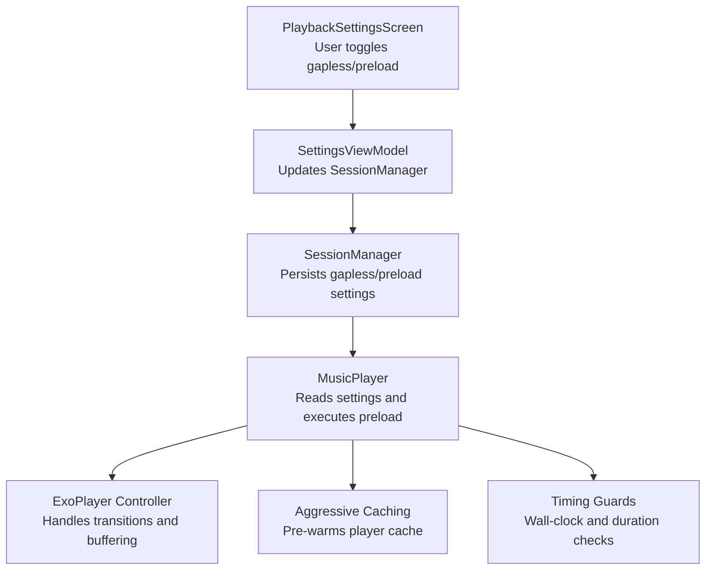
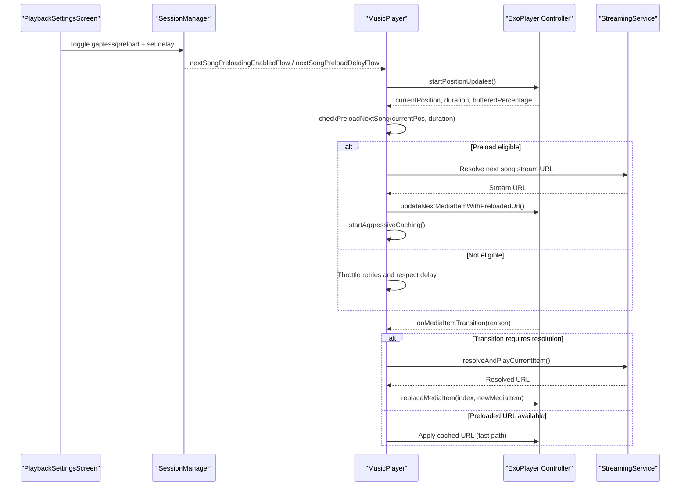
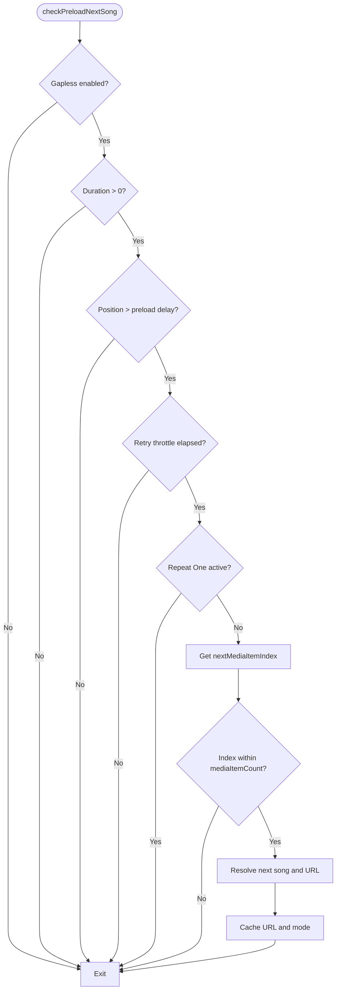
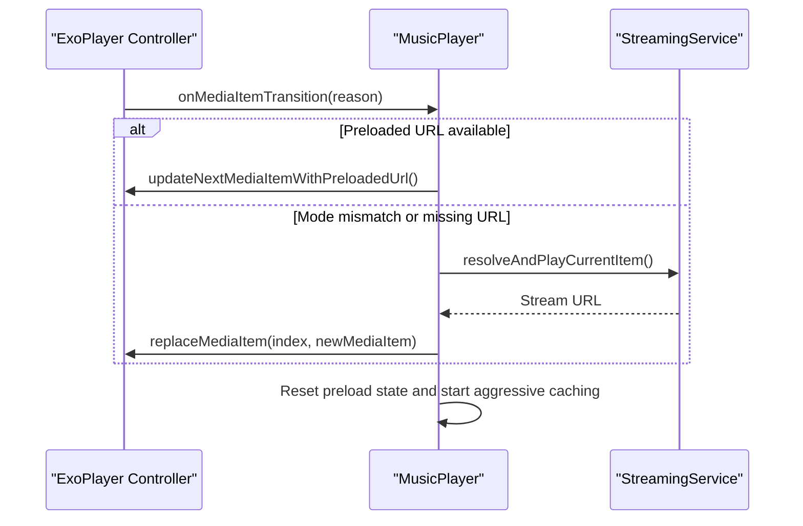
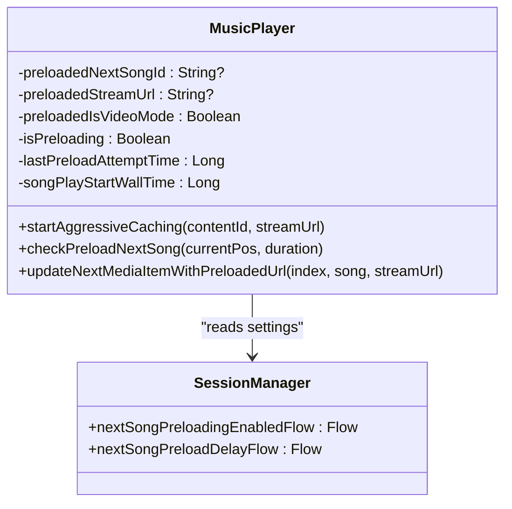
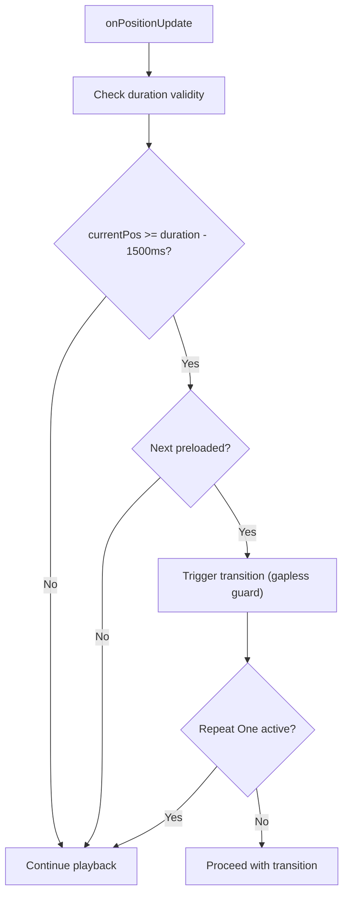
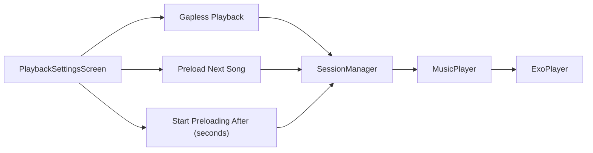
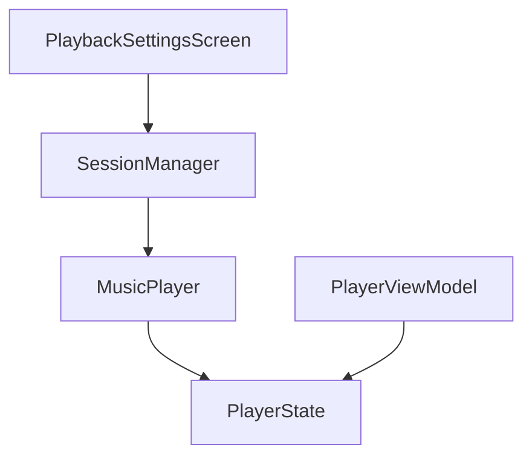

# Gapless Playback Implementation

<cite>
**Referenced Files in This Document**
- [MusicPlayer.kt](file://app/src/main/java/com/suvojeet/suvmusic/player/MusicPlayer.kt)
- [SessionManager.kt](file://app/src/main/java/com/suvojeet/suvmusic/data/SessionManager.kt)
- [PlaybackSettingsScreen.kt](file://app/src/main/java/com/suvojeet/suvmusic/ui/screens/PlaybackSettingsScreen.kt)
- [PlayerState.kt](file://app/src/main/java/com/suvojeet/suvmusic/data/model/PlayerState.kt)
- [PlayerViewModel.kt](file://app/src/main/java/com/suvojeet/suvmusic/ui/viewmodel/PlayerViewModel.kt)
- [SleepTimerManager.kt](file://app/src/main/java/com/suvojeet/suvmusic/player/SleepTimerManager.kt)
</cite>

## Table of Contents
1. [Introduction](#introduction)
2. [Project Structure](#project-structure)
3. [Core Components](#core-components)
4. [Architecture Overview](#architecture-overview)
5. [Detailed Component Analysis](#detailed-component-analysis)
6. [Dependency Analysis](#dependency-analysis)
7. [Performance Considerations](#performance-considerations)
8. [Troubleshooting Guide](#troubleshooting-guide)
9. [Conclusion](#conclusion)

## Introduction
This document explains the gapless playback implementation in SuvMusic, focusing on preloading mechanisms, timing calculations, seamless transitions, and robust state management. It covers configuration options, retry strategies, cache invalidation, and optimization techniques for performance and battery life. The goal is to provide both technical depth and practical guidance for developers and power users.

## Project Structure
The gapless playback feature spans several modules:
- Player orchestration and state management
- Session configuration for preloading and quality
- UI settings screens for toggling and tuning behavior
- Data models representing player state and configuration

**Diagram sources**
- [PlaybackSettingsScreen.kt:180-242](file://app/src/main/java/com/suvojeet/suvmusic/ui/screens/PlaybackSettingsScreen.kt#L180-L242)
- [SessionManager.kt:1204-1230](file://app/src/main/java/com/suvojeet/suvmusic/data/SessionManager.kt#L1204-L1230)
- [MusicPlayer.kt:1452-1533](file://app/src/main/java/com/suvojeet/suvmusic/player/MusicPlayer.kt#L1452-L1533)

**Section sources**
- [PlaybackSettingsScreen.kt:180-242](file://app/src/main/java/com/suvojeet/suvmusic/ui/screens/PlaybackSettingsScreen.kt#L180-L242)
- [SessionManager.kt:1204-1230](file://app/src/main/java/com/suvojeet/suvmusic/data/SessionManager.kt#L1204-L1230)
- [MusicPlayer.kt:1452-1533](file://app/src/main/java/com/suvojeet/suvmusic/player/MusicPlayer.kt#L1452-L1533)

## Core Components
- MusicPlayer: Orchestrates gapless playback, preloading, and transition timing. Implements wall-clock tracking, aggressive caching, and retry throttling.
- SessionManager: Stores and exposes user-configured gapless and preloading settings, including delay and enable flags.
- PlaybackSettingsScreen: Provides UI controls for enabling gapless playback, enabling preloading, and configuring the preload delay.
- PlayerState: Holds runtime state including playback position, duration, buffering percentage, and flags for gapless behavior.
- PlayerViewModel: Exposes derived queues and state for UI consumption.

**Section sources**
- [MusicPlayer.kt:100-163](file://app/src/main/java/com/suvojeet/suvmusic/player/MusicPlayer.kt#L100-L163)
- [SessionManager.kt:1204-1230](file://app/src/main/java/com/suvojeet/suvmusic/data/SessionManager.kt#L1204-L1230)
- [PlaybackSettingsScreen.kt:180-242](file://app/src/main/java/com/suvojeet/suvmusic/ui/screens/PlaybackSettingsScreen.kt#L180-L242)
- [PlayerState.kt:7-35](file://app/src/main/java/com/suvojeet/suvmusic/data/model/PlayerState.kt#L7-L35)
- [PlayerViewModel.kt:197-223](file://app/src/main/java/com/suvojeet/suvmusic/ui/viewmodel/PlayerViewModel.kt#L197-L223)

## Architecture Overview
The gapless playback pipeline integrates preloading, timing guards, and aggressive caching to minimize audible gaps between songs.

**Diagram sources**
- [MusicPlayer.kt:1276-1533](file://app/src/main/java/com/suvojeet/suvmusic/player/MusicPlayer.kt#L1276-L1533)
- [MusicPlayer.kt:1538-1570](file://app/src/main/java/com/suvojeet/suvmusic/player/MusicPlayer.kt#L1538-L1570)
- [MusicPlayer.kt:794-800](file://app/src/main/java/com/suvojeet/suvmusic/player/MusicPlayer.kt#L794-L800)

## Detailed Component Analysis

### Preloading Mechanism and Timing Calculations
- Eligibility: Preloading starts only when gapless playback is enabled, the player has a valid duration, and sufficient time remains before the current song ends.
- Delay Guard: A configurable delay prevents churn during rapid skips. The default is 3 seconds.
- Retry Throttling: Failed preload attempts are throttled to every 3 seconds to avoid repeated network pressure.
- Repeat One Protection: Preloading is skipped when Repeat One is active to avoid unnecessary work.
- Shuffle Safety: In shuffle mode, URLs are cached without replacing the next media item to prevent ExoPlayer state disruption.

**Diagram sources**
- [MusicPlayer.kt:1452-1492](file://app/src/main/java/com/suvojeet/suvmusic/player/MusicPlayer.kt#L1452-L1492)

**Section sources**
- [MusicPlayer.kt:1452-1492](file://app/src/main/java/com/suvojeet/suvmusic/player/MusicPlayer.kt#L1452-L1492)
- [MusicPlayer.kt:1511-1531](file://app/src/main/java/com/suvojeet/suvmusic/player/MusicPlayer.kt#L1511-L1531)

### Seamless Transition Logic
- Fast Path: If the next song’s URL was pre-resolved, it is applied directly to the current item via replaceMediaItem to avoid spurious transitions.
- Mode Matching: If the preloaded URL’s mode (audio/video) mismatches the current playback mode, resolution is forced to ensure compatibility.
- Resolution Fallback: If the current item lacks a valid stream URL, resolution is triggered and playback is paused temporarily to prevent cascading errors in shuffle mode.
- Post-transition Cleanup: Preload state is reset upon successful consumption, and aggressive caching begins for the newly resolved song.

**Diagram sources**
- [MusicPlayer.kt:794-800](file://app/src/main/java/com/suvojeet/suvmusic/player/MusicPlayer.kt#L794-L800)
- [MusicPlayer.kt:1538-1570](file://app/src/main/java/com/suvojeet/suvmusic/player/MusicPlayer.kt#L1538-L1570)

**Section sources**
- [MusicPlayer.kt:794-800](file://app/src/main/java/com/suvojeet/suvmusic/player/MusicPlayer.kt#L794-L800)
- [MusicPlayer.kt:1538-1570](file://app/src/main/java/com/suvojeet/suvmusic/player/MusicPlayer.kt#L1538-L1570)

### Preloading State Management and Cache Invalidation
- State Fields: Tracks the preloaded song ID, URL, mode, and an in-progress flag to coordinate lifecycle.
- Wall-clock Tracking: songPlayStartWallTime captures the moment a song begins playing for timing-sensitive logic.
- Aggressive Caching: A dedicated job writes the stream URL into the player cache using a cache key aligned with the current mode and quality to ensure hit rates.
- Retry and Error Recovery: Errors are logged and retried with throttling; failed attempts are ignored if canceled to avoid noisy logs.

**Diagram sources**
- [MusicPlayer.kt:100-109](file://app/src/main/java/com/suvojeet/suvmusic/player/MusicPlayer.kt#L100-L109)
- [MusicPlayer.kt:1237-1269](file://app/src/main/java/com/suvojeet/suvmusic/player/MusicPlayer.kt#L1237-L1269)
- [SessionManager.kt:1204-1230](file://app/src/main/java/com/suvojeet/suvmusic/data/SessionManager.kt#L1204-L1230)

**Section sources**
- [MusicPlayer.kt:100-109](file://app/src/main/java/com/suvojeet/suvmusic/player/MusicPlayer.kt#L100-L109)
- [MusicPlayer.kt:1237-1269](file://app/src/main/java/com/suvojeet/suvmusic/player/MusicPlayer.kt#L1237-L1269)
- [SessionManager.kt:1204-1230](file://app/src/main/java/com/suvojeet/suvmusic/data/SessionManager.kt#L1204-L1230)

### Gapless Guard and Transition Timing Optimization
- Gapless Guard: The system avoids triggering transitions prematurely by checking both duration and position, preventing immediate transitions when ExoPlayer reports initial buffer sizes instead of real durations.
- Early Transition: Within the last 1.5 seconds, if the next song is preloaded, the system triggers a transition to preempt audible gaps during fade-outs or silence.
- Repeat One Handling: Ensures the guard does not trigger when Repeat One is active, preserving looping behavior.
- Buffering Downscaling: If buffering exceeds a threshold, the system can downscale quality automatically and retry to improve continuity.

**Diagram sources**
- [MusicPlayer.kt:1334-1341](file://app/src/main/java/com/suvojeet/suvmusic/player/MusicPlayer.kt#L1334-L1341)
- [MusicPlayer.kt:1342-1349](file://app/src/main/java/com/suvojeet/suvmusic/player/MusicPlayer.kt#L1342-L1349)

**Section sources**
- [MusicPlayer.kt:1334-1349](file://app/src/main/java/com/suvojeet/suvmusic/player/MusicPlayer.kt#L1334-L1349)
- [MusicPlayer.kt:1271-1299](file://app/src/main/java/com/suvojeet/suvmusic/player/MusicPlayer.kt#L1271-L1299)

### Preloading Configuration Options, Delays, and Quality Considerations
- Enable Gapless Playback: Toggles the entire gapless pipeline.
- Enable Preload Next Song: Enables preloading of the upcoming track.
- Start Preloading After: Configurable delay in seconds to reduce churn during rapid navigation.
- Quality Handling: The system respects user-selected audio/video quality and applies appropriate cache keys to maintain alignment between preloaded and current modes.

**Diagram sources**
- [PlaybackSettingsScreen.kt:180-242](file://app/src/main/java/com/suvojeet/suvmusic/ui/screens/PlaybackSettingsScreen.kt#L180-L242)
- [SessionManager.kt:1204-1230](file://app/src/main/java/com/suvojeet/suvmusic/data/SessionManager.kt#L1204-L1230)
- [MusicPlayer.kt:1452-1462](file://app/src/main/java/com/suvojeet/suvmusic/player/MusicPlayer.kt#L1452-L1462)

**Section sources**
- [PlaybackSettingsScreen.kt:180-242](file://app/src/main/java/com/suvojeet/suvmusic/ui/screens/PlaybackSettingsScreen.kt#L180-L242)
- [SessionManager.kt:1204-1230](file://app/src/main/java/com/suvojeet/suvmusic/data/SessionManager.kt#L1204-L1230)
- [MusicPlayer.kt:1452-1462](file://app/src/main/java/com/suvojeet/suvmusic/player/MusicPlayer.kt#L1452-L1462)

### Examples and Scenarios
- Preload Triggers:
  - Gapless enabled, duration valid, position exceeds delay, and repeat one is off.
- State Synchronization:
  - Player state updates include queue rebuild from ExoPlayer’s media items to stay in sync with external changes (e.g., Listen Together).
- Error Recovery:
  - If resolution fails, the system pauses playback to avoid cascading errors in shuffle mode, then retries according to throttling rules.

**Section sources**
- [MusicPlayer.kt:647-690](file://app/src/main/java/com/suvojeet/suvmusic/player/MusicPlayer.kt#L647-L690)
- [MusicPlayer.kt:783-792](file://app/src/main/java/com/suvojeet/suvmusic/player/MusicPlayer.kt#L783-L792)

## Dependency Analysis
- MusicPlayer depends on SessionManager for configuration flows and on ExoPlayer for playback control.
- PlaybackSettingsScreen updates SessionManager, which propagates changes to MusicPlayer via reactive flows.
- PlayerState encapsulates UI-visible state and is updated by MusicPlayer and PlayerViewModel.

**Diagram sources**
- [SessionManager.kt:1204-1230](file://app/src/main/java/com/suvojeet/suvmusic/data/SessionManager.kt#L1204-L1230)
- [MusicPlayer.kt:83-84](file://app/src/main/java/com/suvojeet/suvmusic/player/MusicPlayer.kt#L83-L84)
- [PlayerState.kt:7-35](file://app/src/main/java/com/suvojeet/suvmusic/data/model/PlayerState.kt#L7-L35)
- [PlayerViewModel.kt:197-223](file://app/src/main/java/com/suvojeet/suvmusic/ui/viewmodel/PlayerViewModel.kt#L197-L223)

**Section sources**
- [SessionManager.kt:1204-1230](file://app/src/main/java/com/suvojeet/suvmusic/data/SessionManager.kt#L1204-L1230)
- [MusicPlayer.kt:83-84](file://app/src/main/java/com/suvojeet/suvmusic/player/MusicPlayer.kt#L83-L84)
- [PlayerState.kt:7-35](file://app/src/main/java/com/suvojeet/suvmusic/data/model/PlayerState.kt#L7-L35)
- [PlayerViewModel.kt:197-223](file://app/src/main/java/com/suvojeet/suvmusic/ui/viewmodel/PlayerViewModel.kt#L197-L223)

## Performance Considerations
- Aggressive Caching: Improves subsequent playback continuity by pre-warming the cache with the resolved stream URL.
- Buffering Downscaling: Automatically switches to lower quality in AUTO mode when buffering exceeds a threshold to reduce stalls.
- Retry Throttling: Limits network retries to avoid excessive load and improve responsiveness.
- Battery Impact: Aggressive preloading increases network and CPU usage; users can tune the delay and quality to balance performance and battery life.

[No sources needed since this section provides general guidance]

## Troubleshooting Guide
- Audible Gaps Despite Gapless Enabled:
  - Verify the next song is preloaded and mode matches (audio vs video).
  - Confirm the delay setting is not too high and Repeat One is disabled.
- Frequent Stalls or Low Bitrate:
  - Check buffering thresholds and allow automatic downscaling to occur.
- Shuffle Mode Cascades:
  - Ensure the fast-path is used in shuffle mode to avoid replacing media items and triggering errors.
- Sleep Timer Interference:
  - OnSongEnded may stop playback; confirm timer mode and behavior.

**Section sources**
- [MusicPlayer.kt:1271-1299](file://app/src/main/java/com/suvojeet/suvmusic/player/MusicPlayer.kt#L1271-L1299)
- [MusicPlayer.kt:783-792](file://app/src/main/java/com/suvojeet/suvmusic/player/MusicPlayer.kt#L783-L792)
- [SleepTimerManager.kt:119-128](file://app/src/main/java/com/suvojeet/suvmusic/player/SleepTimerManager.kt#L119-L128)

## Conclusion
SuvMusic’s gapless playback combines intelligent preloading, precise timing guards, and robust state management to deliver seamless transitions. Users can fine-tune behavior via the playback settings, while the system handles retries, mode mismatches, and aggressive caching to optimize continuity and performance. Proper configuration and awareness of battery trade-offs help achieve the best listening experience.