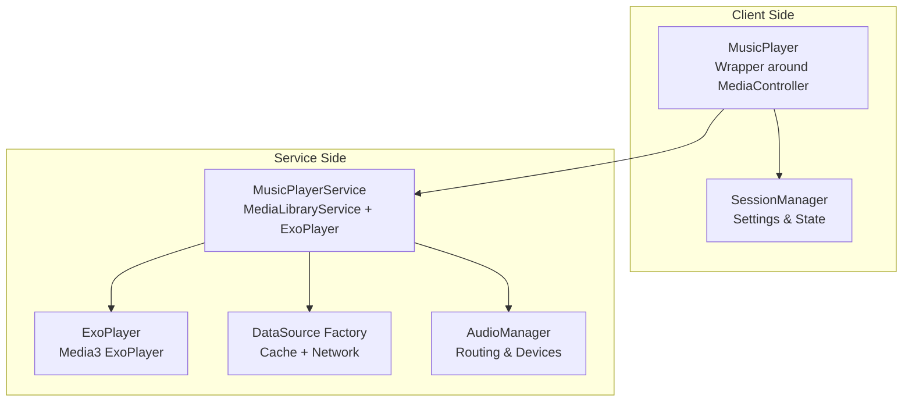
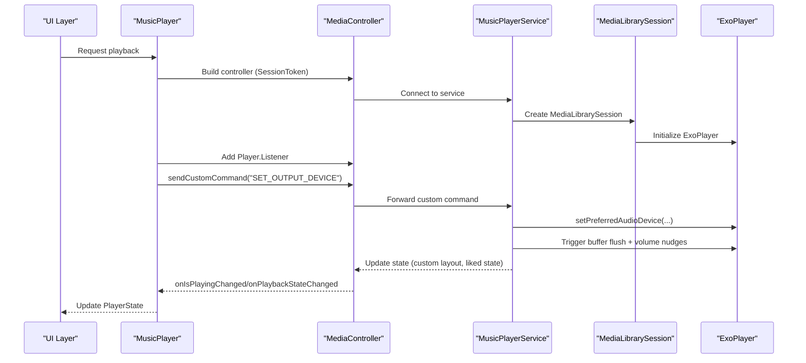
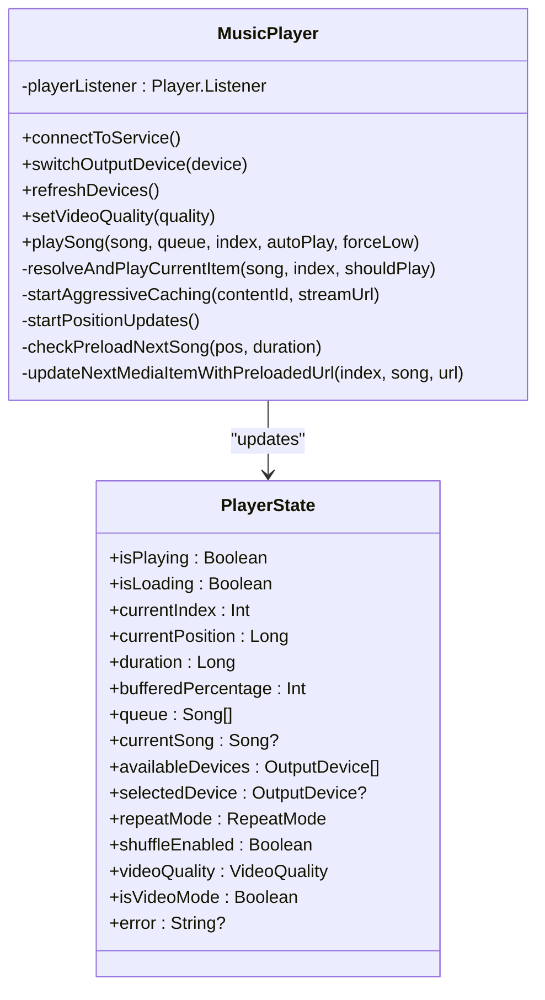
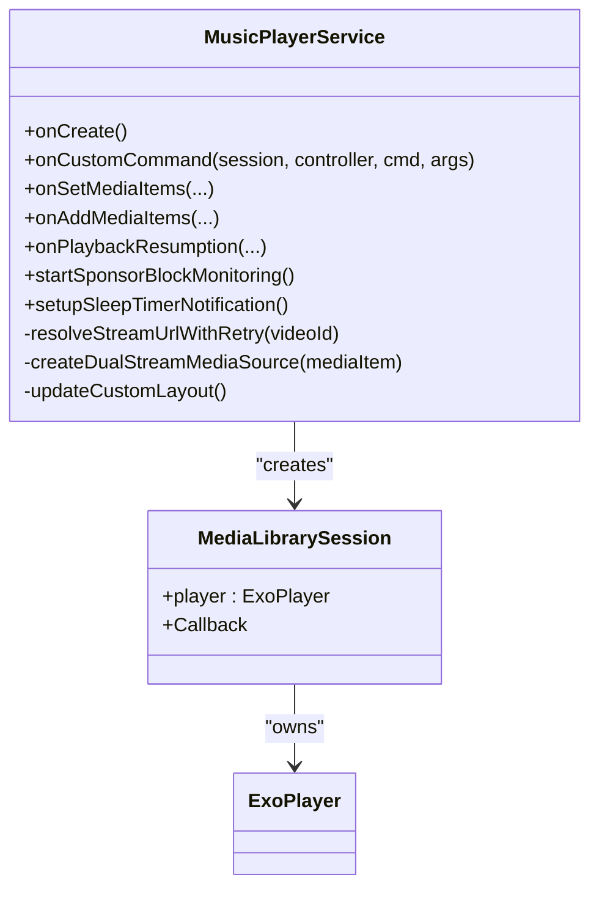
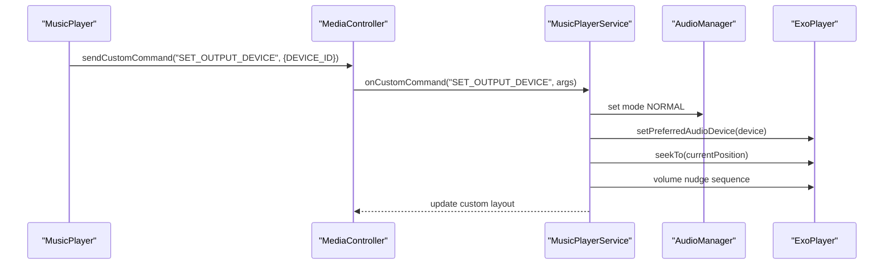
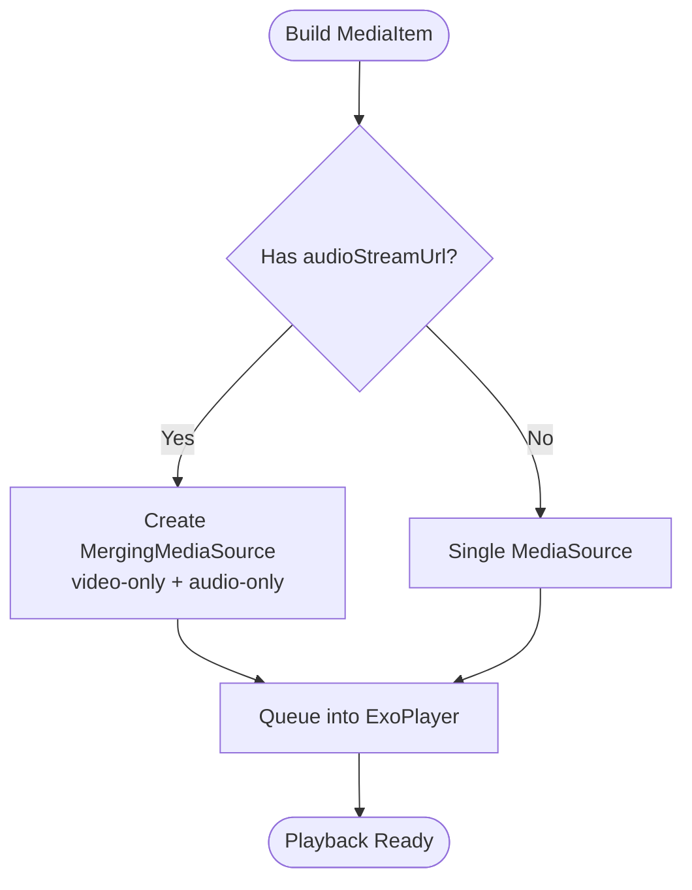
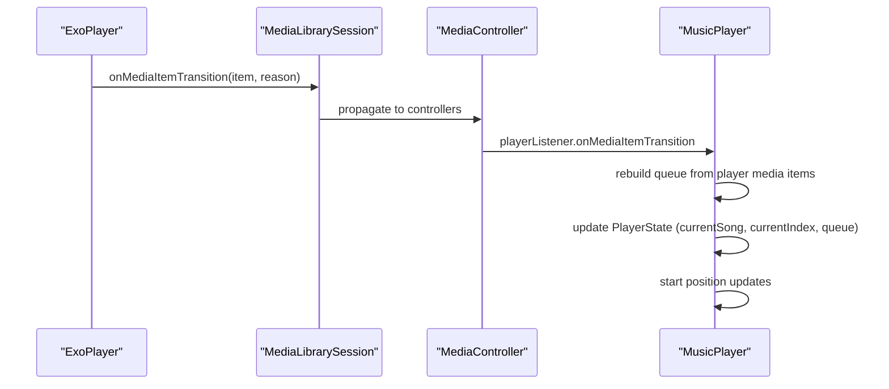
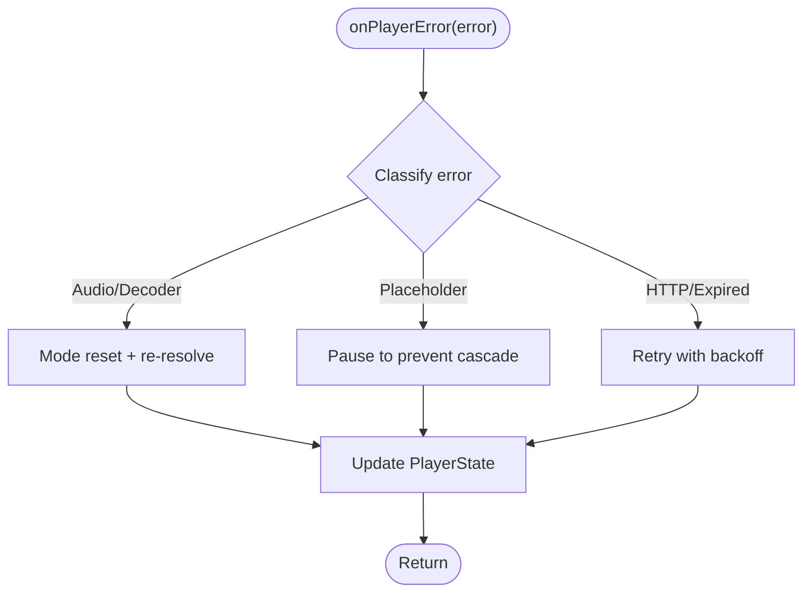
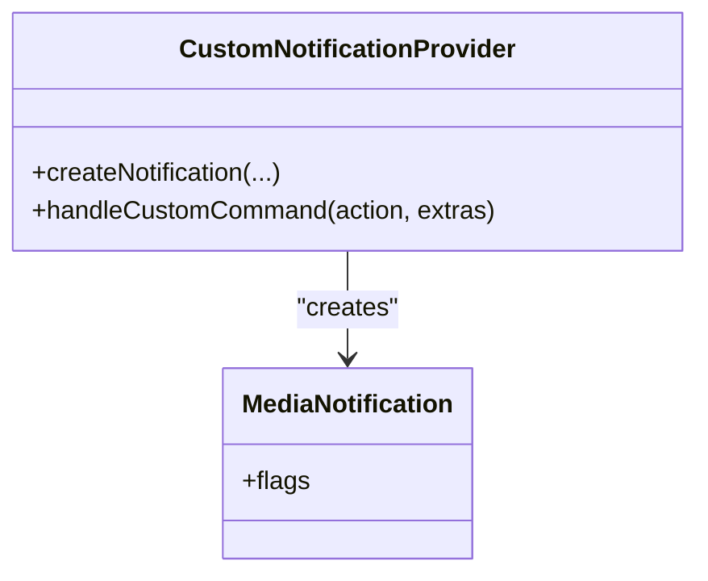
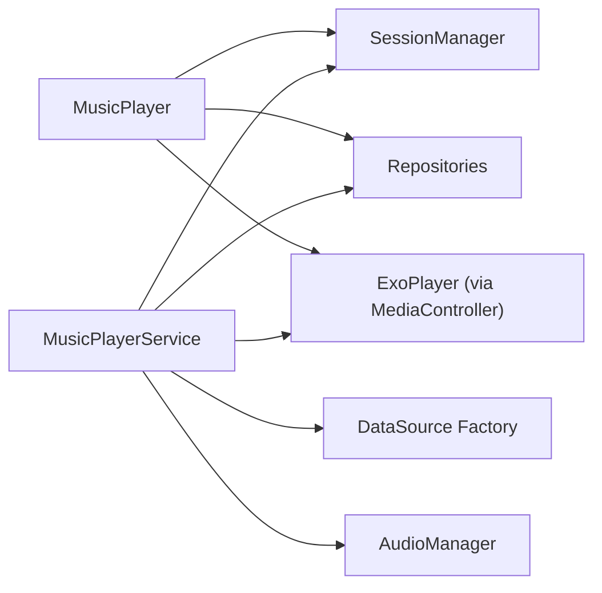

# Media3 ExoPlayer Integration

<cite>
**Referenced Files in This Document**
- [MusicPlayer.kt](file://app/src/main/java/com/suvojeet/suvmusic/player/MusicPlayer.kt)
- [MusicPlayerService.kt](file://app/src/main/java/com/suvojeet/suvmusic/service/MusicPlayerService.kt)
- [SessionManager.kt](file://app/src/main/java/com/suvojeet/suvmusic/data/SessionManager.kt)
</cite>

## Table of Contents
1. [Introduction](#introduction)
2. [Project Structure](#project-structure)
3. [Core Components](#core-components)
4. [Architecture Overview](#architecture-overview)
5. [Detailed Component Analysis](#detailed-component-analysis)
6. [Dependency Analysis](#dependency-analysis)
7. [Performance Considerations](#performance-considerations)
8. [Troubleshooting Guide](#troubleshooting-guide)
9. [Conclusion](#conclusion)

## Introduction
This document explains the Media3 ExoPlayer integration in SuvMusic, focusing on the wrapper architecture around MediaController and MediaSession, session token management, controller lifecycle, and integration patterns with Media3 ExoPlayer. It covers custom commands for device switching, media item handling, playback state synchronization, listener registration, error handling, the custom player service architecture, media session setup, and notification integration. Practical examples are provided via file references and code-level diagrams, along with performance considerations, memory management, and proper resource cleanup.

## Project Structure
The integration centers on two primary components:
- A foreground service implementing MediaLibraryService with Media3 ExoPlayer for background playback and media browsing.
- A client-side wrapper that connects to the service via MediaController to expose a reactive PlayerState and orchestrate playback.

**Diagram sources**
- [MusicPlayer.kt:479-499](file://app/src/main/java/com/suvojeet/suvmusic/player/MusicPlayer.kt#L479-L499)
- [MusicPlayerService.kt:186-272](file://app/src/main/java/com/suvojeet/suvmusic/service/MusicPlayerService.kt#L186-L272)

**Section sources**
- [MusicPlayer.kt:1-200](file://app/src/main/java/com/suvojeet/suvmusic/player/MusicPlayer.kt#L1-L200)
- [MusicPlayerService.kt:1-120](file://app/src/main/java/com/suvojeet/suvmusic/service/MusicPlayerService.kt#L1-L120)

## Core Components
- MusicPlayer (client wrapper):
  - Wraps MediaController to connect to MusicPlayerService.
  - Maintains PlayerState as a StateFlow for UI binding.
  - Handles device routing, preloading, gapless transitions, error recovery, and TTS integration.
- MusicPlayerService (background service):
  - Implements MediaLibraryService with Media3 ExoPlayer.
  - Provides custom commands (like SET_OUTPUT_DEVICE), Android Auto browsing, and notification customization.
  - Resolves stream URLs, merges dual-stream video/audio, and manages audio effects and spatial audio.
- SessionManager (settings and persistence):
  - Encapsulates user preferences, playback state, and reactive flows for settings.

**Section sources**
- [MusicPlayer.kt:56-120](file://app/src/main/java/com/suvojeet/suvmusic/player/MusicPlayer.kt#L56-L120)
- [MusicPlayerService.kt:50-120](file://app/src/main/java/com/suvojeet/suvmusic/service/MusicPlayerService.kt#L50-L120)
- [SessionManager.kt:62-120](file://app/src/main/java/com/suvojeet/suvmusic/data/SessionManager.kt#L62-L120)

## Architecture Overview
The system uses Media3’s MediaSession/MediaController pattern:
- MusicPlayer builds a MediaController asynchronously using a SessionToken targeting MusicPlayerService.
- MusicPlayerService constructs an ExoPlayer, registers listeners, and exposes a MediaLibrarySession with custom commands and notification layouts.
- Media items carry metadata and optional extras (e.g., audioStreamUrl for dual-stream merging).

**Diagram sources**
- [MusicPlayer.kt:479-499](file://app/src/main/java/com/suvojeet/suvmusic/player/MusicPlayer.kt#L479-L499)
- [MusicPlayerService.kt:629-673](file://app/src/main/java/com/suvojeet/suvmusic/service/MusicPlayerService.kt#L629-L673)
- [MusicPlayerService.kt:708-787](file://app/src/main/java/com/suvojeet/suvmusic/service/MusicPlayerService.kt#L708-L787)

## Detailed Component Analysis

### MusicPlayer (Client Wrapper)
Responsibilities:
- Establishes asynchronous connection to MusicPlayerService via MediaController.
- Registers Player.Listener to synchronize UI state (isPlaying, buffering, tracks, repeat/shuffle, media transitions).
- Manages device routing via custom commands and system audio routing.
- Implements preloading and gapless transitions with careful index handling.
- Performs robust error recovery, including mode resets and exponential backoff.
- Integrates TTS and haptics, and persists playback state.

Key behaviors:
- Session token and controller lifecycle:
  - Builds MediaController with SessionToken targeting MusicPlayerService.
  - Adds Player.Listener to update PlayerState and start position updates.
- Device switching:
  - Sends custom command SET_OUTPUT_DEVICE with DEVICE_ID bundle.
  - Uses AudioManager to normalize routing and force buffer flush.
- Gapless and preloading:
  - Uses Media3’s nextMediaItemIndex to safely compute next item.
  - Preloads stream URL and applies it at transition time to avoid disrupting ExoPlayer’s internal state.
- Error handling:
  - Detects audio sink/decoder/format errors and performs mode resets.
  - Applies exponential backoff and guards against double-resolution races.
- State synchronization:
  - Updates PlayerState on transitions, buffering, and playback state changes.
  - Persists playback state periodically and on transitions.

**Diagram sources**
- [MusicPlayer.kt:56-120](file://app/src/main/java/com/suvojeet/suvmusic/player/MusicPlayer.kt#L56-L120)
- [MusicPlayer.kt:501-1019](file://app/src/main/java/com/suvojeet/suvmusic/player/MusicPlayer.kt#L501-L1019)

**Section sources**
- [MusicPlayer.kt:479-598](file://app/src/main/java/com/suvojeet/suvmusic/player/MusicPlayer.kt#L479-L598)
- [MusicPlayer.kt:868-1019](file://app/src/main/java/com/suvojeet/suvmusic/player/MusicPlayer.kt#L868-L1019)
- [MusicPlayer.kt:1053-1234](file://app/src/main/java/com/suvojeet/suvmusic/player/MusicPlayer.kt#L1053-L1234)

### MusicPlayerService (Background Service)
Responsibilities:
- Creates MediaLibrarySession with ExoPlayer and custom MediaSource factory supporting dual-stream merging.
- Implements custom commands (like SET_OUTPUT_DEVICE) and grants extended session/player commands for Android Auto.
- Resolves stream URLs with retry logic and lazily resolves placeholders on transition.
- Manages audio effects, spatial audio, sponsor block, and sleep timer notifications.
- Provides Android Auto browsing, search, and playback resumption.

Key behaviors:
- Media3 setup:
  - Builds ExoPlayer with custom RenderersFactory and DefaultLoadControl.
  - Sets audio attributes and handles audio focus.
- Dual-stream merging:
  - Detects audioStreamUrl in RequestMetadata extras and merges video-only and audio-only sources.
- Custom commands:
  - SET_OUTPUT_DEVICE routes audio to a specific device, normalizes audio mode, and performs volume nudges.
- Error handling:
  - Detects audio sink/decoder errors and recovers by re-preparing and optionally restarting playback.
- Android Auto:
  - Implements onGetChildren, onSearch, onGetSearchResult, onAddMediaItems, and onPlaybackResumption.
  - Expands single items to full context lists for skip support.

**Diagram sources**
- [MusicPlayerService.kt:186-272](file://app/src/main/java/com/suvojeet/suvmusic/service/MusicPlayerService.kt#L186-L272)
- [MusicPlayerService.kt:629-673](file://app/src/main/java/com/suvojeet/suvmusic/service/MusicPlayerService.kt#L629-L673)
- [MusicPlayerService.kt:708-787](file://app/src/main/java/com/suvojeet/suvmusic/service/MusicPlayerService.kt#L708-L787)

**Section sources**
- [MusicPlayerService.kt:186-526](file://app/src/main/java/com/suvojeet/suvmusic/service/MusicPlayerService.kt#L186-L526)
- [MusicPlayerService.kt:708-827](file://app/src/main/java/com/suvojeet/suvmusic/service/MusicPlayerService.kt#L708-L827)
- [MusicPlayerService.kt:1150-1253](file://app/src/main/java/com/suvojeet/suvmusic/service/MusicPlayerService.kt#L1150-L1253)

### Device Routing and Custom Commands
- Client sends custom command SET_OUTPUT_DEVICE with DEVICE_ID bundle to switch audio output.
- Service sets preferred audio device, normalizes audio mode, flushes buffers, and performs volume nudges.
- Graceful fallback if manual device disappears, resetting routing to default.

**Diagram sources**
- [MusicPlayer.kt:459-476](file://app/src/main/java/com/suvojeet/suvmusic/player/MusicPlayer.kt#L459-L476)
- [MusicPlayerService.kt:708-787](file://app/src/main/java/com/suvojeet/suvmusic/service/MusicPlayerService.kt#L708-L787)

**Section sources**
- [MusicPlayer.kt:424-476](file://app/src/main/java/com/suvojeet/suvmusic/player/MusicPlayer.kt#L424-L476)
- [MusicPlayerService.kt:716-787](file://app/src/main/java/com/suvojeet/suvmusic/service/MusicPlayerService.kt#L716-L787)

### Media Item Handling and Metadata
- Media items include metadata (title, artist, album, artwork) and optional extras (audioStreamUrl for dual-stream).
- Service merges video-only and audio-only streams into a single MergingMediaSource when extras are present.
- Android Auto requires lazy resolution of URIs; service resolves on transition or on demand.

**Diagram sources**
- [MusicPlayer.kt:1184-1193](file://app/src/main/java/com/suvojeet/suvmusic/player/MusicPlayer.kt#L1184-L1193)
- [MusicPlayerService.kt:224-258](file://app/src/main/java/com/suvojeet/suvmusic/service/MusicPlayerService.kt#L224-L258)

**Section sources**
- [MusicPlayer.kt:1169-1195](file://app/src/main/java/com/suvojeet/suvmusic/player/MusicPlayer.kt#L1169-L1195)
- [MusicPlayerService.kt:224-258](file://app/src/main/java/com/suvojeet/suvmusic/service/MusicPlayerService.kt#L224-L258)

### Playback State Synchronization and Listener Registration
- MusicPlayer registers Player.Listener to receive onIsPlayingChanged, onPlaybackStateChanged, onTracksChanged, onRepeatModeChanged, onShuffleModeEnabledChanged, and onMediaItemTransition.
- On transitions, MusicPlayer rebuilds the queue from the player’s media items to remain synchronized, especially under shuffle.
- Position updates are throttled and persisted periodically.

**Diagram sources**
- [MusicPlayer.kt:619-690](file://app/src/main/java/com/suvojeet/suvmusic/player/MusicPlayer.kt#L619-L690)
- [MusicPlayer.kt:1276-1333](file://app/src/main/java/com/suvojeet/suvmusic/player/MusicPlayer.kt#L1276-L1333)

**Section sources**
- [MusicPlayer.kt:501-690](file://app/src/main/java/com/suvojeet/suvmusic/player/MusicPlayer.kt#L501-L690)
- [MusicPlayer.kt:1276-1333](file://app/src/main/java/com/suvojeet/suvmusic/player/MusicPlayer.kt#L1276-L1333)

### Error Handling Mechanisms
- Audio sink/decoder errors trigger a mode reset and re-resolution.
- Placeholder URI errors are paused to prevent cascade behavior in shuffle mode.
- Exponential backoff and retry limits prevent infinite loops.
- Service-level recovery includes re-preparing player and optional auto-skip.

**Diagram sources**
- [MusicPlayer.kt:868-1019](file://app/src/main/java/com/suvojeet/suvmusic/player/MusicPlayer.kt#L868-L1019)
- [MusicPlayerService.kt:438-489](file://app/src/main/java/com/suvojeet/suvmusic/service/MusicPlayerService.kt#L438-L489)

**Section sources**
- [MusicPlayer.kt:868-1019](file://app/src/main/java/com/suvojeet/suvmusic/player/MusicPlayer.kt#L868-L1019)
- [MusicPlayerService.kt:438-489](file://app/src/main/java/com/suvojeet/suvmusic/service/MusicPlayerService.kt#L438-L489)

### Notification Integration
- Custom notification provider augments default Media3 notifications with custom actions.
- Dynamic custom layout adapts icons based on shuffle, repeat, and liked state.
- Sleep timer notification managed separately with ongoing updates.

**Diagram sources**
- [MusicPlayerService.kt:1355-1391](file://app/src/main/java/com/suvojeet/suvmusic/service/MusicPlayerService.kt#L1355-L1391)
- [MusicPlayerService.kt:1315-1353](file://app/src/main/java/com/suvojeet/suvmusic/service/MusicPlayerService.kt#L1315-L1353)

**Section sources**
- [MusicPlayerService.kt:1355-1391](file://app/src/main/java/com/suvojeet/suvmusic/service/MusicPlayerService.kt#L1355-L1391)
- [MusicPlayerService.kt:1315-1353](file://app/src/main/java/com/suvojeet/suvmusic/service/MusicPlayerService.kt#L1315-L1353)

## Dependency Analysis
- MusicPlayer depends on:
  - SessionManager for settings and reactive flows.
  - Repositories for stream URL resolution and metadata.
  - Exposed services for spatial audio and TTS.
- MusicPlayerService depends on:
  - Repositories for YouTube/JioSaavn data.
  - ExoPlayer for playback and DataSource factories.
  - AudioARManager and SpatialAudioProcessor for effects.
  - SessionManager for settings and sleep timer.

**Diagram sources**
- [MusicPlayer.kt:58-72](file://app/src/main/java/com/suvojeet/suvmusic/player/MusicPlayer.kt#L58-L72)
- [MusicPlayerService.kt:53-88](file://app/src/main/java/com/suvojeet/suvmusic/service/MusicPlayerService.kt#L53-L88)

**Section sources**
- [MusicPlayer.kt:58-72](file://app/src/main/java/com/suvojeet/suvmusic/player/MusicPlayer.kt#L58-L72)
- [MusicPlayerService.kt:53-88](file://app/src/main/java/com/suvojeet/suvmusic/service/MusicPlayerService.kt#L53-L88)

## Performance Considerations
- Buffer tuning:
  - DefaultLoadControl configured with larger buffers and back buffer to improve seeking and stability.
- Aggressive caching:
  - Background caching job writes into the shared CacheDataSource to reduce stalls.
- Adaptive quality:
  - During prolonged buffering in AUTO mode, falls back to lower quality and re-resolves.
- Preloading and gapless:
  - Preloads next song’s URL and triggers early transition to minimize gaps.
- Audio offload vs effects:
  - Dynamically disables audio offload when spatial audio or EQ is active to ensure processor usage.

[No sources needed since this section provides general guidance]

## Troubleshooting Guide
Common issues and resolutions:
- No sound after Bluetooth switch:
  - Service normalizes audio mode, clears routing, sets preferred device, flushes buffer, and performs volume nudges.
- Placeholder URI errors:
  - Paused to prevent cascade; MusicPlayer retries with exponential backoff and mode resets when appropriate.
- Audio sink/decoder failures:
  - Service re-prepares player; MusicPlayer may switch modes to reset decoders.
- Android Auto skip button missing:
  - Service expands single items to full context lists and returns all items for skip support.
- Sleep timer not updating:
  - Ensure SessionManager flows are active and service notification channel is created.

**Section sources**
- [MusicPlayerService.kt:716-787](file://app/src/main/java/com/suvojeet/suvmusic/service/MusicPlayerService.kt#L716-L787)
- [MusicPlayer.kt:896-1009](file://app/src/main/java/com/suvojeet/suvmusic/player/MusicPlayer.kt#L896-L1009)
- [MusicPlayerService.kt:1315-1353](file://app/src/main/java/com/suvojeet/suvmusic/service/MusicPlayerService.kt#L1315-L1353)
- [MusicPlayerService.kt:1565-1598](file://app/src/main/java/com/suvojeet/suvmusic/service/MusicPlayerService.kt#L1565-L1598)

## Conclusion
SuvMusic’s Media3 integration cleanly separates concerns between a client-side MusicPlayer wrapper and a robust MusicPlayerService built on MediaLibraryService and ExoPlayer. The design emphasizes reliability through custom commands for device routing, dual-stream merging for video/audio, preloading for gapless playback, and comprehensive error recovery. Reactive state management via PlayerState and SessionManager ensures responsive UI updates and persistent playback continuity across device changes and app lifecycle events.