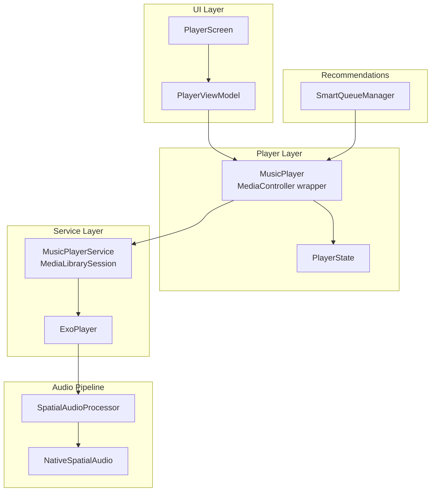
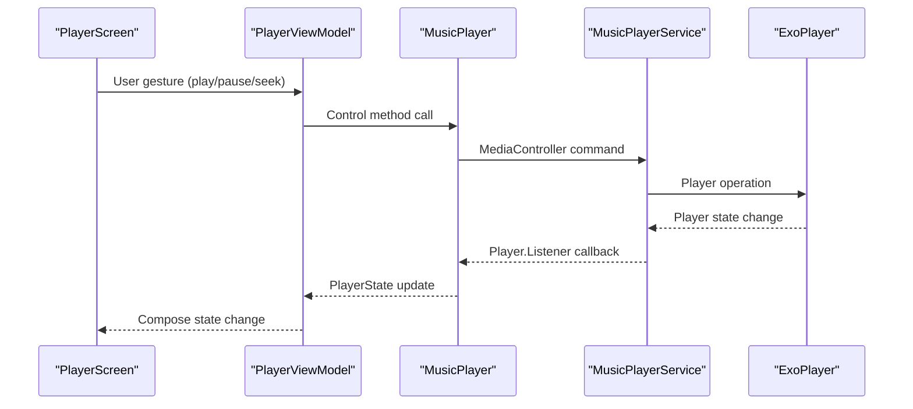
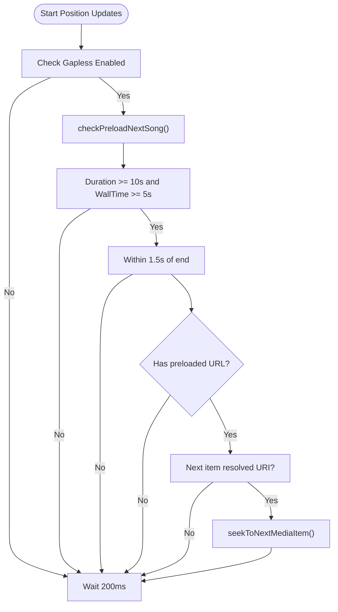
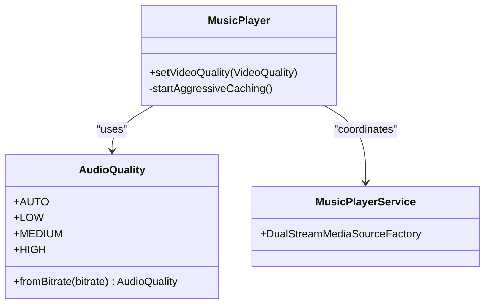
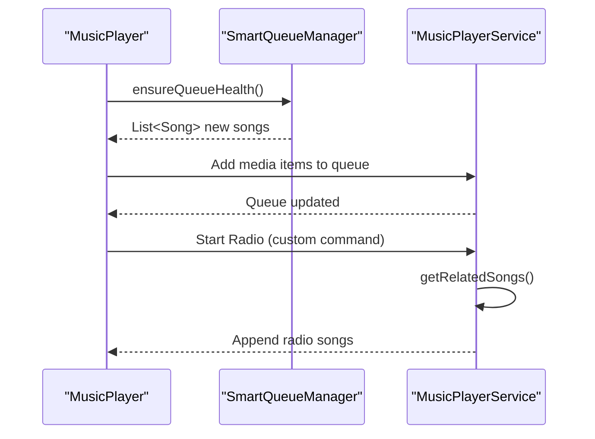
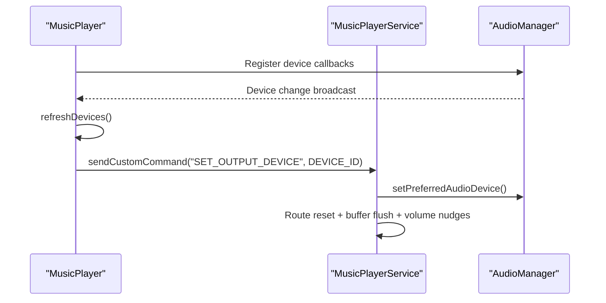
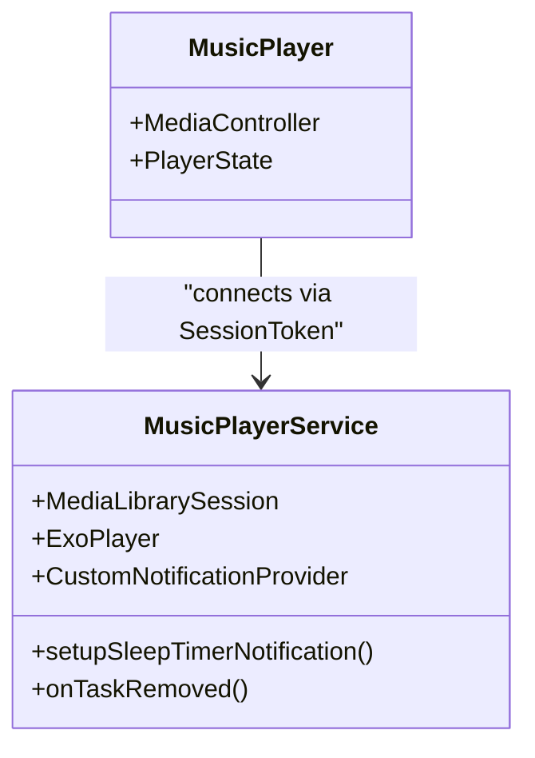
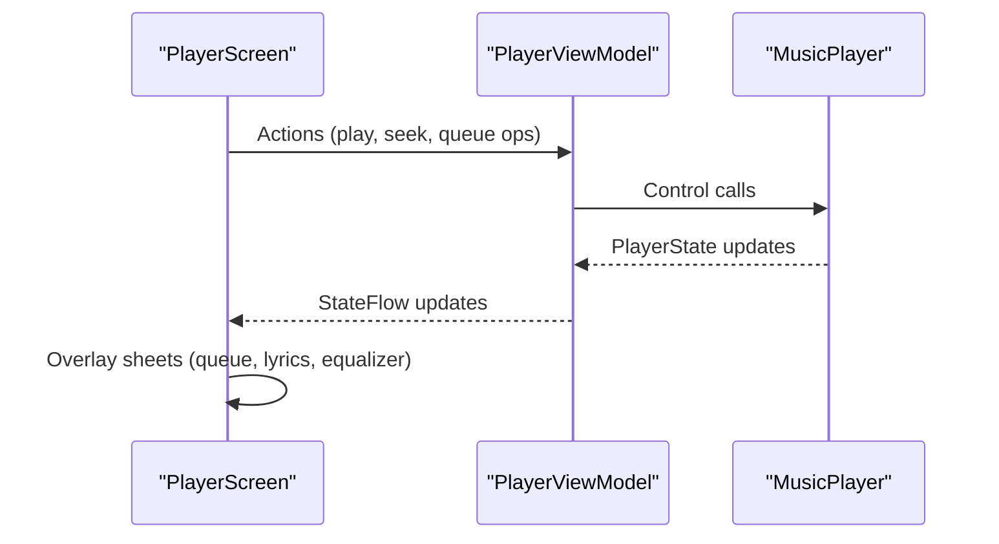
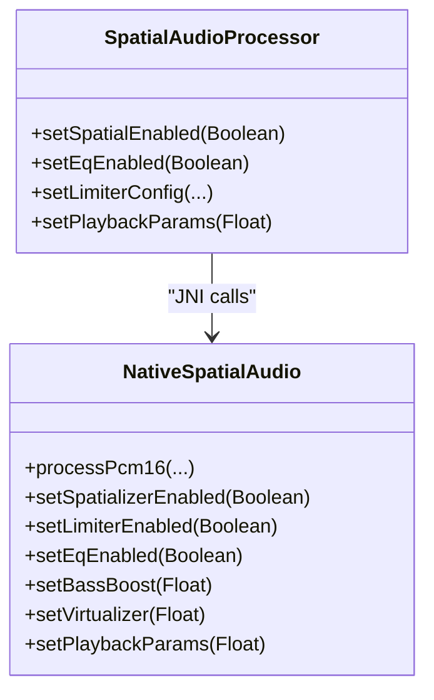
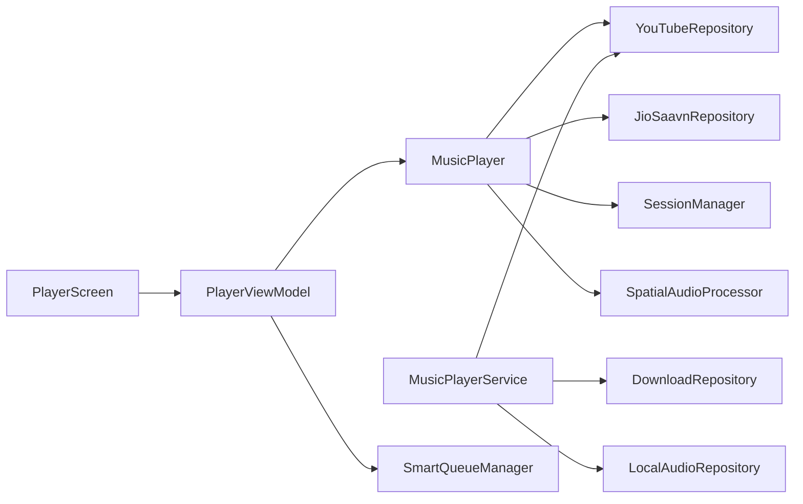

# Music Playback System

<cite>
**Referenced Files in This Document**
- [MusicPlayer.kt](file://app/src/main/java/com/suvojeet/suvmusic/player/MusicPlayer.kt)
- [MusicPlayerService.kt](file://app/src/main/java/com/suvojeet/suvmusic/service/MusicPlayerService.kt)
- [PlayerState.kt](file://app/src/main/java/com/suvojeet/suvmusic/data/model/PlayerState.kt)
- [SmartQueueManager.kt](file://app/src/main/java/com/suvojeet/suvmusic/recommendation/SmartQueueManager.kt)
- [SpatialAudioProcessor.kt](file://app/src/main/java/com/suvojeet/suvmusic/player/SpatialAudioProcessor.kt)
- [NativeSpatialAudio.kt](file://app/src/main/java/com/suvojeet/suvmusic/player/NativeSpatialAudio.kt)
- [PlayerViewModel.kt](file://app/src/main/java/com/suvojeet/suvmusic/ui/viewmodel/PlayerViewModel.kt)
- [PlayerScreen.kt](file://app/src/main/java/com/suvojeet/suvmusic/ui/screens/player/PlayerScreen.kt)
- [AudioQuality.kt](file://app/src/main/java/com/suvojeet/suvmusic/data/model/AudioQuality.kt)
- [OutputDevice.kt](file://app/src/main/java/com/suvojeet/suvmusic/data/model/OutputDevice.kt)
- [FocusExtensions.kt](file://app/src/main/java/com/suvojeet/suvmusic/util/FocusExtensions.kt)
</cite>

## Table of Contents
1. [Introduction](#introduction)
2. [Project Structure](#project-structure)
3. [Core Components](#core-components)
4. [Architecture Overview](#architecture-overview)
5. [Detailed Component Analysis](#detailed-component-analysis)
6. [Dependency Analysis](#dependency-analysis)
7. [Performance Considerations](#performance-considerations)
8. [Troubleshooting Guide](#troubleshooting-guide)
9. [Conclusion](#conclusion)

## Introduction
This document explains SuvMusic’s music playback system built on Media3 ExoPlayer. It covers the playback engine architecture, state management, queue handling, integration with Media3, audio focus management, device-specific routing, gapless playback, adaptive streaming, player service architecture, foreground service management, notifications, playback controls, gesture handling, UI integration, and performance/battery optimizations.

## Project Structure
The playback system spans several layers:
- UI layer: PlayerViewModel and PlayerScreen orchestrate user interactions and state presentation
- Player layer: MusicPlayer wraps Media3’s MediaController and exposes a reactive PlayerState
- Service layer: MusicPlayerService hosts ExoPlayer, MediaSession, and MediaLibrarySession for background playback and Android Auto support
- Audio pipeline: SpatialAudioProcessor and NativeSpatialAudio implement audio effects and spatial processing
- Recommendation layer: SmartQueueManager maintains an intelligent queue for autoplay and radio modes

**Diagram sources**
- [MusicPlayer.kt:58-90](file://app/src/main/java/com/suvojeet/suvmusic/player/MusicPlayer.kt#L58-L90)
- [MusicPlayerService.kt:260-272](file://app/src/main/java/com/suvojeet/suvmusic/service/MusicPlayerService.kt#L260-L272)
- [PlayerViewModel.kt:58-75](file://app/src/main/java/com/suvojeet/suvmusic/ui/viewmodel/PlayerViewModel.kt#L58-L75)
- [PlayerScreen.kt:200-210](file://app/src/main/java/com/suvojeet/suvmusic/ui/screens/player/PlayerScreen.kt#L200-L210)
- [SpatialAudioProcessor.kt:13-16](file://app/src/main/java/com/suvojeet/suvmusic/player/SpatialAudioProcessor.kt#L13-L16)
- [NativeSpatialAudio.kt:9-23](file://app/src/main/java/com/suvojeet/suvmusic/player/NativeSpatialAudio.kt#L9-L23)
- [SmartQueueManager.kt:23-25](file://app/src/main/java/com/suvojeet/suvmusic/recommendation/SmartQueueManager.kt#L23-L25)

**Section sources**
- [MusicPlayer.kt:1-200](file://app/src/main/java/com/suvojeet/suvmusic/player/MusicPlayer.kt#L1-L200)
- [MusicPlayerService.kt:186-272](file://app/src/main/java/com/suvojeet/suvmusic/service/MusicPlayerService.kt#L186-L272)
- [PlayerViewModel.kt:1-120](file://app/src/main/java/com/suvojeet/suvmusic/ui/viewmodel/PlayerViewModel.kt#L1-L120)
- [PlayerScreen.kt:1-120](file://app/src/main/java/com/suvojeet/suvmusic/ui/screens/player/PlayerScreen.kt#L1-L120)

## Core Components
- MusicPlayer: Wraps Media3 MediaController, manages PlayerState, handles gapless preloading, error recovery, device routing, and playback parameters
- MusicPlayerService: Hosts ExoPlayer inside MediaLibrarySession, resolves streams, supports Android Auto, manages notifications, and handles output device routing
- PlayerState: Immutable snapshot of playback state for UI consumption
- SmartQueueManager: Maintains autoplay/radio queues with intelligent recommendations
- SpatialAudioProcessor and NativeSpatialAudio: Software audio processors for EQ, limiter, crossfeed, bass/virtualizer, and spatialization
- PlayerViewModel and PlayerScreen: UI orchestration, playback controls, and gesture handling

**Section sources**
- [MusicPlayer.kt:58-120](file://app/src/main/java/com/suvojeet/suvmusic/player/MusicPlayer.kt#L58-L120)
- [MusicPlayerService.kt:90-140](file://app/src/main/java/com/suvojeet/suvmusic/service/MusicPlayerService.kt#L90-L140)
- [PlayerState.kt:7-35](file://app/src/main/java/com/suvojeet/suvmusic/data/model/PlayerState.kt#L7-L35)
- [SmartQueueManager.kt:22-37](file://app/src/main/java/com/suvojeet/suvmusic/recommendation/SmartQueueManager.kt#L22-L37)
- [SpatialAudioProcessor.kt:12-34](file://app/src/main/java/com/suvojeet/suvmusic/player/SpatialAudioProcessor.kt#L12-L34)
- [NativeSpatialAudio.kt:8-23](file://app/src/main/java/com/suvojeet/suvmusic/player/NativeSpatialAudio.kt#L8-L23)
- [PlayerViewModel.kt:58-75](file://app/src/main/java/com/suvojeet/suvmusic/ui/viewmodel/PlayerViewModel.kt#L58-L75)
- [PlayerScreen.kt:200-210](file://app/src/main/java/com/suvojeet/suvmusic/ui/screens/player/PlayerScreen.kt#L200-L210)

## Architecture Overview
The system uses a reactive architecture:
- UI subscribes to PlayerState from MusicPlayer
- MusicPlayer listens to ExoPlayer events via MediaController and updates PlayerState
- MusicPlayerService initializes ExoPlayer, MediaSession, and MediaLibrarySession
- Stream resolution and queue management are coordinated across MusicPlayer and MusicPlayerService
- Audio effects are applied through SpatialAudioProcessor and NativeSpatialAudio

**Diagram sources**
- [PlayerScreen.kt:200-210](file://app/src/main/java/com/suvojeet/suvmusic/ui/screens/player/PlayerScreen.kt#L200-L210)
- [PlayerViewModel.kt:503-540](file://app/src/main/java/com/suvojeet/suvmusic/ui/viewmodel/PlayerViewModel.kt#L503-L540)
- [MusicPlayer.kt:501-598](file://app/src/main/java/com/suvojeet/suvmusic/player/MusicPlayer.kt#L501-L598)
- [MusicPlayerService.kt:629-673](file://app/src/main/java/com/suvojeet/suvmusic/service/MusicPlayerService.kt#L629-L673)

## Detailed Component Analysis

### Playback Engine and Gapless Playback
- Gapless preloading: MusicPlayer preloads the next song’s stream URL and either replaces the next media item (non-shuffle) or stores it for immediate application at transition (shuffle)
- Early transition guard: Prevents premature gapless trigger until duration and wall-clock playback meet thresholds
- Mode-aware preloading: Video vs audio mode is tracked to avoid applying preloaded URLs incorrectly
- Aggressive caching: Background caching of resolved URLs improves subsequent transitions

**Diagram sources**
- [MusicPlayer.kt:1334-1383](file://app/src/main/java/com/suvojeet/suvmusic/player/MusicPlayer.kt#L1334-L1383)
- [MusicPlayer.kt:1452-1533](file://app/src/main/java/com/suvojeet/suvmusic/player/MusicPlayer.kt#L1452-L1533)

**Section sources**
- [MusicPlayer.kt:1334-1533](file://app/src/main/java/com/suvojeet/suvmusic/player/MusicPlayer.kt#L1334-L1533)

### Stream Quality Selection and Adaptive Streaming
- Audio quality: AudioQuality enum defines bitrate ranges; MusicPlayer monitors and can downscale to LOW during extended buffering in AUTO mode
- Video quality: VideoQuality is stored in PlayerState and applied to ExoPlayer track selection parameters
- Dual-stream merging: For video mode, MusicPlayerService merges separate video-only and audio-only streams into a single MediaSource

**Diagram sources**
- [AudioQuality.kt:6-18](file://app/src/main/java/com/suvojeet/suvmusic/data/model/AudioQuality.kt#L6-L18)
- [MusicPlayer.kt:1021-1051](file://app/src/main/java/com/suvojeet/suvmusic/player/MusicPlayer.kt#L1021-L1051)
- [MusicPlayerService.kt:224-258](file://app/src/main/java/com/suvojeet/suvmusic/service/MusicPlayerService.kt#L224-L258)

**Section sources**
- [AudioQuality.kt:1-19](file://app/src/main/java/com/suvojeet/suvmusic/data/model/AudioQuality.kt#L1-L19)
- [MusicPlayer.kt:1021-1051](file://app/src/main/java/com/suvojeet/suvmusic/player/MusicPlayer.kt#L1021-L1051)
- [MusicPlayerService.kt:224-258](file://app/src/main/java/com/suvojeet/suvmusic/service/MusicPlayerService.kt#L224-L258)

### Queue Handling and Autoplay/Radio
- Queue synchronization: MusicPlayer rebuilds the queue from ExoPlayer’s media items to stay in sync with shuffle and external changes
- SmartQueueManager: Ensures queue health by prefetching “up next” songs, deduplicating, and adapting to radio/autoplay modes
- Radio mode: Starts/stops radio via custom commands and appends recommended songs to the queue

**Diagram sources**
- [MusicPlayer.kt:619-690](file://app/src/main/java/com/suvojeet/suvmusic/player/MusicPlayer.kt#L619-L690)
- [SmartQueueManager.kt:54-105](file://app/src/main/java/com/suvojeet/suvmusic/recommendation/SmartQueueManager.kt#L54-L105)
- [MusicPlayerService.kt:789-827](file://app/src/main/java/com/suvojeet/suvmusic/service/MusicPlayerService.kt#L789-L827)

**Section sources**
- [MusicPlayer.kt:619-690](file://app/src/main/java/com/suvojeet/suvmusic/player/MusicPlayer.kt#L619-L690)
- [SmartQueueManager.kt:54-105](file://app/src/main/java/com/suvojeet/suvmusic/recommendation/SmartQueueManager.kt#L54-L105)
- [MusicPlayerService.kt:789-827](file://app/src/main/java/com/suvojeet/suvmusic/service/MusicPlayerService.kt#L789-L827)

### Audio Focus Management and Device Routing
- Audio focus: MusicPlayerService respects audio focus changes; optional auto-resume behavior and configurable focus handling
- Output device routing: MusicPlayer detects device changes, supports manual selection, and sends SET_OUTPUT_DEVICE commands to the service
- Device auto-selection logic: Phone speaker, wired headset, or Bluetooth auto-selection with grace period handling

**Diagram sources**
- [MusicPlayer.kt:261-476](file://app/src/main/java/com/suvojeet/suvmusic/player/MusicPlayer.kt#L261-L476)
- [MusicPlayerService.kt:708-787](file://app/src/main/java/com/suvojeet/suvmusic/service/MusicPlayerService.kt#L708-L787)

**Section sources**
- [MusicPlayer.kt:261-476](file://app/src/main/java/com/suvojeet/suvmusic/player/MusicPlayer.kt#L261-L476)
- [MusicPlayerService.kt:708-787](file://app/src/main/java/com/suvojeet/suvmusic/service/MusicPlayerService.kt#L708-L787)

### Player Service Architecture and Foreground Management
- MediaLibrarySession: Provides Media3 session APIs, Android Auto browsing, and library navigation
- Notification: Custom notification provider with dynamic command buttons and ongoing flags
- Sleep timer: Foreground notification with cancel action
- Task removal: Optional stop-on-task-removal behavior

**Diagram sources**
- [MusicPlayerService.kt:90-140](file://app/src/main/java/com/suvojeet/suvmusic/service/MusicPlayerService.kt#L90-L140)
- [MusicPlayerService.kt:1355-1391](file://app/src/main/java/com/suvojeet/suvmusic/service/MusicPlayerService.kt#L1355-L1391)
- [MusicPlayerService.kt:1565-1598](file://app/src/main/java/com/suvojeet/suvmusic/service/MusicPlayerService.kt#L1565-L1598)
- [MusicPlayer.kt:479-499](file://app/src/main/java/com/suvojeet/suvmusic/player/MusicPlayer.kt#L479-L499)

**Section sources**
- [MusicPlayerService.kt:90-140](file://app/src/main/java/com/suvojeet/suvmusic/service/MusicPlayerService.kt#L90-L140)
- [MusicPlayerService.kt:1355-1391](file://app/src/main/java/com/suvojeet/suvmusic/service/MusicPlayerService.kt#L1355-L1391)
- [MusicPlayerService.kt:1565-1598](file://app/src/main/java/com/suvojeet/suvmusic/service/MusicPlayerService.kt#L1565-L1598)
- [MusicPlayer.kt:479-499](file://app/src/main/java/com/suvojeet/suvmusic/player/MusicPlayer.kt#L479-L499)

### Playback Controls, Gesture Handling, and UI Integration
- PlayerViewModel exposes derived state and UI actions (play, pause, seek, queue ops)
- PlayerScreen integrates playback controls, queue view, lyrics, equalizer, and device selection
- Gesture handling: Double-tap seek, PiP mode, and overlay sheets
- Focus handling for TV navigation via FocusExtensions

**Diagram sources**
- [PlayerScreen.kt:200-210](file://app/src/main/java/com/suvojeet/suvmusic/ui/screens/player/PlayerScreen.kt#L200-L210)
- [PlayerViewModel.kt:503-540](file://app/src/main/java/com/suvojeet/suvmusic/ui/viewmodel/PlayerViewModel.kt#L503-L540)
- [PlayerViewModel.kt:713-761](file://app/src/main/java/com/suvojeet/suvmusic/ui/viewmodel/PlayerViewModel.kt#L713-L761)

**Section sources**
- [PlayerScreen.kt:200-210](file://app/src/main/java/com/suvojeet/suvmusic/ui/screens/player/PlayerScreen.kt#L200-L210)
- [PlayerViewModel.kt:503-540](file://app/src/main/java/com/suvojeet/suvmusic/ui/viewmodel/PlayerViewModel.kt#L503-L540)
- [PlayerViewModel.kt:713-761](file://app/src/main/java/com/suvojeet/suvmusic/ui/viewmodel/PlayerViewModel.kt#L713-L761)
- [FocusExtensions.kt:27-71](file://app/src/main/java/com/suvojeet/suvmusic/util/FocusExtensions.kt#L27-L71)

### Audio Effects and Spatial Processing
- SpatialAudioProcessor: Applies EQ, limiter, crossfeed, bass boost, virtualizer, and pitch control via NativeSpatialAudio
- Dynamic effect toggles: Controlled by PlayerViewModel and persisted via SessionManager flows
- Offload compatibility: Audio offload is disabled when software effects are active

**Diagram sources**
- [SpatialAudioProcessor.kt:13-105](file://app/src/main/java/com/suvojeet/suvmusic/player/SpatialAudioProcessor.kt#L13-L105)
- [NativeSpatialAudio.kt:28-142](file://app/src/main/java/com/suvojeet/suvmusic/player/NativeSpatialAudio.kt#L28-L142)

**Section sources**
- [SpatialAudioProcessor.kt:13-105](file://app/src/main/java/com/suvojeet/suvmusic/player/SpatialAudioProcessor.kt#L13-L105)
- [NativeSpatialAudio.kt:28-142](file://app/src/main/java/com/suvojeet/suvmusic/player/NativeSpatialAudio.kt#L28-L142)

## Dependency Analysis
- MusicPlayer depends on repositories (YouTube/JioSaavn), SessionManager, SleepTimerManager, and spatial/audio processors
- MusicPlayerService depends on repositories, DownloadRepository, LocalAudioRepository, and exposes MediaLibrarySession
- PlayerViewModel depends on MusicPlayer, repositories, and recommendation engines
- PlayerScreen depends on PlayerViewModel and UI components

**Diagram sources**
- [MusicPlayer.kt:58-72](file://app/src/main/java/com/suvojeet/suvmusic/player/MusicPlayer.kt#L58-L72)
- [MusicPlayerService.kt:53-88](file://app/src/main/java/com/suvojeet/suvmusic/service/MusicPlayerService.kt#L53-L88)
- [PlayerViewModel.kt:58-74](file://app/src/main/java/com/suvojeet/suvmusic/ui/viewmodel/PlayerViewModel.kt#L58-L74)

**Section sources**
- [MusicPlayer.kt:58-72](file://app/src/main/java/com/suvojeet/suvmusic/player/MusicPlayer.kt#L58-L72)
- [MusicPlayerService.kt:53-88](file://app/src/main/java/com/suvojeet/suvmusic/service/MusicPlayerService.kt#L53-L88)
- [PlayerViewModel.kt:58-74](file://app/src/main/java/com/suvojeet/suvmusic/ui/viewmodel/PlayerViewModel.kt#L58-L74)

## Performance Considerations
- Buffering and adaptive quality: Downscale to LOW quality when buffering exceeds threshold in AUTO mode
- Aggressive caching: Background cache-writer for resolved URLs to improve subsequent transitions
- Preloading throttling: Limits preload attempts and respects shuffle mode to avoid disrupting ExoPlayer’s internal state
- Audio offload: Disabled when software effects are active to ensure effect processing
- Battery efficiency: Fade-in on audio sink kickstart reduces power spikes; SponsorBlock monitoring uses adaptive polling

[No sources needed since this section provides general guidance]

## Troubleshooting Guide
Common issues and recovery strategies:
- Placeholder URI errors: Pause player to prevent cascade; MusicPlayer retries resolution with exponential backoff
- Audio sink/decoder errors: Toggle video/audio mode to reset renderer; clear cached video ID for YouTube fallback
- Network/expired URL errors: Clear resolved video ID cache and re-resolve; fallback to audio mode if video fails
- Shuffle cascade prevention: Guard against double-resolution race conditions; avoid auto-skipping in shuffle mode to prevent cascading errors

**Section sources**
- [MusicPlayer.kt:868-1018](file://app/src/main/java/com/suvojeet/suvmusic/player/MusicPlayer.kt#L868-L1018)
- [MusicPlayer.kt:952-1008](file://app/src/main/java/com/suvojeet/suvmusic/player/MusicPlayer.kt#L952-L1008)

## Conclusion
SuvMusic’s playback system leverages Media3 ExoPlayer with a robust, reactive architecture. It delivers gapless playback, adaptive streaming, intelligent queue management, comprehensive audio effects, and seamless device routing. The separation of concerns across UI, player, service, and recommendation layers ensures maintainability, scalability, and a high-quality user experience.