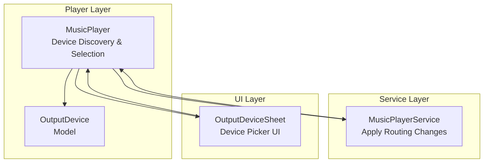
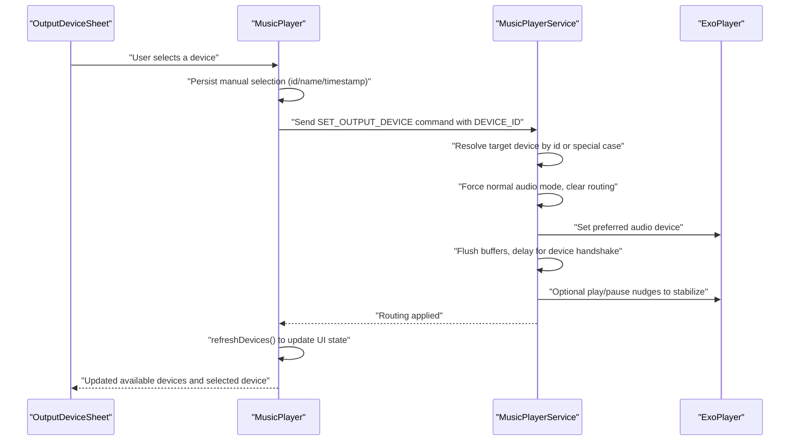
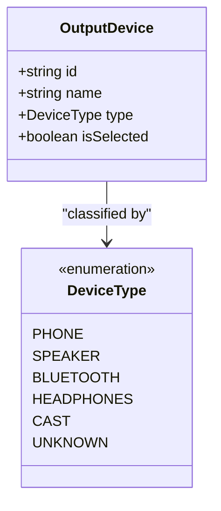
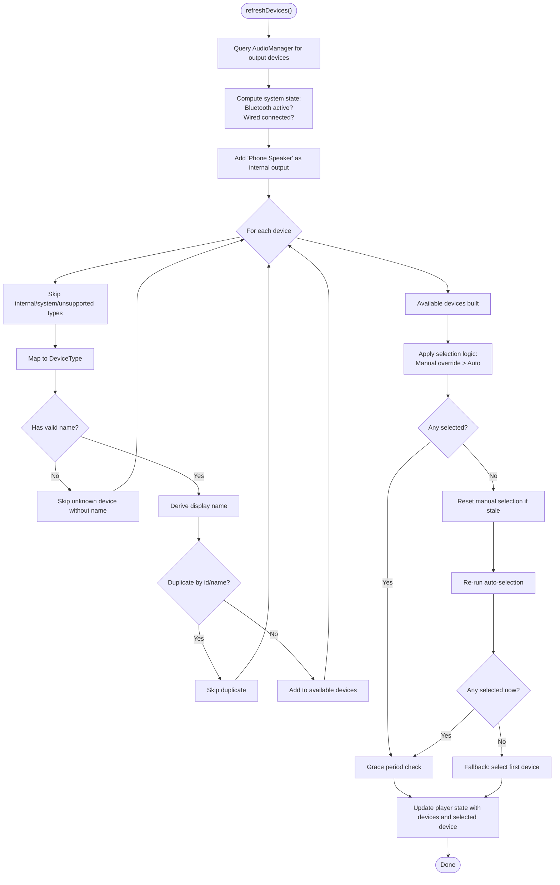
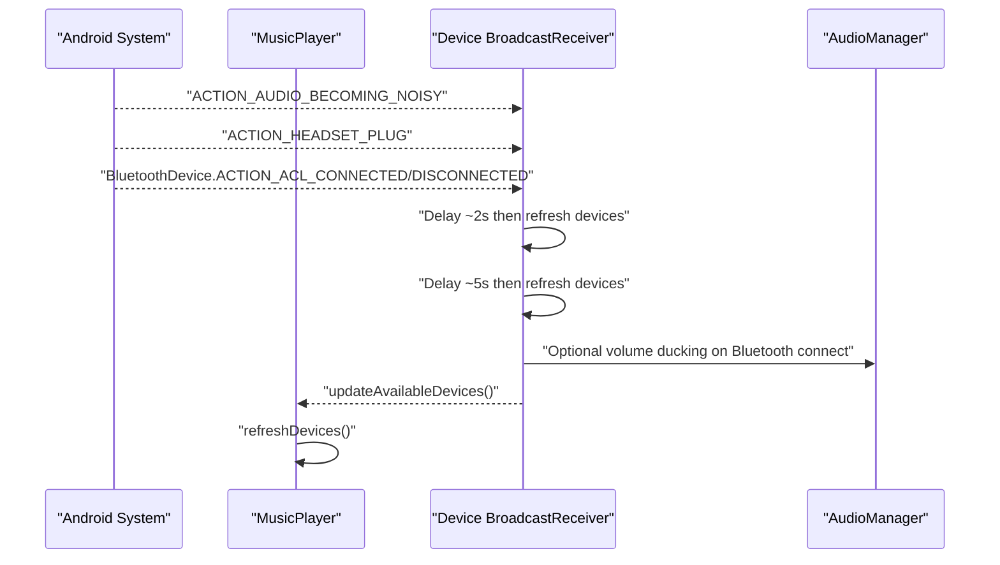
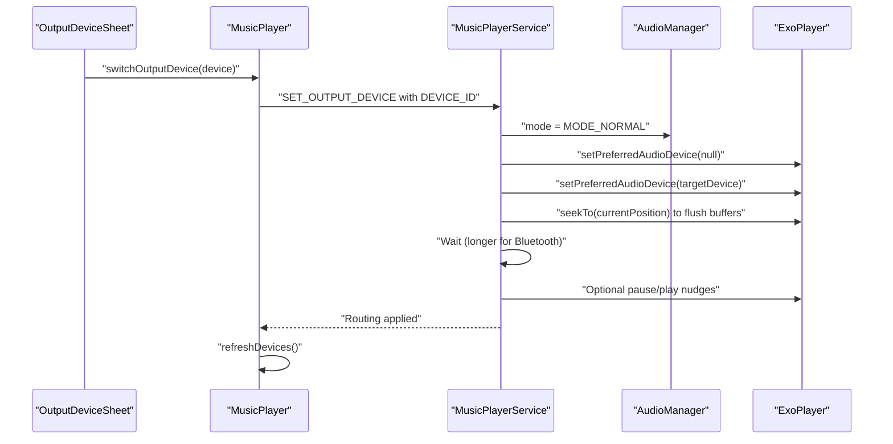
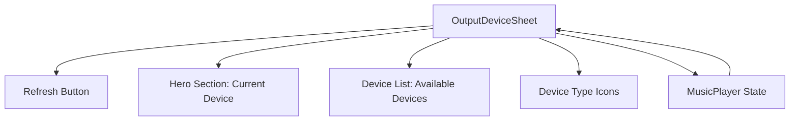
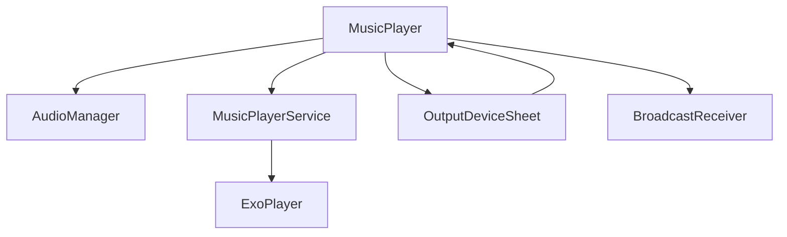

# Output Device Management

<cite>
**Referenced Files in This Document**
- [MusicPlayer.kt](file://app/src/main/java/com/suvojeet/suvmusic/player/MusicPlayer.kt)
- [MusicPlayerService.kt](file://app/src/main/java/com/suvojeet/suvmusic/service/MusicPlayerService.kt)
- [OutputDevice.kt](file://app/src/main/java/com/suvojeet/suvmusic/data/model/OutputDevice.kt)
- [OutputDeviceSheet.kt](file://app/src/main/java/com/suvojeet/suvmusic/ui/components/OutputDeviceSheet.kt)
- [AudioARManager.kt](file://app/src/main/java/com/suvojeet/suvmusic/player/AudioARManager.kt)
</cite>

## Table of Contents
1. [Introduction](#introduction)
2. [Project Structure](#project-structure)
3. [Core Components](#core-components)
4. [Architecture Overview](#architecture-overview)
5. [Detailed Component Analysis](#detailed-component-analysis)
6. [Dependency Analysis](#dependency-analysis)
7. [Performance Considerations](#performance-considerations)
8. [Troubleshooting Guide](#troubleshooting-guide)
9. [Conclusion](#conclusion)

## Introduction
This document explains the output device management system responsible for detecting, classifying, selecting, and switching audio output devices. It covers:
- Detection and classification of audio devices (phone speaker, Bluetooth, wired headphones, HDMI speakers)
- Automatic selection logic based on system state
- Manual override and persistence of user choices
- Grace period handling for device transitions
- Fallback mechanisms and edge-case handling
- Broadcast receiver integration for device change detection
- UI synchronization and user feedback
- Examples of device switching, state updates, and fallback scenarios

## Project Structure
The output device management spans three main areas:
- Player layer: device discovery, classification, selection, and switching
- Service layer: applying device changes via ExoPlayer routing
- UI layer: presenting available devices and current selection

**Diagram sources**
- [MusicPlayer.kt:200-399](file://app/src/main/java/com/suvojeet/suvmusic/player/MusicPlayer.kt#L200-L399)
- [MusicPlayerService.kt:708-788](file://app/src/main/java/com/suvojeet/suvmusic/service/MusicPlayerService.kt#L708-L788)
- [OutputDevice.kt:8-22](file://app/src/main/java/com/suvojeet/suvmusic/data/model/OutputDevice.kt#L8-L22)
- [OutputDeviceSheet.kt:33-195](file://app/src/main/java/com/suvojeet/suvmusic/ui/components/OutputDeviceSheet.kt#L33-L195)

**Section sources**
- [MusicPlayer.kt:200-399](file://app/src/main/java/com/suvojeet/suvmusic/player/MusicPlayer.kt#L200-L399)
- [MusicPlayerService.kt:708-788](file://app/src/main/java/com/suvojeet/suvmusic/service/MusicPlayerService.kt#L708-L788)
- [OutputDevice.kt:8-22](file://app/src/main/java/com/suvojeet/suvmusic/data/model/OutputDevice.kt#L8-L22)
- [OutputDeviceSheet.kt:33-195](file://app/src/main/java/com/suvojeet/suvmusic/ui/components/OutputDeviceSheet.kt#L33-L195)

## Core Components
- OutputDevice model: encapsulates device identity, display name, type, and selection state.
- DeviceType enumeration: categorizes devices into PHONE, SPEAKER, BLUETOOTH, HEADPHONES, CAST, UNKNOWN.
- MusicPlayer: discovers devices, applies auto/manual selection, persists manual overrides, and triggers service-based switching.
- MusicPlayerService: receives commands to apply routing changes, clears previous routing, sets preferred device, and performs post-switch stabilization.
- OutputDeviceSheet: UI for displaying current device, scanning for devices, and allowing manual selection.

Key responsibilities:
- Device detection: queries AudioManager for output devices and filters out internal/system devices.
- Classification: maps Android device types to DeviceType categories.
- Selection: prioritizes manual selection; otherwise auto-selects based on system state (Bluetooth/wired).
- Persistence: stores last manual selection ID/name and timestamp.
- Grace period: maintains manual selection for a short window to prevent flicker during transitions.
- Fallback: ensures a selection exists (defaults to phone speaker if none).
- UI sync: exposes available devices and selected device to the UI.

**Section sources**
- [OutputDevice.kt:8-22](file://app/src/main/java/com/suvojeet/suvmusic/data/model/OutputDevice.kt#L8-L22)
- [MusicPlayer.kt:273-457](file://app/src/main/java/com/suvojeet/suvmusic/player/MusicPlayer.kt#L273-L457)
- [MusicPlayerService.kt:708-788](file://app/src/main/java/com/suvojeet/suvmusic/service/MusicPlayerService.kt#L708-L788)
- [OutputDeviceSheet.kt:33-195](file://app/src/main/java/com/suvojeet/suvmusic/ui/components/OutputDeviceSheet.kt#L33-L195)

## Architecture Overview
The system integrates device detection, selection, and routing through a coordinated flow between the player and service layers, with UI updates triggered by state changes.

**Diagram sources**
- [MusicPlayer.kt:459-476](file://app/src/main/java/com/suvojeet/suvmusic/player/MusicPlayer.kt#L459-L476)
- [MusicPlayerService.kt:708-788](file://app/src/main/java/com/suvojeet/suvmusic/service/MusicPlayerService.kt#L708-L788)
- [OutputDeviceSheet.kt:33-195](file://app/src/main/java/com/suvojeet/suvmusic/ui/components/OutputDeviceSheet.kt#L33-L195)

## Detailed Component Analysis

### Device Model and Classification
The OutputDevice model carries device identity and classification. DeviceType enumerates supported categories used for selection logic.

**Diagram sources**
- [OutputDevice.kt:8-22](file://app/src/main/java/com/suvojeet/suvmusic/data/model/OutputDevice.kt#L8-L22)

**Section sources**
- [OutputDevice.kt:8-22](file://app/src/main/java/com/suvojeet/suvmusic/data/model/OutputDevice.kt#L8-L22)

### Device Detection and Selection Logic
MusicPlayer refreshDevices() builds the list of available devices, classifies them, deduplicates, and determines selection:
- Detects Bluetooth and wired headset presence to drive auto-selection.
- Adds a synthetic "Phone Speaker" entry.
- Skips internal/system devices and unknowns without valid names.
- Applies manual override when present; otherwise auto-selects based on device type.
- Implements a grace period to maintain manual selection during transitions.
- Falls back to selecting the first device if nothing is chosen.

**Diagram sources**
- [MusicPlayer.kt:273-457](file://app/src/main/java/com/suvojeet/suvmusic/player/MusicPlayer.kt#L273-L457)

**Section sources**
- [MusicPlayer.kt:273-457](file://app/src/main/java/com/suvojeet/suvmusic/player/MusicPlayer.kt#L273-L457)

### Manual Override and Persistence
Manual selection is persisted as device id, name, and selection timestamp. During device refresh, the system attempts to match by id or by name within a grace period to handle device id changes during routing handshakes.

Behavior highlights:
- On selection, persist id/name/timestamp.
- During refresh, prefer manual match; otherwise auto-select.
- If manual device disappears and grace period elapsed, reset manual and fall back to auto.
- If still no selection, choose the first device.

**Section sources**
- [MusicPlayer.kt:459-476](file://app/src/main/java/com/suvojeet/suvmusic/player/MusicPlayer.kt#L459-L476)
- [MusicPlayer.kt:417-446](file://app/src/main/java/com/suvojeet/suvmusic/player/MusicPlayer.kt#L417-L446)

### Device Change Detection and Broadcast Receiver
MusicPlayer registers a broadcast receiver to monitor audio-related events:
- Becoming noisy (headphone/unplug)
- Headset plug/unplug
- Bluetooth ACL connect/disconnect

On receiving these events, the receiver delays device refresh twice to allow the system to settle, then updates available devices. On Bluetooth connect, it optionally ducks volume and can trigger autoplay depending on settings.

**Diagram sources**
- [MusicPlayer.kt:200-259](file://app/src/main/java/com/suvojeet/suvmusic/player/MusicPlayer.kt#L200-L259)

**Section sources**
- [MusicPlayer.kt:200-259](file://app/src/main/java/com/suvojeet/suvmusic/player/MusicPlayer.kt#L200-L259)

### Applying Device Switches via Service
When the user selects a device, MusicPlayer sends a custom command to MusicPlayerService with the target device id. The service resolves the device, forces audio mode to normal, clears current routing, sets the preferred device, flushes buffers, waits for the device handshake, and performs stabilizing actions (optional play/pause nudges). Finally, it notifies the player to refresh devices and update UI state.

**Diagram sources**
- [MusicPlayer.kt:459-476](file://app/src/main/java/com/suvojeet/suvmusic/player/MusicPlayer.kt#L459-L476)
- [MusicPlayerService.kt:708-788](file://app/src/main/java/com/suvojeet/suvmusic/service/MusicPlayerService.kt#L708-L788)

**Section sources**
- [MusicPlayer.kt:459-476](file://app/src/main/java/com/suvojeet/suvmusic/player/MusicPlayer.kt#L459-L476)
- [MusicPlayerService.kt:708-788](file://app/src/main/java/com/suvojeet/suvmusic/service/MusicPlayerService.kt#L708-L788)

### UI Integration and Synchronization
OutputDeviceSheet displays:
- Current output device with a hero section
- A refresh button to scan for devices
- A scrollable list of available devices excluding the currently selected one
- Icons representing device types

The sheet triggers device refresh when opened and renders the current selection with a visual indicator.

**Diagram sources**
- [OutputDeviceSheet.kt:33-195](file://app/src/main/java/com/suvojeet/suvmusic/ui/components/OutputDeviceSheet.kt#L33-L195)
- [MusicPlayer.kt:261-263](file://app/src/main/java/com/suvojeet/suvmusic/player/MusicPlayer.kt#L261-L263)

**Section sources**
- [OutputDeviceSheet.kt:33-195](file://app/src/main/java/com/suvojeet/suvmusic/ui/components/OutputDeviceSheet.kt#L33-L195)
- [MusicPlayer.kt:261-263](file://app/src/main/java/com/suvojeet/suvmusic/player/MusicPlayer.kt#L261-L263)

### Edge Cases and Robustness
- Device name changes: The system derives a display name fallback based on type if the product name is blank or null.
- Duplicate devices: Deduplication by id and case-insensitive name prevents repeated entries.
- Device availability tracking: Grace period preserves manual selection during transitions to avoid flicker.
- Fallback mechanisms: If no selection exists after auto/manual logic, the first device is selected; if manual device is lost, the system resets manual selection and falls back to auto.
- Bluetooth-specific handling: Longer delays and extra nudges improve reliability for Bluetooth handshakes.

**Section sources**
- [MusicPlayer.kt:337-365](file://app/src/main/java/com/suvojeet/suvmusic/player/MusicPlayer.kt#L337-L365)
- [MusicPlayer.kt:397-452](file://app/src/main/java/com/suvojeet/suvmusic/player/MusicPlayer.kt#L397-L452)
- [MusicPlayerService.kt:742-785](file://app/src/main/java/com/suvojeet/suvmusic/service/MusicPlayerService.kt#L742-L785)

## Dependency Analysis
The output device management system exhibits clear separation of concerns:
- Player layer depends on AudioManager and ExoPlayer APIs to enumerate and route audio.
- Service layer applies routing changes and stabilizes playback after device switches.
- UI layer depends on player state for rendering and user interaction.
- Broadcast receiver bridges system events to device refresh.

**Diagram sources**
- [MusicPlayer.kt:200-259](file://app/src/main/java/com/suvojeet/suvmusic/player/MusicPlayer.kt#L200-L259)
- [MusicPlayerService.kt:708-788](file://app/src/main/java/com/suvojeet/suvmusic/service/MusicPlayerService.kt#L708-L788)
- [OutputDeviceSheet.kt:33-195](file://app/src/main/java/com/suvojeet/suvmusic/ui/components/OutputDeviceSheet.kt#L33-L195)

**Section sources**
- [MusicPlayer.kt:200-259](file://app/src/main/java/com/suvojeet/suvmusic/player/MusicPlayer.kt#L200-L259)
- [MusicPlayerService.kt:708-788](file://app/src/main/java/com/suvojeet/suvmusic/service/MusicPlayerService.kt#L708-L788)
- [OutputDeviceSheet.kt:33-195](file://app/src/main/java/com/suvojeet/suvmusic/ui/components/OutputDeviceSheet.kt#L33-L195)

## Performance Considerations
- Device enumeration and selection occur synchronously in refreshDevices(); keep the device list small and avoid unnecessary recalculations by leveraging UI-driven refresh triggers.
- Broadcasting device changes introduces two delayed refresh attempts; batching UI refreshes reduces redundant work.
- Service-side routing includes deliberate delays for Bluetooth handshakes; ensure these timeouts are tuned to device characteristics.
- Volume nudges and pause/play toggles are used sparingly to stabilize routing; avoid excessive retries.

## Troubleshooting Guide
Common issues and resolutions:
- No devices detected: Verify AudioManager permissions and ensure the app targets output devices. Confirm filtering does not exclude expected devices.
- Device flickers during Bluetooth transitions: The grace period prevents immediate fallback; if the device remains unavailable, the system resets manual selection and auto-selects.
- Silent after switching to Bluetooth: The service performs buffer flush and optional play/pause nudges; retry switching or ensure Bluetooth is paired and connected.
- Name appears as "null": The system derives a fallback name from the device type; ensure the device has a valid product name for clarity.
- Manual selection not sticking: Confirm the device id/name persistence and the grace period logic; if the device disappears, manual selection is cleared and auto-selection is attempted.

**Section sources**
- [MusicPlayer.kt:337-365](file://app/src/main/java/com/suvojeet/suvmusic/player/MusicPlayer.kt#L337-L365)
- [MusicPlayer.kt:397-452](file://app/src/main/java/com/suvojeet/suvmusic/player/MusicPlayer.kt#L397-L452)
- [MusicPlayerService.kt:742-785](file://app/src/main/java/com/suvojeet/suvmusic/service/MusicPlayerService.kt#L742-L785)

## Conclusion
The output device management system provides robust detection, classification, selection, and switching of audio output devices. It balances automatic behavior with manual control, gracefully handles transitions, and ensures reliable playback after device changes. The UI remains synchronized with device state, and the service layer stabilizes routing through targeted post-switch actions.