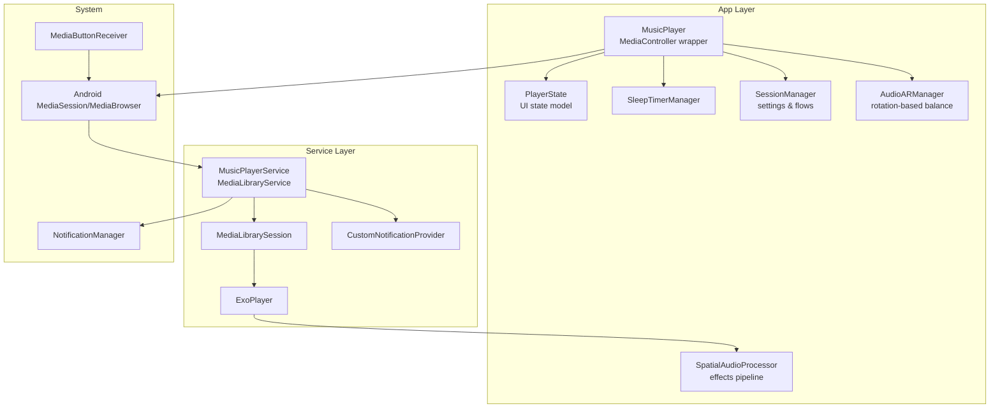
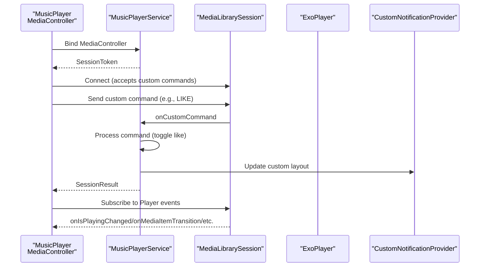
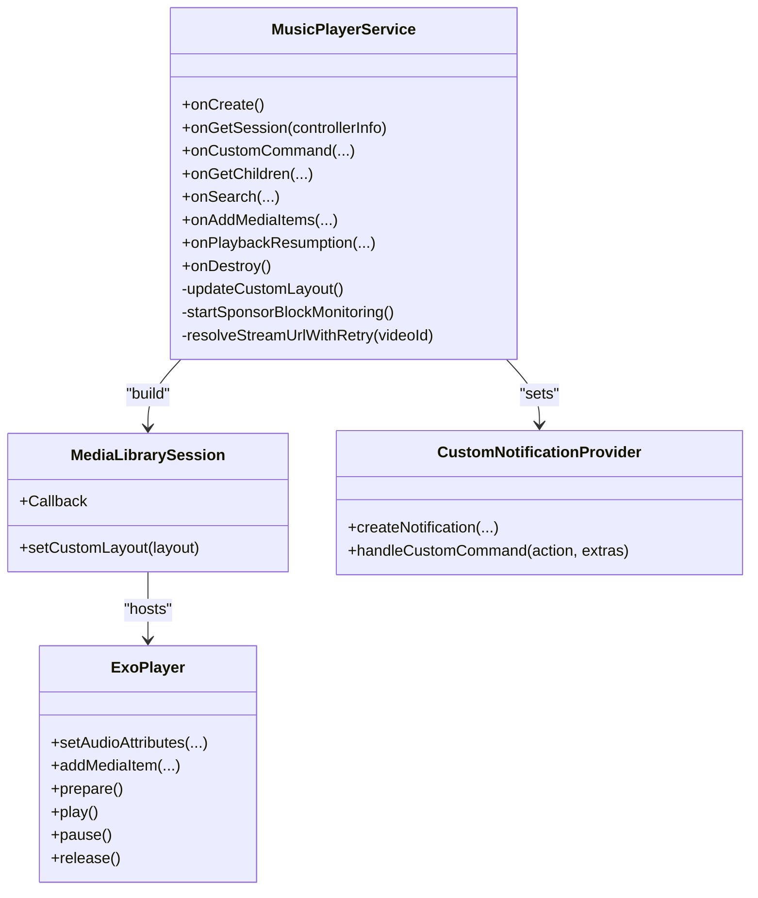
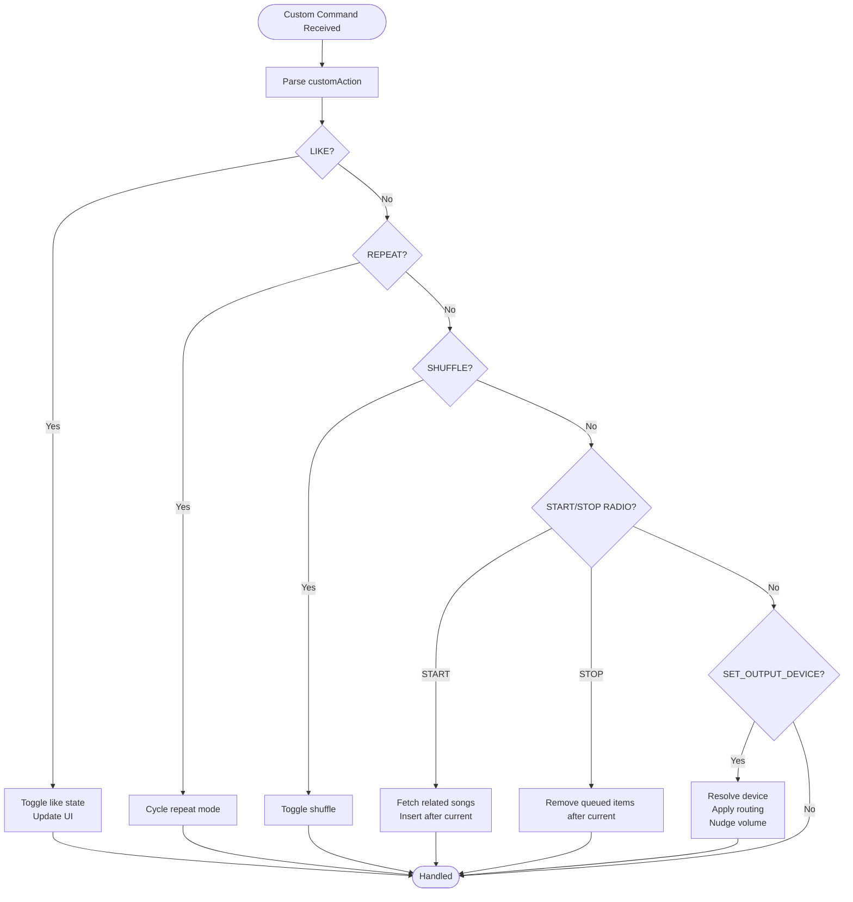
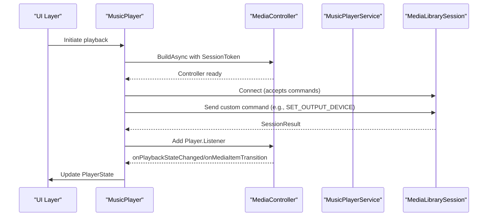
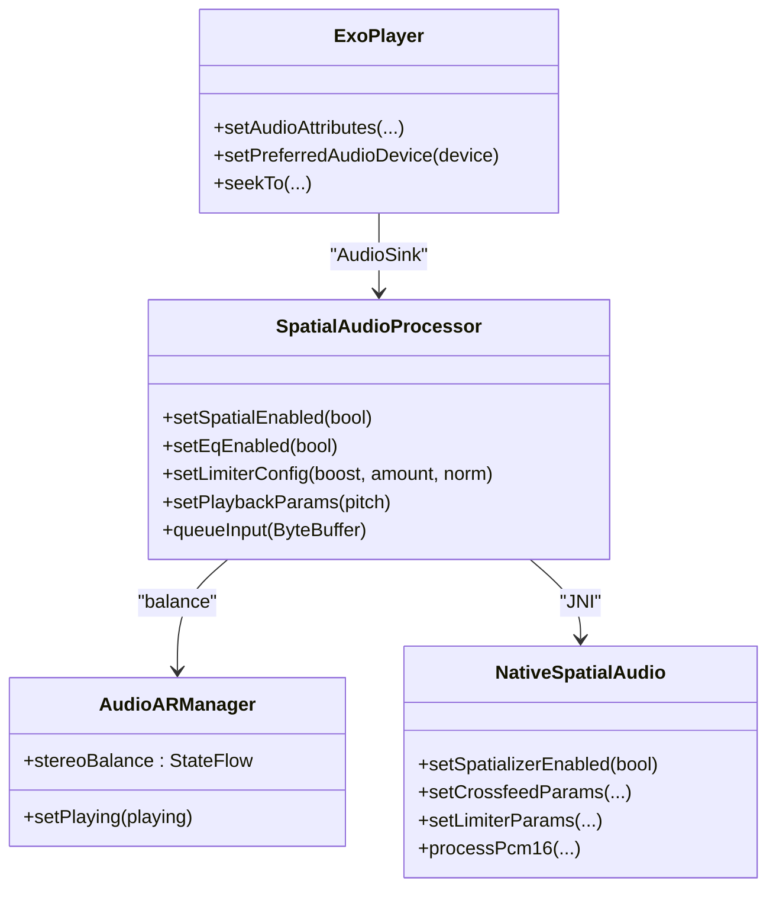
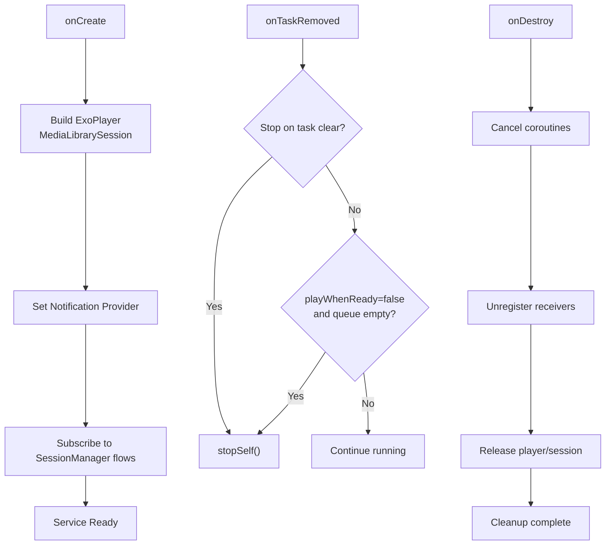
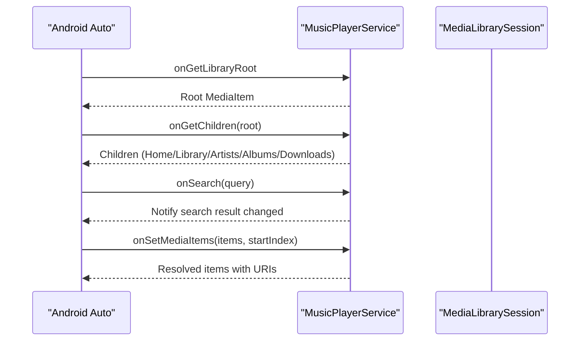
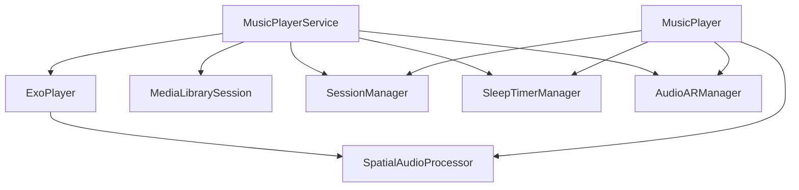

# Player Service Architecture

<cite>
**Referenced Files in This Document**
- [MusicPlayerService.kt](file://app/src/main/java/com/suvojeet/suvmusic/service/MusicPlayerService.kt)
- [MusicPlayer.kt](file://app/src/main/java/com/suvojeet/suvmusic/player/MusicPlayer.kt)
- [PlayerState.kt](file://app/src/main/java/com/suvojeet/suvmusic/data/model/PlayerState.kt)
- [AndroidManifest.xml](file://app/src/main/AndroidManifest.xml)
- [SessionManager.kt](file://app/src/main/java/com/suvojeet/suvmusic/data/SessionManager.kt)
- [SleepTimerManager.kt](file://app/src/main/java/com/suvojeet/suvmusic/player/SleepTimerManager.kt)
- [AudioARManager.kt](file://app/src/main/java/com/suvojeet/suvmusic/player/AudioARManager.kt)
- [SpatialAudioProcessor.kt](file://app/src/main/java/com/suvojeet/suvmusic/player/SpatialAudioProcessor.kt)
</cite>

## Table of Contents
1. [Introduction](#introduction)
2. [Project Structure](#project-structure)
3. [Core Components](#core-components)
4. [Architecture Overview](#architecture-overview)
5. [Detailed Component Analysis](#detailed-component-analysis)
6. [Dependency Analysis](#dependency-analysis)
7. [Performance Considerations](#performance-considerations)
8. [Troubleshooting Guide](#troubleshooting-guide)
9. [Conclusion](#conclusion)

## Introduction
This document explains the player service architecture and foreground service management in the SuvMusic application. It covers the Media3 MediaLibraryService implementation, custom command handling, IPC communication patterns, service lifecycle, foreground service requirements, and notification management. It also details integration with Media3 ExoPlayer session, media button handling, remote control support, service binding patterns, client connections, state synchronization mechanisms, and error handling strategies. Background execution limits, battery optimization considerations, and proper service cleanup procedures are addressed.

## Project Structure
The player subsystem centers on a MediaLibraryService that hosts an ExoPlayer instance and exposes a MediaSession to clients. The MusicPlayer client wraps a MediaController to communicate with the service. Supporting managers coordinate settings, audio effects, sleep timers, and device routing.

**Diagram sources**
- [MusicPlayerService.kt:187-1313](file://app/src/main/java/com/suvojeet/suvmusic/service/MusicPlayerService.kt#L187-L1313)
- [MusicPlayer.kt:479-499](file://app/src/main/java/com/suvojeet/suvmusic/player/MusicPlayer.kt#L479-L499)
- [PlayerState.kt:7-35](file://app/src/main/java/com/suvojeet/suvmusic/data/model/PlayerState.kt#L7-L35)
- [AndroidManifest.xml:157-167](file://app/src/main/AndroidManifest.xml#L157-L167)

**Section sources**
- [MusicPlayerService.kt:187-1313](file://app/src/main/java/com/suvojeet/suvmusic/service/MusicPlayerService.kt#L187-L1313)
- [MusicPlayer.kt:479-499](file://app/src/main/java/com/suvojeet/suvmusic/player/MusicPlayer.kt#L479-L499)
- [PlayerState.kt:7-35](file://app/src/main/java/com/suvojeet/suvmusic/data/model/PlayerState.kt#L7-L35)
- [AndroidManifest.xml:157-167](file://app/src/main/AndroidManifest.xml#L157-L167)

## Core Components
- MusicPlayerService: MediaLibraryService hosting ExoPlayer, MediaLibrarySession, and custom notification provider. Handles custom commands, Android Auto browsing, and playback state synchronization.
- MusicPlayer: MediaController wrapper that connects to MusicPlayerService, manages device routing, preloading, and state synchronization to PlayerState.
- PlayerState: Immutable UI state model reflecting current song, queue, playback mode, and device selection.
- SessionManager: Centralized settings store using DataStore and EncryptedSharedPreferences, exposing reactive flows for UI and service.
- SleepTimerManager: Reactive sleep timer with countdown and end-of-song mode.
- AudioARManager: Rotation sensor listener for device orientation-based stereo balance.
- SpatialAudioProcessor: BaseAudioProcessor implementing crossfeed, EQ, limiter, and optional spatial audio via native JNI.

**Section sources**
- [MusicPlayerService.kt:50-90](file://app/src/main/java/com/suvojeet/suvmusic/service/MusicPlayerService.kt#L50-L90)
- [MusicPlayer.kt:58-72](file://app/src/main/java/com/suvojeet/suvmusic/player/MusicPlayer.kt#L58-L72)
- [PlayerState.kt:7-35](file://app/src/main/java/com/suvojeet/suvmusic/data/model/PlayerState.kt#L7-L35)
- [SessionManager.kt:63-65](file://app/src/main/java/com/suvojeet/suvmusic/data/SessionManager.kt#L63-L65)
- [SleepTimerManager.kt:31-53](file://app/src/main/java/com/suvojeet/suvmusic/player/SleepTimerManager.kt#L31-L53)
- [AudioARManager.kt:29-32](file://app/src/main/java/com/suvojeet/suvmusic/player/AudioARManager.kt#L29-L32)
- [SpatialAudioProcessor.kt:13-16](file://app/src/main/java/com/suvojeet/suvmusic/player/SpatialAudioProcessor.kt#L13-L16)

## Architecture Overview
The service architecture follows Media3 patterns:
- Service lifecycle: onCreate initializes ExoPlayer, MediaLibrarySession, and notification provider. Service runs in foreground with mediaPlayback type.
- MediaSession: Provides session and player commands to clients and Android Auto. Custom commands extend session capabilities.
- MediaBrowser/Library: Implements browsing and search for Android Auto with cached contexts and resolved URIs.
- IPC: Clients bind via MediaController to send commands and receive state updates.
- Notifications: Custom notification provider augments default notifications with custom action buttons.

**Diagram sources**
- [MusicPlayerService.kt:629-673](file://app/src/main/java/com/suvojeet/suvmusic/service/MusicPlayerService.kt#L629-L673)
- [MusicPlayerService.kt:680-830](file://app/src/main/java/com/suvojeet/suvmusic/service/MusicPlayerService.kt#L680-L830)
- [MusicPlayerService.kt:1355-1391](file://app/src/main/java/com/suvojeet/suvmusic/service/MusicPlayerService.kt#L1355-L1391)
- [MusicPlayer.kt:479-499](file://app/src/main/java/com/suvojeet/suvmusic/player/MusicPlayer.kt#L479-L499)

**Section sources**
- [MusicPlayerService.kt:187-272](file://app/src/main/java/com/suvojeet/suvmusic/service/MusicPlayerService.kt#L187-L272)
- [MusicPlayerService.kt:629-830](file://app/src/main/java/com/suvojeet/suvmusic/service/MusicPlayerService.kt#L629-L830)
- [MusicPlayerService.kt:1355-1391](file://app/src/main/java/com/suvojeet/suvmusic/service/MusicPlayerService.kt#L1355-L1391)
- [MusicPlayer.kt:479-499](file://app/src/main/java/com/suvojeet/suvmusic/player/MusicPlayer.kt#L479-L499)

## Detailed Component Analysis

### MusicPlayerService: MediaLibraryService Implementation
- Initialization: Creates ExoPlayer with custom RenderersFactory, DefaultAudioSink configured with SpatialAudioProcessor, DataSource factory, and LoadControl. Applies runtime settings (audio offload, audio attributes) based on SessionManager flows.
- MediaLibrarySession: Builds MediaLibrarySession with MediaLibrarySession.Callback to grant extended session and player commands, ensuring Android Auto controls are visible.
- Custom Commands: Defines COMMAND_LIKE, COMMAND_REPEAT, COMMAND_SHUFFLE, COMMAND_START_RADIO, COMMAND_STOP_RADIO, and SET_OUTPUT_DEVICE. Processes these in onCustomCommand and onPostConnect.
- Android Auto Browsing: Implements onGetLibraryRoot, onGetChildren, onSearch, onGetSearchResult, onSetMediaItems, and onAddMediaItems. Uses caches for home sections, search results, and playlist context to support skip/queue operations.
- Playback Monitoring: Listens to player events (onMediaItemTransition, onIsPlayingChanged, onPlaybackStateChanged, onPlayerError, onPlayWhenReadyChanged) to manage SponsorBlock, fade-in, and recovery logic.
- Notification Management: Provides CustomNotificationProvider that extends default notification and sets ongoing flags. Updates custom layout dynamically based on player state and liked status.
- Sleep Timer: Maintains a persistent sleep timer notification with cancel action handling.
- Lifecycle: Handles onTaskRemoved and onDestroy for cleanup and stopping.

**Diagram sources**
- [MusicPlayerService.kt:187-272](file://app/src/main/java/com/suvojeet/suvmusic/service/MusicPlayerService.kt#L187-L272)
- [MusicPlayerService.kt:629-830](file://app/src/main/java/com/suvojeet/suvmusic/service/MusicPlayerService.kt#L629-L830)
- [MusicPlayerService.kt:1355-1391](file://app/src/main/java/com/suvojeet/suvmusic/service/MusicPlayerService.kt#L1355-L1391)

**Section sources**
- [MusicPlayerService.kt:187-272](file://app/src/main/java/com/suvojeet/suvmusic/service/MusicPlayerService.kt#L187-L272)
- [MusicPlayerService.kt:629-830](file://app/src/main/java/com/suvojeet/suvmusic/service/MusicPlayerService.kt#L629-L830)
- [MusicPlayerService.kt:832-1148](file://app/src/main/java/com/suvojeet/suvmusic/service/MusicPlayerService.kt#L832-L1148)
- [MusicPlayerService.kt:1355-1391](file://app/src/main/java/com/suvojeet/suvmusic/service/MusicPlayerService.kt#L1355-L1391)
- [MusicPlayerService.kt:1458-1472](file://app/src/main/java/com/suvojeet/suvmusic/service/MusicPlayerService.kt#L1458-L1472)

### Custom Command Handling
- COMMAND_LIKE toggles liked state via YouTube repository and updates custom layout.
- COMMAND_REPEAT cycles repeat modes (off/all/one).
- COMMAND_SHUFFLE toggles shuffle mode.
- COMMAND_START_RADIO fetches related songs and inserts them after current item.
- COMMAND_STOP_RADIO clears queued songs after current.
- SET_OUTPUT_DEVICE routes audio to a specific device, resets kickstart flag, and nudges volume to recover from routing issues.

**Diagram sources**
- [MusicPlayerService.kt:680-830](file://app/src/main/java/com/suvojeet/suvmusic/service/MusicPlayerService.kt#L680-L830)

**Section sources**
- [MusicPlayerService.kt:680-830](file://app/src/main/java/com/suvojeet/suvmusic/service/MusicPlayerService.kt#L680-L830)

### IPC Communication Patterns and Binding
- Binding: MusicPlayer constructs a MediaController via MediaController.Builder with a SessionToken targeting MusicPlayerService. It registers a Player.Listener to receive playback state updates and synchronizes PlayerState.
- Command Flow: MusicPlayer sends custom commands (e.g., SET_OUTPUT_DEVICE) to the service through MediaController.sendCustomCommand and receives immediate SessionResult.
- State Synchronization: Player.Listener updates PlayerState (isPlaying, repeat/shuffle, queue, positions) and coordinates with SessionManager flows for reactive settings.

**Diagram sources**
- [MusicPlayer.kt:479-499](file://app/src/main/java/com/suvojeet/suvmusic/player/MusicPlayer.kt#L479-L499)
- [MusicPlayer.kt:501-598](file://app/src/main/java/com/suvojeet/suvmusic/player/MusicPlayer.kt#L501-L598)
- [MusicPlayerService.kt:629-673](file://app/src/main/java/com/suvojeet/suvmusic/service/MusicPlayerService.kt#L629-L673)

**Section sources**
- [MusicPlayer.kt:479-499](file://app/src/main/java/com/suvojeet/suvmusic/player/MusicPlayer.kt#L479-L499)
- [MusicPlayer.kt:501-598](file://app/src/main/java/com/suvojeet/suvmusic/player/MusicPlayer.kt#L501-L598)
- [MusicPlayerService.kt:629-673](file://app/src/main/java/com/suvojeet/suvmusic/service/MusicPlayerService.kt#L629-L673)

### Foreground Service, Notifications, and Media Buttons
- Foreground Service: Declared in manifest with MediaLibraryService actions and foregroundServiceType mediaPlayback. Service runs continuously for background playback.
- Notification Channel: Created in-service with IMPORTANCE_LOW and badge disabled.
- MediaButtonReceiver: Registered globally to handle MEDIA_BUTTON intents for hardware and car integration.
- Custom Notification Provider: Extends default notification, sets ongoing flag, and delegates custom command handling to handleCustomCommand.

**Diagram sources**
- [AndroidManifest.xml:214-220](file://app/src/main/AndroidManifest.xml#L214-L220)
- [AndroidManifest.xml:157-167](file://app/src/main/AndroidManifest.xml#L157-L167)
- [MusicPlayerService.kt:144-157](file://app/src/main/java/com/suvojeet/suvmusic/service/MusicPlayerService.kt#L144-L157)
- [MusicPlayerService.kt:1355-1391](file://app/src/main/java/com/suvojeet/suvmusic/service/MusicPlayerService.kt#L1355-L1391)

**Section sources**
- [AndroidManifest.xml:157-167](file://app/src/main/AndroidManifest.xml#L157-L167)
- [AndroidManifest.xml:214-220](file://app/src/main/AndroidManifest.xml#L214-L220)
- [MusicPlayerService.kt:144-157](file://app/src/main/java/com/suvojeet/suvmusic/service/MusicPlayerService.kt#L144-L157)
- [MusicPlayerService.kt:1355-1391](file://app/src/main/java/com/suvojeet/suvmusic/service/MusicPlayerService.kt#L1355-L1391)

### Media3 ExoPlayer Integration and Effects Pipeline
- ExoPlayer: Built with DefaultRenderersFactory overridden to supply DefaultAudioSink containing SpatialAudioProcessor. LoadControl tuned for buffering and back buffer sizing.
- SpatialAudioProcessor: Implements BaseAudioProcessor to apply crossfeed, EQ, limiter, and optional spatial audio. Integrates with AudioARManager for stereo balance and with NativeSpatialAudio via JNI.
- Audio Routing: SET_OUTPUT_DEVICE resolves target device, clears preferred device, applies routing, and nudges volume to recover from silent states post-routing.

**Diagram sources**
- [MusicPlayerService.kt:206-218](file://app/src/main/java/com/suvojeet/suvmusic/service/MusicPlayerService.kt#L206-L218)
- [SpatialAudioProcessor.kt:13-16](file://app/src/main/java/com/suvojeet/suvmusic/player/SpatialAudioProcessor.kt#L13-L16)
- [SpatialAudioProcessor.kt:107-111](file://app/src/main/java/com/suvojeet/suvmusic/player/SpatialAudioProcessor.kt#L107-L111)
- [AudioARManager.kt:32-32](file://app/src/main/java/com/suvojeet/suvmusic/player/AudioARManager.kt#L32-L32)

**Section sources**
- [MusicPlayerService.kt:206-218](file://app/src/main/java/com/suvojeet/suvmusic/service/MusicPlayerService.kt#L206-L218)
- [SpatialAudioProcessor.kt:13-16](file://app/src/main/java/com/suvojeet/suvmusic/player/SpatialAudioProcessor.kt#L13-L16)
- [SpatialAudioProcessor.kt:107-111](file://app/src/main/java/com/suvojeet/suvmusic/player/SpatialAudioProcessor.kt#L107-L111)
- [AudioARManager.kt:32-32](file://app/src/main/java/com/suvojeet/suvmusic/player/AudioARManager.kt#L32-L32)

### Service Lifecycle, State Synchronization, and Cleanup
- Lifecycle: onCreate builds ExoPlayer and MediaLibrarySession, sets MediaNotificationProvider, registers volume receiver, and subscribes to SessionManager flows for reactive settings. onTaskRemoved checks stop-on-clear and pause conditions. onDestroy cancels scopes, stops receivers, cancels sleep timer notification, releases player and session.
- State Synchronization: Player.Listener updates PlayerState and coordinates with SessionManager flows for reactive settings. MusicPlayer maintains a cache of resolved video IDs and preloads next song for gapless transitions.
- Cleanup: Properly unregisters broadcast receivers, cancels coroutines, releases ExoPlayer and MediaLibrarySession, and cancels ongoing notifications.

**Diagram sources**
- [MusicPlayerService.kt:187-272](file://app/src/main/java/com/suvojeet/suvmusic/service/MusicPlayerService.kt#L187-L272)
- [MusicPlayerService.kt:1399-1410](file://app/src/main/java/com/suvojeet/suvmusic/service/MusicPlayerService.kt#L1399-L1410)
- [MusicPlayerService.kt:1458-1472](file://app/src/main/java/com/suvojeet/suvmusic/service/MusicPlayerService.kt#L1458-L1472)

**Section sources**
- [MusicPlayerService.kt:187-272](file://app/src/main/java/com/suvojeet/suvmusic/service/MusicPlayerService.kt#L187-L272)
- [MusicPlayerService.kt:1399-1410](file://app/src/main/java/com/suvojeet/suvmusic/service/MusicPlayerService.kt#L1399-L1410)
- [MusicPlayerService.kt:1458-1472](file://app/src/main/java/com/suvojeet/suvmusic/service/MusicPlayerService.kt#L1458-L1472)

### Android Auto Integration and Remote Control Support
- Android Auto Browsing: Implements onGetLibraryRoot, onGetChildren, onSearch, onGetSearchResult, onSetMediaItems, and onAddMediaItems to expose library, home sections, playlists, artists, albums, and downloads. Uses cached contexts to support skip/queue operations.
- Remote Control: Grants extensive player commands in onConnect to ensure controls are visible on Android Auto. Custom commands extend remote control capabilities.

**Diagram sources**
- [MusicPlayerService.kt:832-1148](file://app/src/main/java/com/suvojeet/suvmusic/service/MusicPlayerService.kt#L832-L1148)

**Section sources**
- [MusicPlayerService.kt:832-1148](file://app/src/main/java/com/suvojeet/suvmusic/service/MusicPlayerService.kt#L832-L1148)

## Dependency Analysis
- Service depends on Media3 ExoPlayer and MediaLibrarySession for playback and browsing.
- MusicPlayer depends on MediaController and Player.Listener for IPC and state updates.
- SessionManager provides reactive flows for audio effects, equalizer, volume normalization, and device routing.
- AudioARManager integrates with SpatialAudioProcessor and SensorManager for orientation-based balance.
- SleepTimerManager provides reactive countdown and end-of-song mode.

**Diagram sources**
- [MusicPlayerService.kt:50-90](file://app/src/main/java/com/suvojeet/suvmusic/service/MusicPlayerService.kt#L50-L90)
- [MusicPlayer.kt:58-72](file://app/src/main/java/com/suvojeet/suvmusic/player/MusicPlayer.kt#L58-L72)
- [SessionManager.kt:63-65](file://app/src/main/java/com/suvojeet/suvmusic/data/SessionManager.kt#L63-L65)
- [AudioARManager.kt:29-32](file://app/src/main/java/com/suvojeet/suvmusic/player/AudioARManager.kt#L29-L32)
- [SpatialAudioProcessor.kt:13-16](file://app/src/main/java/com/suvojeet/suvmusic/player/SpatialAudioProcessor.kt#L13-L16)

**Section sources**
- [MusicPlayerService.kt:50-90](file://app/src/main/java/com/suvojeet/suvmusic/service/MusicPlayerService.kt#L50-L90)
- [MusicPlayer.kt:58-72](file://app/src/main/java/com/suvojeet/suvmusic/player/MusicPlayer.kt#L58-L72)
- [SessionManager.kt:63-65](file://app/src/main/java/com/suvojeet/suvmusic/data/SessionManager.kt#L63-L65)
- [AudioARManager.kt:29-32](file://app/src/main/java/com/suvojeet/suvmusic/player/AudioARManager.kt#L29-L32)
- [SpatialAudioProcessor.kt:13-16](file://app/src/main/java/com/suvojeet/suvmusic/player/SpatialAudioProcessor.kt#L13-L16)

## Performance Considerations
- Buffering and Back Buffer Tuning: LoadControl configured with larger buffers and back buffer to improve seeking and reduce stalls.
- Audio Offload vs Effects: Dynamic audio offload preferences are disabled when spatial audio, EQ, or limiter are active to ensure software processors run.
- SponsorBlock Monitoring: Adaptive polling reduces CPU usage by sleeping longer when the next skip segment is far away.
- Fade-In on Ready: Prevents "silent handshake" issues by gradually ramping volume on audio sink readiness.
- Preloading: Next song preloading is configurable and guarded to avoid unnecessary work when disabled.

[No sources needed since this section provides general guidance]

## Troubleshooting Guide
- AudioSink Errors: Service detects AudioSink initialization/write failures and retries preparation/play after a brief delay.
- Placeholder URI Failures: Service and client avoid auto-advancing on placeholder URIs; resolution is deferred to ensure stable playback.
- Device Routing Issues: SET_OUTPUT_DEVICE resets audio mode, clears preferred device, applies new routing, seeks to flush buffers, and nudges volume to recover from silent states.
- Task Removal Behavior: Service respects user setting to stop on task clear or pauses when queue is empty.
- Notification Cleanup: Sleep timer notification is canceled on destroy and when timer completes.

**Section sources**
- [MusicPlayerService.kt:438-489](file://app/src/main/java/com/suvojeet/suvmusic/service/MusicPlayerService.kt#L438-L489)
- [MusicPlayerService.kt:708-787](file://app/src/main/java/com/suvojeet/suvmusic/service/MusicPlayerService.kt#L708-L787)
- [MusicPlayerService.kt:1399-1410](file://app/src/main/java/com/suvojeet/suvmusic/service/MusicPlayerService.kt#L1399-L1410)
- [MusicPlayerService.kt:1458-1472](file://app/src/main/java/com/suvojeet/suvmusic/service/MusicPlayerService.kt#L1458-L1472)

## Conclusion
The SuvMusic player service architecture leverages Media3’s MediaLibraryService and MediaSession to deliver robust background playback, Android Auto integration, and responsive remote control support. The design emphasizes reactive settings via SessionManager flows, resilient playback with SponsorBlock and error recovery, and a flexible effects pipeline through SpatialAudioProcessor. Foreground service management, media button handling, and careful lifecycle management ensure reliability under background execution limits and battery optimization constraints.