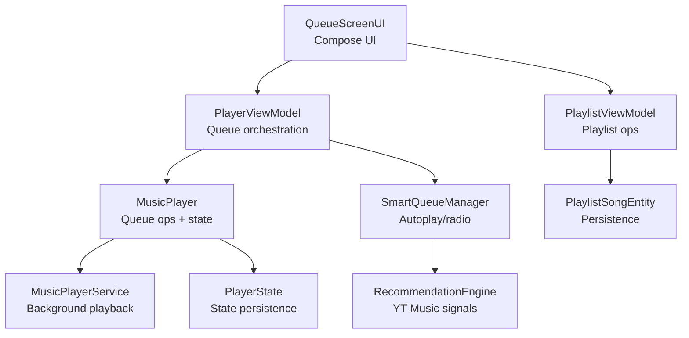
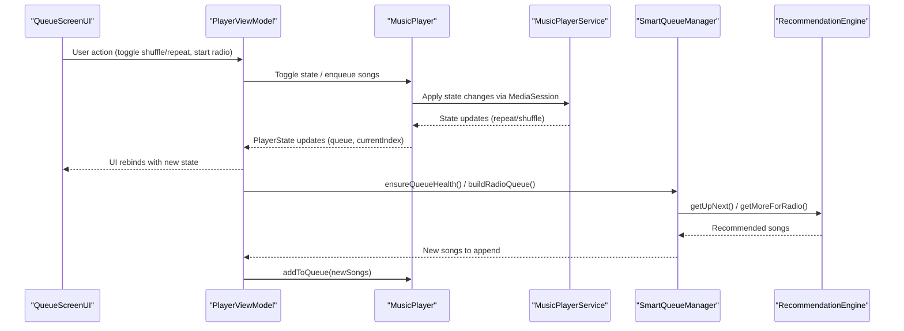
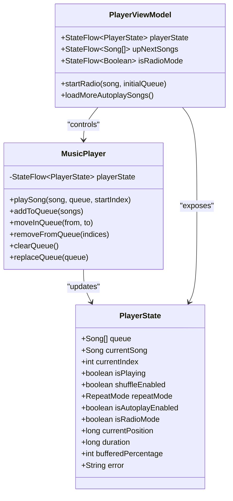
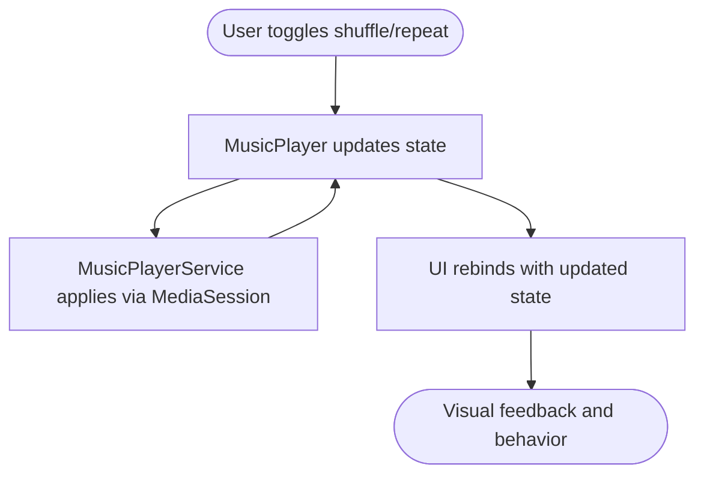
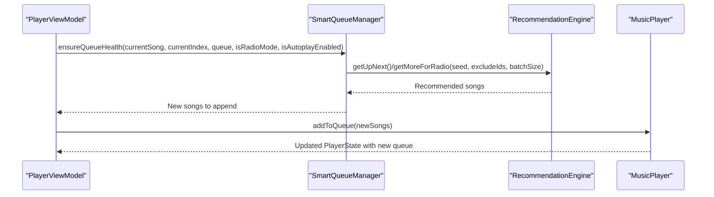
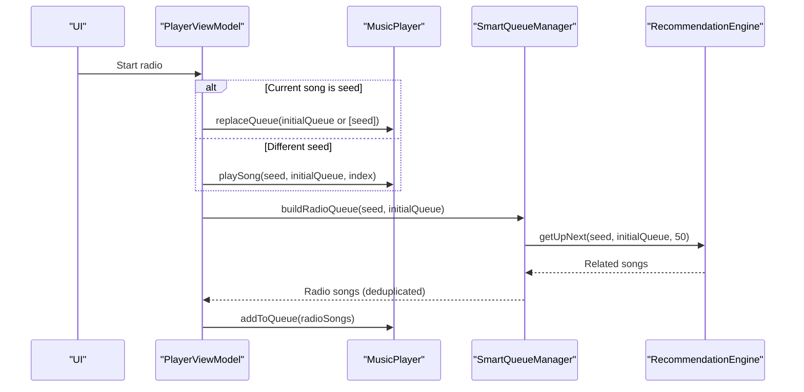
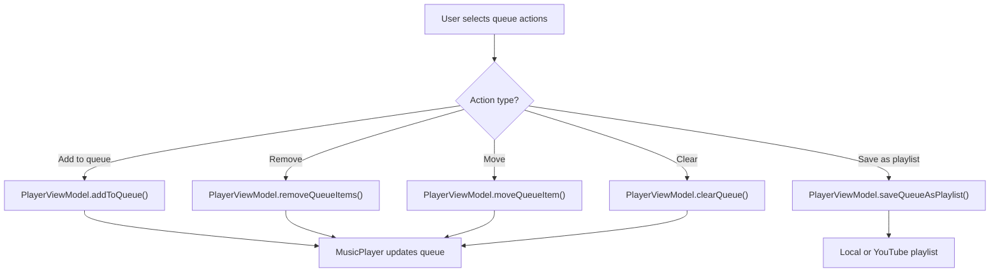
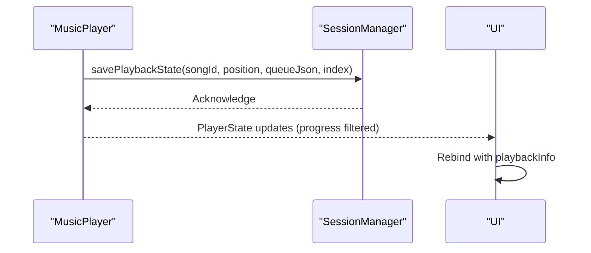
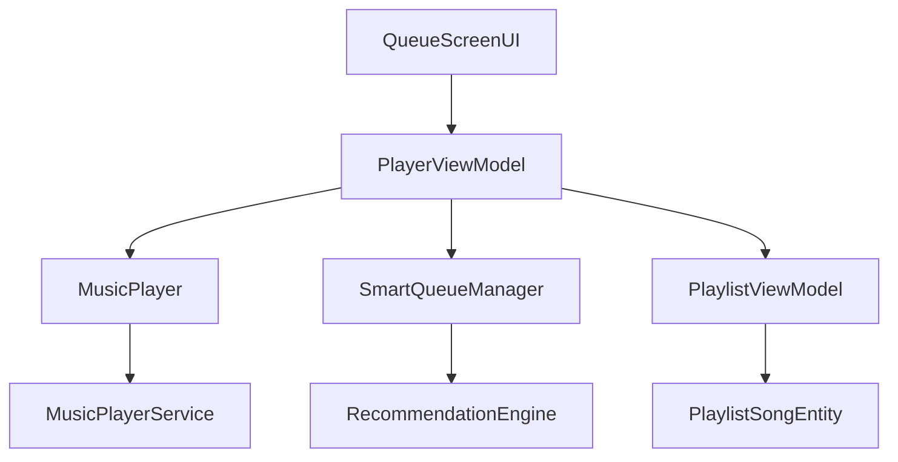

# Queue and Playlist Management

<cite>
**Referenced Files in This Document**
- [SmartQueueManager.kt](file://app/src/main/java/com/suvojeet/suvmusic/recommendation/SmartQueueManager.kt)
- [RecommendationEngine.kt](file://app/src/main/java/com/suvojeet/suvmusic/recommendation/RecommendationEngine.kt)
- [MusicPlayer.kt](file://app/src/main/java/com/suvojeet/suvmusic/player/MusicPlayer.kt)
- [MusicPlayerService.kt](file://app/src/main/java/com/suvojeet/suvmusic/service/MusicPlayerService.kt)
- [PlayerViewModel.kt](file://app/src/main/java/com/suvojeet/suvmusic/ui/viewmodel/PlayerViewModel.kt)
- [QueueScreenUI.kt](file://app/src/main/java/com/suvojeet/suvmusic/ui/screens/player/components/QueueScreenUI.kt)
- [PlayerState.kt](file://app/src/main/java/com/suvojeet/suvmusic/data/model/PlayerState.kt)
- [Playlist.kt](file://core/model/src/main/java/com/suvojeet/suvmusic/core/model/Playlist.kt)
- [PlaylistSongEntity.kt](file://core/data/src/main/java/com/suvojeet/suvmusic/core/data/local/entity/PlaylistSongEntity.kt)
- [PlaylistViewModel.kt](file://app/src/main/java/com/suvojeet/suvmusic/ui/viewmodel/PlaylistViewModel.kt)
- [PlaylistManagementViewModel.kt](file://app/src/main/java/com/suvojeet/suvmusic/ui/viewmodel/PlaylistManagementViewModel.kt)
</cite>

## Table of Contents
1. [Introduction](#introduction)
2. [Project Structure](#project-structure)
3. [Core Components](#core-components)
4. [Architecture Overview](#architecture-overview)
5. [Detailed Component Analysis](#detailed-component-analysis)
6. [Dependency Analysis](#dependency-analysis)
7. [Performance Considerations](#performance-considerations)
8. [Troubleshooting Guide](#troubleshooting-guide)
9. [Conclusion](#conclusion)

## Introduction
This document provides comprehensive technical documentation for the queue and playlist management system in SuvMusic. It explains the queue data structure, song ordering mechanisms, shuffle/repeat functionality, and the intelligent queue features powered by YouTube Music recommendations. It covers state synchronization between the UI and player service, real-time updates, state persistence, and playlist operations. The document also addresses smart queue features, autoplay logic, and radio mode implementation, with practical examples of queue manipulation operations, state flow updates, and UI binding patterns. Finally, it includes performance optimization strategies for large queues, memory management, and efficient state updates.

## Project Structure
The queue and playlist management spans several layers:
- UI Layer: Compose-based queue screen with selection, reordering, and playlist operations
- View Model Layer: PlayerViewModel orchestrating queue actions, autoplay, and radio mode
- Player Layer: MusicPlayer managing playback state, queue operations, and state persistence
- Service Layer: MusicPlayerService handling background playback and media session commands
- Recommendation Layer: SmartQueueManager and RecommendationEngine providing intelligent queue augmentation
- Data Layer: PlayerState model and playlist entities for persistence and UI binding

**Diagram sources**
- [QueueScreenUI.kt:1-523](file://app/src/main/java/com/suvojeet/suvmusic/ui/screens/player/components/QueueScreenUI.kt#L1-L523)
- [PlayerViewModel.kt:1-1474](file://app/src/main/java/com/suvojeet/suvmusic/ui/viewmodel/PlayerViewModel.kt#L1-L1474)
- [MusicPlayer.kt:1-2415](file://app/src/main/java/com/suvojeet/suvmusic/player/MusicPlayer.kt#L1-L2415)
- [MusicPlayerService.kt:1-1609](file://app/src/main/java/com/suvojeet/suvmusic/service/MusicPlayerService.kt#L1-L1609)
- [SmartQueueManager.kt:1-142](file://app/src/main/java/com/suvojeet/suvmusic/recommendation/SmartQueueManager.kt#L1-L142)
- [RecommendationEngine.kt:1-1277](file://app/src/main/java/com/suvojeet/suvmusic/recommendation/RecommendationEngine.kt#L1-L1277)
- [PlayerState.kt](file://app/src/main/java/com/suvojeet/suvmusic/data/model/PlayerState.kt)
- [PlaylistViewModel.kt](file://app/src/main/java/com/suvojeet/suvmusic/ui/viewmodel/PlaylistViewModel.kt)
- [PlaylistSongEntity.kt](file://core/data/src/main/java/com/suvojeet/suvmusic/core/data/local/entity/PlaylistSongEntity.kt)

**Section sources**
- [QueueScreenUI.kt:1-523](file://app/src/main/java/com/suvojeet/suvmusic/ui/screens/player/components/QueueScreenUI.kt#L1-L523)
- [PlayerViewModel.kt:1-1474](file://app/src/main/java/com/suvojeet/suvmusic/ui/viewmodel/PlayerViewModel.kt#L1-L1474)
- [MusicPlayer.kt:1-2415](file://app/src/main/java/com/suvojeet/suvmusic/player/MusicPlayer.kt#L1-L2415)
- [MusicPlayerService.kt:1-1609](file://app/src/main/java/com/suvojeet/suvmusic/service/MusicPlayerService.kt#L1-L1609)
- [SmartQueueManager.kt:1-142](file://app/src/main/java/com/suvojeet/suvmusic/recommendation/SmartQueueManager.kt#L1-L142)
- [RecommendationEngine.kt:1-1277](file://app/src/main/java/com/suvojeet/suvmusic/recommendation/RecommendationEngine.kt#L1-L1277)
- [PlayerState.kt](file://app/src/main/java/com/suvojeet/suvmusic/data/model/PlayerState.kt)
- [PlaylistViewModel.kt](file://app/src/main/java/com/suvojeet/suvmusic/ui/viewmodel/PlaylistViewModel.kt)
- [PlaylistSongEntity.kt](file://core/data/src/main/java/com/suvojeet/suvmusic/core/data/local/entity/PlaylistSongEntity.kt)

## Core Components
- Queue Data Structure: Ordered list of Song objects maintained in PlayerState and synchronized with the ExoPlayer media item list. The queue supports deterministic ordering and dynamic updates.
- Song Ordering Mechanisms: Deterministic ordering via currentIndex and queue list. Shuffle mode reorders playback order without altering the underlying queue list. Repeat modes control wrap-around behavior.
- Shuffle/Repeat Functionality: Controlled via ExoPlayer's shuffleModeEnabled and repeatMode properties, reflected in PlayerState and UI.
- Smart Queue Features: Pre-fetching "up next" songs, multi-seed recommendations, deduplication, and context-aware adaptation (radio vs. autoplay vs. manual).
- Autoplay Logic: Automatic queue expansion when nearing the end of the queue, driven by PlayerViewModel and SmartQueueManager.
- Radio Mode Implementation: Starts a radio session seeded by the current song or a chosen seed, building a queue of related recommendations.

**Section sources**
- [PlayerState.kt](file://app/src/main/java/com/suvojeet/suvmusic/data/model/PlayerState.kt)
- [MusicPlayer.kt:501-690](file://app/src/main/java/com/suvojeet/suvmusic/player/MusicPlayer.kt#L501-L690)
- [MusicPlayerService.kt:680-788](file://app/src/main/java/com/suvojeet/suvmusic/service/MusicPlayerService.kt#L680-L788)
- [SmartQueueManager.kt:54-105](file://app/src/main/java/com/suvojeet/suvmusic/recommendation/SmartQueueManager.kt#L54-L105)
- [PlayerViewModel.kt:767-800](file://app/src/main/java/com/suvojeet/suvmusic/ui/viewmodel/PlayerViewModel.kt#L767-L800)

## Architecture Overview
The queue and playlist system follows a reactive architecture:
- UI subscribes to PlayerState via PlayerViewModel to render queue, up next, and state indicators.
- PlayerViewModel exposes queue manipulation actions (play, enqueue, move, remove, clear) and state toggles (shuffle, repeat, autoplay, radio).
- MusicPlayer coordinates with MusicPlayerService to manage playback, resolve streams, and maintain queue integrity.
- SmartQueueManager augments the queue with intelligent recommendations from RecommendationEngine.
- State persistence saves queue and playback position for resume functionality.

**Diagram sources**
- [QueueScreenUI.kt:56-282](file://app/src/main/java/com/suvojeet/suvmusic/ui/screens/player/components/QueueScreenUI.kt#L56-L282)
- [PlayerViewModel.kt:559-761](file://app/src/main/java/com/suvojeet/suvmusic/ui/viewmodel/PlayerViewModel.kt#L559-L761)
- [MusicPlayer.kt:800-1234](file://app/src/main/java/com/suvojeet/suvmusic/player/MusicPlayer.kt#L800-L1234)
- [MusicPlayerService.kt:680-788](file://app/src/main/java/com/suvojeet/suvmusic/service/MusicPlayerService.kt#L680-L788)
- [SmartQueueManager.kt:54-133](file://app/src/main/java/com/suvojeet/suvmusic/recommendation/SmartQueueManager.kt#L54-L133)
- [RecommendationEngine.kt:590-701](file://app/src/main/java/com/suvojeet/suvmusic/recommendation/RecommendationEngine.kt#L590-L701)

## Detailed Component Analysis

### Queue Data Structure and State Synchronization
- PlayerState maintains queue, currentIndex, currentSong, and playback flags (shuffleEnabled, repeatMode, isAutoplayEnabled, isRadioMode).
- MusicPlayer listens to ExoPlayer events and rebuilds the queue from the player's media items to ensure UI and player state remain in sync, especially under shuffle mode changes.
- UI binds to PlayerState via PlayerViewModel, with derived state flows for historySongs and upNextSongs to optimize rendering.

**Diagram sources**
- [PlayerState.kt](file://app/src/main/java/com/suvojeet/suvmusic/data/model/PlayerState.kt)
- [MusicPlayer.kt:83-84](file://app/src/main/java/com/suvojeet/suvmusic/player/MusicPlayer.kt#L83-L84)
- [PlayerViewModel.kt:77-83](file://app/src/main/java/com/suvojeet/suvmusic/ui/viewmodel/PlayerViewModel.kt#L77-L83)

**Section sources**
- [PlayerState.kt](file://app/src/main/java/com/suvojeet/suvmusic/data/model/PlayerState.kt)
- [MusicPlayer.kt:619-690](file://app/src/main/java/com/suvojeet/suvmusic/player/MusicPlayer.kt#L619-L690)
- [PlayerViewModel.kt:206-217](file://app/src/main/java/com/suvojeet/suvmusic/ui/viewmodel/PlayerViewModel.kt#L206-L217)

### Shuffle and Repeat Mechanics
- Shuffle mode: Controlled via ExoPlayer's shuffleModeEnabled. MusicPlayer reflects this in PlayerState and UI. During shuffle transitions, the queue rebuild process ensures accurate ordering.
- Repeat modes: OFF, ALL, ONE are mapped from ExoPlayer to PlayerState and UI. Repeat ALL wraps playback to the beginning; Repeat ONE loops the current song.

**Diagram sources**
- [MusicPlayer.kt:605-617](file://app/src/main/java/com/suvojeet/suvmusic/player/MusicPlayer.kt#L605-L617)
- [MusicPlayerService.kt:697-707](file://app/src/main/java/com/suvojeet/suvmusic/service/MusicPlayerService.kt#L697-L707)

**Section sources**
- [MusicPlayer.kt:605-617](file://app/src/main/java/com/suvojeet/suvmusic/player/MusicPlayer.kt#L605-L617)
- [MusicPlayerService.kt:697-707](file://app/src/main/java/com/suvojeet/suvmusic/service/MusicPlayerService.kt#L697-L707)

### Smart Queue Features and Autoplay Logic
- Health Monitoring: SmartQueueManager checks remaining songs against a minimum lookahead threshold and pre-fetches recommendations when needed.
- Multi-Seed Recommendations: Uses current song, recent plays, and user taste profile to diversify recommendations.
- Deduplication: Filters out existing queue items and duplicates by fingerprint to avoid repetition.
- Seed Rotation: Rotates the last seed ID to ensure varied recommendations across batches.
- Autoplay Trigger: PlayerViewModel observes queue position and triggers loadMoreAutoplaySongs when nearing the end.

**Diagram sources**
- [PlayerViewModel.kt:789-814](file://app/src/main/java/com/suvojeet/suvmusic/ui/viewmodel/PlayerViewModel.kt#L789-L814)
- [SmartQueueManager.kt:54-105](file://app/src/main/java/com/suvojeet/suvmusic/recommendation/SmartQueueManager.kt#L54-L105)
- [RecommendationEngine.kt:590-701](file://app/src/main/java/com/suvojeet/suvmusic/recommendation/RecommendationEngine.kt#L590-L701)

**Section sources**
- [SmartQueueManager.kt:54-105](file://app/src/main/java/com/suvojeet/suvmusic/recommendation/SmartQueueManager.kt#L54-L105)
- [RecommendationEngine.kt:590-701](file://app/src/main/java/com/suvojeet/suvmusic/recommendation/RecommendationEngine.kt#L590-L701)
- [PlayerViewModel.kt:767-814](file://app/src/main/java/com/suvojeet/suvmusic/ui/viewmodel/PlayerViewModel.kt#L767-L814)

### Radio Mode Implementation
- Seed Selection: If a song is currently playing, it serves as the seed; otherwise, RecommendationEngine selects a seed from personalized recommendations.
- Queue Replacement: If the seed is already playing, the queue is replaced; otherwise, the song is played with a new queue starting at the seed.
- Radio Queue Building: SmartQueueManager builds a radio queue using getUpNext with deduplication and sets the lastSeedId for subsequent batches.

**Diagram sources**
- [PlayerViewModel.kt:713-761](file://app/src/main/java/com/suvojeet/suvmusic/ui/viewmodel/PlayerViewModel.kt#L713-L761)
- [SmartQueueManager.kt:115-133](file://app/src/main/java/com/suvojeet/suvmusic/recommendation/SmartQueueManager.kt#L115-L133)
- [RecommendationEngine.kt:590-645](file://app/src/main/java/com/suvojeet/suvmusic/recommendation/RecommendationEngine.kt#L590-L645)

**Section sources**
- [PlayerViewModel.kt:713-761](file://app/src/main/java/com/suvojeet/suvmusic/ui/viewmodel/PlayerViewModel.kt#L713-L761)
- [SmartQueueManager.kt:115-133](file://app/src/main/java/com/suvojeet/suvmusic/recommendation/SmartQueueManager.kt#L115-L133)
- [RecommendationEngine.kt:590-645](file://app/src/main/java/com/suvojeet/suvmusic/recommendation/RecommendationEngine.kt#L590-L645)

### Playlist Operations
- Adding Songs: PlayerViewModel exposes addToQueue for single or multiple songs.
- Removing Songs: PlayerViewModel removes selected indices from the queue and clears selection.
- Reordering: UI drag-and-drop translates to moveQueueItem, which delegates to MusicPlayer.
- Clearing Queue: PlayerViewModel clears the queue and selection.
- Saving as Playlist: PlayerViewModel saves the current queue as either a local playlist or syncs to YouTube playlists.

**Diagram sources**
- [PlayerViewModel.kt:495-606](file://app/src/main/java/com/suvojeet/suvmusic/ui/viewmodel/PlayerViewModel.kt#L495-L606)
- [QueueScreenUI.kt:170-185](file://app/src/main/java/com/suvojeet/suvmusic/ui/screens/player/components/QueueScreenUI.kt#L170-L185)

**Section sources**
- [PlayerViewModel.kt:495-606](file://app/src/main/java/com/suvojeet/suvmusic/ui/viewmodel/PlayerViewModel.kt#L495-L606)
- [QueueScreenUI.kt:170-185](file://app/src/main/java/com/suvojeet/suvmusic/ui/screens/player/components/QueueScreenUI.kt#L170-L185)

### State Persistence and Real-Time Updates
- Playback State Persistence: MusicPlayer periodically saves queue, current position, and index to SessionManager for resume functionality.
- Real-Time Updates: PlayerViewModel exposes stable playbackInfo to minimize UI churn by filtering frequent progress updates.
- Widget Updates: Significant state changes trigger Glance widget updates for homescreen presence.

**Diagram sources**
- [MusicPlayer.kt:1413-1446](file://app/src/main/java/com/suvojeet/suvmusic/player/MusicPlayer.kt#L1413-L1446)
- [PlayerViewModel.kt:80-83](file://app/src/main/java/com/suvojeet/suvmusic/ui/viewmodel/PlayerViewModel.kt#L80-L83)

**Section sources**
- [MusicPlayer.kt:1413-1446](file://app/src/main/java/com/suvojeet/suvmusic/player/MusicPlayer.kt#L1413-L1446)
- [PlayerViewModel.kt:80-83](file://app/src/main/java/com/suvojeet/suvmusic/ui/viewmodel/PlayerViewModel.kt#L80-L83)

## Dependency Analysis
The queue and playlist system exhibits strong separation of concerns:
- UI depends on PlayerViewModel for state and actions.
- PlayerViewModel depends on MusicPlayer for playback operations and SmartQueueManager for intelligent queue augmentation.
- MusicPlayer depends on MusicPlayerService for background playback and ExoPlayer integration.
- SmartQueueManager depends on RecommendationEngine for YouTube Music recommendations.
- Playlist operations integrate with PlaylistViewModel and PlaylistSongEntity for persistence.

**Diagram sources**
- [QueueScreenUI.kt:1-523](file://app/src/main/java/com/suvojeet/suvmusic/ui/screens/player/components/QueueScreenUI.kt#L1-L523)
- [PlayerViewModel.kt:1-1474](file://app/src/main/java/com/suvojeet/suvmusic/ui/viewmodel/PlayerViewModel.kt#L1-L1474)
- [MusicPlayer.kt:1-2415](file://app/src/main/java/com/suvojeet/suvmusic/player/MusicPlayer.kt#L1-L2415)
- [MusicPlayerService.kt:1-1609](file://app/src/main/java/com/suvojeet/suvmusic/service/MusicPlayerService.kt#L1-L1609)
- [SmartQueueManager.kt:1-142](file://app/src/main/java/com/suvojeet/suvmusic/recommendation/SmartQueueManager.kt#L1-L142)
- [RecommendationEngine.kt:1-1277](file://app/src/main/java/com/suvojeet/suvmusic/recommendation/RecommendationEngine.kt#L1-L1277)
- [PlaylistViewModel.kt](file://app/src/main/java/com/suvojeet/suvmusic/ui/viewmodel/PlaylistViewModel.kt)
- [PlaylistSongEntity.kt](file://core/data/src/main/java/com/suvojeet/suvmusic/core/data/local/entity/PlaylistSongEntity.kt)

**Section sources**
- [QueueScreenUI.kt:1-523](file://app/src/main/java/com/suvojeet/suvmusic/ui/screens/player/components/QueueScreenUI.kt#L1-L523)
- [PlayerViewModel.kt:1-1474](file://app/src/main/java/com/suvojeet/suvmusic/ui/viewmodel/PlayerViewModel.kt#L1-L1474)
- [MusicPlayer.kt:1-2415](file://app/src/main/java/com/suvojeet/suvmusic/player/MusicPlayer.kt#L1-L2415)
- [MusicPlayerService.kt:1-1609](file://app/src/main/java/com/suvojeet/suvmusic/service/MusicPlayerService.kt#L1-L1609)
- [SmartQueueManager.kt:1-142](file://app/src/main/java/com/suvojeet/suvmusic/recommendation/SmartQueueManager.kt#L1-L142)
- [RecommendationEngine.kt:1-1277](file://app/src/main/java/com/suvojeet/suvmusic/recommendation/RecommendationEngine.kt#L1-L1277)
- [PlaylistViewModel.kt](file://app/src/main/java/com/suvojeet/suvmusic/ui/viewmodel/PlaylistViewModel.kt)
- [PlaylistSongEntity.kt](file://core/data/src/main/java/com/suvojeet/suvmusic/core/data/local/entity/PlaylistSongEntity.kt)

## Performance Considerations
- Large Queue Handling: MusicPlayer uses LruCache for resolved video IDs to prevent unbounded memory growth and improve lookup performance.
- Efficient State Updates: PlayerViewModel filters frequent progress updates via playbackInfo to reduce recompositions.
- Gapless Playback: Preloading strategies and early transition guards prevent audible gaps and unnecessary re-resolutions.
- Error Recovery: Robust error handling with retry limits and mode-switch resets avoids cascading failures in shuffle mode.
- Recommendation Efficiency: SmartQueueManager caps batch sizes and uses deduplication to minimize redundant network requests.

[No sources needed since this section provides general guidance]

## Troubleshooting Guide
Common issues and resolutions:
- Shuffle Cascade Prevention: Immediate pause on placeholder errors prevents rapid error cascades through shuffled items.
- Placeholder Resolution Failures: MusicPlayer pauses on placeholder URIs and launches a guarded resolution coroutine to avoid double-resolution races.
- Audio Sink/Decoder Errors: Mode-switch reset and exponential backoff help recover from transient audio pipeline issues.
- State Drift: On media item transitions, MusicPlayer rebuilds the queue from the player's media items to reconcile external changes (e.g., Listen Together).

**Section sources**
- [MusicPlayer.kt:896-1008](file://app/src/main/java/com/suvojeet/suvmusic/player/MusicPlayer.kt#L896-L1008)
- [MusicPlayer.kt:619-690](file://app/src/main/java/com/suvojeet/suvmusic/player/MusicPlayer.kt#L619-L690)

## Conclusion
The queue and playlist management system in SuvMusic integrates UI, ViewModel, Player, Service, and Recommendation layers to deliver a robust, intelligent, and responsive playback experience. The queue data structure remains synchronized across UI and service boundaries, while smart queue features powered by YouTube Music recommendations provide seamless autoplay and radio functionality. Performance optimizations ensure scalability with large queues, and comprehensive error handling maintains reliability across diverse playback scenarios.