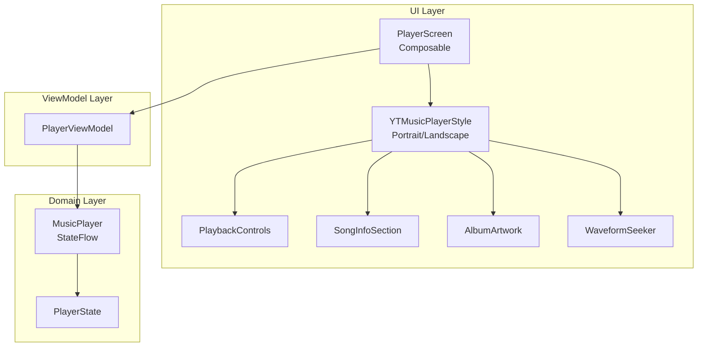
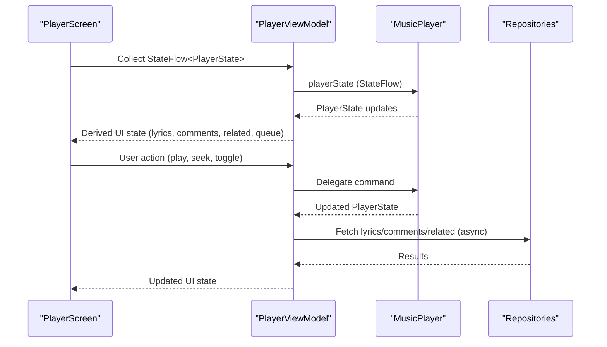
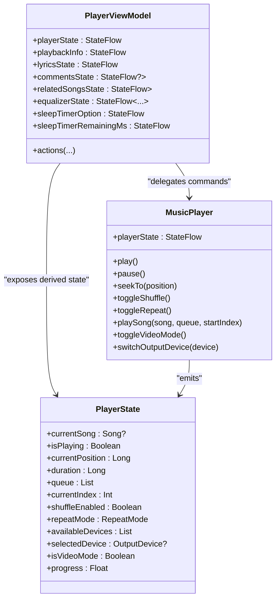
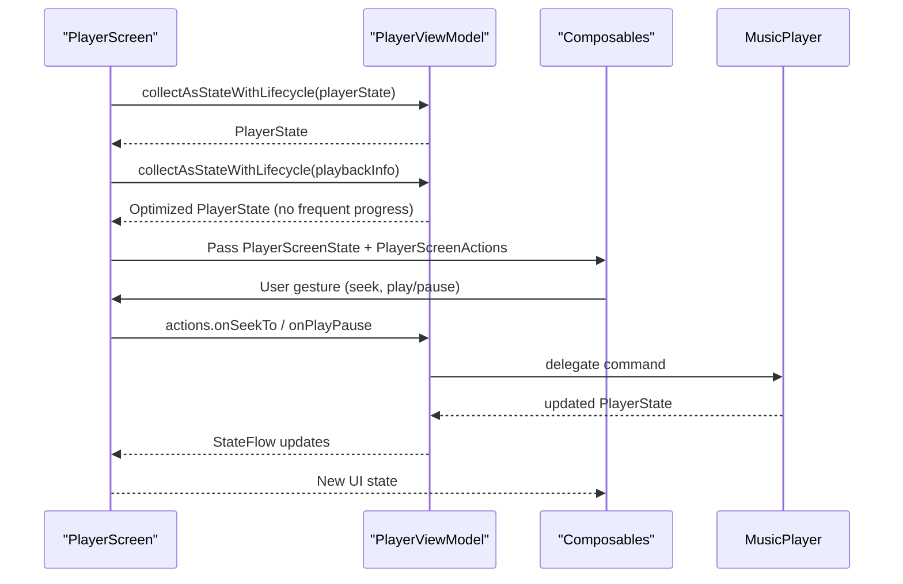
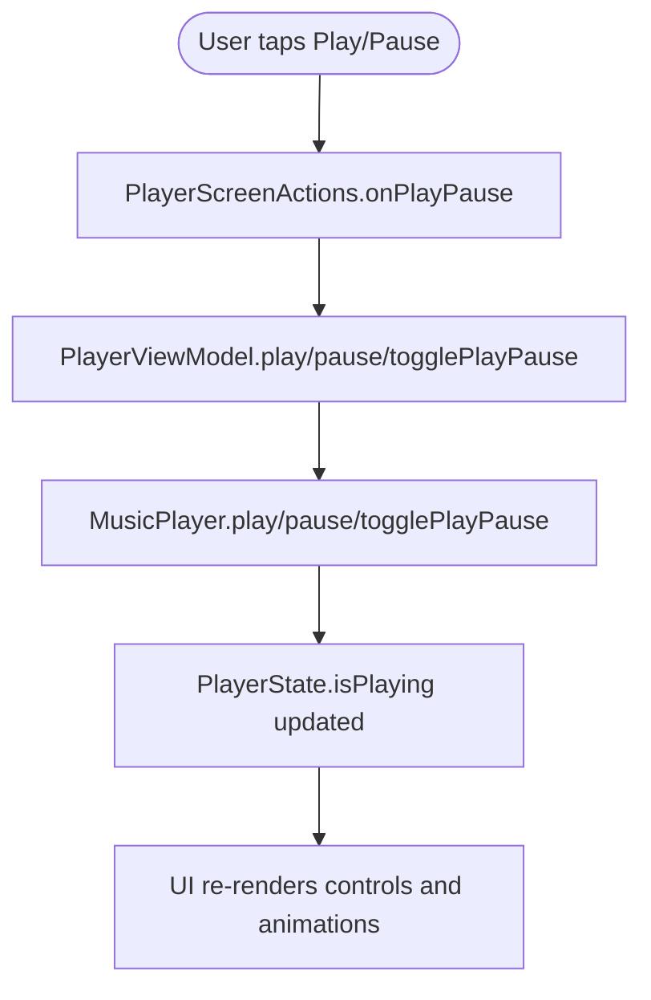
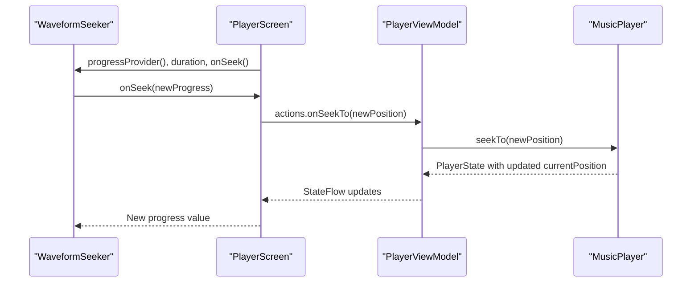
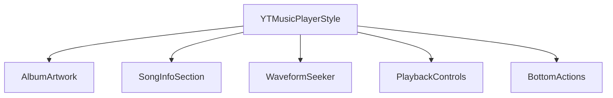
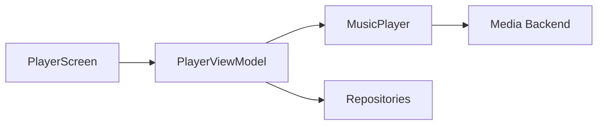

# UI Integration and State Management

<cite>
**Referenced Files in This Document**
- [PlayerViewModel.kt](file://app/src/main/java/com/suvojeet/suvmusic/ui/viewmodel/PlayerViewModel.kt)
- [MusicPlayer.kt](file://app/src/main/java/com/suvojeet/suvmusic/player/MusicPlayer.kt)
- [PlayerState.kt](file://app/src/main/java/com/suvojeet/suvmusic/data/model/PlayerState.kt)
- [PlayerScreen.kt](file://app/src/main/java/com/suvojeet/suvmusic/ui/screens/player/PlayerScreen.kt)
- [PlayerControls.kt](file://app/src/main/java/com/suvojeet/suvmusic/ui/screens/player/components/PlayerControls.kt)
- [PlayerSongInfo.kt](file://app/src/main/java/com/suvojeet/suvmusic/ui/screens/player/components/PlayerSongInfo.kt)
- [PlayerArtwork.kt](file://app/src/main/java/com/suvojeet/suvmusic/ui/screens/player/components/PlayerArtwork.kt)
- [YTMusicPlayerStyle.kt](file://app/src/main/java/com/suvojeet/suvmusic/ui/screens/player/styles/YTMusicPlayerStyle.kt)
- [WaveformSeeker.kt](file://app/src/main/java/com/suvojeet/suvmusic/ui/components/WaveformSeeker.kt)
- [PlayerUtils.kt](file://app/src/main/java/com/suvojeet/suvmusic/ui/screens/player/PlayerUtils.kt)
</cite>

## Table of Contents
1. [Introduction](#introduction)
2. [Project Structure](#project-structure)
3. [Core Components](#core-components)
4. [Architecture Overview](#architecture-overview)
5. [Detailed Component Analysis](#detailed-component-analysis)
6. [Dependency Analysis](#dependency-analysis)
7. [Performance Considerations](#performance-considerations)
8. [Troubleshooting Guide](#troubleshooting-guide)
9. [Conclusion](#conclusion)

## Introduction
This document explains the UI integration and state management for the music player system. It covers the state flow architecture, ViewModel implementation, reactive UI updates, player screen components, state management patterns, UI state synchronization, Compose UI integration, state hoisting, event handling, player controls, progress tracking, and visual feedback. It also provides guidance on performance optimization, memory management for state flows, and proper cleanup procedures.

## Project Structure
The player UI is organized around a declarative Compose architecture with a ViewModel that exposes StateFlow streams consumed by the PlayerScreen. The MusicPlayer service acts as the authoritative state source for playback, while PlayerViewModel bridges between the service and UI, enriching state with UI-specific concerns (lyrics, comments, related songs, equalizer, sleep timer, etc.).

**Diagram sources**
- [PlayerScreen.kt:200-496](file://app/src/main/java/com/suvojeet/suvmusic/ui/screens/player/PlayerScreen.kt#L200-L496)
- [YTMusicPlayerStyle.kt:52-112](file://app/src/main/java/com/suvojeet/suvmusic/ui/screens/player/styles/YTMusicPlayerStyle.kt#L52-L112)
- [PlayerControls.kt:46-170](file://app/src/main/java/com/suvojeet/suvmusic/ui/screens/player/components/PlayerControls.kt#L46-L170)
- [PlayerSongInfo.kt:64-440](file://app/src/main/java/com/suvojeet/suvmusic/ui/screens/player/components/PlayerSongInfo.kt#L64-L440)
- [PlayerArtwork.kt:100-333](file://app/src/main/java/com/suvojeet/suvmusic/ui/screens/player/components/PlayerArtwork.kt#L100-L333)
- [WaveformSeeker.kt:96-481](file://app/src/main/java/com/suvojeet/suvmusic/ui/components/WaveformSeeker.kt#L96-L481)
- [PlayerViewModel.kt:57-75](file://app/src/main/java/com/suvojeet/suvmusic/ui/viewmodel/PlayerViewModel.kt#L57-L75)
- [MusicPlayer.kt:56-90](file://app/src/main/java/com/suvojeet/suvmusic/player/MusicPlayer.kt#L56-L90)
- [PlayerState.kt:7-52](file://app/src/main/java/com/suvojeet/suvmusic/data/model/PlayerState.kt#L7-L52)

**Section sources**
- [PlayerScreen.kt:1-772](file://app/src/main/java/com/suvojeet/suvmusic/ui/screens/player/PlayerScreen.kt#L1-L772)
- [PlayerViewModel.kt:1-800](file://app/src/main/java/com/suvojeet/suvmusic/ui/viewmodel/PlayerViewModel.kt#L1-L800)
- [MusicPlayer.kt:1-800](file://app/src/main/java/com/suvojeet/suvmusic/player/MusicPlayer.kt#L1-L800)
- [PlayerState.kt:1-68](file://app/src/main/java/com/suvojeet/suvmusic/data/model/PlayerState.kt#L1-L68)

## Core Components
- PlayerViewModel: Central state holder exposing StateFlow<PlayerState> and UI-specific flows (lyrics, comments, related songs, equalizer, sleep timer, device selection, queue sections). It orchestrates playback commands and UI-side features.
- MusicPlayer: Provides the authoritative PlayerState StateFlow and integrates with the media backend. It emits state changes that drive UI updates.
- PlayerState: Immutable data class representing the UI-facing player state snapshot, including playback progress, queue, shuffle/repeat, and UI metadata.
- PlayerScreen: Root composable that consumes PlayerViewModel flows, applies state hoisting, and renders the player UI with multiple overlays and sheets.
- Player components: PlaybackControls, SongInfoSection, AlbumArtwork, WaveformSeeker, and YTMusicPlayerStyle define the UI composition and interactions.

**Section sources**
- [PlayerViewModel.kt:57-75](file://app/src/main/java/com/suvojeet/suvmusic/ui/viewmodel/PlayerViewModel.kt#L57-L75)
- [MusicPlayer.kt:83-84](file://app/src/main/java/com/suvojeet/suvmusic/player/MusicPlayer.kt#L83-L84)
- [PlayerState.kt:7-52](file://app/src/main/java/com/suvojeet/suvmusic/data/model/PlayerState.kt#L7-L52)
- [PlayerScreen.kt:200-496](file://app/src/main/java/com/suvojeet/suvmusic/ui/screens/player/PlayerScreen.kt#L200-L496)

## Architecture Overview
The system follows a unidirectional data flow:
- MusicPlayer emits PlayerState updates.
- PlayerViewModel transforms and exposes derived UI state (lyrics, comments, related songs, queue sections).
- PlayerScreen collects StateFlow values and renders UI reactively.
- User interactions trigger actions that call PlayerViewModel methods, which delegate to MusicPlayer or repositories.

**Diagram sources**
- [PlayerScreen.kt:211-260](file://app/src/main/java/com/suvojeet/suvmusic/ui/screens/player/PlayerScreen.kt#L211-L260)
- [PlayerViewModel.kt:77-86](file://app/src/main/java/com/suvojeet/suvmusic/ui/viewmodel/PlayerViewModel.kt#L77-L86)
- [MusicPlayer.kt:501-598](file://app/src/main/java/com/suvojeet/suvmusic/player/MusicPlayer.kt#L501-L598)

## Detailed Component Analysis

### State Flow Architecture and ViewModel Implementation
- PlayerViewModel exposes:
  - playerState: direct access to MusicPlayer’s PlayerState.
  - playbackInfo: a derived, optimized PlayerState excluding frequent progress updates to reduce recompositions.
  - UI-specific StateFlows: lyrics, comments, related songs, equalizer, sleep timer, device lists, queue selections, and UI preferences.
  - Actions: play, pause, seek, toggle shuffle/repeat, manage queue, start radio, toggle video mode, manage downloads, and more.
- MusicPlayer maintains a MutableStateFlow<PlayerState> and updates it in response to media events, ensuring UI remains synchronized.

**Diagram sources**
- [MusicPlayer.kt:56-90](file://app/src/main/java/com/suvojeet/suvmusic/player/MusicPlayer.kt#L56-L90)
- [PlayerViewModel.kt:57-75](file://app/src/main/java/com/suvojeet/suvmusic/ui/viewmodel/PlayerViewModel.kt#L57-L75)
- [PlayerState.kt:7-52](file://app/src/main/java/com/suvojeet/suvmusic/data/model/PlayerState.kt#L7-L52)

**Section sources**
- [PlayerViewModel.kt:77-86](file://app/src/main/java/com/suvojeet/suvmusic/ui/viewmodel/PlayerViewModel.kt#L77-L86)
- [MusicPlayer.kt:83-84](file://app/src/main/java/com/suvojeet/suvmusic/player/MusicPlayer.kt#L83-L84)
- [PlayerState.kt:36-51](file://app/src/main/java/com/suvojeet/suvmusic/data/model/PlayerState.kt#L36-L51)

### Reactive UI Updates and State Hoisting
- PlayerScreen defines PlayerScreenState and PlayerScreenActions to hoist state and events from deeply nested composables.
- It collects PlayerViewModel flows using collectAsStateWithLifecycle to ensure lifecycle-aware collection and automatic cleanup.
- Derived state (progress, positions) is memoized using remember to minimize recomposition overhead.

**Diagram sources**
- [PlayerScreen.kt:200-496](file://app/src/main/java/com/suvojeet/suvmusic/ui/screens/player/PlayerScreen.kt#L200-L496)
- [PlayerScreen.kt:135-193](file://app/src/main/java/com/suvojeet/suvmusic/ui/screens/player/PlayerScreen.kt#L135-L193)

**Section sources**
- [PlayerScreen.kt:211-260](file://app/src/main/java/com/suvojeet/suvmusic/ui/screens/player/PlayerScreen.kt#L211-L260)
- [PlayerScreen.kt:279-288](file://app/src/main/java/com/suvojeet/suvmusic/ui/screens/player/PlayerScreen.kt#L279-L288)

### Player Controls Implementation and Event Handling
- PlaybackControls encapsulates play/pause, next, previous, shuffle, and repeat toggles with animated icons and responsive interactions.
- PlayerScreen binds these controls to PlayerScreenActions, which delegate to PlayerViewModel and ultimately to MusicPlayer.

**Diagram sources**
- [PlayerControls.kt:46-170](file://app/src/main/java/com/suvojeet/suvmusic/ui/screens/player/components/PlayerControls.kt#L46-L170)
- [PlayerScreen.kt:159-193](file://app/src/main/java/com/suvojeet/suvmusic/ui/screens/player/PlayerScreen.kt#L159-L193)

**Section sources**
- [PlayerControls.kt:46-170](file://app/src/main/java/com/suvojeet/suvmusic/ui/screens/player/components/PlayerControls.kt#L46-L170)
- [PlayerScreen.kt:159-193](file://app/src/main/java/com/suvojeet/suvmusic/ui/screens/player/PlayerScreen.kt#L159-L193)

### Progress Tracking and Visual Feedback
- WaveformSeeker supports multiple visual styles (waveform, wave line, classic, dots, gradient bar, Material 3 slider, M3 Expressive wavy) and provides interactive seeking with keyboard support and long-press style menu.
- PlayerScreen passes current progress, positions, and duration to WaveformSeeker and SongInfoSection for time labels.
- Sponsor segments are overlaid on the seekbar for SponsorBlock integration.

**Diagram sources**
- [WaveformSeeker.kt:96-481](file://app/src/main/java/com/suvojeet/suvmusic/ui/components/WaveformSeeker.kt#L96-L481)
- [PlayerScreen.kt:420-433](file://app/src/main/java/com/suvojeet/suvmusic/ui/screens/player/PlayerScreen.kt#L420-L433)
- [YTMusicPlayerStyle.kt:406-434](file://app/src/main/java/com/suvojeet/suvmusic/ui/screens/player/styles/YTMusicPlayerStyle.kt#L406-L434)

**Section sources**
- [WaveformSeeker.kt:96-481](file://app/src/main/java/com/suvojeet/suvmusic/ui/components/WaveformSeeker.kt#L96-L481)
- [YTMusicPlayerStyle.kt:406-434](file://app/src/main/java/com/suvojeet/suvmusic/ui/screens/player/styles/YTMusicPlayerStyle.kt#L406-L434)

### Player Screen Components and UI State Synchronization
- YTMusicPlayerStyle renders portrait and landscape layouts, integrating AlbumArtwork, SongInfoSection, WaveformSeeker, PlaybackControls, and BottomActions.
- PlayerScreen manages overlays (queue, lyrics, related, comments, equalizer, playback speed, output device, sleep timer) and uses rememberUpdatedState to avoid stale closures.
- AlbumArtwork supports shape selection, vinyl rotation, and swipe gestures; SongInfoSection displays metadata and quality badges; WaveformSeeker provides interactive progress.

**Diagram sources**
- [YTMusicPlayerStyle.kt:52-112](file://app/src/main/java/com/suvojeet/suvmusic/ui/screens/player/styles/YTMusicPlayerStyle.kt#L52-L112)
- [PlayerArtwork.kt:100-333](file://app/src/main/java/com/suvojeet/suvmusic/ui/screens/player/components/PlayerArtwork.kt#L100-L333)
- [PlayerSongInfo.kt:64-440](file://app/src/main/java/com/suvojeet/suvmusic/ui/screens/player/components/PlayerSongInfo.kt#L64-L440)
- [WaveformSeeker.kt:96-481](file://app/src/main/java/com/suvojeet/suvmusic/ui/components/WaveformSeeker.kt#L96-L481)
- [PlayerControls.kt:46-170](file://app/src/main/java/com/suvojeet/suvmusic/ui/screens/player/components/PlayerControls.kt#L46-L170)

**Section sources**
- [YTMusicPlayerStyle.kt:114-403](file://app/src/main/java/com/suvojeet/suvmusic/ui/screens/player/styles/YTMusicPlayerStyle.kt#L114-L403)
- [PlayerArtwork.kt:100-333](file://app/src/main/java/com/suvojeet/suvmusic/ui/screens/player/components/PlayerArtwork.kt#L100-L333)
- [PlayerSongInfo.kt:64-440](file://app/src/main/java/com/suvojeet/suvmusic/ui/screens/player/components/PlayerSongInfo.kt#L64-L440)
- [PlayerControls.kt:46-170](file://app/src/main/java/com/suvojeet/suvmusic/ui/screens/player/components/PlayerControls.kt#L46-L170)

### State Management Patterns and Queue Sections
- PlayerViewModel derives:
  - historySongs: songs before current index.
  - upNextSongs: songs from current index onward.
  - selectedQueueIndices: multi-select indices for batch operations.
- These are computed from PlayerState using map and distinctUntilChanged to minimize recompositions.

**Section sources**
- [PlayerViewModel.kt:207-217](file://app/src/main/java/com/suvojeet/suvmusic/ui/viewmodel/PlayerViewModel.kt#L207-L217)
- [PlayerViewModel.kt:203-204](file://app/src/main/java/com/suvojeet/suvmusic/ui/viewmodel/PlayerViewModel.kt#L203-L204)

### Integration with Compose UI, State Hoisting, and Event Handling
- PlayerScreen defines PlayerScreenState and PlayerScreenActions to hoist state and events, reducing parameter passing and enabling modular composition.
- collectAsStateWithLifecycle ensures lifecycle-aware collection and automatic cleanup.
- rememberUpdatedState prevents lambda capture of stale state in overlays and menus.

**Section sources**
- [PlayerScreen.kt:135-193](file://app/src/main/java/com/suvojeet/suvmusic/ui/screens/player/PlayerScreen.kt#L135-L193)
- [PlayerScreen.kt:532-533](file://app/src/main/java/com/suvojeet/suvmusic/ui/screens/player/PlayerScreen.kt#L532-L533)

### Examples of State Updates, UI Reactions, and User Interaction Handling
- Example: Seeking
  - User taps WaveformSeeker -> onSeek(newProgress) -> PlayerScreenActions.onSeekTo -> PlayerViewModel.seekTo -> MusicPlayer.seekTo -> PlayerState updates -> UI reacts.
- Example: Playing a song
  - PlayerScreen triggers playSong -> PlayerViewModel.playSong -> MusicPlayer.playSong -> PlayerState updates -> UI reflects new song and queue.

**Section sources**
- [WaveformSeeker.kt:247-274](file://app/src/main/java/com/suvojeet/suvmusic/ui/components/WaveformSeeker.kt#L247-L274)
- [PlayerScreen.kt:159-193](file://app/src/main/java/com/suvojeet/suvmusic/ui/screens/player/PlayerScreen.kt#L159-L193)
- [PlayerViewModel.kt:474-485](file://app/src/main/java/com/suvojeet/suvmusic/ui/viewmodel/PlayerViewModel.kt#L474-L485)
- [MusicPlayer.kt:516-520](file://app/src/main/java/com/suvojeet/suvmusic/player/MusicPlayer.kt#L516-L520)

## Dependency Analysis
- PlayerViewModel depends on MusicPlayer and repositories for UI features (lyrics, comments, related, downloads, equalizer, sleep timer).
- MusicPlayer depends on the media backend and emits PlayerState updates.
- PlayerScreen depends on PlayerViewModel and composable components.

**Diagram sources**
- [PlayerScreen.kt:207-208](file://app/src/main/java/com/suvojeet/suvmusic/ui/screens/player/PlayerScreen.kt#L207-L208)
- [PlayerViewModel.kt:58-74](file://app/src/main/java/com/suvojeet/suvmusic/ui/viewmodel/PlayerViewModel.kt#L58-L74)
- [MusicPlayer.kt:56-72](file://app/src/main/java/com/suvojeet/suvmusic/player/MusicPlayer.kt#L56-L72)

**Section sources**
- [PlayerViewModel.kt:58-74](file://app/src/main/java/com/suvojeet/suvmusic/ui/viewmodel/PlayerViewModel.kt#L58-L74)
- [MusicPlayer.kt:56-72](file://app/src/main/java/com/suvojeet/suvmusic/player/MusicPlayer.kt#L56-L72)

## Performance Considerations
- Use playbackInfo to avoid frequent progress updates from triggering UI recompositions.
- Apply distinctUntilChanged on computed flows (historySongs, upNextSongs) to prevent unnecessary recompositions.
- Use rememberUpdatedState to avoid stale closures in overlays and menus.
- Limit expensive operations inside collectAsStateWithLifecycle; prefer map and stateIn for derived state.
- Use stateIn with appropriate start and initial values to control when flows start emitting.
- Avoid recomputing heavy values; use remember with stable keys.
- Use derivedStateOf for frequently changing values that should not cause full recomposition of the screen.

[No sources needed since this section provides general guidance]

## Troubleshooting Guide
- Playback errors: PlayerScreen displays an error overlay with copy and retry actions; MusicPlayer clears errors on READY state and handles STATE_ENDED transitions.
- Video mode issues: PlayerViewModel exposes isSwitchingMode and isFullScreen to coordinate UI transitions; toggleVideoMode and setVideoQuality manage video playback.
- Download state inconsistencies: PlayerViewModel monitors download states and reconciles them with PlayerState.
- Sleep timer: PlayerViewModel exposes sleepTimerOption and sleepTimerRemainingMs; MusicPlayer pauses on timer finish.
- Output device selection: PlayerViewModel switches devices via MusicPlayer; refreshDevices updates the list.

**Section sources**
- [YTMusicPlayerStyle.kt:436-513](file://app/src/main/java/com/suvojeet/suvmusic/ui/screens/player/styles/YTMusicPlayerStyle.kt#L436-L513)
- [PlayerViewModel.kt:648-677](file://app/src/main/java/com/suvojeet/suvmusic/ui/viewmodel/PlayerViewModel.kt#L648-L677)
- [MusicPlayer.kt:167-170](file://app/src/main/java/com/suvojeet/suvmusic/player/MusicPlayer.kt#L167-L170)
- [PlayerViewModel.kt:419-472](file://app/src/main/java/com/suvojeet/suvmusic/ui/viewmodel/PlayerViewModel.kt#L419-L472)

## Conclusion
The player UI leverages a robust unidirectional data flow with MusicPlayer as the single source of truth and PlayerViewModel bridging domain and UI concerns. Compose’s reactive primitives enable efficient, lifecycle-aware UI updates with state hoisting and careful optimization to minimize recompositions. The system integrates player controls, progress tracking, visual feedback, and advanced features like lyrics, comments, related content, equalizer, and sleep timer, all synchronized through StateFlow streams.