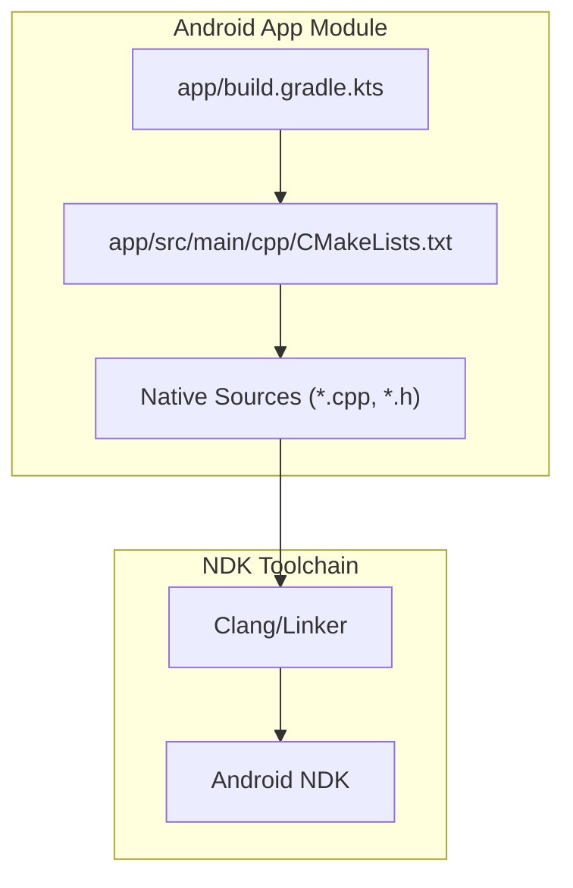
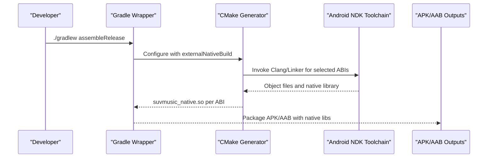
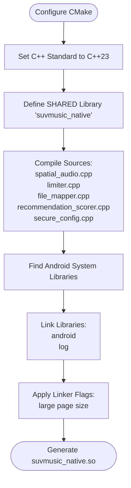
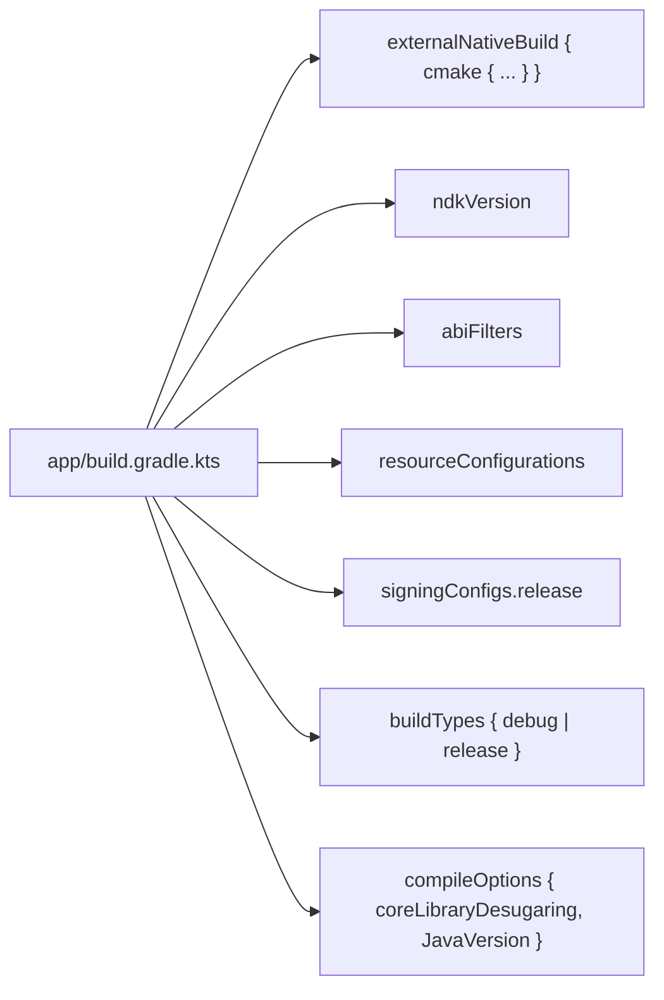
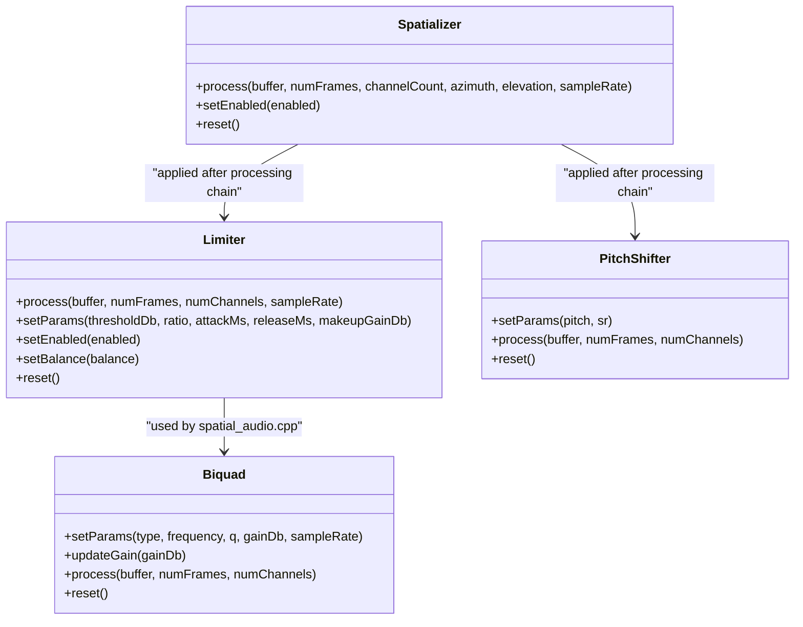
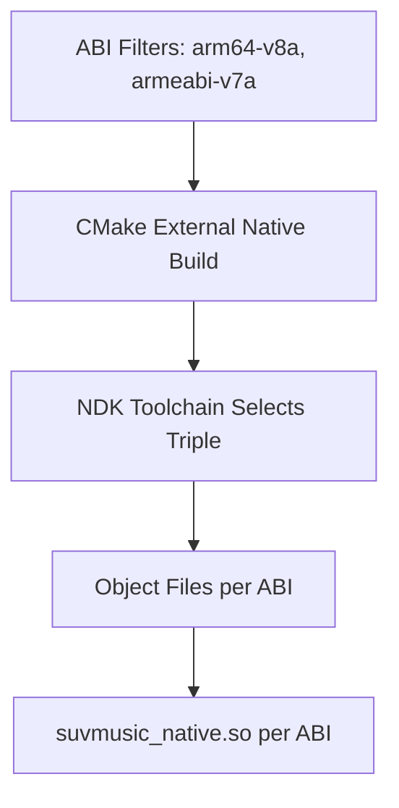
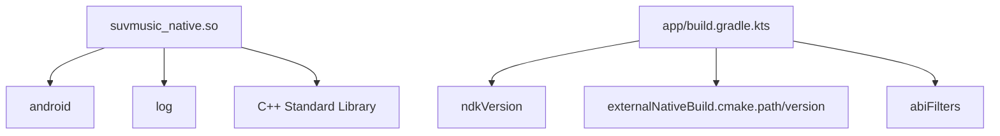

# CMake Build System

<cite>
**Referenced Files in This Document**
- [CMakeLists.txt](file://app/src/main/cpp/CMakeLists.txt)
- [build.gradle.kts](file://app/build.gradle.kts)
- [build.gradle.kts](file://build.gradle.kts)
- [gradle.properties](file://gradle.properties)
- [settings.gradle.kts](file://settings.gradle.kts)
- [libs.versions.toml](file://gradle/libs.versions.toml)
- [build.yml](file://.github/workflows/build.yml)
- [spatial_audio.cpp](file://app/src/main/cpp/spatial_audio.cpp)
- [limiter.cpp](file://app/src/main/cpp/limiter.cpp)
- [limiter.h](file://app/src/main/cpp/limiter.h)
- [file_mapper.cpp](file://app/src/main/cpp/file_mapper.cpp)
- [recommendation_scorer.cpp](file://app/src/main/cpp/recommendation_scorer.cpp)
- [secure_config.cpp](file://app/src/main/cpp/secure_config.cpp)
- [biquad.h](file://app/src/main/cpp/biquad.h)
- [pitch_shifter.h](file://app/src/main/cpp/pitch_shifter.h)
</cite>

## Table of Contents
1. [Introduction](#introduction)
2. [Project Structure](#project-structure)
3. [Core Components](#core-components)
4. [Architecture Overview](#architecture-overview)
5. [Detailed Component Analysis](#detailed-component-analysis)
6. [Dependency Analysis](#dependency-analysis)
7. [Performance Considerations](#performance-considerations)
8. [Troubleshooting Guide](#troubleshooting-guide)
9. [Conclusion](#conclusion)
10. [Appendices](#appendices)

## Introduction
This document explains the CMake build system configuration for SuvMusic’s native module. It covers the CMakeLists.txt structure, library compilation, Android NDK integration, shared library creation, target linking, cross-compilation setup for Android architectures, compiler standards, optimization flags, and build configuration options. It also provides troubleshooting guidance, dependency management, and integration with the Android Gradle Plugin. Practical examples show how to add new native sources and configure build variants.

## Project Structure
The native build is encapsulated under the Android app module and controlled via Gradle’s externalNativeBuild integration. The primary CMake script defines the shared library target and links required Android libraries. The Android Gradle Plugin coordinates CMake invocation, ABI filtering, and packaging.

**Diagram sources**
- [build.gradle.kts](file://app/build.gradle.kts)
- [CMakeLists.txt](file://app/src/main/cpp/CMakeLists.txt)

**Section sources**
- [build.gradle.kts](file://app/build.gradle.kts)
- [CMakeLists.txt](file://app/src/main/cpp/CMakeLists.txt)

## Core Components
- CMakeLists.txt: Defines the shared library target, compiles native sources, sets C++ standard, and links Android system libraries.
- app/build.gradle.kts: Configures externalNativeBuild to point to the CMake script, sets NDK version, ABI filters, and enables Java/Kotlin/JVM toolchains.
- Native sources: Audio processing, DSP utilities, and JNI bridges for spatial audio, recommendation scoring, file mapping, and secure configuration.

Key responsibilities:
- Shared library creation: suvmusic_native (SHARED)
- Target linking: android and log libraries
- Cross-compilation: ABI filters restrict builds to arm64-v8a and armeabi-v7a
- Compiler standard: C++23
- Page size optimization: linker flag for larger page size on Android 15+

**Section sources**
- [CMakeLists.txt](file://app/src/main/cpp/CMakeLists.txt)
- [build.gradle.kts](file://app/build.gradle.kts)

## Architecture Overview
The build pipeline integrates Gradle, CMake, and the Android NDK to produce an APK with embedded native binaries. The workflow orchestrates building release artifacts and uploading them as GitHub releases.

**Diagram sources**
- [build.gradle.kts](file://app/build.gradle.kts)
- [build.yml](file://.github/workflows/build.yml)

**Section sources**
- [build.yml](file://.github/workflows/build.yml)
- [build.gradle.kts](file://app/build.gradle.kts)

## Detailed Component Analysis

### CMakeLists.txt Analysis
- Minimum required CMake version and project definition
- C++ standard set to C++23 with enforcement
- Shared library target suvmusic_native compiled from multiple native sources
- Linking against android and log system libraries
- Additional linker option enabling large page size support for newer Android versions

**Diagram sources**
- [CMakeLists.txt](file://app/src/main/cpp/CMakeLists.txt)

**Section sources**
- [CMakeLists.txt](file://app/src/main/cpp/CMakeLists.txt)

### Android Gradle Plugin Integration
- externalNativeBuild points to the CMake script and specifies CMake version
- NDK version pinned to a stable release
- ABI filters limit builds to arm64-v8a and armeabi-v7a
- Resource configurations restrict supported locales
- Signing configuration supports environment-driven release signing
- Build types enable minification and resource shrinking for release
- Java/Kotlin/JVM targets configured for modern toolchains

**Diagram sources**
- [build.gradle.kts](file://app/build.gradle.kts)

**Section sources**
- [build.gradle.kts](file://app/build.gradle.kts)

### Native Sources and JNI Bridges
- spatial_audio.cpp: Implements spatial audio processing, EQ, bass boost, virtualizer, pitch shifter, and limiter. Exposes JNI methods for Android integration.
- limiter.cpp/.h: Provides a thread-safe limiter with lookahead delay and soft clipping.
- file_mapper.cpp: JNI bridge to extract waveform data from files using memory mapping.
- recommendation_scorer.cpp: SIMD-accelerated scoring engine using NEON or SSE; includes batch cosine similarity computations.
- secure_config.cpp: JNI bridge for native key derivation logic.

**Diagram sources**
- [limiter.h](file://app/src/main/cpp/limiter.h)
- [biquad.h](file://app/src/main/cpp/biquad.h)
- [pitch_shifter.h](file://app/src/main/cpp/pitch_shifter.h)
- [spatial_audio.cpp](file://app/src/main/cpp/spatial_audio.cpp)

**Section sources**
- [spatial_audio.cpp](file://app/src/main/cpp/spatial_audio.cpp)
- [limiter.cpp](file://app/src/main/cpp/limiter.cpp)
- [limiter.h](file://app/src/main/cpp/limiter.h)
- [biquad.h](file://app/src/main/cpp/biquad.h)
- [pitch_shifter.h](file://app/src/main/cpp/pitch_shifter.h)
- [file_mapper.cpp](file://app/src/main/cpp/file_mapper.cpp)
- [recommendation_scorer.cpp](file://app/src/main/cpp/recommendation_scorer.cpp)
- [secure_config.cpp](file://app/src/main/cpp/secure_config.cpp)

### Cross-Compilation Setup for Android Architectures
- ABI filters restrict builds to arm64-v8a and armeabi-v7a, reducing APK size and build time
- NDK version is pinned to a stable release to ensure reproducible builds
- CMake minimum version aligns with the NDK toolchain expectations

**Diagram sources**
- [build.gradle.kts](file://app/build.gradle.kts)
- [CMakeLists.txt](file://app/src/main/cpp/CMakeLists.txt)

**Section sources**
- [build.gradle.kts](file://app/build.gradle.kts)

### Compiler Standards, Optimization Flags, and Build Options
- C++ standard: C++23 with enforcement
- Linker flag: large page size support for Android 15+ and Android 16
- JVM toolchain: Java 21 and Kotlin JVM target set to 21
- Desugaring enabled for Java 8+ APIs on older Android versions
- Build types:
  - Debug: no minification, suffix appended to applicationId
  - Release: minification and resource shrinking enabled, optional signing via environment variables

**Section sources**
- [CMakeLists.txt](file://app/src/main/cpp/CMakeLists.txt)
- [build.gradle.kts](file://app/build.gradle.kts)

### Adding New Native Sources
Steps to add a new native source file:
1. Create the new .cpp/.h files under app/src/main/cpp
2. Update the CMakeLists.txt target_sources list to include the new files
3. Ensure any new headers are included in the target include directories if needed
4. If JNI bindings are required, declare appropriate JNI exports and ensure the class/method signatures match the Java/Kotlin side
5. Sync Gradle and rebuild to include the new native code in the shared library

Example path references:
- [CMakeLists.txt](file://app/src/main/cpp/CMakeLists.txt)
- [build.gradle.kts](file://app/build.gradle.kts)

**Section sources**
- [CMakeLists.txt](file://app/src/main/cpp/CMakeLists.txt)
- [build.gradle.kts](file://app/build.gradle.kts)

### Configuring Build Variants
To configure additional build variants or change optimization:
- Modify buildTypes in app/build.gradle.kts to adjust minification, resource shrinking, and signing
- Adjust externalNativeBuild cmake version if needed
- Update ABI filters to include/exclude architectures as required
- For CI/CD, environment variables can supply signing credentials and API keys

**Section sources**
- [build.gradle.kts](file://app/build.gradle.kts)
- [build.yml](file://.github/workflows/build.yml)

## Dependency Analysis
The native module depends on Android system libraries and standard C++ libraries. The Gradle configuration manages Java/Kotlin dependencies and ensures compatibility with the NDK toolchain.

**Diagram sources**
- [CMakeLists.txt](file://app/src/main/cpp/CMakeLists.txt)
- [build.gradle.kts](file://app/build.gradle.kts)

**Section sources**
- [CMakeLists.txt](file://app/src/main/cpp/CMakeLists.txt)
- [build.gradle.kts](file://app/build.gradle.kts)

## Performance Considerations
- SIMD acceleration: recommendation_scorer.cpp uses NEON or SSE intrinsics for vectorized scoring
- Look-ahead limiter: introduces latency but improves transient handling; tune attack/release parameters for quality/performance trade-offs
- Memory mapping: file_mapper.cpp uses mmap for efficient waveform extraction
- ABI targeting: limiting to arm64-v8a and armeabi-v7a reduces APK size and improves runtime performance on supported devices
- Linker page size: large page size flag can improve TLB behavior on newer Android versions

**Section sources**
- [recommendation_scorer.cpp](file://app/src/main/cpp/recommendation_scorer.cpp)
- [limiter.cpp](file://app/src/main/cpp/limiter.cpp)
- [file_mapper.cpp](file://app/src/main/cpp/file_mapper.cpp)
- [CMakeLists.txt](file://app/src/main/cpp/CMakeLists.txt)

## Troubleshooting Guide
Common build issues and resolutions:
- CMake version mismatch: Ensure externalNativeBuild cmake version matches the installed CMake version
  - Reference: [build.gradle.kts](file://app/build.gradle.kts)
- NDK version mismatch: Align ndkVersion with the CMake and toolchain versions
  - Reference: [build.gradle.kts](file://app/build.gradle.kts)
- ABI filter conflicts: Verify ABI filters match device targets and CI matrix
  - Reference: [build.gradle.kts](file://app/build.gradle.kts)
- Missing log library: Ensure log-lib is found and linked
  - Reference: [CMakeLists.txt](file://app/src/main/cpp/CMakeLists.txt)
- Large page size linker errors: Confirm the target platform supports the flag
  - Reference: [CMakeLists.txt](file://app/src/main/cpp/CMakeLists.txt)
- Java/Kotlin/JVM compatibility: Ensure JavaVersion and Kotlin JVM target alignment
  - Reference: [build.gradle.kts](file://app/build.gradle.kts)
- Signing failures in CI: Confirm environment variables for keystore and aliases are set
  - Reference: [build.yml](file://.github/workflows/build.yml)

**Section sources**
- [build.gradle.kts](file://app/build.gradle.kts)
- [CMakeLists.txt](file://app/src/main/cpp/CMakeLists.txt)
- [build.yml](file://.github/workflows/build.yml)

## Conclusion
SuvMusic’s CMake build system integrates tightly with the Android Gradle Plugin to produce optimized native binaries for targeted Android architectures. The configuration enforces modern C++ standards, leverages SIMD acceleration, and applies platform-specific optimizations. By following the documented practices, contributors can reliably add new native sources, configure build variants, and troubleshoot common build issues.

## Appendices

### Appendix A: Version Catalog and Plugins
- Versions catalog centralizes dependency versions and plugin IDs
- Plugins include Android Application, Kotlin Android, Compose, Hilt, KSP, Protobuf, and Kotlin Serialization

**Section sources**
- [libs.versions.toml](file://gradle/libs.versions.toml)

### Appendix B: Project Settings and Repositories
- Root project settings define repositories and include subprojects
- Non-transitive R class enabled to reduce R class size

**Section sources**
- [settings.gradle.kts](file://settings.gradle.kts)
- [gradle.properties](file://gradle.properties)