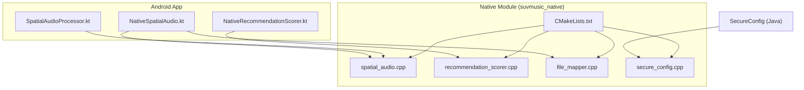
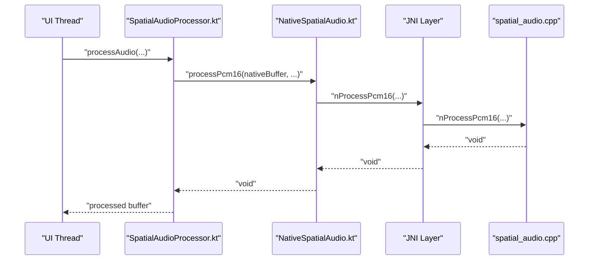
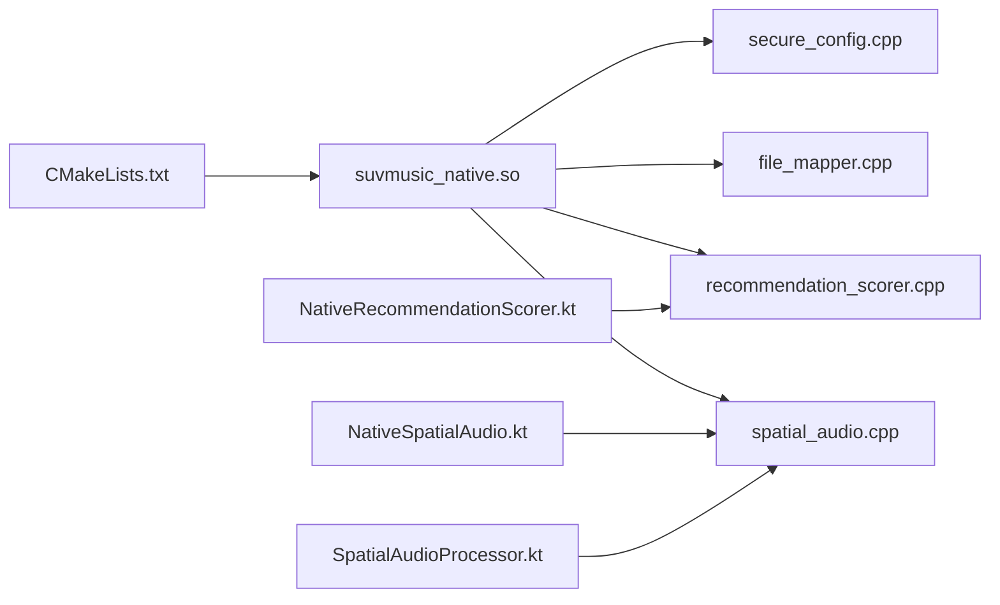

# JNI Bridge Implementation

<cite>
**Referenced Files in This Document**
- [CMakeLists.txt](file://app/src/main/cpp/CMakeLists.txt)
- [NativeSpatialAudio.kt](file://app/src/main/java/com/suvojeet/suvmusic/player/NativeSpatialAudio.kt)
- [NativeRecommendationScorer.kt](file://app/src/main/java/com/suvojeet/suvmusic/recommendation/NativeRecommendationScorer.kt)
- [SpatialAudioProcessor.kt](file://app/src/main/java/com/suvojeet/suvmusic/player/SpatialAudioProcessor.kt)
- [spatial_audio.cpp](file://app/src/main/cpp/spatial_audio.cpp)
- [recommendation_scorer.cpp](file://app/src/main/cpp/recommendation_scorer.cpp)
- [file_mapper.cpp](file://app/src/main/cpp/file_mapper.cpp)
- [secure_config.cpp](file://app/src/main/cpp/secure_config.cpp)
</cite>

## Table of Contents
1. [Introduction](#introduction)
2. [Project Structure](#project-structure)
3. [Core Components](#core-components)
4. [Architecture Overview](#architecture-overview)
5. [Detailed Component Analysis](#detailed-component-analysis)
6. [Dependency Analysis](#dependency-analysis)
7. [Performance Considerations](#performance-considerations)
8. [Troubleshooting Guide](#troubleshooting-guide)
9. [Conclusion](#conclusion)

## Introduction
This document describes the JNI bridge implementation in SuvMusic, focusing on the Java-to-C++ interface design, method signatures, parameter marshaling, memory management, exception handling, thread safety, and performance optimizations. It also covers secure configuration management, data transfer patterns, debugging strategies, ABI stability, and Android API level considerations.

## Project Structure
The JNI-enabled native module is built as a shared library named suvmusic_native and linked against Android and log libraries. The module exposes several native functions via explicit JNI exports and is consumed by Kotlin/Java components for audio processing and recommendation scoring.

**Diagram sources**
- [CMakeLists.txt:1-23](file://app/src/main/cpp/CMakeLists.txt#L1-L23)
- [NativeSpatialAudio.kt:1-158](file://app/src/main/java/com/suvojeet/suvmusic/player/NativeSpatialAudio.kt#L1-L158)
- [NativeRecommendationScorer.kt:1-187](file://app/src/main/java/com/suvojeet/suvmusic/recommendation/NativeRecommendationScorer.kt#L1-L187)
- [SpatialAudioProcessor.kt:214-242](file://app/src/main/java/com/suvojeet/suvmusic/player/SpatialAudioProcessor.kt#L214-L242)
- [spatial_audio.cpp:347-475](file://app/src/main/cpp/spatial_audio.cpp#L347-L475)
- [recommendation_scorer.cpp:350-503](file://app/src/main/cpp/recommendation_scorer.cpp#L350-L503)
- [file_mapper.cpp:12-124](file://app/src/main/cpp/file_mapper.cpp#L12-L124)
- [secure_config.cpp:48-61](file://app/src/main/cpp/secure_config.cpp#L48-L61)

**Section sources**
- [CMakeLists.txt:1-23](file://app/src/main/cpp/CMakeLists.txt#L1-L23)

## Core Components
- NativeSpatialAudio (Kotlin): Exposes JNI methods for real-time audio processing (spatialization, EQ, bass boost, virtualizer, crossfeed, limiter, pitch shifting) and waveform extraction via memory-mapped IO. It manages library loading and guards calls until the native library is ready.
- NativeRecommendationScorer (Kotlin): Provides JNI-backed SIMD-accelerated scoring of music recommendations and cosine similarity computations, with graceful fallback to Kotlin when native is unavailable.
- spatial_audio.cpp (C++): Implements audio DSP pipeline with thread-safe state and synchronized processing. Exposes JNI entry points for PCM processing and effect controls.
- recommendation_scorer.cpp (C++): Implements SIMD scoring and similarity functions with platform-specific vectorization (NEON/SSE) and robust array bounds checking.
- file_mapper.cpp (C++): JNI function to extract waveform data from local files using memory-mapped IO and basic format detection.
- secure_config.cpp (C++): JNI functions to derive keys securely in native code to reduce reverse-engineering risk.

**Section sources**
- [NativeSpatialAudio.kt:1-158](file://app/src/main/java/com/suvojeet/suvmusic/player/NativeSpatialAudio.kt#L1-L158)
- [NativeRecommendationScorer.kt:1-187](file://app/src/main/java/com/suvojeet/suvmusic/recommendation/NativeRecommendationScorer.kt#L1-L187)
- [spatial_audio.cpp:347-475](file://app/src/main/cpp/spatial_audio.cpp#L347-L475)
- [recommendation_scorer.cpp:350-503](file://app/src/main/cpp/recommendation_scorer.cpp#L350-L503)
- [file_mapper.cpp:12-124](file://app/src/main/cpp/file_mapper.cpp#L12-L124)
- [secure_config.cpp:48-61](file://app/src/main/cpp/secure_config.cpp#L48-L61)

## Architecture Overview
The JNI bridge follows a layered design:
- Java/Kotlin API layer validates inputs and prepares buffers.
- JNI layer marshals parameters and invokes native functions.
- Native layer performs computation or I/O, returning primitive arrays or primitives.
- Java/Kotlin receives results and updates UI or continues processing.

**Diagram sources**
- [SpatialAudioProcessor.kt:214-242](file://app/src/main/java/com/suvojeet/suvmusic/player/SpatialAudioProcessor.kt#L214-L242)
- [NativeSpatialAudio.kt:25-43](file://app/src/main/java/com/suvojeet/suvmusic/player/NativeSpatialAudio.kt#L25-L43)
- [spatial_audio.cpp:347-393](file://app/src/main/cpp/spatial_audio.cpp#L347-L393)

## Detailed Component Analysis

### NativeSpatialAudio Bridge
- Purpose: Real-time audio processing pipeline with spatialization, EQ, bass boost, virtualizer, crossfeed, limiter, and pitch shifting.
- Method signatures exposed to JNI:
  - nProcessPcm16(ByteBuffer, int, int, int, float, float)
  - nSetSpatializerEnabled(boolean)
  - nSetLimiterEnabled(boolean)
  - nSetLimiterParams(float, float, float, float, float)
  - nSetLimiterBalance(float)
  - nSetCrossfeedParams(boolean, float)
  - nSetEqEnabled(boolean)
  - nSetEqBand(int, float)
  - nSetEqPreamp(float)
  - nSetBassBoost(float)
  - nSetVirtualizer(float)
  - nSetPlaybackParams(float)
  - nReset()
  - nExtractWaveform(String, int) -> FloatArray?

- Parameter marshaling:
  - PCM buffer is expected to be direct ByteBuffer; JNI reads via GetDirectBufferAddress.
  - String parameters are passed as jstring and accessed via GetStringUTFChars; released immediately after use.
  - Numeric arrays are passed as primitives or primitive arrays; native side validates sizes and clamps ranges.

- Memory management:
  - Direct ByteBuffer avoids extra copies; JNI writes back to the same buffer.
  - String and array access uses Get/Release variants to prevent leaks; exceptions are handled by returning early or null.

- Thread safety:
  - Native processing is guarded by a mutex protecting the shared processing buffer and effect states.
  - Atomic flags are used for enabling/disabling effects to ensure safe concurrent updates.

- Exception handling:
  - Early returns on invalid inputs; logs warnings for unsupported compressed formats in waveform extraction.
  - Java-side catches exceptions during native calls and falls back gracefully.

- Practical example:
  - Audio frames are converted from int16 to float, processed through the chain, and written back to the original buffer.

**Section sources**
- [NativeSpatialAudio.kt:25-156](file://app/src/main/java/com/suvojeet/suvmusic/player/NativeSpatialAudio.kt#L25-L156)
- [spatial_audio.cpp:347-475](file://app/src/main/cpp/spatial_audio.cpp#L347-L475)
- [file_mapper.cpp:12-124](file://app/src/main/cpp/file_mapper.cpp#L12-L124)
- [SpatialAudioProcessor.kt:214-242](file://app/src/main/java/com/suvojeet/suvmusic/player/SpatialAudioProcessor.kt#L214-L242)

### NativeRecommendationScorer Bridge
- Purpose: SIMD-accelerated scoring of recommendation candidates and cosine similarity computations.
- Method signatures exposed to JNI:
  - nScoreCandidates(FloatArray, int, int, FloatArray, int) -> IntArray
  - nCosineSimilarity(FloatArray, FloatArray, int) -> float
  - nBatchCosineSimilarity(FloatArray, FloatArray, int, int) -> FloatArray

- Parameter marshaling:
  - Features and weights are passed as flat FloatArrays; native expects SoA layout with specific dimensions.
  - Native validates array sizes and logs errors for mismatches.

- Memory management:
  - Uses GetFloatArrayElements with JNI_ABORT to copy back only on success; releases on failure paths.
  - Allocates temporary buffers for scoring and top-K selection; returns results via NewIntArray/NewFloatArray.

- Thread safety:
  - No shared mutable state across calls; uses local vectors and atomic flags only for audio pipeline.

- Exception handling:
  - Returns empty arrays or null on invalid inputs; logs errors and returns defaults.

- Practical example:
  - Batch scoring computes weighted sums per candidate using NEON/SSE intrinsics and selects top-K via partial sort.

**Section sources**
- [NativeRecommendationScorer.kt:56-186](file://app/src/main/java/com/suvojeet/suvmusic/recommendation/NativeRecommendationScorer.kt#L56-L186)
- [recommendation_scorer.cpp:350-503](file://app/src/main/cpp/recommendation_scorer.cpp#L350-L503)

### Secure Configuration Management
- Purpose: Derive cryptographic keys in native code to reduce reverse-engineering risk.
- JNI functions:
  - nDeriveKey() -> String
  - nDeriveDesKey() -> String

- Implementation notes:
  - Key derivation logic is obfuscated across multiple arrays and operations to hinder static analysis.
  - Returns new UTF jstring allocated by the VM.

- Practical example:
  - Use these functions to obtain keys for encryption/decryption routines elsewhere in the app.

**Section sources**
- [secure_config.cpp:48-61](file://app/src/main/cpp/secure_config.cpp#L48-L61)

### Data Transfer Patterns and Buffer Management
- Direct buffers:
  - PCM processing uses direct ByteBuffers to avoid intermediate copies; JNI reads/writes via GetDirectBufferAddress.
- Primitive arrays:
  - Feature/weight arrays are passed as FloatArray; native validates length and clamps values.
  - Results are returned via NewIntArray/NewFloatArray and SetXxxArrayRegion.
- Strings:
  - File paths are passed as jstring; accessed via GetStringUTFChars and released promptly.

**Section sources**
- [NativeSpatialAudio.kt:25-43](file://app/src/main/java/com/suvojeet/suvmusic/player/NativeSpatialAudio.kt#L25-L43)
- [spatial_audio.cpp:347-393](file://app/src/main/cpp/spatial_audio.cpp#L347-L393)
- [recommendation_scorer.cpp:362-425](file://app/src/main/cpp/recommendation_scorer.cpp#L362-L425)
- [file_mapper.cpp:12-124](file://app/src/main/cpp/file_mapper.cpp#L12-L124)

### Exception Handling Across JNI Boundary
- Java side:
  - Wraps native calls in try/catch; logs errors and falls back to safe defaults or Kotlin implementations.
- Native side:
  - Validates inputs and returns early on invalid parameters.
  - Releases array/string elements on failure paths.
  - Logs diagnostic messages for unsupported formats or large batches.

**Section sources**
- [NativeRecommendationScorer.kt:81-104](file://app/src/main/java/com/suvojeet/suvmusic/recommendation/NativeRecommendationScorer.kt#L81-L104)
- [recommendation_scorer.cpp:372-388](file://app/src/main/cpp/recommendation_scorer.cpp#L372-L388)
- [file_mapper.cpp:66-73](file://app/src/main/cpp/file_mapper.cpp#L66-L73)

### Thread Safety Mechanisms
- Audio pipeline:
  - Mutex-protected processing buffer and effect states; atomic booleans for enabling/disabling.
- Recommendation engine:
  - Stateless per-call design; uses local vectors and atomic flags only for audio pipeline.
- Concurrency:
  - Library loading occurs off the main thread; native processing is guarded to prevent race conditions.

**Section sources**
- [spatial_audio.cpp:342-344](file://app/src/main/cpp/spatial_audio.cpp#L342-L344)
- [spatial_audio.cpp:370](file://app/src/main/cpp/spatial_audio.cpp#L370)

### Performance Optimization Techniques
- SIMD acceleration:
  - NEON/SSE implementations for scoring and similarity computations.
- Minimized JNI crossings:
  - Batch operations (batch cosine similarity, top-K selection) reduce call overhead.
- Memory-mapped IO:
  - Efficient waveform extraction without loading entire files into RAM.
- Direct buffers:
  - PCM processing avoids extra copies by operating directly on native memory.
- Page size tuning:
  - Link option enables 16 KB page size for Android 15+/16+ to improve TLB behavior.

**Section sources**
- [recommendation_scorer.cpp:65-143](file://app/src/main/cpp/recommendation_scorer.cpp#L65-L143)
- [recommendation_scorer.cpp:461-500](file://app/src/main/cpp/recommendation_scorer.cpp#L461-L500)
- [file_mapper.cpp:45-110](file://app/src/main/cpp/file_mapper.cpp#L45-L110)
- [CMakeLists.txt:21-22](file://app/src/main/cpp/CMakeLists.txt#L21-L22)

### ABI Stability and Android API Levels
- ABI stability:
  - Keep JNI method signatures and parameter counts fixed; avoid changing exported names.
  - Maintain constants (e.g., NUM_FEATURES, NUM_WEIGHTS) in sync between Java and C++.
- Android API levels:
  - The native module targets modern C++ standard and links against Android NDK.
  - Page size link option is conditional to Android 15+/16+; older devices remain functional.

**Section sources**
- [NativeRecommendationScorer.kt:25-33](file://app/src/main/java/com/suvojeet/suvmusic/recommendation/NativeRecommendationScorer.kt#L25-L33)
- [CMakeLists.txt:1-23](file://app/src/main/cpp/CMakeLists.txt#L1-L23)

## Dependency Analysis
The JNI module depends on Android and log libraries and exposes multiple entry points consumed by Kotlin components.

**Diagram sources**
- [CMakeLists.txt:8-19](file://app/src/main/cpp/CMakeLists.txt#L8-L19)
- [spatial_audio.cpp:347-475](file://app/src/main/cpp/spatial_audio.cpp#L347-L475)
- [recommendation_scorer.cpp:350-503](file://app/src/main/cpp/recommendation_scorer.cpp#L350-L503)
- [file_mapper.cpp:12-124](file://app/src/main/cpp/file_mapper.cpp#L12-L124)
- [secure_config.cpp:48-61](file://app/src/main/cpp/secure_config.cpp#L48-L61)

**Section sources**
- [CMakeLists.txt:8-19](file://app/src/main/cpp/CMakeLists.txt#L8-L19)

## Performance Considerations
- Prefer direct ByteBuffers for PCM to eliminate copies.
- Batch operations (e.g., batch cosine similarity) reduce JNI overhead.
- Use memory-mapped IO for large file reads.
- Clamp inputs and validate sizes to avoid expensive operations on invalid data.
- Leverage SIMD intrinsics for vectorized computations.

[No sources needed since this section provides general guidance]

## Troubleshooting Guide
Common issues and resolutions:
- Library load failures:
  - Ensure System.loadLibrary("suvmusic_native") succeeds; handle UnsatisfiedLinkError gracefully.
- Null or invalid buffers:
  - Verify direct ByteBuffer capacity and position; check frame/channel/sample rate parameters.
- Unsupported file formats:
  - Compressed formats are rejected in waveform extraction; ensure raw PCM input.
- JNI crashes due to missing releases:
  - Always release array/string elements; use JNI_ABORT appropriately.
- Performance regressions:
  - Confirm SIMD paths are active; verify batch sizes and buffer reuse.

**Section sources**
- [NativeSpatialAudio.kt:13-23](file://app/src/main/java/com/suvojeet/suvmusic/player/NativeSpatialAudio.kt#L13-L23)
- [file_mapper.cpp:66-73](file://app/src/main/cpp/file_mapper.cpp#L66-L73)
- [recommendation_scorer.cpp:394-399](file://app/src/main/cpp/recommendation_scorer.cpp#L394-L399)

## Conclusion
SuvMusic’s JNI bridge combines robust input validation, efficient memory management, and SIMD acceleration to deliver high-performance audio processing and recommendation scoring. The design emphasizes thread safety, graceful fallbacks, and maintainable ABI boundaries, while leveraging native code for sensitive operations like key derivation.