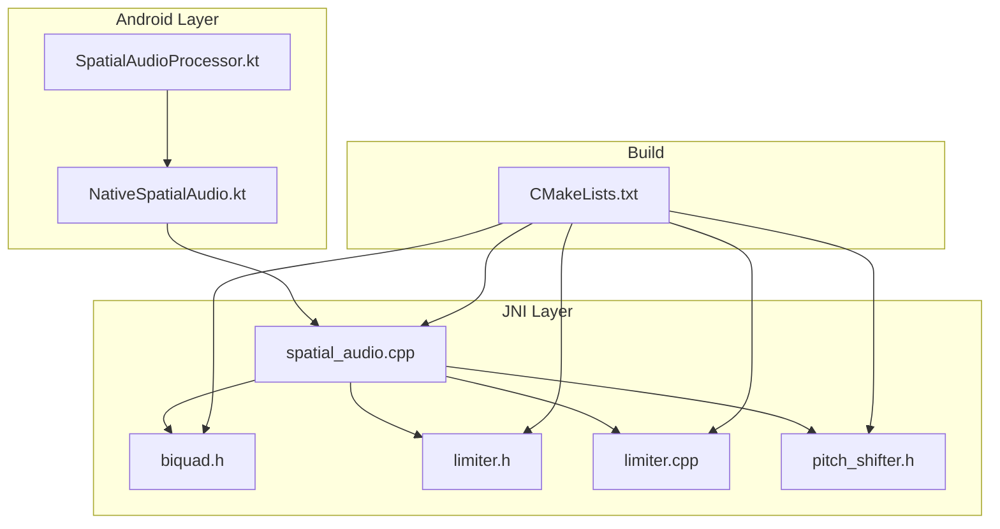
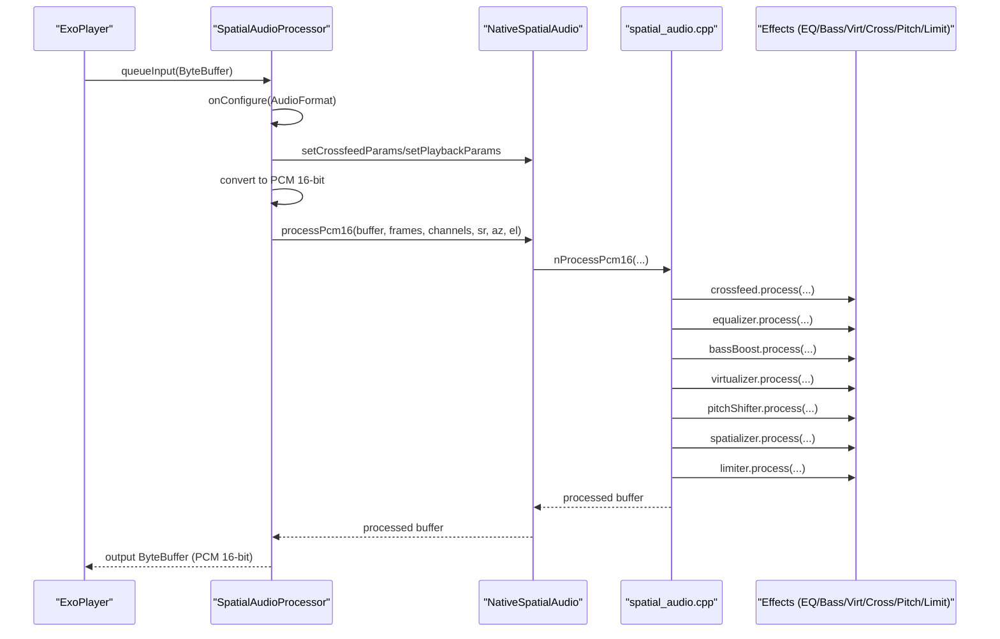
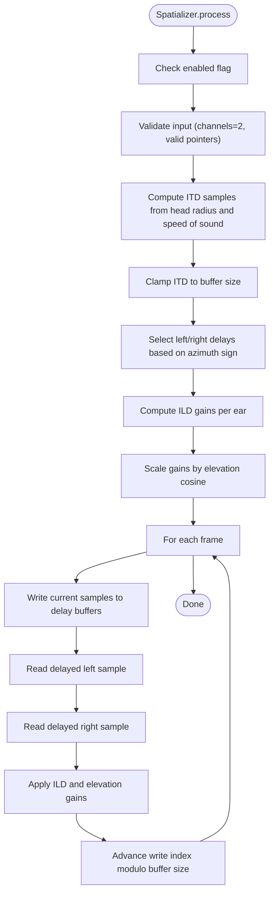
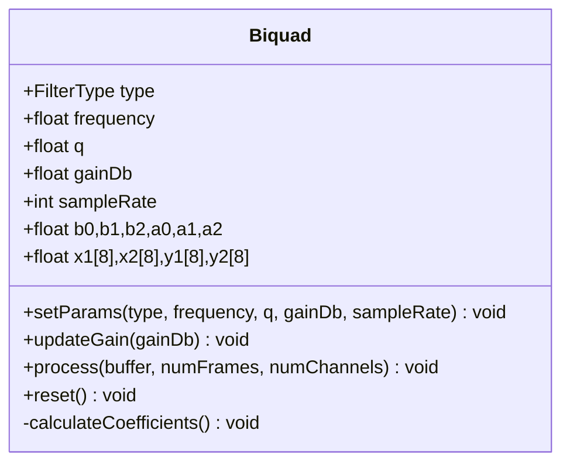
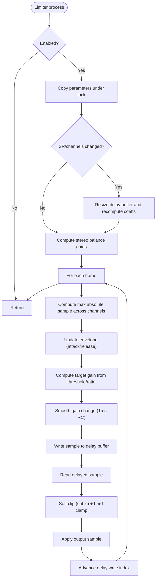
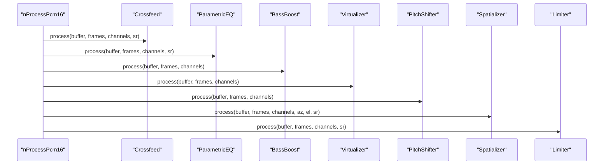
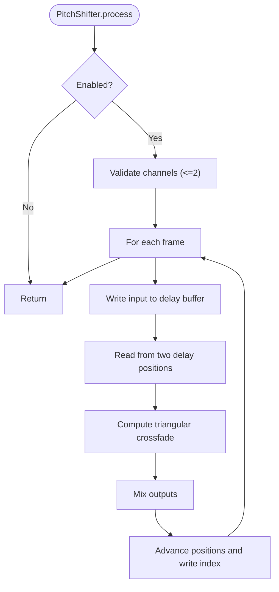
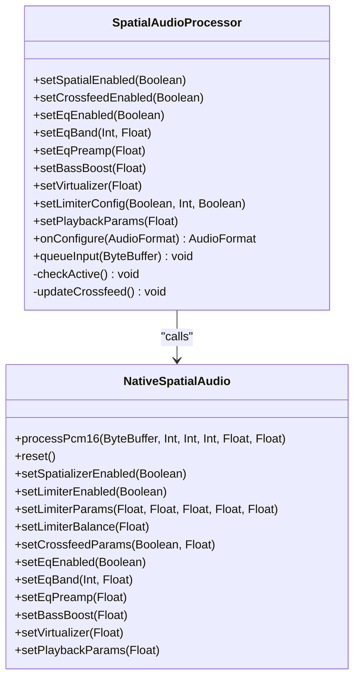
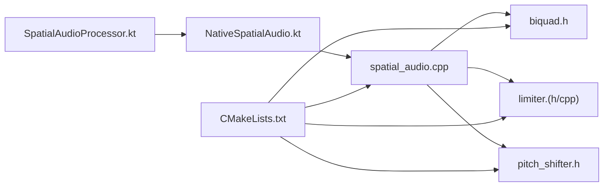

# Native Audio Processors

<cite>
**Referenced Files in This Document**
- [spatial_audio.cpp](file://app/src/main/cpp/spatial_audio.cpp)
- [biquad.h](file://app/src/main/cpp/biquad.h)
- [limiter.h](file://app/src/main/cpp/limiter.h)
- [limiter.cpp](file://app/src/main/cpp/limiter.cpp)
- [pitch_shifter.h](file://app/src/main/cpp/pitch_shifter.h)
- [CMakeLists.txt](file://app/src/main/cpp/CMakeLists.txt)
- [NativeSpatialAudio.kt](file://app/src/main/java/com/suvojeet/suvmusic/player/NativeSpatialAudio.kt)
- [SpatialAudioProcessor.kt](file://app/src/main/java/com/suvojeet/suvmusic/player/SpatialAudioProcessor.kt)
- [README.md](file://README.md)
</cite>

## Table of Contents
1. [Introduction](#introduction)
2. [Project Structure](#project-structure)
3. [Core Components](#core-components)
4. [Architecture Overview](#architecture-overview)
5. [Detailed Component Analysis](#detailed-component-analysis)
6. [Dependency Analysis](#dependency-analysis)
7. [Performance Considerations](#performance-considerations)
8. [Troubleshooting Guide](#troubleshooting-guide)
9. [Conclusion](#conclusion)
10. [Appendices](#appendices)

## Introduction
This document explains the native audio processing pipeline in SuvMusic, focusing on spatial audio, biquad filter design, and limiter functionality. It covers the audio processing stages, buffer management, real-time performance characteristics, mathematical algorithms, DSP implementation details, and integration with Media3 ExoPlayer. It also provides configuration parameters, examples of custom audio effect implementation, and performance profiling techniques for native audio code.

## Project Structure
The native audio engine resides under app/src/main/cpp and exposes JNI functions consumed by the Android Kotlin layer. The ExoPlayer integration is implemented via a custom AudioProcessor that converts buffers, applies native effects, and returns PCM 16-bit output.

**Diagram sources**
- [SpatialAudioProcessor.kt:13-243](file://app/src/main/java/com/suvojeet/suvmusic/player/SpatialAudioProcessor.kt#L13-L243)
- [NativeSpatialAudio.kt:9-158](file://app/src/main/java/com/suvojeet/suvmusic/player/NativeSpatialAudio.kt#L9-L158)
- [spatial_audio.cpp:16-475](file://app/src/main/cpp/spatial_audio.cpp#L16-L475)
- [biquad.h:17-125](file://app/src/main/cpp/biquad.h#L17-L125)
- [limiter.h:10-51](file://app/src/main/cpp/limiter.h#L10-L51)
- [limiter.cpp:1-163](file://app/src/main/cpp/limiter.cpp#L1-L163)
- [pitch_shifter.h:14-109](file://app/src/main/cpp/pitch_shifter.h#L14-L109)
- [CMakeLists.txt:8-19](file://app/src/main/cpp/CMakeLists.txt#L8-L19)

**Section sources**
- [README.md:44-48](file://README.md#L44-L48)
- [CMakeLists.txt:1-23](file://app/src/main/cpp/CMakeLists.txt#L1-L23)

## Core Components
- Spatializer: Implements interaural time difference (ITD) and interaural level difference (ILD) with head-related modeling, plus elevation scaling.
- Crossfeed: Applies a short-delayed, low-pass filtered crossfeed to simulate headphone stage cues.
- Parametric EQ: 10-band ISO-standard equalizer with preamp and shelving filters.
- Bass Boost: Low-shelf boost controlled by a normalized strength parameter.
- Virtualizer: Mid-side widening effect for perceived stereo width.
- Pitch Shifter: Dual delay-line pitch shifter with triangular crossfade for smooth pitch adjustment.
- Limiter: Look-ahead peak limiter with attack/release envelope detection, makeup gain, and stereo balance.

**Section sources**
- [spatial_audio.cpp:16-475](file://app/src/main/cpp/spatial_audio.cpp#L16-L475)
- [biquad.h:17-125](file://app/src/main/cpp/biquad.h#L17-L125)
- [limiter.h:10-51](file://app/src/main/cpp/limiter.h#L10-L51)
- [limiter.cpp:1-163](file://app/src/main/cpp/limiter.cpp#L1-L163)
- [pitch_shifter.h:14-109](file://app/src/main/cpp/pitch_shifter.h#L14-L109)

## Architecture Overview
The audio processing pipeline integrates Media3 ExoPlayer’s BaseAudioProcessor with a native C++ engine. The Kotlin processor handles buffer conversions and passes PCM 16-bit data to the native layer, which applies effects in a fixed order and returns processed samples.

**Diagram sources**
- [SpatialAudioProcessor.kt:113-242](file://app/src/main/java/com/suvojeet/suvmusic/player/SpatialAudioProcessor.kt#L113-L242)
- [NativeSpatialAudio.kt:28-158](file://app/src/main/java/com/suvojeet/suvmusic/player/NativeSpatialAudio.kt#L28-L158)
- [spatial_audio.cpp:347-475](file://app/src/main/cpp/spatial_audio.cpp#L347-L475)

## Detailed Component Analysis

### Spatial Audio Implementation
The spatializer models ITD and ILD using a head-related delay and gain attenuation based on azimuth and elevation. It maintains separate delay buffers for left/right channels and interpolates fractional delays for sub-sample precision.

Key behaviors:
- ITD calculation uses a corrected magnitude-only model with head radius and speed of sound.
- ILD applies sinusoidal attenuation based on azimuth direction.
- Elevation affects both ears’ gains proportionally.
- Fractional delay interpolation prevents aliasing and ensures smooth transitions.

**Diagram sources**
- [spatial_audio.cpp:23-71](file://app/src/main/cpp/spatial_audio.cpp#L23-L71)

**Section sources**
- [spatial_audio.cpp:16-104](file://app/src/main/cpp/spatial_audio.cpp#L16-L104)

### Biquad Filter Design
The Biquad class implements second-order IIR filters in Direct Form I with coefficients computed from standard DSP formulas. It supports low shelf, peaking, and high shelf types with normalization.

Processing:
- Uses state variables x1/x2 and y1/y2 per channel (up to 8).
- Computes coefficients based on frequency, Q, gain (dB), and sample rate.
- Processes interleaved PCM in-place.

**Diagram sources**
- [biquad.h:17-125](file://app/src/main/cpp/biquad.h#L17-L125)

**Section sources**
- [biquad.h:17-125](file://app/src/main/cpp/biquad.h#L17-L125)

### Limiter Functionality
The limiter implements a look-ahead peak detection envelope with attack/release smoothing, ratio-based gain reduction, and cubic soft clipping with hard clamping. It supports stereo balance and makeup gain.

Processing stages:
- Parameter copy under mutex to minimize lock contention.
- Recalculate delay buffer size and coefficients when SR/channels change.
- Compute per-frame peak absolute amplitude across channels.
- Update envelope with exponential smoothing.
- Compute target gain reduction based on threshold and ratio.
- Smooth gain change to avoid zipper noise.
- Apply look-ahead delay and smoothed gain with soft clipping.
- Clamp output to [-1, 1].

**Diagram sources**
- [limiter.cpp:25-144](file://app/src/main/cpp/limiter.cpp#L25-L144)
- [limiter.h:10-51](file://app/src/main/cpp/limiter.h#L10-L51)

**Section sources**
- [limiter.cpp:1-163](file://app/src/main/cpp/limiter.cpp#L1-L163)
- [limiter.h:10-51](file://app/src/main/cpp/limiter.h#L10-L51)

### Parametric EQ and Effects Chain
The native chain applies effects in a fixed order:
1. Crossfeed
2. Parametric EQ
3. Bass Boost
4. Virtualizer
5. Pitch Shifter
6. Spatializer
7. Limiter

Each effect exposes setters for enable/disable and parameters. The EQ uses 10 bands with ISO standard frequencies and shelving filters at edges.

**Diagram sources**
- [spatial_audio.cpp:381-387](file://app/src/main/cpp/spatial_audio.cpp#L381-L387)

**Section sources**
- [spatial_audio.cpp:206-270](file://app/src/main/cpp/spatial_audio.cpp#L206-L270)
- [spatial_audio.cpp:272-333](file://app/src/main/cpp/spatial_audio.cpp#L272-L333)
- [spatial_audio.cpp:335-342](file://app/src/main/cpp/spatial_audio.cpp#L335-L342)

### Pitch Shifter
The pitch shifter uses dual delay lines with triangular crossfade windows to smoothly interpolate between shifted samples. It supports a pitch ratio in [0.1, 5.0] and maintains channel compatibility.

**Diagram sources**
- [pitch_shifter.h:28-72](file://app/src/main/cpp/pitch_shifter.h#L28-L72)

**Section sources**
- [pitch_shifter.h:14-109](file://app/src/main/cpp/pitch_shifter.h#L14-L109)

### Integration with Media3 ExoPlayer
The Kotlin processor integrates with ExoPlayer’s BaseAudioProcessor:
- Accepts PCM 16-bit and Float encodings, converting Float to 16-bit.
- Determines whether effects are active and routes data accordingly.
- Manages a direct ByteBuffer for JNI calls and performs safe conversions.
- Applies stereo balance when spatializer is disabled and azimuth/elevation when enabled.

**Diagram sources**
- [SpatialAudioProcessor.kt:13-243](file://app/src/main/java/com/suvojeet/suvmusic/player/SpatialAudioProcessor.kt#L13-L243)
- [NativeSpatialAudio.kt:9-158](file://app/src/main/java/com/suvojeet/suvmusic/player/NativeSpatialAudio.kt#L9-L158)

**Section sources**
- [SpatialAudioProcessor.kt:13-243](file://app/src/main/java/com/suvojeet/suvmusic/player/SpatialAudioProcessor.kt#L13-L243)
- [NativeSpatialAudio.kt:9-158](file://app/src/main/java/com/suvojeet/suvmusic/player/NativeSpatialAudio.kt#L9-L158)

## Dependency Analysis
- Build dependencies: CMake compiles spatial_audio.cpp, limiter.cpp, biquad.h, and pitch_shifter.h into a shared library.
- Runtime dependencies: NativeSpatialAudio loads the library and exposes JNI methods; SpatialAudioProcessor bridges ExoPlayer and the native engine.

**Diagram sources**
- [CMakeLists.txt:8-19](file://app/src/main/cpp/CMakeLists.txt#L8-L19)
- [spatial_audio.cpp:8-10](file://app/src/main/cpp/spatial_audio.cpp#L8-L10)

**Section sources**
- [CMakeLists.txt:1-23](file://app/src/main/cpp/CMakeLists.txt#L1-L23)

## Performance Considerations
- Real-time constraints: All native processing occurs in-place with minimal allocations. The limiter uses a fixed-size look-ahead buffer sized by a constant latency budget and recomputes coefficients only when sample rate or channel count changes.
- Buffer management: The native processor allocates a single float buffer sized to the current frame and resizes only when needed. Cross-channel loops are optimized with early exits and local copies of atomic parameters.
- SIMD acceleration: The recommendation scorer demonstrates SIMD usage (NEON/SSE) for vectorized scoring. While the audio processors do not currently use SIMD, the same patterns (loop unrolling, vectorization-friendly layouts) can guide future enhancements.
- Latency: The limiter’s 5 ms look-ahead introduces a small processing delay. The spatializer adds delay proportional to ITD, which is bounded by the delay buffer size.
- Thread safety: Mutex-protected parameter updates and atomic flags guard concurrent access to effect states.

[No sources needed since this section provides general guidance]

## Troubleshooting Guide
Common issues and resolutions:
- Silence or distorted output:
  - Ensure the input ByteBuffer is direct and the encoding is PCM 16-bit or Float.
  - Verify that the processor is configured for the correct sample rate and channel count.
- JNI errors:
  - Confirm the native library is loaded before calling JNI functions.
  - Check that the buffer capacity matches the frame count and channel count.
- Excessive loudness or clipping:
  - Adjust limiter makeup gain and threshold.
  - Reduce EQ preamp and band gains.
- Spatial audio not applying:
  - Verify spatializer is enabled and input is stereo.
  - Confirm azimuth and elevation values are set appropriately.

**Section sources**
- [SpatialAudioProcessor.kt:113-242](file://app/src/main/java/com/suvojeet/suvmusic/player/SpatialAudioProcessor.kt#L113-L242)
- [NativeSpatialAudio.kt:28-52](file://app/src/main/java/com/suvojeet/suvmusic/player/NativeSpatialAudio.kt#L28-L52)
- [limiter.cpp:146-163](file://app/src/main/cpp/limiter.cpp#L146-L163)

## Conclusion
SuvMusic’s native audio engine delivers a robust, real-time processing pipeline integrating spatial audio, parametric EQ, bass boost, virtualizer, pitch shifting, and a high-quality limiter. The design emphasizes thread safety, minimal allocations, and predictable latency, enabling seamless integration with Media3 ExoPlayer. The modular architecture allows incremental enhancement, including SIMD optimization and additional effects.

[No sources needed since this section summarizes without analyzing specific files]

## Appendices

### Configuration Parameters and Processing Stages
- Spatializer
  - Enabled: Boolean
  - Azimuth: radians (-π/2 to π/2)
  - Elevation: radians (0 for horizontal)
- Crossfeed
  - Enabled: Boolean
  - Strength: 0.0 to 1.0
- Parametric EQ
  - Enabled: Boolean
  - Preamp: dB
  - Band gains: 10 bands (ISO frequencies)
- Bass Boost
  - Strength: 0.0 to 1.0 (maps to 0–12 dB)
- Virtualizer
  - Strength: 0.0 to 1.0
- Pitch Shifter
  - Pitch ratio: 0.1 to 5.0
- Limiter
  - Threshold: dB
  - Ratio: > 1.0
  - Attack: ms
  - Release: ms
  - Makeup gain: dB
  - Stereo balance: -1.0 (left) to 1.0 (right)

**Section sources**
- [spatial_audio.cpp:397-475](file://app/src/main/cpp/spatial_audio.cpp#L397-L475)
- [limiter.h:17-18](file://app/src/main/cpp/limiter.h#L17-L18)
- [limiter.cpp:10-18](file://app/src/main/cpp/limiter.cpp#L10-L18)
- [pitch_shifter.h:21-26](file://app/src/main/cpp/pitch_shifter.h#L21-L26)

### Custom Audio Effect Implementation Example
To add a new effect:
1. Define a class with process(buffer, frames, channels) and parameter setters.
2. Add a member to the global processor chain in spatial_audio.cpp.
3. Expose JNI setters/getters mirroring existing patterns.
4. Integrate into the processing order and ensure thread-safe parameter updates.

**Section sources**
- [spatial_audio.cpp:335-342](file://app/src/main/cpp/spatial_audio.cpp#L335-L342)
- [spatial_audio.cpp:397-475](file://app/src/main/cpp/spatial_audio.cpp#L397-L475)

### Performance Profiling Techniques for Native Audio Code
- Measure CPU time per frame using platform timers around the JNI boundary.
- Profile hot loops (limiter envelope update, spatializer delay reads, EQ stages).
- Use Android Studio’s CPU profiler to identify contention on mutex-protected sections.
- Benchmark with varying frame sizes and sample rates to assess overhead.
- Validate memory allocations inside loops; ensure buffers are reused and resized sparingly.

[No sources needed since this section provides general guidance]