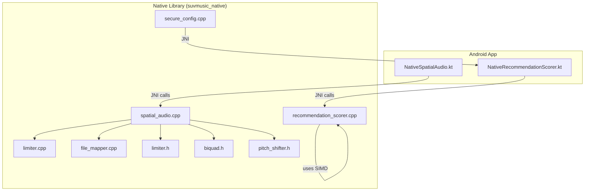
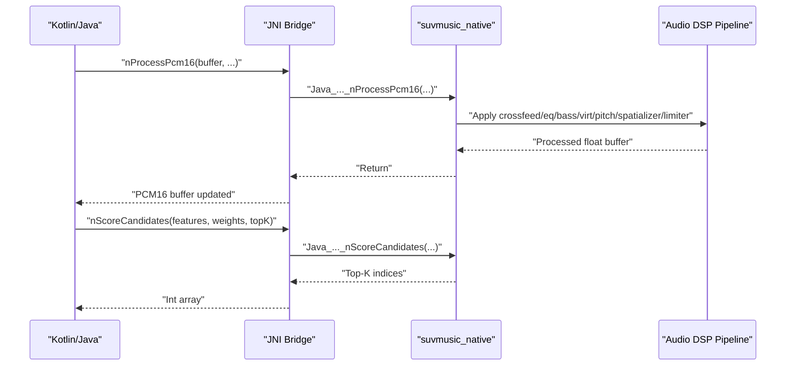
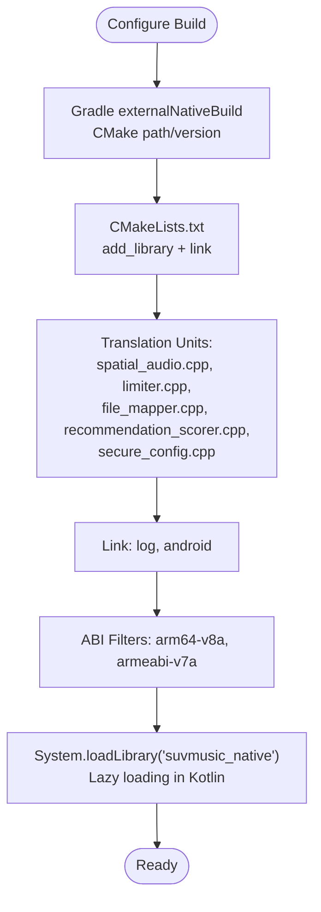
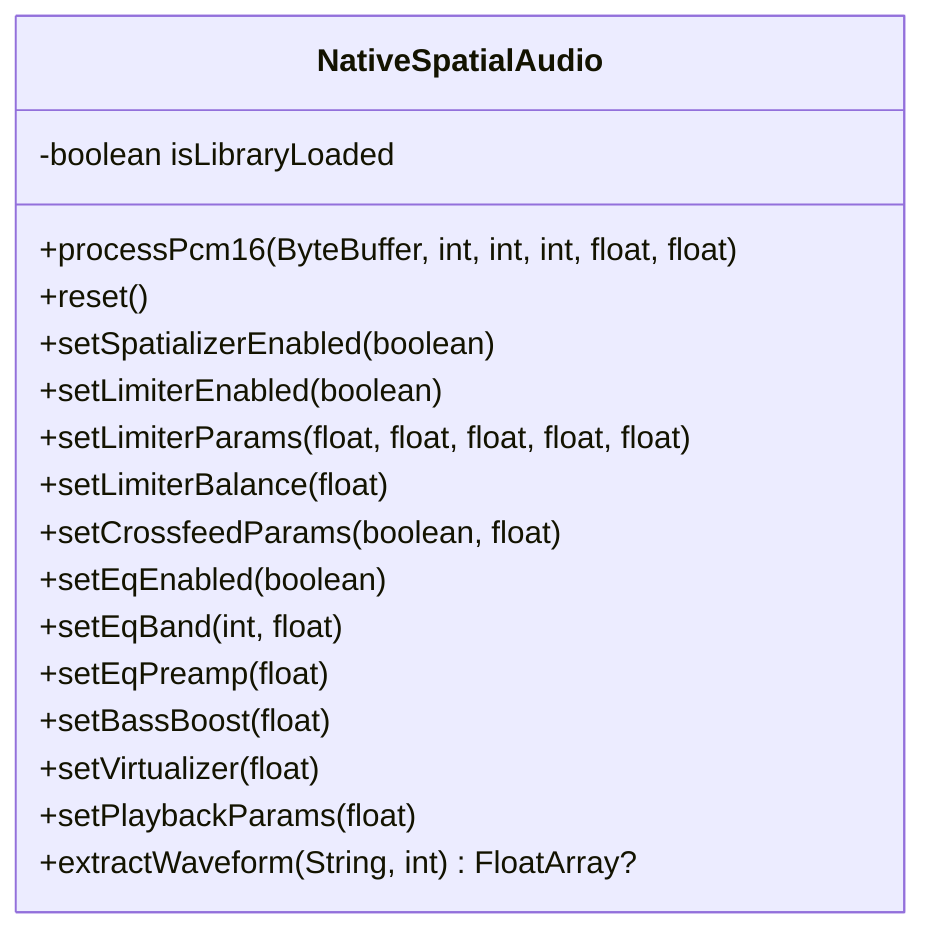
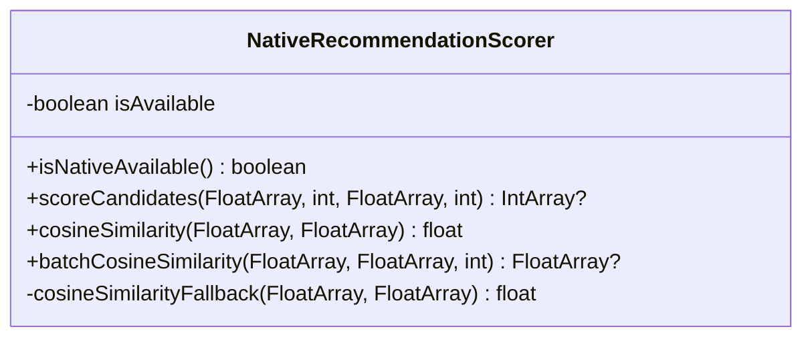
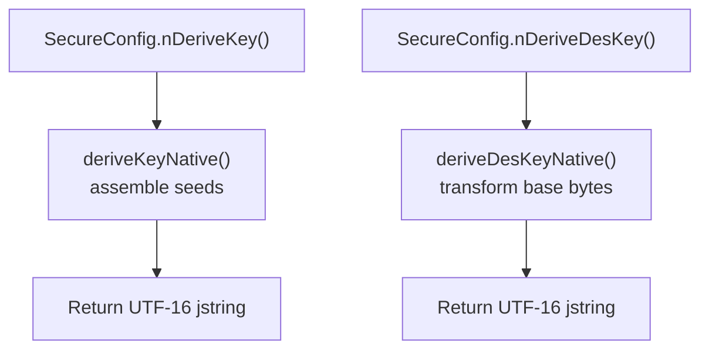
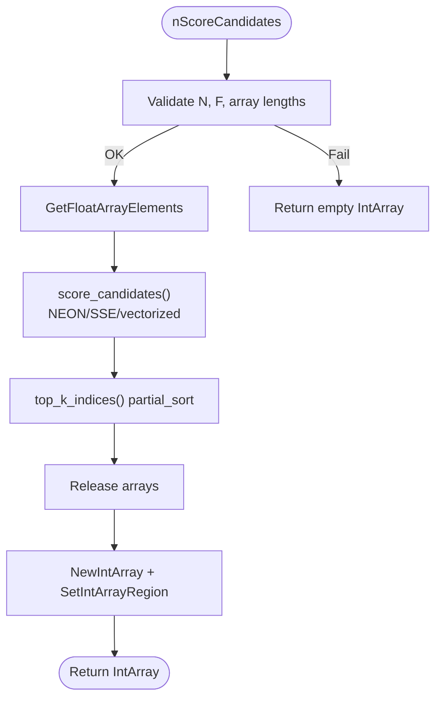
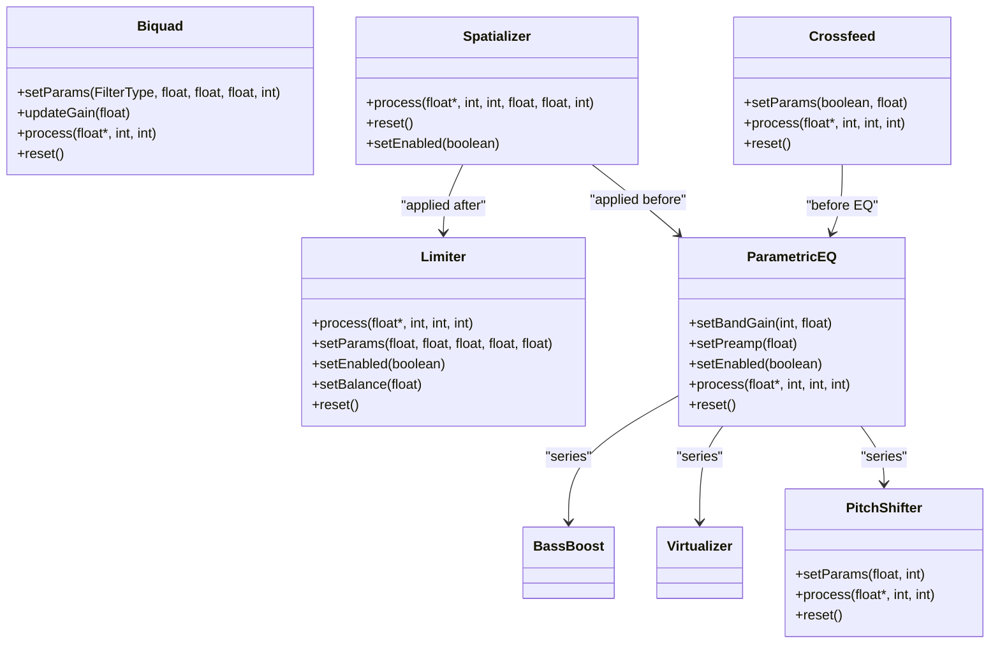
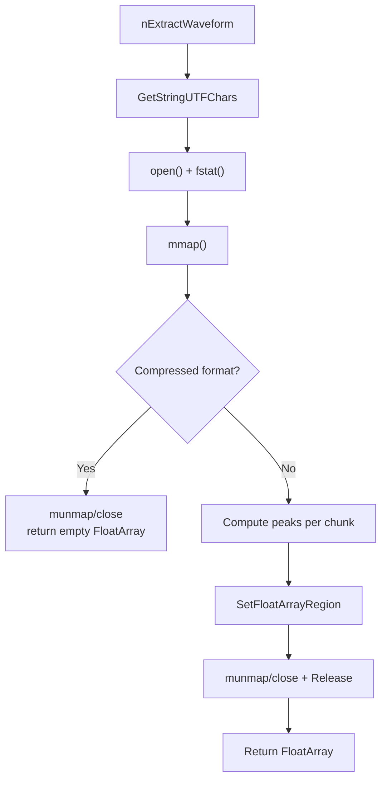
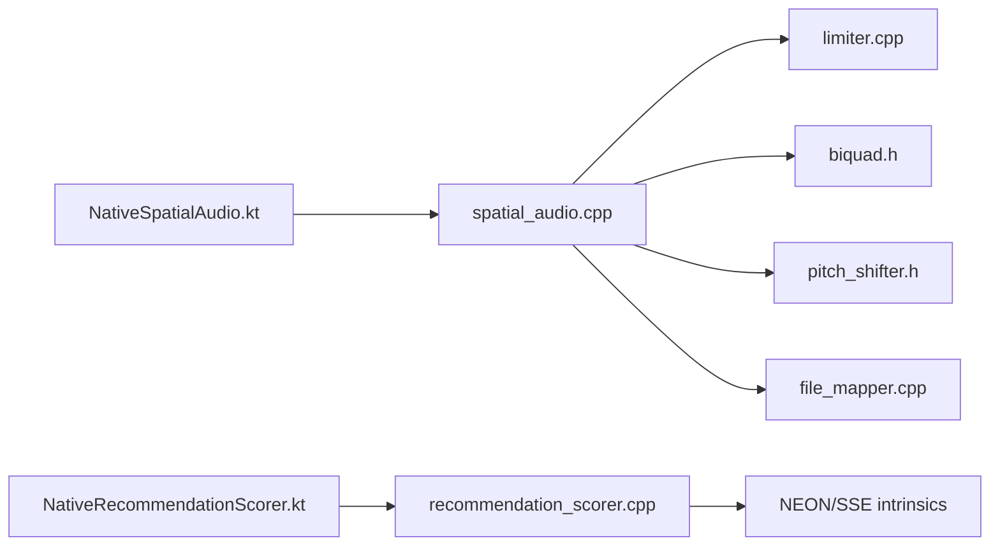

# Native Integration

<cite>
**Referenced Files in This Document**
- [CMakeLists.txt](file://app/src/main/cpp/CMakeLists.txt)
- [build.gradle.kts](file://app/build.gradle.kts)
- [recommendation_scorer.cpp](file://app/src/main/cpp/recommendation_scorer.cpp)
- [secure_config.cpp](file://app/src/main/cpp/secure_config.cpp)
- [spatial_audio.cpp](file://app/src/main/cpp/spatial_audio.cpp)
- [limiter.cpp](file://app/src/main/cpp/limiter.cpp)
- [limiter.h](file://app/src/main/cpp/limiter.h)
- [biquad.h](file://app/src/main/cpp/biquad.h)
- [pitch_shifter.h](file://app/src/main/cpp/pitch_shifter.h)
- [file_mapper.cpp](file://app/src/main/cpp/file_mapper.cpp)
- [NativeSpatialAudio.kt](file://app/src/main/java/com/suvojeet/suvmusic/player/NativeSpatialAudio.kt)
- [NativeRecommendationScorer.kt](file://app/src/main/java/com/suvojeet/suvmusic/recommendation/NativeRecommendationScorer.kt)
</cite>

## Table of Contents
1. [Introduction](#introduction)
2. [Project Structure](#project-structure)
3. [Core Components](#core-components)
4. [Architecture Overview](#architecture-overview)
5. [Detailed Component Analysis](#detailed-component-analysis)
6. [Dependency Analysis](#dependency-analysis)
7. [Performance Considerations](#performance-considerations)
8. [Troubleshooting Guide](#troubleshooting-guide)
9. [Conclusion](#conclusion)

## Introduction
This document explains SuvMusic’s native C++ integration via JNI. It covers the CMake build configuration, native library management, JNI bridge implementations, secure configuration logic, native recommendation scoring with SIMD acceleration, and performance-critical audio DSP. It also documents build system integration, ABI targeting, debugging native code, memory management between Java and C++, exception handling, thread safety, profiling, optimization techniques, and troubleshooting native integration issues.

## Project Structure
The native code resides under app/src/main/cpp and is built into a single shared library named suvmusic_native. The library exposes JNI functions consumed by Kotlin/Java components for audio processing and recommendation scoring. The Gradle build integrates CMake and configures ABI filtering and NDK versioning.

**Diagram sources**
- [build.gradle.kts:102-110](file://app/build.gradle.kts#L102-L110)
- [CMakeLists.txt:8-13](file://app/src/main/cpp/CMakeLists.txt#L8-L13)
- [NativeSpatialAudio.kt:13-23](file://app/src/main/java/com/suvojeet/suvmusic/player/NativeSpatialAudio.kt#L13-L23)
- [NativeRecommendationScorer.kt:38-48](file://app/src/main/java/com/suvojeet/suvmusic/recommendation/NativeRecommendationScorer.kt#L38-L48)

**Section sources**
- [build.gradle.kts:102-110](file://app/build.gradle.kts#L102-L110)
- [CMakeLists.txt:1-23](file://app/src/main/cpp/CMakeLists.txt#L1-L23)

## Core Components
- Native library suvmusic_native: Built from multiple translation units and linked against Android and log libraries.
- JNI bridges:
  - NativeSpatialAudio.kt exposes audio DSP controls and waveform extraction via JNI.
  - NativeRecommendationScorer.kt exposes recommendation scoring via JNI.
  - secure_config.cpp exposes native key derivation via JNI.
- Performance-critical modules:
  - SIMD-accelerated recommendation scoring with NEON/SSE fallback.
  - Real-time audio processing pipeline (spatializer, limiter, EQ, crossfeed, bass boost, virtualizer, pitch shifter).
  - Memory-mapped file I/O for waveform extraction.

**Section sources**
- [CMakeLists.txt:8-19](file://app/src/main/cpp/CMakeLists.txt#L8-L19)
- [NativeSpatialAudio.kt:1-158](file://app/src/main/java/com/suvojeet/suvmusic/player/NativeSpatialAudio.kt#L1-L158)
- [NativeRecommendationScorer.kt:1-187](file://app/src/main/java/com/suvojeet/suvmusic/recommendation/NativeRecommendationScorer.kt#L1-L187)
- [secure_config.cpp:1-61](file://app/src/main/cpp/secure_config.cpp#L1-L61)

## Architecture Overview
The JNI architecture consists of Kotlin/Java entry points that delegate to native functions. The native library is loaded asynchronously in Kotlin to avoid blocking the main thread. Audio processing is performed in-place on direct buffers, and recommendation scoring operates on flat SoA arrays passed from Java.

**Diagram sources**
- [NativeSpatialAudio.kt:28-34](file://app/src/main/java/com/suvojeet/suvmusic/player/NativeSpatialAudio.kt#L28-L34)
- [spatial_audio.cpp:347-393](file://app/src/main/cpp/spatial_audio.cpp#L347-L393)
- [NativeRecommendationScorer.kt:81-104](file://app/src/main/java/com/suvojeet/suvmusic/recommendation/NativeRecommendationScorer.kt#L81-L104)
- [recommendation_scorer.cpp:362-425](file://app/src/main/cpp/recommendation_scorer.cpp#L362-L425)

## Detailed Component Analysis

### Build System and Library Management
- CMake configuration defines the suvmusic_native shared library and links against log and android.
- Gradle externalNativeBuild integrates CMake and sets the NDK version and CMake version.
- ABI filtering limits builds to arm64-v8a and armeabi-v7a to reduce APK size and improve compatibility.
- The library is loaded lazily in Kotlin to avoid main-thread I/O and handle UnsatisfiedLinkError gracefully.

**Diagram sources**
- [build.gradle.kts:102-110](file://app/build.gradle.kts#L102-L110)
- [CMakeLists.txt:8-19](file://app/src/main/cpp/CMakeLists.txt#L8-L19)
- [NativeSpatialAudio.kt:13-23](file://app/src/main/java/com/suvojeet/suvmusic/player/NativeSpatialAudio.kt#L13-L23)

**Section sources**
- [build.gradle.kts:27-30](file://app/build.gradle.kts#L27-L30)
- [build.gradle.kts:102-110](file://app/build.gradle.kts#L102-L110)
- [CMakeLists.txt:1-23](file://app/src/main/cpp/CMakeLists.txt#L1-L23)
- [NativeSpatialAudio.kt:13-23](file://app/src/main/java/com/suvojeet/suvmusic/player/NativeSpatialAudio.kt#L13-L23)

### JNI Bridge: NativeSpatialAudio
- Exposes real-time audio processing via nProcessPcm16 and numerous setters for DSP modules.
- Requires direct ByteBuffer to avoid extra copies.
- Resets all DSP modules on demand.

**Diagram sources**
- [NativeSpatialAudio.kt:1-158](file://app/src/main/java/com/suvojeet/suvmusic/player/NativeSpatialAudio.kt#L1-L158)

**Section sources**
- [NativeSpatialAudio.kt:28-34](file://app/src/main/java/com/suvojeet/suvmusic/player/NativeSpatialAudio.kt#L28-L34)
- [NativeSpatialAudio.kt:48-52](file://app/src/main/java/com/suvojeet/suvmusic/player/NativeSpatialAudio.kt#L48-L52)
- [NativeSpatialAudio.kt:64-68](file://app/src/main/java/com/suvojeet/suvmusic/player/NativeSpatialAudio.kt#L64-L68)
- [NativeSpatialAudio.kt:80-86](file://app/src/main/java/com/suvojeet/suvmusic/player/NativeSpatialAudio.kt#L80-L86)
- [NativeSpatialAudio.kt:88-94](file://app/src/main/java/com/suvojeet/suvmusic/player/NativeSpatialAudio.kt#L88-L94)
- [NativeSpatialAudio.kt:96-108](file://app/src/main/java/com/suvojeet/suvmusic/player/NativeSpatialAudio.kt#L96-L108)
- [NativeSpatialAudio.kt:112-116](file://app/src/main/java/com/suvojeet/suvmusic/player/NativeSpatialAudio.kt#L112-L116)
- [NativeSpatialAudio.kt:120-132](file://app/src/main/java/com/suvojeet/suvmusic/player/NativeSpatialAudio.kt#L120-L132)
- [NativeSpatialAudio.kt:136-142](file://app/src/main/java/com/suvojeet/suvmusic/player/NativeSpatialAudio.kt#L136-L142)
- [NativeSpatialAudio.kt:150-156](file://app/src/main/java/com/suvojeet/suvmusic/player/NativeSpatialAudio.kt#L150-L156)

### JNI Bridge: NativeRecommendationScorer
- Provides SIMD-accelerated scoring and similarity computations.
- Validates input sizes and falls back to Kotlin when native is unavailable.
- Exposes top-K selection and batch cosine similarity.

**Diagram sources**
- [NativeRecommendationScorer.kt:1-187](file://app/src/main/java/com/suvojeet/suvmusic/recommendation/NativeRecommendationScorer.kt#L1-L187)

**Section sources**
- [NativeRecommendationScorer.kt:35-48](file://app/src/main/java/com/suvojeet/suvmusic/recommendation/NativeRecommendationScorer.kt#L35-L48)
- [NativeRecommendationScorer.kt:81-104](file://app/src/main/java/com/suvojeet/suvmusic/recommendation/NativeRecommendationScorer.kt#L81-L104)
- [NativeRecommendationScorer.kt:111-145](file://app/src/main/java/com/suvojeet/suvmusic/recommendation/NativeRecommendationScorer.kt#L111-L145)

### Secure Configuration System
- Derives keys in native code to complicate reverse engineering.
- Exposes JNI functions for general and DES key derivation.

**Diagram sources**
- [secure_config.cpp:17-34](file://app/src/main/cpp/secure_config.cpp#L17-L34)
- [secure_config.cpp:39-46](file://app/src/main/cpp/secure_config.cpp#L39-L46)
- [secure_config.cpp:49-60](file://app/src/main/cpp/secure_config.cpp#L49-L60)

**Section sources**
- [secure_config.cpp:1-61](file://app/src/main/cpp/secure_config.cpp#L1-L61)

### Native Recommendation Scoring Engine
- SIMD-accelerated weighted scoring with NEON/SSE fallback.
- Uses SoA layout for feature arrays and returns top-K indices.
- Includes cosine similarity and batch similarity helpers.

**Diagram sources**
- [recommendation_scorer.cpp:362-425](file://app/src/main/cpp/recommendation_scorer.cpp#L362-L425)
- [recommendation_scorer.cpp:166-322](file://app/src/main/cpp/recommendation_scorer.cpp#L166-L322)
- [recommendation_scorer.cpp:328-344](file://app/src/main/cpp/recommendation_scorer.cpp#L328-L344)

**Section sources**
- [recommendation_scorer.cpp:1-503](file://app/src/main/cpp/recommendation_scorer.cpp#L1-L503)

### Audio DSP Pipeline
- Real-time processing chain: crossfeed → EQ → bass boost → virtualizer → pitch shifter → spatializer → limiter.
- Uses direct buffers and in-place processing to minimize allocations.
- Thread-safe with mutexes around stateful modules; atomic flags guard enable/disable.

**Diagram sources**
- [spatial_audio.cpp:16-104](file://app/src/main/cpp/spatial_audio.cpp#L16-L104)
- [spatial_audio.cpp:106-204](file://app/src/main/cpp/spatial_audio.cpp#L106-L204)
- [spatial_audio.cpp:206-270](file://app/src/main/cpp/spatial_audio.cpp#L206-L270)
- [spatial_audio.cpp:272-297](file://app/src/main/cpp/spatial_audio.cpp#L272-L297)
- [spatial_audio.cpp:299-333](file://app/src/main/cpp/spatial_audio.cpp#L299-L333)
- [limiter.h:10-51](file://app/src/main/cpp/limiter.h#L10-L51)
- [biquad.h:17-125](file://app/src/main/cpp/biquad.h#L17-L125)
- [pitch_shifter.h:14-109](file://app/src/main/cpp/pitch_shifter.h#L14-L109)

**Section sources**
- [spatial_audio.cpp:1-475](file://app/src/main/cpp/spatial_audio.cpp#L1-L475)
- [limiter.cpp:1-163](file://app/src/main/cpp/limiter.cpp#L1-L163)
- [limiter.h:1-51](file://app/src/main/cpp/limiter.h#L1-L51)
- [biquad.h:1-125](file://app/src/main/cpp/biquad.h#L1-L125)
- [pitch_shifter.h:1-109](file://app/src/main/cpp/pitch_shifter.h#L1-L109)

### Memory-Mapped File Waveform Extraction
- Uses mmap to read raw PCM files and computes peak amplitudes per chunk.
- Detects compressed formats and rejects them.
- Returns a float array to Java.

**Diagram sources**
- [file_mapper.cpp:12-124](file://app/src/main/cpp/file_mapper.cpp#L12-L124)

**Section sources**
- [file_mapper.cpp:1-124](file://app/src/main/cpp/file_mapper.cpp#L1-L124)

## Dependency Analysis
- Kotlin/Java depends on JNI function names derived from class and method names.
- Native library depends on Android NDK APIs and standard C++ STL.
- Audio DSP modules depend on each other in a strict processing order.
- Recommendation engine depends on platform-specific SIMD intrinsics.

**Diagram sources**
- [NativeSpatialAudio.kt:1-158](file://app/src/main/java/com/suvojeet/suvmusic/player/NativeSpatialAudio.kt#L1-L158)
- [NativeRecommendationScorer.kt:1-187](file://app/src/main/java/com/suvojeet/suvmusic/recommendation/NativeRecommendationScorer.kt#L1-L187)
- [spatial_audio.cpp:1-475](file://app/src/main/cpp/spatial_audio.cpp#L1-L475)
- [recommendation_scorer.cpp:1-503](file://app/src/main/cpp/recommendation_scorer.cpp#L1-L503)
- [limiter.cpp:1-163](file://app/src/main/cpp/limiter.cpp#L1-L163)
- [biquad.h:1-125](file://app/src/main/cpp/biquad.h#L1-L125)
- [pitch_shifter.h:1-109](file://app/src/main/cpp/pitch_shifter.h#L1-L109)
- [file_mapper.cpp:1-124](file://app/src/main/cpp/file_mapper.cpp#L1-L124)

**Section sources**
- [NativeSpatialAudio.kt:1-158](file://app/src/main/java/com/suvojeet/suvmusic/player/NativeSpatialAudio.kt#L1-L158)
- [NativeRecommendationScorer.kt:1-187](file://app/src/main/java/com/suvojeet/suvmusic/recommendation/NativeRecommendationScorer.kt#L1-L187)
- [spatial_audio.cpp:1-475](file://app/src/main/cpp/spatial_audio.cpp#L1-L475)
- [recommendation_scorer.cpp:1-503](file://app/src/main/cpp/recommendation_scorer.cpp#L1-L503)

## Performance Considerations
- SIMD acceleration: NEON/SSE vectorization in recommendation scoring and cosine similarity.
- In-place processing: Direct ByteBuffer and float conversion minimize allocations.
- Look-ahead limiter: 5 ms lookahead with cubic soft-clip prevents distortion.
- Mutex granularity: Per-module locks protect state; minimal contention in audio chain.
- ABI targeting: arm64-v8a and armeabi-v7a reduce APK size and improve cache locality.
- Page size optimization: 16 KB page size linker option for newer Android targets.

[No sources needed since this section provides general guidance]

## Troubleshooting Guide
- Library load failures:
  - Ensure System.loadLibrary("suvmusic_native") runs on a background thread and handle UnsatisfiedLinkError.
  - Verify ABI filters match device architecture.
- JNI parameter errors:
  - Recommendation scoring validates numCandidates, numFeatures, and array lengths; check caller-side arrays.
  - Audio processing requires direct ByteBuffer and stereo channels for spatializer.
- Memory mapping issues:
  - mmap failures or unsupported compressed formats return null/empty arrays; verify file path and format.
- Threading:
  - Audio processing is guarded by mutexes; avoid concurrent reconfiguration during processing.
- Debugging:
  - Use Android logcat with native tags (e.g., NativeRecoScorer, NativeFileMapper).
  - Enable debug build type and attach gdb/lldb via NDK.

**Section sources**
- [NativeSpatialAudio.kt:13-23](file://app/src/main/java/com/suvojeet/suvmusic/player/NativeSpatialAudio.kt#L13-L23)
- [NativeRecommendationScorer.kt:38-48](file://app/src/main/java/com/suvojeet/suvmusic/recommendation/NativeRecommendationScorer.kt#L38-L48)
- [recommendation_scorer.cpp:372-399](file://app/src/main/cpp/recommendation_scorer.cpp#L372-L399)
- [spatial_audio.cpp:356-368](file://app/src/main/cpp/spatial_audio.cpp#L356-L368)
- [file_mapper.cpp:16-29](file://app/src/main/cpp/file_mapper.cpp#L16-L29)

## Conclusion
SuvMusic’s native integration combines high-performance audio DSP and machine learning scoring behind robust JNI bridges. The build system is streamlined with ABI targeting and CMake integration, while native modules emphasize correctness, thread safety, and performance. Following the guidelines here ensures reliable native operation, maintainable code, and effective debugging.