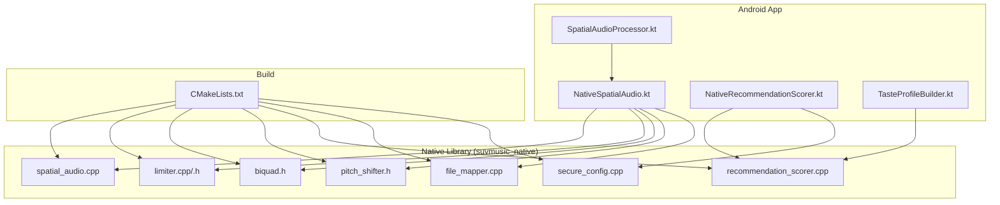
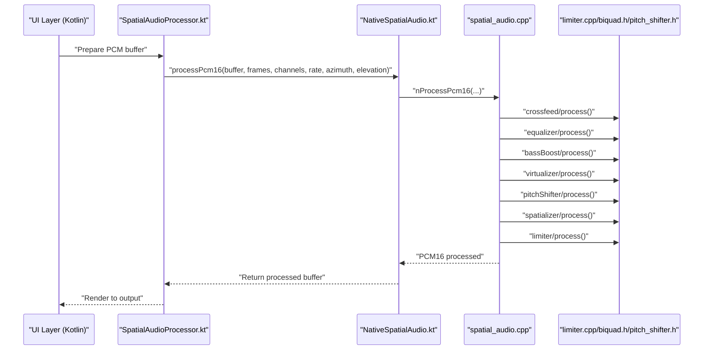
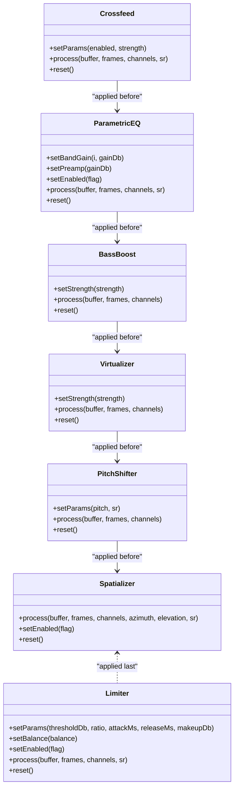
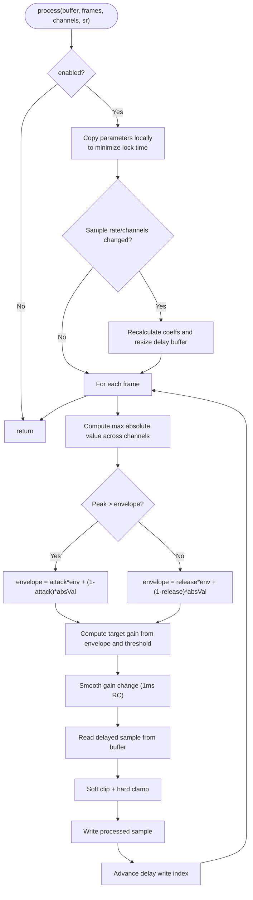
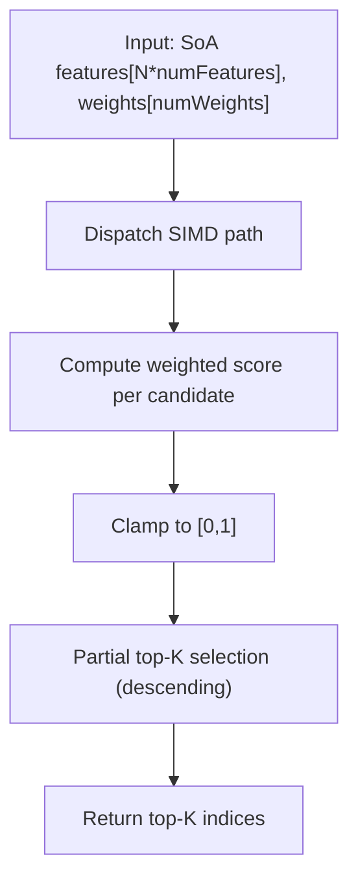
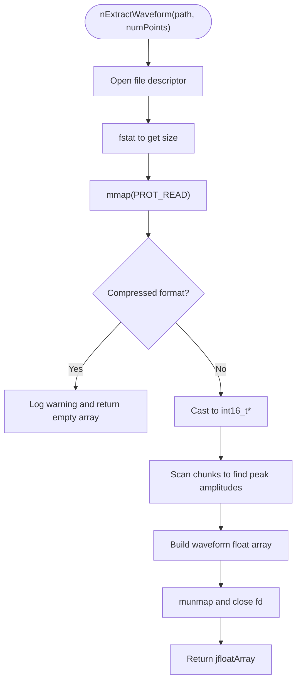
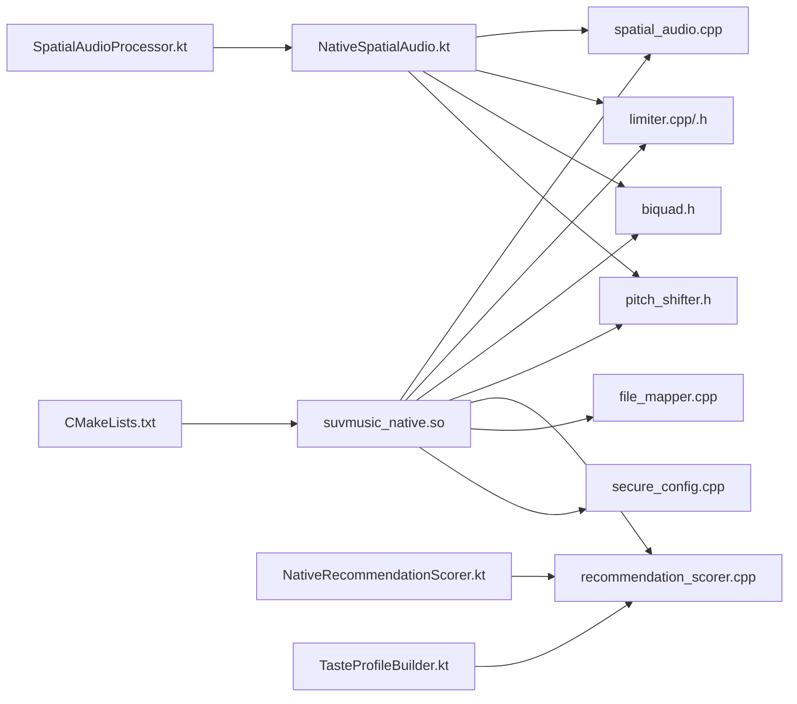

# Performance Optimization

<cite>
**Referenced Files in This Document**
- [CMakeLists.txt](file://app/src/main/cpp/CMakeLists.txt)
- [spatial_audio.cpp](file://app/src/main/cpp/spatial_audio.cpp)
- [limiter.cpp](file://app/src/main/cpp/limiter.cpp)
- [limiter.h](file://app/src/main/cpp/limiter.h)
- [biquad.h](file://app/src/main/cpp/biquad.h)
- [pitch_shifter.h](file://app/src/main/cpp/pitch_shifter.h)
- [recommendation_scorer.cpp](file://app/src/main/cpp/recommendation_scorer.cpp)
- [file_mapper.cpp](file://app/src/main/cpp/file_mapper.cpp)
- [secure_config.cpp](file://app/src/main/cpp/secure_config.cpp)
- [SpatialAudioProcessor.kt](file://app/src/main/java/com/suvojeet/suvmusic/player/SpatialAudioProcessor.kt)
- [NativeSpatialAudio.kt](file://app/src/main/java/com/suvojeet/suvmusic/player/NativeSpatialAudio.kt)
- [NativeRecommendationScorer.kt](file://app/src/main/java/com/suvojeet/suvmusic/recommendation/NativeRecommendationScorer.kt)
- [TasteProfileBuilder.kt](file://app/src/main/java/com/suvojeet/suvmusic/recommendation/TasteProfileBuilder.kt)
- [CrashReportSender.kt](file://app/src/main/java/com/suvojeet/suvmusic/crash/CrashReportSender.kt)
- [CrashReportSenderFactory.kt](file://app/src/main/java/com/suvojeet/suvmusic/crash/CrashReportSenderFactory.kt)
- [release_1.0.4.md](file://release_1.0.4.md)
- [SuvMusic-1.2.0-Release.md](file://SuvMusic-1.2.0-Release.md)
</cite>

## Table of Contents
1. [Introduction](#introduction)
2. [Project Structure](#project-structure)
3. [Core Components](#core-components)
4. [Architecture Overview](#architecture-overview)
5. [Detailed Component Analysis](#detailed-component-analysis)
6. [Dependency Analysis](#dependency-analysis)
7. [Performance Considerations](#performance-considerations)
8. [Troubleshooting Guide](#troubleshooting-guide)
9. [Conclusion](#conclusion)
10. [Appendices](#appendices)

## Introduction
This document provides comprehensive performance optimization guidance for SuvMusic’s native code. It covers memory management, CPU optimization, battery efficiency, profiling and benchmarking, monitoring, SIMD optimizations, threading models, cache optimization, debugging and crash analysis, and performance regression detection. The focus is on the native audio processing pipeline, recommendation scoring engine, and auxiliary native utilities.

## Project Structure
The native code resides under app/src/main/cpp and is built as a shared library with CMake. The primary modules include:
- Spatial audio processing and effects (spatializer, limiter, crossfeed, EQ, bass boost, virtualizer, pitch shifter)
- Recommendation scoring engine with SIMD acceleration
- File mapping for waveform extraction
- Secure configuration key derivation
- JNI bridges in Kotlin for invoking native routines

**Diagram sources**
- [CMakeLists.txt:1-23](file://app/src/main/cpp/CMakeLists.txt#L1-L23)
- [spatial_audio.cpp:1-475](file://app/src/main/cpp/spatial_audio.cpp#L1-L475)
- [limiter.cpp:1-163](file://app/src/main/cpp/limiter.cpp#L1-L163)
- [limiter.h:1-51](file://app/src/main/cpp/limiter.h#L1-L51)
- [biquad.h:1-125](file://app/src/main/cpp/biquad.h#L1-L125)
- [pitch_shifter.h:1-109](file://app/src/main/cpp/pitch_shifter.h#L1-L109)
- [recommendation_scorer.cpp:1-503](file://app/src/main/cpp/recommendation_scorer.cpp#L1-L503)
- [file_mapper.cpp:1-124](file://app/src/main/cpp/file_mapper.cpp#L1-L124)
- [secure_config.cpp:1-61](file://app/src/main/cpp/secure_config.cpp#L1-L61)
- [SpatialAudioProcessor.kt:181-242](file://app/src/main/java/com/suvojeet/suvmusic/player/SpatialAudioProcessor.kt#L181-L242)
- [NativeSpatialAudio.kt](file://app/src/main/java/com/suvojeet/suvmusic/player/NativeSpatialAudio.kt)
- [NativeRecommendationScorer.kt](file://app/src/main/java/com/suvojeet/suvmusic/recommendation/NativeRecommendationScorer.kt)
- [TasteProfileBuilder.kt:62-97](file://app/src/main/java/com/suvojeet/suvmusic/recommendation/TasteProfileBuilder.kt#L62-L97)

**Section sources**
- [CMakeLists.txt:1-23](file://app/src/main/cpp/CMakeLists.txt#L1-L23)

## Core Components
- Spatial audio engine: Implements HRTF-based spatialization, crossfeed, parametric EQ, bass boost, virtualizer, pitch shifting, and limiter in a single processing chain.
- Limiter: Peak limiting with look-ahead delay, smooth gain transitions, and stereo balance.
- Biquad EQ: Direct-form biquad filters for shelf and peaking EQ with atomic/guarded parameter updates.
- Pitch shifter: Dual-delay-line with crossfade for high-quality pitch modification.
- Recommendation scorer: SIMD-accelerated weighted scoring and cosine similarity computation for music recommendations.
- File mapper: Memory-mapped file access for efficient waveform extraction.
- Secure config: Native key derivation to reduce reverse-engineering surface.

**Section sources**
- [spatial_audio.cpp:16-475](file://app/src/main/cpp/spatial_audio.cpp#L16-L475)
- [limiter.cpp:1-163](file://app/src/main/cpp/limiter.cpp#L1-L163)
- [limiter.h:10-51](file://app/src/main/cpp/limiter.h#L10-L51)
- [biquad.h:17-125](file://app/src/main/cpp/biquad.h#L17-L125)
- [pitch_shifter.h:14-109](file://app/src/main/cpp/pitch_shifter.h#L14-L109)
- [recommendation_scorer.cpp:1-503](file://app/src/main/cpp/recommendation_scorer.cpp#L1-L503)
- [file_mapper.cpp:12-124](file://app/src/main/cpp/file_mapper.cpp#L12-L124)
- [secure_config.cpp:1-61](file://app/src/main/cpp/secure_config.cpp#L1-L61)

## Architecture Overview
The audio pipeline runs in native code with minimal GC and allocations. The Kotlin layer prepares buffers, sets parameters, and invokes native processing via JNI. The native engine applies effects in a fixed order and writes back to the same buffer to avoid extra copies.

**Diagram sources**
- [SpatialAudioProcessor.kt:181-242](file://app/src/main/java/com/suvojeet/suvmusic/player/SpatialAudioProcessor.kt#L181-L242)
- [spatial_audio.cpp:347-393](file://app/src/main/cpp/spatial_audio.cpp#L347-L393)
- [limiter.cpp:25-144](file://app/src/main/cpp/limiter.cpp#L25-L144)
- [biquad.h:38-57](file://app/src/main/cpp/biquad.h#L38-L57)
- [pitch_shifter.h:28-72](file://app/src/main/cpp/pitch_shifter.h#L28-L72)

## Detailed Component Analysis

### Spatial Audio Engine
- Purpose: Real-time stereo-to-stereo spatialization with HRTF-inspired ITD/ILD modeling, plus complementary audio effects.
- Design: Single-threaded processing guarded by a mutex; uses a shared processing buffer sized to a maximum number of samples to avoid frequent reallocation.
- Effects chain: crossfeed → EQ → bass boost → virtualizer → pitch shift → spatializer → limiter.
- Thread safety: Uses a mutex around processing and atomic booleans for enabling/disabling components.

**Diagram sources**
- [spatial_audio.cpp:16-344](file://app/src/main/cpp/spatial_audio.cpp#L16-L344)
- [limiter.h:10-51](file://app/src/main/cpp/limiter.h#L10-L51)
- [biquad.h:17-125](file://app/src/main/cpp/biquad.h#L17-L125)
- [pitch_shifter.h:14-109](file://app/src/main/cpp/pitch_shifter.h#L14-L109)

**Section sources**
- [spatial_audio.cpp:16-393](file://app/src/main/cpp/spatial_audio.cpp#L16-L393)
- [limiter.cpp:25-144](file://app/src/main/cpp/limiter.cpp#L25-L144)
- [biquad.h:38-57](file://app/src/main/cpp/biquad.h#L38-L57)
- [pitch_shifter.h:28-72](file://app/src/main/cpp/pitch_shifter.h#L28-L72)

### Limiter
- Purpose: Prevents clipping and controls perceived loudness with smooth gain transitions.
- Techniques:
  - Look-ahead delay buffer to pre-read samples for envelope detection.
  - Exponential envelope follower with separate attack/release coefficients.
  - Smoothed gain to avoid zipper noise.
  - Soft clipper with cubic shaping and hard clamping.
  - Stereo balance scaling applied before limiting.
- Allocation strategy: Pre-allocates delay buffer sized for a fixed lookahead duration and reuses it across calls.

**Diagram sources**
- [limiter.cpp:25-144](file://app/src/main/cpp/limiter.cpp#L25-L144)
- [limiter.h:22-48](file://app/src/main/cpp/limiter.h#L22-L48)

**Section sources**
- [limiter.cpp:1-163](file://app/src/main/cpp/limiter.cpp#L1-L163)
- [limiter.h:1-51](file://app/src/main/cpp/limiter.h#L1-L51)

### Recommendation Scoring Engine (SIMD)
- Purpose: Efficiently score large candidate sets using vectorized operations.
- SIMD: NEON (ARM) and SSE (x86/x86_64) paths for dot products and vector arithmetic; falls back to scalar when unavailable.
- Algorithm:
  - Weighted sum of features per candidate with positive and negative terms.
  - Clamps scores to [0, 1].
  - Partial top-K selection using std::partial_sort for efficiency.
- Data layout: Structure-of-Arrays (SoA) passed from JNI to minimize cache misses.

**Diagram sources**
- [recommendation_scorer.cpp:166-322](file://app/src/main/cpp/recommendation_scorer.cpp#L166-L322)
- [recommendation_scorer.cpp:328-344](file://app/src/main/cpp/recommendation_scorer.cpp#L328-L344)

**Section sources**
- [recommendation_scorer.cpp:1-503](file://app/src/main/cpp/recommendation_scorer.cpp#L1-L503)

### File Mapper (Memory-Mapped Waveform Extraction)
- Purpose: Extract waveform energy points from audio files without loading entire files into RAM.
- Technique: Uses mmap to map the file into virtual memory; scans chunks to find peaks; returns a compact float array.
- Constraints: Only supports raw PCM; logs warnings for compressed formats.

**Diagram sources**
- [file_mapper.cpp:12-124](file://app/src/main/cpp/file_mapper.cpp#L12-L124)

**Section sources**
- [file_mapper.cpp:1-124](file://app/src/main/cpp/file_mapper.cpp#L1-L124)

### Secure Config
- Purpose: Derive keys in native code to increase difficulty of reverse engineering compared to JVM bytecode.
- Strategy: Obfuscate seed fragments and reconstruct keys through multiple transformations.

**Section sources**
- [secure_config.cpp:1-61](file://app/src/main/cpp/secure_config.cpp#L1-L61)

## Dependency Analysis
- Build-time:
  - CMake compiles all native sources into a single shared library and links against Android and log libraries.
  - Enables large page size support for newer Android targets.
- Runtime:
  - Kotlin layers depend on JNI exports from spatial_audio.cpp, recommendation_scorer.cpp, file_mapper.cpp, and secure_config.cpp.
  - Recommendation scoring relies on SIMD intrinsics when available.

**Diagram sources**
- [CMakeLists.txt:1-23](file://app/src/main/cpp/CMakeLists.txt#L1-L23)
- [spatial_audio.cpp:347-475](file://app/src/main/cpp/spatial_audio.cpp#L347-L475)
- [limiter.h:10-51](file://app/src/main/cpp/limiter.h#L10-L51)
- [biquad.h:17-125](file://app/src/main/cpp/biquad.h#L17-L125)
- [pitch_shifter.h:14-109](file://app/src/main/cpp/pitch_shifter.h#L14-L109)
- [recommendation_scorer.cpp:362-425](file://app/src/main/cpp/recommendation_scorer.cpp#L362-L425)
- [file_mapper.cpp:12-124](file://app/src/main/cpp/file_mapper.cpp#L12-L124)
- [secure_config.cpp:48-61](file://app/src/main/cpp/secure_config.cpp#L48-L61)
- [SpatialAudioProcessor.kt:181-242](file://app/src/main/java/com/suvojeet/suvmusic/player/SpatialAudioProcessor.kt#L181-L242)
- [NativeSpatialAudio.kt](file://app/src/main/java/com/suvojeet/suvmusic/player/NativeSpatialAudio.kt)
- [NativeRecommendationScorer.kt](file://app/src/main/java/com/suvojeet/suvmusic/recommendation/NativeRecommendationScorer.kt)
- [TasteProfileBuilder.kt:62-97](file://app/src/main/java/com/suvojeet/suvmusic/recommendation/TasteProfileBuilder.kt#L62-L97)

**Section sources**
- [CMakeLists.txt:1-23](file://app/src/main/cpp/CMakeLists.txt#L1-L23)

## Performance Considerations

### Memory Management Strategies
- Pre-allocated buffers:
  - Processing buffer sized to a maximum number of samples avoids repeated allocations during audio processing.
  - Limiter maintains a look-ahead delay buffer sized for a fixed duration to prevent reallocation on each call.
- Minimize allocations inside hot loops:
  - Fixed-size arrays for per-frame processing (e.g., limiter’s per-frame scratch buffer).
  - Reuse vectors and avoid STL containers in tight loops.
- Zero-copy operations:
  - Memory-mapped file access eliminates intermediate buffers for waveform extraction.
- JNI boundary:
  - Kotlin layer uses direct byte buffers to avoid copying into managed arrays when possible.

**Section sources**
- [spatial_audio.cpp:342-374](file://app/src/main/cpp/spatial_audio.cpp#L342-L374)
- [limiter.cpp:41-47](file://app/src/main/cpp/limiter.cpp#L41-L47)
- [file_mapper.cpp:46-51](file://app/src/main/cpp/file_mapper.cpp#L46-L51)

### CPU Optimization Techniques
- SIMD acceleration:
  - NEON and SSE paths for vectorized dot products and scoring in recommendation_scorer.cpp.
  - Horizontal sums and masked operations to process multiple elements per iteration.
- Algorithmic improvements:
  - Partial top-K selection reduces sorting cost compared to full sort.
  - Clamping and normalization performed with vectorized operations.
- Fixed-point-friendly computations:
  - Avoid expensive transcendental functions in inner loops; precompute constants where feasible.

**Section sources**
- [recommendation_scorer.cpp:62-143](file://app/src/main/cpp/recommendation_scorer.cpp#L62-L143)
- [recommendation_scorer.cpp:166-322](file://app/src/main/cpp/recommendation_scorer.cpp#L166-L322)

### Battery Efficiency Considerations
- Keep audio processing latency low:
  - Single-pass processing chain with minimal branching and locks.
  - Avoid unnecessary conversions and copies between Kotlin and native layers.
- Reduce wake-ups and CPU utilization:
  - Parameter updates are atomic or guarded; avoid polling in the audio thread.
- Offload work to native:
  - Recommendation scoring and waveform extraction are native to reduce GC pressure and main-thread load.

**Section sources**
- [SuvMusic-1.2.0-Release.md:17-54](file://SuvMusic-1.2.0-Release.md#L17-L54)

### Profiling Methodologies and Benchmarking
- Instrumentation:
  - Use Android Studio CPU profiler to capture native stacks and identify hotspots.
  - Add targeted logging in native code for long-running operations (e.g., recommendation scoring).
- Microbenchmarks:
  - Measure recommendation scoring throughput with varying batch sizes.
  - Benchmark limiter and spatializer processing time across sample rates and channel counts.
- Memory profiling:
  - Monitor heap allocations during recommendation scoring and waveform extraction.
- Regression detection:
  - Automated benchmarks in CI to compare performance deltas across commits.

[No sources needed since this section provides general guidance]

### Threading Models and Concurrency
- Audio thread safety:
  - Strictly lock-free parameter updates guarded by atomics.
  - Mutex-protected processing ensures thread safety without blocking the audio thread for extended periods.
- Producer-consumer:
  - Kotlin layer prepares buffers and invokes native processing; native routines operate synchronously.
- Recommendations:
  - Recommendation scoring runs off the audio thread; results are cached to avoid recomputation.

**Section sources**
- [spatial_audio.cpp:342-370](file://app/src/main/cpp/spatial_audio.cpp#L342-L370)
- [limiter.cpp:10-18](file://app/src/main/cpp/limiter.cpp#L10-L18)
- [TasteProfileBuilder.kt:62-97](file://app/src/main/java/com/suvojeet/suvmusic/recommendation/TasteProfileBuilder.kt#L62-L97)

### Cache Optimization Techniques
- Data layout:
  - SoA layout for recommendation features improves cache locality for vectorized operations.
- Loop restructuring:
  - Inner loops process contiguous memory regions; avoid random access patterns.
- Prefetching:
  - Consider compiler hints or loop blocking for very large datasets if needed.

**Section sources**
- [recommendation_scorer.cpp:148-195](file://app/src/main/cpp/recommendation_scorer.cpp#L148-L195)

### Native Debugging and Crash Analysis
- Crash reporting:
  - ACRA-based crash report sender factory and sender components collect crash logs.
- Symbol resolution:
  - Ensure native symbols are preserved in release builds for meaningful stack traces.
- Logging:
  - Use Android log macros in native code to capture diagnostic information.

**Section sources**
- [CrashReportSender.kt](file://app/src/main/java/com/suvojeet/suvmusic/crash/CrashReportSender.kt)
- [CrashReportSenderSenderFactory.kt](file://app/src/main/java/com/suvojeet/suvmusic/crash/CrashReportSenderFactory.kt)
- [recommendation_scorer.cpp:41-43](file://app/src/main/cpp/recommendation_scorer.cpp#L41-L43)

### Maintaining Optimal Performance Across Devices and API Levels
- SIMD fallback:
  - Provide NEON and SSE paths with scalar fallbacks to ensure compatibility.
- Sample rate and channel handling:
  - Dynamically adjust coefficients and buffer sizes based on sample rate and channel count.
- Large page size:
  - Link option enables large pages on supported Android versions to improve TLB behavior.

**Section sources**
- [CMakeLists.txt:21-23](file://app/src/main/cpp/CMakeLists.txt#L21-L23)
- [limiter.cpp:41-57](file://app/src/main/cpp/limiter.cpp#L41-L57)
- [spatial_audio.cpp:345-346](file://app/src/main/cpp/spatial_audio.cpp#L345-L346)

## Troubleshooting Guide
- Audio artifacts or clipping:
  - Verify limiter parameters and balance settings; ensure makeup gain is appropriate.
  - Confirm spatializer is disabled when not needed to reduce processing overhead.
- Performance regressions:
  - Compare recommendation scoring performance across versions; monitor batch sizes and top-K selections.
- JNI crashes:
  - Validate buffer sizes and channel counts before invoking native routines.
  - Ensure direct buffers are properly flipped and positioned before JNI calls.
- Memory issues:
  - Check for excessive reallocations in hot paths; confirm pre-allocated buffers are reused.

**Section sources**
- [limiter.cpp:25-144](file://app/src/main/cpp/limiter.cpp#L25-L144)
- [spatial_audio.cpp:347-393](file://app/src/main/cpp/spatial_audio.cpp#L347-L393)
- [SpatialAudioProcessor.kt:181-242](file://app/src/main/java/com/suvojeet/suvmusic/player/SpatialAudioProcessor.kt#L181-L242)

## Conclusion
SuvMusic’s native code emphasizes low-latency, high-throughput audio processing and efficient recommendation scoring. Key strategies include SIMD acceleration, pre-allocated buffers, careful memory management, and strict thread safety. The architecture balances performance with battery efficiency and provides robust mechanisms for debugging and regression detection.

## Appendices

### Build and Link Options
- Large page size support is enabled via linker flags for improved memory behavior on supported platforms.

**Section sources**
- [CMakeLists.txt:21-23](file://app/src/main/cpp/CMakeLists.txt#L21-L23)

### Release Notes References
- Native audio processing architecture and thread safety highlights.

**Section sources**
- [SuvMusic-1.2.0-Release.md:17-54](file://SuvMusic-1.2.0-Release.md#L17-L54)
- [release_1.0.4.md](file://release_1.0.4.md)