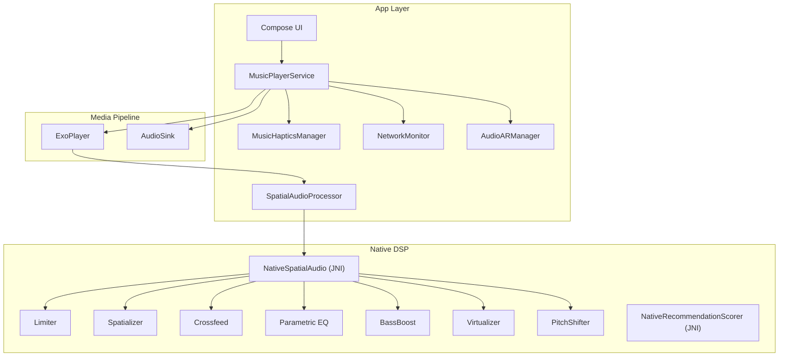
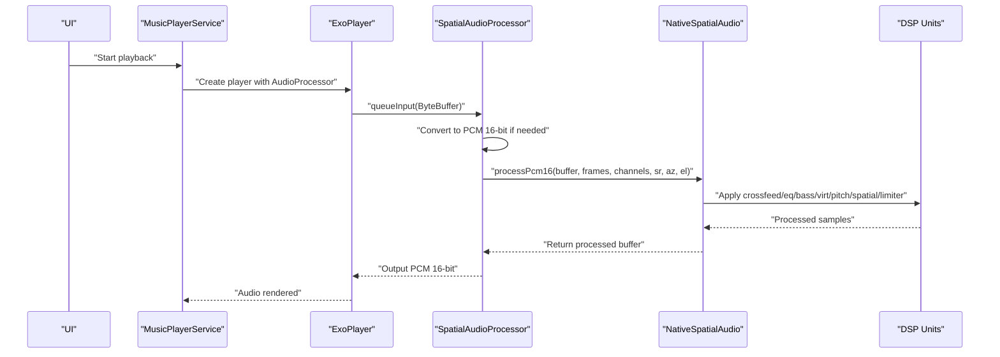
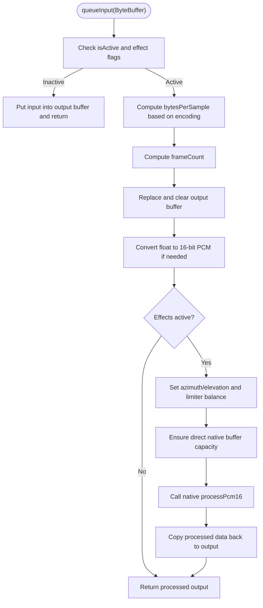
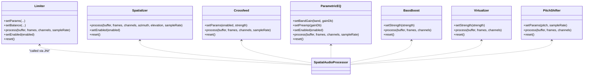
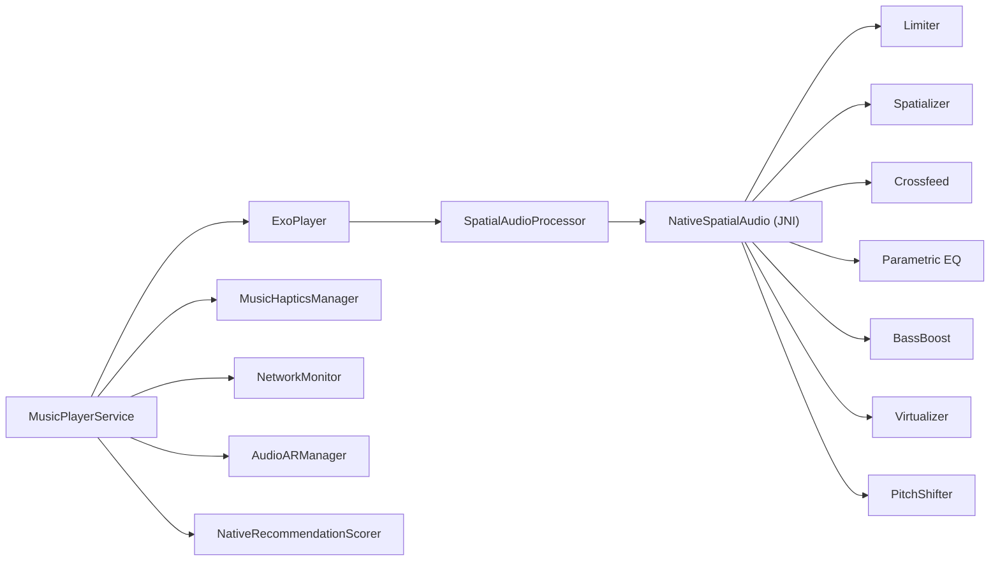

# Performance Optimization

<cite>
**Referenced Files in This Document**
- [MusicHapticsManager.kt](file://app/src/main/java/com/suvojeet/suvmusic/util/MusicHapticsManager.kt)
- [NetworkMonitor.kt](file://app/src/main/java/com/suvojeet/suvmusic/util/NetworkMonitor.kt)
- [SpatialAudioProcessor.kt](file://app/src/main/java/com/suvojeet/suvmusic/player/SpatialAudioProcessor.kt)
- [AudioARManager.kt](file://app/src/main/java/com/suvojeet/suvmusic/player/AudioARManager.kt)
- [MusicPlayerService.kt](file://app/src/main/java/com/suvojeet/suvmusic/service/MusicPlayerService.kt)
- [NativeRecommendationScorer.kt](file://app/src/main/java/com/suvojeet/suvmusic/recommendation/NativeRecommendationScorer.kt)
- [limiter.cpp](file://app/src/main/cpp/limiter.cpp)
- [spatial_audio.cpp](file://app/src/main/cpp/spatial_audio.cpp)
- [biquad.h](file://app/src/main/cpp/biquad.h)
- [pitch_shifter.h](file://app/src/main/cpp/pitch_shifter.h)
- [recommendation_scorer.cpp](file://app/src/main/cpp/recommendation_scorer.cpp)
- [build.gradle.kts](file://app/build.gradle.kts)
- [proguard-rules.pro](file://app/proguard-rules.pro)
</cite>

## Table of Contents
1. [Introduction](#introduction)
2. [Project Structure](#project-structure)
3. [Core Components](#core-components)
4. [Architecture Overview](#architecture-overview)
5. [Detailed Component Analysis](#detailed-component-analysis)
6. [Dependency Analysis](#dependency-analysis)
7. [Performance Considerations](#performance-considerations)
8. [Troubleshooting Guide](#troubleshooting-guide)
9. [Conclusion](#conclusion)
10. [Appendices](#appendices)

## Introduction
This document presents a comprehensive guide to SuvMusic’s performance optimization strategies across memory management, CPU optimization for audio processing, battery efficiency, haptic feedback, network monitoring, and audio processing tuning. It also covers profiling techniques, performance monitoring, bottleneck identification, threading optimization, background task management, resource allocation, measurement tools, benchmarking methodologies, and optimization trade-offs.

## Project Structure
SuvMusic integrates Kotlin/Compose UI with a native audio DSP pipeline built in C++. The audio path leverages Media3 ExoPlayer with a custom AudioProcessor that routes PCM frames through native effects (limiter, spatializer, crossfeed, parametric EQ, bass boost, virtualizer, pitch shifter). Recommendation scoring is accelerated via a native SIMD engine. Background services manage playback, haptics, and network-aware behavior.

**Diagram sources**
- [MusicPlayerService.kt:206-218](file://app/src/main/java/com/suvojeet/suvmusic/service/MusicPlayerService.kt#L206-L218)
- [SpatialAudioProcessor.kt:13-16](file://app/src/main/java/com/suvojeet/suvmusic/player/SpatialAudioProcessor.kt#L13-L16)
- [spatial_audio.cpp:342-393](file://app/src/main/cpp/spatial_audio.cpp#L342-L393)
- [limiter.cpp:25-144](file://app/src/main/cpp/limiter.cpp#L25-L144)
- [MusicHapticsManager.kt:38-42](file://app/src/main/java/com/suvojeet/suvmusic/util/MusicHapticsManager.kt#L38-L42)
- [NetworkMonitor.kt:20-24](file://app/src/main/java/com/suvojeet/suvmusic/util/NetworkMonitor.kt#L20-L24)
- [AudioARManager.kt:29-36](file://app/src/main/java/com/suvojeet/suvmusic/player/AudioARManager.kt#L29-L36)

**Section sources**
- [build.gradle.kts:14-110](file://app/build.gradle.kts#L14-L110)

## Core Components
- Audio DSP Pipeline: Native audio effects applied via JNI inside a custom Media3 AudioProcessor. Includes limiter, spatializer, crossfeed, parametric EQ, bass boost, virtualizer, and pitch shifter.
- SpatialAudioProcessor: Bridges Kotlin and native audio processing, managing buffer conversions and JNI calls.
- MusicPlayerService: Orchestrates ExoPlayer, applies audio effects dynamically, manages audio offload vs. software processing, and coordinates background playback.
- MusicHapticsManager: Implements beat-synchronized haptic feedback with throttling and mode-specific thresholds.
- NetworkMonitor: Reactive network connectivity monitoring using callbacks and distinct flows.
- AudioARManager: Device rotation-based stereo balance for “Audio AR” using sensor events and smoothing.
- NativeRecommendationScorer: SIMD-accelerated scoring engine for recommendations with NEON/SSE fallback.

**Section sources**
- [SpatialAudioProcessor.kt:13-16](file://app/src/main/java/com/suvojeet/suvmusic/player/SpatialAudioProcessor.kt#L13-L16)
- [MusicPlayerService.kt:206-218](file://app/src/main/java/com/suvojeet/suvmusic/service/MusicPlayerService.kt#L206-L218)
- [MusicHapticsManager.kt:38-42](file://app/src/main/java/com/suvojeet/suvmusic/util/MusicHapticsManager.kt#L38-L42)
- [NetworkMonitor.kt:20-24](file://app/src/main/java/com/suvojeet/suvmusic/util/NetworkMonitor.kt#L20-L24)
- [AudioARManager.kt:29-36](file://app/src/main/java/com/suvojeet/suvmusic/player/AudioARManager.kt#L29-L36)
- [NativeRecommendationScorer.kt:20-48](file://app/src/main/java/com/suvojeet/suvmusic/recommendation/NativeRecommendationScorer.kt#L20-L48)

## Architecture Overview
The audio pipeline is designed around minimal copying and efficient JNI boundaries. PCM buffers are prepared in Kotlin, optionally converted to 16-bit PCM, then passed to native for processing. Effects are toggled dynamically based on user settings and device capabilities.

**Diagram sources**
- [MusicPlayerService.kt:206-218](file://app/src/main/java/com/suvojeet/suvmusic/service/MusicPlayerService.kt#L206-L218)
- [SpatialAudioProcessor.kt:173-241](file://app/src/main/java/com/suvojeet/suvmusic/player/SpatialAudioProcessor.kt#L173-L241)
- [spatial_audio.cpp:347-393](file://app/src/main/cpp/spatial_audio.cpp#L347-L393)

## Detailed Component Analysis

### Audio DSP Pipeline and Memory Management
- Buffer lifecycle: The processor replaces output buffers and writes directly into them, minimizing allocations. It uses a direct ByteBuffer for JNI to avoid extra copies.
- Sample conversion: Converts float PCM to 16-bit PCM in-place when necessary, clamping and casting efficiently.
- Native buffer reuse: A cached direct ByteBuffer is reused if capacity suffices, reducing GC pressure.
- Atomic and mutex-protected state: Native DSP units guard internal state with atomic flags and mutexes to ensure thread-safe updates without blocking the audio thread excessively.

**Diagram sources**
- [SpatialAudioProcessor.kt:173-241](file://app/src/main/java/com/suvojeet/suvmusic/player/SpatialAudioProcessor.kt#L173-L241)

**Section sources**
- [SpatialAudioProcessor.kt:173-241](file://app/src/main/java/com/suvojeet/suvmusic/player/SpatialAudioProcessor.kt#L173-L241)
- [spatial_audio.cpp:347-393](file://app/src/main/cpp/spatial_audio.cpp#L347-L393)

### CPU Optimization for Audio Processing
- SIMD acceleration: The recommendation scorer uses NEON/SSE intrinsics to process multiple candidates per loop iteration, dramatically reducing CPU time compared to pure-JVM loops.
- Minimal branching and tight loops: DSP units use fixed-size arrays and bounded channels to avoid heap allocations and reduce branch mispredictions.
- Look-ahead and smoothing: Limiter uses a small lookahead delay and smoothing coefficients to avoid zipper noise with minimal CPU overhead.
- Dynamic offload vs. software processing: The service disables audio offload when software effects are active to guarantee effect application.

**Diagram sources**
- [limiter.cpp:1-163](file://app/src/main/cpp/limiter.cpp#L1-L163)
- [spatial_audio.cpp:16-204](file://app/src/main/cpp/spatial_audio.cpp#L16-L204)
- [biquad.h:17-125](file://app/src/main/cpp/biquad.h#L17-L125)
- [pitch_shifter.h:14-109](file://app/src/main/cpp/pitch_shifter.h#L14-L109)

**Section sources**
- [recommendation_scorer.cpp:196-321](file://app/src/main/cpp/recommendation_scorer.cpp#L196-L321)
- [MusicPlayerService.kt:553-576](file://app/src/main/java/com/suvojeet/suvmusic/service/MusicPlayerService.kt#L553-L576)

### Battery Efficiency Considerations
- Haptic throttling: A minimum interval between haptic triggers prevents motor wear and conserves battery life.
- Sensor-driven AR: Rotation sensor is registered only when playback and AR are enabled, and unregistered otherwise.
- Audio offload: Disabled when software effects are active to ensure effects run; otherwise enabled to reduce CPU usage.
- Network-aware behavior: NetworkMonitor provides reactive connectivity checks to adapt streaming behavior and reduce wasted retries.

**Section sources**
- [MusicHapticsManager.kt:67-68](file://app/src/main/java/com/suvojeet/suvmusic/util/MusicHapticsManager.kt#L67-L68)
- [AudioARManager.kt:87-107](file://app/src/main/java/com/suvojeet/suvmusic/player/AudioARManager.kt#L87-L107)
- [MusicPlayerService.kt:556-575](file://app/src/main/java/com/suvojeet/suvmusic/service/MusicPlayerService.kt#L556-L575)
- [NetworkMonitor.kt:29-76](file://app/src/main/java/com/suvojeet/suvmusic/util/NetworkMonitor.kt#L29-L76)

### Haptic Feedback Optimization
- Beat detection: Uses amplitude delta and configurable thresholds per mode to detect beats.
- Intensity scaling: Maps normalized amplitude to vibration intensity with user-configured multiplier.
- Preview mechanisms: Provides preview patterns and single haptic previews for settings validation without affecting playback.
- Compatibility: Uses modern VibrationEffect APIs on Android O+ and falls back to legacy vibration for older versions.

**Section sources**
- [MusicHapticsManager.kt:126-157](file://app/src/main/java/com/suvojeet/suvmusic/util/MusicHapticsManager.kt#L126-L157)
- [MusicHapticsManager.kt:175-200](file://app/src/main/java/com/suvojeet/suvmusic/util/MusicHapticsManager.kt#L175-L200)
- [MusicHapticsManager.kt:206-256](file://app/src/main/java/com/suvojeet/suvmusic/util/MusicHapticsManager.kt#L206-L256)

### Network Monitoring for Bandwidth Management
- Reactive connectivity: Emits distinct boolean states indicating internet availability and Wi-Fi presence.
- Callback-based registration: Uses ConnectivityManager callbacks to react to network changes promptly.
- Initial state emission: Sends current connectivity state upon subscription to avoid stale UI.

**Section sources**
- [NetworkMonitor.kt:29-76](file://app/src/main/java/com/suvojeet/suvmusic/util/NetworkMonitor.kt#L29-L76)
- [NetworkMonitor.kt:92-96](file://app/src/main/java/com/suvojeet/suvmusic/util/NetworkMonitor.kt#L92-L96)

### Audio Processing Performance Tuning
- Dynamic effect toggling: Effects are enabled/disabled based on user settings and device capability.
- Limiter configuration: Makeup gain and hard limiter parameters are tuned for protection and perceived loudness.
- Spatial vs. crossfeed: Crossfeed is automatically disabled when spatial audio is enabled to avoid double-processing.
- Pitch shifting: Uses dual-delay-line with crossfade to maintain quality without excessive CPU usage.

**Section sources**
- [SpatialAudioProcessor.kt:27-47](file://app/src/main/java/com/suvojeet/suvmusic/player/SpatialAudioProcessor.kt#L27-L47)
- [SpatialAudioProcessor.kt:75-99](file://app/src/main/java/com/suvojeet/suvmusic/player/SpatialAudioProcessor.kt#L75-L99)
- [spatial_audio.cpp:350-393](file://app/src/main/cpp/spatial_audio.cpp#L350-L393)
- [pitch_shifter.h:21-79](file://app/src/main/cpp/pitch_shifter.h#L21-L79)

### Threading Optimization and Background Task Management
- Dedicated dispatcher: Haptics manager uses Dispatchers.Default for CPU-bound tasks.
- Main-thread UI updates: AudioARManager and SpatialAudioProcessor operate on Main dispatcher for UI state updates.
- SupervisorJob: Service scope uses SupervisorJob to isolate coroutines and prevent cascading failures.
- Sensor lifecycle: Registers/unregisters sensors only when needed to avoid unnecessary wake-ups.

**Section sources**
- [MusicHapticsManager.kt:42](file://app/src/main/java/com/suvojeet/suvmusic/util/MusicHapticsManager.kt#L42)
- [AudioARManager.kt:38](file://app/src/main/java/com/suvojeet/suvmusic/player/AudioARManager.kt#L38)
- [MusicPlayerService.kt:128-132](file://app/src/main/java/com/suvojeet/suvmusic/service/MusicPlayerService.kt#L128-L132)

### Resource Allocation Strategies
- ABI filtering: Limits APK to arm64-v8a and armeabi-v7a to reduce size and improve performance.
- Resource configurations: Restricts supported locales to reduce APK size.
- Minification and shrinking: Enables release minification and resource shrinking to reduce binary size.
- ProGuard rules: Keeps necessary libraries and classes required by the app.

**Section sources**
- [build.gradle.kts:27-34](file://app/build.gradle.kts#L27-L34)
- [build.gradle.kts:76-88](file://app/build.gradle.kts#L76-L88)
- [proguard-rules.pro:1-108](file://app/proguard-rules.pro#L1-L108)

## Dependency Analysis
The audio pipeline depends on Media3 for playback and on a custom AudioProcessor that bridges to native DSP. Recommendations rely on a shared native library for SIMD acceleration.

**Diagram sources**
- [MusicPlayerService.kt:206-218](file://app/src/main/java/com/suvojeet/suvmusic/service/MusicPlayerService.kt#L206-L218)
- [SpatialAudioProcessor.kt:13-16](file://app/src/main/java/com/suvojeet/suvmusic/player/SpatialAudioProcessor.kt#L13-L16)
- [spatial_audio.cpp:342-393](file://app/src/main/cpp/spatial_audio.cpp#L342-L393)
- [NativeRecommendationScorer.kt:20-48](file://app/src/main/java/com/suvojeet/suvmusic/recommendation/NativeRecommendationScorer.kt#L20-L48)

**Section sources**
- [MusicPlayerService.kt:206-218](file://app/src/main/java/com/suvojeet/suvmusic/service/MusicPlayerService.kt#L206-L218)
- [SpatialAudioProcessor.kt:13-16](file://app/src/main/java/com/suvojeet/suvmusic/player/SpatialAudioProcessor.kt#L13-L16)
- [NativeRecommendationScorer.kt:20-48](file://app/src/main/java/com/suvojeet/suvmusic/recommendation/NativeRecommendationScorer.kt#L20-L48)

## Performance Considerations
- Prefer SIMD for heavy math: The recommendation scorer demonstrates significant CPU savings via NEON/SSE.
- Keep JNI boundaries minimal: Batch work across a single JNI call to reduce overhead.
- Avoid allocations in hot paths: Reuse buffers and use fixed-size arrays in native code.
- Tune effect parameters carefully: Excessive EQ or limiting can increase CPU usage; balance quality and performance.
- Monitor network conditions: Adjust buffering and retry strategies based on connectivity to reduce wasted bandwidth and CPU.
- Use offload when possible: Disable offload only when software effects are required.

[No sources needed since this section provides general guidance]

## Troubleshooting Guide
- Native processing errors: The processor catches exceptions during native calls and logs them without silencing output, preventing audio dropout.
- Audio focus and device routing: The service adjusts audio attributes and handles focus changes; it includes recovery paths for AudioTrack initialization failures.
- Haptic failures: Exceptions in haptic triggering are caught and ignored to avoid impacting playback.
- Connectivity flapping: NetworkMonitor uses distinctUntilChanged to avoid redundant UI updates.

**Section sources**
- [SpatialAudioProcessor.kt:234-240](file://app/src/main/java/com/suvojeet/suvmusic/player/SpatialAudioProcessor.kt#L234-L240)
- [MusicPlayerService.kt:448-457](file://app/src/main/java/com/suvojeet/suvmusic/service/MusicPlayerService.kt#L448-L457)
- [MusicHapticsManager.kt:170-173](file://app/src/main/java/com/suvojeet/suvmusic/util/MusicHapticsManager.kt#L170-L173)
- [NetworkMonitor.kt:76](file://app/src/main/java/com/suvojeet/suvmusic/util/NetworkMonitor.kt#L76)

## Conclusion
SuvMusic’s performance strategy centers on efficient JNI boundaries, SIMD acceleration, careful buffer management, and dynamic effect gating. The system balances quality and battery life by enabling offload when possible and disabling it when software effects are active. Robust monitoring of network and device state further improves reliability and efficiency.

[No sources needed since this section summarizes without analyzing specific files]

## Appendices

### Profiling Techniques and Tools
- CPU sampling: Use Android Studio CPU Profiler to capture frames during playback and identify hotspots in Kotlin and native code.
- Native tracing: Use systrace or Perfetto to inspect JNI boundary overhead and native thread utilization.
- Memory profiling: Monitor heap growth and allocation hotspots in SpatialAudioProcessor buffer management.
- Network profiling: Observe bandwidth usage and latency with NetworkMonitor flows to tune buffering strategies.

[No sources needed since this section provides general guidance]

### Benchmarking Methodologies
- Recommendation scoring: Measure time per N candidates with and without SIMD to quantify gains.
- Audio processing: Benchmark frames per second under various effect combinations and sample rates.
- Haptics: Measure average latency from amplitude input to haptic trigger with throttling enabled.

[No sources needed since this section provides general guidance]

### Optimization Trade-offs
- SIMD vs. portability: NEON/SSE provide massive gains but require runtime checks; ensure robust fallbacks.
- Offload vs. effects: Hardware offload reduces CPU but bypasses software effects; dynamically toggle based on active effects.
- Sensor usage: Rotation sensor improves UX but increases power consumption; register only when needed.

[No sources needed since this section provides general guidance]