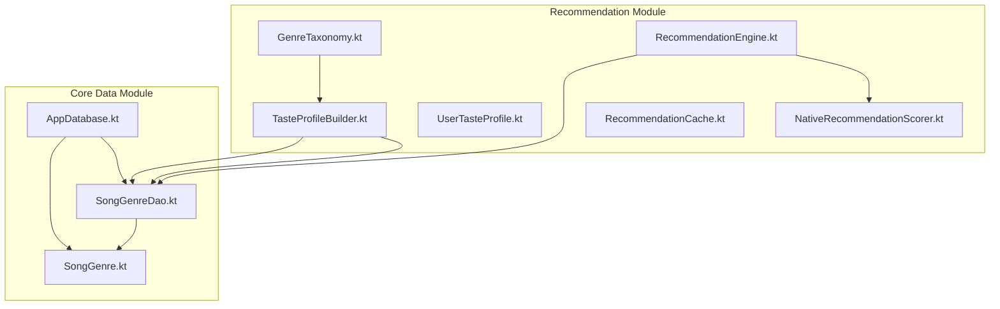
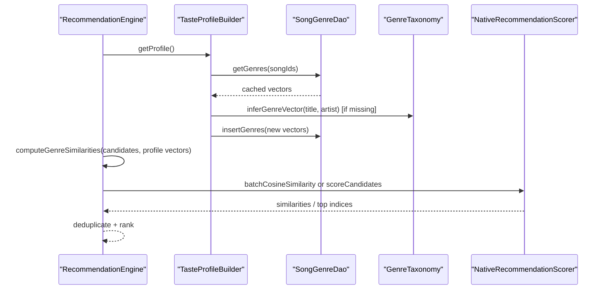
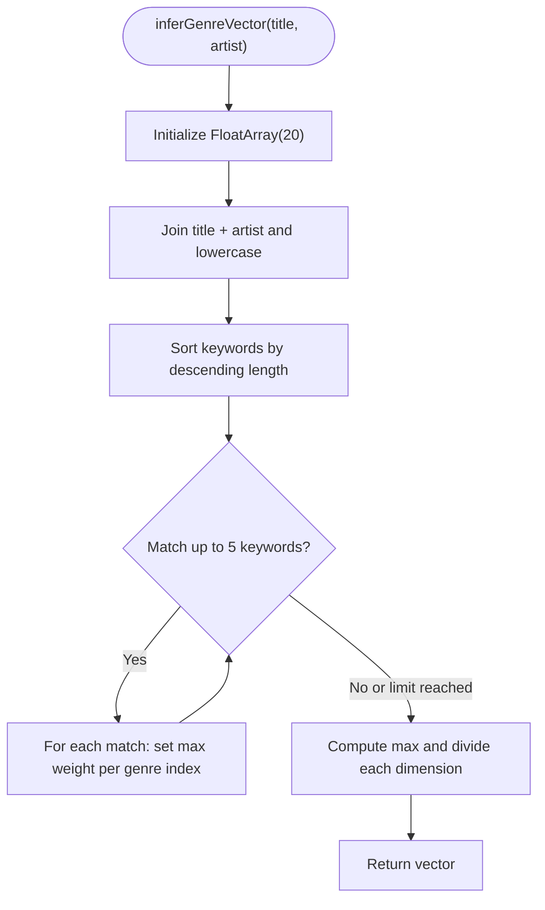
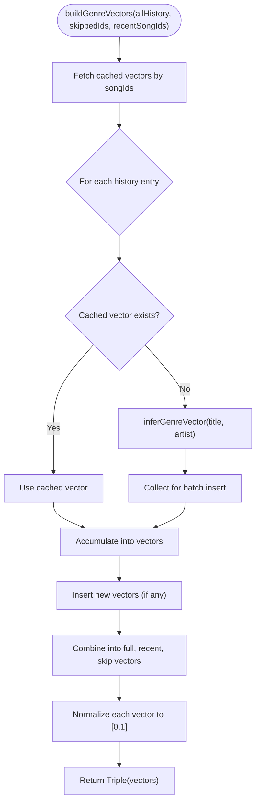
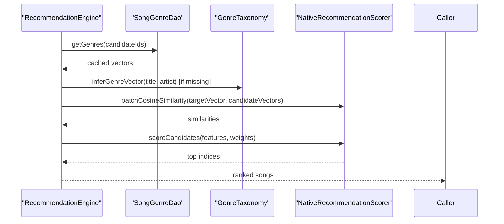
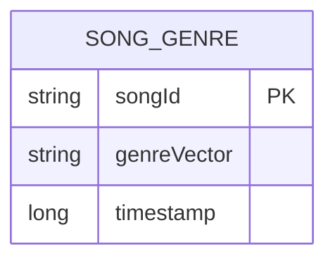
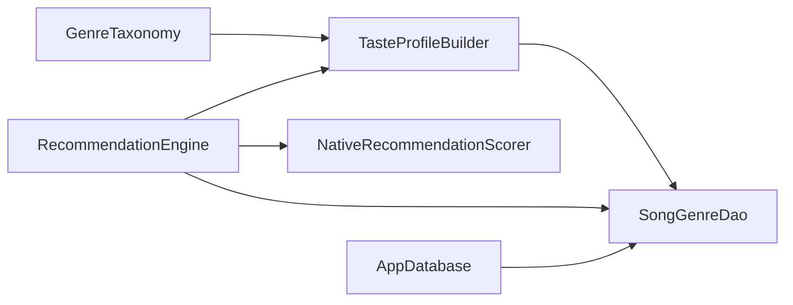

# Genre Taxonomy System

<cite>
**Referenced Files in This Document**
- [GenreTaxonomy.kt](file://app/src/main/java/com/suvojeet/suvmusic/recommendation/GenreTaxonomy.kt)
- [TasteProfileBuilder.kt](file://app/src/main/java/com/suvojeet/suvmusic/recommendation/TasteProfileBuilder.kt)
- [RecommendationEngine.kt](file://app/src/main/java/com/suvojeet/suvmusic/recommendation/RecommendationEngine.kt)
- [UserTasteProfile.kt](file://app/src/main/java/com/suvojeet/suvmusic/recommendation/UserTasteProfile.kt)
- [NativeRecommendationScorer.kt](file://app/src/main/java/com/suvojeet/suvmusic/recommendation/NativeRecommendationScorer.kt)
- [RecommendationCache.kt](file://app/src/main/java/com/suvojeet/suvmusic/recommendation/RecommendationCache.kt)
- [SongGenre.kt](file://core/data/src/main/java/com/suvojeet/suvmusic/core/data/local/entity/SongGenre.kt)
- [SongGenreDao.kt](file://core/data/src/main/java/com/suvojeet/suvmusic/core/data/local/dao/SongGenreDao.kt)
- [AppDatabase.kt](file://core/data/src/main/java/com/suvojeet/suvmusic/core/data/local/AppDatabase.kt)
</cite>

## Table of Contents
1. [Introduction](#introduction)
2. [Project Structure](#project-structure)
3. [Core Components](#core-components)
4. [Architecture Overview](#architecture-overview)
5. [Detailed Component Analysis](#detailed-component-analysis)
6. [Dependency Analysis](#dependency-analysis)
7. [Performance Considerations](#performance-considerations)
8. [Troubleshooting Guide](#troubleshooting-guide)
9. [Conclusion](#conclusion)
10. [Appendices](#appendices)

## Introduction
This document describes the Genre Taxonomy System used by the recommendation engine to classify music by genre, compute genre affinity vectors, and influence recommendation scoring. It explains:
- The hierarchical and flat 20-genre taxonomy used for music categorization
- The keyword-based genre inference algorithm that maps titles and artists to genre vectors
- How genre vectors are cached and reused to avoid repeated computation
- How genre similarity influences scoring and ranking
- Genre discovery mechanisms for new artists and songs
- Database schema and DAOs for efficient genre data access
- Edge cases such as multi-genre ambiguity and normalization strategies

## Project Structure
The Genre Taxonomy System spans several modules:
- Recommendation module: genre taxonomy, profile building, scoring, caching
- Core data module: Room entities and DAOs for genre vectors and listening history
- Native scoring: SIMD-accelerated cosine similarity and scoring

**Diagram sources**
- [GenreTaxonomy.kt:1-252](file://app/src/main/java/com/suvojeet/suvmusic/recommendation/GenreTaxonomy.kt#L1-L252)
- [TasteProfileBuilder.kt:1-338](file://app/src/main/java/com/suvojeet/suvmusic/recommendation/TasteProfileBuilder.kt#L1-L338)
- [RecommendationEngine.kt:1-1277](file://app/src/main/java/com/suvojeet/suvmusic/recommendation/RecommendationEngine.kt#L1-L1277)
- [UserTasteProfile.kt:1-98](file://app/src/main/java/com/suvojeet/suvmusic/recommendation/UserTasteProfile.kt#L1-L98)
- [NativeRecommendationScorer.kt:1-187](file://app/src/main/java/com/suvojeet/suvmusic/recommendation/NativeRecommendationScorer.kt#L1-L187)
- [RecommendationCache.kt:1-111](file://app/src/main/java/com/suvojeet/suvmusic/recommendation/RecommendationCache.kt#L1-L111)
- [SongGenre.kt:1-45](file://core/data/src/main/java/com/suvojeet/suvmusic/core/data/local/entity/SongGenre.kt#L1-L45)
- [SongGenreDao.kt:1-43](file://core/data/src/main/java/com/suvojeet/suvmusic/core/data/local/dao/SongGenreDao.kt#L1-L43)
- [AppDatabase.kt:1-37](file://core/data/src/main/java/com/suvojeet/suvmusic/core/data/local/AppDatabase.kt#L1-L37)

**Section sources**
- [GenreTaxonomy.kt:1-252](file://app/src/main/java/com/suvojeet/suvmusic/recommendation/GenreTaxonomy.kt#L1-L252)
- [SongGenre.kt:1-45](file://core/data/src/main/java/com/suvojeet/suvmusic/core/data/local/entity/SongGenre.kt#L1-L45)
- [SongGenreDao.kt:1-43](file://core/data/src/main/java/com/suvojeet/suvmusic/core/data/local/dao/SongGenreDao.kt#L1-L43)
- [AppDatabase.kt:1-37](file://core/data/src/main/java/com/suvojeet/suvmusic/core/data/local/AppDatabase.kt#L1-L37)

## Core Components
- GenreTaxonomy: Defines the 20-genre taxonomy, keyword-to-genre mapping, and vector inference with normalization
- TasteProfileBuilder: Builds user profiles with three genre vectors (overall, recent, skip) using cached and inferred vectors
- RecommendationEngine: Orchestrates recommendation generation, deduplication, and scoring using genre similarity
- NativeRecommendationScorer: JNI bridge for SIMD-accelerated scoring and cosine similarity
- RecommendationCache: In-memory cache for recommendation results and home sections
- SongGenre entity and DAO: Persist and retrieve genre vectors for songs
- AppDatabase: Declares Room database and exposes DAOs

**Section sources**
- [GenreTaxonomy.kt:10-252](file://app/src/main/java/com/suvojeet/suvmusic/recommendation/GenreTaxonomy.kt#L10-L252)
- [TasteProfileBuilder.kt:27-338](file://app/src/main/java/com/suvojeet/suvmusic/recommendation/TasteProfileBuilder.kt#L27-L338)
- [RecommendationEngine.kt:41-1277](file://app/src/main/java/com/suvojeet/suvmusic/recommendation/RecommendationEngine.kt#L41-L1277)
- [NativeRecommendationScorer.kt:20-187](file://app/src/main/java/com/suvojeet/suvmusic/recommendation/NativeRecommendationScorer.kt#L20-L187)
- [RecommendationCache.kt:14-111](file://app/src/main/java/com/suvojeet/suvmusic/recommendation/RecommendationCache.kt#L14-L111)
- [SongGenre.kt:11-45](file://core/data/src/main/java/com/suvojeet/suvmusic/core/data/local/entity/SongGenre.kt#L11-L45)
- [SongGenreDao.kt:13-43](file://core/data/src/main/java/com/suvojeet/suvmusic/core/data/local/dao/SongGenreDao.kt#L13-L43)
- [AppDatabase.kt:19-37](file://core/data/src/main/java/com/suvojeet/suvmusic/core/data/local/AppDatabase.kt#L19-L37)

## Architecture Overview
The system integrates YouTube Music’s recommendation APIs with a local genre-aware scoring pipeline:
- GenreTaxonomy provides keyword-based inference and normalization
- TasteProfileBuilder constructs genre vectors from listening history and caches them
- RecommendationEngine deduplicates candidates, computes genre similarities, and ranks using native SIMD scoring
- NativeRecommendationScorer performs fast cosine similarity and scoring
- SongGenre DAO persists vectors to Room for reuse

**Diagram sources**
- [RecommendationEngine.kt:902-1100](file://app/src/main/java/com/suvojeet/suvmusic/recommendation/RecommendationEngine.kt#L902-L1100)
- [TasteProfileBuilder.kt:248-336](file://app/src/main/java/com/suvojeet/suvmusic/recommendation/TasteProfileBuilder.kt#L248-L336)
- [SongGenreDao.kt:16-33](file://core/data/src/main/java/com/suvojeet/suvmusic/core/data/local/dao/SongGenreDao.kt#L16-L33)
- [GenreTaxonomy.kt:203-231](file://app/src/main/java/com/suvojeet/suvmusic/recommendation/GenreTaxonomy.kt#L203-L231)
- [NativeRecommendationScorer.kt:131-145](file://app/src/main/java/com/suvojeet/suvmusic/recommendation/NativeRecommendationScorer.kt#L131-L145)

## Detailed Component Analysis

### GenreTaxonomy: Flat 20-Genre Classification and Inference
- Defines 20 ordered genres mapped to integer indices for a 20-dimensional vector
- Maintains a keyword-to-genre mapping with optional secondary genres and weights
- Implements keyword-based inference by scanning title+artist for matches (longer phrases first)
- Normalizes vectors so the maximum dimension is 1.0
- Provides helpers to check non-zero vectors and extract top-N genres

**Diagram sources**
- [GenreTaxonomy.kt:203-231](file://app/src/main/java/com/suvojeet/suvmusic/recommendation/GenreTaxonomy.kt#L203-L231)

**Section sources**
- [GenreTaxonomy.kt:10-36](file://app/src/main/java/com/suvojeet/suvmusic/recommendation/GenreTaxonomy.kt#L10-L36)
- [GenreTaxonomy.kt:45-189](file://app/src/main/java/com/suvojeet/suvmusic/recommendation/GenreTaxonomy.kt#L45-L189)
- [GenreTaxonomy.kt:195-250](file://app/src/main/java/com/suvojeet/suvmusic/recommendation/GenreTaxonomy.kt#L195-L250)

### TasteProfileBuilder: Genre Vector Construction and Caching
- Builds three genre vectors per user:
  - Full genre affinity vector (weighted by play counts)
  - Recent session vector (last 10 songs)
  - Skip genre vector (from frequently skipped songs)
- Uses cached vectors when available; infers missing ones via GenreTaxonomy and persists them
- Applies normalization and ensures values are in [0, 1]

**Diagram sources**
- [TasteProfileBuilder.kt:248-336](file://app/src/main/java/com/suvojeet/suvmusic/recommendation/TasteProfileBuilder.kt#L248-L336)
- [SongGenreDao.kt:20-33](file://core/data/src/main/java/com/suvojeet/suvmusic/core/data/local/dao/SongGenreDao.kt#L20-L33)
- [GenreTaxonomy.kt:203-231](file://app/src/main/java/com/suvojeet/suvmusic/recommendation/GenreTaxonomy.kt#L203-L231)

**Section sources**
- [TasteProfileBuilder.kt:216-237](file://app/src/main/java/com/suvojeet/suvmusic/recommendation/TasteProfileBuilder.kt#L216-L237)
- [TasteProfileBuilder.kt:248-336](file://app/src/main/java/com/suvojeet/suvmusic/recommendation/TasteProfileBuilder.kt#L248-L336)
- [UserTasteProfile.kt:47-67](file://app/src/main/java/com/suvojeet/suvmusic/recommendation/UserTasteProfile.kt#L47-L67)

### RecommendationEngine: Genre-Aware Scoring and Ranking
- Deduplicates candidates using ID and fingerprinting
- Computes genre similarities against:
  - Full genre affinity vector
  - Recent session vector
  - Skip genre vector
- Uses native SIMD scoring when available; falls back to Kotlin implementation
- Integrates genre similarity with other signals (artist affinity, freshness, likes, time-of-day, variety penalty)

**Diagram sources**
- [RecommendationEngine.kt:902-1100](file://app/src/main/java/com/suvojeet/suvmusic/recommendation/RecommendationEngine.kt#L902-L1100)
- [NativeRecommendationScorer.kt:131-145](file://app/src/main/java/com/suvojeet/suvmusic/recommendation/NativeRecommendationScorer.kt#L131-L145)
- [SongGenreDao.kt:20-33](file://core/data/src/main/java/com/suvojeet/suvmusic/core/data/local/dao/SongGenreDao.kt#L20-L33)

**Section sources**
- [RecommendationEngine.kt:859-1036](file://app/src/main/java/com/suvojeet/suvmusic/recommendation/RecommendationEngine.kt#L859-L1036)
- [RecommendationEngine.kt:1042-1100](file://app/src/main/java/com/suvojeet/suvmusic/recommendation/RecommendationEngine.kt#L1042-L1100)

### NativeRecommendationScorer: SIMD Acceleration
- Exposes methods for:
  - Scoring candidates with a SoA feature matrix
  - Computing cosine similarity between two genre vectors
  - Computing batch cosine similarities for many candidates
- Falls back to Kotlin implementations if native loading fails

**Section sources**
- [NativeRecommendationScorer.kt:19-187](file://app/src/main/java/com/suvojeet/suvmusic/recommendation/NativeRecommendationScorer.kt#L19-L187)

### RecommendationCache: In-Memory Caching
- Stores lists of songs and home sections with TTL
- Provides keys for different recommendation categories
- Supports targeted invalidation (e.g., after likes/dislikes or user actions)

**Section sources**
- [RecommendationCache.kt:14-111](file://app/src/main/java/com/suvojeet/suvmusic/recommendation/RecommendationCache.kt#L14-L111)

### Database Schema and DAOs: Genre Vector Persistence
- Entity: SongGenre stores a 20-dimension genre vector as a comma-separated string and a timestamp
- DAO: Provides get/insert for single and bulk operations, count, and clear
- AppDatabase declares Room database with SongGenre among entities

**Diagram sources**
- [SongGenre.kt:11-45](file://core/data/src/main/java/com/suvojeet/suvmusic/core/data/local/entity/SongGenre.kt#L11-L45)
- [SongGenreDao.kt:13-43](file://core/data/src/main/java/com/suvojeet/suvmusic/core/data/local/dao/SongGenreDao.kt#L13-L43)
- [AppDatabase.kt:19-37](file://core/data/src/main/java/com/suvojeet/suvmusic/core/data/local/AppDatabase.kt#L19-L37)

**Section sources**
- [SongGenre.kt:11-45](file://core/data/src/main/java/com/suvojeet/suvmusic/core/data/local/entity/SongGenre.kt#L11-L45)
- [SongGenreDao.kt:13-43](file://core/data/src/main/java/com/suvojeet/suvmusic/core/data/local/dao/SongGenreDao.kt#L13-L43)
- [AppDatabase.kt:19-37](file://core/data/src/main/java/com/suvojeet/suvmusic/core/data/local/AppDatabase.kt#L19-L37)

## Dependency Analysis
- GenreTaxonomy is a pure functional object used by TasteProfileBuilder and RecommendationEngine
- TasteProfileBuilder depends on SongGenreDao and GenreTaxonomy to construct genre vectors
- RecommendationEngine depends on YouTube repositories, TasteProfileBuilder, SongGenreDao, and NativeRecommendationScorer
- NativeRecommendationScorer depends on the native library and provides fallbacks
- AppDatabase exposes SongGenreDao for persistence

**Diagram sources**
- [GenreTaxonomy.kt:1-252](file://app/src/main/java/com/suvojeet/suvmusic/recommendation/GenreTaxonomy.kt#L1-L252)
- [TasteProfileBuilder.kt:1-338](file://app/src/main/java/com/suvojeet/suvmusic/recommendation/TasteProfileBuilder.kt#L1-L338)
- [RecommendationEngine.kt:1-1277](file://app/src/main/java/com/suvojeet/suvmusic/recommendation/RecommendationEngine.kt#L1-L1277)
- [NativeRecommendationScorer.kt:1-187](file://app/src/main/java/com/suvojeet/suvmusic/recommendation/NativeRecommendationScorer.kt#L1-L187)
- [SongGenreDao.kt:1-43](file://core/data/src/main/java/com/suvojeet/suvmusic/core/data/local/dao/SongGenreDao.kt#L1-L43)
- [AppDatabase.kt:1-37](file://core/data/src/main/java/com/suvojeet/suvmusic/core/data/local/AppDatabase.kt#L1-L37)

**Section sources**
- [RecommendationEngine.kt:41-49](file://app/src/main/java/com/suvojeet/suvmusic/recommendation/RecommendationEngine.kt#L41-L49)
- [TasteProfileBuilder.kt:27-31](file://app/src/main/java/com/suvojeet/suvmusic/recommendation/TasteProfileBuilder.kt#L27-L31)
- [SongGenreDao.kt:13-43](file://core/data/src/main/java/com/suvojeet/suvmusic/core/data/local/dao/SongGenreDao.kt#L13-L43)
- [AppDatabase.kt:19-37](file://core/data/src/main/java/com/suvojeet/suvmusic/core/data/local/AppDatabase.kt#L19-L37)

## Performance Considerations
- Keyword inference is bounded by top-5 matches and sorts keywords by length to maximize recall efficiently
- Genre vectors are cached in Room to avoid repeated inference
- Native SIMD acceleration:
  - Batch cosine similarity computes similarities for all candidates in one call
  - Scoring uses a SoA layout to minimize marshalling overhead
- Deduplication uses in-memory sets and fingerprinting to avoid redundant processing
- RecommendationCache reduces network usage with TTL-based entries

[No sources needed since this section provides general guidance]

## Troubleshooting Guide
Common issues and mitigations:
- Missing genre vectors for new songs:
  - Ensure inference occurs and new vectors are inserted via SongGenreDao
  - Verify GenreTaxonomy.isNonZero before computing similarities
- Low genre similarity scores:
  - Confirm vectors are normalized and non-zero
  - Check that keyword mapping covers the song’s metadata
- Performance regressions:
  - Verify native library availability; fallback to Kotlin scoring is automatic
  - Ensure batch operations are used for similarities and scoring
- Cache misses:
  - Use RecommendationCache keys consistently
  - Invalidate caches after significant user actions (likes, dislikes, logins)

**Section sources**
- [RecommendationEngine.kt:902-1100](file://app/src/main/java/com/suvojeet/suvmusic/recommendation/RecommendationEngine.kt#L902-L1100)
- [NativeRecommendationScorer.kt:35-48](file://app/src/main/java/com/suvojeet/suvmusic/recommendation/NativeRecommendationScorer.kt#L35-L48)
- [RecommendationCache.kt:86-111](file://app/src/main/java/com/suvojeet/suvmusic/recommendation/RecommendationCache.kt#L86-L111)

## Conclusion
The Genre Taxonomy System combines a curated 20-genre classification with keyword-based inference and persistent caching to power accurate, efficient genre-aware recommendations. By leveraging native SIMD acceleration and a robust scoring pipeline, the system balances personalization with performance and scalability.

[No sources needed since this section summarizes without analyzing specific files]

## Appendices

### Genre Mapping and Normalization Details
- Keyword-to-genre mapping supports primary and optional secondary genres with weights
- Vectors are normalized so the maximum dimension equals 1.0
- Top-N extraction filters zero-weight dimensions and sorts by descending weight

**Section sources**
- [GenreTaxonomy.kt:45-189](file://app/src/main/java/com/suvojeet/suvmusic/recommendation/GenreTaxonomy.kt#L45-L189)
- [GenreTaxonomy.kt:222-231](file://app/src/main/java/com/suvojeet/suvmusic/recommendation/GenreTaxonomy.kt#L222-L231)
- [GenreTaxonomy.kt:244-250](file://app/src/main/java/com/suvojeet/suvmusic/recommendation/GenreTaxonomy.kt#L244-L250)

### Genre Discovery and Multi-Genre Handling
- Discovery queries leverage top genres and artists to generate themed sections
- Multi-genre handling:
  - Keyword mapping allows secondary genres with reduced weights
  - Vector normalization ensures a single dominant genre while retaining secondary signals

**Section sources**
- [RecommendationEngine.kt:138-179](file://app/src/main/java/com/suvojeet/suvmusic/recommendation/RecommendationEngine.kt#L138-L179)
- [GenreTaxonomy.kt:45-189](file://app/src/main/java/com/suvojeet/suvmusic/recommendation/GenreTaxonomy.kt#L45-L189)

### Examples of Genre-Based Recommendation Queries
- “Because you like [genre]” sections generated from top genres in the user’s profile
- “[Time-of-day] [Mood] music” queries for context-aware recommendations
- “[Artist] mix” and “[Genre] deep cuts” for artist and genre exploration

**Section sources**
- [RecommendationEngine.kt:138-179](file://app/src/main/java/com/suvojeet/suvmusic/recommendation/RecommendationEngine.kt#L138-L179)
- [RecommendationEngine.kt:185-243](file://app/src/main/java/com/suvojeet/suvmusic/recommendation/RecommendationEngine.kt#L185-L243)
- [RecommendationEngine.kt:748-776](file://app/src/main/java/com/suvojeet/suvmusic/recommendation/RecommendationEngine.kt#L748-L776)