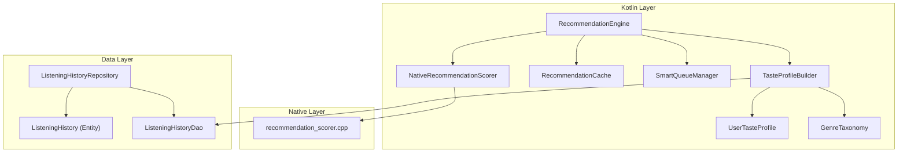
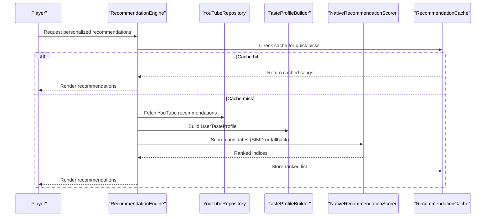
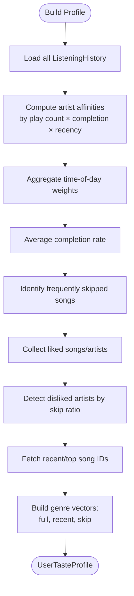
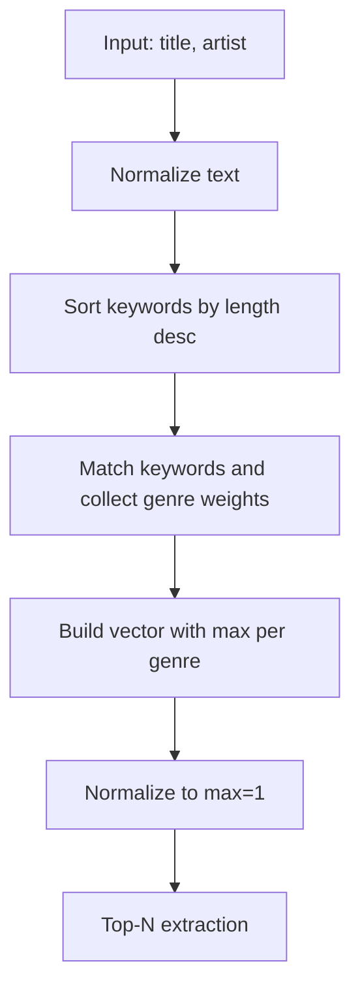
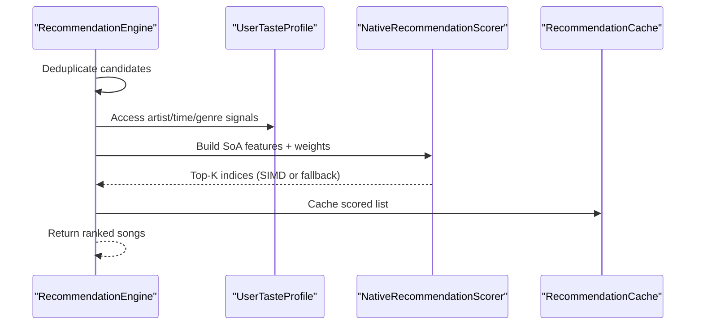
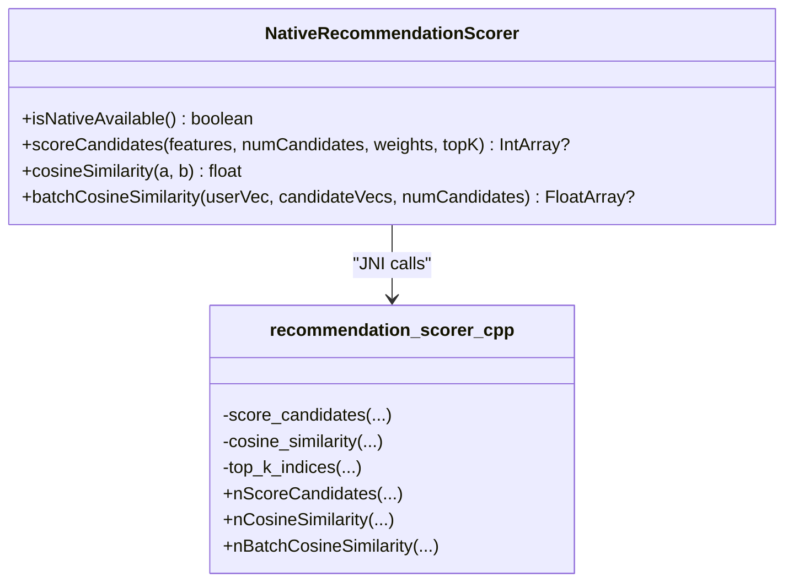
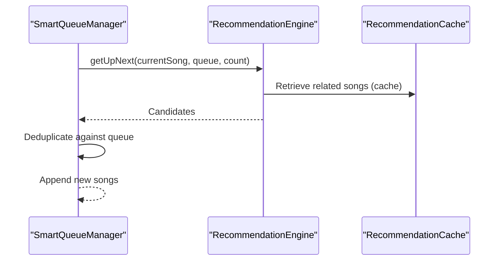
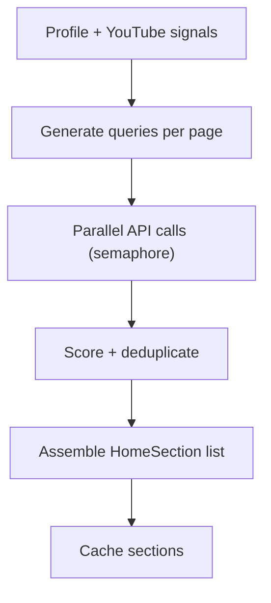
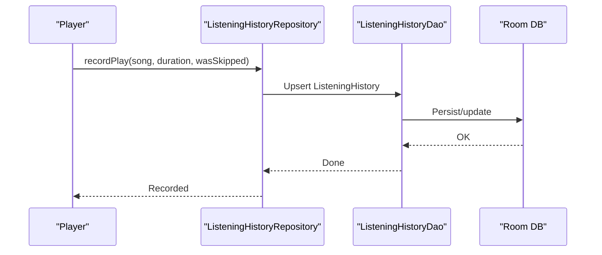
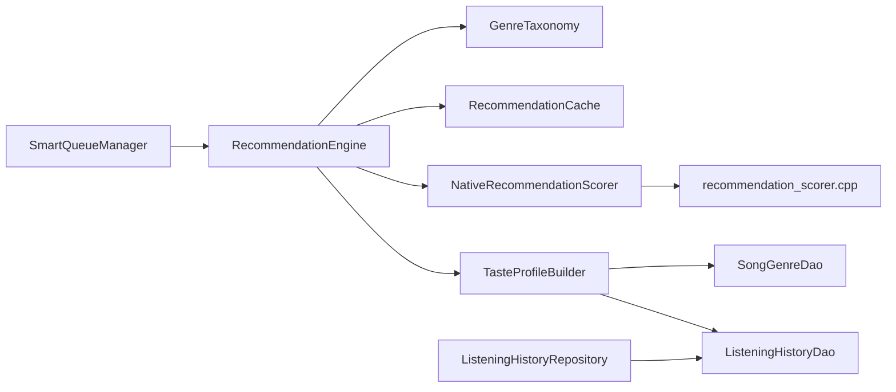

# Personalization and Recommendations

<cite>
**Referenced Files in This Document**
- [RecommendationEngine.kt](file://app/src/main/java/com/suvojeet/suvmusic/recommendation/RecommendationEngine.kt)
- [TasteProfileBuilder.kt](file://app/src/main/java/com/suvojeet/suvmusic/recommendation/TasteProfileBuilder.kt)
- [UserTasteProfile.kt](file://app/src/main/java/com/suvojeet/suvmusic/recommendation/UserTasteProfile.kt)
- [SmartQueueManager.kt](file://app/src/main/java/com/suvojeet/suvmusic/recommendation/SmartQueueManager.kt)
- [NativeRecommendationScorer.kt](file://app/src/main/java/com/suvojeet/suvmusic/recommendation/NativeRecommendationScorer.kt)
- [GenreTaxonomy.kt](file://app/src/main/java/com/suvojeet/suvmusic/recommendation/GenreTaxonomy.kt)
- [RecommendationCache.kt](file://app/src/main/java/com/suvojeet/suvmusic/recommendation/RecommendationCache.kt)
- [recommendation_scorer.cpp](file://app/src/main/cpp/recommendation_scorer.cpp)
- [ListeningHistory.kt](file://core/data/src/main/java/com/suvojeet/suvmusic/core/data/local/entity/ListeningHistory.kt)
- [ListeningHistoryDao.kt](file://core/data/src/main/java/com/suvojeet/suvmusic/core/data/local/dao/ListeningHistoryDao.kt)
- [ListeningHistoryRepository.kt](file://app/src/main/java/com/suvojeet/suvmusic/data/repository/ListeningHistoryRepository.kt)
- [SessionManager.kt](file://app/src/main/java/com/suvojeet/suvmusic/data/SessionManager.kt)
</cite>

## Table of Contents
1. [Introduction](#introduction)
2. [Project Structure](#project-structure)
3. [Core Components](#core-components)
4. [Architecture Overview](#architecture-overview)
5. [Detailed Component Analysis](#detailed-component-analysis)
6. [Dependency Analysis](#dependency-analysis)
7. [Performance Considerations](#performance-considerations)
8. [Troubleshooting Guide](#troubleshooting-guide)
9. [Conclusion](#conclusion)
10. [Appendices](#appendices)

## Introduction
This document explains SuvMusic’s personalization and recommendation system. It covers how user taste profiles are built from listening history, how genre taxonomy drives scoring, how smart queues generate dynamic playlists, and how the native recommendation scorer accelerates ranking. It also documents user interaction tracking, preference learning, recommendation freshness, machine learning integration points, data privacy controls, and quality metrics. Finally, it addresses cold start and personalization bias mitigation strategies.

## Project Structure
The recommendation system spans Kotlin and C++ layers:
- Kotlin modules define the recommendation engine, profile builder, genre taxonomy, caching, and queue management.
- A native C++ module provides SIMD-accelerated scoring and similarity computations.
- Data persistence and retrieval are handled by Room entities, DAOs, and repositories.
- Privacy and session settings are managed centrally.

**Diagram sources**
- [RecommendationEngine.kt:41-49](file://app/src/main/java/com/suvojeet/suvmusic/recommendation/RecommendationEngine.kt#L41-L49)
- [TasteProfileBuilder.kt:27-31](file://app/src/main/java/com/suvojeet/suvmusic/recommendation/TasteProfileBuilder.kt#L27-L31)
- [UserTasteProfile.kt:7-67](file://app/src/main/java/com/suvojeet/suvmusic/recommendation/UserTasteProfile.kt#L7-L67)
- [GenreTaxonomy.kt:10-36](file://app/src/main/java/com/suvojeet/suvmusic/recommendation/GenreTaxonomy.kt#L10-L36)
- [RecommendationCache.kt:14-48](file://app/src/main/java/com/suvojeet/suvmusic/recommendation/RecommendationCache.kt#L14-L48)
- [SmartQueueManager.kt:23-25](file://app/src/main/java/com/suvojeet/suvmusic/recommendation/SmartQueueManager.kt#L23-L25)
- [NativeRecommendationScorer.kt:20-33](file://app/src/main/java/com/suvojeet/suvmusic/recommendation/NativeRecommendationScorer.kt#L20-L33)
- [recommendation_scorer.cpp:27-49](file://app/src/main/cpp/recommendation_scorer.cpp#L27-L49)
- [ListeningHistory.kt:11-39](file://core/data/src/main/java/com/suvojeet/suvmusic/core/data/local/entity/ListeningHistory.kt#L11-L39)
- [ListeningHistoryDao.kt:11-90](file://core/data/src/main/java/com/suvojeet/suvmusic/core/data/local/dao/ListeningHistoryDao.kt#L11-L90)
- [ListeningHistoryRepository.kt:15-17](file://app/src/main/java/com/suvojeet/suvmusic/data/repository/ListeningHistoryRepository.kt#L15-L17)

**Section sources**
- [RecommendationEngine.kt:31-54](file://app/src/main/java/com/suvojeet/suvmusic/recommendation/RecommendationEngine.kt#L31-L54)
- [TasteProfileBuilder.kt:26-58](file://app/src/main/java/com/suvojeet/suvmusic/recommendation/TasteProfileBuilder.kt#L26-L58)
- [GenreTaxonomy.kt:10-36](file://app/src/main/java/com/suvojeet/suvmusic/recommendation/GenreTaxonomy.kt#L10-L36)
- [RecommendationCache.kt:14-48](file://app/src/main/java/com/suvojeet/suvmusic/recommendation/RecommendationCache.kt#L14-L48)
- [SmartQueueManager.kt:22-37](file://app/src/main/java/com/suvojeet/suvmusic/recommendation/SmartQueueManager.kt#L22-L37)
- [NativeRecommendationScorer.kt:19-33](file://app/src/main/java/com/suvojeet/suvmusic/recommendation/NativeRecommendationScorer.kt#L19-L33)
- [recommendation_scorer.cpp:27-49](file://app/src/main/cpp/recommendation_scorer.cpp#L27-L49)
- [ListeningHistory.kt:11-39](file://core/data/src/main/java/com/suvojeet/suvmusic/core/data/local/entity/ListeningHistory.kt#L11-L39)
- [ListeningHistoryDao.kt:11-90](file://core/data/src/main/java/com/suvojeet/suvmusic/core/data/local/dao/ListeningHistoryDao.kt#L11-L90)
- [ListeningHistoryRepository.kt:15-17](file://app/src/main/java/com/suvojeet/suvmusic/data/repository/ListeningHistoryRepository.kt#L15-L17)

## Core Components
- RecommendationEngine: Orchestrates YouTube Music integration, builds home sections, generates personalized recommendations, and manages “up next” and radio-style suggestions.
- TasteProfileBuilder: Aggregates listening history into a compact UserTasteProfile with artist affinities, time-of-day weights, completion rates, source distribution, and genre vectors.
- UserTasteProfile: Immutable data class representing the user’s musical tastes and genre signals.
- GenreTaxonomy: Fixed 20-genre taxonomy with keyword-based inference and top-N extraction.
- NativeRecommendationScorer: JNI bridge to a SIMD-accelerated scoring engine with cosine similarity support.
- RecommendationCache: TTL-based in-memory cache for recommendation results and home sections.
- SmartQueueManager: Proactively refills the playback queue using RecommendationEngine and seed-based strategies.

**Section sources**
- [RecommendationEngine.kt:41-49](file://app/src/main/java/com/suvojeet/suvmusic/recommendation/RecommendationEngine.kt#L41-L49)
- [TasteProfileBuilder.kt:27-33](file://app/src/main/java/com/suvojeet/suvmusic/recommendation/TasteProfileBuilder.kt#L27-L33)
- [UserTasteProfile.kt:7-67](file://app/src/main/java/com/suvojeet/suvmusic/recommendation/UserTasteProfile.kt#L7-L67)
- [GenreTaxonomy.kt:10-36](file://app/src/main/java/com/suvojeet/suvmusic/recommendation/GenreTaxonomy.kt#L10-L36)
- [NativeRecommendationScorer.kt:20-33](file://app/src/main/java/com/suvojeet/suvmusic/recommendation/NativeRecommendationScorer.kt#L20-L33)
- [RecommendationCache.kt:14-48](file://app/src/main/java/com/suvojeet/suvmusic/recommendation/RecommendationCache.kt#L14-L48)
- [SmartQueueManager.kt:23-25](file://app/src/main/java/com/suvojeet/suvmusic/recommendation/SmartQueueManager.kt#L23-L25)

## Architecture Overview
The system integrates YouTube Music APIs for primary recommendations and enriches them with local user signals. The pipeline:
- Collect user interactions via ListeningHistoryRepository and persist via Room.
- Periodically rebuild UserTasteProfile from ListeningHistoryDao.
- Score candidates using NativeRecommendationScorer (SIMD) or Kotlin fallback.
- Cache results and serve home sections, “up next,” and radio suggestions.
- Maintain queue freshness with SmartQueueManager.

**Diagram sources**
- [RecommendationEngine.kt:509-581](file://app/src/main/java/com/suvojeet/suvmusic/recommendation/RecommendationEngine.kt#L509-L581)
- [NativeRecommendationScorer.kt:81-104](file://app/src/main/java/com/suvojeet/suvmusic/recommendation/NativeRecommendationScorer.kt#L81-L104)
- [RecommendationCache.kt:52-63](file://app/src/main/java/com/suvojeet/suvmusic/recommendation/RecommendationCache.kt#L52-L63)

## Detailed Component Analysis

### User Taste Profile Building
TasteProfileBuilder aggregates listening history into:
- Artist affinities: weighted by play count, completion rate, and recency decay.
- Time-of-day weights: derived from last-played hours.
- Completion rate: average percentage of a song listened.
- Frequently skipped songs and disliked artists (via thresholds).
- Liked songs/artists sets.
- Recent/top song IDs.
- Source distribution (YOUTUBE/JIOSAAVN/LOCAL).
- Genre vectors:
  - Full affinity vector (weighted by play counts).
  - Recent session vector (last N plays).
  - Skip genre vector (penalizing genres frequently skipped).
- TTL-based caching with controlled invalidation on play events.

**Diagram sources**
- [TasteProfileBuilder.kt:113-237](file://app/src/main/java/com/suvojeet/suvmusic/recommendation/TasteProfileBuilder.kt#L113-L237)
- [ListeningHistoryDao.kt:28-41](file://core/data/src/main/java/com/suvojeet/suvmusic/core/data/local/dao/ListeningHistoryDao.kt#L28-L41)

**Section sources**
- [TasteProfileBuilder.kt:63-111](file://app/src/main/java/com/suvojeet/suvmusic/recommendation/TasteProfileBuilder.kt#L63-L111)
- [TasteProfileBuilder.kt:113-237](file://app/src/main/java/com/suvojeet/suvmusic/recommendation/TasteProfileBuilder.kt#L113-L237)
- [UserTasteProfile.kt:7-67](file://app/src/main/java/com/suvojeet/suvmusic/recommendation/UserTasteProfile.kt#L7-L67)
- [ListeningHistory.kt:11-39](file://core/data/src/main/java/com/suvojeet/suvmusic/core/data/local/entity/ListeningHistory.kt#L11-L39)
- [ListeningHistoryDao.kt:28-41](file://core/data/src/main/java/com/suvojeet/suvmusic/core/data/local/dao/ListeningHistoryDao.kt#L28-L41)

### Genre Taxonomy and Inference
GenreTaxonomy defines a fixed 20-genre vocabulary and a keyword-to-genre mapping. Inference:
- Tokenizes title/artist text and matches keywords (longer first).
- Accumulates genre weights per match (with optional secondary genres).
- Normalizes to unit maximum.
- Provides top-N extraction and non-zero checks.

**Diagram sources**
- [GenreTaxonomy.kt:203-231](file://app/src/main/java/com/suvojeet/suvmusic/recommendation/GenreTaxonomy.kt#L203-L231)
- [GenreTaxonomy.kt:244-250](file://app/src/main/java/com/suvojeet/suvmusic/recommendation/GenreTaxonomy.kt#L244-L250)

**Section sources**
- [GenreTaxonomy.kt:10-36](file://app/src/main/java/com/suvojeet/suvmusic/recommendation/GenreTaxonomy.kt#L10-L36)
- [GenreTaxonomy.kt:195-250](file://app/src/main/java/com/suvojeet/suvmusic/recommendation/GenreTaxonomy.kt#L195-L250)

### Recommendation Scoring and Ranking
RecommendationEngine orchestrates:
- Deduplication and filtering (by ID, fingerprint, dislikes).
- Hybrid scoring combining YouTube signals and local profile.
- Genre similarity and session genre similarity.
- Freshness, skip avoidance, variety penalty, and time-of-day weighting.

**Diagram sources**
- [RecommendationEngine.kt:857-982](file://app/src/main/java/com/suvojeet/suvmusic/recommendation/RecommendationEngine.kt#L857-L982)
- [NativeRecommendationScorer.kt:81-104](file://app/src/main/java/com/suvojeet/suvmusic/recommendation/NativeRecommendationScorer.kt#L81-L104)
- [RecommendationCache.kt:52-63](file://app/src/main/java/com/suvojeet/suvmusic/recommendation/RecommendationCache.kt#L52-L63)

**Section sources**
- [RecommendationEngine.kt:857-982](file://app/src/main/java/com/suvojeet/suvmusic/recommendation/RecommendationEngine.kt#L857-L982)
- [NativeRecommendationScorer.kt:81-104](file://app/src/main/java/com/suvojeet/suvmusic/recommendation/NativeRecommendationScorer.kt#L81-L104)

### Native Recommendation Scorer (SIMD)
The native engine:
- Exposes JNI methods for scoring N candidates in a single call.
- Computes weighted sums over 11 features (artist affinity, freshness, skip flag, liked song/artist, time-of-day, variety penalty, genre similarity, recent genre similarity, skip genre penalty).
- Provides cosine similarity and batch similarity utilities.
- Falls back to Kotlin when native is unavailable.

**Diagram sources**
- [NativeRecommendationScorer.kt:20-48](file://app/src/main/java/com/suvojeet/suvmusic/recommendation/NativeRecommendationScorer.kt#L20-L48)
- [recommendation_scorer.cpp:166-322](file://app/src/main/cpp/recommendation_scorer.cpp#L166-L322)
- [recommendation_scorer.cpp:435-500](file://app/src/main/cpp/recommendation_scorer.cpp#L435-L500)

**Section sources**
- [NativeRecommendationScorer.kt:19-48](file://app/src/main/java/com/suvojeet/suvmusic/recommendation/NativeRecommendationScorer.kt#L19-L48)
- [recommendation_scorer.cpp:166-322](file://app/src/main/cpp/recommendation_scorer.cpp#L166-L322)
- [recommendation_scorer.cpp:435-500](file://app/src/main/cpp/recommendation_scorer.cpp#L435-L500)

### Smart Queue Management
SmartQueueManager:
- Ensures queue health by pre-fetching “up next” songs.
- Uses multi-seed strategies (current song, recent plays, profile).
- Integrates with RecommendationEngine.getUpNext and getMoreForRadio.
- Tracks last seed and retries with alternative seeds if needed.

**Diagram sources**
- [SmartQueueManager.kt:54-105](file://app/src/main/java/com/suvojeet/suvmusic/recommendation/SmartQueueManager.kt#L54-L105)
- [RecommendationEngine.kt:590-645](file://app/src/main/java/com/suvojeet/suvmusic/recommendation/RecommendationEngine.kt#L590-L645)

**Section sources**
- [SmartQueueManager.kt:22-37](file://app/src/main/java/com/suvojeet/suvmusic/recommendation/SmartQueueManager.kt#L22-L37)
- [SmartQueueManager.kt:54-105](file://app/src/main/java/com/suvojeet/suvmusic/recommendation/SmartQueueManager.kt#L54-L105)
- [RecommendationEngine.kt:590-645](file://app/src/main/java/com/suvojeet/suvmusic/recommendation/RecommendationEngine.kt#L590-L645)

### Home Sections and Discovery
RecommendationEngine generates:
- Genre-based sections (“Because you like X”).
- Context-aware sections (time-of-day, weekend/weekday).
- Scroll-to-load pages with tailored queries.
- Personalized home sections prioritizing quick picks, time-based greetings, recent-based, artist mixes, discovery, and forgotten favorites.

**Diagram sources**
- [RecommendationEngine.kt:138-179](file://app/src/main/java/com/suvojeet/suvmusic/recommendation/RecommendationEngine.kt#L138-L179)
- [RecommendationEngine.kt:185-243](file://app/src/main/java/com/suvojeet/suvmusic/recommendation/RecommendationEngine.kt#L185-L243)
- [RecommendationEngine.kt:286-423](file://app/src/main/java/com/suvojeet/suvmusic/recommendation/RecommendationEngine.kt#L286-L423)
- [RecommendationEngine.kt:428-500](file://app/src/main/java/com/suvojeet/suvmusic/recommendation/RecommendationEngine.kt#L428-L500)

**Section sources**
- [RecommendationEngine.kt:138-179](file://app/src/main/java/com/suvojeet/suvmusic/recommendation/RecommendationEngine.kt#L138-L179)
- [RecommendationEngine.kt:185-243](file://app/src/main/java/com/suvojeet/suvmusic/recommendation/RecommendationEngine.kt#L185-L243)
- [RecommendationEngine.kt:286-423](file://app/src/main/java/com/suvojeet/suvmusic/recommendation/RecommendationEngine.kt#L286-L423)
- [RecommendationEngine.kt:428-500](file://app/src/main/java/com/suvojeet/suvmusic/recommendation/RecommendationEngine.kt#L428-L500)

### User Interaction Tracking and Preference Learning
ListeningHistoryRepository:
- Records play events, updates play counts, durations, last played, skip counts, and completion rates.
- Marks liked/unliked songs.
- Respects privacy mode to skip recording when enabled.

**Diagram sources**
- [ListeningHistoryRepository.kt:24-95](file://app/src/main/java/com/suvojeet/suvmusic/data/repository/ListeningHistoryRepository.kt#L24-L95)
- [ListeningHistory.kt:11-39](file://core/data/src/main/java/com/suvojeet/suvmusic/core/data/local/entity/ListeningHistory.kt#L11-L39)
- [ListeningHistoryDao.kt:16-17](file://core/data/src/main/java/com/suvojeet/suvmusic/core/data/local/dao/ListeningHistoryDao.kt#L16-L17)

**Section sources**
- [ListeningHistoryRepository.kt:24-95](file://app/src/main/java/com/suvojeet/suvmusic/data/repository/ListeningHistoryRepository.kt#L24-L95)
- [ListeningHistory.kt:11-39](file://core/data/src/main/java/com/suvojeet/suvmusic/core/data/local/entity/ListeningHistory.kt#L11-L39)
- [ListeningHistoryDao.kt:16-17](file://core/data/src/main/java/com/suvojeet/suvmusic/core/data/local/dao/ListeningHistoryDao.kt#L16-L17)
- [SessionManager.kt](file://app/src/main/java/com/suvojeet/suvmusic/data/SessionManager.kt#L180)

### Recommendation Freshness and Caching
RecommendationCache:
- TTL-based caching for song lists and home sections.
- Short TTL for volatile data (e.g., “up next”).
- Invalidation hooks on login/logout and after listens.

RecommendationEngine:
- Uses semaphore to limit parallel YouTube API calls.
- Deduplicates aggressively to avoid repeats.
- Refreshes profile periodically and on significant events.

**Section sources**
- [RecommendationCache.kt:14-48](file://app/src/main/java/com/suvojeet/suvmusic/recommendation/RecommendationCache.kt#L14-L48)
- [RecommendationEngine.kt:50-63](file://app/src/main/java/com/suvojeet/suvmusic/recommendation/RecommendationEngine.kt#L50-L63)
- [RecommendationEngine.kt:87-87](file://app/src/main/java/com/suvojeet/suvmusic/recommendation/RecommendationEngine.kt#L87-L87)

### Machine Learning Integration and Bias Mitigation
- Genre inference is keyword-based and deterministic; no online ML training occurs in the app.
- Collaborative filtering is not implemented; the system relies on:
  - Local user signals (artist affinities, genre vectors, time-of-day).
  - YouTube Music’s official personalized signals.
- Bias mitigation:
  - Skip avoidance and skip genre penalties.
  - Variety penalty to avoid repetitive artists.
  - Disliked artists and songs are excluded or heavily penalized.
  - Cold start: fallbacks to trending and related seeds when insufficient data exists.

**Section sources**
- [RecommendationEngine.kt:518-574](file://app/src/main/java/com/suvojeet/suvmusic/recommendation/RecommendationEngine.kt#L518-L574)
- [RecommendationEngine.kt:648-701](file://app/src/main/java/com/suvojeet/suvmusic/recommendation/RecommendationEngine.kt#L648-L701)
- [TasteProfileBuilder.kt:173-191](file://app/src/main/java/com/suvojeet/suvmusic/recommendation/TasteProfileBuilder.kt#L173-L191)

### Data Privacy Considerations
- Privacy mode disables recording of play events.
- Encrypted SharedPreferences are used for sensitive settings.
- No personal identifiers are stored with recommendations.

**Section sources**
- [ListeningHistoryRepository.kt](file://app/src/main/java/com/suvojeet/suvmusic/data/repository/ListeningHistoryRepository.kt#L29)
- [SessionManager.kt:67-71](file://app/src/main/java/com/suvojeet/suvmusic/data/SessionManager.kt#L67-L71)

### Recommendation Quality Metrics
The system does not expose explicit metrics in code. However, the scoring pipeline and caching enable:
- Consistent freshness via TTL and invalidation.
- Deduplication and diversity via variety penalty and skip signals.
- Genre alignment via cosine similarity features.

**Section sources**
- [RecommendationCache.kt:17-21](file://app/src/main/java/com/suvojeet/suvmusic/recommendation/RecommendationCache.kt#L17-L21)
- [RecommendationEngine.kt:956-982](file://app/src/main/java/com/suvojeet/suvmusic/recommendation/RecommendationEngine.kt#L956-L982)

## Dependency Analysis

**Diagram sources**
- [RecommendationEngine.kt:41-49](file://app/src/main/java/com/suvojeet/suvmusic/recommendation/RecommendationEngine.kt#L41-L49)
- [TasteProfileBuilder.kt:27-31](file://app/src/main/java/com/suvojeet/suvmusic/recommendation/TasteProfileBuilder.kt#L27-L31)
- [NativeRecommendationScorer.kt:20-33](file://app/src/main/java/com/suvojeet/suvmusic/recommendation/NativeRecommendationScorer.kt#L20-L33)
- [RecommendationCache.kt:14-48](file://app/src/main/java/com/suvojeet/suvmusic/recommendation/RecommendationCache.kt#L14-L48)
- [SmartQueueManager.kt:23-25](file://app/src/main/java/com/suvojeet/suvmusic/recommendation/SmartQueueManager.kt#L23-L25)
- [ListeningHistoryRepository.kt:15-17](file://app/src/main/java/com/suvojeet/suvmusic/data/repository/ListeningHistoryRepository.kt#L15-L17)

**Section sources**
- [RecommendationEngine.kt:41-49](file://app/src/main/java/com/suvojeet/suvmusic/recommendation/RecommendationEngine.kt#L41-L49)
- [TasteProfileBuilder.kt:27-31](file://app/src/main/java/com/suvojeet/suvmusic/recommendation/TasteProfileBuilder.kt#L27-L31)
- [NativeRecommendationScorer.kt:20-33](file://app/src/main/java/com/suvojeet/suvmusic/recommendation/NativeRecommendationScorer.kt#L20-L33)
- [RecommendationCache.kt:14-48](file://app/src/main/java/com/suvojeet/suvmusic/recommendation/RecommendationCache.kt#L14-L48)
- [SmartQueueManager.kt:23-25](file://app/src/main/java/com/suvojeet/suvmusic/recommendation/SmartQueueManager.kt#L23-L25)
- [ListeningHistoryRepository.kt:15-17](file://app/src/main/java/com/suvojeet/suvmusic/data/repository/ListeningHistoryRepository.kt#L15-L17)

## Performance Considerations
- Native SIMD scoring dramatically reduces per-candidate JVM overhead.
- Parallel API calls are rate-limited with a semaphore.
- Deduplication and filtering minimize redundant network requests.
- Genre vectors are cached in Room to avoid repeated inference.

[No sources needed since this section provides general guidance]

## Troubleshooting Guide
- Native scoring disabled: The system falls back to Kotlin scoring automatically.
- Cache misses: Expect higher latency on first queries; subsequent calls benefit from caching.
- Insufficient data: Cold start fallbacks ensure some recommendations are still produced.
- Privacy mode enabled: No listening history is recorded; profiles remain static.

**Section sources**
- [NativeRecommendationScorer.kt:44-47](file://app/src/main/java/com/suvojeet/suvmusic/recommendation/NativeRecommendationScorer.kt#L44-L47)
- [RecommendationEngine.kt:518-574](file://app/src/main/java/com/suvojeet/suvmusic/recommendation/RecommendationEngine.kt#L518-L574)
- [ListeningHistoryRepository.kt](file://app/src/main/java/com/suvojeet/suvmusic/data/repository/ListeningHistoryRepository.kt#L29)

## Conclusion
SuvMusic’s recommendation system blends YouTube Music’s curated signals with robust local user modeling. The native SIMD scorer ensures responsive ranking, while genre taxonomy and profile signals deliver coherent personalization. Smart queue management keeps playlists flowing, and privacy controls protect user data. While collaborative filtering is not implemented, careful use of skip signals, variety penalties, and genre similarity mitigates common biases and supports diverse discovery.

## Appendices

### Scoring Weights and Features
- Weights: base, artist affinity, freshness, skip penalty, liked song, liked artist, time-of-day, variety penalty, genre similarity, recent genre similarity, skip genre penalty.
- Features: artist affinity, freshness flag, skip flag, liked song flag, liked artist flag, time-of-day weight, variety penalty, genre similarity, recent genre similarity, skip genre penalty.

**Section sources**
- [NativeRecommendationScorer.kt:76-104](file://app/src/main/java/com/suvojeet/suvmusic/recommendation/NativeRecommendationScorer.kt#L76-L104)
- [recommendation_scorer.cpp:151-163](file://app/src/main/cpp/recommendation_scorer.cpp#L151-L163)