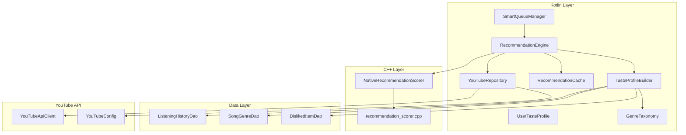
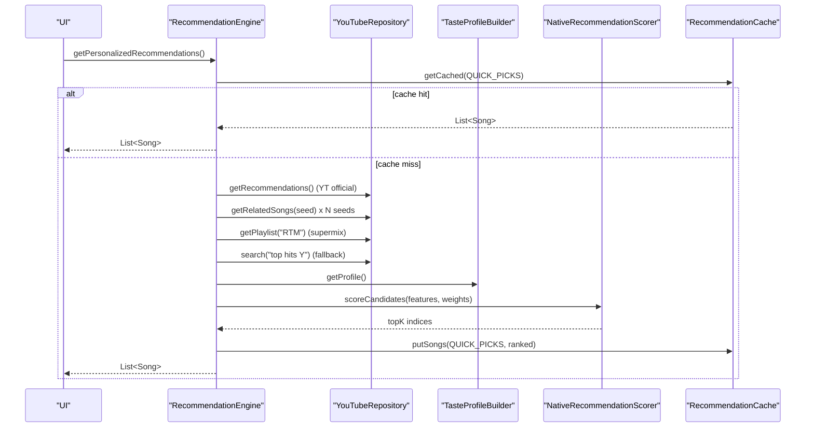
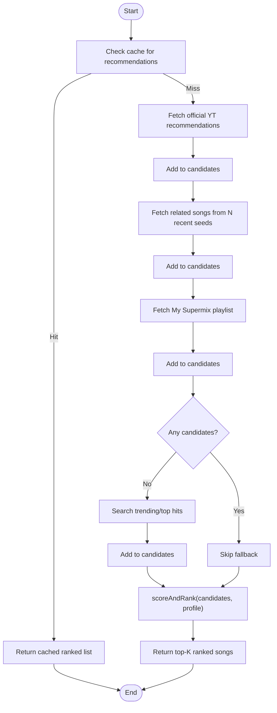
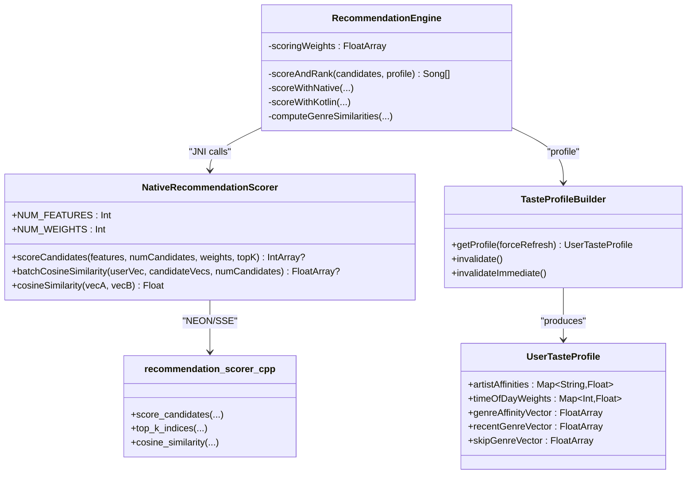
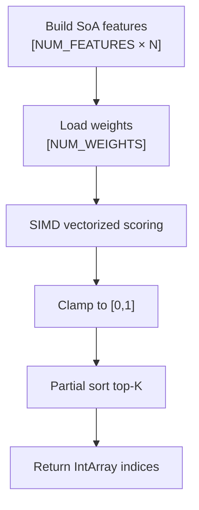
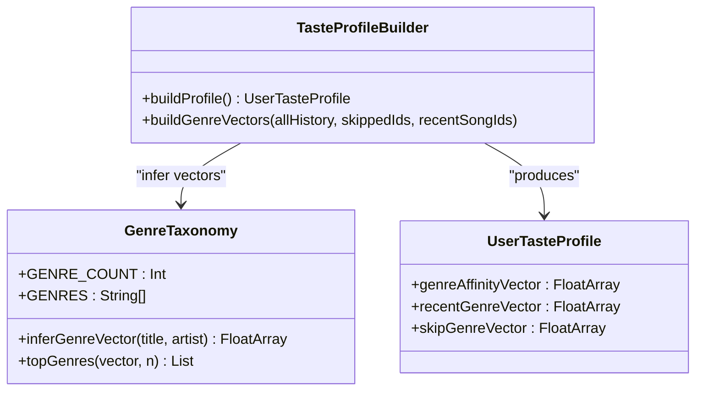
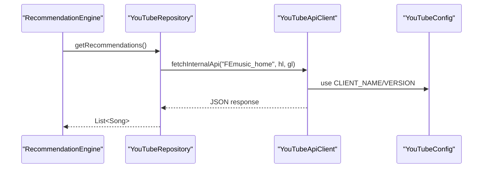
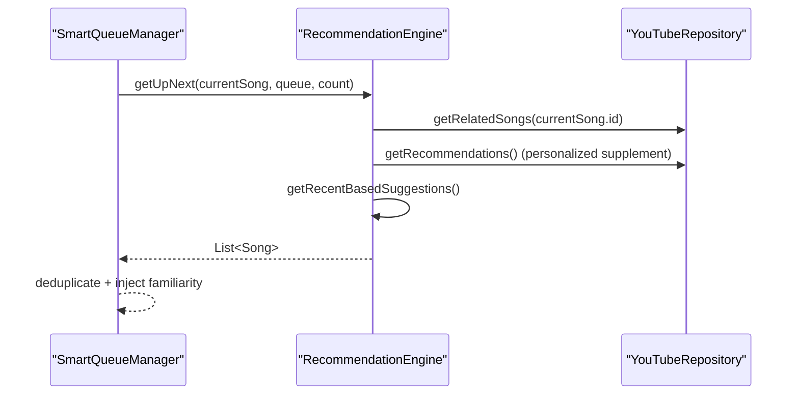
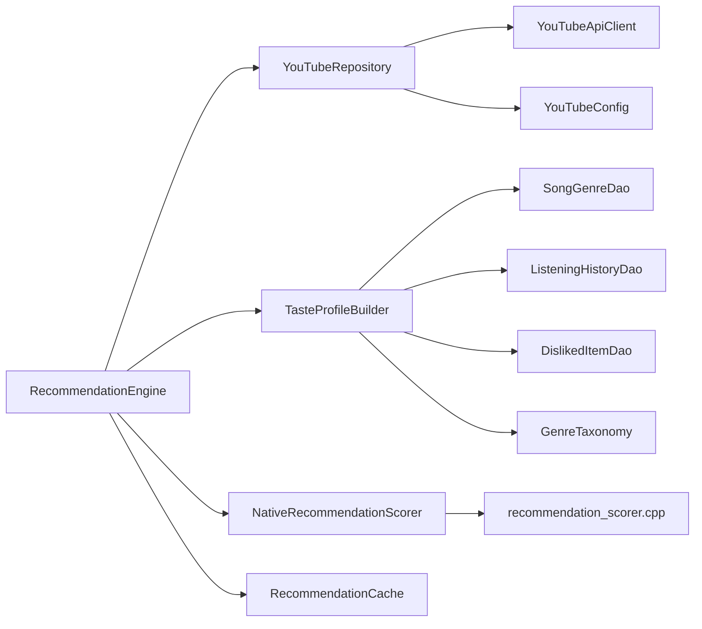

# Recommendation Algorithms

<cite>
**Referenced Files in This Document**
- [RecommendationEngine.kt](file://app/src/main/java/com/suvojeet/suvmusic/recommendation/RecommendationEngine.kt)
- [NativeRecommendationScorer.kt](file://app/src/main/java/com/suvojeet/suvmusic/recommendation/NativeRecommendationScorer.kt)
- [TasteProfileBuilder.kt](file://app/src/main/java/com/suvojeet/suvmusic/recommendation/TasteProfileBuilder.kt)
- [UserTasteProfile.kt](file://app/src/main/java/com/suvojeet/suvmusic/recommendation/UserTasteProfile.kt)
- [RecommendationCache.kt](file://app/src/main/java/com/suvojeet/suvmusic/recommendation/RecommendationCache.kt)
- [GenreTaxonomy.kt](file://app/src/main/java/com/suvojeet/suvmusic/recommendation/GenreTaxonomy.kt)
- [SmartQueueManager.kt](file://app/src/main/java/com/suvojeet/suvmusic/recommendation/SmartQueueManager.kt)
- [YouTubeRepository.kt](file://app/src/main/java/com/suvojeet/suvmusic/data/repository/YouTubeRepository.kt)
- [YouTubeApiClient.kt](file://app/src/main/java/com/suvojeet/suvmusic/data/repository/youtube/internal/YouTubeApiClient.kt)
- [YouTubeConfig.kt](file://app/src/main/java/com/suvojeet/suvmusic/data/repository/youtube/internal/YouTubeConfig.kt)
- [recommendation_scorer.cpp](file://app/src/main/cpp/recommendation_scorer.cpp)
</cite>

## Table of Contents
1. [Introduction](#introduction)
2. [Project Structure](#project-structure)
3. [Core Components](#core-components)
4. [Architecture Overview](#architecture-overview)
5. [Detailed Component Analysis](#detailed-component-analysis)
6. [Dependency Analysis](#dependency-analysis)
7. [Performance Considerations](#performance-considerations)
8. [Troubleshooting Guide](#troubleshooting-guide)
9. [Conclusion](#conclusion)
10. [Appendices](#appendices)

## Introduction
This document explains SuvMusic’s hybrid recommendation system that blends YouTube Music’s official API signals with local user taste analysis. It covers the multi-tier pipeline (official recommendations, related songs, personalized supplements, and fallbacks), the scoring and ranking mechanism, the native C++ SIMD-accelerated scorer, and operational aspects such as caching, freshness, cold start handling, diversity, and quality assessment.

## Project Structure
The recommendation system spans Kotlin and C++ layers:
- Kotlin: orchestration, user profile building, caching, YouTube API integration, and queue management
- C++: SIMD vectorized scoring and similarity computations
- Data persistence: Room DAOs for listening history, genre vectors, and disliked items
- YouTube Music integration: internal API client and search/streaming services

**Diagram sources**
- [RecommendationEngine.kt:1-1277](file://app/src/main/java/com/suvojeet/suvmusic/recommendation/RecommendationEngine.kt#L1-L1277)
- [TasteProfileBuilder.kt:1-338](file://app/src/main/java/com/suvojeet/suvmusic/recommendation/TasteProfileBuilder.kt#L1-L338)
- [RecommendationCache.kt:1-111](file://app/src/main/java/com/suvojeet/suvmusic/recommendation/RecommendationCache.kt#L1-L111)
- [GenreTaxonomy.kt:1-252](file://app/src/main/java/com/suvojeet/suvmusic/recommendation/GenreTaxonomy.kt#L1-L252)
- [SmartQueueManager.kt:1-142](file://app/src/main/java/com/suvojeet/suvmusic/recommendation/SmartQueueManager.kt#L1-L142)
- [YouTubeRepository.kt:1-3254](file://app/src/main/java/com/suvojeet/suvmusic/data/repository/YouTubeRepository.kt#L1-L3254)
- [YouTubeApiClient.kt:1-415](file://app/src/main/java/com/suvojeet/suvmusic/data/repository/youtube/internal/YouTubeApiClient.kt#L1-L415)
- [YouTubeConfig.kt:1-20](file://app/src/main/java/com/suvojeet/suvmusic/data/repository/youtube/internal/YouTubeConfig.kt#L1-L20)
- [NativeRecommendationScorer.kt:1-187](file://app/src/main/java/com/suvojeet/suvmusic/recommendation/NativeRecommendationScorer.kt#L1-L187)
- [recommendation_scorer.cpp:1-503](file://app/src/main/cpp/recommendation_scorer.cpp#L1-L503)

**Section sources**
- [RecommendationEngine.kt:1-1277](file://app/src/main/java/com/suvojeet/suvmusic/recommendation/RecommendationEngine.kt#L1-L1277)
- [YouTubeRepository.kt:1-3254](file://app/src/main/java/com/suvojeet/suvmusic/data/repository/YouTubeRepository.kt#L1-L3254)

## Core Components
- RecommendationEngine: orchestrates multi-tier recommendations, deduplication, caching, and scoring
- TasteProfileBuilder: builds a comprehensive user profile from listening history and genre inference
- UserTasteProfile: immutable data structure containing artist affinities, time-of-day weights, genre vectors, and metadata
- NativeRecommendationScorer: JNI bridge to C++ SIMD engine for fast scoring and similarity
- recommendation_scorer.cpp: vectorized scoring and cosine similarity with NEON/SSE fallbacks
- RecommendationCache: in-memory TTL cache for sections and song lists
- GenreTaxonomy: keyword-based genre inference and top-N selection
- SmartQueueManager: maintains queue health and radio/autoplay behavior
- YouTubeRepository and YouTubeApiClient: official YouTube Music API integration

**Section sources**
- [RecommendationEngine.kt:1-1277](file://app/src/main/java/com/suvojeet/suvmusic/recommendation/RecommendationEngine.kt#L1-L1277)
- [TasteProfileBuilder.kt:1-338](file://app/src/main/java/com/suvojeet/suvmusic/recommendation/TasteProfileBuilder.kt#L1-L338)
- [UserTasteProfile.kt:1-98](file://app/src/main/java/com/suvojeet/suvmusic/recommendation/UserTasteProfile.kt#L1-L98)
- [NativeRecommendationScorer.kt:1-187](file://app/src/main/java/com/suvojeet/suvmusic/recommendation/NativeRecommendationScorer.kt#L1-L187)
- [recommendation_scorer.cpp:1-503](file://app/src/main/cpp/recommendation_scorer.cpp#L1-L503)
- [RecommendationCache.kt:1-111](file://app/src/main/java/com/suvojeet/suvmusic/recommendation/RecommendationCache.kt#L1-L111)
- [GenreTaxonomy.kt:1-252](file://app/src/main/java/com/suvojeet/suvmusic/recommendation/GenreTaxonomy.kt#L1-L252)
- [SmartQueueManager.kt:1-142](file://app/src/main/java/com/suvojeet/suvmusic/recommendation/SmartQueueManager.kt#L1-L142)
- [YouTubeRepository.kt:1-3254](file://app/src/main/java/com/suvojeet/suvmusic/data/repository/YouTubeRepository.kt#L1-L3254)
- [YouTubeApiClient.kt:1-415](file://app/src/main/java/com/suvojeet/suvmusic/data/repository/youtube/internal/YouTubeApiClient.kt#L1-L415)

## Architecture Overview
The system follows a hybrid approach:
- Primary signals: YouTube Music official API (personalized home, related songs, mixes)
- Secondary signals: local user taste profile (artist affinities, genre vectors, time-of-day weights)
- Scoring: native SIMD engine with configurable weights; Kotlin fallback
- Caching: TTL-based in-memory cache for sections and song lists
- Queue intelligence: SmartQueueManager ensures healthy lookahead and radio behavior

**Diagram sources**
- [RecommendationEngine.kt:509-581](file://app/src/main/java/com/suvojeet/suvmusic/recommendation/RecommendationEngine.kt#L509-L581)
- [YouTubeRepository.kt:348-405](file://app/src/main/java/com/suvojeet/suvmusic/data/repository/YouTubeRepository.kt#L348-L405)
- [TasteProfileBuilder.kt:63-82](file://app/src/main/java/com/suvojeet/suvmusic/recommendation/TasteProfileBuilder.kt#L63-L82)
- [NativeRecommendationScorer.kt:81-104](file://app/src/main/java/com/suvojeet/suvmusic/recommendation/NativeRecommendationScorer.kt#L81-L104)
- [RecommendationCache.kt:52-63](file://app/src/main/java/com/suvojeet/suvmusic/recommendation/RecommendationCache.kt#L52-L63)

## Detailed Component Analysis

### Hybrid Recommendation Pipeline
- Official YouTube recommendations: primary source for personalized content
- Multi-seed related songs: improves recall by seeding from multiple recent plays
- My Supermix: curated playlist for broad discovery
- Fallback trending: ensures content availability when logged out or API fails
- Personalized supplements: genre-based sections, time-of-day, and artist mixes
- Quality filters: deduplication by ID and normalized fingerprint, dislike filtering, skip avoidance

**Diagram sources**
- [RecommendationEngine.kt:518-581](file://app/src/main/java/com/suvojeet/suvmusic/recommendation/RecommendationEngine.kt#L518-L581)
- [RecommendationEngine.kt:859-888](file://app/src/main/java/com/suvojeet/suvmusic/recommendation/RecommendationEngine.kt#L859-L888)

**Section sources**
- [RecommendationEngine.kt:509-581](file://app/src/main/java/com/suvojeet/suvmusic/recommendation/RecommendationEngine.kt#L509-L581)
- [YouTubeRepository.kt:348-405](file://app/src/main/java/com/suvojeet/suvmusic/data/repository/YouTubeRepository.kt#L348-L405)

### Scoring and Ranking Mechanism
- Signals:
  - Base score
  - Artist affinity (0–1)
  - Freshness bonus (1 if not recently played)
  - Skip avoidance penalty (1 if frequently skipped)
  - Liked song/artist boost
  - Time-of-day weight
  - Variety penalty (per-excess artist count)
  - Genre similarity (cosine between candidate and user genre vector)
  - Recent genre similarity (session/windowed)
  - Skip genre penalty (cosine with skip vector)
- Weights: tuned to balance personalization and diversity
- Native SIMD path: SoA feature layout, single JNI call, top-K selection
- Kotlin fallback: identical algorithm for portability

**Diagram sources**
- [RecommendationEngine.kt:859-1036](file://app/src/main/java/com/suvojeet/suvmusic/recommendation/RecommendationEngine.kt#L859-L1036)
- [NativeRecommendationScorer.kt:1-187](file://app/src/main/java/com/suvojeet/suvmusic/recommendation/NativeRecommendationScorer.kt#L1-L187)
- [recommendation_scorer.cpp:166-322](file://app/src/main/cpp/recommendation_scorer.cpp#L166-L322)
- [TasteProfileBuilder.kt:113-237](file://app/src/main/java/com/suvojeet/suvmusic/recommendation/TasteProfileBuilder.kt#L113-L237)
- [UserTasteProfile.kt:1-98](file://app/src/main/java/com/suvojeet/suvmusic/recommendation/UserTasteProfile.kt#L1-L98)

**Section sources**
- [RecommendationEngine.kt:859-1036](file://app/src/main/java/com/suvojeet/suvmusic/recommendation/RecommendationEngine.kt#L859-L1036)
- [NativeRecommendationScorer.kt:50-145](file://app/src/main/java/com/suvojeet/suvmusic/recommendation/NativeRecommendationScorer.kt#L50-L145)
- [recommendation_scorer.cpp:166-322](file://app/src/main/cpp/recommendation_scorer.cpp#L166-L322)

### Native C++ Recommendation Scorer
- SIMD acceleration: NEON (ARM) or SSE (x86) vectorized weighted sum
- Feature layout: SoA (column-major) for batch processing
- Functions:
  - scoreCandidates: computes scores and returns top-K indices
  - cosineSimilarity: single pair similarity
  - batchCosineSimilarity: vectorized batch similarity
- Fallback: scalar implementation if SIMD unavailable
- JNI boundary: safe array bounds checks and logging

**Diagram sources**
- [NativeRecommendationScorer.kt:81-104](file://app/src/main/java/com/suvojeet/suvmusic/recommendation/NativeRecommendationScorer.kt#L81-L104)
- [recommendation_scorer.cpp:166-322](file://app/src/main/cpp/recommendation_scorer.cpp#L166-L322)

**Section sources**
- [NativeRecommendationScorer.kt:1-187](file://app/src/main/java/com/suvojeet/suvmusic/recommendation/NativeRecommendationScorer.kt#L1-L187)
- [recommendation_scorer.cpp:1-503](file://app/src/main/cpp/recommendation_scorer.cpp#L1-L503)

### User Taste Profile and Genre Vectors
- Artist affinities: weighted by play count, completion rate, and recency decay
- Time-of-day weights: derived from last-played hours
- Genre vectors:
  - Full affinity: weighted sum across history
  - Recent session: last N plays (mood/session recency)
  - Skip vector: genres from frequently skipped songs
- Keyword-based inference via GenreTaxonomy with caching

**Diagram sources**
- [GenreTaxonomy.kt:1-252](file://app/src/main/java/com/suvojeet/suvmusic/recommendation/GenreTaxonomy.kt#L1-L252)
- [TasteProfileBuilder.kt:248-336](file://app/src/main/java/com/suvojeet/suvmusic/recommendation/TasteProfileBuilder.kt#L248-L336)
- [UserTasteProfile.kt:1-98](file://app/src/main/java/com/suvojeet/suvmusic/recommendation/UserTasteProfile.kt#L1-L98)

**Section sources**
- [TasteProfileBuilder.kt:113-336](file://app/src/main/java/com/suvojeet/suvmusic/recommendation/TasteProfileBuilder.kt#L113-L336)
- [GenreTaxonomy.kt:197-250](file://app/src/main/java/com/suvojeet/suvmusic/recommendation/GenreTaxonomy.kt#L197-L250)
- [UserTasteProfile.kt:1-98](file://app/src/main/java/com/suvojeet/suvmusic/recommendation/UserTasteProfile.kt#L1-L98)

### YouTube Music Integration
- Authentication and headers: managed by YouTubeApiClient and SessionManager
- Endpoints: official browse/home, related songs, charts, and fallbacks
- Public API support for non-authenticated users
- Continuation handling for pagination

**Diagram sources**
- [YouTubeRepository.kt:348-405](file://app/src/main/java/com/suvojeet/suvmusic/data/repository/YouTubeRepository.kt#L348-L405)
- [YouTubeApiClient.kt:28-72](file://app/src/main/java/com/suvojeet/suvmusic/data/repository/youtube/internal/YouTubeApiClient.kt#L28-L72)
- [YouTubeConfig.kt:7-19](file://app/src/main/java/com/suvojeet/suvmusic/data/repository/youtube/internal/YouTubeConfig.kt#L7-L19)

**Section sources**
- [YouTubeRepository.kt:348-405](file://app/src/main/java/com/suvojeet/suvmusic/data/repository/YouTubeRepository.kt#L348-L405)
- [YouTubeApiClient.kt:28-72](file://app/src/main/java/com/suvojeet/suvmusic/data/repository/youtube/internal/YouTubeApiClient.kt#L28-L72)
- [YouTubeConfig.kt:7-19](file://app/src/main/java/com/suvojeet/suvmusic/data/repository/youtube/internal/YouTubeConfig.kt#L7-L19)

### Queue Intelligence and Radio
- SmartQueueManager pre-fetches “up next” songs and adapts to radio/manual modes
- Uses RecommendationEngine’s multi-seed logic and deduplication
- Maintains last seed for continuity

**Diagram sources**
- [SmartQueueManager.kt:54-105](file://app/src/main/java/com/suvojeet/suvmusic/recommendation/SmartQueueManager.kt#L54-L105)
- [RecommendationEngine.kt:590-645](file://app/src/main/java/com/suvojeet/suvmusic/recommendation/RecommendationEngine.kt#L590-L645)

**Section sources**
- [SmartQueueManager.kt:1-142](file://app/src/main/java/com/suvojeet/suvmusic/recommendation/SmartQueueManager.kt#L1-L142)
- [RecommendationEngine.kt:590-645](file://app/src/main/java/com/suvojeet/suvmusic/recommendation/RecommendationEngine.kt#L590-L645)

## Dependency Analysis
- Coupling:
  - RecommendationEngine depends on YouTubeRepository, TasteProfileBuilder, NativeRecommendationScorer, RecommendationCache, and DAOs
  - NativeRecommendationScorer depends on recommendation_scorer.cpp and System.loadLibrary
  - TasteProfileBuilder depends on DAOs and GenreTaxonomy
- Cohesion:
  - Each component has a focused responsibility (scoring, caching, profile building, YouTube integration)
- External dependencies:
  - OkHttp for HTTP requests
  - NewPipe for search/stream extraction
  - Room for persistence

**Diagram sources**
- [RecommendationEngine.kt:1-1277](file://app/src/main/java/com/suvojeet/suvmusic/recommendation/RecommendationEngine.kt#L1-L1277)
- [TasteProfileBuilder.kt:1-338](file://app/src/main/java/com/suvojeet/suvmusic/recommendation/TasteProfileBuilder.kt#L1-L338)
- [RecommendationCache.kt:1-111](file://app/src/main/java/com/suvojeet/suvmusic/recommendation/RecommendationCache.kt#L1-L111)
- [YouTubeRepository.kt:1-3254](file://app/src/main/java/com/suvojeet/suvmusic/data/repository/YouTubeRepository.kt#L1-L3254)
- [YouTubeApiClient.kt:1-415](file://app/src/main/java/com/suvojeet/suvmusic/data/repository/youtube/internal/YouTubeApiClient.kt#L1-L415)
- [YouTubeConfig.kt:1-20](file://app/src/main/java/com/suvojeet/suvmusic/data/repository/youtube/internal/YouTubeConfig.kt#L1-L20)
- [NativeRecommendationScorer.kt:1-187](file://app/src/main/java/com/suvojeet/suvmusic/recommendation/NativeRecommendationScorer.kt#L1-L187)
- [recommendation_scorer.cpp:1-503](file://app/src/main/cpp/recommendation_scorer.cpp#L1-L503)

**Section sources**
- [RecommendationEngine.kt:1-1277](file://app/src/main/java/com/suvojeet/suvmusic/recommendation/RecommendationEngine.kt#L1-L1277)
- [YouTubeRepository.kt:1-3254](file://app/src/main/java/com/suvojeet/suvmusic/data/repository/YouTubeRepository.kt#L1-L3254)

## Performance Considerations
- Native SIMD scoring:
  - Single JNI call per batch; avoids per-candidate JVM overhead
  - NEON/SSE vectorization for weighted sums and similarity
- Batch operations:
  - Batch cosine similarity for genre vectors
  - Deduplication and filtering in Kotlin with in-memory sets
- Concurrency:
  - Parallel YouTube API calls with semaphore limiting
  - Async/await for independent sections and related queries
- Caching:
  - TTL-based in-memory cache for sections and song lists
  - Short TTL for “up next” and related content
- Memory:
  - SoA feature layout minimizes GC pressure
  - Deduplicated fingerprints reduce duplication across APIs

[No sources needed since this section provides general guidance]

## Troubleshooting Guide
- Native scorer unavailable:
  - Falls back to Kotlin scoring; verify library loading and feature/weight sizes
- Empty recommendations:
  - Check cache TTL and invalidation hooks
  - Verify YouTube API responses and authentication
- Cold start:
  - Minimal data leads to neutral genre vectors; rely on trending/fallback
- Diversity issues:
  - Adjust variety penalty weight; review artist counts and penalties
- Quality degradation:
  - Inspect skip flags and skip genre penalties; ensure disliked items are persisted

**Section sources**
- [NativeRecommendationScorer.kt:35-48](file://app/src/main/java/com/suvojeet/suvmusic/recommendation/NativeRecommendationScorer.kt#L35-L48)
- [RecommendationEngine.kt:804-842](file://app/src/main/java/com/suvojeet/suvmusic/recommendation/RecommendationEngine.kt#L804-L842)
- [RecommendationCache.kt:88-110](file://app/src/main/java/com/suvojeet/suvmusic/recommendation/RecommendationCache.kt#L88-L110)

## Conclusion
SuvMusic’s recommendation system combines YouTube Music’s authoritative signals with a robust local taste model. The native SIMD scorer enables high-throughput, low-latency ranking, while the multi-tier pipeline ensures robustness and personalization. Caching, deduplication, and queue intelligence deliver a smooth user experience across diverse usage patterns.

[No sources needed since this section summarizes without analyzing specific files]

## Appendices

### Algorithm Parameters and Weights
- Scoring weights (v2):
  - Base: 0.50
  - Artist Affinity: 0.22
  - Freshness: 0.12
  - Skip Avoidance: 0.12
  - Liked Song: 0.12
  - Liked Artist: 0.08
  - Time-of-Day: 0.08
  - Variety Penalty: 0.10
  - Genre Similarity: 0.20
  - Session Genre Similarity: 0.08
  - Skip Genre Penalty: 0.08

**Section sources**
- [RecommendationEngine.kt:859-888](file://app/src/main/java/com/suvojeet/suvmusic/recommendation/RecommendationEngine.kt#L859-L888)

### Recommendation Freshness and Caching
- Profile TTL: 10 minutes
- Cache TTLs:
  - Default: 15 minutes
  - Up next/related: 5 minutes
- Invalidation:
  - On song play (rate-limited), like/dislike, auth state change
  - Explicit invalidation for targeted recomputation

**Section sources**
- [TasteProfileBuilder.kt:46-58](file://app/src/main/java/com/suvojeet/suvmusic/recommendation/TasteProfileBuilder.kt#L46-L58)
- [RecommendationCache.kt:17-21](file://app/src/main/java/com/suvojeet/suvmusic/recommendation/RecommendationCache.kt#L17-L21)
- [RecommendationEngine.kt:804-853](file://app/src/main/java/com/suvojeet/suvmusic/recommendation/RecommendationEngine.kt#L804-L853)

### Cold Start and Diversity Controls
- Cold start:
  - Trending fallback when no history or not logged in
  - Genre taxonomy inference for new songs
- Diversity:
  - Variety penalty increases with repeated artists
  - Skip genre penalty discourages frequent skips
  - Recommended supplements (artist mixes, discovery)

**Section sources**
- [RecommendationEngine.kt:564-573](file://app/src/main/java/com/suvojeet/suvmusic/recommendation/RecommendationEngine.kt#L564-L573)
- [RecommendationEngine.kt:914-922](file://app/src/main/java/com/suvojeet/suvmusic/recommendation/RecommendationEngine.kt#L914-L922)
- [RecommendationEngine.kt:1042-1100](file://app/src/main/java/com/suvojeet/suvmusic/recommendation/RecommendationEngine.kt#L1042-L1100)

### Quality Assessment Metrics
- Internal:
  - Cache hit ratio and latency for recommendations
  - Native vs. Kotlin scoring performance
  - Deduplication effectiveness
- Operational:
  - API success rates and timeouts
  - Queue health (lookahead vs. remaining)
  - User feedback via likes/dislikes and skips

[No sources needed since this section provides general guidance]