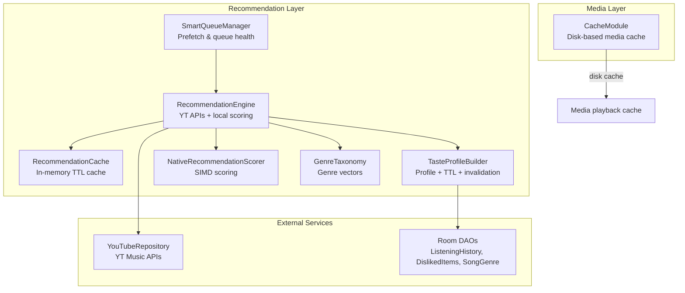
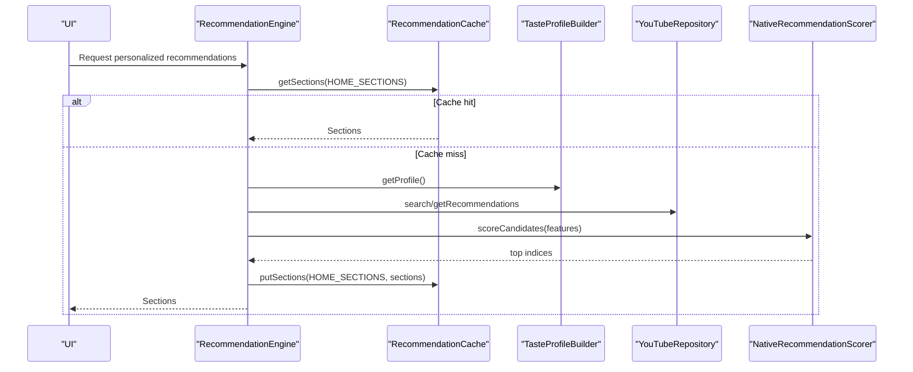
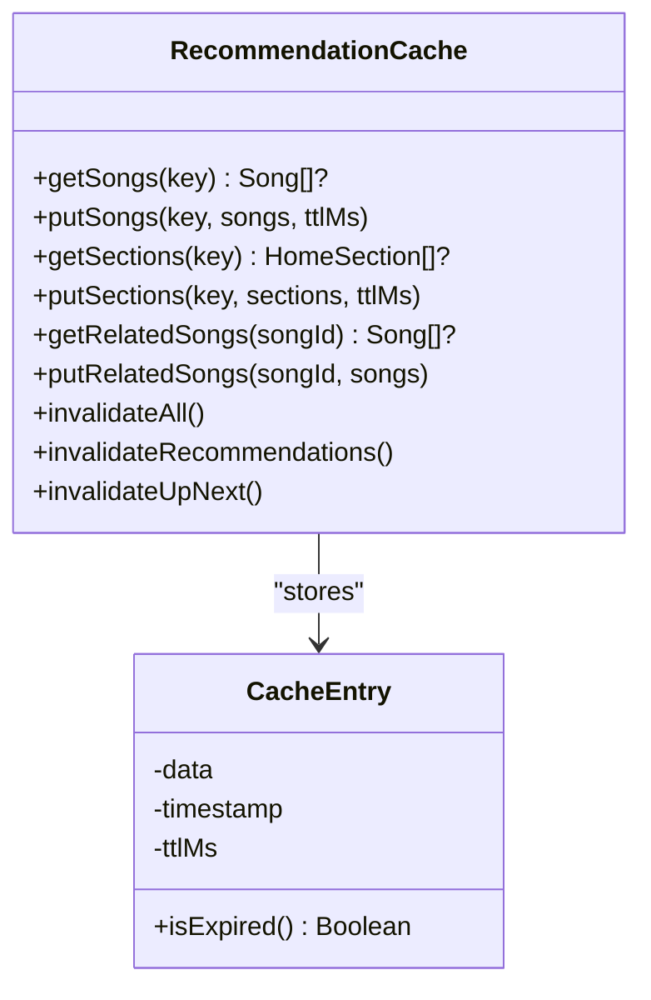
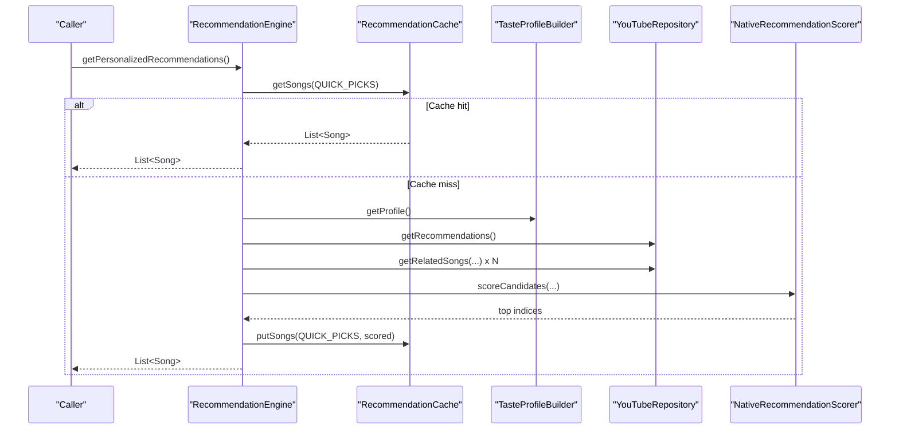
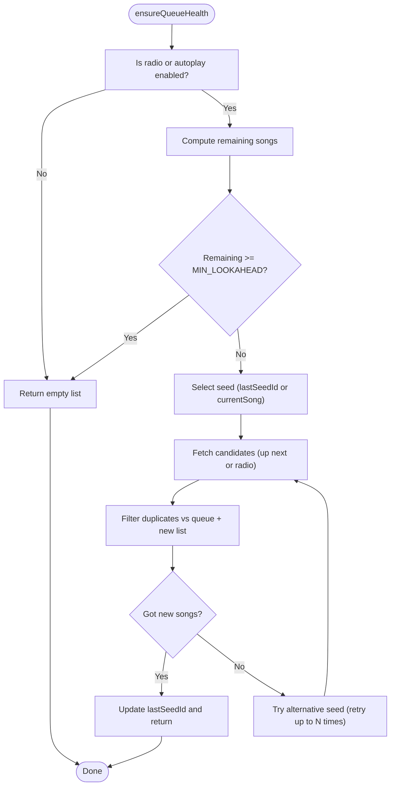
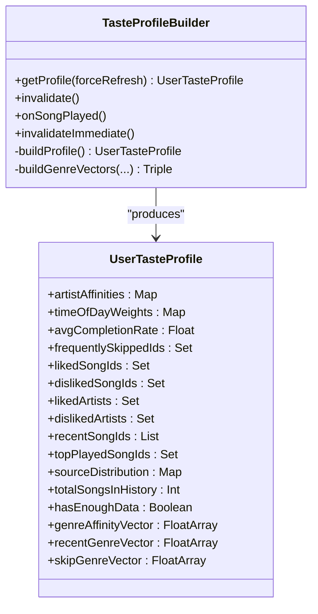
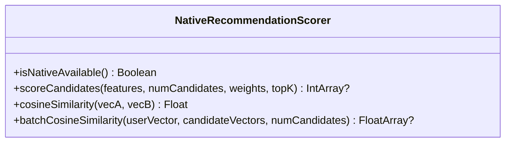
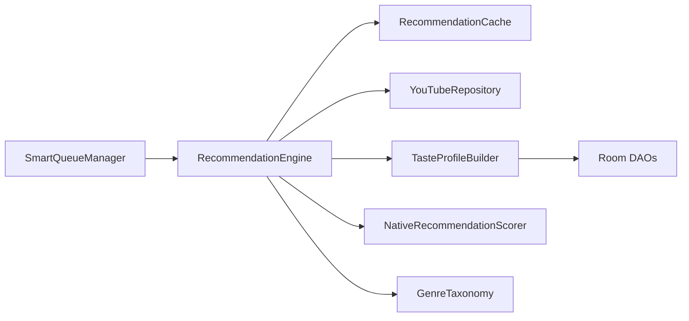

# Recommendation Cache System

<cite>
**Referenced Files in This Document**
- [RecommendationCache.kt](file://app/src/main/java/com/suvojeet/suvmusic/recommendation/RecommendationCache.kt)
- [RecommendationEngine.kt](file://app/src/main/java/com/suvojeet/suvmusic/recommendation/RecommendationEngine.kt)
- [SmartQueueManager.kt](file://app/src/main/java/com/suvojeet/suvmusic/recommendation/SmartQueueManager.kt)
- [TasteProfileBuilder.kt](file://app/src/main/java/com/suvojeet/suvmusic/recommendation/TasteProfileBuilder.kt)
- [UserTasteProfile.kt](file://app/src/main/java/com/suvojeet/suvmusic/recommendation/UserTasteProfile.kt)
- [NativeRecommendationScorer.kt](file://app/src/main/java/com/suvojeet/suvmusic/recommendation/NativeRecommendationScorer.kt)
- [GenreTaxonomy.kt](file://app/src/main/java/com/suvojeet/suvmusic/recommendation/GenreTaxonomy.kt)
- [CacheModule.kt](file://app/src/main/java/com/suvojeet/suvmusic/di/CacheModule.kt)
</cite>

## Table of Contents
1. [Introduction](#introduction)
2. [Project Structure](#project-structure)
3. [Core Components](#core-components)
4. [Architecture Overview](#architecture-overview)
5. [Detailed Component Analysis](#detailed-component-analysis)
6. [Dependency Analysis](#dependency-analysis)
7. [Performance Considerations](#performance-considerations)
8. [Troubleshooting Guide](#troubleshooting-guide)
9. [Conclusion](#conclusion)
10. [Appendices](#appendices)

## Introduction
This document describes the Recommendation Cache System used to optimize recommendation performance and reduce API calls. It explains the multi-layer caching strategy, cache key generation, TTL policies, invalidation mechanisms, storage architecture, warming and prefetching strategies, and usage patterns for home sections, personalized recommendations, and up-next suggestions. It also covers consistency, thread safety, memory management, monitoring, and debugging.

## Project Structure
The recommendation subsystem is organized around a small set of cohesive Kotlin modules:
- In-memory cache for recommendation results
- Recommendation engine orchestrating YouTube Music APIs and local scoring
- Queue intelligence for prefetching and maintaining “up next”
- Taste profile builder for personalization signals
- Genre taxonomy and native scorer for efficient ranking
- Media cache module for disk-based media caching (separate from recommendation cache)

**Diagram sources**
- [RecommendationCache.kt:14-111](file://app/src/main/java/com/suvojeet/suvmusic/recommendation/RecommendationCache.kt#L14-L111)
- [RecommendationEngine.kt:41-49](file://app/src/main/java/com/suvojeet/suvmusic/recommendation/RecommendationEngine.kt#L41-L49)
- [SmartQueueManager.kt:23-25](file://app/src/main/java/com/suvojeet/suvmusic/recommendation/SmartQueueManager.kt#L23-L25)
- [TasteProfileBuilder.kt:27-31](file://app/src/main/java/com/suvojeet/suvmusic/recommendation/TasteProfileBuilder.kt#L27-L31)
- [NativeRecommendationScorer.kt:20-21](file://app/src/main/java/com/suvojeet/suvmusic/recommendation/NativeRecommendationScorer.kt#L20-L21)
- [GenreTaxonomy.kt:10-12](file://app/src/main/java/com/suvojeet/suvmusic/recommendation/GenreTaxonomy.kt#L10-L12)
- [CacheModule.kt:24-51](file://app/src/main/java/com/suvojeet/suvmusic/di/CacheModule.kt#L24-L51)

**Section sources**
- [RecommendationCache.kt:14-111](file://app/src/main/java/com/suvojeet/suvmusic/recommendation/RecommendationCache.kt#L14-L111)
- [RecommendationEngine.kt:41-49](file://app/src/main/java/com/suvojeet/suvmusic/recommendation/RecommendationEngine.kt#L41-L49)
- [SmartQueueManager.kt:23-25](file://app/src/main/java/com/suvojeet/suvmusic/recommendation/SmartQueueManager.kt#L23-L25)
- [TasteProfileBuilder.kt:27-31](file://app/src/main/java/com/suvojeet/suvmusic/recommendation/TasteProfileBuilder.kt#L27-L31)
- [NativeRecommendationScorer.kt:20-21](file://app/src/main/java/com/suvojeet/suvmusic/recommendation/NativeRecommendationScorer.kt#L20-L21)
- [GenreTaxonomy.kt:10-12](file://app/src/main/java/com/suvojeet/suvmusic/recommendation/GenreTaxonomy.kt#L10-L12)
- [CacheModule.kt:24-51](file://app/src/main/java/com/suvojeet/suvmusic/di/CacheModule.kt#L24-L51)

## Core Components
- RecommendationCache: In-memory cache with TTL and explicit invalidation hooks for song lists and home sections.
- RecommendationEngine: Orchestrates YouTube Music APIs, merges with local scoring, and integrates cache usage and invalidation.
- SmartQueueManager: Prefetches “up next” and maintains queue health using recommendation logic.
- TasteProfileBuilder: Builds a UserTasteProfile snapshot with TTL and controlled invalidation.
- NativeRecommendationScorer: JNI-based SIMD scoring engine for efficient ranking.
- GenreTaxonomy: Fixed 20-genre taxonomy and vector inference for scoring.
- CacheModule: Disk-based media cache for playback (separate from recommendation cache).

**Section sources**
- [RecommendationCache.kt:14-111](file://app/src/main/java/com/suvojeet/suvmusic/recommendation/RecommendationCache.kt#L14-L111)
- [RecommendationEngine.kt:41-49](file://app/src/main/java/com/suvojeet/suvmusic/recommendation/RecommendationEngine.kt#L41-L49)
- [SmartQueueManager.kt:23-25](file://app/src/main/java/com/suvojeet/suvmusic/recommendation/SmartQueueManager.kt#L23-L25)
- [TasteProfileBuilder.kt:27-31](file://app/src/main/java/com/suvojeet/suvmusic/recommendation/TasteProfileBuilder.kt#L27-L31)
- [NativeRecommendationScorer.kt:20-21](file://app/src/main/java/com/suvojeet/suvmusic/recommendation/NativeRecommendationScorer.kt#L20-L21)
- [GenreTaxonomy.kt:10-12](file://app/src/main/java/com/suvojeet/suvmusic/recommendation/GenreTaxonomy.kt#L10-L12)
- [CacheModule.kt:24-51](file://app/src/main/java/com/suvojeet/suvmusic/di/CacheModule.kt#L24-L51)

## Architecture Overview
The system uses a layered cache:
- In-memory cache for recommendation results (songs and home sections) with TTL.
- Persistent profile cache with TTL and controlled invalidation.
- Disk-based media cache for playback assets (separate concern).

**Diagram sources**
- [RecommendationEngine.kt:428-499](file://app/src/main/java/com/suvojeet/suvmusic/recommendation/RecommendationEngine.kt#L428-L499)
- [RecommendationCache.kt:73-84](file://app/src/main/java/com/suvojeet/suvmusic/recommendation/RecommendationCache.kt#L73-L84)
- [TasteProfileBuilder.kt:63-82](file://app/src/main/java/com/suvojeet/suvmusic/recommendation/TasteProfileBuilder.kt#L63-L82)
- [NativeRecommendationScorer.kt:81-104](file://app/src/main/java/com/suvojeet/suvmusic/recommendation/NativeRecommendationScorer.kt#L81-L104)

## Detailed Component Analysis

### RecommendationCache: Multi-layer In-memory Cache
- Purpose: Avoid redundant network calls by caching recommendation results with TTL.
- Data structures:
  - Concurrent maps for song lists and home sections keyed by string identifiers.
  - CacheEntry encapsulates data, timestamp, and TTL.
- TTL policy:
  - Default TTL for most recommendations: 15 minutes.
  - Short TTL for volatile data like “up next”: 5 minutes.
- Key categories:
  - Quick picks, personalized mix, based on recent, discovery mix, artist mix, up next, home sections, related songs (prefix), mood-based (prefix).
- Operations:
  - getSongs/getSections with auto-expiry.
  - putSongs/putSections with configurable TTL.
  - getRelatedSongs/putRelatedSongs using a song-id-based key with short TTL.
  - Invalidation:
    - invalidateAll: clears all caches (e.g., on auth state change).
    - invalidateRecommendations: evicts quick picks, personalized mixes, recent-based, discovery, up next, and home sections.
    - invalidateUpNext: evicts up next and all related caches.

**Diagram sources**
- [RecommendationCache.kt:14-111](file://app/src/main/java/com/suvojeet/suvmusic/recommendation/RecommendationCache.kt#L14-L111)

**Section sources**
- [RecommendationCache.kt:16-29](file://app/src/main/java/com/suvojeet/suvmusic/recommendation/RecommendationCache.kt#L16-L29)
- [RecommendationCache.kt:38-48](file://app/src/main/java/com/suvojeet/suvmusic/recommendation/RecommendationCache.kt#L38-L48)
- [RecommendationCache.kt:52-63](file://app/src/main/java/com/suvojeet/suvmusic/recommendation/RecommendationCache.kt#L52-L63)
- [RecommendationCache.kt:73-84](file://app/src/main/java/com/suvojeet/suvmusic/recommendation/RecommendationCache.kt#L73-L84)
- [RecommendationCache.kt:88-110](file://app/src/main/java/com/suvojeet/suvmusic/recommendation/RecommendationCache.kt#L88-L110)

### RecommendationEngine: Orchestrator of Recommendations and Cache Integration
- Responsibilities:
  - Fetches recommendations from YouTube Music APIs.
  - Builds and uses UserTasteProfile for scoring.
  - Integrates with RecommendationCache for hot-path caching.
  - Applies deduplication and filtering to avoid disliked items and repeats.
  - Uses NativeRecommendationScorer for SIMD-based ranking.
- Cache usage patterns:
  - Home sections: caches combined sections under a home key and genre/context-specific keys.
  - Personalized recommendations: caches quick picks for reuse.
  - Up next: caches related songs per seed song with short TTL.
  - Related songs: caches per-song related lists with short TTL.
- Invalidation hooks:
  - onSongPlayed: invalidates up next.
  - onSongLikeChanged/onSongDisliked: invalidates recommendations and up next; rebuilds profile immediately.
  - onAuthStateChanged: clears persistent dislikes and invalidates all caches.

**Diagram sources**
- [RecommendationEngine.kt:509-581](file://app/src/main/java/com/suvojeet/suvmusic/recommendation/RecommendationEngine.kt#L509-L581)
- [RecommendationCache.kt:52-63](file://app/src/main/java/com/suvojeet/suvmusic/recommendation/RecommendationCache.kt#L52-L63)
- [TasteProfileBuilder.kt:63-82](file://app/src/main/java/com/suvojeet/suvmusic/recommendation/TasteProfileBuilder.kt#L63-L82)
- [NativeRecommendationScorer.kt:81-104](file://app/src/main/java/com/suvojeet/suvmusic/recommendation/NativeRecommendationScorer.kt#L81-L104)

**Section sources**
- [RecommendationEngine.kt:428-500](file://app/src/main/java/com/suvojeet/suvmusic/recommendation/RecommendationEngine.kt#L428-L500)
- [RecommendationEngine.kt:509-581](file://app/src/main/java/com/suvojeet/suvmusic/recommendation/RecommendationEngine.kt#L509-L581)
- [RecommendationEngine.kt:587-645](file://app/src/main/java/com/suvojeet/suvmusic/recommendation/RecommendationEngine.kt#L587-L645)
- [RecommendationEngine.kt:707-742](file://app/src/main/java/com/suvojeet/suvmusic/recommendation/RecommendationEngine.kt#L707-L742)
- [RecommendationEngine.kt:744-776](file://app/src/main/java/com/suvojeet/suvmusic/recommendation/RecommendationEngine.kt#L744-L776)
- [RecommendationEngine.kt:778-798](file://app/src/main/java/com/suvojeet/suvmusic/recommendation/RecommendationEngine.kt#L778-L798)
- [RecommendationEngine.kt:804-853](file://app/src/main/java/com/suvojeet/suvmusic/recommendation/RecommendationEngine.kt#L804-L853)

### SmartQueueManager: Prefetching and Queue Health
- Maintains a healthy lookahead for autoplay/radio modes.
- Uses RecommendationEngine’s “up next” and “more for radio” logic.
- Avoids duplicates against the current queue and previously fetched songs.
- Resets state when radio stops.

**Diagram sources**
- [SmartQueueManager.kt:54-105](file://app/src/main/java/com/suvojeet/suvmusic/recommendation/SmartQueueManager.kt#L54-L105)

**Section sources**
- [SmartQueueManager.kt:54-105](file://app/src/main/java/com/suvojeet/suvmusic/recommendation/SmartQueueManager.kt#L54-L105)
- [SmartQueueManager.kt:115-133](file://app/src/main/java/com/suvojeet/suvmusic/recommendation/SmartQueueManager.kt#L115-L133)

### TasteProfileBuilder: Personalization Signals and Cache
- Builds a UserTasteProfile snapshot with TTL (10 minutes) and mutex protection.
- Tracks play events and invalidates periodically (every N plays) or immediately for significant changes.
- Provides artist affinities, time-of-day weights, completion rates, liked/disliked sets, recent/top lists, and genre vectors.

**Diagram sources**
- [TasteProfileBuilder.kt:27-337](file://app/src/main/java/com/suvojeet/suvmusic/recommendation/TasteProfileBuilder.kt#L27-L337)
- [UserTasteProfile.kt:7-97](file://app/src/main/java/com/suvojeet/suvmusic/recommendation/UserTasteProfile.kt#L7-L97)

**Section sources**
- [TasteProfileBuilder.kt:63-82](file://app/src/main/java/com/suvojeet/suvmusic/recommendation/TasteProfileBuilder.kt#L63-L82)
- [TasteProfileBuilder.kt:97-111](file://app/src/main/java/com/suvojeet/suvmusic/recommendation/TasteProfileBuilder.kt#L97-L111)
- [UserTasteProfile.kt:7-97](file://app/src/main/java/com/suvojeet/suvmusic/recommendation/UserTasteProfile.kt#L7-L97)

### NativeRecommendationScorer: SIMD Ranking Engine
- JNI bridge to a native SIMD engine for batch scoring and cosine similarity.
- Falls back to Kotlin scoring if native library is unavailable.
- Exposes methods for scoring candidates and computing similarities.

**Diagram sources**
- [NativeRecommendationScorer.kt:20-186](file://app/src/main/java/com/suvojeet/suvmusic/recommendation/NativeRecommendationScorer.kt#L20-L186)

**Section sources**
- [NativeRecommendationScorer.kt:81-145](file://app/src/main/java/com/suvojeet/suvmusic/recommendation/NativeRecommendationScorer.kt#L81-L145)

### GenreTaxonomy: Genre Vectors and Inference
- Defines a fixed 20-genre taxonomy and keyword-to-genre mapping.
- Infers genre vectors from titles and artists and supports normalization and top-N retrieval.

**Section sources**
- [GenreTaxonomy.kt:14-36](file://app/src/main/java/com/suvojeet/suvmusic/recommendation/GenreTaxonomy.kt#L14-L36)
- [GenreTaxonomy.kt:203-231](file://app/src/main/java/com/suvojeet/suvmusic/recommendation/GenreTaxonomy.kt#L203-L231)
- [GenreTaxonomy.kt:244-250](file://app/src/main/java/com/suvojeet/suvmusic/recommendation/GenreTaxonomy.kt#L244-L250)

### CacheStorage and Disk Persistence
- Media cache: Disk-based cache for media playback using ExoPlayer’s cache infrastructure.
- Recommendation cache: In-memory only; no disk persistence for recommendations.

**Section sources**
- [CacheModule.kt:35-51](file://app/src/main/java/com/suvojeet/suvmusic/di/CacheModule.kt#L35-L51)
- [CacheModule.kt:76-93](file://app/src/main/java/com/suvojeet/suvmusic/di/CacheModule.kt#L76-L93)

## Dependency Analysis
- RecommendationEngine depends on RecommendationCache, YouTubeRepository, TasteProfileBuilder, NativeRecommendationScorer, and DAOs.
- RecommendationCache is a singleton dependency injected into RecommendationEngine.
- SmartQueueManager depends on RecommendationEngine.
- TasteProfileBuilder depends on DAOs for persisted data and uses a mutex and atomic counter for controlled invalidation.
- NativeRecommendationScorer is a singleton with lazy native library loading.
- GenreTaxonomy is an object providing static utilities.

**Diagram sources**
- [RecommendationEngine.kt:41-49](file://app/src/main/java/com/suvojeet/suvmusic/recommendation/RecommendationEngine.kt#L41-L49)
- [RecommendationCache.kt:14-14](file://app/src/main/java/com/suvojeet/suvmusic/recommendation/RecommendationCache.kt#L14-L14)
- [SmartQueueManager.kt:23-25](file://app/src/main/java/com/suvojeet/suvmusic/recommendation/SmartQueueManager.kt#L23-L25)
- [TasteProfileBuilder.kt:27-31](file://app/src/main/java/com/suvojeet/suvmusic/recommendation/TasteProfileBuilder.kt#L27-L31)
- [NativeRecommendationScorer.kt:20-21](file://app/src/main/java/com/suvojeet/suvmusic/recommendation/NativeRecommendationScorer.kt#L20-L21)
- [GenreTaxonomy.kt:10-12](file://app/src/main/java/com/suvojeet/suvmusic/recommendation/GenreTaxonomy.kt#L10-L12)

**Section sources**
- [RecommendationEngine.kt:41-49](file://app/src/main/java/com/suvojeet/suvmusic/recommendation/RecommendationEngine.kt#L41-L49)
- [RecommendationCache.kt:14-14](file://app/src/main/java/com/suvojeet/suvmusic/recommendation/RecommendationCache.kt#L14-L14)
- [SmartQueueManager.kt:23-25](file://app/src/main/java/com/suvojeet/suvmusic/recommendation/SmartQueueManager.kt#L23-L25)
- [TasteProfileBuilder.kt:27-31](file://app/src/main/java/com/suvojeet/suvmusic/recommendation/TasteProfileBuilder.kt#L27-L31)
- [NativeRecommendationScorer.kt:20-21](file://app/src/main/java/com/suvojeet/suvmusic/recommendation/NativeRecommendationScorer.kt#L20-L21)
- [GenreTaxonomy.kt:10-12](file://app/src/main/java/com/suvojeet/suvmusic/recommendation/GenreTaxonomy.kt#L10-L12)

## Performance Considerations
- In-memory cache with TTL minimizes network calls and reduces latency for repeated requests.
- Short TTL for “up next” ensures freshness for queue updates.
- SIMD scoring dramatically reduces ranking overhead compared to pure Kotlin loops.
- Deduplication and filtering reduce wasted recomputation and improve user experience.
- Controlled invalidation avoids rebuilding profiles too frequently while keeping signals fresh.
- Prefetching in SmartQueueManager keeps queues full and responsive.

[No sources needed since this section provides general guidance]

## Troubleshooting Guide
- Symptom: Recommendations stale after playback
  - Cause: Profile TTL or insufficient invalidation
  - Action: Verify onSongPlayed increments counter and triggers invalidation; confirm cache invalidation hooks are invoked.
- Symptom: Up next does not update after queue changes
  - Cause: Missing invalidation of up next cache
  - Action: Ensure invalidateUpNext is called when queue changes occur.
- Symptom: High CPU usage during ranking
  - Cause: Native library not available
  - Action: Confirm native library loads; fallback to Kotlin scoring is supported.
- Symptom: Memory pressure with large recommendation lists
  - Cause: Caching full ranked lists
  - Action: Limit cached sizes and rely on short TTL for volatility; consider trimming lists at call sites.
- Monitoring:
  - Add logging around cache hits/misses and invalidation events.
  - Track average ranking time and native availability.

**Section sources**
- [RecommendationEngine.kt:804-853](file://app/src/main/java/com/suvojeet/suvmusic/recommendation/RecommendationEngine.kt#L804-L853)
- [NativeRecommendationScorer.kt:38-48](file://app/src/main/java/com/suvojeet/suvmusic/recommendation/NativeRecommendationScorer.kt#L38-L48)

## Conclusion
The Recommendation Cache System combines in-memory TTL caching, controlled profile invalidation, and SIMD-based ranking to deliver responsive, personalized recommendations. It leverages short TTLs for volatile data, targeted invalidation hooks, and prefetching to maintain high cache hit ratios and low API usage. The design separates concerns between recommendation caching and media caching, ensuring scalability and maintainability.

[No sources needed since this section summarizes without analyzing specific files]

## Appendices

### Cache Key Generation and Policies
- Keys:
  - Quick picks, personalized mix, based on recent, discovery mix, artist mix, up next, home sections, related_[songId], mood_[hash].
- TTL:
  - Default: 15 minutes.
  - Up next and related: 5 minutes.
- Invalidation:
  - On play: invalidate up next.
  - On like/dislike: invalidate recommendations and up next; rebuild profile immediately.
  - On auth state change: invalidate all caches and clear persistent dislikes.

**Section sources**
- [RecommendationCache.kt:38-48](file://app/src/main/java/com/suvojeet/suvmusic/recommendation/RecommendationCache.kt#L38-L48)
- [RecommendationCache.kt:17-21](file://app/src/main/java/com/suvojeet/suvmusic/recommendation/RecommendationCache.kt#L17-L21)
- [RecommendationCache.kt:88-110](file://app/src/main/java/com/suvojeet/suvmusic/recommendation/RecommendationCache.kt#L88-L110)
- [RecommendationEngine.kt:804-853](file://app/src/main/java/com/suvojeet/suvmusic/recommendation/RecommendationEngine.kt#L804-L853)

### Cache Usage Patterns
- Home sections:
  - Combine genre-based and context-aware sections; cache under dedicated keys.
- Personalized recommendations:
  - Cache quick picks; reuse ranked list for subsequent requests.
- Up next suggestions:
  - Cache related songs per seed with short TTL; invalidate on queue changes.

**Section sources**
- [RecommendationEngine.kt:138-179](file://app/src/main/java/com/suvojeet/suvmusic/recommendation/RecommendationEngine.kt#L138-L179)
- [RecommendationEngine.kt:185-243](file://app/src/main/java/com/suvojeet/suvmusic/recommendation/RecommendationEngine.kt#L185-L243)
- [RecommendationEngine.kt:428-500](file://app/src/main/java/com/suvojeet/suvmusic/recommendation/RecommendationEngine.kt#L428-L500)
- [RecommendationEngine.kt:509-581](file://app/src/main/java/com/suvojeet/suvmusic/recommendation/RecommendationEngine.kt#L509-L581)
- [RecommendationEngine.kt:587-645](file://app/src/main/java/com/suvojeet/suvmusic/recommendation/RecommendationEngine.kt#L587-L645)

### Consistency, Thread Safety, and Memory Management
- Thread safety:
  - RecommendationCache uses concurrent maps and expiry checks.
  - TasteProfileBuilder uses a mutex and atomic counter to guard profile rebuilds.
- Memory management:
  - Cache entries expire automatically; short TTLs for volatile data.
  - RecommendationEngine trims lists at call sites (e.g., take limits) to bound memory.

**Section sources**
- [RecommendationCache.kt:32-35](file://app/src/main/java/com/suvojeet/suvmusic/recommendation/RecommendationCache.kt#L32-L35)
- [TasteProfileBuilder.kt:32-33](file://app/src/main/java/com/suvojeet/suvmusic/recommendation/TasteProfileBuilder.kt#L32-L33)
- [TasteProfileBuilder.kt:43-57](file://app/src/main/java/com/suvojeet/suvmusic/recommendation/TasteProfileBuilder.kt#L43-L57)