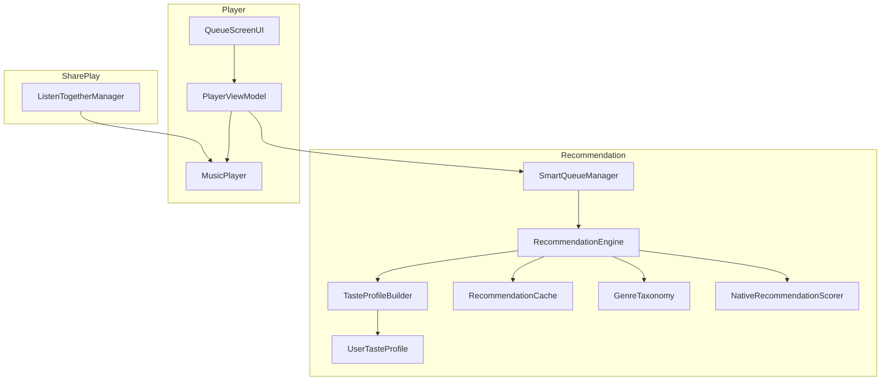
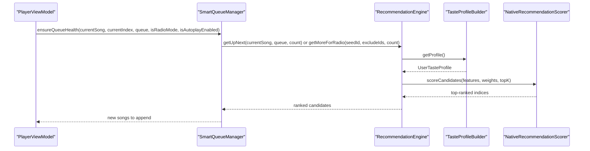
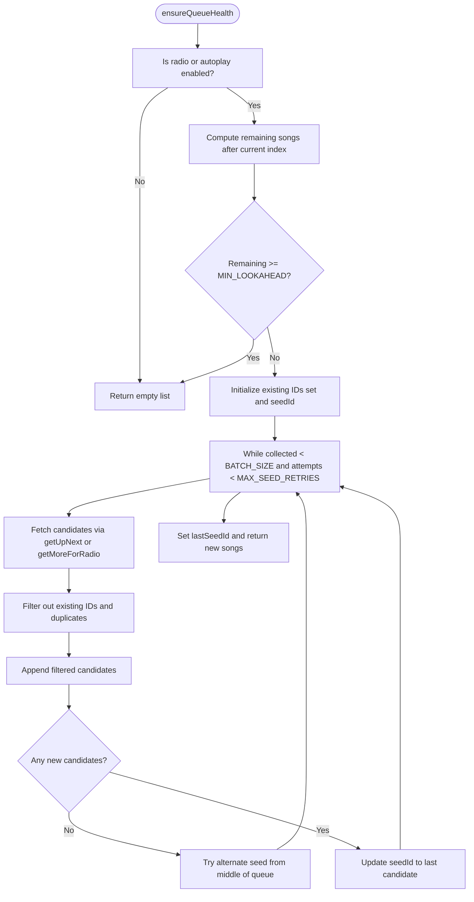
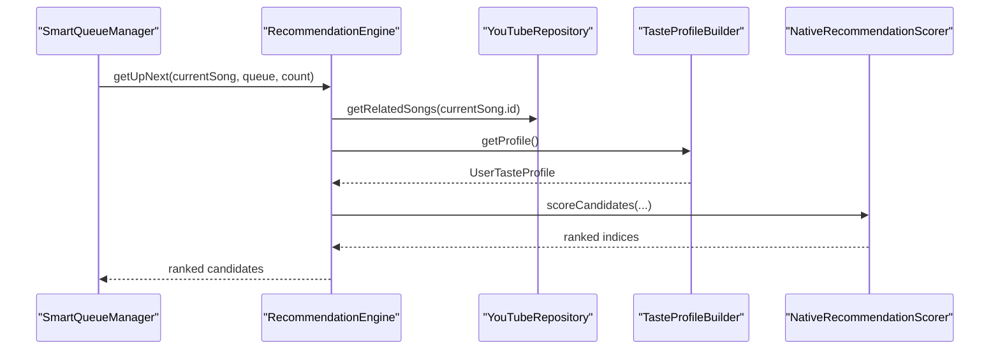
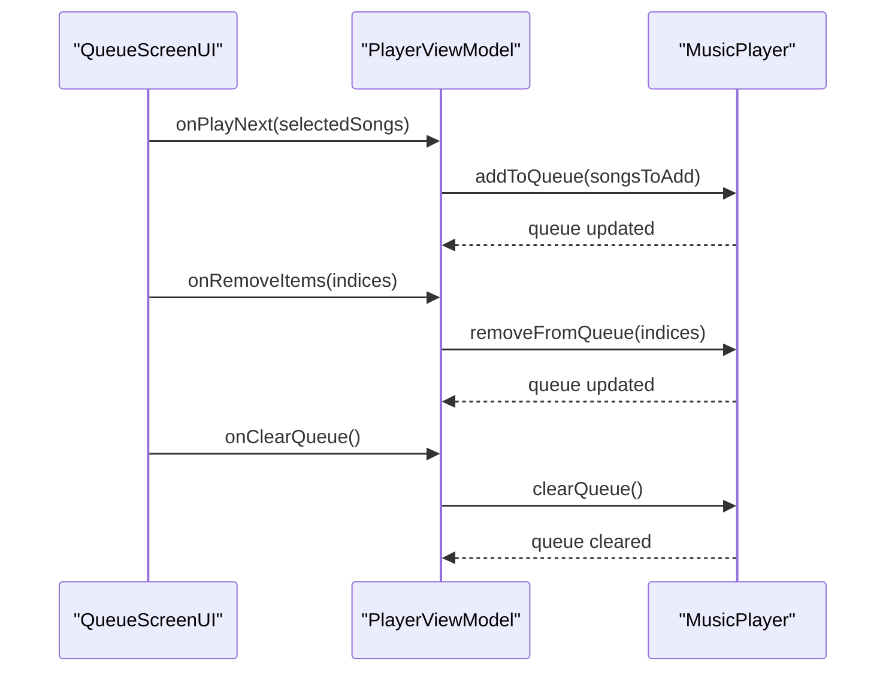
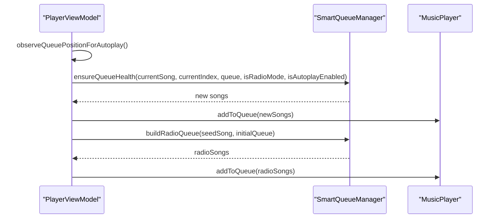
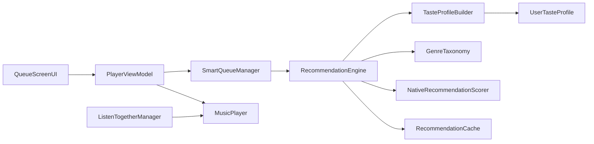

# Smart Queue Management

<cite>
**Referenced Files in This Document**
- [SmartQueueManager.kt](file://app/src/main/java/com/suvojeet/suvmusic/recommendation/SmartQueueManager.kt)
- [RecommendationEngine.kt](file://app/src/main/java/com/suvojeet/suvmusic/recommendation/RecommendationEngine.kt)
- [TasteProfileBuilder.kt](file://app/src/main/java/com/suvojeet/suvmusic/recommendation/TasteProfileBuilder.kt)
- [UserTasteProfile.kt](file://app/src/main/java/com/suvojeet/suvmusic/recommendation/UserTasteProfile.kt)
- [RecommendationCache.kt](file://app/src/main/java/com/suvojeet/suvmusic/recommendation/RecommendationCache.kt)
- [GenreTaxonomy.kt](file://app/src/main/java/com/suvojeet/suvmusic/recommendation/GenreTaxonomy.kt)
- [NativeRecommendationScorer.kt](file://app/src/main/java/com/suvojeet/suvmusic/recommendation/NativeRecommendationScorer.kt)
- [QueueScreenUI.kt](file://app/src/main/java/com/suvojeet/suvmusic/ui/screens/player/components/QueueScreenUI.kt)
- [PlayerViewModel.kt](file://app/src/main/java/com/suvojeet/suvmusic/ui/viewmodel/PlayerViewModel.kt)
- [MusicPlayer.kt](file://app/src/main/java/com/suvojeet/suvmusic/player/MusicPlayer.kt)
- [ListenTogetherManager.kt](file://app/src/main/java/com/suvojeet/suvmusic/shareplay/ListenTogetherManager.kt)
</cite>

## Table of Contents
1. [Introduction](#introduction)
2. [Project Structure](#project-structure)
3. [Core Components](#core-components)
4. [Architecture Overview](#architecture-overview)
5. [Detailed Component Analysis](#detailed-component-analysis)
6. [Dependency Analysis](#dependency-analysis)
7. [Performance Considerations](#performance-considerations)
8. [Troubleshooting Guide](#troubleshooting-guide)
9. [Conclusion](#conclusion)
10. [Appendices](#appendices)

## Introduction
This document explains the Smart Queue Management system that powers dynamic, intelligent playback queues in the application. It focuses on how the SmartQueueManager collaborates with the RecommendationEngine to maintain a healthy, predictive, and user-tailored queue. The system integrates YouTube Music’s recommendation signals with a local user taste profile, enabling features such as radio mode, continuous autoplay, and manual queue editing. It also documents queue intelligence algorithms, composition strategies (familiarity, diversity, and temporal context), queue manipulation controls, and operational concerns like persistence, cross-device synchronization, and performance for large queues.

## Project Structure
The Smart Queue Management spans several modules:
- Recommendation subsystem: SmartQueueManager orchestrates queue generation and health checks; RecommendationEngine produces candidate songs and ranks them; TasteProfileBuilder constructs a user profile; GenreTaxonomy provides genre vectors; RecommendationCache stores computed results; NativeRecommendationScorer accelerates scoring.
- UI and ViewModel: QueueScreenUI renders queue interactions; PlayerViewModel coordinates queue lifecycle and autoplay behavior; MusicPlayer manages runtime queue operations (move/remove/replace).
- SharePlay: ListenTogetherManager handles queue synchronization across devices.

**Diagram sources**
- [SmartQueueManager.kt:1-142](file://app/src/main/java/com/suvojeet/suvmusic/recommendation/SmartQueueManager.kt#L1-L142)
- [RecommendationEngine.kt:1-1277](file://app/src/main/java/com/suvojeet/suvmusic/recommendation/RecommendationEngine.kt#L1-L1277)
- [TasteProfileBuilder.kt:1-338](file://app/src/main/java/com/suvojeet/suvmusic/recommendation/TasteProfileBuilder.kt#L1-L338)
- [UserTasteProfile.kt:1-98](file://app/src/main/java/com/suvojeet/suvmusic/recommendation/UserTasteProfile.kt#L1-L98)
- [RecommendationCache.kt:1-111](file://app/src/main/java/com/suvojeet/suvmusic/recommendation/RecommendationCache.kt#L1-L111)
- [GenreTaxonomy.kt:1-252](file://app/src/main/java/com/suvojeet/suvmusic/recommendation/GenreTaxonomy.kt#L1-L252)
- [NativeRecommendationScorer.kt:1-187](file://app/src/main/java/com/suvojeet/suvmusic/recommendation/NativeRecommendationScorer.kt#L1-L187)
- [QueueScreenUI.kt:1-523](file://app/src/main/java/com/suvojeet/suvmusic/ui/screens/player/components/QueueScreenUI.kt#L1-L523)
- [PlayerViewModel.kt:197-784](file://app/src/main/java/com/suvojeet/suvmusic/ui/viewmodel/PlayerViewModel.kt#L197-L784)
- [MusicPlayer.kt:2071-2176](file://app/src/main/java/com/suvojeet/suvmusic/player/MusicPlayer.kt#L2071-L2176)
- [ListenTogetherManager.kt:525-565](file://app/src/main/java/com/suvojeet/suvmusic/shareplay/ListenTogetherManager.kt#L525-L565)

**Section sources**
- [SmartQueueManager.kt:1-142](file://app/src/main/java/com/suvojeet/suvmusic/recommendation/SmartQueueManager.kt#L1-L142)
- [RecommendationEngine.kt:1-1277](file://app/src/main/java/com/suvojeet/suvmusic/recommendation/RecommendationEngine.kt#L1-L1277)
- [QueueScreenUI.kt:1-523](file://app/src/main/java/com/suvojeet/suvmusic/ui/screens/player/components/QueueScreenUI.kt#L1-L523)
- [PlayerViewModel.kt:197-784](file://app/src/main/java/com/suvojeet/suvmusic/ui/viewmodel/PlayerViewModel.kt#L197-L784)
- [MusicPlayer.kt:2071-2176](file://app/src/main/java/com/suvojeet/suvmusic/player/MusicPlayer.kt#L2071-L2176)
- [ListenTogetherManager.kt:525-565](file://app/src/main/java/com/suvojeet/suvmusic/shareplay/ListenTogetherManager.kt#L525-L565)

## Core Components
- SmartQueueManager: Ensures queue health by prefetching “up next” songs, deduplicating against the current queue, and adapting to radio mode and autoplay. It maintains a last seed ID to keep the radio chain coherent.
- RecommendationEngine: Produces candidates using YouTube Music APIs, multi-seed related suggestions, personalized recommendations, and recent-based suggestions. It deduplicates, filters disliked items, and ranks using the user taste profile and genre vectors.
- TasteProfileBuilder: Builds a UserTasteProfile from listening history, including artist affinities, time-of-day weights, completion rates, frequently skipped songs, liked/disliked artists/songs, recent/top lists, and genre vectors (full, recent, skip).
- RecommendationCache: In-memory cache with TTL for recommendation results and home sections to reduce network calls.
- GenreTaxonomy: Fixed 20-genre taxonomy and keyword-based genre inference used to construct genre vectors.
- NativeRecommendationScorer: JNI bridge to a native SIMD engine for efficient batch scoring and cosine similarity computation.
- QueueScreenUI: Renders queue UI, supports selection, reordering, and queue manipulation actions.
- PlayerViewModel: Coordinates radio mode, autoplay observation, and queue updates.
- MusicPlayer: Performs runtime queue operations (move, remove, replace, clear).
- ListenTogetherManager: Applies remote playback actions including queue removal and clearing.

**Section sources**
- [SmartQueueManager.kt:1-142](file://app/src/main/java/com/suvojeet/suvmusic/recommendation/SmartQueueManager.kt#L1-L142)
- [RecommendationEngine.kt:1-1277](file://app/src/main/java/com/suvojeet/suvmusic/recommendation/RecommendationEngine.kt#L1-L1277)
- [TasteProfileBuilder.kt:1-338](file://app/src/main/java/com/suvojeet/suvmusic/recommendation/TasteProfileBuilder.kt#L1-L338)
- [UserTasteProfile.kt:1-98](file://app/src/main/java/com/suvojeet/suvmusic/recommendation/UserTasteProfile.kt#L1-L98)
- [RecommendationCache.kt:1-111](file://app/src/main/java/com/suvojeet/suvmusic/recommendation/RecommendationCache.kt#L1-L111)
- [GenreTaxonomy.kt:1-252](file://app/src/main/java/com/suvojeet/suvmusic/recommendation/GenreTaxonomy.kt#L1-L252)
- [NativeRecommendationScorer.kt:1-187](file://app/src/main/java/com/suvojeet/suvmusic/recommendation/NativeRecommendationScorer.kt#L1-L187)
- [QueueScreenUI.kt:1-523](file://app/src/main/java/com/suvojeet/suvmusic/ui/screens/player/components/QueueScreenUI.kt#L1-L523)
- [PlayerViewModel.kt:197-784](file://app/src/main/java/com/suvojeet/suvmusic/ui/viewmodel/PlayerViewModel.kt#L197-L784)
- [MusicPlayer.kt:2071-2176](file://app/src/main/java/com/suvojeet/suvmusic/player/MusicPlayer.kt#L2071-L2176)
- [ListenTogetherManager.kt:525-565](file://app/src/main/java/com/suvojeet/suvmusic/shareplay/ListenTogetherManager.kt#L525-L565)

## Architecture Overview
The queue intelligence pipeline integrates YouTube Music signals with local user data:
- Input: current song, queue, user preferences, and mode flags (radio/autoplay/manual).
- Candidate generation: RecommendationEngine fetches related songs, personalized recommendations, and recent-based suggestions.
- Scoring and ranking: NativeRecommendationScorer accelerates scoring using genre vectors, skip penalties, and time-of-day weights from UserTasteProfile.
- Deduplication and filtering: Excludes disliked items, previously queued songs, and duplicates.
- Output: SmartQueueManager returns songs to append to the queue and updates the last seed for continuity.

**Diagram sources**
- [SmartQueueManager.kt:54-105](file://app/src/main/java/com/suvojeet/suvmusic/recommendation/SmartQueueManager.kt#L54-L105)
- [RecommendationEngine.kt:590-701](file://app/src/main/java/com/suvojeet/suvmusic/recommendation/RecommendationEngine.kt#L590-L701)
- [TasteProfileBuilder.kt:63-82](file://app/src/main/java/com/suvojeet/suvmusic/recommendation/TasteProfileBuilder.kt#L63-L82)
- [NativeRecommendationScorer.kt:81-104](file://app/src/main/java/com/suvojeet/suvmusic/recommendation/NativeRecommendationScorer.kt#L81-L104)

## Detailed Component Analysis

### SmartQueueManager
Responsibilities:
- Prefetches “up next” songs when the queue approaches the minimum lookahead threshold.
- Chooses between radio-mode and autoplay-mode strategies using RecommendationEngine.
- Deduplicates candidates against the current queue and previously fetched songs.
- Tracks a last seed ID to maintain continuity for radio/autoplay.

Key behaviors:
- Queue health check: compares remaining songs to a configured minimum and fetches more when needed.
- Multi-seed retry: if no new songs are returned, tries an alternate seed from the middle of the queue.
- Radio queue building: builds an initial queue for a seed song using up-next logic and deduplication.

**Diagram sources**
- [SmartQueueManager.kt:54-105](file://app/src/main/java/com/suvojeet/suvmusic/recommendation/SmartQueueManager.kt#L54-L105)

**Section sources**
- [SmartQueueManager.kt:1-142](file://app/src/main/java/com/suvojeet/suvmusic/recommendation/SmartQueueManager.kt#L1-L142)

### RecommendationEngine
Responsibilities:
- Generates candidates from YouTube Music APIs (official recommendations, related songs, mixes).
- Blends YouTube signals with local taste profile for ranking.
- Implements deduplication and filtering for disliked items and duplicates.
- Provides specialized recommendations: recent-based, artist mix, mood-based, and time/context-aware sections.

Queue intelligence highlights:
- getUpNext: combines related songs, personalized recommendations, recent-based suggestions, and familiarity boosts.
- getMoreForRadio: continuously refines candidates using multi-seed related suggestions and familiarity.
- Deduplication: uses both ID and fingerprint-based deduplication to avoid repeats.
- Filtering: excludes disliked songs/artists and frequently skipped songs.

**Diagram sources**
- [RecommendationEngine.kt:590-645](file://app/src/main/java/com/suvojeet/suvmusic/recommendation/RecommendationEngine.kt#L590-L645)
- [TasteProfileBuilder.kt:63-82](file://app/src/main/java/com/suvojeet/suvmusic/recommendation/TasteProfileBuilder.kt#L63-L82)
- [NativeRecommendationScorer.kt:81-104](file://app/src/main/java/com/suvojeet/suvmusic/recommendation/NativeRecommendationScorer.kt#L81-L104)

**Section sources**
- [RecommendationEngine.kt:584-701](file://app/src/main/java/com/suvojeet/suvmusic/recommendation/RecommendationEngine.kt#L584-L701)

### TasteProfileBuilder and UserTasteProfile
Responsibilities:
- Builds a comprehensive user profile from listening history, including artist affinities, time-of-day weights, completion rates, frequently skipped songs, liked/disliked artists/songs, recent/top lists, and genre vectors.
- Maintains a cached, time-bounded profile snapshot with atomic updates to avoid stale reads.

Key fields:
- Artist affinities, time-of-day weights, average completion rate, frequently skipped IDs, liked/disliked sets, recent/top lists, source distribution, and genre vectors (full, recent, skip).

**Section sources**
- [TasteProfileBuilder.kt:1-338](file://app/src/main/java/com/suvojeet/suvmusic/recommendation/TasteProfileBuilder.kt#L1-L338)
- [UserTasteProfile.kt:1-98](file://app/src/main/java/com/suvojeet/suvmusic/recommendation/UserTasteProfile.kt#L1-L98)

### GenreTaxonomy and NativeRecommendationScorer
Responsibilities:
- GenreTaxonomy defines a fixed 20-genre taxonomy and infers genre vectors from titles and artists.
- NativeRecommendationScorer provides SIMD-accelerated scoring and similarity computations, falling back to Kotlin when native is unavailable.

Scoring features and weights:
- Features include artist affinity, freshness flag, skip flag, liked song/artist flags, time-of-day weight, variety penalty, genre similarity, recent genre similarity, skip genre penalty, and reserved.
- Weights tune the importance of each feature for ranking.

**Section sources**
- [GenreTaxonomy.kt:1-252](file://app/src/main/java/com/suvojeet/suvmusic/recommendation/GenreTaxonomy.kt#L1-L252)
- [NativeRecommendationScorer.kt:1-187](file://app/src/main/java/com/suvojeet/suvmusic/recommendation/NativeRecommendationScorer.kt#L1-L187)

### Queue Manipulation and UI
Capabilities:
- Selection: Select all, select current, and multi-select for batch operations.
- Reordering: Drag-and-drop reordering within the queue.
- Actions: Play next, add to queue, add to playlist, remove selected items, clear queue.
- Autoplay toggle: Enables automatic prefetching and continuation of recommendations.

Runtime operations:
- Move items within the queue.
- Remove items by indices.
- Replace the entire queue while preserving the current position.
- Clear the queue.

**Diagram sources**
- [QueueScreenUI.kt:130-185](file://app/src/main/java/com/suvojeet/suvmusic/ui/screens/player/components/QueueScreenUI.kt#L130-L185)
- [PlayerViewModel.kt:585-606](file://app/src/main/java/com/suvojeet/suvmusic/ui/viewmodel/PlayerViewModel.kt#L585-L606)
- [MusicPlayer.kt:2095-2116](file://app/src/main/java/com/suvojeet/suvmusic/player/MusicPlayer.kt#L2095-L2116)

**Section sources**
- [QueueScreenUI.kt:1-523](file://app/src/main/java/com/suvojeet/suvmusic/ui/screens/player/components/QueueScreenUI.kt#L1-L523)
- [PlayerViewModel.kt:197-621](file://app/src/main/java/com/suvojeet/suvmusic/ui/viewmodel/PlayerViewModel.kt#L197-L621)
- [MusicPlayer.kt:2071-2176](file://app/src/main/java/com/suvojeet/suvmusic/player/MusicPlayer.kt#L2071-L2176)

### Autoplay and Radio Modes
Behavior:
- Autoplay: When nearing the end of the queue, the system observes position and loads more songs using SmartQueueManager.
- Radio: Starts from a seed song, builds a radio queue, and continues generating recommendations with a rolling seed.

**Diagram sources**
- [PlayerViewModel.kt:767-783](file://app/src/main/java/com/suvojeet/suvmusic/ui/viewmodel/PlayerViewModel.kt#L767-L783)
- [SmartQueueManager.kt:54-105](file://app/src/main/java/com/suvojeet/suvmusic/recommendation/SmartQueueManager.kt#L54-L105)

**Section sources**
- [PlayerViewModel.kt:707-761](file://app/src/main/java/com/suvojeet/suvmusic/ui/viewmodel/PlayerViewModel.kt#L707-L761)
- [SmartQueueManager.kt:107-133](file://app/src/main/java/com/suvojeet/suvmusic/recommendation/SmartQueueManager.kt#L107-L133)

### Queue Composition Strategies
- Familiarity balancing: Boosts songs from top artists to maintain comfort while exploring.
- Genre diversity maintenance: Uses genre vectors and variety penalties to avoid repetition.
- Temporal context awareness: Incorporates time-of-day weights and recent genre vectors for session-appropriate recommendations.
- Skip prevention: Filters frequently skipped songs and applies skip genre penalties.

**Section sources**
- [RecommendationEngine.kt:632-640](file://app/src/main/java/com/suvojeet/suvmusic/recommendation/RecommendationEngine.kt#L632-L640)
- [TasteProfileBuilder.kt:157-161](file://app/src/main/java/com/suvojeet/suvmusic/recommendation/TasteProfileBuilder.kt#L157-L161)
- [NativeRecommendationScorer.kt:76-79](file://app/src/main/java/com/suvojeet/suvmusic/recommendation/NativeRecommendationScorer.kt#L76-L79)

### Examples of Queue Generation
- Radio mode: Start from a seed song, build an initial queue using up-next logic, and continue generating recommendations with a rolling seed.
- Shuffle mode: Typically driven by UI selection and manual ordering; queue intelligence can still prefetch and enrich the queue with related suggestions.
- Manual queue editing: Users can reorder, remove, or replace items; the system preserves continuity and avoids duplicates.

**Section sources**
- [PlayerViewModel.kt:707-761](file://app/src/main/java/com/suvojeet/suvmusic/ui/viewmodel/PlayerViewModel.kt#L707-L761)
- [QueueScreenUI.kt:130-185](file://app/src/main/java/com/suvojeet/suvmusic/ui/screens/player/components/QueueScreenUI.kt#L130-L185)
- [MusicPlayer.kt:2071-2176](file://app/src/main/java/com/suvojeet/suvmusic/player/MusicPlayer.kt#L2071-L2176)

### Persistence, Synchronization, and Large Queue Performance
- Persistence: Listening history and derived genre vectors are persisted and cached to accelerate profile building and scoring.
- Synchronization: Queue changes are applied locally; ListenTogetherManager supports queue removal and clearing actions, with synchronization hooks noted for future implementation.
- Performance: Native SIMD scoring dramatically reduces latency; caches minimize repeated network calls; semaphore limits API concurrency; mutex-protected counters and atomic snapshots optimize profile updates.

**Section sources**
- [RecommendationCache.kt:1-111](file://app/src/main/java/com/suvojeet/suvmusic/recommendation/RecommendationCache.kt#L1-L111)
- [ListenTogetherManager.kt:525-565](file://app/src/main/java/com/suvojeet/suvmusic/shareplay/ListenTogetherManager.kt#L525-L565)
- [NativeRecommendationScorer.kt:1-187](file://app/src/main/java/com/suvojeet/suvmusic/recommendation/NativeRecommendationScorer.kt#L1-L187)
- [TasteProfileBuilder.kt:32-111](file://app/src/main/java/com/suvojeet/suvmusic/recommendation/TasteProfileBuilder.kt#L32-L111)

## Dependency Analysis
SmartQueueManager depends on RecommendationEngine for candidate generation and ranking. RecommendationEngine depends on TasteProfileBuilder for user signals, GenreTaxonomy for genre vectors, NativeRecommendationScorer for performance, and RecommendationCache for caching. UI and ViewModel orchestrate runtime queue operations, while MusicPlayer executes queue mutations. ListenTogetherManager coordinates remote queue actions.

**Diagram sources**
- [SmartQueueManager.kt:1-142](file://app/src/main/java/com/suvojeet/suvmusic/recommendation/SmartQueueManager.kt#L1-L142)
- [RecommendationEngine.kt:1-1277](file://app/src/main/java/com/suvojeet/suvmusic/recommendation/RecommendationEngine.kt#L1-L1277)
- [TasteProfileBuilder.kt:1-338](file://app/src/main/java/com/suvojeet/suvmusic/recommendation/TasteProfileBuilder.kt#L1-L338)
- [UserTasteProfile.kt:1-98](file://app/src/main/java/com/suvojeet/suvmusic/recommendation/UserTasteProfile.kt#L1-L98)
- [GenreTaxonomy.kt:1-252](file://app/src/main/java/com/suvojeet/suvmusic/recommendation/GenreTaxonomy.kt#L1-L252)
- [NativeRecommendationScorer.kt:1-187](file://app/src/main/java/com/suvojeet/suvmusic/recommendation/NativeRecommendationScorer.kt#L1-L187)
- [RecommendationCache.kt:1-111](file://app/src/main/java/com/suvojeet/suvmusic/recommendation/RecommendationCache.kt#L1-L111)
- [QueueScreenUI.kt:1-523](file://app/src/main/java/com/suvojeet/suvmusic/ui/screens/player/components/QueueScreenUI.kt#L1-L523)
- [PlayerViewModel.kt:197-784](file://app/src/main/java/com/suvojeet/suvmusic/ui/viewmodel/PlayerViewModel.kt#L197-L784)
- [MusicPlayer.kt:2071-2176](file://app/src/main/java/com/suvojeet/suvmusic/player/MusicPlayer.kt#L2071-L2176)
- [ListenTogetherManager.kt:525-565](file://app/src/main/java/com/suvojeet/suvmusic/shareplay/ListenTogetherManager.kt#L525-L565)

**Section sources**
- [SmartQueueManager.kt:1-142](file://app/src/main/java/com/suvojeet/suvmusic/recommendation/SmartQueueManager.kt#L1-L142)
- [RecommendationEngine.kt:1-1277](file://app/src/main/java/com/suvojeet/suvmusic/recommendation/RecommendationEngine.kt#L1-L1277)

## Performance Considerations
- Native SIMD acceleration: Reduces scoring overhead for large candidate sets.
- Caching: TTL-based caches for recommendations and home sections minimize network usage.
- Concurrency control: Semaphore limits parallel YouTube API calls to prevent throttling.
- Profile caching: Atomic snapshots and periodic rebuilds balance freshness and cost.
- UI responsiveness: Queue operations are executed off the main thread and use efficient list updates.

[No sources needed since this section provides general guidance]

## Troubleshooting Guide
Common issues and mitigations:
- No new songs fetched: The system retries with alternative seeds; verify network connectivity and YouTube API availability.
- Duplicate songs in queue: Deduplication logic filters existing IDs and fingerprints; ensure the queue is not being rebuilt unnecessarily.
- Autoplay not triggering: Verify autoplay flag and queue position thresholds; ensure observeQueuePositionForAutoplay is active.
- Large queue lag: Confirm native scorer availability; enable caching; consider reducing prefetch sizes.

**Section sources**
- [SmartQueueManager.kt:74-105](file://app/src/main/java/com/suvojeet/suvmusic/recommendation/SmartQueueManager.kt#L74-L105)
- [RecommendationEngine.kt:107-127](file://app/src/main/java/com/suvojeet/suvmusic/recommendation/RecommendationEngine.kt#L107-L127)
- [PlayerViewModel.kt:767-783](file://app/src/main/java/com/suvojeet/suvmusic/ui/viewmodel/PlayerViewModel.kt#L767-L783)
- [NativeRecommendationScorer.kt:38-48](file://app/src/main/java/com/suvojeet/suvmusic/recommendation/NativeRecommendationScorer.kt#L38-L48)

## Conclusion
The Smart Queue Management system blends YouTube Music’s recommendation strength with a robust local user model to deliver a seamless, intelligent playback experience. Through prefetching, multi-seed strategies, and genre-aware scoring, it maintains a healthy, diverse, and contextually appropriate queue. The UI and runtime player support extensive manual editing, while native acceleration and caching ensure performance at scale. Future enhancements may include refined cross-device synchronization for queue operations.

[No sources needed since this section summarizes without analyzing specific files]

## Appendices
- API and feature references:
  - SmartQueueManager: [ensureQueueHealth:54-105](file://app/src/main/java/com/suvojeet/suvmusic/recommendation/SmartQueueManager.kt#L54-L105), [buildRadioQueue:115-133](file://app/src/main/java/com/suvojeet/suvmusic/recommendation/SmartQueueManager.kt#L115-L133)
  - RecommendationEngine: [getUpNext:590-645](file://app/src/main/java/com/suvojeet/suvmusic/recommendation/RecommendationEngine.kt#L590-L645), [getMoreForRadio:650-701](file://app/src/main/java/com/suvojeet/suvmusic/recommendation/RecommendationEngine.kt#L650-L701)
  - UI and player: [QueueScreenUI:130-185](file://app/src/main/java/com/suvojeet/suvmusic/ui/screens/player/components/QueueScreenUI.kt#L130-L185), [MusicPlayer:2071-2176](file://app/src/main/java/com/suvojeet/suvmusic/player/MusicPlayer.kt#L2071-L2176)
  - SharePlay: [ListenTogetherManager:525-565](file://app/src/main/java/com/suvojeet/suvmusic/shareplay/ListenTogetherManager.kt#L525-L565)

[No sources needed since this section aggregates references without analysis]