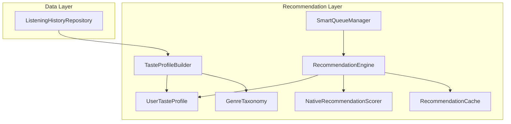
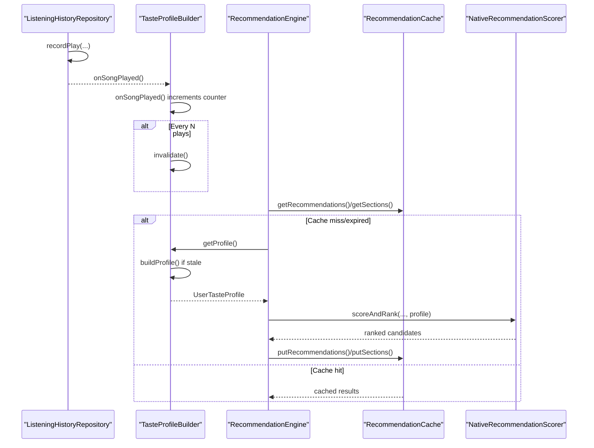
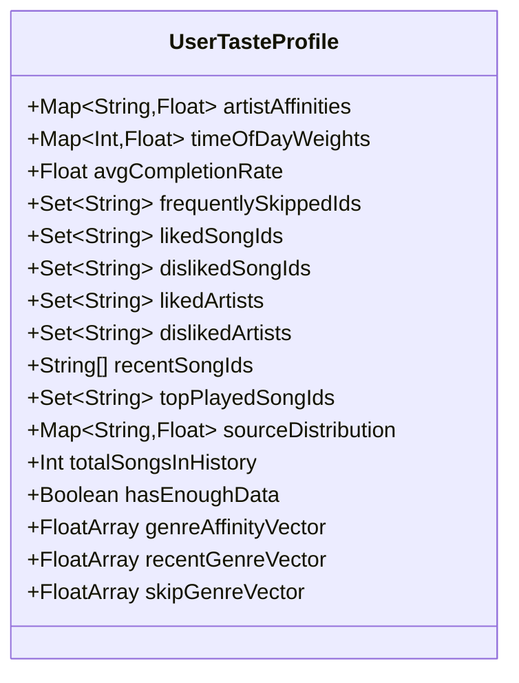
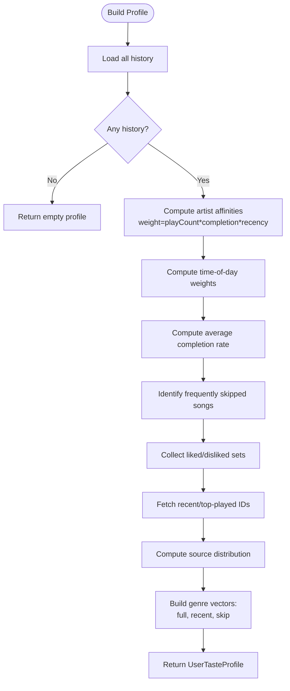
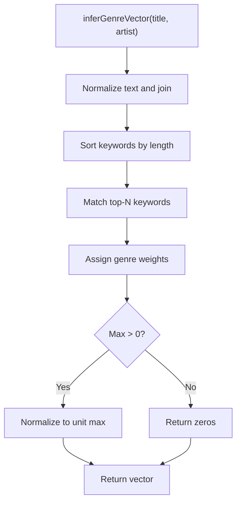
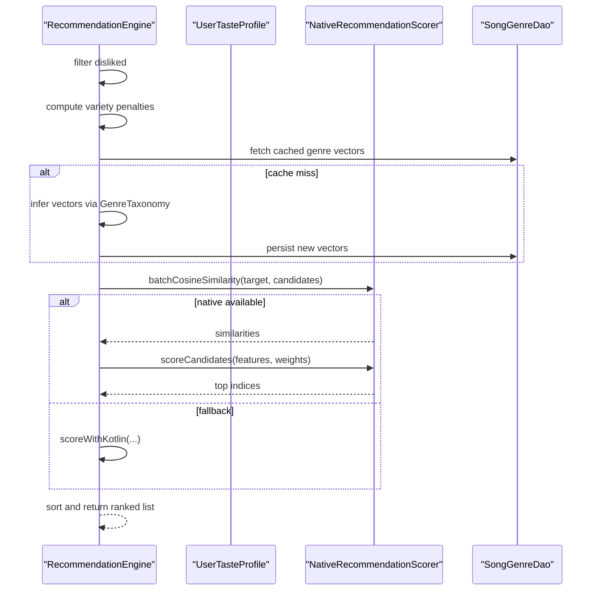
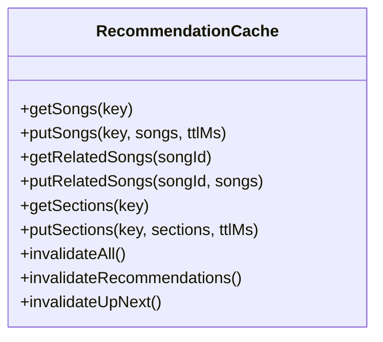
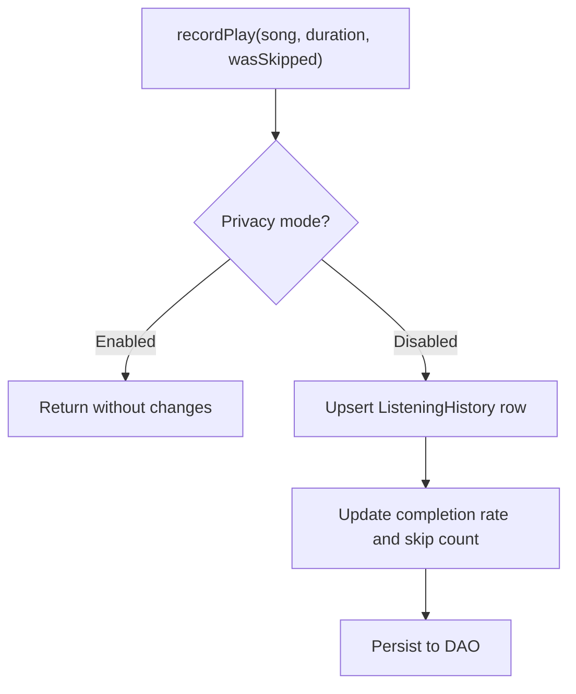
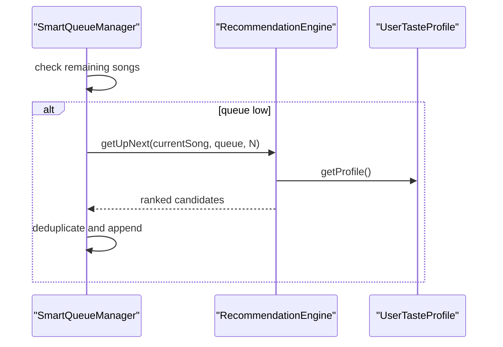
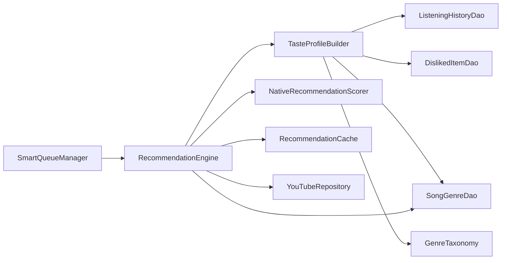

# User Taste Profile

<cite>
**Referenced Files in This Document**
- [UserTasteProfile.kt](file://app/src/main/java/com/suvojeet/suvmusic/recommendation/UserTasteProfile.kt)
- [TasteProfileBuilder.kt](file://app/src/main/java/com/suvojeet/suvmusic/recommendation/TasteProfileBuilder.kt)
- [GenreTaxonomy.kt](file://app/src/main/java/com/suvojeet/suvmusic/recommendation/GenreTaxonomy.kt)
- [RecommendationEngine.kt](file://app/src/main/java/com/suvojeet/suvmusic/recommendation/RecommendationEngine.kt)
- [NativeRecommendationScorer.kt](file://app/src/main/java/com/suvojeet/suvmusic/recommendation/NativeRecommendationScorer.kt)
- [RecommendationCache.kt](file://app/src/main/java/com/suvojeet/suvmusic/recommendation/RecommendationCache.kt)
- [ListeningHistoryRepository.kt](file://app/src/main/java/com/suvojeet/suvmusic/data/repository/ListeningHistoryRepository.kt)
- [SmartQueueManager.kt](file://app/src/main/java/com/suvojeet/suvmusic/recommendation/SmartQueueManager.kt)
</cite>

## Table of Contents
1. [Introduction](#introduction)
2. [Project Structure](#project-structure)
3. [Core Components](#core-components)
4. [Architecture Overview](#architecture-overview)
5. [Detailed Component Analysis](#detailed-component-analysis)
6. [Dependency Analysis](#dependency-analysis)
7. [Performance Considerations](#performance-considerations)
8. [Troubleshooting Guide](#troubleshooting-guide)
9. [Conclusion](#conclusion)
10. [Appendices](#appendices)

## Introduction
This document explains the User Taste Profile system that powers personalization in the application. It describes how listening history is transformed into a compact, efficient UserTasteProfile, how TasteProfileBuilder aggregates signals (artist affinities, time-of-day patterns, genre vectors, skip lists, and more), and how RecommendationEngine uses the profile to score and rank recommendations. It also covers data structures, initialization and refresh mechanisms, memory management, privacy controls, and practical examples of how the profile influences recommendation scoring and queue intelligence.

## Project Structure
The User Taste Profile system spans several recommendation modules:
- Data model: UserTasteProfile defines the profile schema.
- Builder: TasteProfileBuilder constructs and refreshes the profile from local listening history and genre taxonomy.
- Scoring: RecommendationEngine uses the profile to score candidates via a native SIMD engine with a Kotlin fallback.
- Genre inference: GenreTaxonomy provides keyword-based genre vectors and normalization.
- Caching: RecommendationCache stores computed results to reduce recomputation.
- Persistence: ListeningHistoryRepository records play events and updates history.
- Queue: SmartQueueManager leverages the profile to maintain a healthy playback queue.

**Diagram sources**
- [TasteProfileBuilder.kt:27-338](file://app/src/main/java/com/suvojeet/suvmusic/recommendation/TasteProfileBuilder.kt#L27-L338)
- [UserTasteProfile.kt:7-97](file://app/src/main/java/com/suvojeet/suvmusic/recommendation/UserTasteProfile.kt#L7-L97)
- [RecommendationEngine.kt:41-49](file://app/src/main/java/com/suvojeet/suvmusic/recommendation/RecommendationEngine.kt#L41-L49)
- [NativeRecommendationScorer.kt:20-187](file://app/src/main/java/com/suvojeet/suvmusic/recommendation/NativeRecommendationScorer.kt#L20-L187)
- [GenreTaxonomy.kt:10-252](file://app/src/main/java/com/suvojeet/suvmusic/recommendation/GenreTaxonomy.kt#L10-L252)
- [RecommendationCache.kt:14-111](file://app/src/main/java/com/suvojeet/suvmusic/recommendation/RecommendationCache.kt#L14-L111)
- [ListeningHistoryRepository.kt:15-179](file://app/src/main/java/com/suvojeet/suvmusic/data/repository/ListeningHistoryRepository.kt#L15-L179)
- [SmartQueueManager.kt:23-142](file://app/src/main/java/com/suvojeet/suvmusic/recommendation/SmartQueueManager.kt#L23-L142)

**Section sources**
- [UserTasteProfile.kt:7-97](file://app/src/main/java/com/suvojeet/suvmusic/recommendation/UserTasteProfile.kt#L7-L97)
- [TasteProfileBuilder.kt:27-338](file://app/src/main/java/com/suvojeet/suvmusic/recommendation/TasteProfileBuilder.kt#L27-L338)
- [RecommendationEngine.kt:41-49](file://app/src/main/java/com/suvojeet/suvmusic/recommendation/RecommendationEngine.kt#L41-L49)
- [GenreTaxonomy.kt:10-252](file://app/src/main/java/com/suvojeet/suvmusic/recommendation/GenreTaxonomy.kt#L10-L252)
- [RecommendationCache.kt:14-111](file://app/src/main/java/com/suvojeet/suvmusic/recommendation/RecommendationCache.kt#L14-L111)
- [ListeningHistoryRepository.kt:15-179](file://app/src/main/java/com/suvojeet/suvmusic/data/repository/ListeningHistoryRepository.kt#L15-L179)
- [SmartQueueManager.kt:23-142](file://app/src/main/java/com/suvojeet/suvmusic/recommendation/SmartQueueManager.kt#L23-L142)

## Core Components
- UserTasteProfile: Immutable data class capturing:
  - Artist affinities (Map of artist key to score)
  - Time-of-day weights (hour to preference)
  - Average completion rate
  - Frequently skipped song IDs
  - Liked/disliked song and artist sets
  - Recent and top-played song IDs
  - Source distribution (platform usage)
  - Total history size and sufficiency flag
  - Genre vectors: full history, recent session, and skip penalty vectors
- TasteProfileBuilder: Singleton that builds and caches the profile, with TTL and controlled invalidation.
- GenreTaxonomy: Fixed 20-genre taxonomy with keyword-based vector inference and normalization.
- RecommendationEngine: Orchestrates recommendation generation and scoring using the profile.
- NativeRecommendationScorer: JNI bridge to native SIMD scoring and cosine similarity.
- RecommendationCache: In-memory cache with TTL and targeted invalidation.
- ListeningHistoryRepository: Records play events and updates history.
- SmartQueueManager: Maintains queue health using RecommendationEngine’s up-next logic.

**Section sources**
- [UserTasteProfile.kt:7-97](file://app/src/main/java/com/suvojeet/suvmusic/recommendation/UserTasteProfile.kt#L7-L97)
- [TasteProfileBuilder.kt:27-338](file://app/src/main/java/com/suvojeet/suvmusic/recommendation/TasteProfileBuilder.kt#L27-L338)
- [GenreTaxonomy.kt:10-252](file://app/src/main/java/com/suvojeet/suvmusic/recommendation/GenreTaxonomy.kt#L10-L252)
- [RecommendationEngine.kt:41-49](file://app/src/main/java/com/suvojeet/suvmusic/recommendation/RecommendationEngine.kt#L41-L49)
- [NativeRecommendationScorer.kt:20-187](file://app/src/main/java/com/suvojeet/suvmusic/recommendation/NativeRecommendationScorer.kt#L20-L187)
- [RecommendationCache.kt:14-111](file://app/src/main/java/com/suvojeet/suvmusic/recommendation/RecommendationCache.kt#L14-L111)
- [ListeningHistoryRepository.kt:15-179](file://app/src/main/java/com/suvojeet/suvmusic/data/repository/ListeningHistoryRepository.kt#L15-L179)
- [SmartQueueManager.kt:23-142](file://app/src/main/java/com/suvojeet/suvmusic/recommendation/SmartQueueManager.kt#L23-L142)

## Architecture Overview
The system follows a layered approach:
- Data ingestion: ListeningHistoryRepository persists play events and metadata.
- Profile construction: TasteProfileBuilder aggregates signals from Room DAOs and computes vectors.
- Scoring: RecommendationEngine applies the profile to candidates using native SIMD or Kotlin fallback.
- Caching: RecommendationCache avoids repeated computation for sections and queues.
- Queue maintenance: SmartQueueManager ensures continuous, personalized next tracks.

**Diagram sources**
- [ListeningHistoryRepository.kt:24-95](file://app/src/main/java/com/suvojeet/suvmusic/data/repository/ListeningHistoryRepository.kt#L24-L95)
- [TasteProfileBuilder.kt:97-111](file://app/src/main/java/com/suvojeet/suvmusic/recommendation/TasteProfileBuilder.kt#L97-L111)
- [RecommendationEngine.kt:902-943](file://app/src/main/java/com/suvojeet/suvmusic/recommendation/RecommendationEngine.kt#L902-L943)
- [RecommendationCache.kt:52-110](file://app/src/main/java/com/suvojeet/suvmusic/recommendation/RecommendationCache.kt#L52-L110)
- [NativeRecommendationScorer.kt:81-104](file://app/src/main/java/com/suvojeet/suvmusic/recommendation/NativeRecommendationScorer.kt#L81-L104)

## Detailed Component Analysis

### UserTasteProfile Data Model
UserTasteProfile encapsulates:
- Artist affinities: normalized scores for top artists derived from weighted play counts, completion rates, and recency.
- Time-of-day weights: normalized hourly preferences from play counts.
- Completion rate: average percentage of a song listened.
- Skip and like sets: IDs and artist keys for frequent skips, likes, and dislikes.
- Recent/top-played IDs: ordered and unordered collections for familiarity and freshness.
- Source distribution: platform usage proportions.
- History stats: total count and sufficiency threshold.
- Genre vectors: full, recent session, and skip penalty vectors, each a FloatArray sized to GenreTaxonomy.GENRE_COUNT.

**Diagram sources**
- [UserTasteProfile.kt:7-97](file://app/src/main/java/com/suvojeet/suvmusic/recommendation/UserTasteProfile.kt#L7-L97)

**Section sources**
- [UserTasteProfile.kt:7-97](file://app/src/main/java/com/suvojeet/suvmusic/recommendation/UserTasteProfile.kt#L7-L97)

### TasteProfileBuilder: Aggregation and Refresh
Responsibilities:
- Build a profile from Room DAOs and GenreTaxonomy.
- Maintain a cached snapshot with TTL and thread-safe refresh.
- Control rebuild frequency via a play-event counter and immediate invalidation hooks.
- Compute:
  - Artist affinities with recency decay and completion weighting.
  - Time-of-day weights from last-play timestamps.
  - Average completion rate.
  - Frequently skipped songs and persistent dislikes.
  - Liked/disliked artists and song sets.
  - Recent and top-played song IDs.
  - Source distribution across platforms.
  - Genre vectors:
    - Full: weighted sum by play counts, normalized.
    - Recent: averaged over last N plays.
    - Skip: averaged over frequently skipped songs.

**Diagram sources**
- [TasteProfileBuilder.kt:113-237](file://app/src/main/java/com/suvojeet/suvmusic/recommendation/TasteProfileBuilder.kt#L113-L237)
- [GenreTaxonomy.kt:203-231](file://app/src/main/java/com/suvojeet/suvmusic/recommendation/GenreTaxonomy.kt#L203-L231)

**Section sources**
- [TasteProfileBuilder.kt:27-338](file://app/src/main/java/com/suvojeet/suvmusic/recommendation/TasteProfileBuilder.kt#L27-L338)

### GenreTaxonomy: Keyword-Based Inference
- Defines 20 genres and a keyword-to-genre mapping.
- Infers a FloatArray vector for a song title/artist pair by matching keywords and normalizes to unit maximum.
- Provides top-N genres and non-zero checks for safety.

**Diagram sources**
- [GenreTaxonomy.kt:203-231](file://app/src/main/java/com/suvojeet/suvmusic/recommendation/GenreTaxonomy.kt#L203-L231)

**Section sources**
- [GenreTaxonomy.kt:10-252](file://app/src/main/java/com/suvojeet/suvmusic/recommendation/GenreTaxonomy.kt#L10-L252)

### RecommendationEngine: Scoring and Ranking
- Uses the profile to score candidates via:
  - Dislike filtering (song and artist).
  - Variety penalty to avoid artist repetition.
  - Genre similarity against full, recent, and skip vectors.
  - Freshness, skip flags, liked flags, time-of-day weights.
- Native path marshals features into a SoA FloatArray and calls native scoring; falls back to Kotlin otherwise.
- Computes cosine similarities using native batch operations when available.

**Diagram sources**
- [RecommendationEngine.kt:902-1099](file://app/src/main/java/com/suvojeet/suvmusic/recommendation/RecommendationEngine.kt#L902-L1099)
- [NativeRecommendationScorer.kt:81-145](file://app/src/main/java/com/suvojeet/suvmusic/recommendation/NativeRecommendationScorer.kt#L81-L145)
- [GenreTaxonomy.kt:203-231](file://app/src/main/java/com/suvojeet/suvmusic/recommendation/GenreTaxonomy.kt#L203-L231)

**Section sources**
- [RecommendationEngine.kt:875-1099](file://app/src/main/java/com/suvojeet/suvmusic/recommendation/RecommendationEngine.kt#L875-L1099)
- [NativeRecommendationScorer.kt:20-187](file://app/src/main/java/com/suvojeet/suvmusic/recommendation/NativeRecommendationScorer.kt#L20-L187)

### RecommendationCache: Memory Management and TTL
- Stores song lists and home sections with TTLs.
- Provides targeted invalidation:
  - invalidateAll on auth changes.
  - invalidateRecommendations after listens.
  - invalidateUpNext for queue refreshes.

**Diagram sources**
- [RecommendationCache.kt:14-111](file://app/src/main/java/com/suvojeet/suvmusic/recommendation/RecommendationCache.kt#L14-L111)

**Section sources**
- [RecommendationCache.kt:14-111](file://app/src/main/java/com/suvojeet/suvmusic/recommendation/RecommendationCache.kt#L14-L111)

### ListeningHistoryRepository: Privacy Controls and Data Retention
- Records play events, updating counts, durations, completion rates, and last-play timestamps.
- Honors privacy mode to skip recording when enabled.
- Provides cleanupOldEntries to remove entries older than a threshold.

**Diagram sources**
- [ListeningHistoryRepository.kt:24-95](file://app/src/main/java/com/suvojeet/suvmusic/data/repository/ListeningHistoryRepository.kt#L24-L95)

**Section sources**
- [ListeningHistoryRepository.kt:15-179](file://app/src/main/java/com/suvojeet/suvmusic/data/repository/ListeningHistoryRepository.kt#L15-L179)

### SmartQueueManager: Queue Intelligence
- Ensures queue health by pre-fetching “up next” songs.
- Uses RecommendationEngine’s getUpNext/getMoreForRadio with deduplication and skip avoidance.
- Adapts to radio mode and autoplay, resetting state when needed.

**Diagram sources**
- [SmartQueueManager.kt:54-105](file://app/src/main/java/com/suvojeet/suvmusic/recommendation/SmartQueueManager.kt#L54-L105)
- [RecommendationEngine.kt:590-645](file://app/src/main/java/com/suvojeet/suvmusic/recommendation/RecommendationEngine.kt#L590-L645)

**Section sources**
- [SmartQueueManager.kt:23-142](file://app/src/main/java/com/suvojeet/suvmusic/recommendation/SmartQueueManager.kt#L23-L142)
- [RecommendationEngine.kt:590-645](file://app/src/main/java/com/suvojeet/suvmusic/recommendation/RecommendationEngine.kt#L590-L645)

## Dependency Analysis
- TasteProfileBuilder depends on:
  - ListeningHistoryDao, DislikedItemDao, SongGenreDao for persistence.
  - GenreTaxonomy for keyword-based inference.
- RecommendationEngine depends on:
  - TasteProfileBuilder for profile.
  - NativeRecommendationScorer for SIMD scoring.
  - RecommendationCache for caching.
  - YouTubeRepository for primary recommendation signals.
  - SongGenreDao for genre vectors.
- SmartQueueManager depends on RecommendationEngine for up-next logic.

**Diagram sources**
- [TasteProfileBuilder.kt:27-31](file://app/src/main/java/com/suvojeet/suvmusic/recommendation/TasteProfileBuilder.kt#L27-L31)
- [RecommendationEngine.kt:41-49](file://app/src/main/java/com/suvojeet/suvmusic/recommendation/RecommendationEngine.kt#L41-L49)
- [SmartQueueManager.kt:23-25](file://app/src/main/java/com/suvojeet/suvmusic/recommendation/SmartQueueManager.kt#L23-L25)

**Section sources**
- [TasteProfileBuilder.kt:27-338](file://app/src/main/java/com/suvojeet/suvmusic/recommendation/TasteProfileBuilder.kt#L27-L338)
- [RecommendationEngine.kt:41-49](file://app/src/main/java/com/suvojeet/suvmusic/recommendation/RecommendationEngine.kt#L41-L49)
- [SmartQueueManager.kt:23-142](file://app/src/main/java/com/suvojeet/suvmusic/recommendation/SmartQueueManager.kt#L23-L142)

## Performance Considerations
- Native SIMD scoring:
  - Single JNI call to score N candidates with 11 features.
  - Batch cosine similarity for genre vectors.
  - Fallback to Kotlin when native is unavailable.
- Caching:
  - In-memory caches with TTLs for sections and song lists.
  - Short TTL for volatile data like “up next.”
- Controlled rebuilds:
  - Profile TTL of 10 minutes.
  - Play-event counter invalidates every N plays to balance freshness and cost.
- Memory:
  - FloatArray vectors sized to GenreTaxonomy.GENRE_COUNT.
  - Invalidation hooks to clear stale caches.

[No sources needed since this section provides general guidance]

## Troubleshooting Guide
- Profile not updating:
  - Verify onSongPlayed increments and invalidation occurs every N plays.
  - Confirm forceRefresh path when needed.
- No recommendations:
  - Check hasEnoughData flag and minimum thresholds.
  - Ensure cache is invalidated after listens.
- Poor genre similarity:
  - Confirm GenreTaxonomy keyword coverage and vector normalization.
  - Verify persisted genre vectors in Room.
- Queue not refilling:
  - Ensure SmartQueueManager is invoked and RecommendationEngine’s up-next logic is reachable.
  - Confirm cache invalidation for “up next.”

**Section sources**
- [TasteProfileBuilder.kt:63-111](file://app/src/main/java/com/suvojeet/suvmusic/recommendation/TasteProfileBuilder.kt#L63-L111)
- [RecommendationEngine.kt:902-943](file://app/src/main/java/com/suvojeet/suvmusic/recommendation/RecommendationEngine.kt#L902-L943)
- [RecommendationCache.kt:88-110](file://app/src/main/java/com/suvojeet/suvmusic/recommendation/RecommendationCache.kt#L88-L110)
- [GenreTaxonomy.kt:203-231](file://app/src/main/java/com/suvojeet/suvmusic/recommendation/GenreTaxonomy.kt#L203-L231)
- [SmartQueueManager.kt:54-105](file://app/src/main/java/com/suvojeet/suvmusic/recommendation/SmartQueueManager.kt#L54-L105)

## Conclusion
The User Taste Profile system combines local listening history with keyword-based genre inference and native SIMD scoring to deliver personalized recommendations and a robust queue. Its design balances freshness, performance, and memory efficiency through controlled invalidation, caching, and native acceleration. Privacy and data retention are respected via repository-level controls and periodic cleanup.

[No sources needed since this section summarizes without analyzing specific files]

## Appendices

### Profile Initialization and Refresh Mechanisms
- Initialization: Empty profile returned when history is empty.
- Refresh: TTL-based lazy rebuild guarded by a mutex; invalidation triggered by play events and explicit calls.

**Section sources**
- [TasteProfileBuilder.kt:63-111](file://app/src/main/java/com/suvojeet/suvmusic/recommendation/TasteProfileBuilder.kt#L63-L111)

### Data Structures Summary
- Genre vectors: FloatArray of size GenreTaxonomy.GENRE_COUNT.
- Sets and maps: Efficient lookups for IDs and artist keys.
- Lists: Ordered recent IDs for freshness boosts.

**Section sources**
- [UserTasteProfile.kt:7-97](file://app/src/main/java/com/suvojeet/suvmusic/recommendation/UserTasteProfile.kt#L7-L97)
- [GenreTaxonomy.kt:12-12](file://app/src/main/java/com/suvojeet/suvmusic/recommendation/GenreTaxonomy.kt#L12-L12)

### Privacy and Data Retention
- Privacy mode disables recording play events.
- Cleanup removes entries older than a threshold.
- Dislike sets are synchronized in-memory and persisted.

**Section sources**
- [ListeningHistoryRepository.kt:24-95](file://app/src/main/java/com/suvojeet/suvmusic/data/repository/ListeningHistoryRepository.kt#L24-L95)
- [ListeningHistoryRepository.kt:166-169](file://app/src/main/java/com/suvojeet/suvmusic/data/repository/ListeningHistoryRepository.kt#L166-L169)
- [RecommendationEngine.kt:69-87](file://app/src/main/java/com/suvojeet/suvmusic/recommendation/RecommendationEngine.kt#L69-L87)

### Example: How the Profile Influences Recommendation Scoring
- Artist affinity: Boosts score for familiar artists.
- Freshness: Penalizes songs recently played in the profile.
- Skip flags: Strong penalty for frequently skipped songs.
- Liked flags: Small boost for liked songs/artists.
- Time-of-day: Adjusts score based on preferred hours.
- Genre similarity: Aligns candidate genres with full and recent vectors; skip vector penalizes undesired genres.
- Variety penalty: Reduces repeated artists beyond a threshold.

**Section sources**
- [RecommendationEngine.kt:967-988](file://app/src/main/java/com/suvojeet/suvmusic/recommendation/RecommendationEngine.kt#L967-L988)
- [RecommendationEngine.kt:1017-1031](file://app/src/main/java/com/suvojeet/suvmusic/recommendation/RecommendationEngine.kt#L1017-L1031)