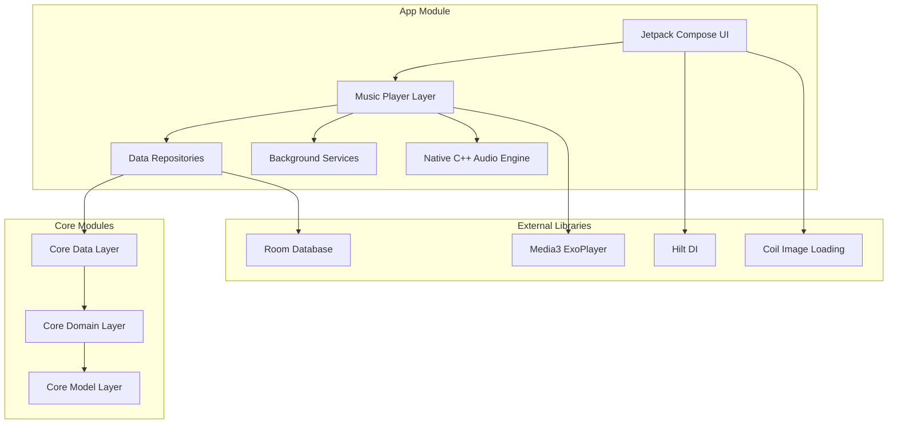
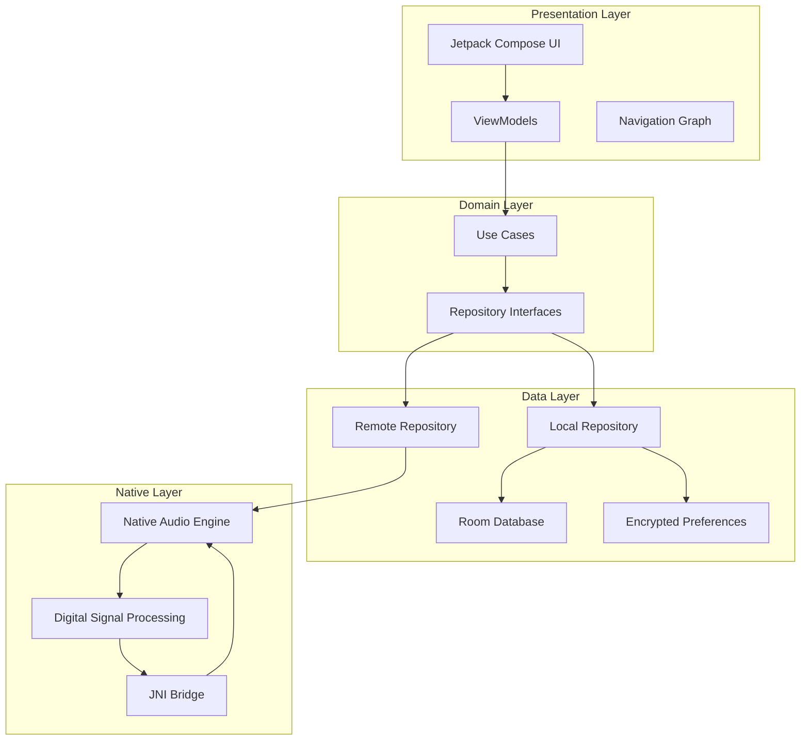
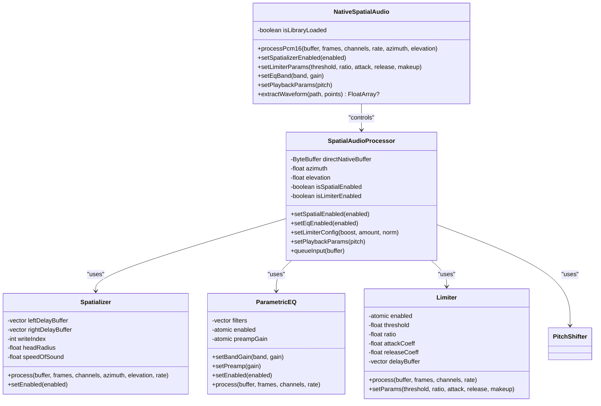
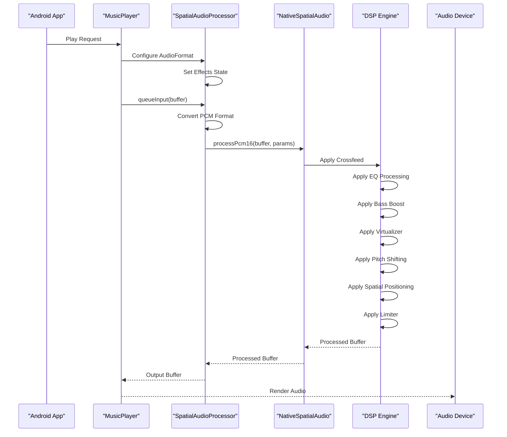
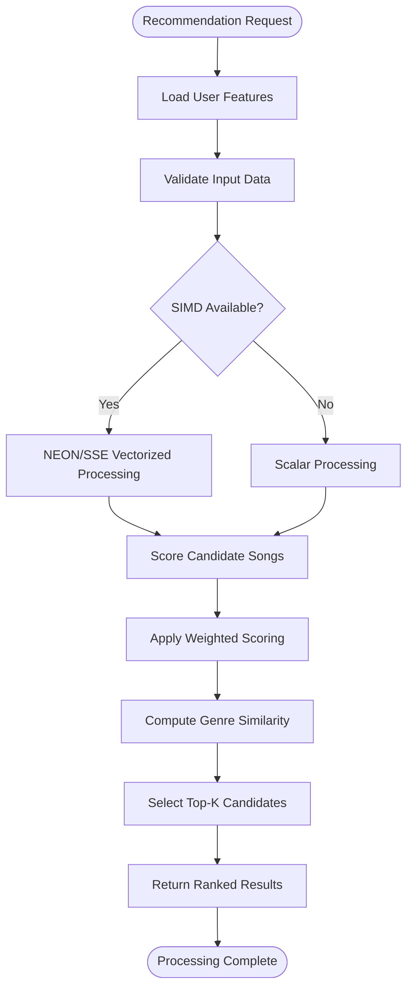
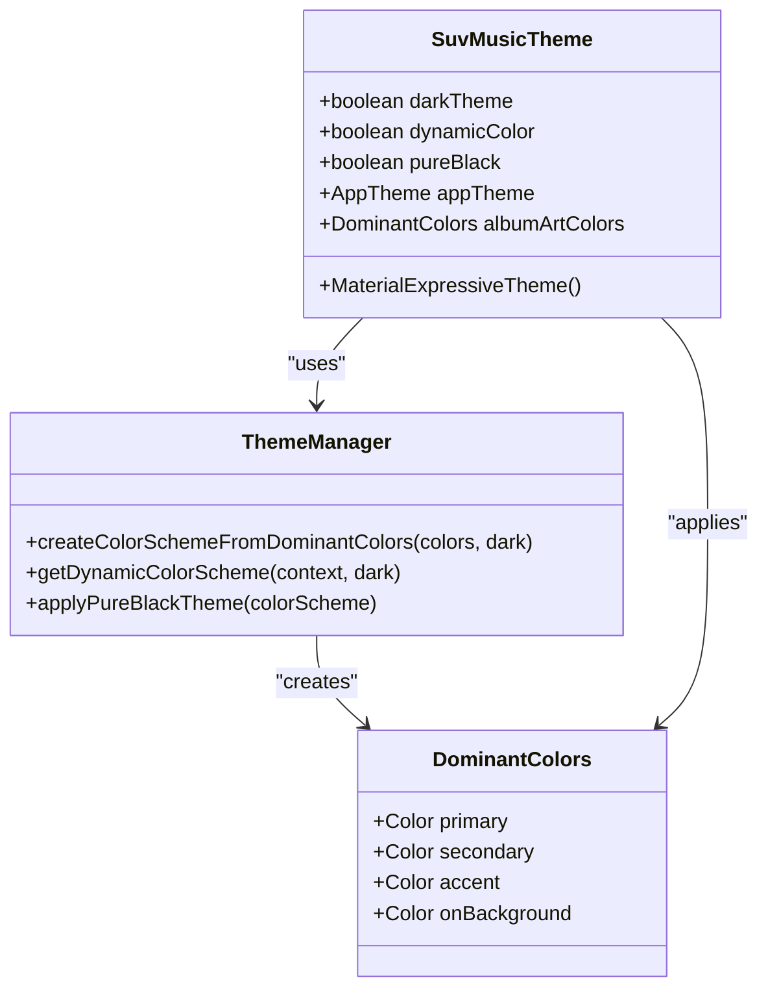
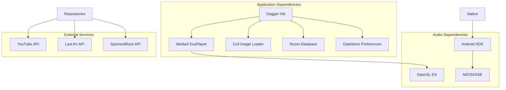

# Project Overview

<cite>
**Referenced Files in This Document**
- [README.md](file://README.md)
- [MainActivity.kt](file://app/src/main/java/com/suvojeet/suvmusic/MainActivity.kt)
- [SuvMusicApplication.kt](file://app/src/main/java/com/suvojeet/suvmusic/SuvMusicApplication.kt)
- [app/build.gradle.kts](file://app/build.gradle.kts)
- [libs.versions.toml](file://gradle/libs.versions.toml)
- [CMakeLists.txt](file://app/src/main/cpp/CMakeLists.txt)
- [biquad.h](file://app/src/main/cpp/biquad.h)
- [limiter.h](file://app/src/main/cpp/limiter.h)
- [spatial_audio.cpp](file://app/src/main/cpp/spatial_audio.cpp)
- [pitch_shifter.h](file://app/src/main/cpp/pitch_shifter.h)
- [recommendation_scorer.cpp](file://app/src/main/cpp/recommendation_scorer.cpp)
- [MusicPlayer.kt](file://app/src/main/java/com/suvojeet/suvmusic/player/MusicPlayer.kt)
- [NativeSpatialAudio.kt](file://app/src/main/java/com/suvojeet/suvmusic/player/NativeSpatialAudio.kt)
- [SpatialAudioProcessor.kt](file://app/src/main/java/com/suvojeet/suvmusic/player/SpatialAudioProcessor.kt)
- [NavGraph.kt](file://app/src/main/java/com/suvojeet/suvmusic/navigation/NavGraph.kt)
- [Theme.kt](file://app/src/main/java/com/suvojeet/suvmusic/ui/theme/Theme.kt)
- [SessionManager.kt](file://app/src/main/java/com/suvojeet/suvmusic/data/SessionManager.kt)
</cite>

## Table of Contents
1. [Introduction](#introduction)
2. [Project Structure](#project-structure)
3. [Core Components](#core-components)
4. [Architecture Overview](#architecture-overview)
5. [Detailed Component Analysis](#detailed-component-analysis)
6. [Dependency Analysis](#dependency-analysis)
7. [Performance Considerations](#performance-considerations)
8. [Troubleshooting Guide](#troubleshooting-guide)
9. [Conclusion](#conclusion)

## Introduction
SuvMusic is a high-fidelity music streaming application for Android designed for high-resolution audio enthusiasts. It combines a modern, reactive UI built with Jetpack Compose and a custom native C++ audio engine to deliver professional-grade audio processing, bridging the gap between cloud streaming and local playback. The project emphasizes advanced audio engineering, immersive user experiences, and robust architecture patterns.

Key differentiators:
- Native audio engine with parametric EQ, spatial audio, limiter, and pitch-shifting
- Material 3 dynamic theming with album-art-based color adaptation
- Listen Together real-time synchronized playback
- Comprehensive lyrics integration and music haptics
- Persistent logging and crash reporting for diagnostics

**Section sources**
- [README.md:1-143](file://README.md#L1-L143)

## Project Structure
The project follows a modular Android architecture with clear separation between UI, data, domain, and native audio layers. The application is structured as a multi-module Gradle project with the main app module containing UI, repositories, services, and native C++ components.

**Diagram sources**
- [app/build.gradle.kts:140-265](file://app/build.gradle.kts#L140-L265)
- [libs.versions.toml:39-162](file://gradle/libs.versions.toml#L39-L162)

**Section sources**
- [app/build.gradle.kts:14-110](file://app/build.gradle.kts#L14-L110)
- [libs.versions.toml:1-162](file://gradle/libs.versions.toml#L1-L162)

## Core Components
SuvMusic's core functionality revolves around three pillars: the native audio engine, the reactive UI layer, and the data management system.

### Native Audio Engine
The native audio engine provides professional-grade audio processing through carefully crafted C++ components:
- **Spatial Audio Processing**: Real-time 3D sound positioning with ITD/ILD head shadowing models
- **Parametric EQ**: 10-band ISO standard equalizer with adjustable bands
- **Limiter**: Hard limiter with lookahead processing for peak protection
- **Pitch Shifter**: High-quality pitch adjustment using dual delay-line technique
- **Crossfeed**: Headphone crossfeed simulation for speaker-like audio
- **Recommendation Scoring**: SIMD-accelerated recommendation engine using NEON/SSE

### UI Architecture
The UI layer implements a modern MVVM pattern with Jetpack Compose:
- **Material 3 Design System**: Dynamic theming with album-art-based color schemes
- **Responsive Layouts**: Adaptive designs for phones, tablets, and TV devices
- **State Management**: Reactive state flows with Hilt dependency injection
- **Navigation**: Type-safe navigation with destination-based routing

### Data Management
The data layer provides robust persistence and synchronization:
- **Room Database**: Local music library and user preferences storage
- **DataStore**: Encrypted preferences for sensitive user data
- **Repository Pattern**: Clean separation between local and remote data sources
- **Background Workers**: Efficient caching and synchronization tasks

**Section sources**
- [spatial_audio.cpp:16-475](file://app/src/main/cpp/spatial_audio.cpp#L16-L475)
- [biquad.h:17-125](file://app/src/main/cpp/biquad.h#L17-L125)
- [limiter.h:10-51](file://app/src/main/cpp/limiter.h#L10-L51)
- [pitch_shifter.h:14-109](file://app/src/main/cpp/pitch_shifter.h#L14-L109)
- [recommendation_scorer.cpp:1-503](file://app/src/main/cpp/recommendation_scorer.cpp#L1-L503)

## Architecture Overview
SuvMusic employs a Clean Architecture with MVVM pattern, implementing separation of concerns across multiple layers while maintaining high performance and user experience.

**Diagram sources**
- [MainActivity.kt:96-340](file://app/src/main/java/com/suvojeet/suvmusic/MainActivity.kt#L96-L340)
- [NavGraph.kt:54-692](file://app/src/main/java/com/suvojeet/suvmusic/navigation/NavGraph.kt#L54-L692)
- [MusicPlayer.kt:58-198](file://app/src/main/java/com/suvojeet/suvmusic/player/MusicPlayer.kt#L58-L198)

The architecture ensures:
- **Separation of Concerns**: Clear boundaries between UI, business logic, and data layers
- **Testability**: Dependency injection enables easy mocking and testing
- **Maintainability**: Modular structure supports team collaboration and feature development
- **Performance**: Native audio processing minimizes CPU overhead and latency

**Section sources**
- [MainActivity.kt:96-340](file://app/src/main/java/com/suvojeet/suvmusic/MainActivity.kt#L96-L340)
- [NavGraph.kt:54-692](file://app/src/main/java/com/suvojeet/suvmusic/navigation/NavGraph.kt#L54-L692)
- [Theme.kt:209-306](file://app/src/main/java/com/suvojeet/suvmusic/ui/theme/Theme.kt#L209-L306)

## Detailed Component Analysis

### Native Audio Engine Architecture
The native audio engine forms the technical backbone of SuvMusic's high-fidelity audio capabilities.

**Diagram sources**
- [NativeSpatialAudio.kt:9-158](file://app/src/main/java/com/suvojeet/suvmusic/player/NativeSpatialAudio.kt#L9-L158)
- [SpatialAudioProcessor.kt:13-243](file://app/src/main/java/com/suvojeet/suvmusic/player/SpatialAudioProcessor.kt#L13-L243)
- [spatial_audio.cpp:16-104](file://app/src/main/cpp/spatial_audio.cpp#L16-L104)
- [biquad.h:17-125](file://app/src/main/cpp/biquad.h#L17-L125)
- [limiter.h:10-51](file://app/src/main/cpp/limiter.h#L10-L51)

### Audio Processing Pipeline
The audio processing pipeline demonstrates the sophisticated signal chain used for high-fidelity playback.

**Diagram sources**
- [MusicPlayer.kt:76-198](file://app/src/main/java/com/suvojeet/suvmusic/player/MusicPlayer.kt#L76-L198)
- [SpatialAudioProcessor.kt:113-242](file://app/src/main/java/com/suvojeet/suvmusic/player/SpatialAudioProcessor.kt#L113-L242)
- [spatial_audio.cpp:347-475](file://app/src/main/cpp/spatial_audio.cpp#L347-L475)

### Recommendation Engine
The native recommendation engine leverages SIMD acceleration for efficient music discovery.

**Diagram sources**
- [recommendation_scorer.cpp:166-322](file://app/src/main/cpp/recommendation_scorer.cpp#L166-L322)
- [recommendation_scorer.cpp:328-344](file://app/src/main/cpp/recommendation_scorer.cpp#L328-L344)

**Section sources**
- [NativeSpatialAudio.kt:9-158](file://app/src/main/java/com/suvojeet/suvmusic/player/NativeSpatialAudio.kt#L9-L158)
- [SpatialAudioProcessor.kt:13-243](file://app/src/main/java/com/suvojeet/suvmusic/player/SpatialAudioProcessor.kt#L13-L243)
- [spatial_audio.cpp:16-475](file://app/src/main/cpp/spatial_audio.cpp#L16-L475)
- [recommendation_scorer.cpp:1-503](file://app/src/main/cpp/recommendation_scorer.cpp#L1-L503)

### UI and Theming System
SuvMusic implements a sophisticated theming system that adapts to user preferences and album artwork.

**Diagram sources**
- [Theme.kt:209-306](file://app/src/main/java/com/suvojeet/suvmusic/ui/theme/Theme.kt#L209-L306)
- [Theme.kt:155-205](file://app/src/main/java/com/suvojeet/suvmusic/ui/theme/Theme.kt#L155-L205)

**Section sources**
- [Theme.kt:209-306](file://app/src/main/java/com/suvojeet/suvmusic/ui/theme/Theme.kt#L209-L306)
- [SessionManager.kt:343-354](file://app/src/main/java/com/suvojeet/suvmusic/data/SessionManager.kt#L343-L354)

## Dependency Analysis
The project maintains clean dependency relationships through dependency injection and modular architecture.

**Diagram sources**
- [app/build.gradle.kts:140-265](file://app/build.gradle.kts#L140-L265)
- [libs.versions.toml:39-162](file://gradle/libs.versions.toml#L39-L162)

**Section sources**
- [app/build.gradle.kts:140-265](file://app/build.gradle.kts#L140-L265)
- [libs.versions.toml:39-162](file://gradle/libs.versions.toml#L39-L162)

## Performance Considerations
SuvMusic implements several performance optimizations to ensure smooth operation across diverse Android devices:

### Native Performance Optimizations
- **SIMD Acceleration**: NEON and SSE instructions for vectorized processing
- **Memory Management**: Carefully managed buffers to minimize allocations
- **Efficient Data Structures**: Optimized for audio processing throughput
- **Multi-threading**: Background processing for heavy computations

### UI Performance
- **Jetpack Compose Optimization**: Efficient recomposition and state management
- **Lazy Loading**: Images and lists use lazy evaluation
- **Adaptive Rendering**: Dynamic refresh rates and GPU optimization
- **Memory Efficiency**: Proper lifecycle management and resource cleanup

### Audio Processing Efficiency
- **Lookahead Processing**: Minimizes latency in audio effects
- **Buffer Management**: Optimized buffer sizes for different scenarios
- **Selective Processing**: Effects applied only when active
- **Hardware Acceleration**: Leverages device-specific optimizations

## Troubleshooting Guide
Common issues and their solutions:

### Audio Quality Issues
- **Static or Distorted Audio**: Check limiter settings and ensure proper gain staging
- **Latency Problems**: Verify lookahead buffer settings and device compatibility
- **EQ Not Responding**: Confirm equalizer is enabled and bands are properly configured

### Performance Issues
- **High CPU Usage**: Reduce effect complexity or disable unused features
- **Battery Drain**: Disable background processing when not needed
- **Memory Leaks**: Ensure proper cleanup of native resources

### Integration Issues
- **YouTube Authentication**: Verify API credentials and network connectivity
- **Lyrics Providers**: Check provider availability and network access
- **Background Services**: Ensure proper permissions for background operation

**Section sources**
- [SuvMusicApplication.kt:40-82](file://app/src/main/java/com/suvojeet/suvmusic/SuvMusicApplication.kt#L40-L82)
- [MusicPlayer.kt:480-500](file://app/src/main/java/com/suvojeet/suvmusic/player/MusicPlayer.kt#L480-L500)

## Conclusion
SuvMusic represents a sophisticated approach to Android music streaming, combining cutting-edge audio engineering with modern mobile development practices. The project successfully bridges the gap between cloud streaming and professional local playback through its custom native audio engine, while maintaining excellent user experience through thoughtful UI design and robust architecture.

The modular design, extensive use of modern Android technologies, and commitment to high-fidelity audio make SuvMusic an exemplary case study in building professional-grade mobile applications. The codebase demonstrates best practices in performance optimization, dependency management, and user experience design that serve as valuable references for Android developers working on similar projects.