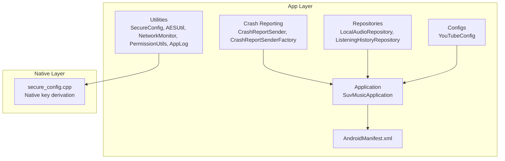
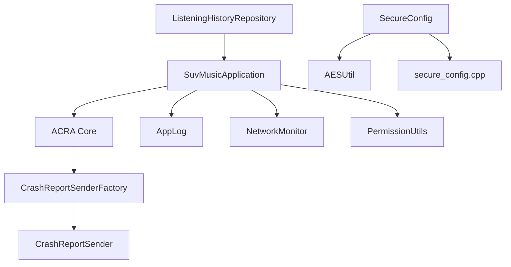
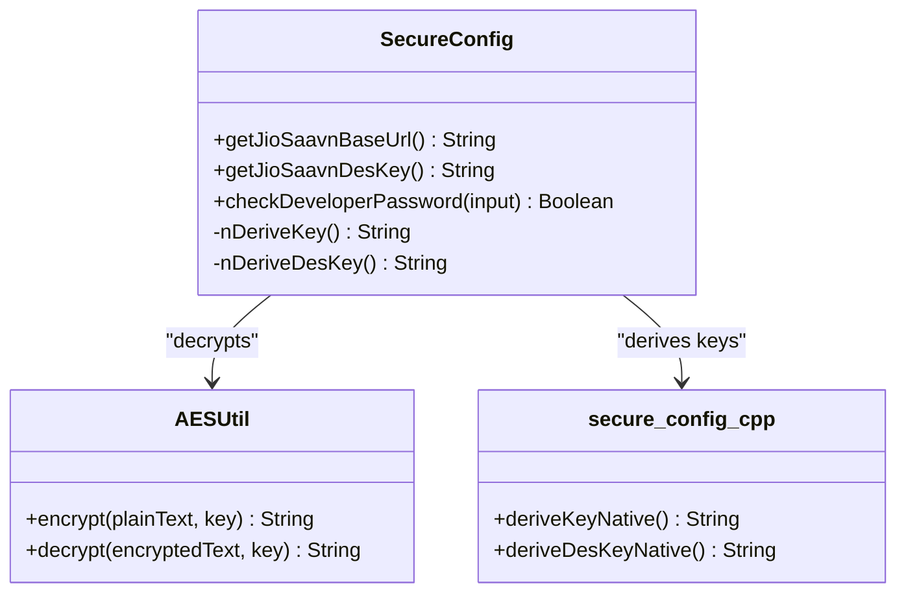
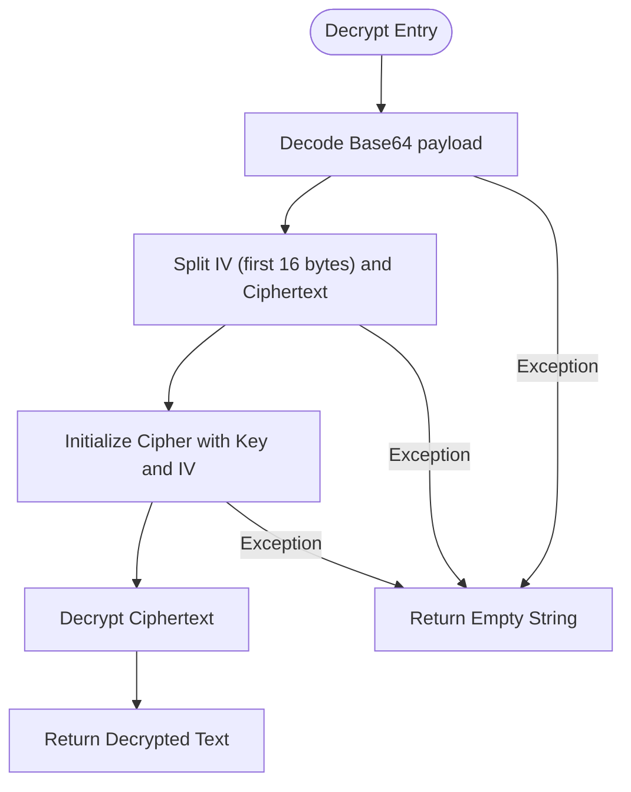
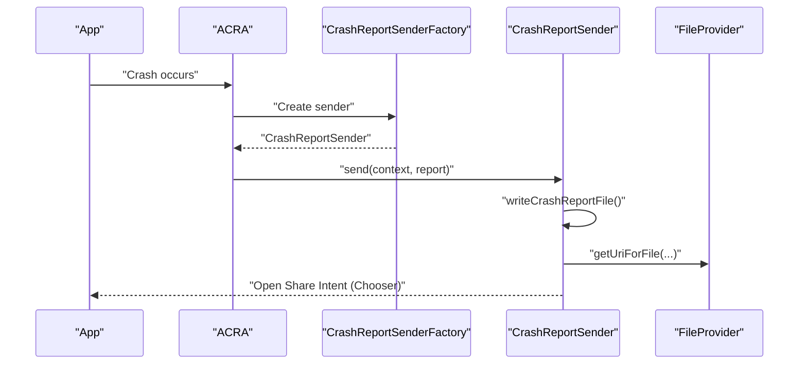
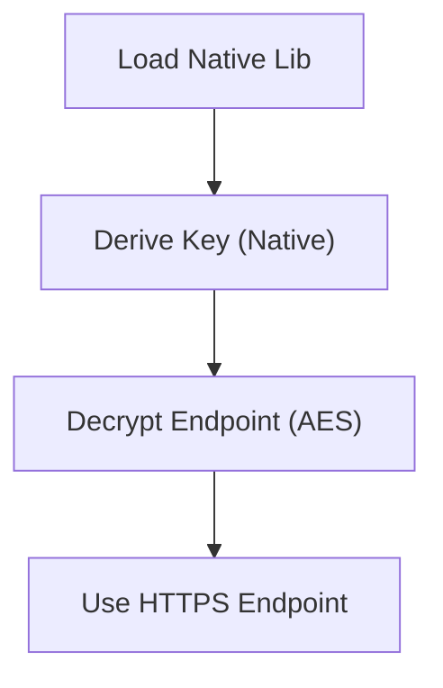
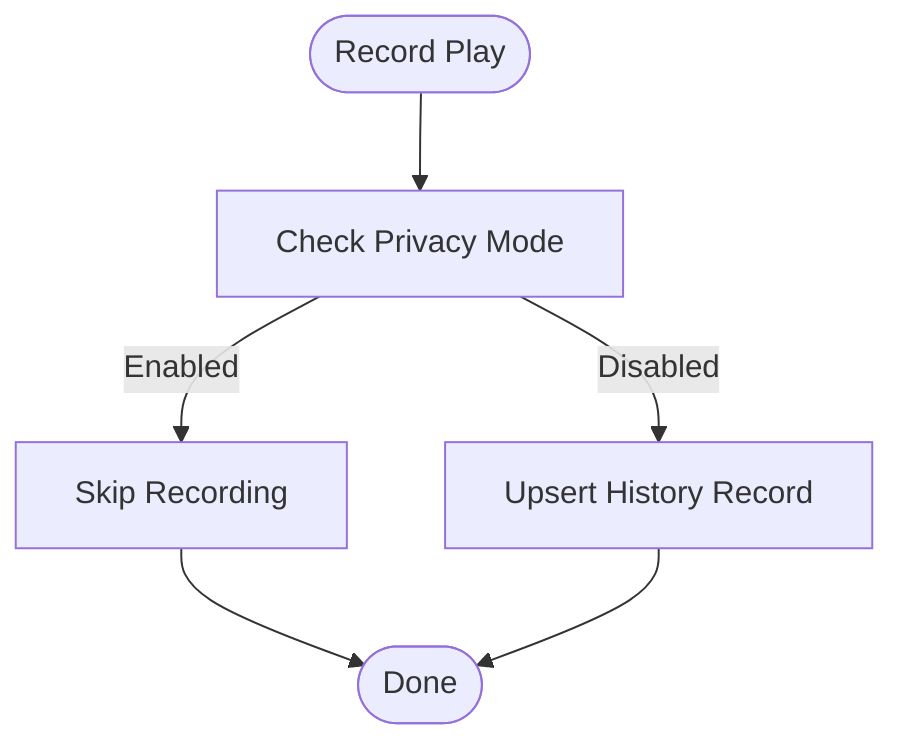
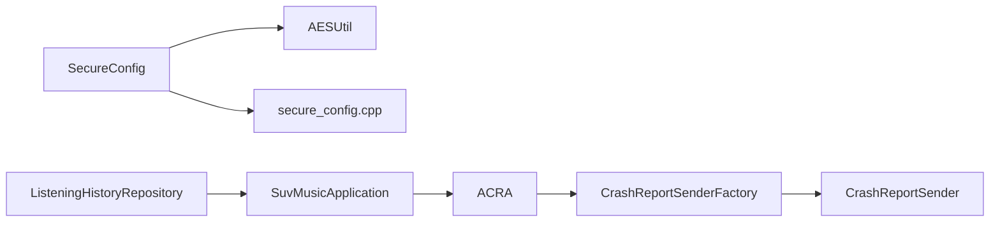

# Security Considerations

<cite>
**Referenced Files in This Document**
- [SecureConfig.kt](file://app/src/main/java/com/suvojeet/suvmusic/util/SecureConfig.kt)
- [AESUtil.kt](file://app/src/main/java/com/suvojeet/suvmusic/util/AESUtil.kt)
- [secure_config.cpp](file://app/src/main/cpp/secure_config.cpp)
- [CrashReportSender.kt](file://app/src/main/java/com/suvojeet/suvmusic/crash/CrashReportSender.kt)
- [CrashReportSenderFactory.kt](file://app/src/main/java/com/suvojeet/suvmusic/crash/CrashReportSenderFactory.kt)
- [org.acra.sender.ReportSenderFactory](file://app/src/main/resources/META-INF/services/org.acra.sender.ReportSenderFactory)
- [SuvMusicApplication.kt](file://app/src/main/java/com/suvojeet/suvmusic/SuvMusicApplication.kt)
- [NetworkMonitor.kt](file://app/src/main/java/com/suvojeet/suvmusic/util/NetworkMonitor.kt)
- [PermissionUtils.kt](file://app/src/main/java/com/suvojeet/suvmusic/util/PermissionUtils.kt)
- [AndroidManifest.xml](file://app/src/main/AndroidManifest.xml)
- [LocalAudioRepository.kt](file://app/src/main/java/com/suvojeet/suvmusic/data/repository/LocalAudioRepository.kt)
- [YouTubeConfig.kt](file://app/src/main/java/com/suvojeet/suvmusic/data/repository/youtube/internal/YouTubeConfig.kt)
- [ListeningHistoryRepository.kt](file://app/src/main/java/com/suvojeet/suvmusic/data/repository/ListeningHistoryRepository.kt)
- [AppLog.kt](file://app/src/main/java/com/suvojeet/suvmusic/util/AppLog.kt)
</cite>

## Table of Contents
1. [Introduction](#introduction)
2. [Project Structure](#project-structure)
3. [Core Components](#core-components)
4. [Architecture Overview](#architecture-overview)
5. [Detailed Component Analysis](#detailed-component-analysis)
6. [Dependency Analysis](#dependency-analysis)
7. [Performance Considerations](#performance-considerations)
8. [Troubleshooting Guide](#troubleshooting-guide)
9. [Conclusion](#conclusion)
10. [Appendices](#appendices)

## Introduction
This document consolidates SuvMusic’s security posture across configuration management, encryption utilities, crash reporting, API key handling, data protection, permissions, privacy controls, network security, local storage safeguards, and third-party integrations. It also outlines vulnerability assessment, auditing, and incident response considerations derived from the codebase.

## Project Structure
Security-relevant modules and files are organized by responsibility:
- Configuration and encryption utilities reside under app/src/main/java/com/suvojeet/suvmusic/util and app/src/main/cpp.
- Crash reporting integrates with ACRA and is customized via a factory and sender.
- Network monitoring and permissions are centralized utilities.
- Privacy-sensitive repositories and application lifecycle manage logging and telemetry.
- Manifest enforces secure defaults such as disabling cleartext traffic and declaring required permissions.

**Diagram sources**
- [SecureConfig.kt:1-61](file://app/src/main/java/com/suvojeet/suvmusic/util/SecureConfig.kt#L1-L61)
- [secure_config.cpp:1-61](file://app/src/main/cpp/secure_config.cpp#L1-L61)
- [CrashReportSender.kt:1-144](file://app/src/main/java/com/suvojeet/suvmusic/crash/CrashReportSender.kt#L1-L144)
- [CrashReportSenderFactory.kt:1-19](file://app/src/main/java/com/suvojeet/suvmusic/crash/CrashReportSenderFactory.kt#L1-L19)
- [SuvMusicApplication.kt:1-129](file://app/src/main/java/com/suvojeet/suvmusic/SuvMusicApplication.kt#L1-L129)
- [AndroidManifest.xml:1-224](file://app/src/main/AndroidManifest.xml#L1-L224)
- [LocalAudioRepository.kt:1-432](file://app/src/main/java/com/suvojeet/suvmusic/data/repository/LocalAudioRepository.kt#L1-L432)
- [ListeningHistoryRepository.kt:1-179](file://app/src/main/java/com/suvojeet/suvmusic/data/repository/ListeningHistoryRepository.kt#L1-L179)
- [YouTubeConfig.kt:1-20](file://app/src/main/java/com/suvojeet/suvmusic/data/repository/youtube/internal/YouTubeConfig.kt#L1-L20)

**Section sources**
- [AndroidManifest.xml:1-224](file://app/src/main/AndroidManifest.xml#L1-L224)
- [SuvMusicApplication.kt:1-129](file://app/src/main/java/com/suvojeet/suvmusic/SuvMusicApplication.kt#L1-L129)

## Core Components
- Secure configuration management: Runtime AES decryption of sensitive strings with native-derived keys to reduce reverse-engineering risk.
- Encryption utilities: AES/CBC/PKCS5Padding for pre-encrypted secrets.
- Crash reporting: ACRA-backed reporting with user-friendly sharing and file export.
- Network monitoring: Reactive connectivity checks with Wi-Fi detection.
- Permissions: Dynamic permission lists aligned with platform versions.
- Privacy controls: Privacy mode gating for analytics and history recording.
- Logging: Debug-gated persistent logs with opt-in.

**Section sources**
- [SecureConfig.kt:1-61](file://app/src/main/java/com/suvojeet/suvmusic/util/SecureConfig.kt#L1-L61)
- [AESUtil.kt:1-62](file://app/src/main/java/com/suvojeet/suvmusic/util/AESUtil.kt#L1-L62)
- [secure_config.cpp:1-61](file://app/src/main/cpp/secure_config.cpp#L1-L61)
- [CrashReportSender.kt:1-144](file://app/src/main/java/com/suvojeet/suvmusic/crash/CrashReportSender.kt#L1-L144)
- [CrashReportSenderFactory.kt:1-19](file://app/src/main/java/com/suvojeet/suvmusic/crash/CrashReportSenderFactory.kt#L1-L19)
- [NetworkMonitor.kt:1-98](file://app/src/main/java/com/suvojeet/suvmusic/util/NetworkMonitor.kt#L1-L98)
- [PermissionUtils.kt:1-29](file://app/src/main/java/com/suvojeet/suvmusic/util/PermissionUtils.kt#L1-L29)
- [ListeningHistoryRepository.kt:1-179](file://app/src/main/java/com/suvojeet/suvmusic/data/repository/ListeningHistoryRepository.kt#L1-L179)
- [AppLog.kt:1-113](file://app/src/main/java/com/suvojeet/suvmusic/util/AppLog.kt#L1-L113)

## Architecture Overview
The security architecture combines:
- Native key derivation for sensitive configuration.
- ACRA crash pipeline with custom sender and factory.
- Manifest-enforced transport security and minimal permissions.
- Privacy-aware repositories and logging utilities.

**Diagram sources**
- [SuvMusicApplication.kt:1-129](file://app/src/main/java/com/suvojeet/suvmusic/SuvMusicApplication.kt#L1-L129)
- [CrashReportSenderFactory.kt:1-19](file://app/src/main/java/com/suvojeet/suvmusic/crash/CrashReportSenderFactory.kt#L1-L19)
- [CrashReportSender.kt:1-144](file://app/src/main/java/com/suvojeet/suvmusic/crash/CrashReportSender.kt#L1-L144)
- [AppLog.kt:1-113](file://app/src/main/java/com/suvojeet/suvmusic/util/AppLog.kt#L1-L113)
- [NetworkMonitor.kt:1-98](file://app/src/main/java/com/suvojeet/suvmusic/util/NetworkMonitor.kt#L1-L98)
- [PermissionUtils.kt:1-29](file://app/src/main/java/com/suvojeet/suvmusic/util/PermissionUtils.kt#L1-L29)
- [SecureConfig.kt:1-61](file://app/src/main/java/com/suvojeet/suvmusic/util/SecureConfig.kt#L1-L61)
- [AESUtil.kt:1-62](file://app/src/main/java/com/suvojeet/suvmusic/util/AESUtil.kt#L1-L62)
- [secure_config.cpp:1-61](file://app/src/main/cpp/secure_config.cpp#L1-L61)
- [ListeningHistoryRepository.kt:1-179](file://app/src/main/java/com/suvojeet/suvmusic/data/repository/ListeningHistoryRepository.kt#L1-L179)

## Detailed Component Analysis

### Secure Configuration Management
- Purpose: Protect sensitive endpoints and credentials by storing only encrypted strings and deriving keys at runtime in native code.
- Implementation highlights:
  - Pre-encrypted constants stored in Kotlin.
  - Native key derivation functions returning 16-byte and 8-byte keys.
  - AES decryption invoked only when needed, with safe fallbacks on exceptions.
- Security benefits:
  - Reduces exposure of plaintext secrets in APK.
  - Obfuscates key derivation logic in native code.
- Risks and mitigations:
  - Risk: Key derivation exposed via reverse engineering.
  - Mitigation: Fragmented seeds and transformations in native code; runtime-only decryption.

**Diagram sources**
- [SecureConfig.kt:1-61](file://app/src/main/java/com/suvojeet/suvmusic/util/SecureConfig.kt#L1-L61)
- [AESUtil.kt:1-62](file://app/src/main/java/com/suvojeet/suvmusic/util/AESUtil.kt#L1-L62)
- [secure_config.cpp:1-61](file://app/src/main/cpp/secure_config.cpp#L1-L61)

**Section sources**
- [SecureConfig.kt:10-60](file://app/src/main/java/com/suvojeet/suvmusic/util/SecureConfig.kt#L10-L60)
- [secure_config.cpp:17-46](file://app/src/main/cpp/secure_config.cpp#L17-L46)
- [AESUtil.kt:12-60](file://app/src/main/java/com/suvojeet/suvmusic/util/AESUtil.kt#L12-L60)

### Encryption Utilities (AES)
- Purpose: Provide AES/CBC/PKCS5Padding encryption/decryption for sensitive strings.
- Implementation highlights:
  - IV included with ciphertext; Base64-encoded combined payload.
  - Safe decryption with fallback to empty string on failure.
- Security considerations:
  - Ensure consistent key length and avoid reuse of IVs across messages.
  - Limit exposure of decrypted values to runtime scopes.

**Diagram sources**
- [AESUtil.kt:41-60](file://app/src/main/java/com/suvojeet/suvmusic/util/AESUtil.kt#L41-L60)

**Section sources**
- [AESUtil.kt:12-60](file://app/src/main/java/com/suvojeet/suvmusic/util/AESUtil.kt#L12-L60)

### Crash Reporting Security Implications
- ACRA integration with a custom sender and factory enables controlled crash reporting.
- Sender writes reports to a cache directory, shares via FileProvider, and attempts to open a preferred app (Telegram) with a chooser fallback.
- Security implications:
  - Reports include device and app metadata; users must consent to share.
  - FileProvider grants read URI permission; ensure only intended recipients receive logs.
  - Avoid attaching sensitive data; the current implementation focuses on stack traces and logcat.

**Diagram sources**
- [SuvMusicApplication.kt:43-60](file://app/src/main/java/com/suvojeet/suvmusic/SuvMusicApplication.kt#L43-L60)
- [CrashReportSenderFactory.kt:12-18](file://app/src/main/java/com/suvojeet/suvmusic/crash/CrashReportSenderFactory.kt#L12-L18)
- [CrashReportSender.kt:26-39](file://app/src/main/java/com/suvojeet/suvmusic/crash/CrashReportSender.kt#L26-L39)
- [org.acra.sender.ReportSenderFactory:1-2](file://app/src/main/resources/META-INF/services/org.acra.sender.ReportSenderFactory#L1-L2)

**Section sources**
- [SuvMusicApplication.kt:43-60](file://app/src/main/java/com/suvojeet/suvmusic/SuvMusicApplication.kt#L43-L60)
- [CrashReportSenderFactory.kt:12-18](file://app/src/main/java/com/suvojeet/suvmusic/crash/CrashReportSenderFactory.kt#L12-L18)
- [CrashReportSender.kt:26-99](file://app/src/main/java/com/suvojeet/suvmusic/crash/CrashReportSender.kt#L26-L99)
- [org.acra.sender.ReportSenderFactory:1-2](file://app/src/main/resources/META-INF/services/org.acra.sender.ReportSenderFactory#L1-L2)

### API Key Management and Data Protection
- API endpoints and developer credentials are encrypted and decrypted at runtime using native-derived keys.
- Data at rest:
  - No evidence of encrypted local databases; rely on Android Keystore for future enhancements.
- Data in transit:
  - Manifest disables cleartext traffic globally.
  - Network monitoring ensures validated internet availability before operations.

**Diagram sources**
- [SecureConfig.kt:12-36](file://app/src/main/java/com/suvojeet/suvmusic/util/SecureConfig.kt#L12-L36)
- [secure_config.cpp:17-34](file://app/src/main/cpp/secure_config.cpp#L17-L34)
- [AESUtil.kt:41-55](file://app/src/main/java/com/suvojeet/suvmusic/util/AESUtil.kt#L41-L55)
- [AndroidManifest.xml:71](file://app/src/main/AndroidManifest.xml#L71)

**Section sources**
- [SecureConfig.kt:12-36](file://app/src/main/java/com/suvojeet/suvmusic/util/SecureConfig.kt#L12-L36)
- [secure_config.cpp:17-34](file://app/src/main/cpp/secure_config.cpp#L17-L34)
- [AndroidManifest.xml:71](file://app/src/main/AndroidManifest.xml#L71)

### Privacy Protection and Consent
- Privacy mode gating prevents recording listening history when enabled.
- Logging can be enabled/disabled; logs are written to cache for optional persistence.
- Manifest permissions are scoped to functional needs (media, notifications, foreground services).

**Diagram sources**
- [ListeningHistoryRepository.kt:24-95](file://app/src/main/java/com/suvojeet/suvmusic/data/repository/ListeningHistoryRepository.kt#L24-L95)

**Section sources**
- [ListeningHistoryRepository.kt:24-30](file://app/src/main/java/com/suvojeet/suvmusic/data/repository/ListeningHistoryRepository.kt#L24-L30)
- [AppLog.kt:28-41](file://app/src/main/java/com/suvojeet/suvmusic/util/AppLog.kt#L28-L41)
- [AndroidManifest.xml:9-31](file://app/src/main/AndroidManifest.xml#L9-L31)

### Permission Handling and Data Collection
- Required permissions are determined dynamically based on OS version.
- Permissions include media access, notifications, and foreground services for playback.
- Data collection is minimized; repository queries use projections and selections to limit scope.

**Section sources**
- [PermissionUtils.kt:10-27](file://app/src/main/java/com/suvojeet/suvmusic/util/PermissionUtils.kt#L10-L27)
- [LocalAudioRepository.kt:26-52](file://app/src/main/java/com/suvojeet/suvmusic/data/repository/LocalAudioRepository.kt#L26-L52)

### Network Communications Security
- Manifest enforces no cleartext traffic.
- Network monitor validates internet capability and Wi-Fi presence for informed decisions.
- YouTube client configuration uses HTTPS endpoints.

**Section sources**
- [AndroidManifest.xml:71](file://app/src/main/AndroidManifest.xml#L71)
- [NetworkMonitor.kt:29-76](file://app/src/main/java/com/suvojeet/suvmusic/util/NetworkMonitor.kt#L29-L76)
- [YouTubeConfig.kt:17-18](file://app/src/main/java/com/suvojeet/suvmusic/data/repository/youtube/internal/YouTubeConfig.kt#L17-L18)

### Local Storage Security
- Logs are written to cache; optional persistent logging can be enabled.
- Media access uses ContentResolver with explicit projections and selections.
- No evidence of encrypted local storage; consider Android Keystore for future enhancements.

**Section sources**
- [AppLog.kt:30-41](file://app/src/main/java/com/suvojeet/suvmusic/util/AppLog.kt#L30-L41)
- [LocalAudioRepository.kt:69-122](file://app/src/main/java/com/suvojeet/suvmusic/data/repository/LocalAudioRepository.kt#L69-L122)

### Third-Party Integration Security
- ACRA crash reporting is integrated; custom sender and factory registered via service loader.
- FileProvider is used for sharing crash logs securely.
- Manifest declares package visibility and deep links with auto-verification for trusted domains.

**Section sources**
- [CrashReportSenderFactory.kt:12-18](file://app/src/main/java/com/suvojeet/suvmusic/crash/CrashReportSenderFactory.kt#L12-L18)
- [CrashReportSender.kt:28-38](file://app/src/main/java/com/suvojeet/suvmusic/crash/CrashReportSender.kt#L28-L38)
- [org.acra.sender.ReportSenderFactory:1-2](file://app/src/main/resources/META-INF/services/org.acra.sender.ReportSenderFactory#L1-L2)
- [AndroidManifest.xml:104-148](file://app/src/main/AndroidManifest.xml#L104-L148)

## Dependency Analysis
- SecureConfig depends on AESUtil and native key derivation.
- Crash reporting depends on ACRA, custom factory, and sender.
- Application initializes ACRA and logging; repositories depend on session/privacy controls.

**Diagram sources**
- [SecureConfig.kt:12-36](file://app/src/main/java/com/suvojeet/suvmusic/util/SecureConfig.kt#L12-L36)
- [AESUtil.kt:12-60](file://app/src/main/java/com/suvojeet/suvmusic/util/AESUtil.kt#L12-L60)
- [secure_config.cpp:17-34](file://app/src/main/cpp/secure_config.cpp#L17-L34)
- [SuvMusicApplication.kt:43-60](file://app/src/main/java/com/suvojeet/suvmusic/SuvMusicApplication.kt#L43-L60)
- [CrashReportSenderFactory.kt:12-18](file://app/src/main/java/com/suvojeet/suvmusic/crash/CrashReportSenderFactory.kt#L12-L18)
- [CrashReportSender.kt:26-39](file://app/src/main/java/com/suvojeet/suvmusic/crash/CrashReportSender.kt#L26-L39)
- [ListeningHistoryRepository.kt:14-18](file://app/src/main/java/com/suvojeet/suvmusic/data/repository/ListeningHistoryRepository.kt#L14-L18)

**Section sources**
- [SecureConfig.kt:12-36](file://app/src/main/java/com/suvojeet/suvmusic/util/SecureConfig.kt#L12-L36)
- [SuvMusicApplication.kt:43-60](file://app/src/main/java/com/suvojeet/suvmusic/SuvMusicApplication.kt#L43-L60)
- [ListeningHistoryRepository.kt:14-18](file://app/src/main/java/com/suvojeet/suvmusic/data/repository/ListeningHistoryRepository.kt#L14-L18)

## Performance Considerations
- Avoid frequent decryption operations; cache decrypted values per session where appropriate.
- Minimize log volume when persistent logging is enabled to reduce I/O overhead.
- Use network monitoring to defer operations until validated connectivity.

[No sources needed since this section provides general guidance]

## Troubleshooting Guide
- Crash reporting not appearing:
  - Verify ACRA initialization and custom factory registration.
  - Confirm FileProvider authority and share intent creation.
- Decryption failures:
  - Ensure native library loads and key derivation returns valid strings.
  - Validate encrypted payload format and key length.
- Logging issues:
  - Confirm logging is enabled and cache directory is writable.
  - Clear logs if they grow excessively.

**Section sources**
- [SuvMusicApplication.kt:43-60](file://app/src/main/java/com/suvojeet/suvmusic/SuvMusicApplication.kt#L43-L60)
- [CrashReportSenderFactory.kt:12-18](file://app/src/main/java/com/suvojeet/suvmusic/crash/CrashReportSenderFactory.kt#L12-L18)
- [CrashReportSender.kt:26-39](file://app/src/main/java/com/suvojeet/suvmusic/crash/CrashReportSender.kt#L26-L39)
- [SecureConfig.kt:12-18](file://app/src/main/java/com/suvojeet/suvmusic/util/SecureConfig.kt#L12-L18)
- [AppLog.kt:102-111](file://app/src/main/java/com/suvojeet/suvmusic/util/AppLog.kt#L102-L111)

## Conclusion
SuvMusic employs layered security practices: native-derived keys for configuration, ACRA-based crash reporting with user-controlled sharing, manifest-enforced transport security, and privacy-aware repositories. To further strengthen security, consider integrating Android Keystore for sensitive data at rest, adopting certificate pinning for outbound requests, and establishing formal vulnerability assessment and incident response procedures.

[No sources needed since this section summarizes without analyzing specific files]

## Appendices
- Best practices:
  - Rotate keys periodically and re-encrypt stored values.
  - Enforce strict input validation and sanitize logs before sharing.
  - Limit persisted data and apply least-privilege permissions.
  - Conduct periodic security audits and penetration testing.

[No sources needed since this section provides general guidance]