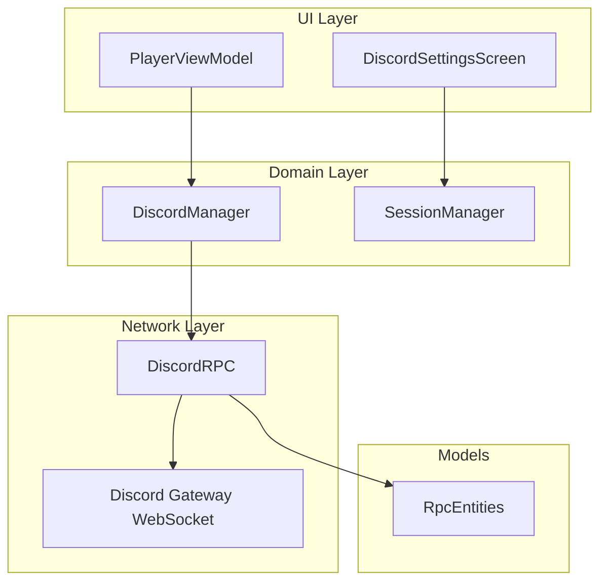
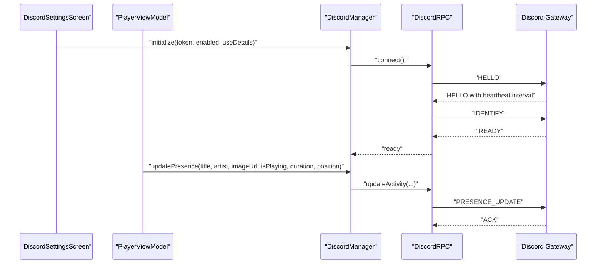
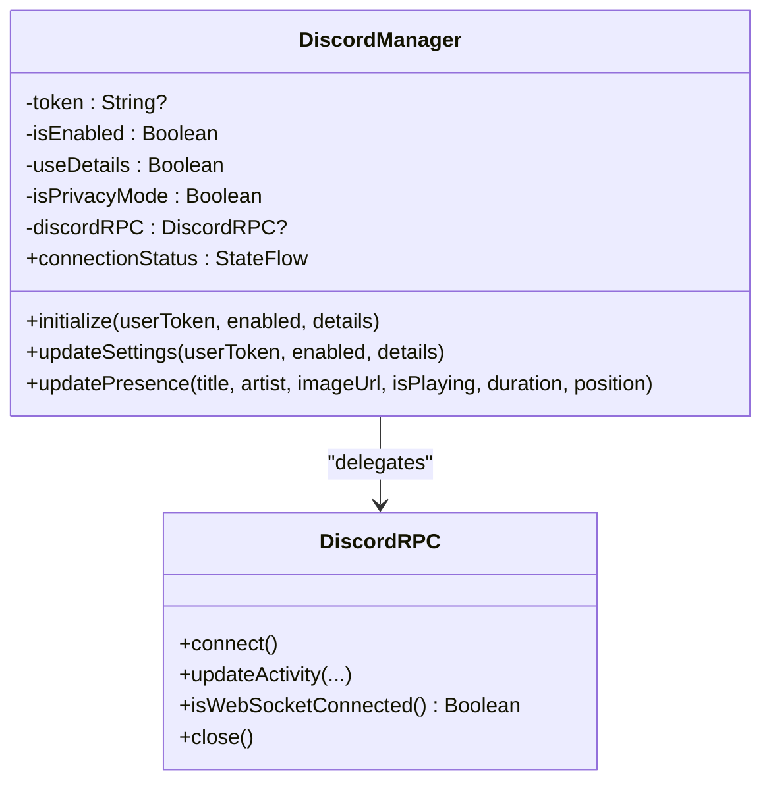
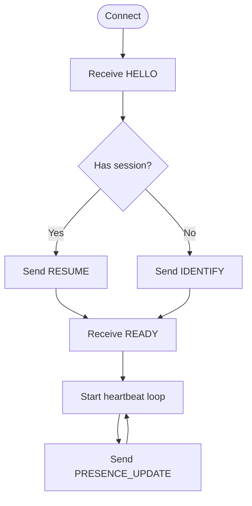
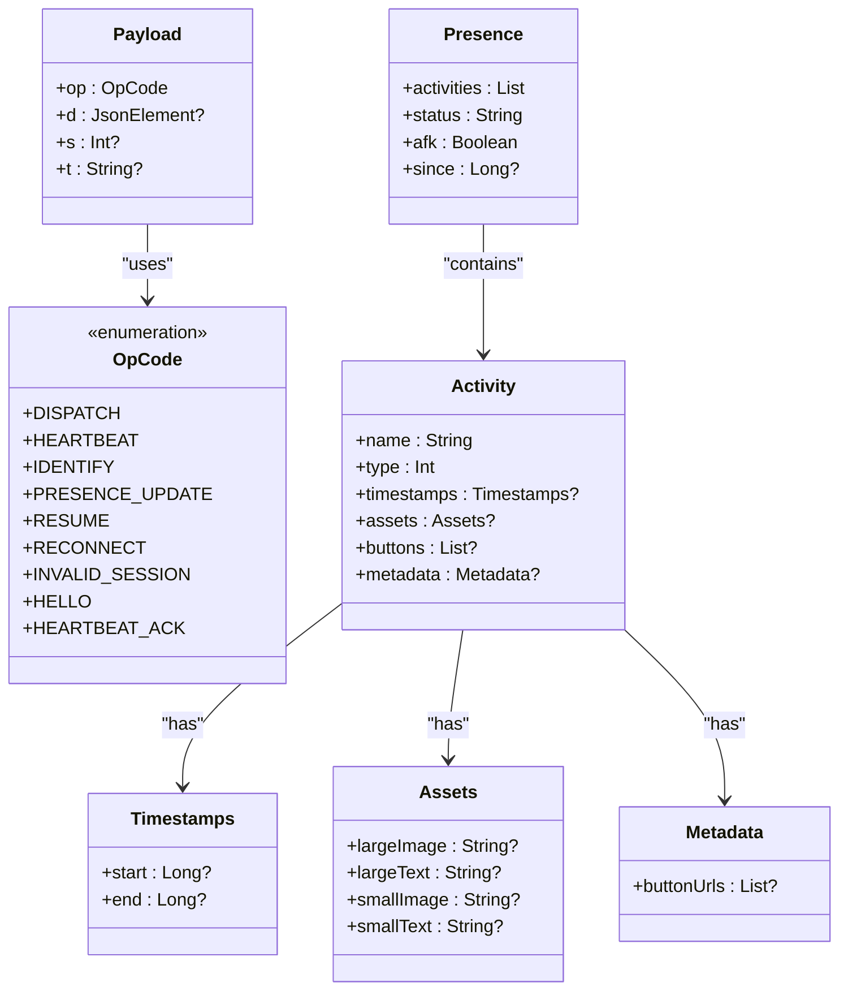
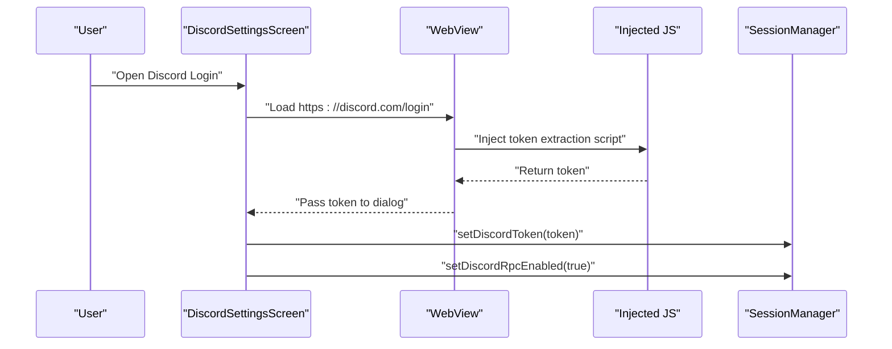
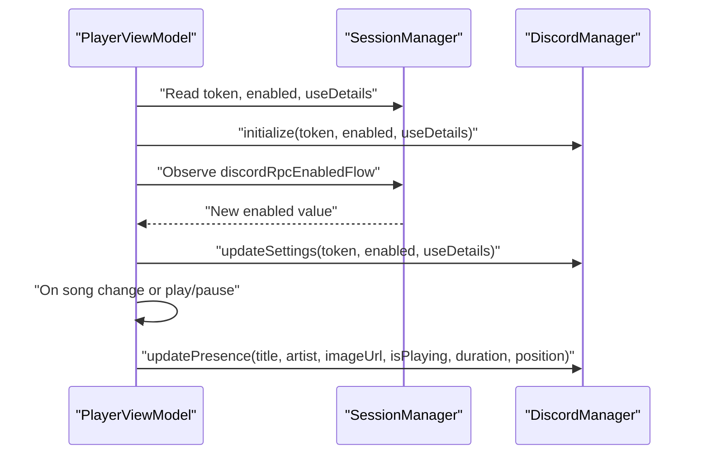
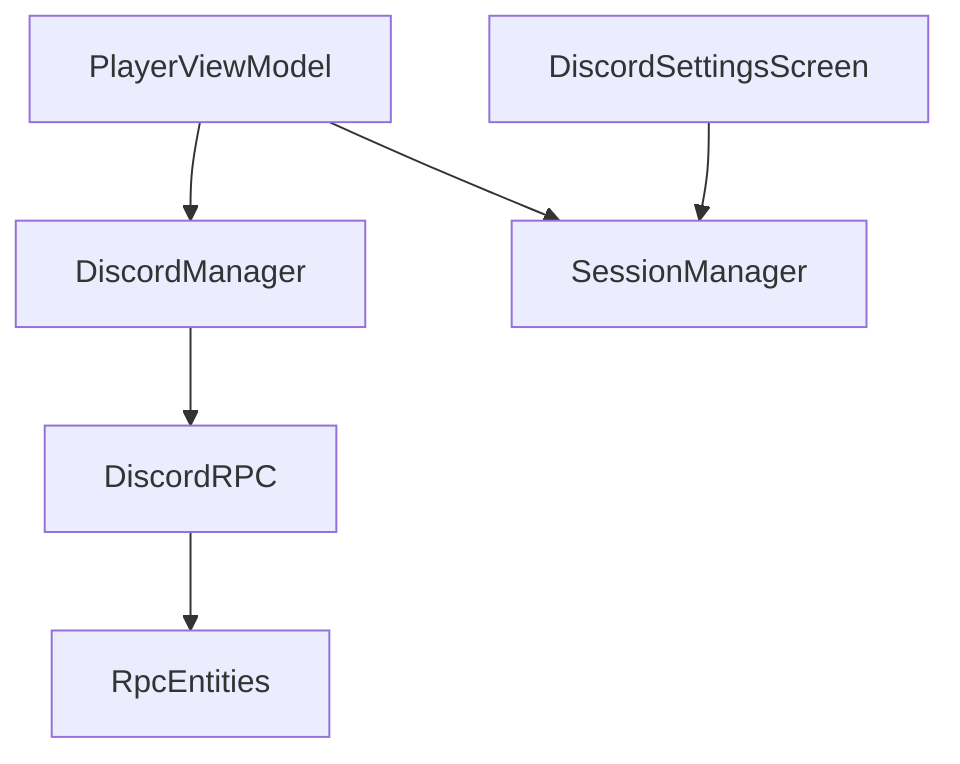

# Discord Integration

<cite>
**Referenced Files in This Document**
- [DiscordManager.kt](file://app/src/main/java/com/suvojeet/suvmusic/discord/DiscordManager.kt)
- [DiscordRPC.kt](file://app/src/main/java/com/suvojeet/suvmusic/discord/DiscordRPC.kt)
- [RpcEntities.kt](file://app/src/main/java/com/suvojeet/suvmusic/discord/RpcEntities.kt)
- [DiscordSettingsScreen.kt](file://app/src/main/java/com/suvojeet/suvmusic/ui/screens/settings/DiscordSettingsScreen.kt)
- [PlayerViewModel.kt](file://app/src/main/java/com/suvojeet/suvmusic/ui/viewmodel/PlayerViewModel.kt)
- [SessionManager.kt](file://app/src/main/java/com/suvojeet/suvmusic/data/SessionManager.kt)
</cite>

## Table of Contents
1. [Introduction](#introduction)
2. [Project Structure](#project-structure)
3. [Core Components](#core-components)
4. [Architecture Overview](#architecture-overview)
5. [Detailed Component Analysis](#detailed-component-analysis)
6. [Dependency Analysis](#dependency-analysis)
7. [Performance Considerations](#performance-considerations)
8. [Troubleshooting Guide](#troubleshooting-guide)
9. [Conclusion](#conclusion)

## Introduction
This document explains the Discord Rich Presence integration that displays the current music playback status to Discord friends. It covers the real-time status updates, activity presence configuration, artwork display, interactive buttons, and the integration with Discord's API for user authentication, bot permissions, and presence management. It also documents the Rich Presence payload structure, configuration options, handling of presence updates during playback changes, connection state management, privacy considerations, rate limiting, and error handling.

## Project Structure
The Discord integration is implemented across three primary modules:
- DiscordManager: Orchestrates initialization, settings updates, and presence updates.
- DiscordRPC: Implements the Discord Gateway WebSocket protocol and presence updates.
- RpcEntities: Defines the serialization models for Discord RPC payloads.

UI and configuration:
- DiscordSettingsScreen: Provides the user interface for enabling/disabling Rich Presence, swapping details/state, and connecting via token or web login.
- PlayerViewModel: Subscribes to playback state and triggers presence updates.
- SessionManager: Stores and exposes user settings for Discord RPC, including token, enable flag, and details preference.

**Diagram sources**
- [DiscordSettingsScreen.kt](file://app/src/main/java/com/suvojeet/suvmusic/ui/screens/settings/DiscordSettingsScreen.kt)
- [PlayerViewModel.kt](file://app/src/main/java/com/suvojeet/suvmusic/ui/viewmodel/PlayerViewModel.kt)
- [DiscordManager.kt](file://app/src/main/java/com/suvojeet/suvmusic/discord/DiscordManager.kt)
- [DiscordRPC.kt](file://app/src/main/java/com/suvojeet/suvmusic/discord/DiscordRPC.kt)
- [RpcEntities.kt](file://app/src/main/java/com/suvojeet/suvmusic/discord/RpcEntities.kt)

**Section sources**
- [DiscordSettingsScreen.kt](file://app/src/main/java/com/suvojeet/suvmusic/ui/screens/settings/DiscordSettingsScreen.kt)
- [PlayerViewModel.kt](file://app/src/main/java/com/suvojeet/suvmusic/ui/viewmodel/PlayerViewModel.kt)
- [DiscordManager.kt](file://app/src/main/java/com/suvojeet/suvmusic/discord/DiscordManager.kt)
- [DiscordRPC.kt](file://app/src/main/java/com/suvojeet/suvmusic/discord/DiscordRPC.kt)
- [RpcEntities.kt](file://app/src/main/java/com/suvojeet/suvmusic/discord/RpcEntities.kt)

## Core Components
- DiscordManager
  - Initializes and manages the DiscordRPC instance.
  - Applies user settings (enable/disable, details/state swap).
  - Handles privacy mode to clear presence when enabled.
  - Updates presence with title, artist, image URL, play state, duration, and position.
- DiscordRPC
  - Connects to the Discord Gateway WebSocket.
  - Manages heartbeats, resumes, and reconnections.
  - Sends PRESENCE_UPDATE payloads with activity details, timestamps, assets, and optional buttons.
- RpcEntities
  - Defines OpCode, Payload, Identify, Heartbeat, Ready, Resume, Presence, Activity, Timestamps, Assets, Secrets, and Metadata models.
- DiscordSettingsScreen
  - UI for connecting via token or web login, toggling Rich Presence, and swapping details/state.
- PlayerViewModel
  - Observes playback state and triggers presence updates.
- SessionManager
  - Persists and exposes Discord settings (token, enabled, use-details) and privacy mode.

**Section sources**
- [DiscordManager.kt](file://app/src/main/java/com/suvojeet/suvmusic/discord/DiscordManager.kt)
- [DiscordRPC.kt](file://app/src/main/java/com/suvojeet/suvmusic/discord/DiscordRPC.kt)
- [RpcEntities.kt](file://app/src/main/java/com/suvojeet/suvmusic/discord/RpcEntities.kt)
- [DiscordSettingsScreen.kt](file://app/src/main/java/com/suvojeet/suvmusic/ui/screens/settings/DiscordSettingsScreen.kt)
- [PlayerViewModel.kt](file://app/src/main/java/com/suvojeet/suvmusic/ui/viewmodel/PlayerViewModel.kt)
- [SessionManager.kt](file://app/src/main/java/com/suvojeet/suvmusic/data/SessionManager.kt)

## Architecture Overview
The integration follows a layered architecture:
- UI layer triggers presence updates based on playback events.
- Domain layer (DiscordManager) validates settings and delegates to DiscordRPC.
- Network layer (DiscordRPC) manages the WebSocket connection and sends PRESENCE_UPDATE payloads.
- Models (RpcEntities) define the payload structure for Discord’s Gateway protocol.

**Diagram sources**
- [DiscordSettingsScreen.kt](file://app/src/main/java/com/suvojeet/suvmusic/ui/screens/settings/DiscordSettingsScreen.kt)
- [PlayerViewModel.kt](file://app/src/main/java/com/suvojeet/suvmusic/ui/viewmodel/PlayerViewModel.kt)
- [DiscordManager.kt](file://app/src/main/java/com/suvojeet/suvmusic/discord/DiscordManager.kt)
- [DiscordRPC.kt](file://app/src/main/java/com/suvojeet/suvmusic/discord/DiscordRPC.kt)

## Detailed Component Analysis

### DiscordManager
Responsibilities:
- Initialize with user token, enabled flag, and details preference.
- Apply runtime settings changes and reconnect as needed.
- Respect privacy mode by clearing presence when enabled.
- Compute timestamps and format image URLs before delegating to DiscordRPC.

Key behaviors:
- Uses a coroutine scope for lifecycle-safe operations.
- Maintains connection status state flow for UI feedback.
- Formats image URLs to ensure absolute HTTPS when needed.
- Swaps details and state based on user preference.

**Diagram sources**
- [DiscordManager.kt](file://app/src/main/java/com/suvojeet/suvmusic/discord/DiscordManager.kt)
- [DiscordRPC.kt](file://app/src/main/java/com/suvojeet/suvmusic/discord/DiscordRPC.kt)

**Section sources**
- [DiscordManager.kt](file://app/src/main/java/com/suvojeet/suvmusic/discord/DiscordManager.kt)

### DiscordRPC
Responsibilities:
- Establish and maintain a WebSocket connection to the Discord Gateway.
- Manage heartbeats, resume sessions, and exponential backoff reconnection.
- Send PRESENCE_UPDATE with activity, timestamps, assets, and optional buttons.
- Handle gateway opcodes (HELLO, READY, RECONNECT, INVALID_SESSION, HEARTBEAT, HEARTBEAT_ACK).

Connection lifecycle:
- On HELLO, sets heartbeat interval and starts heartbeat job.
- On READY, stores session info and optionally resends last presence.
- On RECONNECT, closes and reopens the socket.
- On INVALID_SESSION, identifies again after a brief delay.

**Diagram sources**
- [DiscordRPC.kt](file://app/src/main/java/com/suvojeet/suvmusic/discord/DiscordRPC.kt)

**Section sources**
- [DiscordRPC.kt](file://app/src/main/java/com/suvojeet/suvmusic/discord/DiscordRPC.kt)

### RpcEntities
Defines the payload models for Discord RPC:
- OpCode: Gateway opcodes (DISPATCH, HEARTBEAT, IDENTIFY, PRESENCE_UPDATE, RESUME, RECONNECT, INVALID_SESSION, HELLO, HEARTBEAT_ACK).
- Payload: op, d, s, t fields.
- Identify, IdentifyProperties: Authorization payload.
- Heartbeat: heartbeat_interval.
- Ready: session_id, resume_gateway_url.
- Resume: token, session_id, seq.
- Presence, Activity, Timestamps, Assets, Secrets, Metadata: Rich Presence payload structure.

**Diagram sources**
- [RpcEntities.kt](file://app/src/main/java/com/suvojeet/suvmusic/discord/RpcEntities.kt)

**Section sources**
- [RpcEntities.kt](file://app/src/main/java/com/suvojeet/suvmusic/discord/RpcEntities.kt)

### DiscordSettingsScreen
Provides:
- Account section: Connect via web login or manual token entry.
- Rich Presence section: Toggle enable/disable and swap details/state.
- Preview card: Visual preview of the Rich Presence appearance.

Web login flow:
- Opens Discord login page in a WebView.
- Injects JavaScript to extract the token from localStorage.
- Saves the token to SessionManager and enables Rich Presence.

**Diagram sources**
- [DiscordSettingsScreen.kt](file://app/src/main/java/com/suvojeet/suvmusic/ui/screens/settings/DiscordSettingsScreen.kt)
- [SessionManager.kt](file://app/src/main/java/com/suvojeet/suvmusic/data/SessionManager.kt)

**Section sources**
- [DiscordSettingsScreen.kt](file://app/src/main/java/com/suvojeet/suvmusic/ui/screens/settings/DiscordSettingsScreen.kt)
- [SessionManager.kt](file://app/src/main/java/com/suvojeet/suvmusic/data/SessionManager.kt)

### PlayerViewModel
Observes:
- Discord settings flows to apply changes dynamically.
- Playback state changes (song, play/pause) to update presence.
- Calls DiscordManager.updatePresence with current song metadata and timing.

**Diagram sources**
- [PlayerViewModel.kt](file://app/src/main/java/com/suvojeet/suvmusic/ui/viewmodel/PlayerViewModel.kt)
- [DiscordManager.kt](file://app/src/main/java/com/suvojeet/suvmusic/discord/DiscordManager.kt)
- [SessionManager.kt](file://app/src/main/java/com/suvojeet/suvmusic/data/SessionManager.kt)

**Section sources**
- [PlayerViewModel.kt](file://app/src/main/java/com/suvojeet/suvmusic/ui/viewmodel/PlayerViewModel.kt)
- [DiscordManager.kt](file://app/src/main/java/com/suvojeet/suvmusic/discord/DiscordManager.kt)
- [SessionManager.kt](file://app/src/main/java/com/suvojeet/suvmusic/data/SessionManager.kt)

## Dependency Analysis
- DiscordManager depends on SessionManager for settings and on DiscordRPC for network operations.
- DiscordRPC depends on RpcEntities for payload models and Ktor for WebSocket communication.
- PlayerViewModel depends on SessionManager for settings and on DiscordManager for presence updates.
- DiscordSettingsScreen depends on SessionManager for state and UI actions.

**Diagram sources**
- [PlayerViewModel.kt](file://app/src/main/java/com/suvojeet/suvmusic/ui/viewmodel/PlayerViewModel.kt)
- [DiscordManager.kt](file://app/src/main/java/com/suvojeet/suvmusic/discord/DiscordManager.kt)
- [DiscordRPC.kt](file://app/src/main/java/com/suvojeet/suvmusic/discord/DiscordRPC.kt)
- [RpcEntities.kt](file://app/src/main/java/com/suvojeet/suvmusic/discord/RpcEntities.kt)
- [DiscordSettingsScreen.kt](file://app/src/main/java/com/suvojeet/suvmusic/ui/screens/settings/DiscordSettingsScreen.kt)
- [SessionManager.kt](file://app/src/main/java/com/suvojeet/suvmusic/data/SessionManager.kt)

**Section sources**
- [PlayerViewModel.kt](file://app/src/main/java/com/suvojeet/suvmusic/ui/viewmodel/PlayerViewModel.kt)
- [DiscordManager.kt](file://app/src/main/java/com/suvojeet/suvmusic/discord/DiscordManager.kt)
- [DiscordRPC.kt](file://app/src/main/java/com/suvojeet/suvmusic/discord/DiscordRPC.kt)
- [RpcEntities.kt](file://app/src/main/java/com/suvojeet/suvmusic/discord/RpcEntities.kt)
- [DiscordSettingsScreen.kt](file://app/src/main/java/com/suvojeet/suvmusic/ui/screens/settings/DiscordSettingsScreen.kt)
- [SessionManager.kt](file://app/src/main/java/com/suvojeet/suvmusic/data/SessionManager.kt)

## Performance Considerations
- Connection management: DiscordRPC implements exponential backoff for reconnection to avoid flooding the gateway.
- Heartbeats: Regular heartbeat ensures the session stays alive and detects disconnections promptly.
- Payload size: Keep assets minimal and avoid unnecessary metadata to reduce payload size.
- Frequency of updates: Batch presence updates around playback state changes rather than per-frame updates.
- Privacy mode: When enabled, presence is cleared immediately to avoid unnecessary network traffic.

## Troubleshooting Guide
Common issues and resolutions:
- Authentication failures (HTTP 4004): Indicates invalid token; prompt the user to re-enter or log in again.
- Socket closure codes: Handle 4000 (normal close) and others by attempting reconnect or resume.
- Invalid session: On INVALID_SESSION, re-identify after a short delay.
- Privacy mode: Presence is cleared automatically when privacy mode is enabled.
- Rate limiting: The Discord Gateway does not expose explicit RPC rate limits; avoid excessive presence updates and rely on heartbeat intervals.

Operational checks:
- Verify token storage and encryption in SessionManager.
- Confirm settings flows propagate to DiscordManager and trigger reconnects.
- Ensure image URLs are properly formatted (HTTPS) for external assets.

**Section sources**
- [DiscordRPC.kt](file://app/src/main/java/com/suvojeet/suvmusic/discord/DiscordRPC.kt)
- [DiscordManager.kt](file://app/src/main/java/com/suvojeet/suvmusic/discord/DiscordManager.kt)
- [SessionManager.kt](file://app/src/main/java/com/suvojeet/suvmusic/data/SessionManager.kt)

## Conclusion
The Discord integration provides a robust, user-controlled Rich Presence experience. It supports real-time updates, customizable details/state presentation, and privacy-conscious operation. The implementation adheres to Discord’s Gateway protocol, manages connections resiliently, and integrates cleanly with the app’s UI and playback state. Users can configure presence via the settings screen, and developers can extend the payload structure by modifying the RpcEntities and updating DiscordManager/DiscordRPC accordingly.