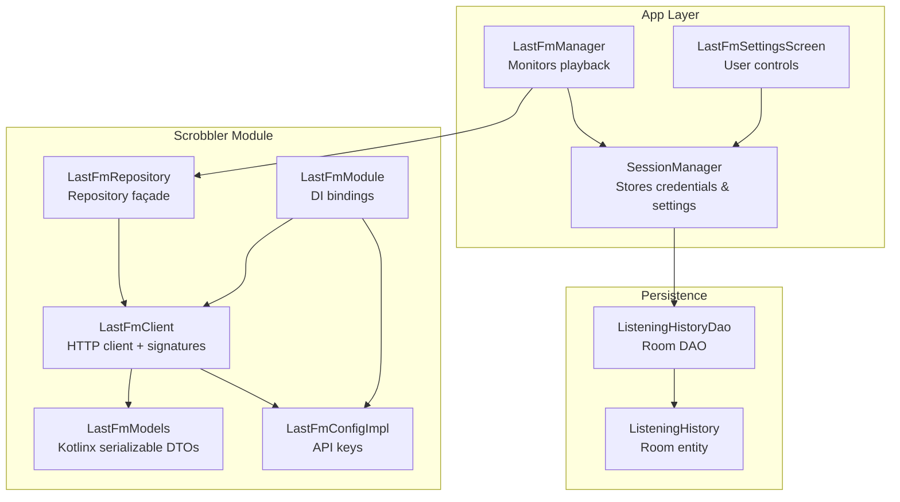
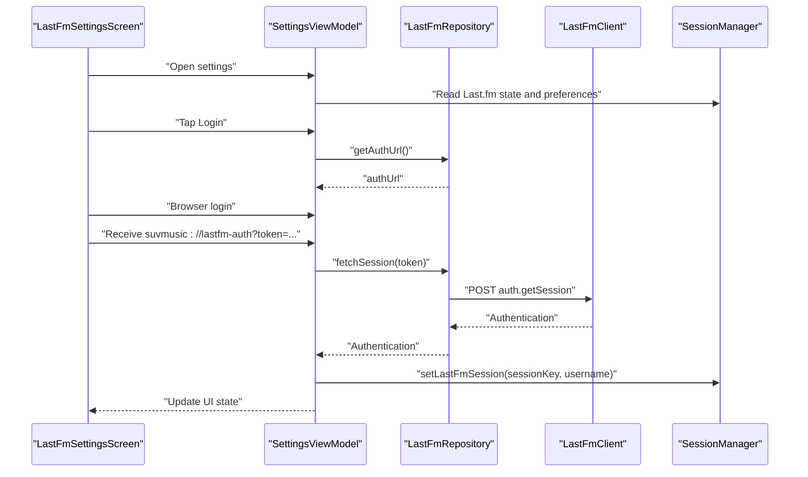
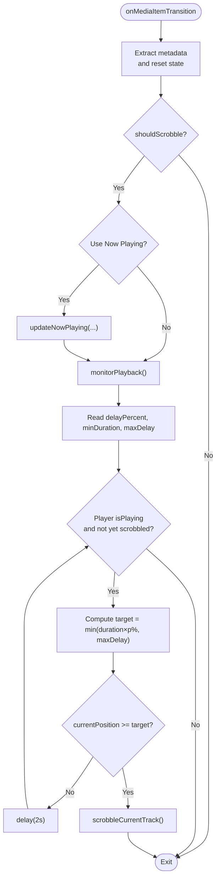
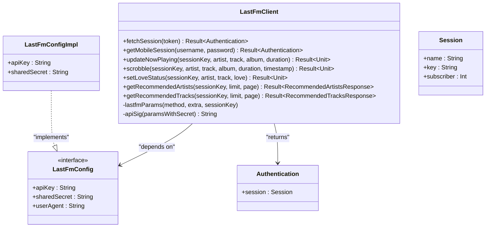
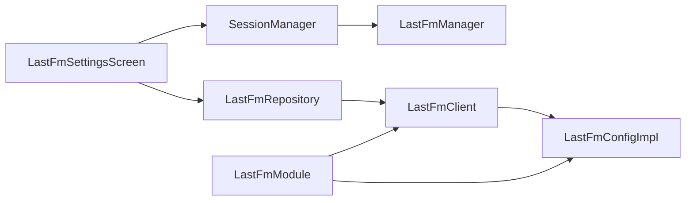

# Last.fm Scrobbling

<cite>
**Referenced Files in This Document**
- [LastFmManager.kt](file://app/src/main/java/com/suvojeet/suvmusic/player/LastFmManager.kt)
- [LastFmClient.kt](file://scrobbler/src/main/java/com/suvojeet/suvmusic/lastfm/LastFmClient.kt)
- [LastFmRepository.kt](file://scrobbler/src/main/java/com/suvojeet/suvmusic/lastfm/LastFmRepository.kt)
- [LastFmConfigImpl.kt](file://scrobbler/src/main/java/com/suvojeet/suvmusic/lastfm/LastFmConfigImpl.kt)
- [LastFmModels.kt](file://scrobbler/src/main/java/com/suvojeet/suvmusic/lastfm/LastFmModels.kt)
- [LastFmModule.kt](file://scrobbler/src/main/java/com/suvojeet/suvmusic/lastfm/di/LastFmModule.kt)
- [SessionManager.kt](file://app/src/main/java/com/suvojeet/suvmusic/data/SessionManager.kt)
- [LastFmSettingsScreen.kt](file://app/src/main/java/com/suvojeet/suvmusic/ui/screens/settings/LastFmSettingsScreen.kt)
- [ListeningHistoryDao.kt](file://core/data/src/main/java/com/suvojeet/suvmusic/core/data/local/dao/ListeningHistoryDao.kt)
- [ListeningHistory.kt](file://core/data/src/main/java/com/suvojeet/suvmusic/core/data/local/entity/ListeningHistory.kt)
</cite>

## Table of Contents
1. [Introduction](#introduction)
2. [Project Structure](#project-structure)
3. [Core Components](#core-components)
4. [Architecture Overview](#architecture-overview)
5. [Detailed Component Analysis](#detailed-component-analysis)
6. [Dependency Analysis](#dependency-analysis)
7. [Performance Considerations](#performance-considerations)
8. [Troubleshooting Guide](#troubleshooting-guide)
9. [Conclusion](#conclusion)

## Introduction
This document explains the Last.fm scrobbling integration that automatically submits listening history to Last.fm profiles. It covers authentication workflows, session management, submission protocols, scrobbling logic (track recognition, timing calculations, and batching), configuration and privacy controls, repository pattern for persistence, and error handling. The integration is implemented as a cohesive module with a dedicated client, repository, DI bindings, and a player manager that monitors playback and triggers submissions.

## Project Structure
The Last.fm integration spans three primary areas:
- Player-side orchestration: a manager that listens to playback events and decides when to scrobble.
- Last.fm API client and repository: HTTP client, typed models, and repository façade.
- Configuration and UI: session storage, settings screen, and user controls.

**Diagram sources**
- [LastFmManager.kt:18-190](file://app/src/main/java/com/suvojeet/suvmusic/player/LastFmManager.kt#L18-L190)
- [LastFmRepository.kt:9-43](file://scrobbler/src/main/java/com/suvojeet/suvmusic/lastfm/LastFmRepository.kt#L9-L43)
- [LastFmClient.kt:25-230](file://scrobbler/src/main/java/com/suvojeet/suvmusic/lastfm/LastFmClient.kt#L25-L230)
- [LastFmConfigImpl.kt:11-15](file://scrobbler/src/main/java/com/suvojeet/suvmusic/lastfm/LastFmConfigImpl.kt#L11-L15)
- [LastFmModule.kt:15-29](file://scrobbler/src/main/java/com/suvojeet/suvmusic/lastfm/di/LastFmModule.kt#L15-L29)
- [SessionManager.kt:496-622](file://app/src/main/java/com/suvojeet/suvmusic/data/SessionManager.kt#L496-L622)
- [LastFmSettingsScreen.kt:39-387](file://app/src/main/java/com/suvojeet/suvmusic/ui/screens/settings/LastFmSettingsScreen.kt#L39-L387)
- [ListeningHistoryDao.kt:11-99](file://core/data/src/main/java/com/suvojeet/suvmusic/core/data/local/dao/ListeningHistoryDao.kt#L11-L99)
- [ListeningHistory.kt:10-40](file://core/data/src/main/java/com/suvojeet/suvmusic/core/data/local/entity/ListeningHistory.kt#L10-L40)

**Section sources**
- [LastFmManager.kt:18-190](file://app/src/main/java/com/suvojeet/suvmusic/player/LastFmManager.kt#L18-L190)
- [LastFmRepository.kt:9-43](file://scrobbler/src/main/java/com/suvojeet/suvmusic/lastfm/LastFmRepository.kt#L9-L43)
- [LastFmClient.kt:25-230](file://scrobbler/src/main/java/com/suvojeet/suvmusic/lastfm/LastFmClient.kt#L25-L230)
- [LastFmConfigImpl.kt:11-15](file://scrobbler/src/main/java/com/suvojeet/suvmusic/lastfm/LastFmConfigImpl.kt#L11-L15)
- [LastFmModule.kt:15-29](file://scrobbler/src/main/java/com/suvojeet/suvmusic/lastfm/di/LastFmModule.kt#L15-L29)
- [SessionManager.kt:496-622](file://app/src/main/java/com/suvojeet/suvmusic/data/SessionManager.kt#L496-L622)
- [LastFmSettingsScreen.kt:39-387](file://app/src/main/java/com/suvojeet/suvmusic/ui/screens/settings/LastFmSettingsScreen.kt#L39-L387)
- [ListeningHistoryDao.kt:11-99](file://core/data/src/main/java/com/suvojeet/suvmusic/core/data/local/dao/ListeningHistoryDao.kt#L11-L99)
- [ListeningHistory.kt:10-40](file://core/data/src/main/java/com/suvojeet/suvmusic/core/data/local/entity/ListeningHistory.kt#L10-L40)

## Core Components
- LastFmManager: Monitors playback lifecycle, extracts metadata, updates “Now Playing,” and schedules scrobble timing based on configurable rules.
- LastFmRepository: Provides a clean façade over LastFmClient operations (session, now playing, scrobble, loves).
- LastFmClient: Implements Last.fm API requests, signature generation, and JSON parsing.
- LastFmConfigImpl: Supplies API key and shared secret from build-time configuration.
- SessionManager: Stores Last.fm session key and username, plus scrobbling preferences and thresholds.
- LastFmSettingsScreen: UI for connecting/disconnecting, toggling features, and adjusting scrobbling rules.
- Persistence: Room DAO and entity for listening history (used by the app’s library/history subsystem; scrobbling writes are handled by the Last.fm client).

**Section sources**
- [LastFmManager.kt:18-190](file://app/src/main/java/com/suvojeet/suvmusic/player/LastFmManager.kt#L18-L190)
- [LastFmRepository.kt:9-43](file://scrobbler/src/main/java/com/suvojeet/suvmusic/lastfm/LastFmRepository.kt#L9-L43)
- [LastFmClient.kt:25-230](file://scrobbler/src/main/java/com/suvojeet/suvmusic/lastfm/LastFmClient.kt#L25-L230)
- [LastFmConfigImpl.kt:11-15](file://scrobbler/src/main/java/com/suvojeet/suvmusic/lastfm/LastFmConfigImpl.kt#L11-L15)
- [SessionManager.kt:496-622](file://app/src/main/java/com/suvojeet/suvmusic/data/SessionManager.kt#L496-L622)
- [LastFmSettingsScreen.kt:39-387](file://app/src/main/java/com/suvojeet/suvmusic/ui/screens/settings/LastFmSettingsScreen.kt#L39-L387)
- [ListeningHistoryDao.kt:11-99](file://core/data/src/main/java/com/suvojeet/suvmusic/core/data/local/dao/ListeningHistoryDao.kt#L11-L99)
- [ListeningHistory.kt:10-40](file://core/data/src/main/java/com/suvojeet/suvmusic/core/data/local/entity/ListeningHistory.kt#L10-L40)

## Architecture Overview
The integration follows a layered architecture:
- UI layer (Compose) exposes Last.fm settings and connection flows.
- Domain layer (LastFmManager) encapsulates playback-aware scrobbling logic.
- Data layer (Repository + Client) handles authentication and submission to Last.fm.
- Persistence layer (Room) stores listening history and user preferences.

**Diagram sources**
- [LastFmSettingsScreen.kt:274-331](file://app/src/main/java/com/suvojeet/suvmusic/ui/screens/settings/LastFmSettingsScreen.kt#L274-L331)
- [LastFmRepository.kt:41-42](file://scrobbler/src/main/java/com/suvojeet/suvmusic/lastfm/LastFmRepository.kt#L41-L42)
- [LastFmClient.kt:72-89](file://scrobbler/src/main/java/com/suvojeet/suvmusic/lastfm/LastFmClient.kt#L72-L89)
- [SessionManager.kt:496-522](file://app/src/main/java/com/suvojeet/suvmusic/data/SessionManager.kt#L496-L522)

## Detailed Component Analysis

### LastFmManager: Playback-aware Scrobbling Orchestrator
Responsibilities:
- Subscribes to playback events and reacts to track transitions and play/pause.
- Extracts metadata from the current MediaItem.
- Optionally updates “Now Playing” before monitoring begins.
- Monitors playback position and duration to decide when to scrobble according to configured rules.
- Cancels monitoring when paused or when the track changes.

Timing logic:
- Reads minimum duration, delay percentage, and maximum delay from SessionManager.
- Calculates target time as min(duration × delay%, maxDelaySeconds).
- Scrobbles when position reaches target time and marks the current track as scrobbled to avoid duplicates.

Privacy and gating:
- Respects privacy mode and Last.fm scrobbling enable flag.
- Skips ad-like placeholders and respects user settings.

**Diagram sources**
- [LastFmManager.kt:44-165](file://app/src/main/java/com/suvojeet/suvmusic/player/LastFmManager.kt#L44-L165)

**Section sources**
- [LastFmManager.kt:18-190](file://app/src/main/java/com/suvojeet/suvmusic/player/LastFmManager.kt#L18-L190)

### LastFmClient: Last.fm API Client and Signature Generation
Capabilities:
- Authenticates via token-to-session and mobile session flows.
- Updates “Now Playing” and submits scrobbles.
- Sets/unsets love status for tracks.
- Fetches user recommendations.
- Generates MD5 signatures for API requests using a deterministic parameter ordering and shared secret.
- Uses Ktor with JSON serialization and a default Last.fm endpoint.

Endpoints used:
- auth.getSession
- auth.getMobileSession
- track.updateNowPlaying
- track.scrobble
- track.love / track.unlove
- user.getRecommendedArtists
- user.getRecommendedTracks

Request/response:
- Requests are multipart/form-data with api_key, method, optional sk, and api_sig computed from sorted parameters plus sharedSecret.
- Responses are parsed into Kotlinx serializable models; errors are decoded and rethrown as exceptions.

**Diagram sources**
- [LastFmClient.kt:25-230](file://scrobbler/src/main/java/com/suvojeet/suvmusic/lastfm/LastFmClient.kt#L25-L230)
- [LastFmConfigImpl.kt:11-15](file://scrobbler/src/main/java/com/suvojeet/suvmusic/lastfm/LastFmConfigImpl.kt#L11-L15)
- [LastFmModels.kt:6-16](file://scrobbler/src/main/java/com/suvojeet/suvmusic/lastfm/LastFmModels.kt#L6-L16)

**Section sources**
- [LastFmClient.kt:25-230](file://scrobbler/src/main/java/com/suvojeet/suvmusic/lastfm/LastFmClient.kt#L25-L230)
- [LastFmModels.kt:6-16](file://scrobbler/src/main/java/com/suvojeet/suvmusic/lastfm/LastFmModels.kt#L6-L16)

### LastFmRepository: Repository Façade
- Exposes suspend functions mirroring LastFmClient capabilities.
- Runs on IO dispatcher for network-bound operations.
- Provides a single entry point for the rest of the app to call Last.fm operations.

**Section sources**
- [LastFmRepository.kt:9-43](file://scrobbler/src/main/java/com/suvojeet/suvmusic/lastfm/LastFmRepository.kt#L9-L43)

### SessionManager: Authentication and Preferences
- Stores Last.fm session key and username in encrypted preferences.
- Exposes flows and setters for:
  - Scrobbling enablement
  - Recommendations enablement
  - “Now Playing” enablement
  - Like sync enablement
  - Scrobbling rules: delay percentage, minimum duration, and maximum delay
- Also manages privacy mode and other app-wide settings.

**Section sources**
- [SessionManager.kt:496-622](file://app/src/main/java/com/suvojeet/suvmusic/data/SessionManager.kt#L496-L622)

### LastFmSettingsScreen: User Controls and Authentication UI
- Displays connection status and allows logout.
- Presents toggles for enabling scrobbling, recommendations, “Now Playing,” and sending likes.
- Provides sliders to adjust minimum duration and scrobble percentage.
- Implements two login flows:
  - Mobile session via username/password.
  - Browser-based OAuth using a custom scheme callback to extract the token and exchange it for a session.

**Section sources**
- [LastFmSettingsScreen.kt:39-387](file://app/src/main/java/com/suvojeet/suvmusic/ui/screens/settings/LastFmSettingsScreen.kt#L39-L387)

### Persistence: Listening History (Supporting Data)
- Room DAO and entity capture listening statistics, useful for analytics and recommendations within the app.
- While scrobbling submissions are handled by the Last.fm client, the app maintains a separate history dataset for internal use.

**Section sources**
- [ListeningHistoryDao.kt:11-99](file://core/data/src/main/java/com/suvojeet/suvmusic/core/data/local/dao/ListeningHistoryDao.kt#L11-L99)
- [ListeningHistory.kt:10-40](file://core/data/src/main/java/com/suvojeet/suvmusic/core/data/local/entity/ListeningHistory.kt#L10-L40)

## Dependency Analysis
- DI wiring binds LastFmConfigImpl to LastFmConfig and constructs LastFmClient with it.
- LastFmRepository depends on LastFmClient.
- LastFmManager depends on LastFmRepository and SessionManager.
- UI interacts with LastFmRepository indirectly via ViewModel to obtain auth URLs and process tokens.

**Diagram sources**
- [LastFmModule.kt:15-29](file://scrobbler/src/main/java/com/suvojeet/suvmusic/lastfm/di/LastFmModule.kt#L15-L29)
- [LastFmRepository.kt:9-11](file://scrobbler/src/main/java/com/suvojeet/suvmusic/lastfm/LastFmRepository.kt#L9-L11)
- [LastFmClient.kt:25-27](file://scrobbler/src/main/java/com/suvojeet/suvmusic/lastfm/LastFmClient.kt#L25-L27)
- [LastFmConfigImpl.kt:11-15](file://scrobbler/src/main/java/com/suvojeet/suvmusic/lastfm/LastFmConfigImpl.kt#L11-L15)
- [LastFmManager.kt:18-21](file://app/src/main/java/com/suvojeet/suvmusic/player/LastFmManager.kt#L18-L21)
- [SessionManager.kt:496-522](file://app/src/main/java/com/suvojeet/suvmusic/data/SessionManager.kt#L496-L522)
- [LastFmSettingsScreen.kt:39-387](file://app/src/main/java/com/suvojeet/suvmusic/ui/screens/settings/LastFmSettingsScreen.kt#L39-L387)

**Section sources**
- [LastFmModule.kt:15-29](file://scrobbler/src/main/java/com/suvojeet/suvmusic/lastfm/di/LastFmModule.kt#L15-L29)
- [LastFmRepository.kt:9-11](file://scrobbler/src/main/java/com/suvojeet/suvmusic/lastfm/LastFmRepository.kt#L9-L11)
- [LastFmClient.kt:25-27](file://scrobbler/src/main/java/com/suvojeet/suvmusic/lastfm/LastFmClient.kt#L25-L27)
- [LastFmConfigImpl.kt:11-15](file://scrobbler/src/main/java/com/suvojeet/suvmusic/lastfm/LastFmConfigImpl.kt#L11-L15)
- [LastFmManager.kt:18-21](file://app/src/main/java/com/suvojeet/suvmusic/player/LastFmManager.kt#L18-L21)
- [SessionManager.kt:496-522](file://app/src/main/java/com/suvojeet/suvmusic/data/SessionManager.kt#L496-L522)
- [LastFmSettingsScreen.kt:39-387](file://app/src/main/java/com/suvojeet/suvmusic/ui/screens/settings/LastFmSettingsScreen.kt#L39-L387)

## Performance Considerations
- Monitoring loop checks playback every 2 seconds to balance responsiveness and battery usage.
- Scrobbling occurs only once per track to prevent duplicates.
- Network calls are dispatched on IO; UI remains responsive.
- Signature computation is lightweight and performed synchronously before request dispatch.
- Consider batching multiple scrobbles for future enhancements; current implementation submits per-track.

[No sources needed since this section provides general guidance]

## Troubleshooting Guide
Common issues and remedies:
- Authentication failures:
  - Verify API keys and shared secret are present and correct.
  - Ensure the token exchange returns a valid session; inspect error messages returned by the client.
- “Now Playing” or scrobble failures:
  - Confirm session key exists and is not expired.
  - Check privacy mode and scrobbling enable flags.
  - Validate that the track meets minimum duration and timing thresholds.
- Rate limiting and errors:
  - The client treats non-success HTTP responses and error fields in JSON as failures; wrap calls in try/catch and surface user-friendly messages.
  - Respect Last.fm rate limits by avoiding excessive retries; the current implementation surfaces errors without built-in retry loops.

Operational tips:
- Use logs to observe scrobbling decisions and failures.
- Test browser-based OAuth by ensuring the custom scheme callback is handled and the token is extracted correctly.

**Section sources**
- [LastFmClient.kt:72-89](file://scrobbler/src/main/java/com/suvojeet/suvmusic/lastfm/LastFmClient.kt#L72-L89)
- [LastFmClient.kt:110-155](file://scrobbler/src/main/java/com/suvojeet/suvmusic/lastfm/LastFmClient.kt#L110-L155)
- [LastFmManager.kt:87-98](file://app/src/main/java/com/suvojeet/suvmusic/player/LastFmManager.kt#L87-L98)
- [LastFmManager.kt:167-188](file://app/src/main/java/com/suvojeet/suvmusic/player/LastFmManager.kt#L167-L188)

## Conclusion
The Last.fm integration is modular, testable, and user-driven. It authenticates via token exchange or mobile session, respects user preferences and privacy, and submits scrobbles based on precise timing rules. The repository and client abstractions cleanly separate concerns, while DI ensures easy testing and configuration. Future enhancements could include offline queue management and retry mechanisms for robustness under poor connectivity.