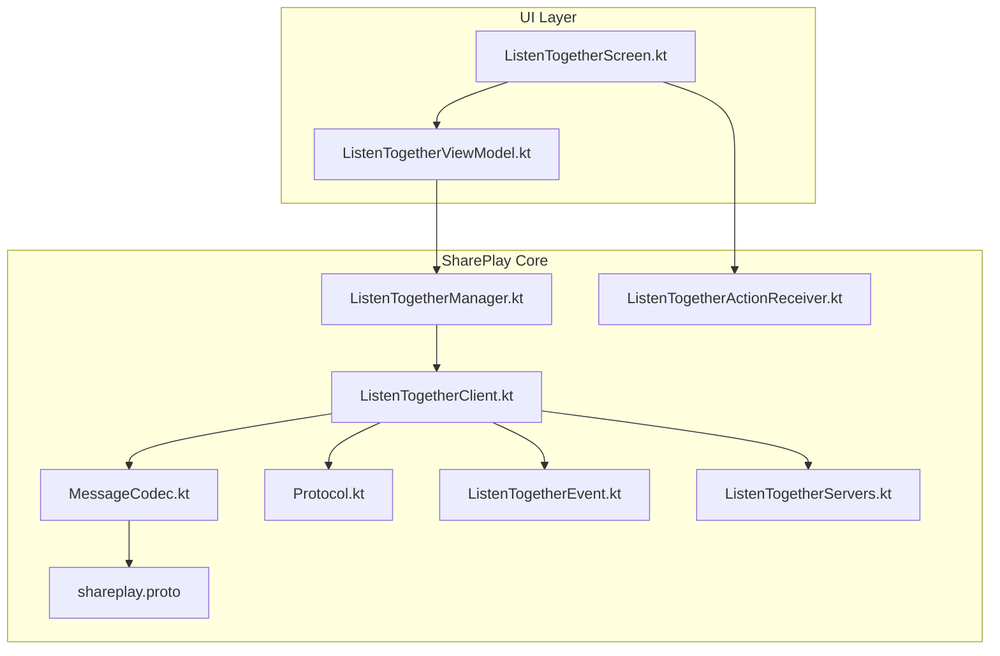
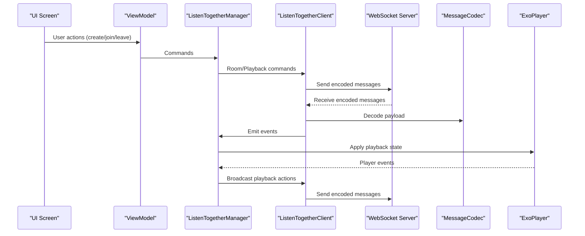
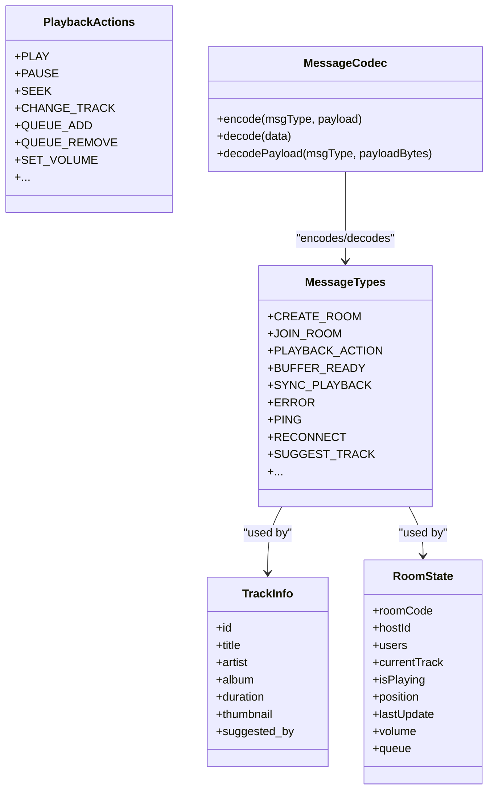
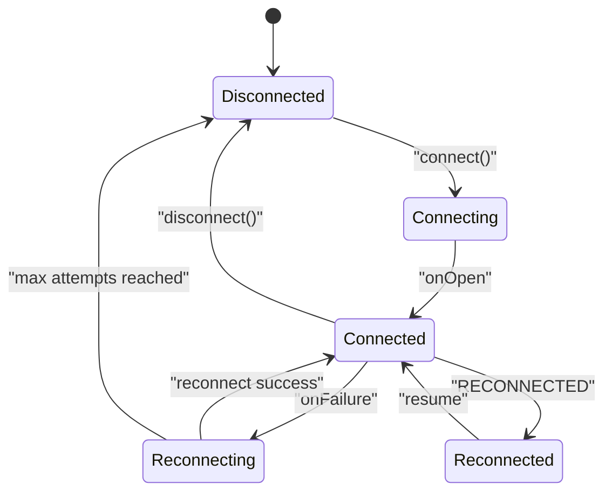
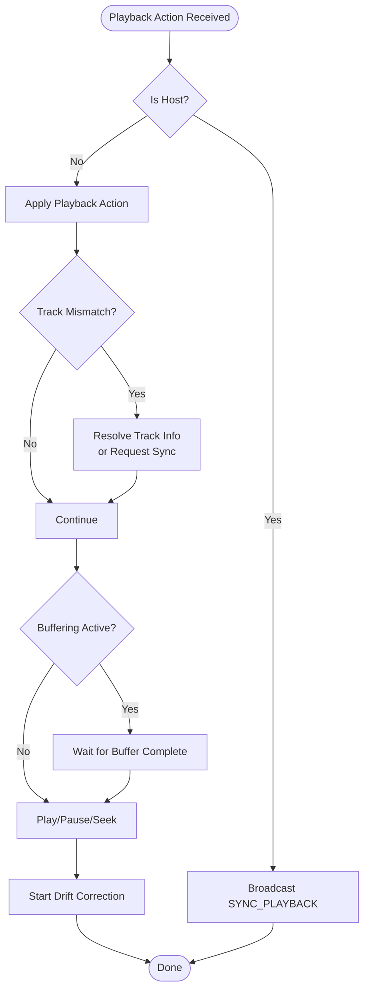
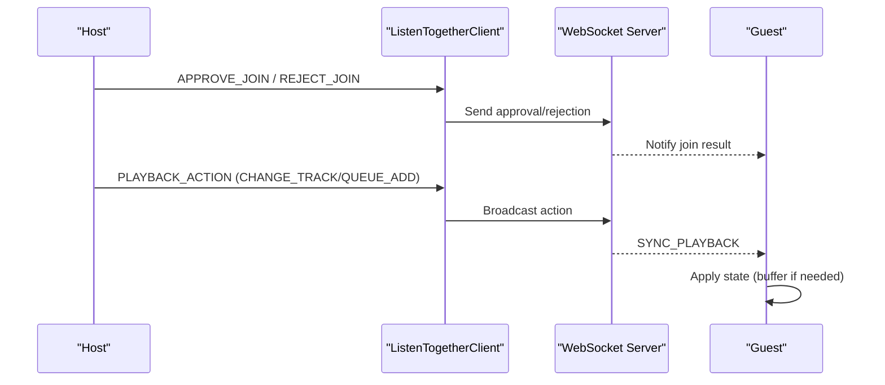
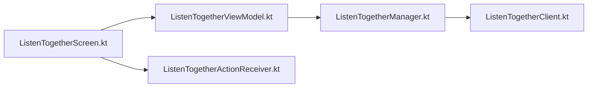
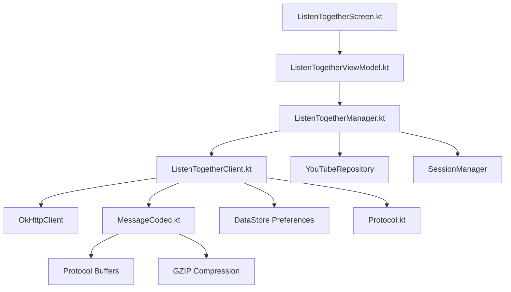

# Listen Together

<cite>
**Referenced Files in This Document**
- [ListenTogetherManager.kt](file://app/src/main/java/com/suvojeet/suvmusic/shareplay/ListenTogetherManager.kt)
- [ListenTogetherClient.kt](file://app/src/main/java/com/suvojeet/suvmusic/shareplay/ListenTogetherClient.kt)
- [Protocol.kt](file://app/src/main/java/com/suvojeet/suvmusic/shareplay/Protocol.kt)
- [MessageCodec.kt](file://app/src/main/java/com/suvojeet/suvmusic/shareplay/MessageCodec.kt)
- [ListenTogetherEvent.kt](file://app/src/main/java/com/suvojeet/suvmusic/shareplay/ListenTogetherEvent.kt)
- [ListenTogetherServers.kt](file://app/src/main/java/com/suvojeet/suvmusic/shareplay/ListenTogetherServers.kt)
- [ListenTogetherActionReceiver.kt](file://app/src/main/java/com/suvojeet/suvmusic/shareplay/ListenTogetherActionReceiver.kt)
- [shareplay.proto](file://app/src/main/proto/shareplay.proto)
- [ListenTogetherScreen.kt](file://app/src/main/java/com/suvojeet/suvmusic/ui/screens/ListenTogetherScreen.kt)
- [ListenTogetherViewModel.kt](file://app/src/main/java/com/suvojeet/suvmusic/ui/viewmodel/ListenTogetherViewModel.kt)
</cite>

## Table of Contents
1. [Introduction](#introduction)
2. [Project Structure](#project-structure)
3. [Core Components](#core-components)
4. [Architecture Overview](#architecture-overview)
5. [Detailed Component Analysis](#detailed-component-analysis)
6. [Dependency Analysis](#dependency-analysis)
7. [Performance Considerations](#performance-considerations)
8. [Troubleshooting Guide](#troubleshooting-guide)
9. [Conclusion](#conclusion)
10. [Appendices](#appendices)

## Introduction
Listen Together enables synchronized multi-device music playback over a WebSocket-based protocol. It coordinates playback actions among a host and multiple guests, ensuring near-perfect synchronization despite network conditions. The system includes robust connection management, room lifecycle control, user authentication and authorization, queue management, and drift correction to maintain precise timing across devices.

## Project Structure
The Listen Together feature is implemented primarily under the shareplay package and integrates with the UI via Compose screens and a ViewModel. The protocol is defined using Protocol Buffers and serialized over WebSocket.

**Diagram sources**
- [ListenTogetherScreen.kt:1-1200](file://app/src/main/java/com/suvojeet/suvmusic/ui/screens/ListenTogetherScreen.kt#L1-L1200)
- [ListenTogetherViewModel.kt:1-193](file://app/src/main/java/com/suvojeet/suvmusic/ui/viewmodel/ListenTogetherViewModel.kt#L1-L193)
- [ListenTogetherManager.kt:1-828](file://app/src/main/java/com/suvojeet/suvmusic/shareplay/ListenTogetherManager.kt#L1-L828)
- [ListenTogetherClient.kt:1-1205](file://app/src/main/java/com/suvojeet/suvmusic/shareplay/ListenTogetherClient.kt#L1-L1205)
- [MessageCodec.kt:1-355](file://app/src/main/java/com/suvojeet/suvmusic/shareplay/MessageCodec.kt#L1-L355)
- [Protocol.kt:1-320](file://app/src/main/java/com/suvojeet/suvmusic/shareplay/Protocol.kt#L1-L320)
- [ListenTogetherEvent.kt:1-35](file://app/src/main/java/com/suvojeet/suvmusic/shareplay/ListenTogetherEvent.kt#L1-L35)
- [ListenTogetherServers.kt:1-42](file://app/src/main/java/com/suvojeet/suvmusic/shareplay/ListenTogetherServers.kt#L1-L42)
- [ListenTogetherActionReceiver.kt:1-43](file://app/src/main/java/com/suvojeet/suvmusic/shareplay/ListenTogetherActionReceiver.kt#L1-L43)
- [shareplay.proto:1-223](file://app/src/main/proto/shareplay.proto#L1-L223)

**Section sources**
- [ListenTogetherScreen.kt:1-1200](file://app/src/main/java/com/suvojeet/suvmusic/ui/screens/ListenTogetherScreen.kt#L1-L1200)
- [ListenTogetherViewModel.kt:1-193](file://app/src/main/java/com/suvojeet/suvmusic/ui/viewmodel/ListenTogetherViewModel.kt#L1-L193)
- [ListenTogetherManager.kt:1-828](file://app/src/main/java/com/suvojeet/suvmusic/shareplay/ListenTogetherManager.kt#L1-L828)
- [ListenTogetherClient.kt:1-1205](file://app/src/main/java/com/suvojeet/suvmusic/shareplay/ListenTogetherClient.kt#L1-L1205)
- [MessageCodec.kt:1-355](file://app/src/main/java/com/suvojeet/suvmusic/shareplay/MessageCodec.kt#L1-L355)
- [Protocol.kt:1-320](file://app/src/main/java/com/suvojeet/suvmusic/shareplay/Protocol.kt#L1-L320)
- [ListenTogetherEvent.kt:1-35](file://app/src/main/java/com/suvojeet/suvmusic/shareplay/ListenTogetherEvent.kt#L1-L35)
- [ListenTogetherServers.kt:1-42](file://app/src/main/java/com/suvojeet/suvmusic/shareplay/ListenTogetherServers.kt#L1-L42)
- [ListenTogetherActionReceiver.kt:1-43](file://app/src/main/java/com/suvojeet/suvmusic/shareplay/ListenTogetherActionReceiver.kt#L1-L43)
- [shareplay.proto:1-223](file://app/src/main/proto/shareplay.proto#L1-L223)

## Core Components
- ListenTogetherManager: Bridges the WebSocket client with the ExoPlayer, orchestrating playback actions, drift correction, buffering, and state synchronization.
- ListenTogetherClient: Implements the WebSocket client, connection lifecycle, message encoding/decoding, room management, and event emission.
- MessageCodec: Encodes/decodes messages using Protocol Buffers with optional compression.
- Protocol: Defines message types, payloads, and data structures for the protocol.
- ListenTogetherEvent: Sealed class representing all events emitted by the client.
- ListenTogetherServers: Provides server configuration and default server URL.
- ListenTogetherActionReceiver: Handles notification actions for join requests and suggestions.
- UI Integration: Compose screen and ViewModel expose state and commands to the user.

**Section sources**
- [ListenTogetherManager.kt:1-828](file://app/src/main/java/com/suvojeet/suvmusic/shareplay/ListenTogetherManager.kt#L1-L828)
- [ListenTogetherClient.kt:1-1205](file://app/src/main/java/com/suvojeet/suvmusic/shareplay/ListenTogetherClient.kt#L1-L1205)
- [MessageCodec.kt:1-355](file://app/src/main/java/com/suvojeet/suvmusic/shareplay/MessageCodec.kt#L1-L355)
- [Protocol.kt:1-320](file://app/src/main/java/com/suvojeet/suvmusic/shareplay/Protocol.kt#L1-L320)
- [ListenTogetherEvent.kt:1-35](file://app/src/main/java/com/suvojeet/suvmusic/shareplay/ListenTogetherEvent.kt#L1-L35)
- [ListenTogetherServers.kt:1-42](file://app/src/main/java/com/suvojeet/suvmusic/shareplay/ListenTogetherServers.kt#L1-L42)
- [ListenTogetherActionReceiver.kt:1-43](file://app/src/main/java/com/suvojeet/suvmusic/shareplay/ListenTogetherActionReceiver.kt#L1-L43)
- [ListenTogetherScreen.kt:1-1200](file://app/src/main/java/com/suvojeet/suvmusic/ui/screens/ListenTogetherScreen.kt#L1-L1200)
- [ListenTogetherViewModel.kt:1-193](file://app/src/main/java/com/suvojeet/suvmusic/ui/viewmodel/ListenTogetherViewModel.kt#L1-L193)

## Architecture Overview
The system follows a role-based architecture:
- Host: Creates and manages the room, controls playback, and approves join requests.
- Guest: Joins rooms, receives synchronized playback, and can propose track suggestions.

**Diagram sources**
- [ListenTogetherScreen.kt:1-1200](file://app/src/main/java/com/suvojeet/suvmusic/ui/screens/ListenTogetherScreen.kt#L1-L1200)
- [ListenTogetherViewModel.kt:1-193](file://app/src/main/java/com/suvojeet/suvmusic/ui/viewmodel/ListenTogetherViewModel.kt#L1-L193)
- [ListenTogetherManager.kt:1-828](file://app/src/main/java/com/suvojeet/suvmusic/shareplay/ListenTogetherManager.kt#L1-L828)
- [ListenTogetherClient.kt:1-1205](file://app/src/main/java/com/suvojeet/suvmusic/shareplay/ListenTogetherClient.kt#L1-L1205)
- [MessageCodec.kt:1-355](file://app/src/main/java/com/suvojeet/suvmusic/shareplay/MessageCodec.kt#L1-L355)

## Detailed Component Analysis

### WebSocket Protocol and Message Flow
- Message Types: Client-to-server and server-to-client types are defined for room lifecycle, playback actions, buffering, errors, and suggestions.
- Payloads: Strongly typed payloads for room state, track info, user info, and action payloads.
- Encoding: Messages are encoded using Protocol Buffers with optional compression.

**Diagram sources**
- [Protocol.kt:1-320](file://app/src/main/java/com/suvojeet/suvmusic/shareplay/Protocol.kt#L1-L320)
- [MessageCodec.kt:1-355](file://app/src/main/java/com/suvojeet/suvmusic/shareplay/MessageCodec.kt#L1-L355)

**Section sources**
- [Protocol.kt:1-320](file://app/src/main/java/com/suvojeet/suvmusic/shareplay/Protocol.kt#L1-L320)
- [MessageCodec.kt:1-355](file://app/src/main/java/com/suvojeet/suvmusic/shareplay/MessageCodec.kt#L1-L355)
- [shareplay.proto:1-223](file://app/src/main/proto/shareplay.proto#L1-L223)

### Connection Management and Room Lifecycle
- Connection States: DISCONNECTED, CONNECTING, CONNECTED, RECONNECTING, ERROR.
- Role States: HOST, GUEST, NONE.
- Persistence: Session token, room code, user ID, and timestamp are persisted for graceful reconnection.
- Reconnection: Exponential backoff with jitter; persists session for grace period.
- Notifications: Join requests and suggestions are shown via notifications with broadcast actions.

**Diagram sources**
- [ListenTogetherClient.kt:411-702](file://app/src/main/java/com/suvojeet/suvmusic/shareplay/ListenTogetherClient.kt#L411-L702)
- [ListenTogetherClient.kt:975-989](file://app/src/main/java/com/suvojeet/suvmusic/shareplay/ListenTogetherClient.kt#L975-L989)

**Section sources**
- [ListenTogetherClient.kt:1-1205](file://app/src/main/java/com/suvojeet/suvmusic/shareplay/ListenTogetherClient.kt#L1-L1205)
- [ListenTogetherServers.kt:1-42](file://app/src/main/java/com/suvojeet/suvmusic/shareplay/ListenTogetherServers.kt#L1-L42)
- [ListenTogetherActionReceiver.kt:1-43](file://app/src/main/java/com/suvojeet/suvmusic/shareplay/ListenTogetherActionReceiver.kt#L1-L43)

### Playback Synchronization and Drift Correction
- Host Responsibilities: Detects play/pause/seek/track changes and broadcasts actions.
- Guest Responsibilities: Applies actions, buffers before playback, and resolves track mismatches.
- Drift Correction: Maintains anchor timestamps and adjusts playback speed or seeks to minimize drift.
- Buffering Protocol: Guests signal readiness; server waits for all guests; then signals completion.

**Diagram sources**
- [ListenTogetherManager.kt:418-556](file://app/src/main/java/com/suvojeet/suvmusic/shareplay/ListenTogetherManager.kt#L418-L556)
- [ListenTogetherManager.kt:336-380](file://app/src/main/java/com/suvojeet/suvmusic/shareplay/ListenTogetherManager.kt#L336-L380)

**Section sources**
- [ListenTogetherManager.kt:1-828](file://app/src/main/java/com/suvojeet/suvmusic/shareplay/ListenTogetherManager.kt#L1-L828)

### Role-Based Architecture and Queue Management
- Host Controls: Approve/reject join requests, kick users, transfer host, broadcast playback actions.
- Guest Controls: Join rooms, request sync, propose tracks, manage suggestions.
- Queue Operations: Add/remove/clear queue entries; insert next option; sync queue state.

**Diagram sources**
- [ListenTogetherClient.kt:1087-1161](file://app/src/main/java/com/suvojeet/suvmusic/shareplay/ListenTogetherClient.kt#L1087-L1161)
- [ListenTogetherClient.kt:838-900](file://app/src/main/java/com/suvojeet/suvmusic/shareplay/ListenTogetherClient.kt#L838-L900)

**Section sources**
- [ListenTogetherClient.kt:1-1205](file://app/src/main/java/com/suvojeet/suvmusic/shareplay/ListenTogetherClient.kt#L1-L1205)
- [Protocol.kt:1-320](file://app/src/main/java/com/suvojeet/suvmusic/shareplay/Protocol.kt#L1-L320)

### UI Integration and User Experience
- ListenTogetherScreen: Presents connection, setup, and room views; displays join requests, listeners, and stats.
- ListenTogetherViewModel: Exposes state flows and commands; persists user preferences and server URL.
- Notifications: Join requests and suggestions trigger notifications with actionable buttons.

**Diagram sources**
- [ListenTogetherScreen.kt:1-1200](file://app/src/main/java/com/suvojeet/suvmusic/ui/screens/ListenTogetherScreen.kt#L1-L1200)
- [ListenTogetherViewModel.kt:1-193](file://app/src/main/java/com/suvojeet/suvmusic/ui/viewmodel/ListenTogetherViewModel.kt#L1-L193)
- [ListenTogetherActionReceiver.kt:1-43](file://app/src/main/java/com/suvojeet/suvmusic/shareplay/ListenTogetherActionReceiver.kt#L1-L43)

**Section sources**
- [ListenTogetherScreen.kt:1-1200](file://app/src/main/java/com/suvojeet/suvmusic/ui/screens/ListenTogetherScreen.kt#L1-L1200)
- [ListenTogetherViewModel.kt:1-193](file://app/src/main/java/com/suvojeet/suvmusic/ui/viewmodel/ListenTogetherViewModel.kt#L1-L193)
- [ListenTogetherActionReceiver.kt:1-43](file://app/src/main/java/com/suvojeet/suvmusic/shareplay/ListenTogetherActionReceiver.kt#L1-L43)

## Dependency Analysis
- ListenTogetherManager depends on ListenTogetherClient, YouTubeRepository, and SessionManager.
- ListenTogetherClient depends on OkHttp WebSocket, MessageCodec, and Android DataStore for persistence.
- MessageCodec depends on Protocol Buffers and GZIP for compression.
- Protocol defines shared data structures used across components.
- UI components depend on ViewModel and listen to state flows.

**Diagram sources**
- [ListenTogetherManager.kt:1-828](file://app/src/main/java/com/suvojeet/suvmusic/shareplay/ListenTogetherManager.kt#L1-L828)
- [ListenTogetherClient.kt:1-1205](file://app/src/main/java/com/suvojeet/suvmusic/shareplay/ListenTogetherClient.kt#L1-L1205)
- [MessageCodec.kt:1-355](file://app/src/main/java/com/suvojeet/suvmusic/shareplay/MessageCodec.kt#L1-L355)
- [Protocol.kt:1-320](file://app/src/main/java/com/suvojeet/suvmusic/shareplay/Protocol.kt#L1-L320)
- [ListenTogetherScreen.kt:1-1200](file://app/src/main/java/com/suvojeet/suvmusic/ui/screens/ListenTogetherScreen.kt#L1-L1200)
- [ListenTogetherViewModel.kt:1-193](file://app/src/main/java/com/suvojeet/suvmusic/ui/viewmodel/ListenTogetherViewModel.kt#L1-L193)

**Section sources**
- [ListenTogetherManager.kt:1-828](file://app/src/main/java/com/suvojeet/suvmusic/shareplay/ListenTogetherManager.kt#L1-L828)
- [ListenTogetherClient.kt:1-1205](file://app/src/main/java/com/suvojeet/suvmusic/shareplay/ListenTogetherClient.kt#L1-L1205)
- [MessageCodec.kt:1-355](file://app/src/main/java/com/suvojeet/suvmusic/shareplay/MessageCodec.kt#L1-L355)
- [Protocol.kt:1-320](file://app/src/main/java/com/suvojeet/suvmusic/shareplay/Protocol.kt#L1-L320)
- [ListenTogetherScreen.kt:1-1200](file://app/src/main/java/com/suvojeet/suvmusic/ui/screens/ListenTogetherScreen.kt#L1-L1200)
- [ListenTogetherViewModel.kt:1-193](file://app/src/main/java/com/suvojeet/suvmusic/ui/viewmodel/ListenTogetherViewModel.kt#L1-L193)

## Performance Considerations
- Compression: MessageCodec compresses payloads larger than a threshold to reduce bandwidth.
- Backoff: Exponential backoff with jitter prevents thundering herd on reconnection.
- Drift Correction: Periodic drift checks adjust playback speed or seek to maintain synchronization.
- Buffering: Guests buffer before playback to avoid desync; timeouts force play if needed.
- Wake Lock: Acquired during room sessions to keep CPU awake for reliable operation.

[No sources needed since this section provides general guidance]

## Troubleshooting Guide
Common issues and resolutions:
- Connection Failures: The client attempts reconnection with exponential backoff; check server URL and network connectivity.
- Session Expired: On “session_not_found” error, the client attempts to rejoin automatically or clears persisted session.
- Privacy Mode: Rooms are left automatically when privacy mode is enabled.
- Blocking Users: Blocked users are auto-rejected; use unblock to restore.
- Buffering Delays: Timeout logic forces playback if buffering takes too long.

**Section sources**
- [ListenTogetherClient.kt:652-702](file://app/src/main/java/com/suvojeet/suvmusic/shareplay/ListenTogetherClient.kt#L652-L702)
- [ListenTogetherClient.kt:949-969](file://app/src/main/java/com/suvojeet/suvmusic/shareplay/ListenTogetherClient.kt#L949-L969)
- [ListenTogetherManager.kt:218-227](file://app/src/main/java/com/suvojeet/suvmusic/shareplay/ListenTogetherManager.kt#L218-L227)
- [ListenTogetherClient.kt:294-314](file://app/src/main/java/com/suvojeet/suvmusic/shareplay/ListenTogetherClient.kt#L294-L314)

## Conclusion
Listen Together provides a robust, real-time multi-device music synchronization solution. Its WebSocket-based protocol, role-based architecture, and drift correction mechanisms ensure smooth, synchronized playback across devices. The implementation balances reliability, performance, and user experience through careful connection management, buffering strategies, and UI integration.

[No sources needed since this section summarizes without analyzing specific files]

## Appendices

### Protocol Specification

- Message Types
  - Client -> Server: create_room, join_room, leave_room, approve_join, reject_join, playback_action, buffer_ready, kick_user, transfer_host, ping, chat, request_sync, reconnect, suggest_track, approve_suggestion, reject_suggestion.
  - Server -> Client: room_created, join_request, join_approved, join_rejected, user_joined, user_left, sync_playback, buffer_wait, buffer_complete, error, pong, host_changed, kicked, sync_state, reconnected, user_reconnected, user_disconnected, suggestion_received, suggestion_approved, suggestion_rejected.

- Playback Actions
  - play, pause, seek, skip_next, skip_prev, change_track, queue_add, queue_remove, queue_clear, sync_queue, set_volume.

- Data Structures
  - TrackInfo: id, title, artist, album, duration, thumbnail, suggested_by.
  - UserInfo: user_id, username, is_host, is_connected.
  - RoomState: room_code, host_id, users, current_track, is_playing, position, last_update, volume, queue.

- Payloads
  - CreateRoomPayload, JoinRoomPayload, ApproveJoinPayload, RejectJoinPayload, PlaybackActionPayload, BufferReadyPayload, KickUserPayload, TransferHostPayload, SuggestTrackPayload, ApproveSuggestionPayload, RejectSuggestionPayload, ReconnectPayload.
  - Server-side payloads mirror client payloads with corresponding RoomState and SyncState.

- Encoding
  - Envelope with type, payload bytes, and compression flag; payloads are Protocol Buffers; optional GZIP compression for large payloads.

- Event Types
  - Connection: Connected, Disconnected, ConnectionError, Reconnecting.
  - Room: RoomCreated, JoinRequestReceived, JoinApproved, JoinRejected, UserJoined, UserLeft, HostChanged, Kicked, Reconnected, UserReconnected, UserDisconnected.
  - Playback: PlaybackSync, BufferWait, BufferComplete, SyncStateReceived.
  - Error: ServerError.

**Section sources**
- [Protocol.kt:1-320](file://app/src/main/java/com/suvojeet/suvmusic/shareplay/Protocol.kt#L1-L320)
- [shareplay.proto:1-223](file://app/src/main/proto/shareplay.proto#L1-L223)
- [ListenTogetherEvent.kt:1-35](file://app/src/main/java/com/suvojeet/suvmusic/shareplay/ListenTogetherEvent.kt#L1-L35)