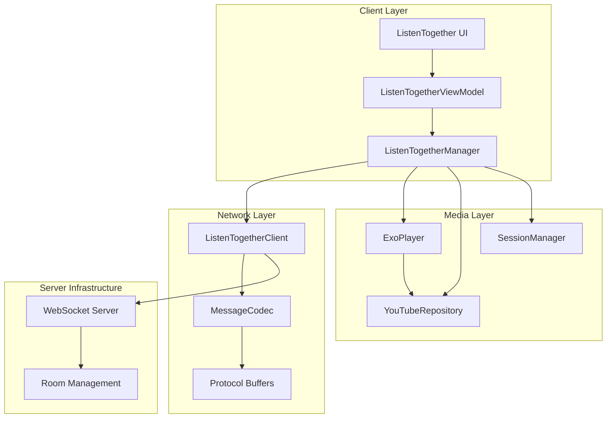
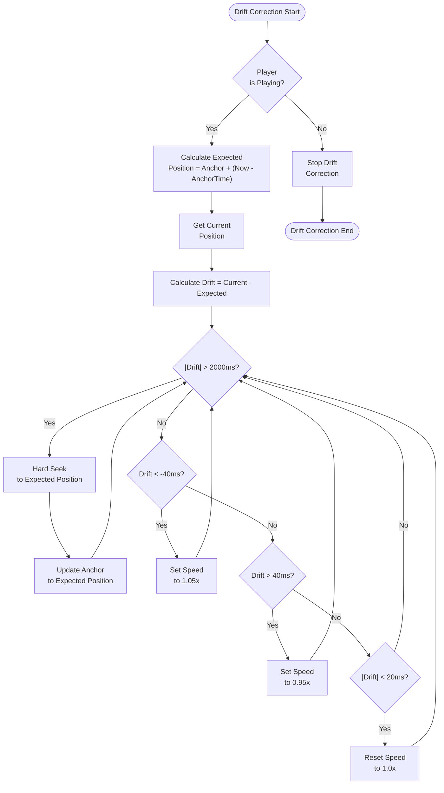
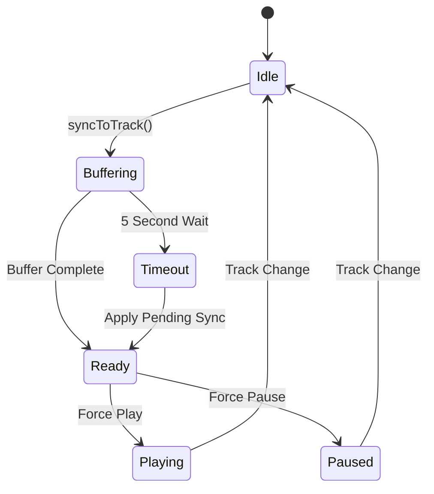
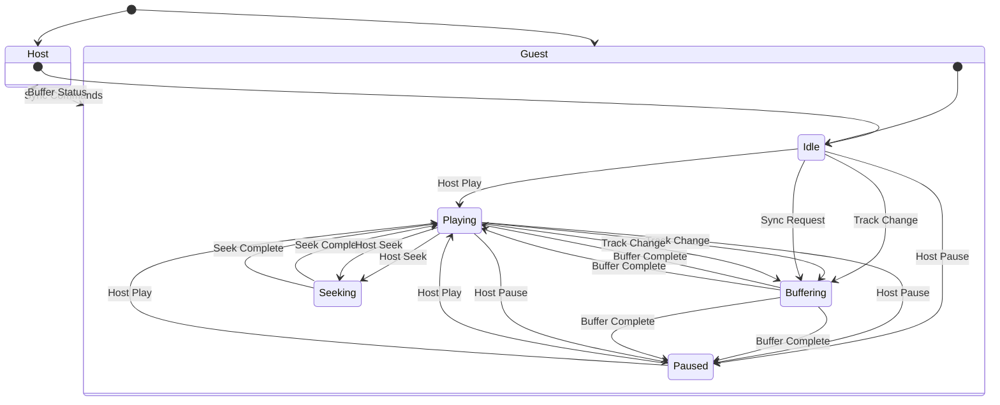
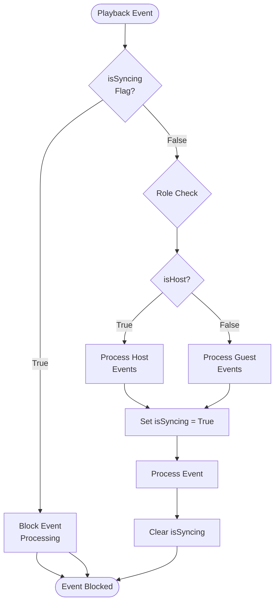
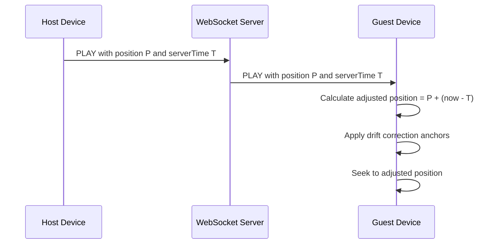

# Playback Synchronization Engine

<cite>
**Referenced Files in This Document**
- [ListenTogetherManager.kt](file://app/src/main/java/com/suvojeet/suvmusic/shareplay/ListenTogetherManager.kt)
- [ListenTogetherClient.kt](file://app/src/main/java/com/suvojeet/suvmusic/shareplay/ListenTogetherClient.kt)
- [Protocol.kt](file://app/src/main/java/com/suvojeet/suvmusic/shareplay/Protocol.kt)
- [MessageCodec.kt](file://app/src/main/java/com/suvojeet/suvmusic/shareplay/MessageCodec.kt)
- [ListenTogetherServers.kt](file://app/src/main/java/com/suvojeet/suvmusic/shareplay/ListenTogetherServers.kt)
- [ListenTogetherEvent.kt](file://app/src/main/java/com/suvojeet/suvmusic/shareplay/ListenTogetherEvent.kt)
- [shareplay.proto](file://app/src/main/proto/shareplay.proto)
- [MusicPlayerService.kt](file://app/src/main/java/com/suvojeet/suvmusic/service/MusicPlayerService.kt)
- [ListenTogetherViewModel.kt](file://app/src/main/java/com/suvojeet/suvmusic/ui/viewmodel/ListenTogetherViewModel.kt)
</cite>

## Table of Contents
1. [Introduction](#introduction)
2. [System Architecture](#system-architecture)
3. [Core Components](#core-components)
4. [Drift Correction Algorithm](#drift-correction-algorithm)
5. [Buffer Management System](#buffer-management-system)
6. [Synchronization State Machine](#synchronization-state-machine)
7. [Anti-Feedback Loop Mechanisms](#anti-feedback-loop-mechanisms)
8. [Performance Optimizations](#performance-optimizations)
9. [Edge Case Handling](#edge-case-handling)
10. [Integration Points](#integration-points)
11. [Conclusion](#conclusion)

## Introduction

The Playback Synchronization Engine is a sophisticated multi-device music coordination system that enables seamless synchronized playback across multiple devices. Built around a WebSocket-based communication protocol, it coordinates playback actions, manages buffer states, and maintains precise timing synchronization between hosts and guests in a shared listening session.

The system addresses the fundamental challenge of maintaining perfect synchronization across network delays, device processing variations, and varying connection qualities while preventing feedback loops and ensuring robust operation under various failure scenarios.

## System Architecture

The synchronization engine follows a distributed architecture with clear separation of concerns:

**Diagram sources**
- [ListenTogetherManager.kt:1-828](file://app/src/main/java/com/suvojeet/suvmusic/shareplay/ListenTogetherManager.kt#L1-L828)
- [ListenTogetherClient.kt:1-1205](file://app/src/main/java/com/suvojeet/suvmusic/shareplay/ListenTogetherClient.kt#L1-L1205)

The architecture consists of four primary layers:

- **Client Layer**: UI presentation and state management
- **Network Layer**: WebSocket communication and message serialization
- **Media Layer**: Audio playback and track resolution
- **Server Infrastructure**: Centralized room management and message routing

## Core Components

### ListenTogetherManager

The central orchestrator that bridges the WebSocket client with the ExoPlayer instance. It maintains synchronization state, manages drift correction, and coordinates buffer management.

Key responsibilities include:
- Player lifecycle management and listener registration
- Drift correction algorithm implementation
- Buffer state tracking and timeout handling
- Anti-feedback loop protection mechanisms
- Queue synchronization and track loading coordination

### ListenTogetherClient

Manages WebSocket connections, message encoding/decoding, and room state synchronization. Provides robust reconnection logic and connection state management.

### Protocol Definitions

Defines the complete message schema using Protocol Buffers for efficient binary serialization and cross-platform compatibility.

### MessageCodec

Handles Protocol Buffers encoding/decoding with optional GZIP compression for bandwidth optimization.

**Section sources**
- [ListenTogetherManager.kt:27-32](file://app/src/main/java/com/suvojeet/suvmusic/shareplay/ListenTogetherManager.kt#L27-L32)
- [ListenTogetherClient.kt:112-114](file://app/src/main/java/com/suvojeet/suvmusic/shareplay/ListenTogetherClient.kt#L112-L114)
- [Protocol.kt:6-49](file://app/src/main/java/com/suvojeet/suvmusic/shareplay/Protocol.kt#L6-L49)

## Drift Correction Algorithm

The drift correction system maintains precise synchronization between hosts and guests using anchor timestamps and continuous position tracking.

### Algorithm Implementation

**Diagram sources**
- [ListenTogetherManager.kt:336-380](file://app/src/main/java/com/suvojeet/suvmusic/shareplay/ListenTogetherManager.kt#L336-L380)

### Anchor Timestamp System

The system uses anchor timestamps to establish synchronization checkpoints:

- **Anchor Time**: Reference timestamp when drift correction begins or updates
- **Anchor Position**: Corresponding player position at the anchor time
- **Expected Position Calculation**: Real-time expected position based on anchor data

### Threshold-Based Corrections

The algorithm implements tiered corrections based on drift magnitude:

- **Major Drift (> ±2000ms)**: Immediate hard seek to correct position
- **Moderate Drift (> ±40ms)**: Speed adjustment (±5%) for gradual correction
- **Minor Drift (< ±20ms)**: Normal playback speed with minimal adjustments

**Section sources**
- [ListenTogetherManager.kt:336-380](file://app/src/main/java/com/suvojeet/suvmusic/shareplay/ListenTogetherManager.kt#L336-L380)
- [ListenTogetherManager.kt:450-470](file://app/src/main/java/com/suvojeet/suvmusic/shareplay/ListenTogetherManager.kt#L450-L470)

## Buffer Management System

The buffer management system coordinates track loading states between hosts and guests to prevent playback conflicts and ensure smooth transitions.

### Buffer State Tracking

**Diagram sources**
- [ListenTogetherManager.kt:588-690](file://app/src/main/java/com/suvojeet/suvmusic/shareplay/ListenTogetherManager.kt#L588-L690)

### Buffer Coordination Protocol

The system implements a two-phase buffer coordination:

1. **Preparation Phase**: Host prepares track and signals readiness
2. **Activation Phase**: Guest receives buffer completion signal and applies pending sync

### Timeout Handling

The buffer system includes intelligent timeout mechanisms:

- **5-second buffer timeout**: Forces playback if guests fail to buffer
- **Pending sync queuing**: Stores sync commands until buffering completes
- **Graceful degradation**: Allows forced playback when timeouts occur

**Section sources**
- [ListenTogetherManager.kt:672-680](file://app/src/main/java/com/suvojeet/suvmusic/shareplay/ListenTogetherManager.kt#L672-L680)
- [ListenTogetherManager.kt:382-416](file://app/src/main/java/com/suvojeet/suvmusic/shareplay/ListenTogetherManager.kt#L382-L416)

## Synchronization State Machine

The synchronization state machine governs all playback operations across track changes, play/pause commands, seek operations, and queue modifications.

### State Transitions

**Diagram sources**
- [ListenTogetherManager.kt:418-556](file://app/src/main/java/com/suvojeet/suvmusic/shareplay/ListenTogetherManager.kt#L418-L556)

### Playback Operations

The state machine handles various playback operations:

- **Play/Pause Commands**: Synchronized across all participants
- **Seek Operations**: Timestamp-based positioning with drift correction
- **Track Changes**: Queue-aware track switching with metadata resolution
- **Queue Modifications**: Add/remove/clear operations with state propagation

### Queue Synchronization

The system maintains synchronized queues between hosts and guests:

- **Queue Creation**: Host sends complete queue to guests
- **Queue Updates**: Incremental queue modifications with insert/next support
- **Queue Validation**: Ensures queue integrity across all participants

**Section sources**
- [ListenTogetherManager.kt:490-542](file://app/src/main/java/com/suvojeet/suvmusic/shareplay/ListenTogetherManager.kt#L490-L542)
- [ListenTogetherClient.kt:869-897](file://app/src/main/java/com/suvojeet/suvmusic/shareplay/ListenTogetherClient.kt#L869-L897)

## Anti-Feedback Loop Mechanisms

The system implements multiple layers of protection against feedback loops that could cause infinite synchronization cycles.

### Primary Protection Mechanisms

**Diagram sources**
- [ListenTogetherManager.kt:98-165](file://app/src/main/java/com/suvojeet/suvmusic/shareplay/ListenTogetherManager.kt#L98-L165)

### Key Anti-Loop Protections

1. **isSyncing Flag**: Atomic flag preventing recursive event processing
2. **Role-Based Filtering**: Host-only event processing for outbound commands
3. **Event Deduplication**: Last synced state tracking to prevent duplicate processing
4. **Buffer State Management**: Prevents simultaneous buffer operations

### Event Processing Flow

The system ensures proper event ordering and prevents feedback loops:

- **Host Events**: Generated locally, processed immediately, then marked as synchronized
- **Guest Events**: Received from server, validated against current state, then applied
- **State Consistency**: Maintains last synced state to prevent redundant processing

**Section sources**
- [ListenTogetherManager.kt:43-51](file://app/src/main/java/com/suvojeet/suvmusic/shareplay/ListenTogetherManager.kt#L43-L51)
- [ListenTogetherManager.kt:447-556](file://app/src/main/java/com/suvojeet/suvmusic/shareplay/ListenTogetherManager.kt#L447-L556)

## Performance Optimizations

The synchronization engine implements several performance optimizations to ensure smooth operation under various conditions.

### Drift Correction Optimizations

- **500ms Check Interval**: Balanced precision vs. CPU usage for drift monitoring
- **Threshold-Based Adjustments**: Minimizes unnecessary speed changes
- **Anchor-Based Calculations**: Efficient expected position computation

### Network Optimization

- **Protocol Buffers**: Compact binary serialization reducing bandwidth usage
- **GZIP Compression**: Automatic compression for larger payloads (>100 bytes)
- **Connection Pooling**: Reuse of WebSocket connections for reduced overhead

### Memory Management

- **Job Cancellation**: Proper cleanup of background tasks
- **State Flow Management**: Efficient reactive state updates
- **Resource Cleanup**: Automatic resource deallocation on disconnection

### Latency Compensation

The system implements server-time-based position adjustment:

**Diagram sources**
- [ListenTogetherManager.kt:452-457](file://app/src/main/java/com/suvojeet/suvmusic/shareplay/ListenTogetherManager.kt#L452-L457)

**Section sources**
- [MessageCodec.kt:29-69](file://app/src/main/java/com/suvojeet/suvmusic/shareplay/MessageCodec.kt#L29-L69)
- [ListenTogetherManager.kt:339-372](file://app/src/main/java/com/suvojeet/suvmusic/shareplay/ListenTogetherManager.kt#L339-L372)

## Edge Case Handling

The system comprehensively handles various failure scenarios and edge cases to ensure robust operation.

### Track Resolution Failures

- **Fallback Mechanisms**: Graceful degradation when track resolution fails
- **Error Logging**: Comprehensive error reporting for debugging
- **State Recovery**: Automatic recovery from resolution failures

### Connection Interruptions

- **Automatic Reconnection**: Exponential backoff with jitter for optimal retry
- **Session Persistence**: Room session persistence with grace period
- **State Restoration**: Automatic state restoration upon reconnection

### Synchronization Conflicts

- **Race Condition Prevention**: Atomic state updates to prevent conflicts
- **Conflict Resolution**: Clear precedence rules for conflicting operations
- **State Validation**: Input validation to prevent invalid state transitions

### Privacy Mode Integration

The system respects user privacy settings:

- **Automatic Room Leaving**: Leaves rooms when privacy mode is enabled
- **Session Cleanup**: Proper cleanup of session data
- **User Consent**: Respects user privacy preferences

**Section sources**
- [ListenTogetherManager.kt:612-619](file://app/src/main/java/com/suvojeet/suvmusic/shareplay/ListenTogetherManager.kt#L612-L619)
- [ListenTogetherManager.kt:218-226](file://app/src/main/java/com/suvojeet/suvmusic/shareplay/ListenTogetherManager.kt#L218-L226)
- [ListenTogetherClient.kt:652-702](file://app/src/main/java/com/suvojeet/suvmusic/shareplay/ListenTogetherClient.kt#L652-L702)

## Integration Points

The synchronization engine integrates seamlessly with the broader application architecture.

### Media Player Integration

The system integrates with ExoPlayer for native audio playback:

- **Player Listener Registration**: Automatic detection of playback state changes
- **Media Item Management**: Seamless track loading and queue management
- **Playback Parameter Control**: Dynamic speed adjustment for drift correction

### Repository Integration

Deep integration with the YouTube repository for track resolution:

- **Stream URL Resolution**: Automatic stream URL fetching and validation
- **Metadata Enhancement**: Rich metadata resolution for better user experience
- **Fallback Strategies**: Multiple resolution strategies for reliability

### UI Integration

Comprehensive UI integration through ViewModels:

- **State Flow Exposure**: Reactive state updates for UI binding
- **User Action Handling**: Direct mapping of UI actions to synchronization commands
- **Error Display**: User-friendly error reporting and recovery options

**Section sources**
- [MusicPlayerService.kt:76](file://app/src/main/java/com/suvojeet/suvmusic/service/MusicPlayerService.kt#L76)
- [ListenTogetherViewModel.kt:19-21](file://app/src/main/java/com/suvojeet/suvmusic/ui/viewmodel/ListenTogetherViewModel.kt#L19-L21)

## Conclusion

The Playback Synchronization Engine represents a sophisticated solution to the challenges of multi-device music synchronization. Through careful implementation of drift correction algorithms, robust buffer management, comprehensive state machines, and extensive anti-feedback loop protections, it delivers a seamless user experience across diverse network conditions and device capabilities.

The system's modular architecture, performance optimizations, and comprehensive error handling make it suitable for production deployment while maintaining excellent user experience. The integration with the broader application ecosystem ensures consistent behavior and reliable operation across all supported platforms.

Key strengths of the implementation include:
- Precise drift correction with minimal computational overhead
- Robust buffer management preventing playback conflicts
- Comprehensive anti-feedback loop protection mechanisms
- Intelligent timeout handling for graceful degradation
- Extensive edge case handling for real-world reliability

The engine provides a solid foundation for future enhancements while maintaining backward compatibility and performance standards essential for a production music application.