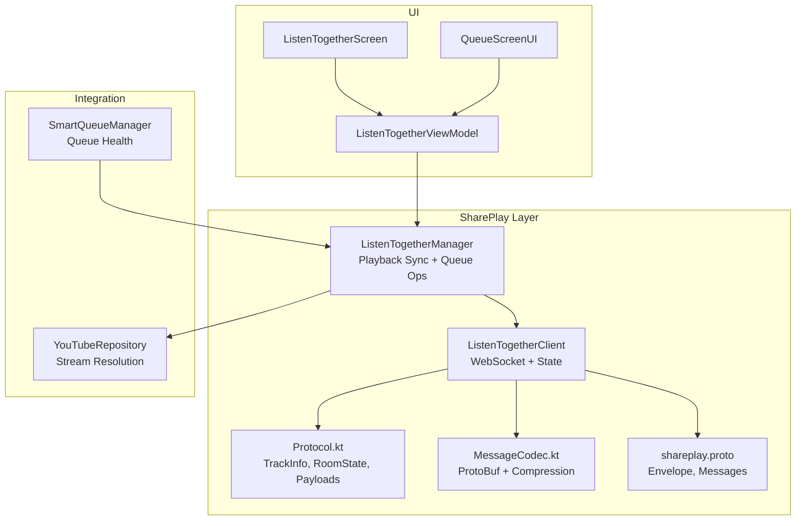
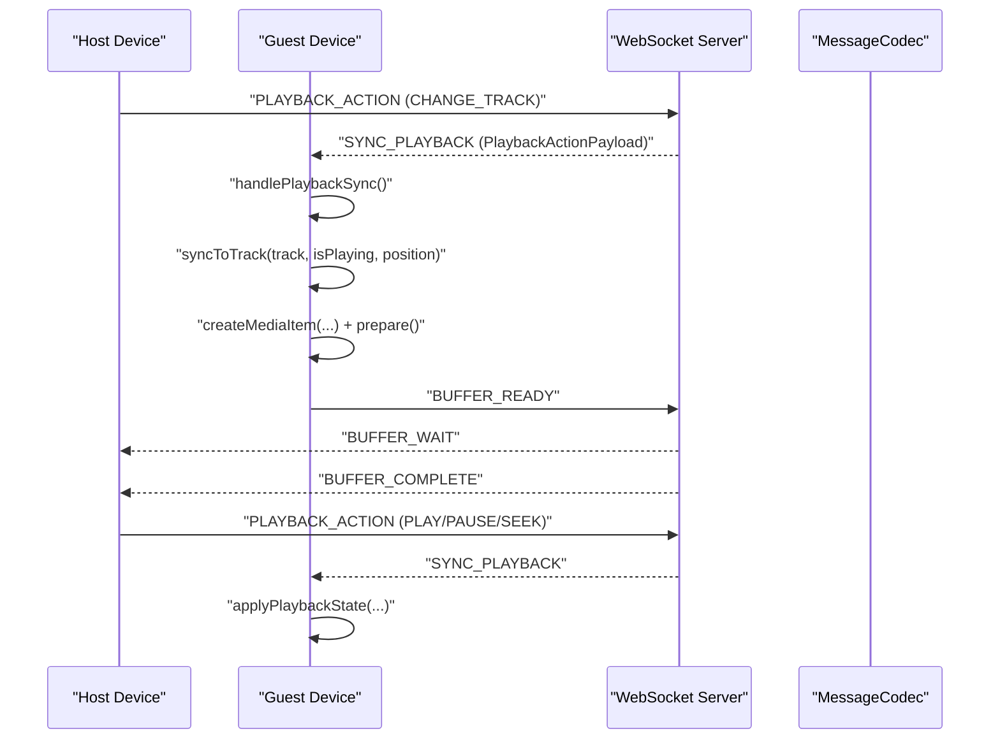
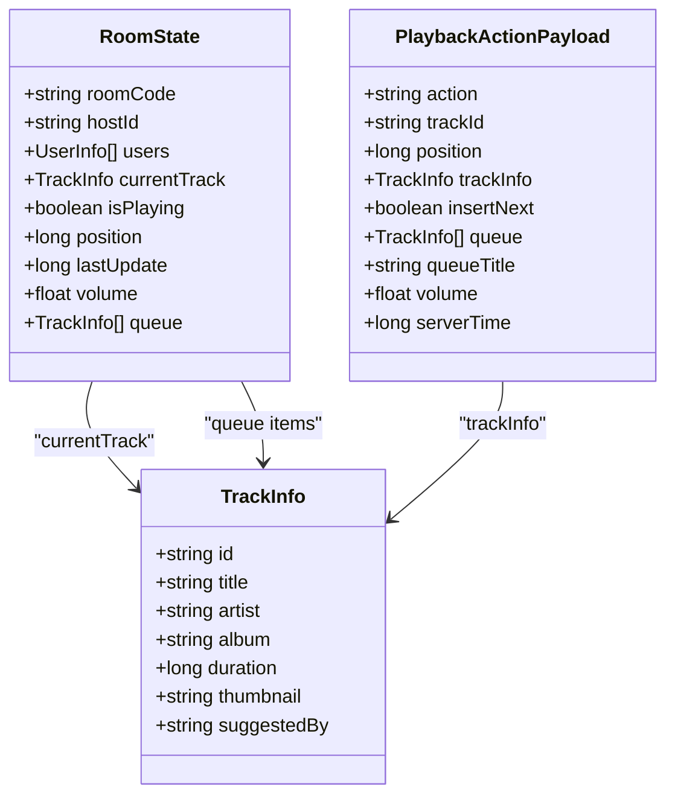
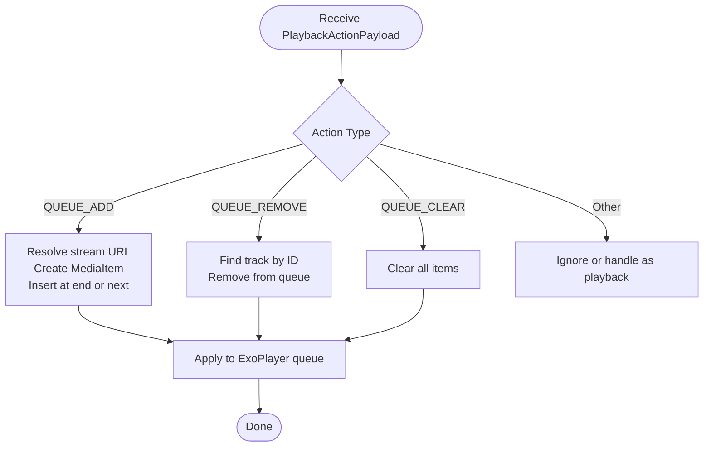
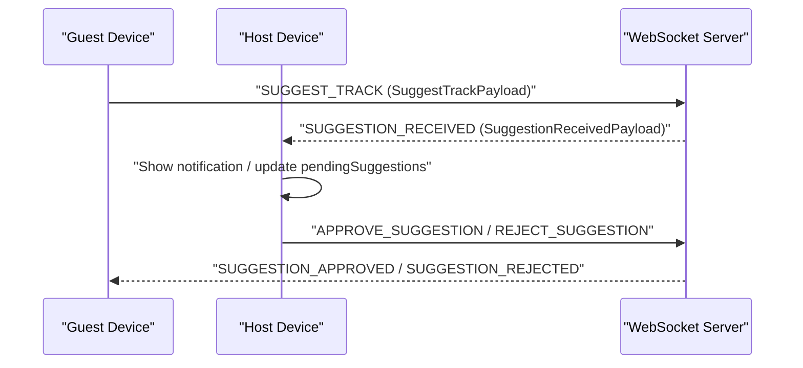
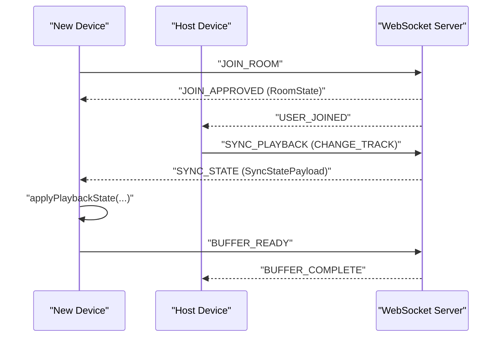
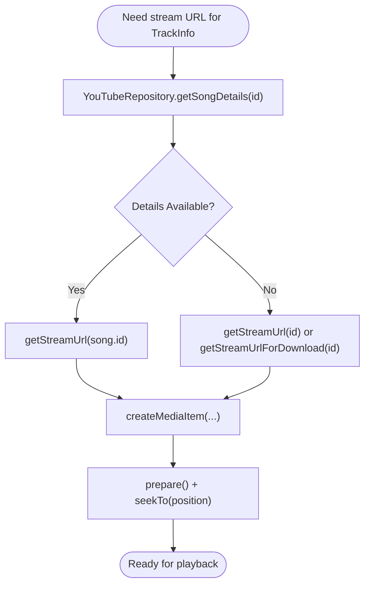
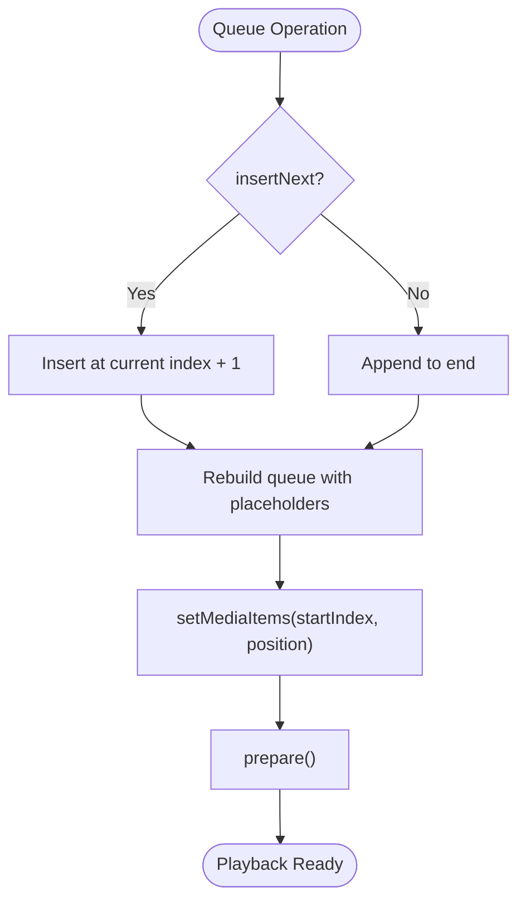
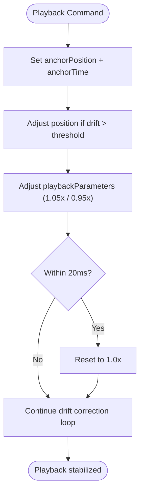
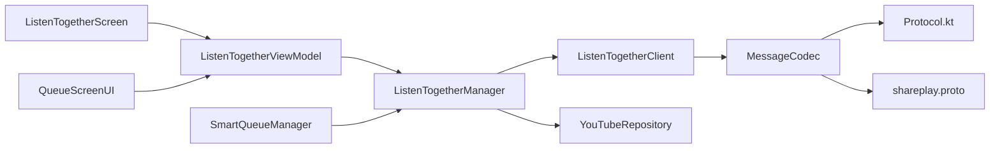

# Queue Coordination and Track Management

<cite>
**Referenced Files in This Document**
- [ListenTogetherManager.kt](file://app/src/main/java/com/suvojeet/suvmusic/shareplay/ListenTogetherManager.kt)
- [ListenTogetherClient.kt](file://app/src/main/java/com/suvojeet/suvmusic/shareplay/ListenTogetherClient.kt)
- [Protocol.kt](file://app/src/main/java/com/suvojeet/suvmusic/shareplay/Protocol.kt)
- [MessageCodec.kt](file://app/src/main/java/com/suvojeet/suvmusic/shareplay/MessageCodec.kt)
- [shareplay.proto](file://app/src/main/proto/shareplay.proto)
- [ListenTogetherViewModel.kt](file://app/src/main/java/com/suvojeet/suvmusic/ui/viewmodel/ListenTogetherViewModel.kt)
- [ListenTogetherScreen.kt](file://app/src/main/java/com/suvojeet/suvmusic/ui/screens/ListenTogetherScreen.kt)
- [QueueScreenUI.kt](file://app/src/main/java/com/suvojeet/suvmusic/ui/screens/player/components/QueueScreenUI.kt)
- [YouTubeRepository.kt](file://app/src/main/java/com/suvojeet/suvmusic/data/repository/YouTubeRepository.kt)
- [SmartQueueManager.kt](file://app/src/main/java/com/suvojeet/suvmusic/recommendation/SmartQueueManager.kt)
</cite>

## Table of Contents
1. [Introduction](#introduction)
2. [Project Structure](#project-structure)
3. [Core Components](#core-components)
4. [Architecture Overview](#architecture-overview)
5. [Detailed Component Analysis](#detailed-component-analysis)
6. [Dependency Analysis](#dependency-analysis)
7. [Performance Considerations](#performance-considerations)
8. [Troubleshooting Guide](#troubleshooting-guide)
9. [Conclusion](#conclusion)

## Introduction
This document explains the queue coordination system that synchronizes playlist state across all participants in a Listen Together session. It covers the TrackInfo data structure, how track metadata is shared between devices, queue operation synchronization (add, remove, clear, reorder), the guest track suggestion system, state reconciliation when devices join or leave, YouTube stream resolution integration, and queue persistence considerations.

## Project Structure
The queue coordination system spans several modules:
- SharePlay protocol and transport: WebSocket client, message codec, and protocol definitions
- Playback synchronization: host/guest roles, drift correction, buffering, and state reconciliation
- Queue management: queue operations, ordering, and persistence
- UI integration: Listen Together screen and queue UI components
- YouTube integration: stream resolution and metadata enrichment

**Diagram sources**
- [ListenTogetherClient.kt:112-1205](file://app/src/main/java/com/suvojeet/suvmusic/shareplay/ListenTogetherClient.kt#L112-L1205)
- [ListenTogetherManager.kt:28-828](file://app/src/main/java/com/suvojeet/suvmusic/shareplay/ListenTogetherManager.kt#L28-L828)
- [Protocol.kt:71-107](file://app/src/main/java/com/suvojeet/suvmusic/shareplay/Protocol.kt#L71-L107)
- [MessageCodec.kt:19-355](file://app/src/main/java/com/suvojeet/suvmusic/shareplay/MessageCodec.kt#L19-L355)
- [shareplay.proto:10-47](file://app/src/main/proto/shareplay.proto#L10-L47)
- [YouTubeRepository.kt:264-282](file://app/src/main/java/com/suvojeet/suvmusic/data/repository/YouTubeRepository.kt#L264-L282)
- [SmartQueueManager.kt:22-142](file://app/src/main/java/com/suvojeet/suvmusic/recommendation/SmartQueueManager.kt#L22-L142)
- [ListenTogetherViewModel.kt:19-193](file://app/src/main/java/com/suvojeet/suvmusic/ui/viewmodel/ListenTogetherViewModel.kt#L19-L193)
- [ListenTogetherScreen.kt:51-168](file://app/src/main/java/com/suvojeet/suvmusic/ui/screens/ListenTogetherScreen.kt#L51-L168)
- [QueueScreenUI.kt:56-523](file://app/src/main/java/com/suvojeet/suvmusic/ui/screens/player/components/QueueScreenUI.kt#L56-L523)

**Section sources**
- [ListenTogetherClient.kt:112-1205](file://app/src/main/java/com/suvojeet/suvmusic/shareplay/ListenTogetherClient.kt#L112-L1205)
- [ListenTogetherManager.kt:28-828](file://app/src/main/java/com/suvojeet/suvmusic/shareplay/ListenTogetherManager.kt#L28-L828)
- [Protocol.kt:71-107](file://app/src/main/java/com/suvojeet/suvmusic/shareplay/Protocol.kt#L71-L107)
- [MessageCodec.kt:19-355](file://app/src/main/java/com/suvojeet/suvmusic/shareplay/MessageCodec.kt#L19-L355)
- [shareplay.proto:10-47](file://app/src/main/proto/shareplay.proto#L10-L47)
- [YouTubeRepository.kt:264-282](file://app/src/main/java/com/suvojeet/suvmusic/data/repository/YouTubeRepository.kt#L264-L282)
- [SmartQueueManager.kt:22-142](file://app/src/main/java/com/suvojeet/suvmusic/recommendation/SmartQueueManager.kt#L22-L142)
- [ListenTogetherViewModel.kt:19-193](file://app/src/main/java/com/suvojeet/suvmusic/ui/viewmodel/ListenTogetherViewModel.kt#L19-L193)
- [ListenTogetherScreen.kt:51-168](file://app/src/main/java/com/suvojeet/suvmusic/ui/screens/ListenTogetherScreen.kt#L51-L168)
- [QueueScreenUI.kt:56-523](file://app/src/main/java/com/suvojeet/suvmusic/ui/screens/player/components/QueueScreenUI.kt#L56-L523)

## Core Components
- TrackInfo: Lightweight track metadata shared across devices for queue operations and playback synchronization
- RoomState: Complete session state including current track, play status, position, queue, and volume
- PlaybackActionPayload: Encodes queue operations (add/remove/clear/reorder) and playback commands
- ListenTogetherClient: WebSocket transport, event emission, and room state management
- ListenTogetherManager: Bridges client events to ExoPlayer, handles buffering, drift correction, and queue operations
- MessageCodec: Protocol Buffers encoder/decoder with optional compression
- YouTubeRepository: Resolves stream URLs and enriches track metadata for playback

**Section sources**
- [Protocol.kt:71-107](file://app/src/main/java/com/suvojeet/suvmusic/shareplay/Protocol.kt#L71-L107)
- [Protocol.kt:96-107](file://app/src/main/java/com/suvojeet/suvmusic/shareplay/Protocol.kt#L96-L107)
- [Protocol.kt:134-144](file://app/src/main/java/com/suvojeet/suvmusic/shareplay/Protocol.kt#L134-L144)
- [ListenTogetherClient.kt:800-900](file://app/src/main/java/com/suvojeet/suvmusic/shareplay/ListenTogetherClient.kt#L800-L900)
- [ListenTogetherManager.kt:509-556](file://app/src/main/java/com/suvojeet/suvmusic/shareplay/ListenTogetherManager.kt#L509-L556)
- [MessageCodec.kt:19-355](file://app/src/main/java/com/suvojeet/suvmusic/shareplay/MessageCodec.kt#L19-L355)
- [YouTubeRepository.kt:264-282](file://app/src/main/java/com/suvojeet/suvmusic/data/repository/YouTubeRepository.kt#L264-L282)

## Architecture Overview
The system uses a WebSocket-based protocol with Protocol Buffers for efficient serialization. Host devices broadcast playback and queue changes; guests reconcile state and synchronize playback with drift correction and buffering.

**Diagram sources**
- [ListenTogetherClient.kt:838-900](file://app/src/main/java/com/suvojeet/suvmusic/shareplay/ListenTogetherClient.kt#L838-L900)
- [ListenTogetherManager.kt:418-556](file://app/src/main/java/com/suvojeet/suvmusic/shareplay/ListenTogetherManager.kt#L418-L556)
- [MessageCodec.kt:115-175](file://app/src/main/java/com/suvojeet/suvmusic/shareplay/MessageCodec.kt#L115-L175)

**Section sources**
- [ListenTogetherClient.kt:838-900](file://app/src/main/java/com/suvojeet/suvmusic/shareplay/ListenTogetherClient.kt#L838-L900)
- [ListenTogetherManager.kt:418-556](file://app/src/main/java/com/suvojeet/suvmusic/shareplay/ListenTogetherManager.kt#L418-L556)
- [MessageCodec.kt:115-175](file://app/src/main/java/com/suvojeet/suvmusic/shareplay/MessageCodec.kt#L115-L175)

## Detailed Component Analysis

### TrackInfo Data Structure and Metadata Sharing
TrackInfo carries essential metadata for queue operations and playback synchronization. It includes identifiers, titles, artists, optional album and thumbnail, duration, and optional suggestion attribution.

**Diagram sources**
- [Protocol.kt:71-80](file://app/src/main/java/com/suvojeet/suvmusic/shareplay/Protocol.kt#L71-L80)
- [Protocol.kt:96-107](file://app/src/main/java/com/suvojeet/suvmusic/shareplay/Protocol.kt#L96-L107)
- [Protocol.kt:134-144](file://app/src/main/java/com/suvojeet/suvmusic/shareplay/Protocol.kt#L134-L144)

**Section sources**
- [Protocol.kt:71-80](file://app/src/main/java/com/suvojeet/suvmusic/shareplay/Protocol.kt#L71-L80)
- [Protocol.kt:96-107](file://app/src/main/java/com/suvojeet/suvmusic/shareplay/Protocol.kt#L96-L107)
- [Protocol.kt:134-144](file://app/src/main/java/com/suvojeet/suvmusic/shareplay/Protocol.kt#L134-L144)

### Queue Operation Synchronization
Hosts broadcast queue operations via PlaybackActionPayload with actions such as QUEUE_ADD, QUEUE_REMOVE, and QUEUE_CLEAR. Guests apply these operations to their local ExoPlayer queues, optionally inserting next or replacing the entire queue.

**Diagram sources**
- [ListenTogetherManager.kt:509-542](file://app/src/main/java/com/suvojeet/suvmusic/shareplay/ListenTogetherManager.kt#L509-L542)
- [ListenTogetherClient.kt:869-889](file://app/src/main/java/com/suvojeet/suvmusic/shareplay/ListenTogetherClient.kt#L869-L889)

**Section sources**
- [ListenTogetherManager.kt:509-542](file://app/src/main/java/com/suvojeet/suvmusic/shareplay/ListenTogetherManager.kt#L509-L542)
- [ListenTogetherClient.kt:869-889](file://app/src/main/java/com/suvojeet/suvmusic/shareplay/ListenTogetherClient.kt#L869-L889)

### Track Suggestion System
Guests propose tracks that hosts can approve or reject. The system uses SuggestTrackPayload and SuggestionReceivedPayload to manage proposals and notifications.

**Diagram sources**
- [ListenTogetherClient.kt:1137-1161](file://app/src/main/java/com/suvojeet/suvmusic/shareplay/ListenTogetherClient.kt#L1137-L1161)
- [ListenTogetherClient.kt:922-947](file://app/src/main/java/com/suvojeet/suvmusic/shareplay/ListenTogetherClient.kt#L922-L947)
- [Protocol.kt:169-191](file://app/src/main/java/com/suvojeet/suvmusic/shareplay/Protocol.kt#L169-L191)

**Section sources**
- [ListenTogetherClient.kt:1137-1161](file://app/src/main/java/com/suvojeet/suvmusic/shareplay/ListenTogetherClient.kt#L1137-L1161)
- [ListenTogetherClient.kt:922-947](file://app/src/main/java/com/suvojeet/suvmusic/shareplay/ListenTogetherClient.kt#L922-L947)
- [Protocol.kt:169-191](file://app/src/main/java/com/suvojeet/suvmusic/shareplay/Protocol.kt#L169-L191)

### Queue State Reconciliation on Join/Leave
When a device joins or leaves, the server maintains RoomState and broadcasts updates. On join approval, guests receive SyncStatePayload to reconcile current state. Buffering ensures synchronized playback readiness.

**Diagram sources**
- [ListenTogetherClient.kt:764-778](file://app/src/main/java/com/suvojeet/suvmusic/shareplay/ListenTogetherClient.kt#L764-L778)
- [ListenTogetherClient.kt:916-920](file://app/src/main/java/com/suvojeet/suvmusic/shareplay/ListenTogetherClient.kt#L916-L920)
- [ListenTogetherManager.kt:558-586](file://app/src/main/java/com/suvojeet/suvmusic/shareplay/ListenTogetherManager.kt#L558-L586)

**Section sources**
- [ListenTogetherClient.kt:764-778](file://app/src/main/java/com/suvojeet/suvmusic/shareplay/ListenTogetherClient.kt#L764-L778)
- [ListenTogetherClient.kt:916-920](file://app/src/main/java/com/suvojeet/suvmusic/shareplay/ListenTogetherClient.kt#L916-L920)
- [ListenTogetherManager.kt:558-586](file://app/src/main/java/com/suvojeet/suvmusic/shareplay/ListenTogetherManager.kt#L558-L586)

### YouTube Stream Resolution Integration
The system resolves stream URLs and enriches track metadata for playback. It prefers detailed song metadata when available, falling back to direct resolution if needed.

**Diagram sources**
- [ListenTogetherManager.kt:598-690](file://app/src/main/java/com/suvojeet/suvmusic/shareplay/ListenTogetherManager.kt#L598-L690)
- [YouTubeRepository.kt:282-282](file://app/src/main/java/com/suvojeet/suvmusic/data/repository/YouTubeRepository.kt#L282-L282)
- [YouTubeRepository.kt:264-273](file://app/src/main/java/com/suvojeet/suvmusic/data/repository/YouTubeRepository.kt#L264-L273)

**Section sources**
- [ListenTogetherManager.kt:598-690](file://app/src/main/java/com/suvojeet/suvmusic/shareplay/ListenTogetherManager.kt#L598-L690)
- [YouTubeRepository.kt:264-282](file://app/src/main/java/com/suvojeet/suvmusic/data/repository/YouTubeRepository.kt#L264-L282)

### Queue Persistence, Order Preservation, and Unavailable Tracks
- Persistence: RoomState persists queue and current track; guests can request SyncStatePayload to reconcile missing state
- Order preservation: QUEUE_ADD supports insertNext semantics; guests rebuild queue with placeholders and setMediaItems
- Unavailable tracks: The system gracefully handles missing stream URLs by logging errors and avoiding playback; UI can surface notifications

**Diagram sources**
- [ListenTogetherClient.kt:869-876](file://app/src/main/java/com/suvojeet/suvmusic/shareplay/ListenTogetherClient.kt#L869-L876)
- [ListenTogetherManager.kt:633-653](file://app/src/main/java/com/suvojeet/suvmusic/shareplay/ListenTogetherManager.kt#L633-L653)

**Section sources**
- [ListenTogetherClient.kt:869-876](file://app/src/main/java/com/suvojeet/suvmusic/shareplay/ListenTogetherClient.kt#L869-L876)
- [ListenTogetherManager.kt:633-653](file://app/src/main/java/com/suvojeet/suvmusic/shareplay/ListenTogetherManager.kt#L633-L653)

### Drift Correction and Buffering
To maintain tight synchronization, guests use drift correction with ExoPlayer playback parameters and a buffering handshake to coordinate readiness.

**Diagram sources**
- [ListenTogetherManager.kt:336-380](file://app/src/main/java/com/suvojeet/suvmusic/shareplay/ListenTogetherManager.kt#L336-L380)
- [ListenTogetherManager.kt:447-490](file://app/src/main/java/com/suvojeet/suvmusic/shareplay/ListenTogetherManager.kt#L447-L490)

**Section sources**
- [ListenTogetherManager.kt:336-380](file://app/src/main/java/com/suvojeet/suvmusic/shareplay/ListenTogetherManager.kt#L336-L380)
- [ListenTogetherManager.kt:447-490](file://app/src/main/java/com/suvojeet/suvmusic/shareplay/ListenTogetherManager.kt#L447-L490)

## Dependency Analysis
The system exhibits clear separation of concerns:
- Transport and protocol: MessageCodec depends on shareplay.proto definitions
- Playback bridge: ListenTogetherManager depends on ExoPlayer and YouTubeRepository
- UI integration: ViewModel exposes state flows consumed by Compose screens
- Queue intelligence: SmartQueueManager complements Listen Together by pre-fetching next songs

**Diagram sources**
- [MessageCodec.kt:115-175](file://app/src/main/java/com/suvojeet/suvmusic/shareplay/MessageCodec.kt#L115-L175)
- [Protocol.kt:71-107](file://app/src/main/java/com/suvojeet/suvmusic/shareplay/Protocol.kt#L71-L107)
- [shareplay.proto:10-47](file://app/src/main/proto/shareplay.proto#L10-L47)
- [ListenTogetherClient.kt:112-1205](file://app/src/main/java/com/suvojeet/suvmusic/shareplay/ListenTogetherClient.kt#L112-L1205)
- [ListenTogetherManager.kt:28-828](file://app/src/main/java/com/suvojeet/suvmusic/shareplay/ListenTogetherManager.kt#L28-L828)
- [YouTubeRepository.kt:264-282](file://app/src/main/java/com/suvojeet/suvmusic/data/repository/YouTubeRepository.kt#L264-L282)
- [ListenTogetherViewModel.kt:19-193](file://app/src/main/java/com/suvojeet/suvmusic/ui/viewmodel/ListenTogetherViewModel.kt#L19-L193)
- [ListenTogetherScreen.kt:51-168](file://app/src/main/java/com/suvojeet/suvmusic/ui/screens/ListenTogetherScreen.kt#L51-L168)
- [QueueScreenUI.kt:56-523](file://app/src/main/java/com/suvojeet/suvmusic/ui/screens/player/components/QueueScreenUI.kt#L56-L523)
- [SmartQueueManager.kt:22-142](file://app/src/main/java/com/suvojeet/suvmusic/recommendation/SmartQueueManager.kt#L22-L142)

**Section sources**
- [MessageCodec.kt:115-175](file://app/src/main/java/com/suvojeet/suvmusic/shareplay/MessageCodec.kt#L115-L175)
- [Protocol.kt:71-107](file://app/src/main/java/com/suvojeet/suvmusic/shareplay/Protocol.kt#L71-L107)
- [shareplay.proto:10-47](file://app/src/main/proto/shareplay.proto#L10-L47)
- [ListenTogetherClient.kt:112-1205](file://app/src/main/java/com/suvojeet/suvmusic/shareplay/ListenTogetherClient.kt#L112-L1205)
- [ListenTogetherManager.kt:28-828](file://app/src/main/java/com/suvojeet/suvmusic/shareplay/ListenTogetherManager.kt#L28-L828)
- [YouTubeRepository.kt:264-282](file://app/src/main/java/com/suvojeet/suvmusic/data/repository/YouTubeRepository.kt#L264-L282)
- [ListenTogetherViewModel.kt:19-193](file://app/src/main/java/com/suvojeet/suvmusic/ui/viewmodel/ListenTogetherViewModel.kt#L19-L193)
- [ListenTogetherScreen.kt:51-168](file://app/src/main/java/com/suvojeet/suvmusic/ui/screens/ListenTogetherScreen.kt#L51-L168)
- [QueueScreenUI.kt:56-523](file://app/src/main/java/com/suvojeet/suvmusic/ui/screens/player/components/QueueScreenUI.kt#L56-L523)
- [SmartQueueManager.kt:22-142](file://app/src/main/java/com/suvojeet/suvmusic/recommendation/SmartQueueManager.kt#L22-L142)

## Performance Considerations
- Protocol Buffers with optional compression reduces payload sizes for frequent queue updates
- Drift correction avoids excessive seeks by adjusting playback parameters within small thresholds
- Buffering handshake prevents guests from prematurely starting playback, reducing desync risk
- Queue rebuild uses setMediaItems with startIndex to minimize re-initialization overhead
- Stream resolution prioritizes enriched metadata to improve UI and caching consistency

[No sources needed since this section provides general guidance]

## Troubleshooting Guide
Common issues and remedies:
- Connection interruptions: The client attempts exponential backoff reconnection and preserves sessions within a grace period
- Session expiration: On "session_not_found", the client attempts automatic rejoin for non-host guests
- Privacy mode: Rooms are left automatically when privacy mode is enabled
- Unavailable tracks: Missing stream URLs are logged; UI can surface user notifications
- Drift drift: Playback parameters adjust speed to maintain synchronization; guests can request sync if needed

**Section sources**
- [ListenTogetherClient.kt:652-702](file://app/src/main/java/com/suvojeet/suvmusic/shareplay/ListenTogetherClient.kt#L652-L702)
- [ListenTogetherClient.kt:949-969](file://app/src/main/java/com/suvojeet/suvmusic/shareplay/ListenTogetherClient.kt#L949-L969)
- [ListenTogetherManager.kt:218-227](file://app/src/main/java/com/suvojeet/suvmusic/shareplay/ListenTogetherManager.kt#L218-L227)
- [ListenTogetherManager.kt:612-619](file://app/src/main/java/com/suvojeet/suvmusic/shareplay/ListenTogetherManager.kt#L612-L619)

## Conclusion
The Listen Together queue coordination system provides robust, low-latency synchronization across hosts and guests. TrackInfo metadata ensures consistent identification and presentation, while queue operations, buffering, and drift correction maintain tight playback alignment. The integration with YouTube stream resolution and metadata enrichment guarantees reliable playback and a cohesive user experience. The design balances simplicity and reliability, enabling seamless collaborative listening.