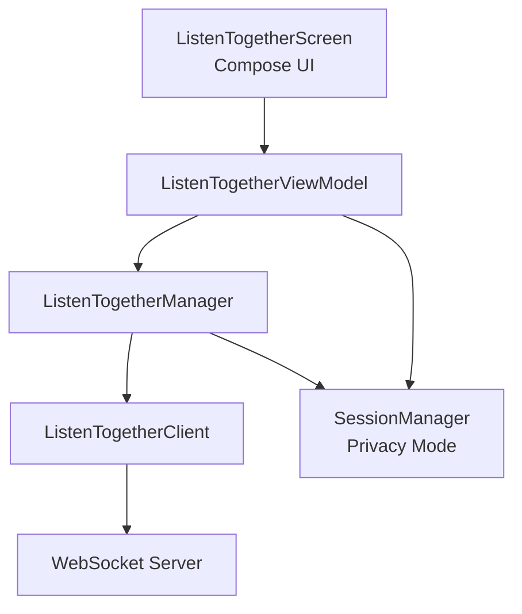
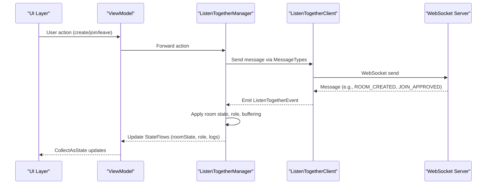
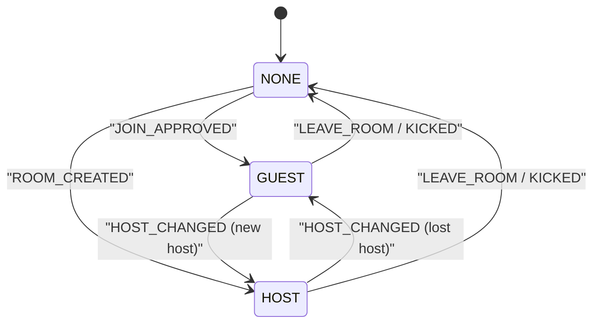
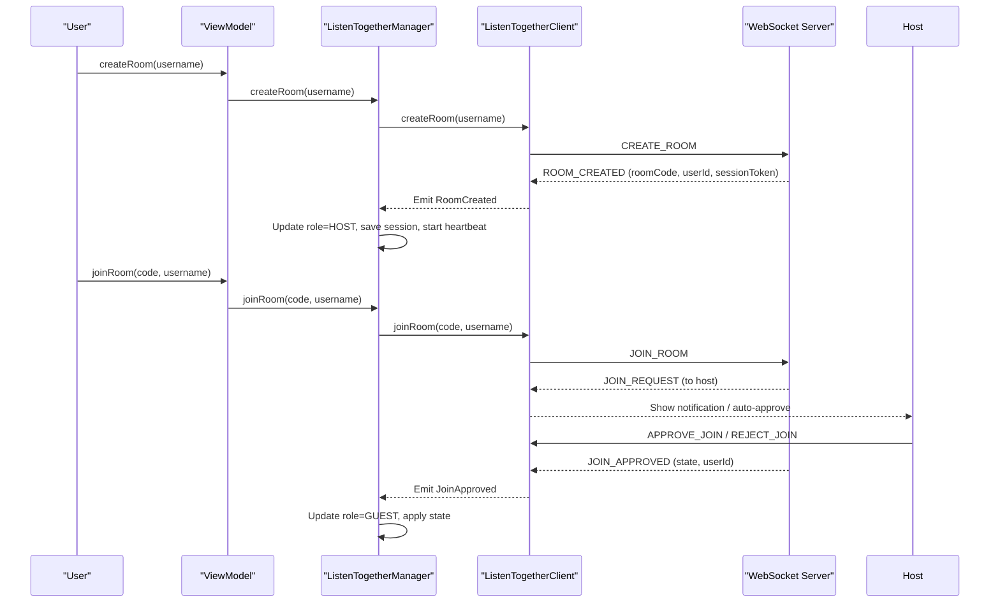
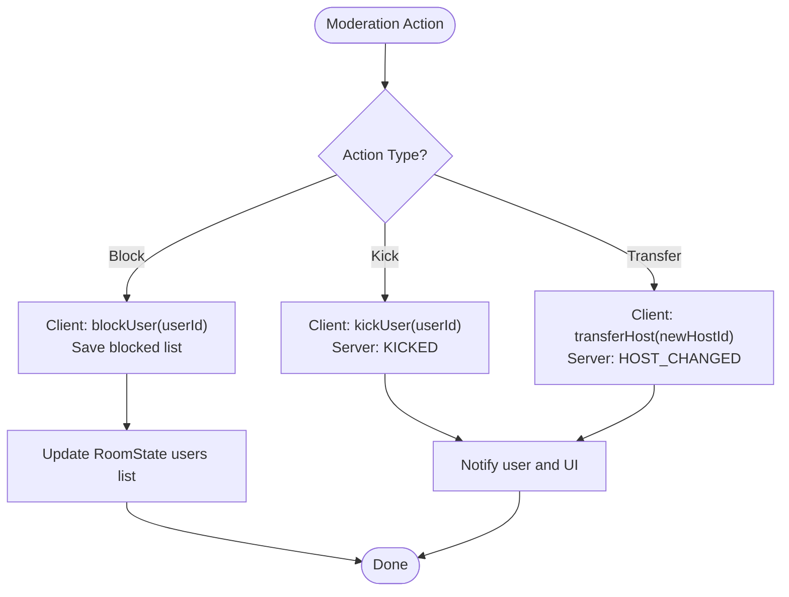
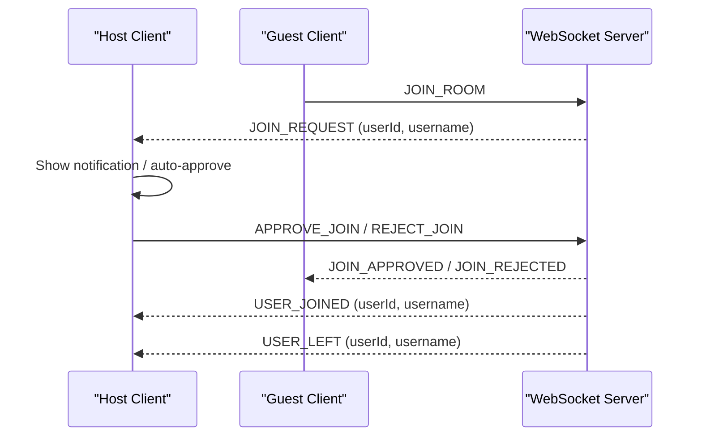
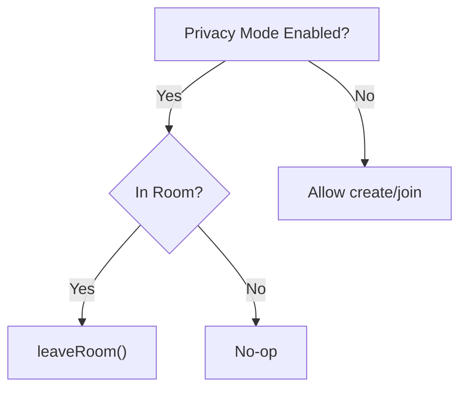
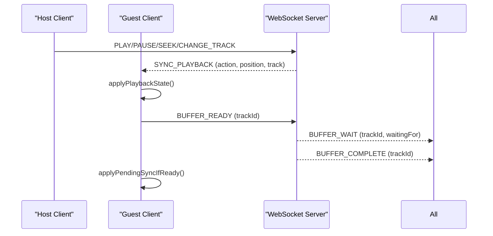
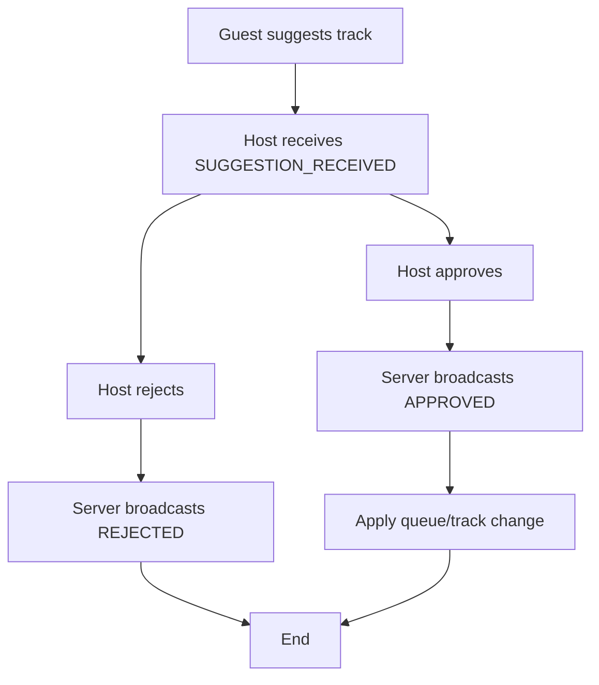
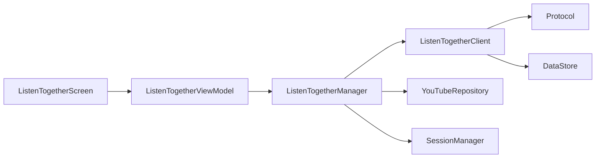

# Room Management and User Roles

<cite>
**Referenced Files in This Document**
- [ListenTogetherManager.kt](file://app/src/main/java/com/suvojeet/suvmusic/shareplay/ListenTogetherManager.kt)
- [ListenTogetherClient.kt](file://app/src/main/java/com/suvojeet/suvmusic/shareplay/ListenTogetherClient.kt)
- [ListenTogetherEvent.kt](file://app/src/main/java/com/suvojeet/suvmusic/shareplay/ListenTogetherEvent.kt)
- [Protocol.kt](file://app/src/main/java/com/suvojeet/suvmusic/shareplay/Protocol.kt)
- [ListenTogetherScreen.kt](file://app/src/main/java/com/suvojeet/suvmusic/ui/screens/ListenTogetherScreen.kt)
- [ListenTogetherViewModel.kt](file://app/src/main/java/com/suvojeet/suvmusic/ui/viewmodel/ListenTogetherViewModel.kt)
- [SessionManager.kt](file://app/src/main/java/com/suvojeet/suvmusic/data/SessionManager.kt)
</cite>

## Table of Contents
1. [Introduction](#introduction)
2. [Project Structure](#project-structure)
3. [Core Components](#core-components)
4. [Architecture Overview](#architecture-overview)
5. [Detailed Component Analysis](#detailed-component-analysis)
6. [Dependency Analysis](#dependency-analysis)
7. [Performance Considerations](#performance-considerations)
8. [Troubleshooting Guide](#troubleshooting-guide)
9. [Conclusion](#conclusion)

## Introduction
This document explains the room management system for Listen Together, focusing on multi-user coordination, role-based permissions, and moderation controls. It covers the RoomRole enum and transitions between Host and Guest participants, user authentication and session persistence, join approval workflows, user moderation (blocking, kicking, host transfers), pending join requests management, user presence tracking, privacy mode integration, room state synchronization, suggestion systems for track recommendations, and conflict resolution strategies for concurrent operations.

## Project Structure
The Listen Together feature is implemented across three primary layers:
- Presentation/UI: Compose screen and ViewModel expose user-facing controls and state.
- Domain/Logic: ListenTogetherManager orchestrates playback synchronization and role transitions.
- Networking/Protocol: ListenTogetherClient manages WebSocket connections, messages, and room state.

**Diagram sources**
- [ListenTogetherScreen.kt:1-168](file://app/src/main/java/com/suvojeet/suvmusic/ui/screens/ListenTogetherScreen.kt#L1-168)
- [ListenTogetherViewModel.kt:1-193](file://app/src/main/java/com/suvojeet/suvmusic/ui/viewmodel/ListenTogetherViewModel.kt#L1-193)
- [ListenTogetherManager.kt:1-828](file://app/src/main/java/com/suvojeet/suvmusic/shareplay/ListenTogetherManager.kt#L1-828)
- [ListenTogetherClient.kt:1-1205](file://app/src/main/java/com/suvojeet/suvmusic/shareplay/ListenTogetherClient.kt#L1-1205)
- [SessionManager.kt:1358-1371](file://app/src/main/java/com/suvojeet/suvmusic/data/SessionManager.kt#L1358-1371)

**Section sources**
- [ListenTogetherScreen.kt:1-168](file://app/src/main/java/com/suvojeet/suvmusic/ui/screens/ListenTogetherScreen.kt#L1-168)
- [ListenTogetherViewModel.kt:1-193](file://app/src/main/java/com/suvojeet/suvmusic/ui/viewmodel/ListenTogetherViewModel.kt#L1-193)
- [ListenTogetherManager.kt:1-828](file://app/src/main/java/com/suvojeet/suvmusic/shareplay/ListenTogetherManager.kt#L1-828)
- [ListenTogetherClient.kt:1-1205](file://app/src/main/java/com/suvojeet/suvmusic/shareplay/ListenTogetherClient.kt#L1-1205)
- [SessionManager.kt:1358-1371](file://app/src/main/java/com/suvojeet/suvmusic/data/SessionManager.kt#L1358-1371)

## Core Components
- RoomRole enum: Defines user roles in a room (HOST, GUEST, NONE).
- ListenTogetherClient: WebSocket client managing connection lifecycle, room state, join requests, buffering, suggestions, and moderation actions.
- ListenTogetherManager: Bridges client and ExoPlayer, handles playback synchronization, drift correction, and privacy mode integration.
- Protocol: Defines message types, payloads, and data structures exchanged with the server.
- UI Layer: ListenTogetherScreen and ListenTogetherViewModel surface controls and state to users.

**Section sources**
- [ListenTogetherClient.kt:77-81](file://app/src/main/java/com/suvojeet/suvmusic/shareplay/ListenTogetherClient.kt#L77-81)
- [ListenTogetherClient.kt:1112-1204](file://app/src/main/java/com/suvojeet/suvmusic/shareplay/ListenTogetherClient.kt#L1112-1204)
- [ListenTogetherManager.kt:28-82](file://app/src/main/java/com/suvojeet/suvmusic/shareplay/ListenTogetherManager.kt#L28-82)
- [Protocol.kt:9-49](file://app/src/main/java/com/suvojeet/suvmusic/shareplay/Protocol.kt#L9-49)
- [ListenTogetherScreen.kt:1-168](file://app/src/main/java/com/suvojeet/suvmusic/ui/screens/ListenTogetherScreen.kt#L1-168)
- [ListenTogetherViewModel.kt:1-193](file://app/src/main/java/com/suvojeet/suvmusic/ui/viewmodel/ListenTogetherViewModel.kt#L1-193)

## Architecture Overview
The system uses a reactive architecture with Kotlin Flows for state propagation:
- UI subscribes to StateFlows from ListenTogetherViewModel.
- ListenTogetherManager initializes and reacts to role changes, privacy mode, and playback events.
- ListenTogetherClient manages WebSocket communication and emits ListenTogetherEvent instances consumed by ListenTogetherManager.

**Diagram sources**
- [ListenTogetherViewModel.kt:121-138](file://app/src/main/java/com/suvojeet/suvmusic/ui/viewmodel/ListenTogetherViewModel.kt#L121-138)
- [ListenTogetherManager.kt:190-227](file://app/src/main/java/com/suvojeet/suvmusic/shareplay/ListenTogetherManager.kt#L190-227)
- [ListenTogetherClient.kt:704-1020](file://app/src/main/java/com/suvojeet/suvmusic/shareplay/ListenTogetherClient.kt#L704-1020)
- [Protocol.kt:9-49](file://app/src/main/java/com/suvojeet/suvmusic/shareplay/Protocol.kt#L9-49)

## Detailed Component Analysis

### RoomRole Enum and Role Transitions
- RoomRole defines three states: HOST, GUEST, NONE.
- Transitions occur when the server notifies role changes or when the client updates role locally during create/join flows.
- ListenTogetherManager listens to role StateFlow and starts/stops heartbeat and player listeners accordingly.

**Diagram sources**
- [ListenTogetherClient.kt:77-81](file://app/src/main/java/com/suvojeet/suvmusic/shareplay/ListenTogetherClient.kt#L77-81)
- [ListenTogetherClient.kt:810-826](file://app/src/main/java/com/suvojeet/suvmusic/shareplay/ListenTogetherClient.kt#L810-826)
- [ListenTogetherManager.kt:200-216](file://app/src/main/java/com/suvojeet/suvmusic/shareplay/ListenTogetherManager.kt#L200-216)

**Section sources**
- [ListenTogetherClient.kt:77-81](file://app/src/main/java/com/suvojeet/suvmusic/shareplay/ListenTogetherClient.kt#L77-81)
- [ListenTogetherClient.kt:810-826](file://app/src/main/java/com/suvojeet/suvmusic/shareplay/ListenTogetherClient.kt#L810-826)
- [ListenTogetherManager.kt:200-216](file://app/src/main/java/com/suvojeet/suvmusic/shareplay/ListenTogetherManager.kt#L200-216)

### Authentication, Room Creation, and Join Approval
- Authentication: Users provide a username; the server assigns a userId and session token.
- Room creation: Host creates a room and becomes HOST; initial RoomState is populated.
- Join approval: Host receives JoinRequestPayload and can approve/reject; approved users become GUEST with synchronized RoomState.
- Privacy mode: If privacy mode is enabled, room creation and joining are blocked; on change, the client leaves the room.

**Diagram sources**
- [ListenTogetherClient.kt:1040-1085](file://app/src/main/java/com/suvojeet/suvmusic/shareplay/ListenTogetherClient.kt#L1040-1085)
- [ListenTogetherClient.kt:736-778](file://app/src/main/java/com/suvojeet/suvmusic/shareplay/ListenTogetherClient.kt#L736-778)
- [ListenTogetherManager.kt:234-263](file://app/src/main/java/com/suvojeet/suvmusic/shareplay/ListenTogetherManager.kt#L234-263)
- [SessionManager.kt:1360-1371](file://app/src/main/java/com/suvojeet/suvmusic/data/SessionManager.kt#L1360-1371)

**Section sources**
- [ListenTogetherClient.kt:1040-1085](file://app/src/main/java/com/suvojeet/suvmusic/shareplay/ListenTogetherClient.kt#L1040-1085)
- [ListenTogetherClient.kt:736-778](file://app/src/main/java/com/suvojeet/suvmusic/shareplay/ListenTogetherClient.kt#L736-778)
- [ListenTogetherManager.kt:234-263](file://app/src/main/java/com/suvojeet/suvmusic/shareplay/ListenTogetherManager.kt#L234-263)
- [SessionManager.kt:1360-1371](file://app/src/main/java/com/suvojeet/suvmusic/data/SessionManager.kt#L1360-1371)

### User Moderation: Blocking, Kick, and Host Transfer
- Blocking: Host can block users; blocked users are auto-rejected on join requests and notifications are suppressed.
- Kick: Host can eject users; server emits KICKED to the ejected user and updates RoomState.
- Host transfer: Host can transfer leadership; server emits HOST_CHANGED and updates role and RoomState.

**Diagram sources**
- [ListenTogetherClient.kt:294-314](file://app/src/main/java/com/suvojeet/suvmusic/shareplay/ListenTogetherClient.kt#L294-314)
- [ListenTogetherClient.kt:1106-1116](file://app/src/main/java/com/suvojeet/suvmusic/shareplay/ListenTogetherClient.kt#L1106-1116)
- [ListenTogetherClient.kt:810-826](file://app/src/main/java/com/suvojeet/suvmusic/shareplay/ListenTogetherClient.kt#L810-826)

**Section sources**
- [ListenTogetherClient.kt:294-314](file://app/src/main/java/com/suvojeet/suvmusic/shareplay/ListenTogetherClient.kt#L294-314)
- [ListenTogetherClient.kt:1106-1116](file://app/src/main/java/com/suvojeet/suvmusic/shareplay/ListenTogetherClient.kt#L1106-1116)
- [ListenTogetherClient.kt:810-826](file://app/src/main/java/com/suvojeet/suvmusic/shareplay/ListenTogetherClient.kt#L810-826)

### Pending Join Requests and Presence Tracking
- Pending join requests: Host receives JoinRequestPayload and can approve or reject; notifications are shown and dismissed upon action.
- Presence tracking: RoomState maintains a users list with isHost and isConnected flags; server emits USER_JOINED, USER_LEFT, USER_RECONNECTED, USER_DISCONNECTED.

**Diagram sources**
- [ListenTogetherClient.kt:736-808](file://app/src/main/java/com/suvojeet/suvmusic/shareplay/ListenTogetherClient.kt#L736-808)
- [ListenTogetherClient.kt:801-808](file://app/src/main/java/com/suvojeet/suvmusic/shareplay/ListenTogetherClient.kt#L801-808)

**Section sources**
- [ListenTogetherClient.kt:736-808](file://app/src/main/java/com/suvojeet/suvmusic/shareplay/ListenTogetherClient.kt#L736-808)
- [ListenTogetherClient.kt:801-808](file://app/src/main/java/com/suvojeet/suvmusic/shareplay/ListenTogetherClient.kt#L801-808)

### Privacy Mode Integration
- Privacy mode prevents creating or joining rooms while enabled.
- On privacy mode change, if currently in a room, the client automatically leaves.

**Diagram sources**
- [ListenTogetherManager.kt:218-226](file://app/src/main/java/com/suvojeet/suvmusic/shareplay/ListenTogetherManager.kt#L218-226)
- [ListenTogetherClient.kt:1070-1085](file://app/src/main/java/com/suvojeet/suvmusic/shareplay/ListenTogetherClient.kt#L1070-1085)
- [SessionManager.kt:1360-1371](file://app/src/main/java/com/suvojeet/suvmusic/data/SessionManager.kt#L1360-1371)

**Section sources**
- [ListenTogetherManager.kt:218-226](file://app/src/main/java/com/suvojeet/suvmusic/shareplay/ListenTogetherManager.kt#L218-226)
- [ListenTogetherClient.kt:1070-1085](file://app/src/main/java/com/suvojeet/suvmusic/shareplay/ListenTogetherClient.kt#L1070-1085)
- [SessionManager.kt:1360-1371](file://app/src/main/java/com/suvojeet/suvmusic/data/SessionManager.kt#L1360-1371)

### Room State Synchronization and Playback Coordination
- RoomState includes currentTrack, isPlaying, position, queue, and volume.
- Host sends playback actions; guests receive SYNC_PLAYBACK and apply state.
- Buffering protocol coordinates guest readiness; guests send BUFFER_READY and wait for BUFFER_COMPLETE.

**Diagram sources**
- [ListenTogetherClient.kt:838-920](file://app/src/main/java/com/suvojeet/suvmusic/shareplay/ListenTogetherClient.kt#L838-920)
- [ListenTogetherManager.kt:264-296](file://app/src/main/java/com/suvojeet/suvmusic/shareplay/ListenTogetherManager.kt#L264-296)
- [ListenTogetherManager.kt:382-416](file://app/src/main/java/com/suvojeet/suvmusic/shareplay/ListenTogetherManager.kt#L382-416)

**Section sources**
- [ListenTogetherClient.kt:838-920](file://app/src/main/java/com/suvojeet/suvmusic/shareplay/ListenTogetherClient.kt#L838-920)
- [ListenTogetherManager.kt:264-296](file://app/src/main/java/com/suvojeet/suvmusic/shareplay/ListenTogetherManager.kt#L264-296)
- [ListenTogetherManager.kt:382-416](file://app/src/main/java/com/suvojeet/suvmusic/shareplay/ListenTogetherManager.kt#L382-416)

### User Suggestion System and Conflict Resolution
- Guests can SUGGEST_TRACK; hosts receive SUGGESTION_RECEIVED and can APPROVE_SUGGESTION or REJECT_SUGGESTION.
- Conflict resolution: When multiple users attempt conflicting operations (e.g., simultaneous seeks), the server’s authoritative SYNC_PLAYBACK ensures convergence. ListenTogetherManager applies actions in order, cancels active sync jobs, and uses drift correction to minimize discrepancies.

**Diagram sources**
- [ListenTogetherClient.kt:922-947](file://app/src/main/java/com/suvojeet/suvmusic/shareplay/ListenTogetherClient.kt#L922-947)
- [ListenTogetherClient.kt:1137-1161](file://app/src/main/java/com/suvojeet/suvmusic/shareplay/ListenTogetherClient.kt#L1137-1161)
- [ListenTogetherManager.kt:418-556](file://app/src/main/java/com/suvojeet/suvmusic/shareplay/ListenTogetherManager.kt#L418-556)

**Section sources**
- [ListenTogetherClient.kt:922-947](file://app/src/main/java/com/suvojeet/suvmusic/shareplay/ListenTogetherClient.kt#L922-947)
- [ListenTogetherClient.kt:1137-1161](file://app/src/main/java/com/suvojeet/suvmusic/shareplay/ListenTogetherClient.kt#L1137-1161)
- [ListenTogetherManager.kt:418-556](file://app/src/main/java/com/suvojeet/suvmusic/shareplay/ListenTogetherManager.kt#L418-556)

## Dependency Analysis
- ListenTogetherManager depends on ListenTogetherClient, YouTubeRepository, and SessionManager.
- ListenTogetherClient depends on OkHttp WebSocket, MessageCodec, and DataStore for persistence.
- UI depends on ListenTogetherViewModel for reactive state and actions.

**Diagram sources**
- [ListenTogetherViewModel.kt:19-21](file://app/src/main/java/com/suvojeet/suvmusic/ui/viewmodel/ListenTogetherViewModel.kt#L19-21)
- [ListenTogetherManager.kt:28-32](file://app/src/main/java/com/suvojeet/suvmusic/shareplay/ListenTogetherManager.kt#L28-32)
- [ListenTogetherClient.kt:112-114](file://app/src/main/java/com/suvojeet/suvmusic/shareplay/ListenTogetherClient.kt#L112-114)
- [Protocol.kt:1-6](file://app/src/main/java/com/suvojeet/suvmusic/shareplay/Protocol.kt#L1-6)

**Section sources**
- [ListenTogetherViewModel.kt:19-21](file://app/src/main/java/com/suvojeet/suvmusic/ui/viewmodel/ListenTogetherViewModel.kt#L19-21)
- [ListenTogetherManager.kt:28-32](file://app/src/main/java/com/suvojeet/suvmusic/shareplay/ListenTogetherManager.kt#L28-32)
- [ListenTogetherClient.kt:112-114](file://app/src/main/java/com/suvojeet/suvmusic/shareplay/ListenTogetherClient.kt#L112-114)
- [Protocol.kt:1-6](file://app/src/main/java/com/suvojeet/suvmusic/shareplay/Protocol.kt#L1-6)

## Performance Considerations
- Drift correction: Guest devices adjust playback speed or hard-seek to align with host time, minimizing long-term drift.
- Buffering protocol: Guest pauses playback until others are ready, reducing desync risk.
- Backoff reconnection: Exponential backoff with jitter reduces server load during transient failures.
- Wake lock: Maintains network connectivity while in a room to improve reliability.

[No sources needed since this section provides general guidance]

## Troubleshooting Guide
Common issues and diagnostics:
- Connection errors: The client emits ConnectionError and attempts reconnect with backoff; logs are available via isLogActive/logs flows.
- Session expiration: On “session_not_found”, the client clears persisted session or attempts rejoin depending on state.
- Privacy mode interference: Room creation/joining is blocked; ensure privacy mode is disabled.
- Blocking users: Blocked users are auto-rejected; verify blockedUsers StateFlow.

**Section sources**
- [ListenTogetherClient.kt:652-702](file://app/src/main/java/com/suvojeet/suvmusic/shareplay/ListenTogetherClient.kt#L652-702)
- [ListenTogetherClient.kt:949-969](file://app/src/main/java/com/suvojeet/suvmusic/shareplay/ListenTogetherClient.kt#L949-969)
- [ListenTogetherManager.kt:218-226](file://app/src/main/java/com/suvojeet/suvmusic/shareplay/ListenTogetherManager.kt#L218-226)
- [ListenTogetherClient.kt:294-314](file://app/src/main/java/com/suvojeet/suvmusic/shareplay/ListenTogetherClient.kt#L294-314)

## Conclusion
The Listen Together system provides robust multi-user coordination with clear role semantics, strong moderation capabilities, and resilient synchronization. RoomRole governs permissions, privacy mode protects user settings, and buffering/drift correction ensures smooth playback. The modular design separates UI, orchestration, and networking concerns, enabling maintainability and extensibility.