# WebSocket Protocol Implementation

<cite>
**Referenced Files in This Document**
- [Protocol.kt](file://app/src/main/java/com/suvojeet/suvmusic/shareplay/Protocol.kt)
- [ListenTogetherClient.kt](file://app/src/main/java/com/suvojeet/suvmusic/shareplay/ListenTogetherClient.kt)
- [MessageCodec.kt](file://app/src/main/java/com/suvojeet/suvmusic/shareplay/MessageCodec.kt)
- [shareplay.proto](file://app/src/main/proto/shareplay.proto)
- [ListenTogetherEvent.kt](file://app/src/main/java/com/suvojeet/suvmusic/shareplay/ListenTogetherEvent.kt)
- [ListenTogetherServers.kt](file://app/src/main/java/com/suvojeet/suvmusic/shareplay/ListenTogetherServers.kt)
- [ListenTogetherManager.kt](file://app/src/main/java/com/suvojeet/suvmusic/shareplay/ListenTogetherManager.kt)
- [ListenTogetherActionReceiver.kt](file://app/src/main/java/com/suvojeet/suvmusic/shareplay/ListenTogetherActionReceiver.kt)
</cite>

## Table of Contents
1. [Introduction](#introduction)
2. [Project Structure](#project-structure)
3. [Core Components](#core-components)
4. [Architecture Overview](#architecture-overview)
5. [Detailed Component Analysis](#detailed-component-analysis)
6. [Dependency Analysis](#dependency-analysis)
7. [Performance Considerations](#performance-considerations)
8. [Troubleshooting Guide](#troubleshooting-guide)
9. [Conclusion](#conclusion)

## Introduction
This document provides comprehensive documentation for the WebSocket-based protocol implementation that enables real-time synchronization between devices in a Listen Together session. The implementation consists of a robust client-server protocol built on Protocol Buffers for efficient serialization, with sophisticated connection lifecycle management, reconnection strategies, and error handling patterns.

The protocol supports synchronized music playback across multiple devices, user management, room moderation, and real-time chat functionality. It features advanced capabilities including buffer management for guests, drift correction for precise timing, and comprehensive state synchronization.

## Project Structure
The WebSocket protocol implementation is organized around several key components:

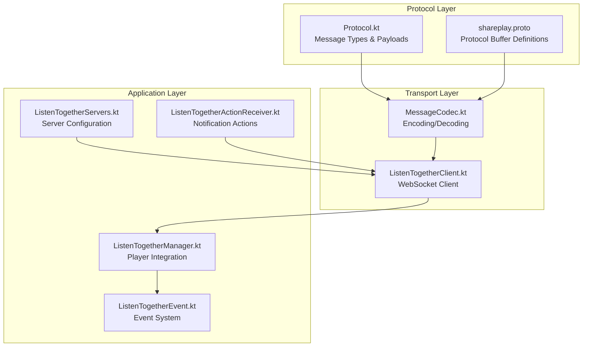

**Diagram sources**
- [Protocol.kt:1-320](file://app/src/main/java/com/suvojeet/suvmusic/shareplay/Protocol.kt#L1-L320)
- [MessageCodec.kt:1-355](file://app/src/main/java/com/suvojeet/suvmusic/shareplay/MessageCodec.kt#L1-L355)
- [ListenTogetherClient.kt:1-1205](file://app/src/main/java/com/suvojeet/suvmusic/shareplay/ListenTogetherClient.kt#L1-L1205)

**Section sources**
- [Protocol.kt:1-320](file://app/src/main/java/com/suvojeet/suvmusic/shareplay/Protocol.kt#L1-L320)
- [MessageCodec.kt:1-355](file://app/src/main/java/com/suvojeet/suvmusic/shareplay/MessageCodec.kt#L1-L355)
- [ListenTogetherClient.kt:1-1205](file://app/src/main/java/com/suvojeet/suvmusic/shareplay/ListenTogetherClient.kt#L1-L1205)

## Core Components

### Protocol Specification
The protocol defines a comprehensive set of message types and payload structures for real-time synchronization:

**Message Types** are categorized into client-to-server and server-to-client communications:
- **Client -> Server**: create_room, join_room, leave_room, approve_join, reject_join, playback_action, buffer_ready, kick_user, transfer_host, ping, chat, request_sync, reconnect, suggest_track, approve_suggestion, reject_suggestion
- **Server -> Client**: room_created, join_request, join_approved, join_rejected, user_joined, user_left, sync_playback, buffer_wait, buffer_complete, error, pong, host_changed, kicked, sync_state, reconnected, user_reconnected, user_disconnected, suggestion_received, suggestion_approved, suggestion_rejected

**Playback Actions** include comprehensive media control operations:
- Play/Pause operations with position tracking
- Seek operations with precise timing
- Track switching with queue management
- Queue operations (add, remove, clear, sync)
- Volume control with synchronization
- Skip operations (next/previous)

**Data Structures** define the complete state model:
- TrackInfo: Complete metadata for audio tracks
- UserInfo: User identity and role information
- RoomState: Complete room synchronization state
- Comprehensive payload structures for all message types

**Section sources**
- [Protocol.kt:9-49](file://app/src/main/java/com/suvojeet/suvmusic/shareplay/Protocol.kt#L9-L49)
- [Protocol.kt:54-66](file://app/src/main/java/com/suvojeet/suvmusic/shareplay/Protocol.kt#L54-L66)
- [Protocol.kt:71-107](file://app/src/main/java/com/suvojeet/suvmusic/shareplay/Protocol.kt#L71-L107)

### MessageCodec Implementation
The MessageCodec provides efficient Protocol Buffer serialization with automatic compression:

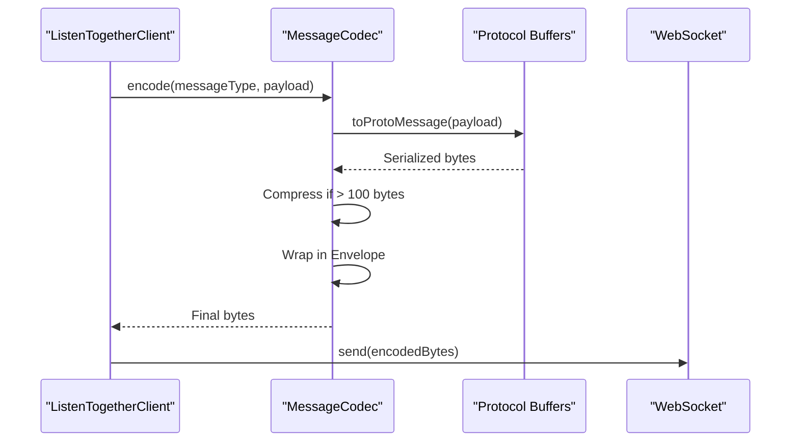

**Diagram sources**
- [MessageCodec.kt:30-84](file://app/src/main/java/com/suvojeet/suvmusic/shareplay/MessageCodec.kt#L30-L84)
- [shareplay.proto:10-15](file://app/src/main/proto/shareplay.proto#L10-L15)

**Section sources**
- [MessageCodec.kt:19-355](file://app/src/main/java/com/suvojeet/suvmusic/shareplay/MessageCodec.kt#L19-L355)
- [shareplay.proto:10-223](file://app/src/main/proto/shareplay.proto#L10-L223)

### ListenTogetherClient Architecture
The ListenTogetherClient serves as the central WebSocket management component:

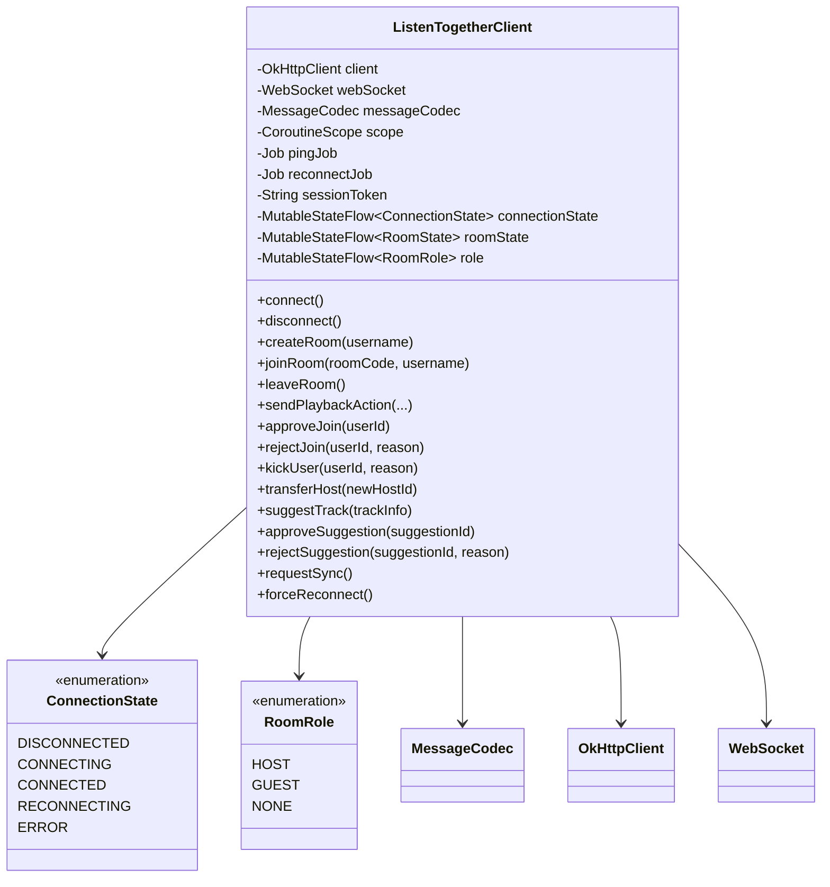

**Diagram sources**
- [ListenTogetherClient.kt:66-82](file://app/src/main/java/com/suvojeet/suvmusic/shareplay/ListenTogetherClient.kt#L66-L82)
- [ListenTogetherClient.kt:111-144](file://app/src/main/java/com/suvojeet/suvmusic/shareplay/ListenTogetherClient.kt#L111-L144)

**Section sources**
- [ListenTogetherClient.kt:111-1205](file://app/src/main/java/com/suvojeet/suvmusic/shareplay/ListenTogetherClient.kt#L111-L1205)

## Architecture Overview

### Connection Lifecycle Management
The client implements sophisticated connection lifecycle management with exponential backoff and graceful degradation:

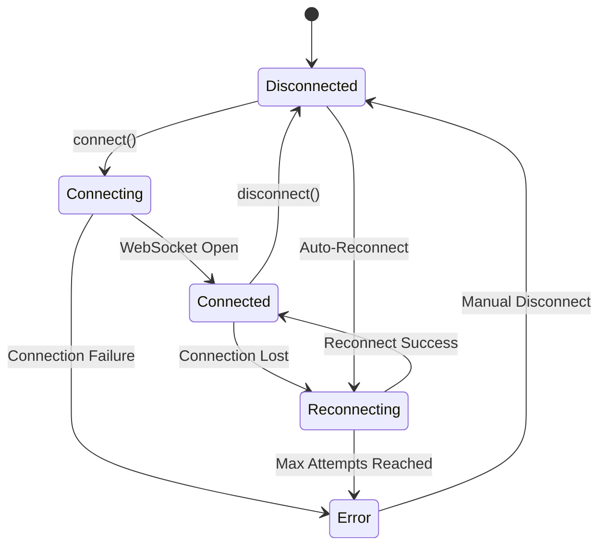

**Diagram sources**
- [ListenTogetherClient.kt:66-72](file://app/src/main/java/com/suvojeet/suvmusic/shareplay/ListenTogetherClient.kt#L66-L72)
- [ListenTogetherClient.kt:119-124](file://app/src/main/java/com/suvojeet/suvmusic/shareplay/ListenTogetherClient.kt#L119-L124)

### Message Flow Architecture
The system processes incoming messages through a comprehensive handler:

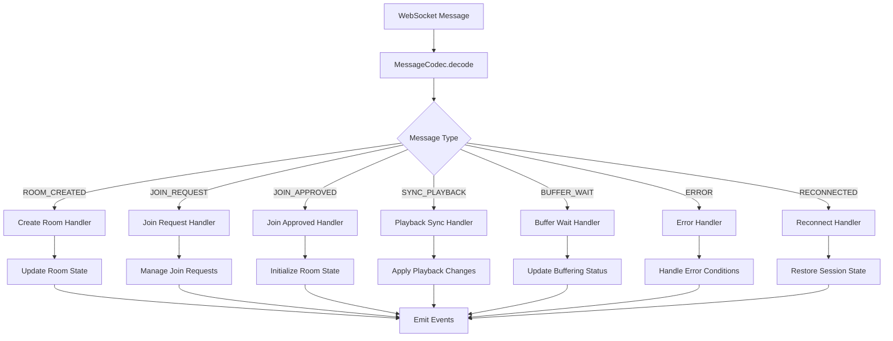

**Diagram sources**
- [ListenTogetherClient.kt:704-1020](file://app/src/main/java/com/suvojeet/suvmusic/shareplay/ListenTogetherClient.kt#L704-L1020)
- [MessageCodec.kt:180-304](file://app/src/main/java/com/suvojeet/suvmusic/shareplay/MessageCodec.kt#L180-L304)

**Section sources**
- [ListenTogetherClient.kt:411-702](file://app/src/main/java/com/suvojeet/suvmusic/shareplay/ListenTogetherClient.kt#L411-L702)
- [ListenTogetherClient.kt:704-1020](file://app/src/main/java/com/suvojeet/suvmusic/shareplay/ListenTogetherClient.kt#L704-L1020)

## Detailed Component Analysis

### Protocol Buffer Definitions
The Protocol Buffer schema provides efficient binary serialization with comprehensive type safety:

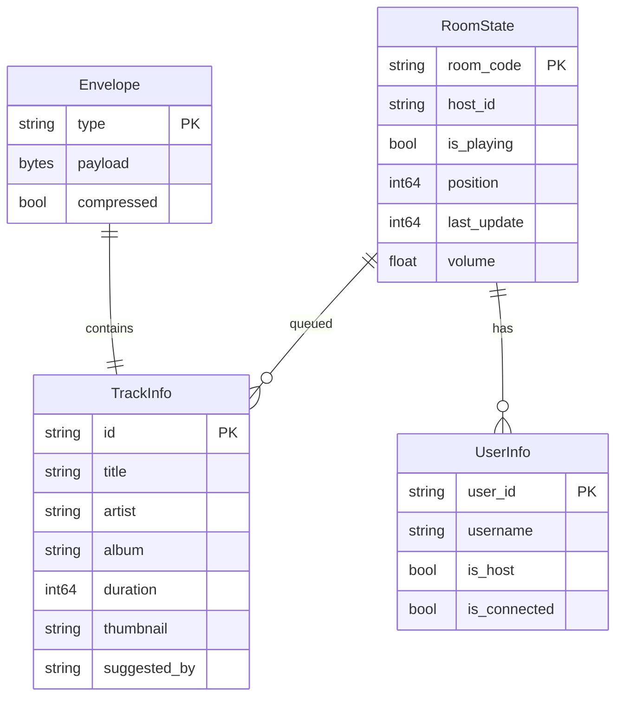

**Diagram sources**
- [shareplay.proto:10-47](file://app/src/main/proto/shareplay.proto#L10-L47)

**Section sources**
- [shareplay.proto:10-223](file://app/src/main/proto/shareplay.proto#L10-L223)

### Authentication and Session Management
The client implements robust session persistence and authentication:

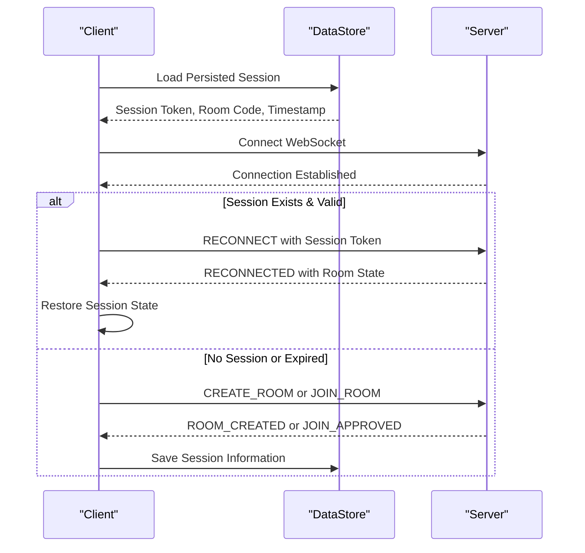

**Diagram sources**
- [ListenTogetherClient.kt:157-227](file://app/src/main/java/com/suvojeet/suvmusic/shareplay/ListenTogetherClient.kt#L157-L227)
- [Protocol.kt:296-320](file://app/src/main/java/com/suvojeet/suvmusic/shareplay/Protocol.kt#L296-L320)

**Section sources**
- [ListenTogetherClient.kt:157-227](file://app/src/main/java/com/suvojeet/suvmusic/shareplay/ListenTogetherClient.kt#L157-L227)
- [ListenTogetherClient.kt:294-314](file://app/src/main/java/com/suvojeet/suvmusic/shareplay/ListenTogetherClient.kt#L294-L314)

### Playback Synchronization Engine
The ListenTogetherManager integrates with the media player for seamless synchronization:

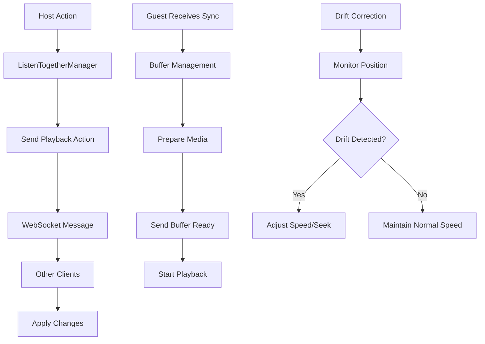

**Diagram sources**
- [ListenTogetherManager.kt:229-556](file://app/src/main/java/com/suvojeet/suvmusic/shareplay/ListenTogetherManager.kt#L229-L556)
- [ListenTogetherManager.kt:336-380](file://app/src/main/java/com/suvojeet/suvmusic/shareplay/ListenTogetherManager.kt#L336-L380)

**Section sources**
- [ListenTogetherManager.kt:229-556](file://app/src/main/java/com/suvojeet/suvmusic/shareplay/ListenTogetherManager.kt#L229-L556)
- [ListenTogetherManager.kt:336-380](file://app/src/main/java/com/suvojeet/suvmusic/shareplay/ListenTogetherManager.kt#L336-L380)

### Reconnection Strategy
The client implements sophisticated reconnection logic with exponential backoff:

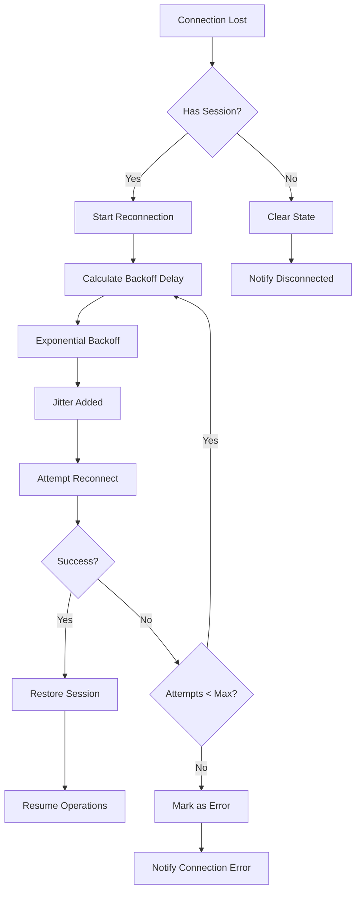

**Diagram sources**
- [ListenTogetherClient.kt:652-702](file://app/src/main/java/com/suvojeet/suvmusic/shareplay/ListenTogetherClient.kt#L652-L702)
- [ListenTogetherClient.kt:342-347](file://app/src/main/java/com/suvojeet/suvmusic/shareplay/ListenTogetherClient.kt#L342-L347)

**Section sources**
- [ListenTogetherClient.kt:652-702](file://app/src/main/java/com/suvojeet/suvmusic/shareplay/ListenTogetherClient.kt#L652-L702)
- [ListenTogetherClient.kt:342-347](file://app/src/main/java/com/suvojeet/suvmusic/shareplay/ListenTogetherClient.kt#L342-L347)

## Dependency Analysis

### Component Dependencies
The system exhibits clean separation of concerns with minimal coupling:

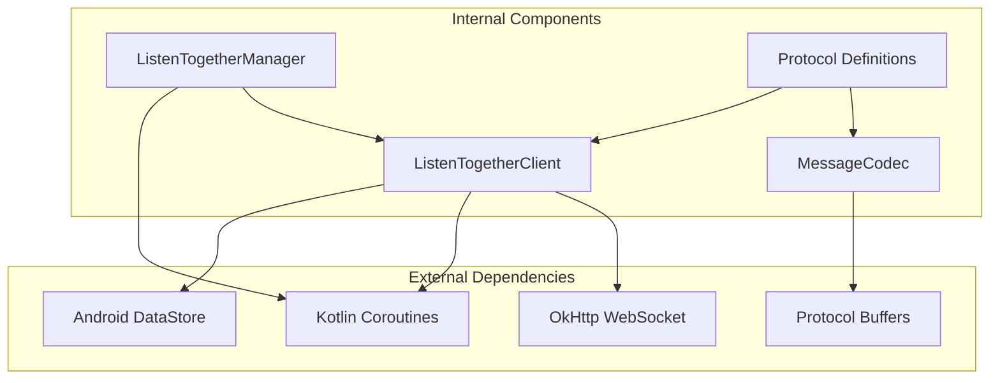

**Diagram sources**
- [MessageCodec.kt:8-14](file://app/src/main/java/com/suvojeet/suvmusic/shareplay/MessageCodec.kt#L8-L14)
- [ListenTogetherClient.kt:34-44](file://app/src/main/java/com/suvojeet/suvmusic/shareplay/ListenTogetherClient.kt#L34-L44)

### Protocol Versioning
The protocol includes explicit versioning support through capability negotiation:

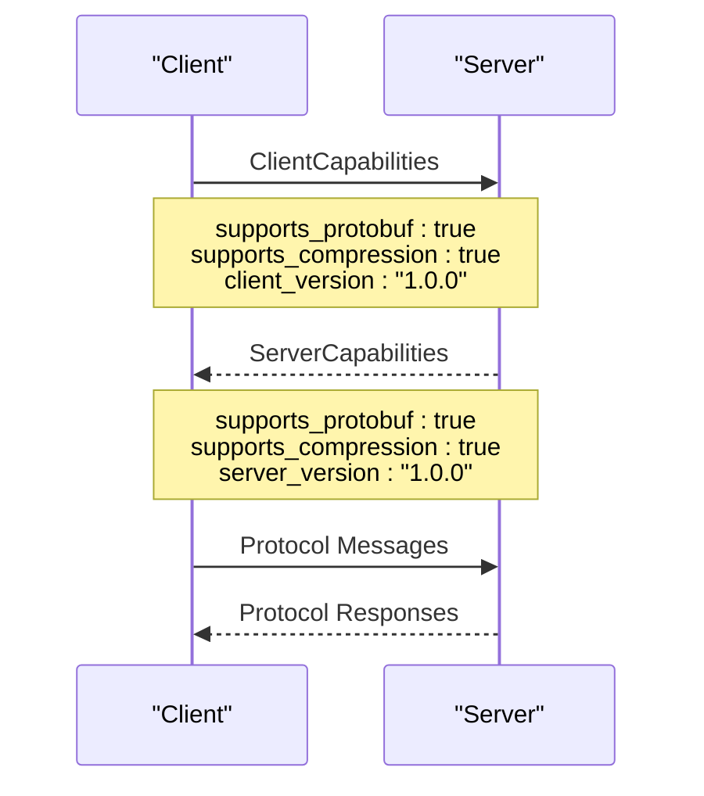

**Diagram sources**
- [shareplay.proto:211-223](file://app/src/main/proto/shareplay.proto#L211-L223)

**Section sources**
- [shareplay.proto:211-223](file://app/src/main/proto/shareplay.proto#L211-L223)

**Section sources**
- [MessageCodec.kt:19-355](file://app/src/main/java/com/suvojeet/suvmusic/shareplay/MessageCodec.kt#L19-L355)
- [ListenTogetherClient.kt:111-1205](file://app/src/main/java/com/suvojeet/suvmusic/shareplay/ListenTogetherClient.kt#L111-L1205)

## Performance Considerations

### Compression Strategy
The MessageCodec implements intelligent compression for large payloads:
- Automatic compression threshold of 100 bytes
- GZIP compression for payloads exceeding threshold
- Transparent decompression during decoding
- Configurable compression enablement

### Connection Optimization
- WebSocket ping/pong mechanism for connection health monitoring
- Optimized timeouts for different socket operations
- Efficient state updates to minimize bandwidth usage
- Background processing for non-critical operations

### Memory Management
- State flows for reactive UI updates
- Proper resource cleanup on disconnection
- Memory-efficient Protocol Buffer usage
- Controlled logging to prevent memory leaks

## Troubleshooting Guide

### Common Connection Issues
**Connection Refused**: Verify server URL configuration and network connectivity
**Authentication Failures**: Check session token validity and expiration
**Reconnection Loops**: Review exponential backoff parameters and network stability
**Message Serialization Errors**: Validate Protocol Buffer schema compatibility

### Debugging Tools
The client provides comprehensive logging infrastructure:
- Structured log entries with timestamps and severity levels
- Configurable log filtering and export capabilities
- Event-driven state tracking for debugging
- Session persistence inspection for troubleshooting

### Recovery Strategies
- Graceful degradation when server features are unavailable
- Automatic retry mechanisms with exponential backoff
- Session state preservation across reconnections
- User notification system for join requests and suggestions

**Section sources**
- [ListenTogetherClient.kt:393-409](file://app/src/main/java/com/suvojeet/suvmusic/shareplay/ListenTogetherClient.kt#L393-L409)
- [ListenTogetherClient.kt:636-702](file://app/src/main/java/com/suvojeet/suvmusic/shareplay/ListenTogetherClient.kt#L636-L702)

## Conclusion
The WebSocket-based protocol implementation provides a robust foundation for real-time synchronized music playback across multiple devices. The architecture demonstrates excellent separation of concerns, with clear protocols for message exchange, sophisticated connection management, and comprehensive error handling.

Key strengths include:
- Efficient Protocol Buffer serialization with automatic compression
- Sophisticated reconnection strategies with exponential backoff
- Advanced playback synchronization with drift correction
- Comprehensive state management and session persistence
- Clean integration with Android media framework

The implementation successfully balances performance requirements with reliability, providing a solid foundation for the Listen Together feature while maintaining extensibility for future enhancements.