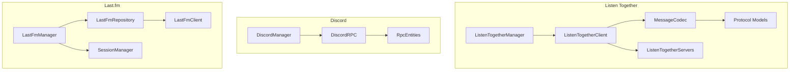
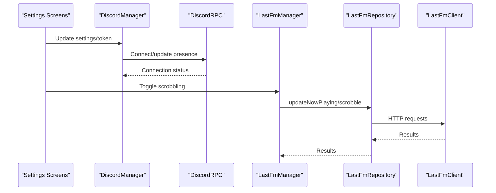
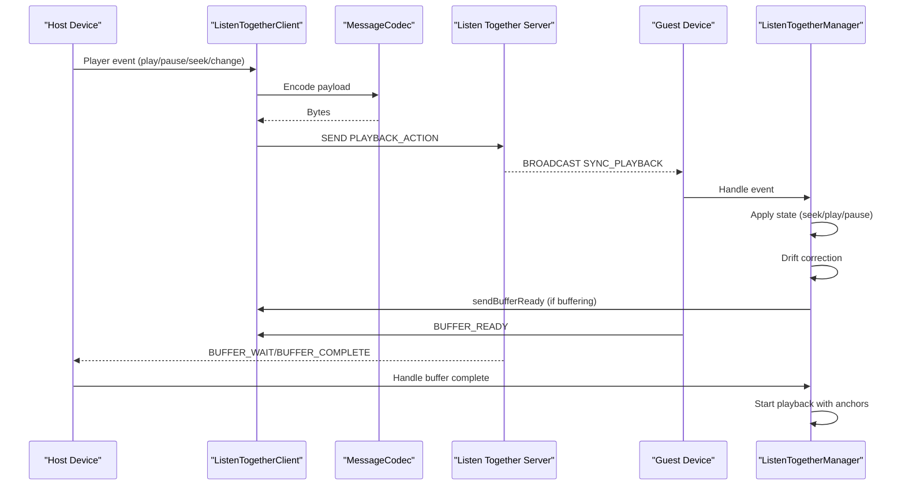
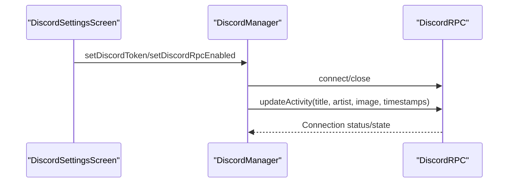
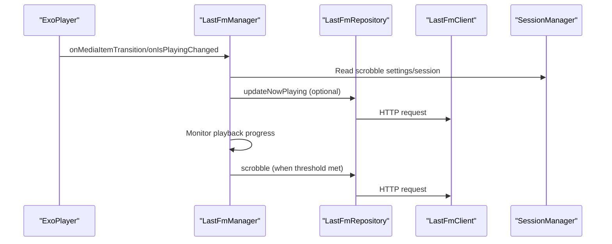
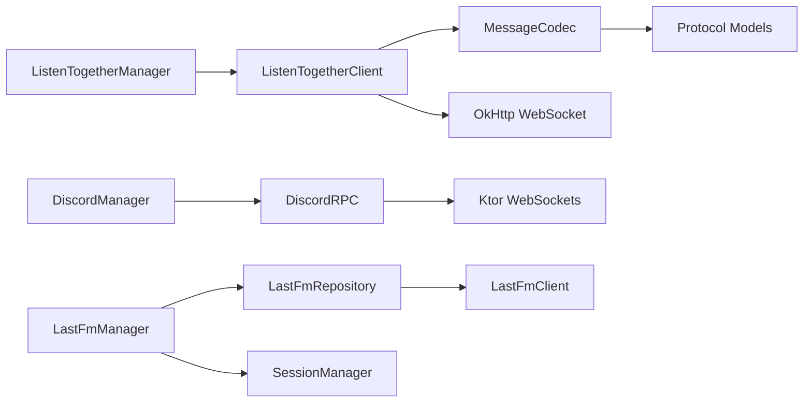

# Social Features

<cite>
**Referenced Files in This Document**
- [ListenTogetherManager.kt](file://app/src/main/java/com/suvojeet/suvmusic/shareplay/ListenTogetherManager.kt)
- [ListenTogetherClient.kt](file://app/src/main/java/com/suvojeet/suvmusic/shareplay/ListenTogetherClient.kt)
- [Protocol.kt](file://app/src/main/java/com/suvojeet/suvmusic/shareplay/Protocol.kt)
- [ListenTogetherEvent.kt](file://app/src/main/java/com/suvojeet/suvmusic/shareplay/ListenTogetherEvent.kt)
- [MessageCodec.kt](file://app/src/main/java/com/suvojeet/suvmusic/shareplay/MessageCodec.kt)
- [ListenTogetherServers.kt](file://app/src/main/java/com/suvojeet/suvmusic/shareplay/ListenTogetherServers.kt)
- [DiscordManager.kt](file://app/src/main/java/com/suvojeet/suvmusic/discord/DiscordManager.kt)
- [DiscordRPC.kt](file://app/src/main/java/com/suvojeet/suvmusic/discord/DiscordRPC.kt)
- [RpcEntities.kt](file://app/src/main/java/com/suvojeet/suvmusic/discord/RpcEntities.kt)
- [LastFmManager.kt](file://app/src/main/java/com/suvojeet/suvmusic/player/LastFmManager.kt)
- [LastFmClient.kt](file://scrobbler/src/main/java/com/suvojeet/suvmusic/lastfm/LastFmClient.kt)
- [LastFmRepository.kt](file://scrobbler/src/main/java/com/suvojeet/suvmusic/lastfm/LastFmRepository.kt)
- [SessionManager.kt](file://app/src/main/java/com/suvojeet/suvmusic/data/SessionManager.kt)
- [DiscordSettingsScreen.kt](file://app/src/main/java/com/suvojeet/suvmusic/ui/screens/settings/DiscordSettingsScreen.kt)
- [LastFmSettingsScreen.kt](file://app/src/main/java/com/suvojeet/suvmusic/ui/screens/settings/LastFmSettingsScreen.kt)
</cite>

## Table of Contents
1. [Introduction](#introduction)
2. [Project Structure](#project-structure)
3. [Core Components](#core-components)
4. [Architecture Overview](#architecture-overview)
5. [Detailed Component Analysis](#detailed-component-analysis)
6. [Dependency Analysis](#dependency-analysis)
7. [Performance Considerations](#performance-considerations)
8. [Troubleshooting Guide](#troubleshooting-guide)
9. [Conclusion](#conclusion)

## Introduction
This document explains SuvMusic’s social features: Listen Together (multi-device synchronized playback), Discord Rich Presence integration, and Last.fm scrobbling. It covers protocol specifications, message formats, synchronization mechanisms, network reliability, error handling, and privacy considerations.

## Project Structure
Social features are implemented across three primary areas:
- Listen Together: WebSocket-based room orchestration, protobuf-encoded messages, and ExoPlayer integration for synchronized playback.
- Discord Rich Presence: A lightweight Discord Gateway client implementing RPC-like presence updates.
- Last.fm Scrobbling: A Last.fm client and manager that submits listening history and metadata.

**Diagram sources**
- [ListenTogetherManager.kt:1-828](file://app/src/main/java/com/suvojeet/suvmusic/shareplay/ListenTogetherManager.kt#L1-L828)
- [ListenTogetherClient.kt:1-1205](file://app/src/main/java/com/suvojeet/suvmusic/shareplay/ListenTogetherClient.kt#L1-L1205)
- [MessageCodec.kt:1-355](file://app/src/main/java/com/suvojeet/suvmusic/shareplay/MessageCodec.kt#L1-L355)
- [Protocol.kt:1-320](file://app/src/main/java/com/suvojeet/suvmusic/shareplay/Protocol.kt#L1-L320)
- [ListenTogetherServers.kt:1-42](file://app/src/main/java/com/suvojeet/suvmusic/shareplay/ListenTogetherServers.kt#L1-L42)
- [DiscordManager.kt:1-161](file://app/src/main/java/com/suvojeet/suvmusic/discord/DiscordManager.kt#L1-L161)
- [DiscordRPC.kt:1-352](file://app/src/main/java/com/suvojeet/suvmusic/discord/DiscordRPC.kt#L1-L352)
- [RpcEntities.kt:1-179](file://app/src/main/java/com/suvojeet/suvmusic/discord/RpcEntities.kt#L1-L179)
- [LastFmManager.kt:1-190](file://app/src/main/java/com/suvojeet/suvmusic/player/LastFmManager.kt#L1-L190)
- [LastFmRepository.kt:1-43](file://scrobbler/src/main/java/com/suvojeet/suvmusic/lastfm/LastFmRepository.kt#L1-L43)
- [LastFmClient.kt:1-230](file://scrobbler/src/main/java/com/suvojeet/suvmusic/lastfm/LastFmClient.kt#L1-L230)
- [SessionManager.kt:1-2416](file://app/src/main/java/com/suvojeet/suvmusic/data/SessionManager.kt#L1-L2416)

**Section sources**
- [ListenTogetherManager.kt:1-828](file://app/src/main/java/com/suvojeet/suvmusic/shareplay/ListenTogetherManager.kt#L1-L828)
- [ListenTogetherClient.kt:1-1205](file://app/src/main/java/com/suvojeet/suvmusic/shareplay/ListenTogetherClient.kt#L1-L1205)
- [DiscordManager.kt:1-161](file://app/src/main/java/com/suvojeet/suvmusic/discord/DiscordManager.kt#L1-L161)
- [LastFmManager.kt:1-190](file://app/src/main/java/com/suvojeet/suvmusic/player/LastFmManager.kt#L1-L190)

## Core Components
- Listen Together Manager: Bridges the WebSocket client with the ExoPlayer, orchestrates synchronization, drift correction, and buffering.
- Listen Together Client: WebSocket client that manages rooms, user roles, and message routing; persists sessions and handles reconnections.
- Protocol Models: Strongly typed message types, payloads, and enums for playback actions and room state.
- Message Codec: Encodes/decodes protobuf envelopes with optional compression.
- Discord Manager: Orchestrates Discord RPC lifecycle, settings, and presence updates.
- Discord RPC: Implements Discord Gateway protocol (identify, heartbeat, presence update).
- Last.fm Manager: Monitors playback and submits scrobbles and “now playing” updates.
- Last.fm Client/Repository: Performs authenticated HTTP requests to Last.fm API and manages session keys.

**Section sources**
- [ListenTogetherManager.kt:1-828](file://app/src/main/java/com/suvojeet/suvmusic/shareplay/ListenTogetherManager.kt#L1-L828)
- [ListenTogetherClient.kt:1-1205](file://app/src/main/java/com/suvojeet/suvmusic/shareplay/ListenTogetherClient.kt#L1-L1205)
- [Protocol.kt:1-320](file://app/src/main/java/com/suvojeet/suvmusic/shareplay/Protocol.kt#L1-L320)
- [MessageCodec.kt:1-355](file://app/src/main/java/com/suvojeet/suvmusic/shareplay/MessageCodec.kt#L1-L355)
- [DiscordManager.kt:1-161](file://app/src/main/java/com/suvojeet/suvmusic/discord/DiscordManager.kt#L1-L161)
- [DiscordRPC.kt:1-352](file://app/src/main/java/com/suvojeet/suvmusic/discord/DiscordRPC.kt#L1-L352)
- [LastFmManager.kt:1-190](file://app/src/main/java/com/suvojeet/suvmusic/player/LastFmManager.kt#L1-L190)
- [LastFmClient.kt:1-230](file://scrobbler/src/main/java/com/suvojeet/suvmusic/lastfm/LastFmClient.kt#L1-L230)
- [LastFmRepository.kt:1-43](file://scrobbler/src/main/java/com/suvojeet/suvmusic/lastfm/LastFmRepository.kt#L1-L43)

## Architecture Overview
The social features are layered:
- Presentation/UI: Settings screens for Discord and Last.fm.
- Domain/Data: SessionManager stores credentials and preferences.
- Feature Modules:
  - Listen Together: Client and Manager coordinate with ExoPlayer and protobuf messages.
  - Discord: Manager delegates to RPC client for presence updates.
  - Last.fm: Manager triggers HTTP requests via repository/client.

**Diagram sources**
- [DiscordSettingsScreen.kt:1-421](file://app/src/main/java/com/suvojeet/suvmusic/ui/screens/settings/DiscordSettingsScreen.kt#L1-L421)
- [DiscordManager.kt:1-161](file://app/src/main/java/com/suvojeet/suvmusic/discord/DiscordManager.kt#L1-L161)
- [DiscordRPC.kt:1-352](file://app/src/main/java/com/suvojeet/suvmusic/discord/DiscordRPC.kt#L1-L352)
- [LastFmSettingsScreen.kt:1-387](file://app/src/main/java/com/suvojeet/suvmusic/ui/screens/settings/LastFmSettingsScreen.kt#L1-L387)
- [LastFmManager.kt:1-190](file://app/src/main/java/com/suvojeet/suvmusic/player/LastFmManager.kt#L1-L190)
- [LastFmRepository.kt:1-43](file://scrobbler/src/main/java/com/suvojeet/suvmusic/lastfm/LastFmRepository.kt#L1-L43)
- [LastFmClient.kt:1-230](file://scrobbler/src/main/java/com/suvojeet/suvmusic/lastfm/LastFmClient.kt#L1-L230)

## Detailed Component Analysis

### Listen Together Protocol and Synchronization
- Message Types and Actions: Enumerated message types and playback actions define the protocol surface.
- Room State Model: Tracks host, users, current track, play state, position, volume, and queue.
- Client Responsibilities:
  - Connect/reconnect with exponential backoff and jitter.
  - Persist session tokens and room metadata for graceful rejoin.
  - Manage notifications for join requests and suggestions.
  - Route decoded payloads to events and update room state.
- Manager Responsibilities:
  - Bridge ExoPlayer events to playback actions.
  - Apply remote actions with drift correction and buffering.
  - Handle track changes, queue operations, and volume sync.
  - Enforce privacy mode and host/guest roles.

**Diagram sources**
- [ListenTogetherClient.kt:704-1020](file://app/src/main/java/com/suvojeet/suvmusic/shareplay/ListenTogetherClient.kt#L704-L1020)
- [MessageCodec.kt:30-84](file://app/src/main/java/com/suvojeet/suvmusic/shareplay/MessageCodec.kt#L30-L84)
- [ListenTogetherManager.kt:418-556](file://app/src/main/java/com/suvojeet/suvmusic/shareplay/ListenTogetherManager.kt#L418-L556)
- [Protocol.kt:9-66](file://app/src/main/java/com/suvojeet/suvmusic/shareplay/Protocol.kt#L9-L66)

**Section sources**
- [Protocol.kt:1-320](file://app/src/main/java/com/suvojeet/suvmusic/shareplay/Protocol.kt#L1-L320)
- [ListenTogetherClient.kt:1-1205](file://app/src/main/java/com/suvojeet/suvmusic/shareplay/ListenTogetherClient.kt#L1-L1205)
- [ListenTogetherManager.kt:1-828](file://app/src/main/java/com/suvojeet/suvmusic/shareplay/ListenTogetherManager.kt#L1-L828)
- [MessageCodec.kt:1-355](file://app/src/main/java/com/suvojeet/suvmusic/shareplay/MessageCodec.kt#L1-L355)
- [ListenTogetherEvent.kt:1-35](file://app/src/main/java/com/suvojeet/suvmusic/shareplay/ListenTogetherEvent.kt#L1-L35)
- [ListenTogetherServers.kt:1-42](file://app/src/main/java/com/suvojeet/suvmusic/shareplay/ListenTogetherServers.kt#L1-L42)

### Discord Rich Presence Integration
- Manager:
  - Initializes RPC client, applies settings, and monitors privacy mode.
  - Updates presence with title/artist, image URL, and timestamps.
- RPC Client:
  - Implements Discord Gateway handshake, heartbeat, and presence updates.
  - Supports reconnection and resume flows.
- UI:
  - Settings screen allows token entry, enabling/disabling presence, and preview.

**Diagram sources**
- [DiscordSettingsScreen.kt:1-421](file://app/src/main/java/com/suvojeet/suvmusic/ui/screens/settings/DiscordSettingsScreen.kt#L1-L421)
- [DiscordManager.kt:1-161](file://app/src/main/java/com/suvojeet/suvmusic/discord/DiscordManager.kt#L1-L161)
- [DiscordRPC.kt:1-352](file://app/src/main/java/com/suvojeet/suvmusic/discord/DiscordRPC.kt#L1-L352)
- [RpcEntities.kt:1-179](file://app/src/main/java/com/suvojeet/suvmusic/discord/RpcEntities.kt#L1-L179)

**Section sources**
- [DiscordManager.kt:1-161](file://app/src/main/java/com/suvojeet/suvmusic/discord/DiscordManager.kt#L1-L161)
- [DiscordRPC.kt:1-352](file://app/src/main/java/com/suvojeet/suvmusic/discord/DiscordRPC.kt#L1-L352)
- [RpcEntities.kt:1-179](file://app/src/main/java/com/suvojeet/suvmusic/discord/RpcEntities.kt#L1-L179)
- [DiscordSettingsScreen.kt:1-421](file://app/src/main/java/com/suvojeet/suvmusic/ui/screens/settings/DiscordSettingsScreen.kt#L1-L421)

### Last.fm Scrobbling Implementation
- Manager:
  - Listens to ExoPlayer events, extracts metadata, and schedules scrobble timing.
  - Submits “now playing” and scrobble events via repository/client.
- Repository/Client:
  - Performs authenticated requests to Last.fm API using API key/shared secret.
  - Supports session creation, scrobble, and “now playing” updates.
- Session Management:
  - Stores Last.fm session key and user preferences securely.

**Diagram sources**
- [LastFmManager.kt:1-190](file://app/src/main/java/com/suvojeet/suvmusic/player/LastFmManager.kt#L1-L190)
- [LastFmRepository.kt:1-43](file://scrobbler/src/main/java/com/suvojeet/suvmusic/lastfm/LastFmRepository.kt#L1-L43)
- [LastFmClient.kt:1-230](file://scrobbler/src/main/java/com/suvojeet/suvmusic/lastfm/LastFmClient.kt#L1-L230)
- [SessionManager.kt:494-605](file://app/src/main/java/com/suvojeet/suvmusic/data/SessionManager.kt#L494-L605)

**Section sources**
- [LastFmManager.kt:1-190](file://app/src/main/java/com/suvojeet/suvmusic/player/LastFmManager.kt#L1-L190)
- [LastFmRepository.kt:1-43](file://scrobbler/src/main/java/com/suvojeet/suvmusic/lastfm/LastFmRepository.kt#L1-L43)
- [LastFmClient.kt:1-230](file://scrobbler/src/main/java/com/suvojeet/suvmusic/lastfm/LastFmClient.kt#L1-L230)
- [SessionManager.kt:494-605](file://app/src/main/java/com/suvojeet/suvmusic/data/SessionManager.kt#L494-L605)
- [LastFmSettingsScreen.kt:1-387](file://app/src/main/java/com/suvojeet/suvmusic/ui/screens/settings/LastFmSettingsScreen.kt#L1-L387)

## Dependency Analysis
- Listen Together depends on:
  - ExoPlayer for playback state and media items.
  - OkHttp WebSocket for transport.
  - Protobuf codec for message framing and compression.
  - DataStore for persisted session and preferences.
- Discord depends on:
  - Ktor WebSockets for Gateway connectivity.
  - UI settings for token management.
- Last.fm depends on:
  - HTTP client for API calls.
  - SessionManager for secure credential storage.

**Diagram sources**
- [ListenTogetherManager.kt:1-828](file://app/src/main/java/com/suvojeet/suvmusic/shareplay/ListenTogetherManager.kt#L1-L828)
- [ListenTogetherClient.kt:1-1205](file://app/src/main/java/com/suvojeet/suvmusic/shareplay/ListenTogetherClient.kt#L1-L1205)
- [MessageCodec.kt:1-355](file://app/src/main/java/com/suvojeet/suvmusic/shareplay/MessageCodec.kt#L1-L355)
- [Protocol.kt:1-320](file://app/src/main/java/com/suvojeet/suvmusic/shareplay/Protocol.kt#L1-L320)
- [DiscordManager.kt:1-161](file://app/src/main/java/com/suvojeet/suvmusic/discord/DiscordManager.kt#L1-L161)
- [DiscordRPC.kt:1-352](file://app/src/main/java/com/suvojeet/suvmusic/discord/DiscordRPC.kt#L1-L352)
- [LastFmManager.kt:1-190](file://app/src/main/java/com/suvojeet/suvmusic/player/LastFmManager.kt#L1-L190)
- [LastFmRepository.kt:1-43](file://scrobbler/src/main/java/com/suvojeet/suvmusic/lastfm/LastFmRepository.kt#L1-L43)
- [LastFmClient.kt:1-230](file://scrobbler/src/main/java/com/suvojeet/suvmusic/lastfm/LastFmClient.kt#L1-L230)
- [SessionManager.kt:1-2416](file://app/src/main/java/com/suvojeet/suvmusic/data/SessionManager.kt#L1-L2416)

**Section sources**
- [ListenTogetherClient.kt:320-326](file://app/src/main/java/com/suvojeet/suvmusic/shareplay/ListenTogetherClient.kt#L320-L326)
- [DiscordRPC.kt:44-48](file://app/src/main/java/com/suvojeet/suvmusic/discord/DiscordRPC.kt#L44-L48)
- [LastFmClient.kt:34-43](file://scrobbler/src/main/java/com/suvojeet/suvmusic/lastfm/LastFmClient.kt#L34-L43)

## Performance Considerations
- Compression: Protobuf payloads are compressed when exceeding a threshold to reduce bandwidth.
- Backoff and Heartbeats: Exponential backoff with jitter prevents thundering herds; periodic pings maintain liveness.
- Drift Correction: Continuous small adjustments and hard seeks minimize long-term drift during synchronized playback.
- Resource Throttling: Last.fm scrobbling checks are suspended when paused and scheduled at intervals to reduce CPU usage.

[No sources needed since this section provides general guidance]

## Troubleshooting Guide
- Listen Together
  - Reconnection Loops: Exponential backoff with max attempts prevents infinite retries; inspect logs for failure reasons.
  - Session Persistence: Sessions are saved for a grace period; expired sessions are cleared automatically.
  - Privacy Mode: Rooms are left when privacy mode is enabled.
  - Buffering: Buffering waits for all guests; timeouts force-play if needed.
- Discord
  - Authentication Failures: Specific close codes halt reconnection; verify token validity.
  - Presence Updates: Ensure settings are enabled and not in privacy mode.
- Last.fm
  - Scrobble Timing: Adjust minimum duration and scrobble percentage to suit user preference.
  - Session Keys: Stored securely; clear and re-authenticate if issues persist.

**Section sources**
- [ListenTogetherClient.kt:652-702](file://app/src/main/java/com/suvojeet/suvmusic/shareplay/ListenTogetherClient.kt#L652-L702)
- [ListenTogetherClient.kt:1190-1203](file://app/src/main/java/com/suvojeet/suvmusic/shareplay/ListenTogetherClient.kt#L1190-L1203)
- [DiscordRPC.kt:114-132](file://app/src/main/java/com/suvojeet/suvmusic/discord/DiscordRPC.kt#L114-L132)
- [LastFmManager.kt:116-164](file://app/src/main/java/com/suvojeet/suvmusic/player/LastFmManager.kt#L116-L164)

## Conclusion
SuvMusic’s social features combine robust networking (WebSocket + protobuf), precise playback synchronization, and user-friendly integrations with Discord and Last.fm. The architecture emphasizes reliability, privacy-aware behavior, and extensible protocols suitable for future enhancements.