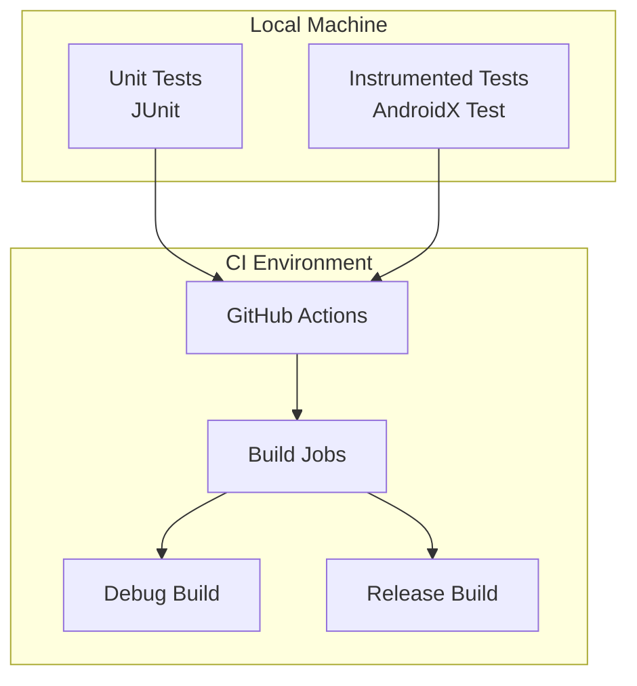
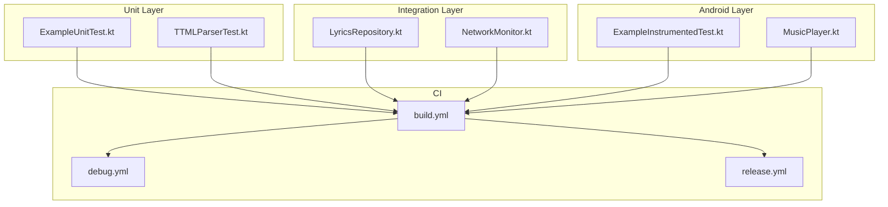
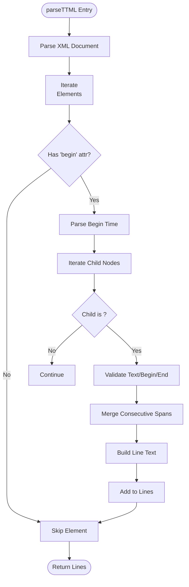
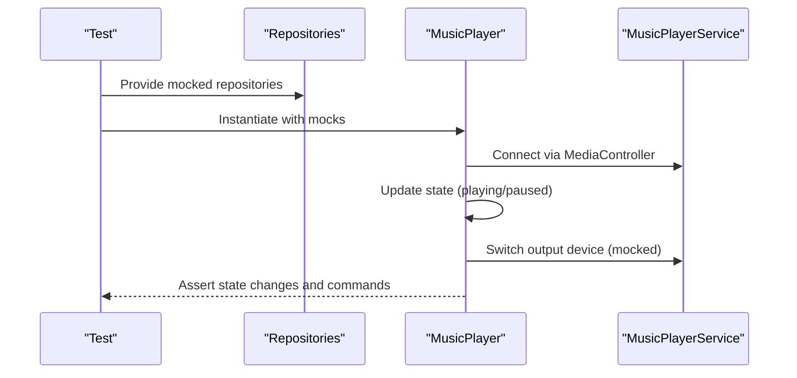
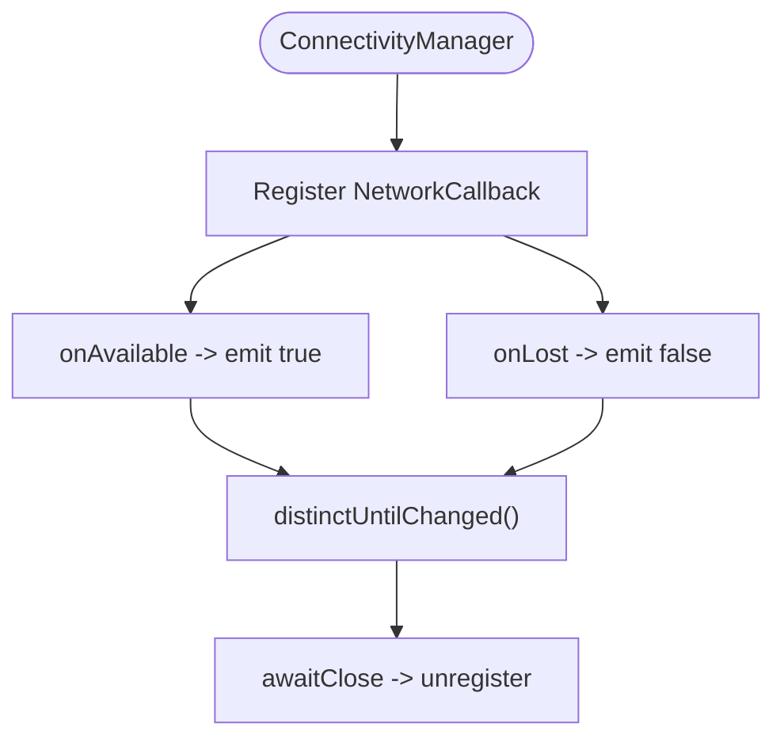
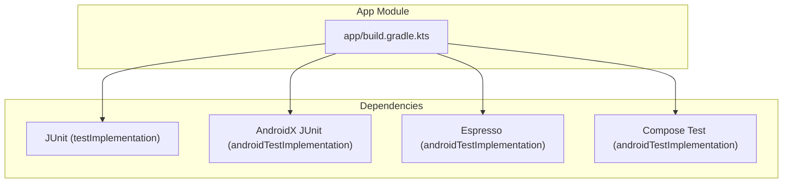
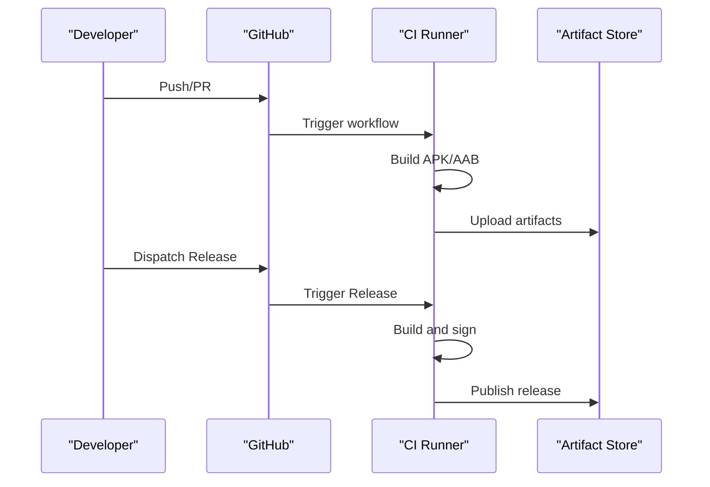

# Testing Strategy

<cite>
**Referenced Files in This Document**
- [ExampleUnitTest.kt](file://app/src/test/java/com/suvojeet/suvmusic/ExampleUnitTest.kt)
- [ExampleInstrumentedTest.kt](file://app/src/androidTest/java/com/suvojeet/suvmusic/ExampleInstrumentedTest.kt)
- [TTMLParserTest.kt](file://app/src/test/java/com/suvojeet/suvmusic/data/repository/lyrics/TTMLParserTest.kt)
- [TTMLParser.kt](file://app/src/main/java/com/suvojeet/suvmusic/data/repository/lyrics/TTMLParser.kt)
- [LyricsRepository.kt](file://app/src/main/java/com/suvojeet/suvmusic/data/repository/LyricsRepository.kt)
- [MusicPlayer.kt](file://app/src/main/java/com/suvojeet/suvmusic/player/MusicPlayer.kt)
- [NetworkMonitor.kt](file://app/src/main/java/com/suvojeet/suvmusic/util/NetworkMonitor.kt)
- [build.yml](file://.github/workflows/build.yml)
- [debug.yml](file://.github/workflows/debug.yml)
- [release.yml](file://.github/workflows/release.yml)
- [build.gradle.kts](file://app/build.gradle.kts)
- [build.gradle.kts (root)](file://build.gradle.kts)
</cite>

## Table of Contents
1. [Introduction](#introduction)
2. [Project Structure](#project-structure)
3. [Core Components](#core-components)
4. [Architecture Overview](#architecture-overview)
5. [Detailed Component Analysis](#detailed-component-analysis)
6. [Dependency Analysis](#dependency-analysis)
7. [Performance Considerations](#performance-considerations)
8. [Troubleshooting Guide](#troubleshooting-guide)
9. [Conclusion](#conclusion)
10. [Appendices](#appendices)

## Introduction
This document describes SuvMusic’s testing strategy across unit tests, instrumented tests, and continuous integration. It focuses on Kotlin unit testing, Android instrumentation testing, mock implementations for external dependencies, and the testing architecture used for critical components such as lyric parsing, audio processing, and network integration. It also covers test utilities, assertion patterns, test data management, environment setup, and recommended practices for performance, memory leak detection, and regression testing.

## Project Structure
The repository organizes tests by platform:
- Unit tests: app/src/test
- Instrumented tests: app/src/androidTest

The testing stack integrates with JUnit for assertions and AndroidX Test for instrumentation. Continuous integration is configured via GitHub Actions workflows that build debug and release artifacts and publish releases.

**Diagram sources**
- [build.yml:1-151](file://.github/workflows/build.yml#L1-L151)
- [debug.yml:1-58](file://.github/workflows/debug.yml#L1-L58)
- [release.yml:1-134](file://.github/workflows/release.yml#L1-L134)

**Section sources**
- [build.gradle.kts:245-253](file://app/build.gradle.kts#L245-L253)
- [build.yml:1-151](file://.github/workflows/build.yml#L1-L151)
- [debug.yml:1-58](file://.github/workflows/debug.yml#L1-L58)
- [release.yml:1-134](file://.github/workflows/release.yml#L1-L134)

## Core Components
- Unit tests: Basic arithmetic verification and parser behavior validation.
- Instrumented tests: App context verification on Android devices.
- Lyric parsing: TTMLParser with robust parsing and fallback behavior.
- Lyrics retrieval: LyricsRepository orchestrating multiple providers and caching.
- Audio playback: MusicPlayer coordinating Media3, device routing, and playback lifecycle.
- Network monitoring: NetworkMonitor exposing connectivity as a Flow.

**Section sources**
- [ExampleUnitTest.kt:1-17](file://app/src/test/java/com/suvojeet/suvmusic/ExampleUnitTest.kt#L1-L17)
- [ExampleInstrumentedTest.kt:1-24](file://app/src/androidTest/java/com/suvojeet/suvmusic/ExampleInstrumentedTest.kt#L1-L24)
- [TTMLParserTest.kt:1-83](file://app/src/test/java/com/suvojeet/suvmusic/data/repository/lyrics/TTMLParserTest.kt#L1-L83)
- [TTMLParser.kt:1-214](file://app/src/main/java/com/suvojeet/suvmusic/data/repository/lyrics/TTMLParser.kt#L1-L214)
- [LyricsRepository.kt:1-310](file://app/src/main/java/com/suvojeet/suvmusic/data/repository/LyricsRepository.kt#L1-L310)
- [MusicPlayer.kt:1-800](file://app/src/main/java/com/suvojeet/suvmusic/player/MusicPlayer.kt#L1-L800)
- [NetworkMonitor.kt:1-97](file://app/src/main/java/com/suvojeet/suvmusic/util/NetworkMonitor.kt#L1-L97)

## Architecture Overview
The testing architecture separates concerns:
- Unit tests validate pure logic and parsers without Android dependencies.
- Instrumented tests validate Android-specific behavior and environment.
- CI pipelines automate builds and releases, ensuring regressions are caught early.

**Diagram sources**
- [ExampleUnitTest.kt:1-17](file://app/src/test/java/com/suvojeet/suvmusic/ExampleUnitTest.kt#L1-L17)
- [TTMLParserTest.kt:1-83](file://app/src/test/java/com/suvojeet/suvmusic/data/repository/lyrics/TTMLParserTest.kt#L1-L83)
- [LyricsRepository.kt:1-310](file://app/src/main/java/com/suvojeet/suvmusic/data/repository/LyricsRepository.kt#L1-L310)
- [NetworkMonitor.kt:1-97](file://app/src/main/java/com/suvojeet/suvmusic/util/NetworkMonitor.kt#L1-L97)
- [ExampleInstrumentedTest.kt:1-24](file://app/src/androidTest/java/com/suvojeet/suvmusic/ExampleInstrumentedTest.kt#L1-L24)
- [MusicPlayer.kt:1-800](file://app/src/main/java/com/suvojeet/suvmusic/player/MusicPlayer.kt#L1-L800)
- [build.yml:1-151](file://.github/workflows/build.yml#L1-L151)
- [debug.yml:1-58](file://.github/workflows/debug.yml#L1-L58)
- [release.yml:1-134](file://.github/workflows/release.yml#L1-L134)

## Detailed Component Analysis

### Unit Testing Approach
- Pure logic tests: Validate deterministic behavior without Android runtime.
- Parser tests: Validate parsing correctness, malformed input handling, and defaults.
- Assertion patterns: Use equality checks and null/not-null assertions to verify outcomes.

Recommended patterns:
- Prefer small, focused tests per method or behavior.
- Use descriptive test names that state the scenario and expected outcome.
- Assert only observable outputs and side effects.

**Section sources**
- [ExampleUnitTest.kt:1-17](file://app/src/test/java/com/suvojeet/suvmusic/ExampleUnitTest.kt#L1-L17)
- [TTMLParserTest.kt:1-83](file://app/src/test/java/com/suvojeet/suvmusic/data/repository/lyrics/TTMLParserTest.kt#L1-L83)

### Instrumented Testing for Android UI
- Validates Android environment, context, and device-specific behavior.
- Ensures app context and package name are correct on target devices.

Best practices:
- Keep instrumentation tests minimal and fast.
- Use Espresso for UI interactions when needed.
- Avoid flakiness by controlling environment and avoiding real network calls.

**Section sources**
- [ExampleInstrumentedTest.kt:1-24](file://app/src/androidTest/java/com/suvojeet/suvmusic/ExampleInstrumentedTest.kt#L1-L24)
- [build.gradle.kts:245-253](file://app/build.gradle.kts#L245-L253)

### Mock Implementations for External Dependencies
- NetworkMonitor exposes connectivity as a Flow; suitable for injecting test doubles in higher layers.
- LyricsRepository composes multiple providers; use dependency injection to swap providers with mocks/stubs for tests.
- For audio processing and playback, isolate Media3 interactions behind interfaces or repositories to enable mocking.

Recommended patterns:
- Inject dependencies via constructor or DI framework.
- Replace external services with stubs or fake implementations in tests.
- Verify interactions via callbacks or state assertions.

**Section sources**
- [NetworkMonitor.kt:1-97](file://app/src/main/java/com/suvojeet/suvmusic/util/NetworkMonitor.kt#L1-L97)
- [LyricsRepository.kt:1-310](file://app/src/main/java/com/suvojeet/suvmusic/data/repository/LyricsRepository.kt#L1-L310)

### Lyric Parsing Tests
TTMLParser converts TTML to LRC-like lines with optional word-level timing. The test suite validates:
- Time parsing for various formats.
- Robustness against malformed inputs.
- Extraction of words with correct timing and spacing.

**Diagram sources**
- [TTMLParser.kt:32-112](file://app/src/main/java/com/suvojeet/suvmusic/data/repository/lyrics/TTMLParser.kt#L32-L112)

**Section sources**
- [TTMLParserTest.kt:1-83](file://app/src/test/java/com/suvojeet/suvmusic/data/repository/lyrics/TTMLParserTest.kt#L1-L83)
- [TTMLParser.kt:1-214](file://app/src/main/java/com/suvojeet/suvmusic/data/repository/lyrics/TTMLParser.kt#L1-L214)

### Audio Processing and Playback
MusicPlayer coordinates playback, device routing, and state management. For testing:
- Mock repositories and services injected into MusicPlayer.
- Use coroutine dispatchers and scopes to control async behavior deterministically.
- Verify state transitions and device selection logic via state assertions.

**Diagram sources**
- [MusicPlayer.kt:479-499](file://app/src/main/java/com/suvojeet/suvmusic/player/MusicPlayer.kt#L479-L499)
- [MusicPlayer.kt:459-476](file://app/src/main/java/com/suvojeet/suvmusic/player/MusicPlayer.kt#L459-L476)

**Section sources**
- [MusicPlayer.kt:1-800](file://app/src/main/java/com/suvojeet/suvmusic/player/MusicPlayer.kt#L1-L800)

### Network Integration
NetworkMonitor exposes connectivity as a Flow and provides synchronous checks. For testing:
- Inject a test Flow that emits controlled connectivity events.
- Assert behavior under Wi-Fi vs cellular and offline scenarios.

**Diagram sources**
- [NetworkMonitor.kt:29-76](file://app/src/main/java/com/suvojeet/suvmusic/util/NetworkMonitor.kt#L29-L76)

**Section sources**
- [NetworkMonitor.kt:1-97](file://app/src/main/java/com/suvojeet/suvmusic/util/NetworkMonitor.kt#L1-L97)

### Test Utilities and Assertion Patterns
- Equality assertions for numeric and string comparisons.
- Null/not-null assertions for optional results.
- Robust parsing tests that validate defaults and error handling paths.

**Section sources**
- [ExampleUnitTest.kt:1-17](file://app/src/test/java/com/suvojeet/suvmusic/ExampleUnitTest.kt#L1-L17)
- [TTMLParserTest.kt:1-83](file://app/src/test/java/com/suvojeet/suvmusic/data/repository/lyrics/TTMLParserTest.kt#L1-L83)

## Dependency Analysis
Testing dependencies are declared in the app module and managed by Gradle. CI workflows orchestrate builds and releases.

**Diagram sources**
- [build.gradle.kts:245-253](file://app/build.gradle.kts#L245-L253)

**Section sources**
- [build.gradle.kts:245-253](file://app/build.gradle.kts#L245-L253)
- [build.gradle.kts (root):1-10](file://build.gradle.kts#L1-L10)

## Performance Considerations
- Favor unit tests for CPU-intensive logic (e.g., parsing) to avoid device overhead.
- Use deterministic time sources and coroutine dispatchers to control timing-sensitive tests.
- Minimize network calls in tests; prefer stubs or in-memory providers.
- For UI tests, keep interactions minimal and targeted to reduce flakiness and runtime.

## Troubleshooting Guide
Common issues and remedies:
- Flaky UI tests: Ensure deterministic state and avoid real network calls; inject test doubles.
- Memory leaks: Verify caches and LRU caches are bounded; cancel jobs and unregister callbacks in tests.
- CI failures: Confirm environment variables and secrets are present; validate Gradle caching and dependency versions.

**Section sources**
- [MusicPlayer.kt:115-118](file://app/src/main/java/com/suvojeet/suvmusic/player/MusicPlayer.kt#L115-L118)
- [build.yml:1-151](file://.github/workflows/build.yml#L1-L151)
- [debug.yml:1-58](file://.github/workflows/debug.yml#L1-L58)
- [release.yml:1-134](file://.github/workflows/release.yml#L1-L134)

## Conclusion
SuvMusic’s testing strategy combines unit and instrumented tests with CI automation. Critical components like lyric parsing, audio playback, and network monitoring are covered by focused tests and mocks. Extending the strategy with provider mocks, coroutine testing utilities, and performance benchmarks will further strengthen reliability and maintainability.

## Appendices

### Test Data Management
- Use small, self-contained fixtures for parsing tests.
- Parameterize tests to cover edge cases (malformed inputs, missing attributes).
- Centralize shared test data and helpers in a dedicated package.

### Test Environment Setup
- Configure Gradle to supply environment variables for CI builds.
- Ensure keystore and API keys are available in CI secrets for release builds.

**Section sources**
- [build.yml:55-68](file://.github/workflows/build.yml#L55-L68)
- [debug.yml:32-38](file://.github/workflows/debug.yml#L32-L38)
- [release.yml:31-53](file://.github/workflows/release.yml#L31-L53)

### Continuous Integration Testing Workflows
- Build and release: Automated builds for main branches and manual triggers.
- Debug builds: Automated builds for non-main branches and PRs.
- Release: Manual dispatch to build and publish release artifacts.

**Diagram sources**
- [build.yml:1-151](file://.github/workflows/build.yml#L1-L151)
- [debug.yml:1-58](file://.github/workflows/debug.yml#L1-L58)
- [release.yml:1-134](file://.github/workflows/release.yml#L1-L134)