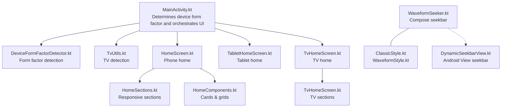
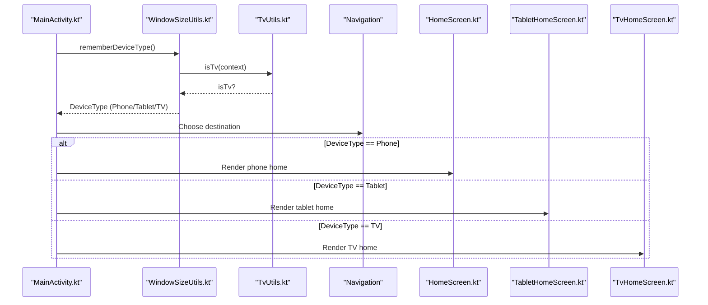
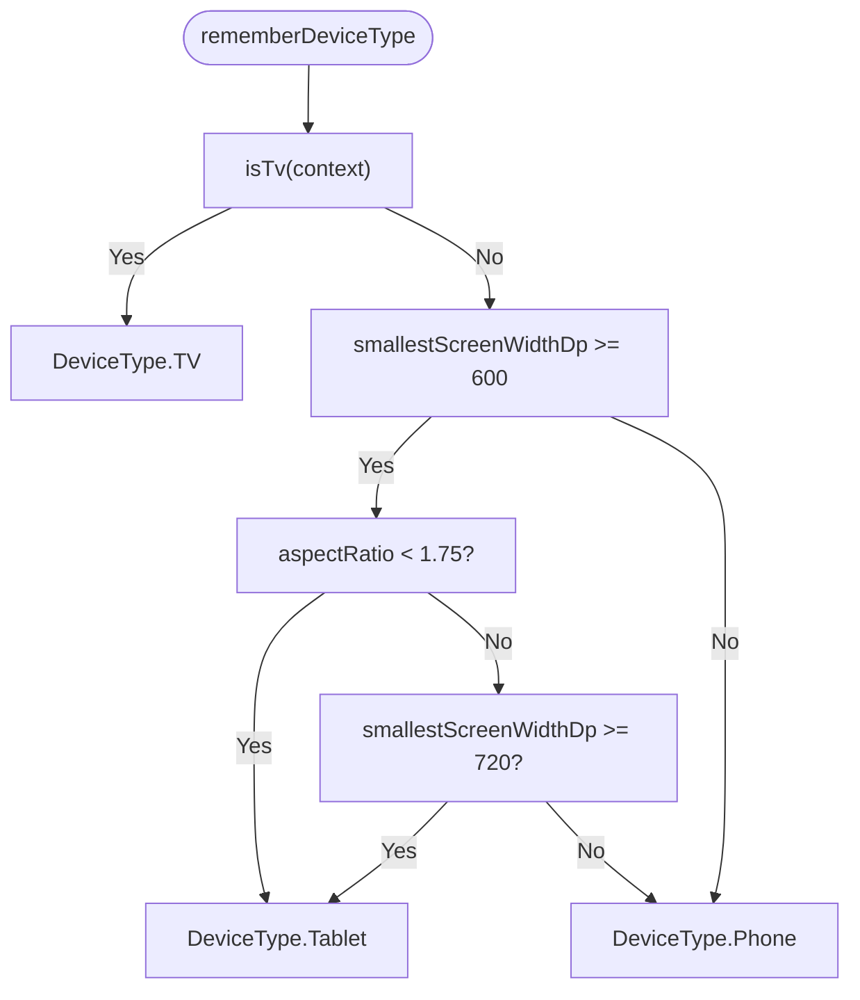
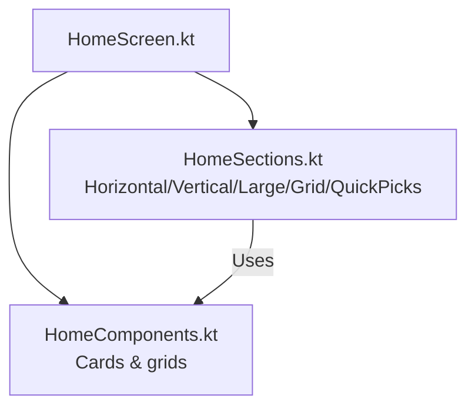
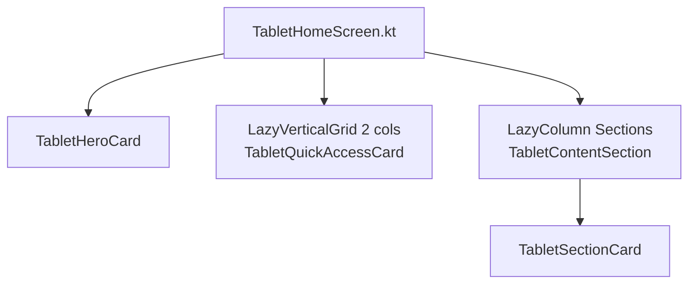
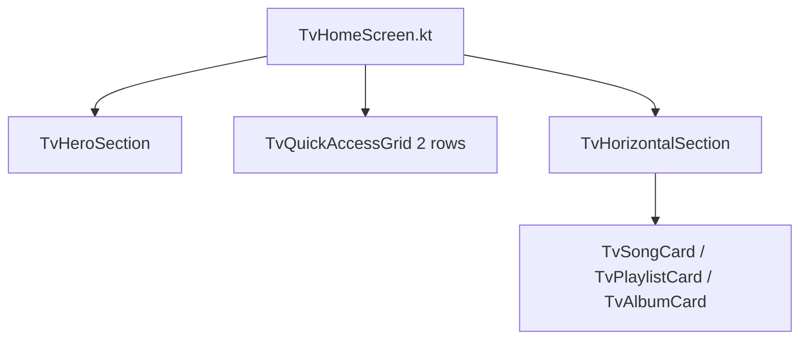
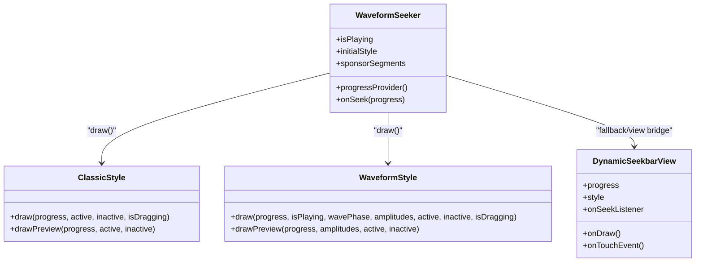
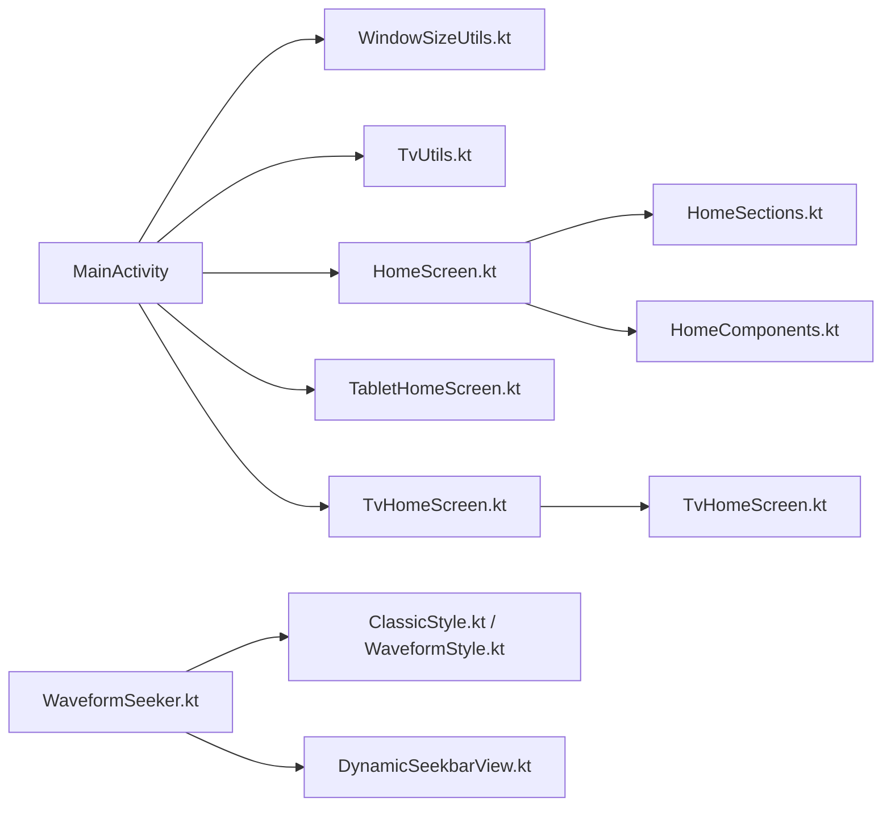

# Adaptive Layouts

<cite>
**Referenced Files in This Document**
- [WindowSizeUtils.kt](file://app/src/main/java/com/suvojeet/suvmusic/ui/utils/WindowSizeUtils.kt)
- [TvUtils.kt](file://app/src/main/java/com/suvojeet/suvmusic/util/TvUtils.kt)
- [HomeScreen.kt](file://app/src/main/java/com/suvojeet/suvmusic/ui/screens/HomeScreen.kt)
- [TabletHomeScreen.kt](file://app/src/main/java/com/suvojeet/suvmusic/ui/screens/TabletHomeScreen.kt)
- [TvHomeScreen.kt](file://app/src/main/java/com/suvojeet/suvmusic/ui/screens/TvHomeScreen.kt)
- [WaveformSeeker.kt](file://app/src/main/java/com/suvojeet/suvmusic/ui/components/WaveformSeeker.kt)
- [ClassicStyle.kt](file://app/src/main/java/com/suvojeet/suvmusic/ui/components/seekbar/ClassicStyle.kt)
- [WaveformStyle.kt](file://app/src/main/java/com/suvojeet/suvmusic/ui/components/seekbar/WaveformStyle.kt)
- [DynamicSeekbarView.kt](file://app/src/main/java/com/suvojeet/suvmusic/ui/views/DynamicSeekbarView.kt)
- [HomeComponents.kt](file://app/src/main/java/com/suvojeet/suvmusic/ui/components/HomeComponents.kt)
- [HomeSections.kt](file://app/src/main/java/com/suvojeet/suvmusic/ui/components/HomeSections.kt)
- [MainActivity.kt](file://app/src/main/java/com/suvojeet/suvmusic/MainActivity.kt)
</cite>

## Table of Contents
1. [Introduction](#introduction)
2. [Project Structure](#project-structure)
3. [Core Components](#core-components)
4. [Architecture Overview](#architecture-overview)
5. [Detailed Component Analysis](#detailed-component-analysis)
6. [Dependency Analysis](#dependency-analysis)
7. [Performance Considerations](#performance-considerations)
8. [Troubleshooting Guide](#troubleshooting-guide)
9. [Conclusion](#conclusion)

## Introduction
This document explains SuvMusic’s adaptive layout system that optimizes the user experience across phones, tablets, and TVs. It covers the window size classification system, responsive design patterns, device-specific UI adaptations, tablet home screen layout, TV home screen with gamepad support, and dynamic seekbar implementations. It also documents breakpoints, layout switching mechanisms, responsive component sizing, guidelines for adding new adaptive layouts, testing strategies, and performance considerations.

## Project Structure
SuvMusic organizes adaptive UI under the Compose UI layer with dedicated screens for each device family and shared utilities for device detection and responsive sizing. Key areas:
- Device detection and responsive utilities: DeviceFormFactorDetector.kt, DeviceFormFactorComposition.kt, TvUtils.kt
- Screens: HomeScreen.kt (phone/large phone), TabletHomeScreen.kt (tablet/foldable), TvHomeScreen.kt (TV)
- Seekbar: WaveformSeeker.kt (Compose) and DynamicSeekbarView.kt (Android View)
- Supporting components: HomeComponents.kt, HomeSections.kt
- Orchestrator: MainActivity.kt determines device form factor and switches UI accordingly



**Diagram sources**
- [MainActivity.kt:630-750](file://app/src/main/java/com/suvojeet/suvmusic/MainActivity.kt#L630-L750)
- [WindowSizeUtils.kt:44-112](file://app/src/main/java/com/suvojeet/suvmusic/ui/utils/WindowSizeUtils.kt#L44-L112)
- [TvUtils.kt:7-12](file://app/src/main/java/com/suvojeet/suvmusic/util/TvUtils.kt#L7-L12)
- [HomeScreen.kt:84-637](file://app/src/main/java/com/suvojeet/suvmusic/ui/screens/HomeScreen.kt#L84-L637)
- [TabletHomeScreen.kt:79-278](file://app/src/main/java/com/suvojeet/suvmusic/ui/screens/TabletHomeScreen.kt#L79-L278)
- [TvHomeScreen.kt:45-112](file://app/src/main/java/com/suvojeet/suvmusic/ui/screens/TvHomeScreen.kt#L45-L112)
- [HomeSections.kt:57-125](file://app/src/main/java/com/suvojeet/suvmusic/ui/components/HomeSections.kt#L57-L125)
- [HomeComponents.kt:38-247](file://app/src/main/java/com/suvojeet/suvmusic/ui/components/HomeComponents.kt#L38-L247)
- [WaveformSeeker.kt:96-481](file://app/src/main/java/com/suvojeet/suvmusic/ui/components/WaveformSeeker.kt#L96-L481)
- [ClassicStyle.kt:14-74](file://app/src/main/java/com/suvojeet/suvmusic/ui/components/seekbar/ClassicStyle.kt#L14-L74)
- [WaveformStyle.kt:15-143](file://app/src/main/java/com/suvojeet/suvmusic/ui/components/seekbar/WaveformStyle.kt#L15-L143)
- [DynamicSeekbarView.kt:21-212](file://app/src/main/java/com/suvojeet/suvmusic/ui/views/DynamicSeekbarView.kt#L21-L212)

**Section sources**
- [MainActivity.kt:630-750](file://app/src/main/java/com/suvojeet/suvmusic/MainActivity.kt#L630-L750)
- [WindowSizeUtils.kt:44-112](file://app/src/main/java/com/suvojeet/suvmusic/ui/utils/WindowSizeUtils.kt#L44-L112)
- [TvUtils.kt:7-12](file://app/src/main/java/com/suvojeet/suvmusic/util/TvUtils.kt#L7-L12)

## Core Components
- Window size classification and device type detection:
  - WindowSize categories: Compact (phone portrait), Medium (phone landscape/small tablet), Expanded (large tablet)
  - DeviceType: Phone, Tablet, TV
  - Detection combines smallest width, landscape flag, and TV mode check
- Responsive home sections:
  - Horizontal carousel, vertical list, large card + list, grid
  - Orientation-aware chunking and spacing
- Tablet home:
  - Two-column layout: spotlight + quick access grid (left), scrollable sections (right)
- TV home:
  - Hero spotlight, quick access grid, horizontal rows with D-pad focusables
- Seekbar:
  - Compose-based WaveformSeeker with multiple styles and touch/d-pad/gamepad interactions
  - Android View-based DynamicSeekbarView for legacy or specialized needs

**Section sources**
- [WindowSizeUtils.kt:44-112](file://app/src/main/java/com/suvojeet/suvmusic/ui/utils/WindowSizeUtils.kt#L44-L112)
- [HomeSections.kt:57-125](file://app/src/main/java/com/suvojeet/suvmusic/ui/components/HomeSections.kt#L57-L125)
- [TabletHomeScreen.kt:79-278](file://app/src/main/java/com/suvojeet/suvmusic/ui/screens/TabletHomeScreen.kt#L79-L278)
- [TvHomeScreen.kt:45-112](file://app/src/main/java/com/suvojeet/suvmusic/ui/screens/TvHomeScreen.kt#L45-L112)
- [WaveformSeeker.kt:96-481](file://app/src/main/java/com/suvojeet/suvmusic/ui/components/WaveformSeeker.kt#L96-L481)

## Architecture Overview
The adaptive system centers on a single activity that selects the appropriate screen and navigation based on device type. Device type is derived from window metrics and TV mode detection. Screens then apply responsive patterns and device-specific affordances.



**Diagram sources**
- [MainActivity.kt:630-750](file://app/src/main/java/com/suvojeet/suvmusic/MainActivity.kt#L630-L750)
- [WindowSizeUtils.kt:99-112](file://app/src/main/java/com/suvojeet/suvmusic/ui/utils/WindowSizeUtils.kt#L99-L112)
- [TvUtils.kt:8-11](file://app/src/main/java/com/suvojeet/suvmusic/util/TvUtils.kt#L8-L11)

## Detailed Component Analysis

### Window Size Classification and Device Type
- WindowSize categories:
  - Compact: screenWidthDp < 600
  - Medium: 600 ≤ screenWidthDp < 840
  - Expanded: ≥ 840
- DeviceType:
  - TV: detected via UiModeManager
  - Tablet: (smallestScreenWidthDp ≥ 600 AND aspectRatio < 1.75) OR smallestScreenWidthDp ≥ 720
  - Phone: otherwise

...


**Diagram sources**
- [WindowSizeUtils.kt:99-112](file://app/src/main/java/com/suvojeet/suvmusic/ui/utils/WindowSizeUtils.kt#L99-L112)
- [TvUtils.kt:8-11](file://app/src/main/java/com/suvojeet/suvmusic/util/TvUtils.kt#L8-L11)

**Section sources**
- [WindowSizeUtils.kt:44-112](file://app/src/main/java/com/suvojeet/suvmusic/ui/utils/WindowSizeUtils.kt#L44-L112)

### Phone Home Screen (HomeScreen.kt)
- Uses a single-column LazyColumn with multiple section types:
  - Horizontal carousels, vertical lists, large-card + list, grids
- Orientation-aware chunking:
  - GridSection and QuickPicksSection adjust chunk sizes based on landscape
- Responsive cards:
  - HomeComponents provides MediumSongCard, PlaylistDisplayCard, and HomeItemCard
- Pull-to-refresh, infinite scroll, and skeleton loaders for robust UX



**Diagram sources**
- [HomeScreen.kt:84-637](file://app/src/main/java/com/suvojeet/suvmusic/ui/screens/HomeScreen.kt#L84-L637)
- [HomeSections.kt:57-125](file://app/src/main/java/com/suvojeet/suvmusic/ui/components/HomeSections.kt#L57-L125)
- [HomeComponents.kt:38-247](file://app/src/main/java/com/suvojeet/suvmusic/ui/components/HomeComponents.kt#L38-L247)

**Section sources**
- [HomeScreen.kt:84-637](file://app/src/main/java/com/suvojeet/suvmusic/ui/screens/HomeScreen.kt#L84-L637)
- [HomeSections.kt:57-125](file://app/src/main/java/com/suvojeet/suvmusic/ui/components/HomeSections.kt#L57-L125)
- [HomeComponents.kt:38-247](file://app/src/main/java/com/suvojeet/suvmusic/ui/components/HomeComponents.kt#L38-L247)

### Tablet Home Screen (TabletHomeScreen.kt)
- Two-column layout:
  - Left: Hero spotlight card, quick access grid (2 columns), action buttons
  - Right: Scrollable LazyColumn of sections with wider cards
- TabletQuickAccessCard and TabletSectionCard define tablet-specific sizing and spacing
- TabletContentSection composes horizontal rows of section items



**Diagram sources**
- [TabletHomeScreen.kt:79-278](file://app/src/main/java/com/suvojeet/suvmusic/ui/screens/TabletHomeScreen.kt#L79-L278)
- [TabletHomeScreen.kt:284-522](file://app/src/main/java/com/suvojeet/suvmusic/ui/screens/TabletHomeScreen.kt#L284-L522)

**Section sources**
- [TabletHomeScreen.kt:79-278](file://app/src/main/java/com/suvojeet/suvmusic/ui/screens/TabletHomeScreen.kt#L79-L278)
- [TabletHomeScreen.kt:284-522](file://app/src/main/java/com/suvojeet/suvmusic/ui/screens/TabletHomeScreen.kt#L284-L522)

### TV Home Screen (TvHomeScreen.kt)
- Hero spotlight with large typography and gradient overlays
- Quick access grid (2 rows) optimized for desktop TV viewing
- Horizontal rows of cards with D-pad focusables
- TvSongCard, TvPlaylistCard, TvAlbumCard use squircle shapes and focused scaling/borders



**Diagram sources**
- [TvHomeScreen.kt:45-112](file://app/src/main/java/com/suvojeet/suvmusic/ui/screens/TvHomeScreen.kt#L45-L112)
- [TvHomeScreen.kt:115-448](file://app/src/main/java/com/suvojeet/suvmusic/ui/screens/TvHomeScreen.kt#L115-L448)

**Section sources**
- [TvHomeScreen.kt:45-112](file://app/src/main/java/com/suvojeet/suvmusic/ui/screens/TvHomeScreen.kt#L45-L112)
- [TvHomeScreen.kt:115-448](file://app/src/main/java/com/suvojeet/suvmusic/ui/screens/TvHomeScreen.kt#L115-L448)

### Dynamic Seekbar Implementation
- Compose-based WaveformSeeker:
  - Supports multiple styles: WAVEFORM, WAVE_LINE, CLASSIC, DOTS, GRADIENT_BAR, MATERIAL, M3E_WAVY
  - Touch, drag, long-press to change style, D-pad left/right seeking, tooltip during drag
  - Animated waveforms and M3E wavy indicator
- Android View-based DynamicSeekbarView:
  - Renders waveform, wave line, classic, dots, gradient bar styles
  - Touch-based seeking with progress callbacks



**Diagram sources**
- [WaveformSeeker.kt:96-481](file://app/src/main/java/com/suvojeet/suvmusic/ui/components/WaveformSeeker.kt#L96-L481)
- [ClassicStyle.kt:14-74](file://app/src/main/java/com/suvojeet/suvmusic/ui/components/seekbar/ClassicStyle.kt#L14-L74)
- [WaveformStyle.kt:15-143](file://app/src/main/java/com/suvojeet/suvmusic/ui/components/seekbar/WaveformStyle.kt#L15-L143)
- [DynamicSeekbarView.kt:21-212](file://app/src/main/java/com/suvojeet/suvmusic/ui/views/DynamicSeekbarView.kt#L21-L212)

**Section sources**
- [WaveformSeeker.kt:96-481](file://app/src/main/java/com/suvojeet/suvmusic/ui/components/WaveformSeeker.kt#L96-L481)
- [ClassicStyle.kt:14-74](file://app/src/main/java/com/suvojeet/suvmusic/ui/components/seekbar/ClassicStyle.kt#L14-L74)
- [WaveformStyle.kt:15-143](file://app/src/main/java/com/suvojeet/suvmusic/ui/components/seekbar/WaveformStyle.kt#L15-L143)
- [DynamicSeekbarView.kt:21-212](file://app/src/main/java/com/suvojeet/suvmusic/ui/views/DynamicSeekbarView.kt#L21-L212)

### Breakpoints and Layout Switching
- Window size thresholds:
  - Medium: ≥ 600dp width
  - Expanded: ≥ 840dp width
- Device type switching:
  - TV: UiMode TELEVISION
  - Tablet: smallestScreenWidthDp ≥ 600
  - Phone: default
- Navigation:
  - Phone: bottom navigation
  - Tablet/TV: side navigation rail

```mermaid
flowchart TD
A["screenWidthDp"] --> B{">= 840?"}
B --> |Yes| E["Expanded"]
B --> |No| C{">= 600?"}
C --> |Yes| F["Medium"]
C --> |No| G["Compact"]
H["smallestScreenWidthDp"] --> I{">= 600?"}
I --> |Yes| J{ "aspectRatio < 1.75?" }
J --> |Yes| Tablet["Tablet"]
J --> |No| K{ "smallestScreenWidthDp >= 720?" }
K --> |Yes| Tablet
K --> |No| Phone["Phone or TV"]
I --> |No| Phone
Phone --> L{"isTv?"}
L --> |Yes| M["TV"]
L --> |No| N["Phone"]
```

**Diagram sources**
- [WindowSizeUtils.kt:53-112](file://app/src/main/java/com/suvojeet/suvmusic/ui/utils/WindowSizeUtils.kt#L53-L112)
- [TvUtils.kt:8-11](file://app/src/main/java/com/suvojeet/suvmusic/util/TvUtils.kt#L8-L11)

**Section sources**
- [WindowSizeUtils.kt:53-112](file://app/src/main/java/com/suvojeet/suvmusic/ui/utils/WindowSizeUtils.kt#L53-L112)
- [TvUtils.kt:8-11](file://app/src/main/java/com/suvojeet/suvmusic/util/TvUtils.kt#L8-L11)

### Responsive Component Sizing
- Phones:
  - GridSection chunks items based on orientation (landscape vs portrait)
  - QuickPicksSection adjusts chunk count per orientation
- Tablets:
  - Fixed column widths and aspect ratios for cards
  - Two-column quick access grid
- TVs:
  - Larger card widths and typography scales
  - D-pad focusables with focused scaling and borders

**Section sources**
- [HomeSections.kt:296-343](file://app/src/main/java/com/suvojeet/suvmusic/ui/components/HomeSections.kt#L296-L343)
- [HomeSections.kt:411-527](file://app/src/main/java/com/suvojeet/suvmusic/ui/components/HomeSections.kt#L411-L527)
- [TabletHomeScreen.kt:188-207](file://app/src/main/java/com/suvojeet/suvmusic/ui/screens/TabletHomeScreen.kt#L188-L207)
- [TvHomeScreen.kt:236-306](file://app/src/main/java/com/suvojeet/suvmusic/ui/screens/TvHomeScreen.kt#L236-L306)

## Dependency Analysis
- MainActivity orchestrates device detection and navigation
- Screens depend on shared components for cards and sections
- Seekbar styles are modular and reusable across contexts



**Diagram sources**
- [MainActivity.kt:630-750](file://app/src/main/java/com/suvojeet/suvmusic/MainActivity.kt#L630-L750)
- [WindowSizeUtils.kt:44-112](file://app/src/main/java/com/suvojeet/suvmusic/ui/utils/WindowSizeUtils.kt#L44-L112)
- [TvUtils.kt:7-12](file://app/src/main/java/com/suvojeet/suvmusic/util/TvUtils.kt#L7-L12)
- [HomeScreen.kt:84-637](file://app/src/main/java/com/suvojeet/suvmusic/ui/screens/HomeScreen.kt#L84-L637)
- [TabletHomeScreen.kt:79-278](file://app/src/main/java/com/suvojeet/suvmusic/ui/screens/TabletHomeScreen.kt#L79-L278)
- [TvHomeScreen.kt:45-112](file://app/src/main/java/com/suvojeet/suvmusic/ui/screens/TvHomeScreen.kt#L45-L112)
- [HomeSections.kt:57-125](file://app/src/main/java/com/suvojeet/suvmusic/ui/components/HomeSections.kt#L57-L125)
- [HomeComponents.kt:38-247](file://app/src/main/java/com/suvojeet/suvmusic/ui/components/HomeComponents.kt#L38-L247)
- [WaveformSeeker.kt:96-481](file://app/src/main/java/com/suvojeet/suvmusic/ui/components/WaveformSeeker.kt#L96-L481)
- [ClassicStyle.kt:14-74](file://app/src/main/java/com/suvojeet/suvmusic/ui/components/seekbar/ClassicStyle.kt#L14-L74)
- [WaveformStyle.kt:15-143](file://app/src/main/java/com/suvojeet/suvmusic/ui/components/seekbar/WaveformStyle.kt#L15-L143)
- [DynamicSeekbarView.kt:21-212](file://app/src/main/java/com/suvojeet/suvmusic/ui/views/DynamicSeekbarView.kt#L21-L212)

**Section sources**
- [MainActivity.kt:630-750](file://app/src/main/java/com/suvojeet/suvmusic/MainActivity.kt#L630-L750)

## Performance Considerations
- Minimize recompositions:
  - Use remember for derived values (e.g., hero item, greeting)
  - Use distinctBy and chunked to avoid unnecessary work
- Efficient scrolling:
  - Lazy lists with proper keys and content types
  - Snap fling behavior for quick picks
- Image loading:
  - High-res thumbnails requested via ImageUtils
  - Crossfade and size hints to balance quality and memory
- Animations:
  - Conditional animations (only when playing or dragging)
  - Avoid heavy per-frame computations in Canvas draws
- TV navigation:
  - D-pad focusables avoid expensive layout passes
- Seekbar:
  - Style previews and tooltips computed on demand
  - Canvas drawing clipped and restored efficiently

[No sources needed since this section provides general guidance]

## Troubleshooting Guide
- Device type not recognized:
  - Verify smallestScreenWidthDp and screenWidthDp thresholds
  - Confirm TV mode detection via UiModeManager
- Layout not adapting:
  - Check orientation-dependent chunking logic
  - Ensure rememberDeviceType is used consistently
- TV navigation issues:
  - Confirm side navigation rail is rendered for Tablet/TV
  - Validate D-pad focusables and focused scaling
- Seekbar not interactive:
  - For Compose: ensure pointerInput handlers are attached
  - For View: verify onTouchEvent handles ACTION_DOWN/MOVE/UP
- Performance regressions:
  - Audit recomposition counts around rememberDeviceType
  - Review lazy list keys and content types

**Section sources**
- [WindowSizeUtils.kt:99-112](file://app/src/main/java/com/suvojeet/suvmusic/ui/utils/WindowSizeUtils.kt#L99-L112)
- [TvUtils.kt:8-11](file://app/src/main/java/com/suvojeet/suvmusic/util/TvUtils.kt#L8-L11)
- [WaveformSeeker.kt:246-275](file://app/src/main/java/com/suvojeet/suvmusic/ui/components/WaveformSeeker.kt#L246-L275)
- [DynamicSeekbarView.kt:196-210](file://app/src/main/java/com/suvojeet/suvmusic/ui/views/DynamicSeekbarView.kt#L196-L210)

## Conclusion
SuvMusic’s adaptive layout system cleanly separates device detection from UI composition. Window size classification and TV detection drive a unified navigation and screen selection strategy. Phone, tablet, and TV screens leverage shared components and responsive patterns to deliver optimized experiences. The seekbar stack offers flexible, performant controls across form factors, with both Compose and View implementations. Following the guidelines herein ensures consistent, maintainable adaptive UI.