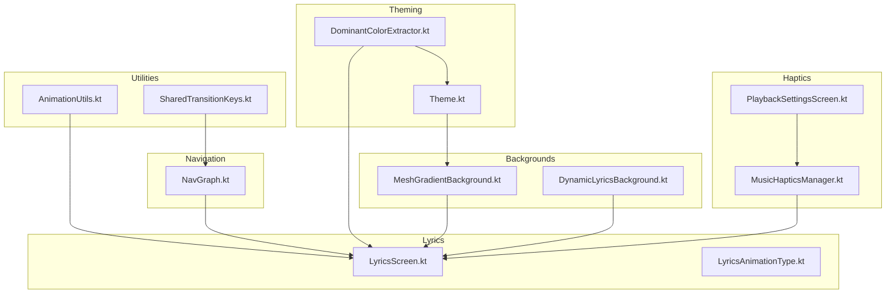
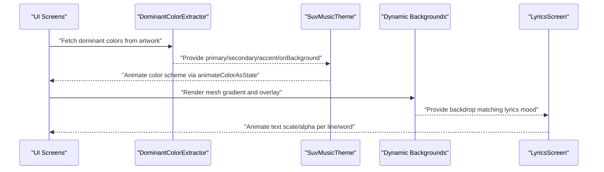
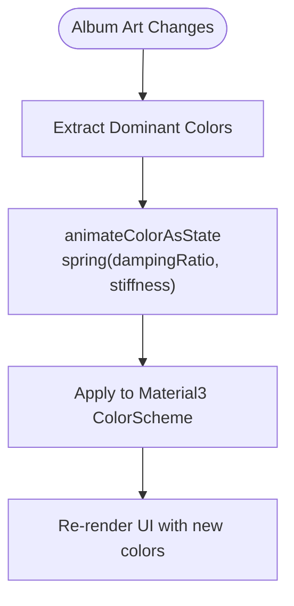
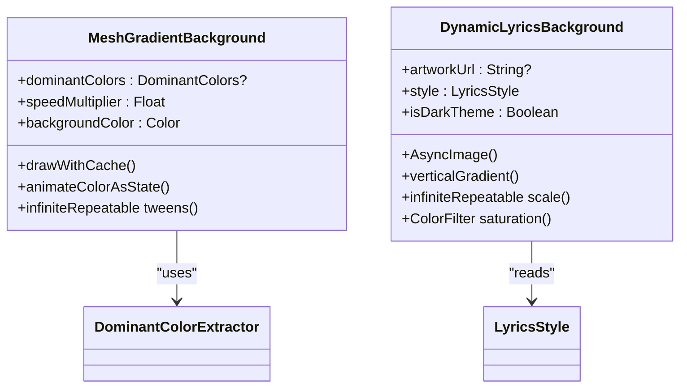
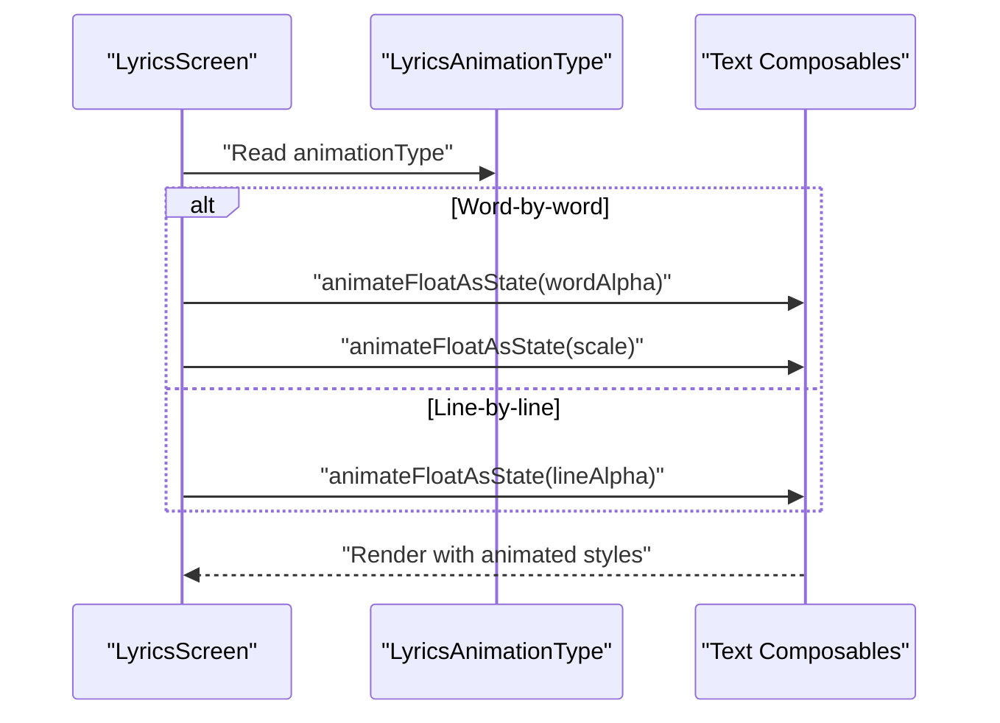
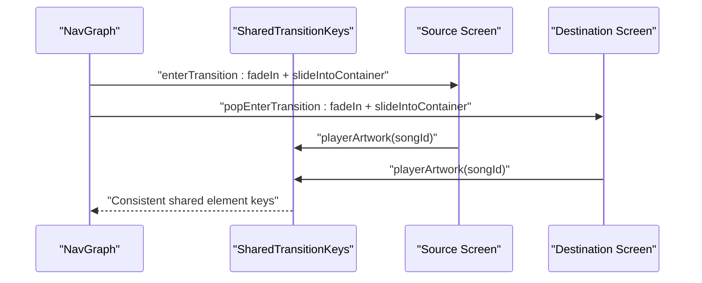
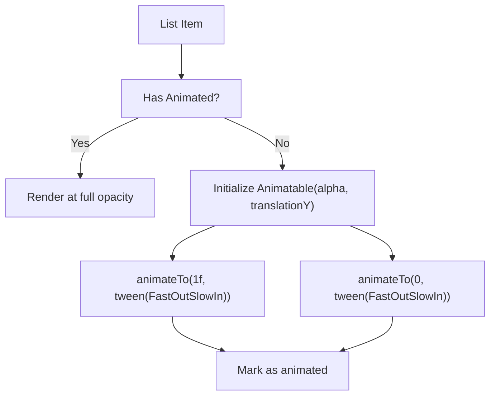
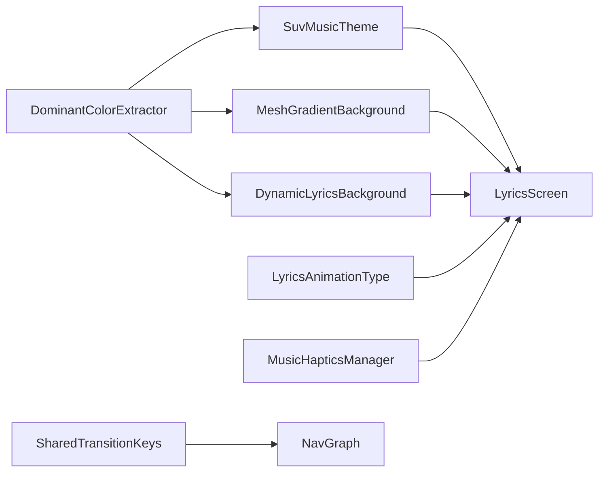

# Animation & Transitions

<cite>
**Referenced Files in This Document**
- [AnimationUtils.kt](file://app/src/main/java/com/suvojeet/suvmusic/ui/utils/AnimationUtils.kt)
- [SharedTransitionKeys.kt](file://app/src/main/java/com/suvojeet/suvmusic/ui/utils/SharedTransitionKeys.kt)
- [NavGraph.kt](file://app/src/main/java/com/suvojeet/suvmusic/navigation/NavGraph.kt)
- [Theme.kt](file://app/src/main/java/com/suvojeet/suvmusic/ui/theme/Theme.kt)
- [MeshGradientBackground.kt](file://app/src/main/java/com/suvojeet/suvmusic/ui/components/MeshGradientBackground.kt)
- [DynamicLyricsBackground.kt](file://app/src/main/java/com/suvojeet/suvmusic/ui/components/DynamicLyricsBackground.kt)
- [DominantColorExtractor.kt](file://app/src/main/java/com/suvojeet/suvmusic/ui/components/DominantColorExtractor.kt)
- [LyricsScreen.kt](file://app/src/main/java/com/suvojeet/suvmusic/ui/screens/LyricsScreen.kt)
- [LyricsAnimationType.kt](file://media-source/src/main/java/com/suvojeet/suvmusic/providers/lyrics/LyricsAnimationType.kt)
- [VolumeIndicator.kt](file://app/src/main/java/com/suvojeet/suvmusic/ui/screens/player/components/VolumeIndicator.kt)
- [MusicHapticsManager.kt](file://app/src/main/java/com/suvojeet/suvmusic/util/MusicHapticsManager.kt)
- [PlaybackSettingsScreen.kt](file://app/src/main/java/com/suvojeet/suvmusic/ui/screens/PlaybackSettingsScreen.kt)
</cite>

## Table of Contents
1. [Introduction](#introduction)
2. [Project Structure](#project-structure)
3. [Core Components](#core-components)
4. [Architecture Overview](#architecture-overview)
5. [Detailed Component Analysis](#detailed-component-analysis)
6. [Dependency Analysis](#dependency-analysis)
7. [Performance Considerations](#performance-considerations)
8. [Troubleshooting Guide](#troubleshooting-guide)
9. [Conclusion](#conclusion)

## Introduction
This document explains SuvMusic’s animation and transition system with a focus on:
- Expressive animations using Material3 Expressive API
- Smooth color transitions driven by album art
- Dynamic background animations for lyrics display
- Animation utilities, timing functions, and interpolation curves
- Page transitions, component enter/exit animations, and micro-interactions
- Performance optimization techniques, hardware acceleration, and debugging
- Accessibility considerations for motion sensitivity and animation preferences

## Project Structure
Key animation-related modules and files are organized by responsibility:
- Utilities: reusable modifiers and shared transition keys
- Navigation: page transitions and shared element transitions
- Theming: expressive color animations synchronized with album art
- Backgrounds: dynamic gradients and artwork-based visuals
- Lyrics: timed, word-level, and line-level animations
- Haptics: audio-reactive micro-interactions

**Diagram sources**
- [AnimationUtils.kt:1-81](file://app/src/main/java/com/suvojeet/suvmusic/ui/utils/AnimationUtils.kt#L1-L81)
- [SharedTransitionKeys.kt:1-29](file://app/src/main/java/com/suvojeet/suvmusic/ui/utils/SharedTransitionKeys.kt#L1-L29)
- [NavGraph.kt:106-140](file://app/src/main/java/com/suvojeet/suvmusic/navigation/NavGraph.kt#L106-L140)
- [Theme.kt:207-235](file://app/src/main/java/com/suvojeet/suvmusic/ui/theme/Theme.kt#L207-L235)
- [DominantColorExtractor.kt:1-182](file://app/src/main/java/com/suvojeet/suvmusic/ui/components/DominantColorExtractor.kt#L1-L182)
- [MeshGradientBackground.kt:1-178](file://app/src/main/java/com/suvojeet/suvmusic/ui/components/MeshGradientBackground.kt#L1-L178)
- [DynamicLyricsBackground.kt:1-106](file://app/src/main/java/com/suvojeet/suvmusic/ui/components/DynamicLyricsBackground.kt#L1-L106)
- [LyricsScreen.kt:945-1211](file://app/src/main/java/com/suvojeet/suvmusic/ui/screens/LyricsScreen.kt#L945-L1211)
- [LyricsAnimationType.kt:1-7](file://media-source/src/main/java/com/suvojeet/suvmusic/providers/lyrics/LyricsAnimationType.kt#L1-L7)
- [MusicHapticsManager.kt:153-188](file://app/src/main/java/com/suvojeet/suvmusic/util/MusicHapticsManager.kt#L153-L188)
- [PlaybackSettingsScreen.kt:732-788](file://app/src/main/java/com/suvojeet/suvmusic/ui/screens/PlaybackSettingsScreen.kt#L732-L788)

**Section sources**
- [AnimationUtils.kt:1-81](file://app/src/main/java/com/suvojeet/suvmusic/ui/utils/AnimationUtils.kt#L1-L81)
- [SharedTransitionKeys.kt:1-29](file://app/src/main/java/com/suvojeet/suvmusic/ui/utils/SharedTransitionKeys.kt#L1-L29)
- [NavGraph.kt:106-140](file://app/src/main/java/com/suvojeet/suvmusic/navigation/NavGraph.kt#L106-L140)
- [Theme.kt:207-235](file://app/src/main/java/com/suvojeet/suvmusic/ui/theme/Theme.kt#L207-L235)
- [MeshGradientBackground.kt:1-178](file://app/src/main/java/com/suvojeet/suvmusic/ui/components/MeshGradientBackground.kt#L1-L178)
- [DynamicLyricsBackground.kt:1-106](file://app/src/main/java/com/suvojeet/suvmusic/ui/components/DynamicLyricsBackground.kt#L1-L106)
- [DominantColorExtractor.kt:1-182](file://app/src/main/java/com/suvojeet/suvmusic/ui/components/DominantColorExtractor.kt#L1-L182)
- [LyricsScreen.kt:945-1211](file://app/src/main/java/com/suvojeet/suvmusic/ui/screens/LyricsScreen.kt#L945-L1211)
- [LyricsAnimationType.kt:1-7](file://media-source/src/main/java/com/suvojeet/suvmusic/providers/lyrics/LyricsAnimationType.kt#L1-L7)
- [MusicHapticsManager.kt:153-188](file://app/src/main/java/com/suvojeet/suvmusic/util/MusicHapticsManager.kt#L153-L188)
- [PlaybackSettingsScreen.kt:732-788](file://app/src/main/java/com/suvojeet/suvmusic/ui/screens/PlaybackSettingsScreen.kt#L732-L788)

## Core Components
- Expressive color transitions via Material3 Expressive API: animated color states for primary, secondary, accent, and on-background derived from album art.
- Dynamic background system: mesh-like animated gradients and artwork-based overlays for lyrics screens.
- Staggered list item entrance animations with fast-out-slow-in easing.
- Shared element transitions across screens using consistent keys.
- Page transitions with fade and slide combined with Material3 APIs.
- Micro-interactions: volume indicator animations and haptic feedback aligned to audio.

**Section sources**
- [Theme.kt:207-235](file://app/src/main/java/com/suvojeet/suvmusic/ui/theme/Theme.kt#L207-L235)
- [MeshGradientBackground.kt:27-178](file://app/src/main/java/com/suvojeet/suvmusic/ui/components/MeshGradientBackground.kt#L27-L178)
- [DynamicLyricsBackground.kt:23-106](file://app/src/main/java/com/suvojeet/suvmusic/ui/components/DynamicLyricsBackground.kt#L23-L106)
- [AnimationUtils.kt:26-81](file://app/src/main/java/com/suvojeet/suvmusic/ui/utils/AnimationUtils.kt#L26-L81)
- [SharedTransitionKeys.kt:8-28](file://app/src/main/java/com/suvojeet/suvmusic/ui/utils/SharedTransitionKeys.kt#L8-L28)
- [NavGraph.kt:106-140](file://app/src/main/java/com/suvojeet/suvmusic/navigation/NavGraph.kt#L106-L140)
- [VolumeIndicator.kt:96-127](file://app/src/main/java/com/suvojeet/suvmusic/ui/screens/player/components/VolumeIndicator.kt#L96-L127)
- [MusicHapticsManager.kt:153-188](file://app/src/main/java/com/suvojeet/suvmusic/util/MusicHapticsManager.kt#L153-L188)

## Architecture Overview
The animation pipeline integrates color extraction, theme application, and UI rendering:
- Album art drives dominant colors; these feed into expressive color animations.
- Dynamic backgrounds react to lyrics mood and artwork.
- Lyrics list updates text and word opacity based on playback time.
- Shared transitions connect related UI elements across navigations.

**Diagram sources**
- [DominantColorExtractor.kt:35-91](file://app/src/main/java/com/suvojeet/suvmusic/ui/components/DominantColorExtractor.kt#L35-L91)
- [Theme.kt:207-235](file://app/src/main/java/com/suvojeet/suvmusic/ui/theme/Theme.kt#L207-L235)
- [MeshGradientBackground.kt:27-178](file://app/src/main/java/com/suvojeet/suvmusic/ui/components/MeshGradientBackground.kt#L27-L178)
- [DynamicLyricsBackground.kt:23-106](file://app/src/main/java/com/suvojeet/suvmusic/ui/components/DynamicLyricsBackground.kt#L23-L106)
- [LyricsScreen.kt:945-1211](file://app/src/main/java/com/suvojeet/suvmusic/ui/screens/LyricsScreen.kt#L945-L1211)

## Detailed Component Analysis

### Expressive Color Transitions (Material3 Expressive)
- Uses animateColorAsState with spring specs tuned for bouncy, fast transitions.
- Applied at the theme level and per-screen to reflect album art changes smoothly.

**Diagram sources**
- [Theme.kt:207-235](file://app/src/main/java/com/suvojeet/suvmusic/ui/theme/Theme.kt#L207-L235)
- [DominantColorExtractor.kt:35-91](file://app/src/main/java/com/suvojeet/suvmusic/ui/components/DominantColorExtractor.kt#L35-L91)

**Section sources**
- [Theme.kt:207-235](file://app/src/main/java/com/suvojeet/suvmusic/ui/theme/Theme.kt#L207-L235)
- [DominantColorExtractor.kt:35-91](file://app/src/main/java/com/suvojeet/suvmusic/ui/components/DominantColorExtractor.kt#L35-L91)

### Dynamic Backgrounds for Lyrics
- MeshGradientBackground: animated radial blobs with hardware-accelerated drawing.
- DynamicLyricsBackground: artwork scaling, blur, saturation, and gradient overlays based on lyrics mood.

**Diagram sources**
- [MeshGradientBackground.kt:27-178](file://app/src/main/java/com/suvojeet/suvmusic/ui/components/MeshGradientBackground.kt#L27-L178)
- [DynamicLyricsBackground.kt:23-106](file://app/src/main/java/com/suvojeet/suvmusic/ui/components/DynamicLyricsBackground.kt#L23-L106)
- [DominantColorExtractor.kt:35-91](file://app/src/main/java/com/suvojeet/suvmusic/ui/components/DominantColorExtractor.kt#L35-L91)

**Section sources**
- [MeshGradientBackground.kt:27-178](file://app/src/main/java/com/suvojeet/suvmusic/ui/components/MeshGradientBackground.kt#L27-L178)
- [DynamicLyricsBackground.kt:23-106](file://app/src/main/java/com/suvojeet/suvmusic/ui/components/DynamicLyricsBackground.kt#L23-L106)
- [DominantColorExtractor.kt:35-91](file://app/src/main/java/com/suvojeet/suvmusic/ui/components/DominantColorExtractor.kt#L35-L91)

### Lyrics Animations (Line/Word-Level)
- Supports two animation modes: line-by-line and word-by-word.
- Uses animateFloatAsState for scale and alpha with spring easing.
- Integrates haptics and clickable seek behavior for synced lyrics.

**Diagram sources**
- [LyricsScreen.kt:945-1211](file://app/src/main/java/com/suvojeet/suvmusic/ui/screens/LyricsScreen.kt#L945-L1211)
- [LyricsAnimationType.kt:3-6](file://media-source/src/main/java/com/suvojeet/suvmusic/providers/lyrics/LyricsAnimationType.kt#L3-L6)

**Section sources**
- [LyricsScreen.kt:945-1211](file://app/src/main/java/com/suvojeet/suvmusic/ui/screens/LyricsScreen.kt#L945-L1211)
- [LyricsAnimationType.kt:3-6](file://media-source/src/main/java/com/suvojeet/suvmusic/providers/lyrics/LyricsAnimationType.kt#L3-L6)

### Page Transitions and Shared Elements
- NavHost defines enter/exit/pop transitions combining fade and slide.
- SharedTransitionKeys provide consistent keys for shared element animations across destinations.

**Diagram sources**
- [NavGraph.kt:106-140](file://app/src/main/java/com/suvojeet/suvmusic/navigation/NavGraph.kt#L106-L140)
- [SharedTransitionKeys.kt:8-28](file://app/src/main/java/com/suvojeet/suvmusic/ui/utils/SharedTransitionKeys.kt#L8-L28)

**Section sources**
- [NavGraph.kt:106-140](file://app/src/main/java/com/suvojeet/suvmusic/navigation/NavGraph.kt#L106-L140)
- [SharedTransitionKeys.kt:8-28](file://app/src/main/java/com/suvojeet/suvmusic/ui/utils/SharedTransitionKeys.kt#L8-L28)

### Component Enter/Exit Animations and Micro-Interactions
- Staggered list item entrance using Animatable and tween with fast-out-slow-in easing.
- Volume indicator uses combined fade/slide/scale enter/exit transitions with spring specs.
- Haptic feedback reacts to amplitude with configurable modes and intensities.

**Diagram sources**
- [AnimationUtils.kt:26-81](file://app/src/main/java/com/suvojeet/suvmusic/ui/utils/AnimationUtils.kt#L26-L81)
- [VolumeIndicator.kt:96-127](file://app/src/main/java/com/suvojeet/suvmusic/ui/screens/player/components/VolumeIndicator.kt#L96-L127)
- [MusicHapticsManager.kt:153-188](file://app/src/main/java/com/suvojeet/suvmusic/util/MusicHapticsManager.kt#L153-L188)

**Section sources**
- [AnimationUtils.kt:26-81](file://app/src/main/java/com/suvojeet/suvmusic/ui/utils/AnimationUtils.kt#L26-L81)
- [VolumeIndicator.kt:96-127](file://app/src/main/java/com/suvojeet/suvmusic/ui/screens/player/components/VolumeIndicator.kt#L96-L127)
- [MusicHapticsManager.kt:153-188](file://app/src/main/java/com/suvojeet/suvmusic/util/MusicHapticsManager.kt#L153-L188)
- [PlaybackSettingsScreen.kt:732-788](file://app/src/main/java/com/suvojeet/suvmusic/ui/screens/PlaybackSettingsScreen.kt#L732-L788)

## Dependency Analysis
- Theming depends on dominant color extraction to drive expressive color animations.
- Background components depend on dominant colors and lyrics mood.
- Lyrics screen depends on animation types and haptics manager.
- Navigation relies on shared transition keys for seamless cross-screen animations.

**Diagram sources**
- [DominantColorExtractor.kt:35-91](file://app/src/main/java/com/suvojeet/suvmusic/ui/components/DominantColorExtractor.kt#L35-L91)
- [Theme.kt:207-235](file://app/src/main/java/com/suvojeet/suvmusic/ui/theme/Theme.kt#L207-L235)
- [MeshGradientBackground.kt:27-178](file://app/src/main/java/com/suvojeet/suvmusic/ui/components/MeshGradientBackground.kt#L27-L178)
- [DynamicLyricsBackground.kt:23-106](file://app/src/main/java/com/suvojeet/suvmusic/ui/components/DynamicLyricsBackground.kt#L23-L106)
- [LyricsScreen.kt:945-1211](file://app/src/main/java/com/suvojeet/suvmusic/ui/screens/LyricsScreen.kt#L945-L1211)
- [LyricsAnimationType.kt:3-6](file://media-source/src/main/java/com/suvojeet/suvmusic/providers/lyrics/LyricsAnimationType.kt#L3-L6)
- [MusicHapticsManager.kt:153-188](file://app/src/main/java/com/suvojeet/suvmusic/util/MusicHapticsManager.kt#L153-L188)
- [SharedTransitionKeys.kt:8-28](file://app/src/main/java/com/suvojeet/suvmusic/ui/utils/SharedTransitionKeys.kt#L8-L28)
- [NavGraph.kt:106-140](file://app/src/main/java/com/suvojeet/suvmusic/navigation/NavGraph.kt#L106-L140)

**Section sources**
- [Theme.kt:207-235](file://app/src/main/java/com/suvojeet/suvmusic/ui/theme/Theme.kt#L207-L235)
- [MeshGradientBackground.kt:27-178](file://app/src/main/java/com/suvojeet/suvmusic/ui/components/MeshGradientBackground.kt#L27-L178)
- [DynamicLyricsBackground.kt:23-106](file://app/src/main/java/com/suvojeet/suvmusic/ui/components/DynamicLyricsBackground.kt#L23-L106)
- [LyricsScreen.kt:945-1211](file://app/src/main/java/com/suvojeet/suvmusic/ui/screens/LyricsScreen.kt#L945-L1211)
- [LyricsAnimationType.kt:3-6](file://media-source/src/main/java/com/suvojeet/suvmusic/providers/lyrics/LyricsAnimationType.kt#L3-L6)
- [MusicHapticsManager.kt:153-188](file://app/src/main/java/com/suvojeet/suvmusic/util/MusicHapticsManager.kt#L153-L188)
- [SharedTransitionKeys.kt:8-28](file://app/src/main/java/com/suvojeet/suvmusic/ui/utils/SharedTransitionKeys.kt#L8-L28)
- [NavGraph.kt:106-140](file://app/src/main/java/com/suvojeet/suvmusic/navigation/NavGraph.kt#L106-L140)

## Performance Considerations
- Hardware acceleration
  - Canvas drawing uses graphicsLayer and drawWithCache to leverage GPU acceleration.
  - MeshGradientBackground applies graphicsLayer to improve rendering throughput.
- Efficient recomposition
  - animateColorAsState and animateFloatAsState minimize recomposition by animating values rather than rebuilding layouts.
  - rememberInfiniteTransition is scoped to avoid unnecessary work when not visible.
- Rendering optimizations
  - MeshGradientBackground draws directly to the canvas with precomputed animated values.
  - DynamicLyricsBackground uses blur and alpha judiciously; blur intensity is mood-dependent.
- List performance
  - AnimationUtils caches animation completion per item to avoid repeated animations on scroll reuse.
  - Stagger delays are capped to prevent long queues for distant items.
- Timing and easing
  - FastOutSlowInEasing for natural-feeling entrances.
  - Spring specs tuned for low bounciness and medium-low stiffness for expressive yet controlled transitions.
- Haptics efficiency
  - Haptic triggers are throttled by time and amplitude thresholds to reduce vibration frequency.

**Section sources**
- [MeshGradientBackground.kt:106-178](file://app/src/main/java/com/suvojeet/suvmusic/ui/components/MeshGradientBackground.kt#L106-L178)
- [AnimationUtils.kt:26-81](file://app/src/main/java/com/suvojeet/suvmusic/ui/utils/AnimationUtils.kt#L26-L81)
- [DynamicLyricsBackground.kt:35-63](file://app/src/main/java/com/suvojeet/suvmusic/ui/components/DynamicLyricsBackground.kt#L35-L63)
- [MusicHapticsManager.kt:153-188](file://app/src/main/java/com/suvojeet/suvmusic/util/MusicHapticsManager.kt#L153-L188)

## Troubleshooting Guide
- Colors not updating on song change
  - Verify dominant color extraction completes and animateColorAsState receives new targets.
  - Confirm theme passes albumArtColors to SuvMusicTheme.
- Lyrics animations not syncing
  - Ensure currentTimeProvider returns monotonic time and animationType matches provider expectations.
  - Check that animateFloatAsState is invoked with appropriate spring specs.
- Shared element transition mismatch
  - Ensure SharedTransitionKeys.playerArtwork(songId) is used consistently across source and destination.
- Excessive jank during list scrolling
  - Confirm AnimationUtils caches animation completion and uses capped stagger delays.
- Haptics not triggering
  - Validate haptics mode selection and intensity settings; confirm permissions and device support.

**Section sources**
- [Theme.kt:207-235](file://app/src/main/java/com/suvojeet/suvmusic/ui/theme/Theme.kt#L207-L235)
- [DominantColorExtractor.kt:35-91](file://app/src/main/java/com/suvojeet/suvmusic/ui/components/DominantColorExtractor.kt#L35-L91)
- [LyricsScreen.kt:945-1211](file://app/src/main/java/com/suvojeet/suvmusic/ui/screens/LyricsScreen.kt#L945-L1211)
- [SharedTransitionKeys.kt:8-28](file://app/src/main/java/com/suvojeet/suvmusic/ui/utils/SharedTransitionKeys.kt#L8-L28)
- [AnimationUtils.kt:26-81](file://app/src/main/java/com/suvojeet/suvmusic/ui/utils/AnimationUtils.kt#L26-L81)
- [PlaybackSettingsScreen.kt:732-788](file://app/src/main/java/com/suvojeet/suvmusic/ui/screens/PlaybackSettingsScreen.kt#L732-L788)

## Conclusion
SuvMusic’s animation system blends Material3 Expressive theming, dynamic backgrounds, and precise lyrics-driven animations to deliver a cohesive, immersive experience. By leveraging hardware-accelerated drawing, efficient recomposition, and thoughtful easing, the app balances visual richness with performance. Shared transitions and micro-interactions further enhance continuity and user feedback, while haptics add tactile responsiveness. Accessibility is supported through configurable haptics and careful animation design.