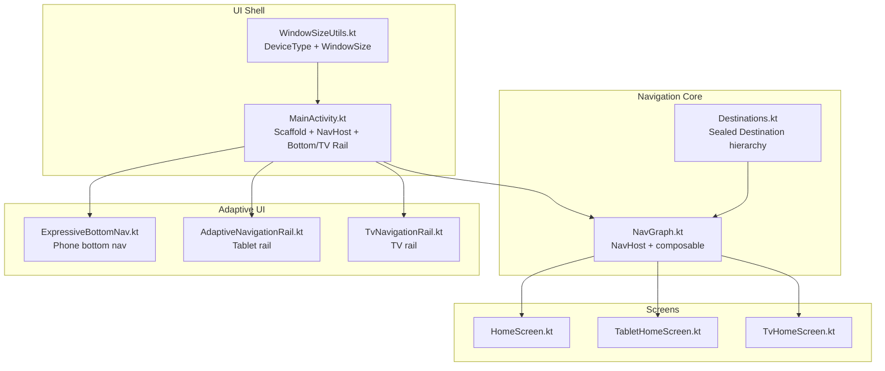
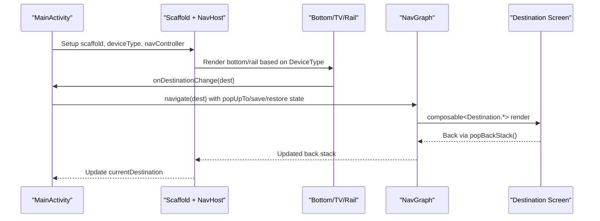
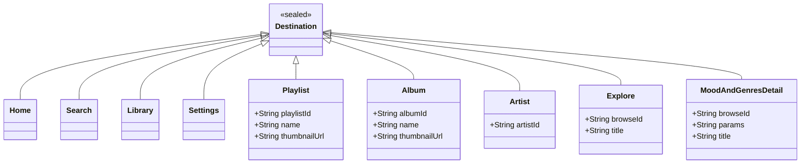
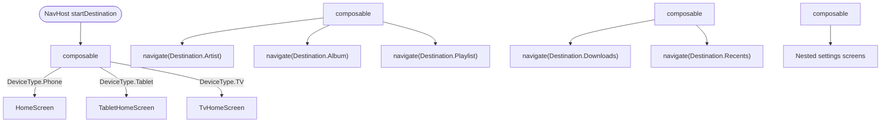
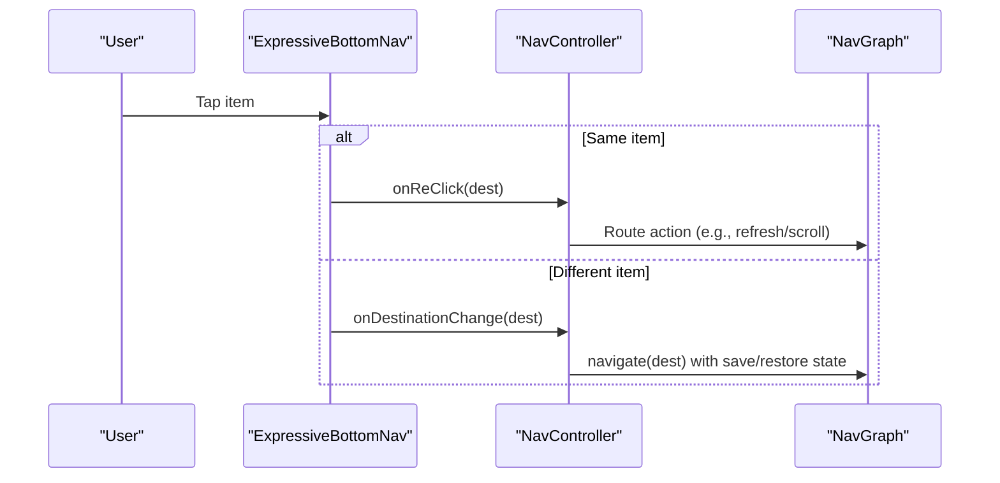
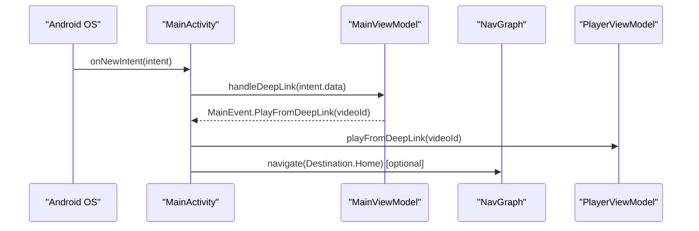
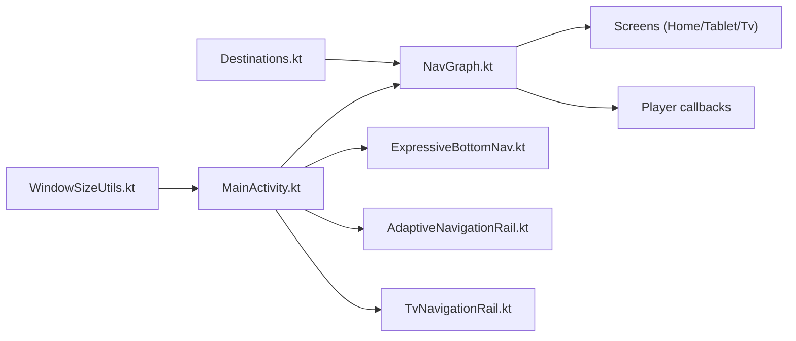

# Navigation System

<cite>
**Referenced Files in This Document**
- [Destinations.kt](file://app/src/main/java/com/suvojeet/suvmusic/navigation/Destinations.kt)
- [NavGraph.kt](file://app/src/main/java/com/suvojeet/suvmusic/navigation/NavGraph.kt)
- [ExpressiveBottomNav.kt](file://app/src/main/java/com/suvojeet/suvmusic/ui/components/ExpressiveBottomNav.kt)
- [AdaptiveNavigationRail.kt](file://app/src/main/java/com/suvojeet/suvmusic/ui/components/AdaptiveNavigationRail.kt)
- [TvNavigationRail.kt](file://app/src/main/java/com/suvojeet/suvmusic/ui/components/TvNavigationRail.kt)
- [MainActivity.kt](file://app/src/main/java/com/suvojeet/suvmusic/MainActivity.kt)
- [WindowSizeUtils.kt](file://app/src/main/java/com/suvojeet/suvmusic/ui/utils/WindowSizeUtils.kt)
- [HomeScreen.kt](file://app/src/main/java/com/suvojeet/suvmusic/ui/screens/HomeScreen.kt)
- [TabletHomeScreen.kt](file://app/src/main/java/com/suvojeet/suvmusic/ui/screens/TabletHomeScreen.kt)
- [TvHomeScreen.kt](file://app/src/main/java/com/suvojeet/suvmusic/ui/screens/TvHomeScreen.kt)
- [MainViewModel.kt](file://app/src/main/java/com/suvojeet/suvmusic/ui/viewmodel/MainViewModel.kt)
- [AndroidManifest.xml](file://app/src/main/AndroidManifest.xml)
</cite>

## Table of Contents
1. [Introduction](#introduction)
2. [Project Structure](#project-structure)
3. [Core Components](#core-components)
4. [Architecture Overview](#architecture-overview)
5. [Detailed Component Analysis](#detailed-component-analysis)
6. [Dependency Analysis](#dependency-analysis)
7. [Performance Considerations](#performance-considerations)
8. [Troubleshooting Guide](#troubleshooting-guide)
9. [Conclusion](#conclusion)

## Introduction
This document explains SuvMusic’s destination-based navigation architecture built with Jetpack Compose Navigation. It covers:
- Destination definitions and typed routing
- Bottom navigation with expressive animations
- Adaptive navigation rail for tablets and TV
- Navigation graph structure, transitions, and state management
- Device-specific navigation patterns and gestures
- Accessibility features for TV
- Deep linking support and navigation event handling
- Performance and memory optimization strategies for complex hierarchies

## Project Structure
The navigation system is organized around a sealed destination hierarchy and a single NavHost graph. Device-specific layouts are rendered conditionally based on runtime device type.

**Diagram sources**
- [Destinations.kt:1-140](file://app/src/main/java/com/suvojeet/suvmusic/navigation/Destinations.kt#L1-L140)
- [NavGraph.kt:1-692](file://app/src/main/java/com/suvojeet/suvmusic/navigation/NavGraph.kt#L1-L692)
- [MainActivity.kt:341-1038](file://app/src/main/java/com/suvojeet/suvmusic/MainActivity.kt#L341-L1038)
- [WindowSizeUtils.kt:86-112](file://app/src/main/java/com/suvojeet/suvmusic/ui/utils/WindowSizeUtils.kt#L86-L112)
- [ExpressiveBottomNav.kt:74-111](file://app/src/main/java/com/suvojeet/suvmusic/ui/components/ExpressiveBottomNav.kt#L74-L111)
- [AdaptiveNavigationRail.kt:51-137](file://app/src/main/java/com/suvojeet/suvmusic/ui/components/AdaptiveNavigationRail.kt#L51-L137)
- [TvNavigationRail.kt:53-92](file://app/src/main/java/com/suvojeet/suvmusic/ui/components/TvNavigationRail.kt#L53-L92)
- [HomeScreen.kt:85-200](file://app/src/main/java/com/suvojeet/suvmusic/ui/screens/HomeScreen.kt#L85-L200)
- [TabletHomeScreen.kt:81-200](file://app/src/main/java/com/suvojeet/suvmusic/ui/screens/TabletHomeScreen.kt#L81-L200)
- [TvHomeScreen.kt:46-112](file://app/src/main/java/com/suvojeet/suvmusic/ui/screens/TvHomeScreen.kt#L46-L112)

**Section sources**
- [MainActivity.kt:341-1038](file://app/src/main/java/com/suvojeet/suvmusic/MainActivity.kt#L341-L1038)
- [WindowSizeUtils.kt:86-112](file://app/src/main/java/com/suvojeet/suvmusic/ui/utils/WindowSizeUtils.kt#L86-L112)

## Core Components
- Destination: A sealed, serializable hierarchy defining all navigable routes, including typed arguments for playlists, albums, artists, and mood/genre details.
- NavGraph: Central NavHost with destination-specific composable blocks, device-aware rendering, and parameterized callbacks for player actions.
- Adaptive UI:
  - ExpressiveBottomNav: Phone bottom navigation with liquid glass and spring animations.
  - AdaptiveNavigationRail: Tablet-side navigation with expressive indicators and labels.
  - TvNavigationRail: TV-optimized vertical rail with D-pad focus enhancements.

**Section sources**
- [Destinations.kt:8-140](file://app/src/main/java/com/suvojeet/suvmusic/navigation/Destinations.kt#L8-L140)
- [NavGraph.kt:109-692](file://app/src/main/java/com/suvojeet/suvmusic/navigation/NavGraph.kt#L109-L692)
- [ExpressiveBottomNav.kt:74-469](file://app/src/main/java/com/suvojeet/suvmusic/ui/components/ExpressiveBottomNav.kt#L74-L469)
- [AdaptiveNavigationRail.kt:51-145](file://app/src/main/java/com/suvojeet/suvmusic/ui/components/AdaptiveNavigationRail.kt#L51-L145)
- [TvNavigationRail.kt:53-139](file://app/src/main/java/com/suvojeet/suvmusic/ui/components/TvNavigationRail.kt#L53-L139)

## Architecture Overview
The navigation architecture follows a destination-first pattern with typed routes and device-aware rendering. The MainActivity orchestrates the shell, device type detection, and passes callbacks to the NavGraph and screens.

**Diagram sources**
- [MainActivity.kt:560-753](file://app/src/main/java/com/suvojeet/suvmusic/MainActivity.kt#L560-L753)
- [NavGraph.kt:109-131](file://app/src/main/java/com/suvojeet/suvmusic/navigation/NavGraph.kt#L109-L131)
- [ExpressiveBottomNav.kt:682-710](file://app/src/main/java/com/suvojeet/suvmusic/ui/components/ExpressiveBottomNav.kt#L682-L710)
- [AdaptiveNavigationRail.kt:105-134](file://app/src/main/java/com/suvojeet/suvmusic/ui/components/AdaptiveNavigationRail.kt#L105-L134)
- [TvNavigationRail.kt:82-86](file://app/src/main/java/com/suvojeet/suvmusic/ui/components/TvNavigationRail.kt#L82-L86)

## Detailed Component Analysis

### Destination-Based Routing
- Typed destinations encapsulate route parameters (e.g., playlist, album, artist, mood/genre).
- Serialization enables safe, compile-time route matching and argument extraction.
- Parameter companions define constant keys for robust argument handling.

**Diagram sources**
- [Destinations.kt:8-140](file://app/src/main/java/com/suvojeet/suvmusic/navigation/Destinations.kt#L8-L140)

**Section sources**
- [Destinations.kt:8-140](file://app/src/main/java/com/suvojeet/suvmusic/navigation/Destinations.kt#L8-L140)

### Navigation Graph and Transitions
- NavHost defines enter/exit/pop transitions for animated content.
- Device-aware Home renders different screens depending on DeviceType.
- Each destination composable handles navigation to nested destinations and invokes callbacks for player actions.

**Diagram sources**
- [NavGraph.kt:109-692](file://app/src/main/java/com/suvojeet/suvmusic/navigation/NavGraph.kt#L109-L692)
- [HomeScreen.kt:85-200](file://app/src/main/java/com/suvojeet/suvmusic/ui/screens/HomeScreen.kt#L85-L200)
- [TabletHomeScreen.kt:81-200](file://app/src/main/java/com/suvojeet/suvmusic/ui/screens/TabletHomeScreen.kt#L81-L200)
- [TvHomeScreen.kt:46-112](file://app/src/main/java/com/suvojeet/suvmusic/ui/screens/TvHomeScreen.kt#L46-L112)

**Section sources**
- [NavGraph.kt:109-692](file://app/src/main/java/com/suvojeet/suvmusic/navigation/NavGraph.kt#L109-L692)

### Expressive Bottom Navigation (Phone)
- Two variants: liquid glass and standard.
- Spring animations for selected indicator and item scaling.
- Re-click handling supports double-tap to refresh or scroll-to-top.

**Diagram sources**
- [ExpressiveBottomNav.kt:74-111](file://app/src/main/java/com/suvojeet/suvmusic/ui/components/ExpressiveBottomNav.kt#L74-L111)
- [ExpressiveBottomNav.kt:682-710](file://app/src/main/java/com/suvojeet/suvmusic/ui/components/ExpressiveBottomNav.kt#L682-L710)
- [MainActivity.kt:682-710](file://app/src/main/java/com/suvojeet/suvmusic/MainActivity.kt#L682-L710)

**Section sources**
- [ExpressiveBottomNav.kt:74-469](file://app/src/main/java/com/suvojeet/suvmusic/ui/components/ExpressiveBottomNav.kt#L74-L469)
- [MainActivity.kt:682-710](file://app/src/main/java/com/suvojeet/suvmusic/MainActivity.kt#L682-L710)

### Adaptive Navigation Rail (Tablet)
- Vertical rail with labeled items and expressive selection scaling.
- Uses Material 3 NavigationRail with custom indicator and colors.

**Section sources**
- [AdaptiveNavigationRail.kt:51-145](file://app/src/main/java/com/suvojeet/suvmusic/ui/components/AdaptiveNavigationRail.kt#L51-L145)
- [MainActivity.kt:738-750](file://app/src/main/java/com/suvojeet/suvmusic/MainActivity.kt#L738-L750)

### TV Navigation Rail
- Vertical rail optimized for remote control navigation.
- D-pad focus handling with scale, border, and background highlights.

**Section sources**
- [TvNavigationRail.kt:53-139](file://app/src/main/java/com/suvojeet/suvmusic/ui/components/TvNavigationRail.kt#L53-L139)
- [MainActivity.kt:724-735](file://app/src/main/java/com/suvojeet/suvmusic/MainActivity.kt#L724-L735)

### Device-Specific Navigation Patterns
- DeviceType detection combines TV checks, smallest width, and screen width thresholds.
- Bottom navigation shown on phones; rails on tablets/TVs.
- Home destination renders distinct screens per device.

**Section sources**
- [WindowSizeUtils.kt:86-112](file://app/src/main/java/com/suvojeet/suvmusic/ui/utils/WindowSizeUtils.kt#L86-L112)
- [MainActivity.kt:631-753](file://app/src/main/java/com/suvojeet/suvmusic/MainActivity.kt#L631-L753)
- [NavGraph.kt:132-234](file://app/src/main/java/com/suvojeet/suvmusic/navigation/NavGraph.kt#L132-L234)

### Gesture-Based Navigation
- Player screens support swipe gestures for seeking and volume control.
- TV screens use D-pad focus modifiers for enhanced accessibility.

**Section sources**
- [FullScreenVideoPlayer.kt:290-422](file://app/src/main/java/com/suvojeet/suvmusic/ui/screens/player/FullScreenVideoPlayer.kt#L290-L422)
- [TvNavigationRail.kt:94-131](file://app/src/main/java/com/suvojeet/suvmusic/ui/components/TvNavigationRail.kt#L94-L131)
- [FocusExtensions.kt:27-71](file://app/src/main/java/com/suvojeet/suvmusic/util/FocusExtensions.kt#L27-L71)

### Accessibility Features
- TV rail items are focusable with visual feedback and optional click handlers.
- D-pad focus modifier provides scalable focus rings and borders.
- Content descriptions are applied to icons for screen readers.

**Section sources**
- [TvNavigationRail.kt:94-131](file://app/src/main/java/com/suvojeet/suvmusic/ui/components/TvNavigationRail.kt#L94-L131)
- [FocusExtensions.kt:27-71](file://app/src/main/java/com/suvojeet/suvmusic/util/FocusExtensions.kt#L27-L71)

### Deep Linking and Navigation State Management
- Manifest declares intent filters for YouTube deep links and audio content.
- MainViewModel parses incoming intents and emits events to play content.
- MainActivity listens for events and triggers playback or navigation accordingly.
- NavGraph uses typed routes and argument extraction for robust navigation.

**Diagram sources**
- [AndroidManifest.xml:108-132](file://app/src/main/AndroidManifest.xml#L108-L132)
- [MainViewModel.kt:93-131](file://app/src/main/java/com/suvojeet/suvmusic/ui/viewmodel/MainViewModel.kt#L93-L131)
- [MainActivity.kt:441-466](file://app/src/main/java/com/suvojeet/suvmusic/MainActivity.kt#L441-L466)
- [NavGraph.kt:542-570](file://app/src/main/java/com/suvojeet/suvmusic/navigation/NavGraph.kt#L542-L570)

**Section sources**
- [AndroidManifest.xml:108-132](file://app/src/main/AndroidManifest.xml#L108-L132)
- [MainViewModel.kt:93-131](file://app/src/main/java/com/suvojeet/suvmusic/ui/viewmodel/MainViewModel.kt#L93-L131)
- [MainActivity.kt:441-466](file://app/src/main/java/com/suvojeet/suvmusic/MainActivity.kt#L441-L466)
- [NavGraph.kt:542-570](file://app/src/main/java/com/suvojeet/suvmusic/navigation/NavGraph.kt#L542-L570)

### Navigation Composables, Route Definitions, and Parameter Passing
- Routes are defined as sealed classes with serializable data classes for typed parameters.
- Arguments are extracted via toRoute<Destination.X>() inside composable blocks.
- Callbacks for player actions are passed down from MainActivity to NavGraph and screens.

**Section sources**
- [Destinations.kt:67-139](file://app/src/main/java/com/suvojeet/suvmusic/navigation/Destinations.kt#L67-L139)
- [NavGraph.kt:285-295](file://app/src/main/java/com/suvojeet/suvmusic/navigation/NavGraph.kt#L285-L295)
- [NavGraph.kt:606-652](file://app/src/main/java/com/suvojeet/suvmusic/navigation/NavGraph.kt#L606-L652)

### Navigation Event Handling
- MainActivity observes navController back stack to compute currentDestination.
- Shows/hides bottom navigation and mini-player based on destination.
- Handles re-click behavior on bottom navigation for quick actions.

**Section sources**
- [MainActivity.kt:560-599](file://app/src/main/java/com/suvojeet/suvmusic/MainActivity.kt#L560-L599)
- [ExpressiveBottomNav.kt:693-705](file://app/src/main/java/com/suvojeet/suvmusic/ui/components/ExpressiveBottomNav.kt#L693-L705)

## Dependency Analysis
The navigation system exhibits low coupling and high cohesion:
- Destinations are decoupled from screens and only referenced by NavGraph.
- MainActivity depends on NavGraph and adaptive UI components.
- DeviceType drives conditional rendering without embedding platform logic in screens.

**Diagram sources**
- [Destinations.kt:8-140](file://app/src/main/java/com/suvojeet/suvmusic/navigation/Destinations.kt#L8-L140)
- [NavGraph.kt:109-692](file://app/src/main/java/com/suvojeet/suvmusic/navigation/NavGraph.kt#L109-L692)
- [MainActivity.kt:341-1038](file://app/src/main/java/com/suvojeet/suvmusic/MainActivity.kt#L341-L1038)
- [WindowSizeUtils.kt:86-112](file://app/src/main/java/com/suvojeet/suvmusic/ui/utils/WindowSizeUtils.kt#L86-L112)

**Section sources**
- [MainActivity.kt:341-1038](file://app/src/main/java/com/suvojeet/suvmusic/MainActivity.kt#L341-L1038)
- [NavGraph.kt:109-692](file://app/src/main/java/com/suvojeet/suvmusic/navigation/NavGraph.kt#L109-L692)

## Performance Considerations
- Use save/restore state and popUpTo with launchSingleTop to prevent redundant recompositions and memory leaks in complex hierarchies.
- Prefer device-aware rendering to avoid unnecessary recomposition of off-screen layouts.
- Keep destination argument extraction scoped to composable blocks to minimize state hoisting overhead.
- Use lightweight state holders (ViewModels) for player actions and avoid passing heavy objects through navigation arguments.

## Troubleshooting Guide
- If bottom navigation does not reflect current destination, verify back stack observation and hasRoute checks.
- If deep links fail, ensure intent filters are present and MainViewModel emits the correct event.
- If TV navigation feels sluggish, confirm D-pad focus modifiers are applied and not overridden by parent containers.
- If animated bottom navigation stutters, reduce blur intensity or disable liquid glass on lower-end devices.

**Section sources**
- [MainActivity.kt:577-584](file://app/src/main/java/com/suvojeet/suvmusic/MainActivity.kt#L577-L584)
- [AndroidManifest.xml:108-132](file://app/src/main/AndroidManifest.xml#L108-L132)
- [TvNavigationRail.kt:94-131](file://app/src/main/java/com/suvojeet/suvmusic/ui/components/TvNavigationRail.kt#L94-L131)

## Conclusion
SuvMusic’s navigation system leverages destination-based routing, expressive animations, and adaptive layouts to deliver a consistent experience across phones, tablets, and TVs. The architecture balances flexibility and performance through typed routes, device-aware rendering, and careful state management.