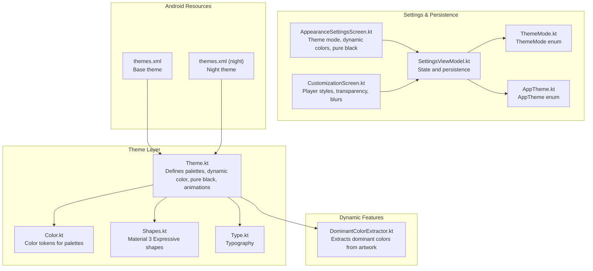
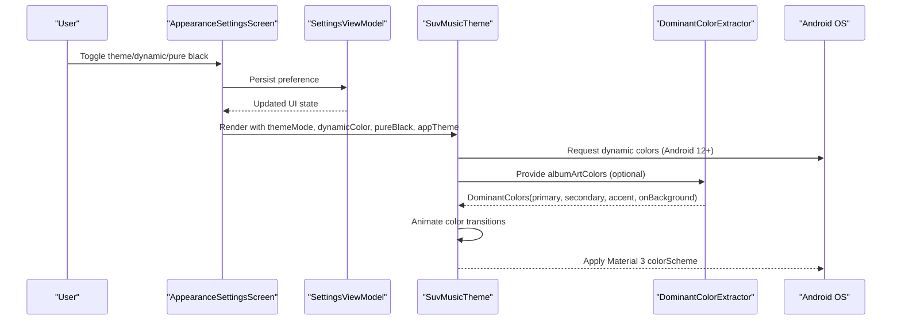
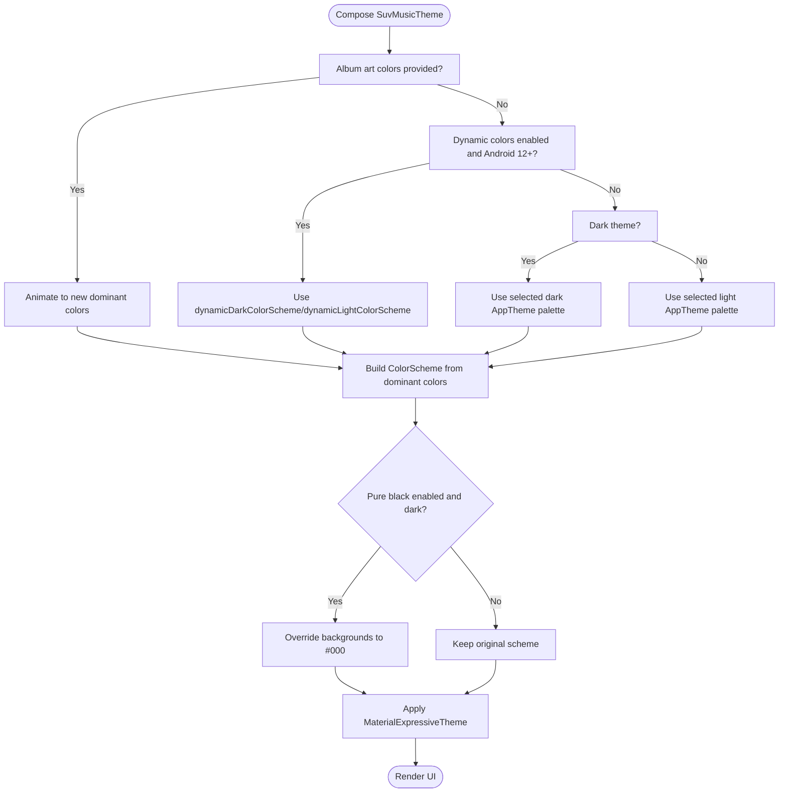
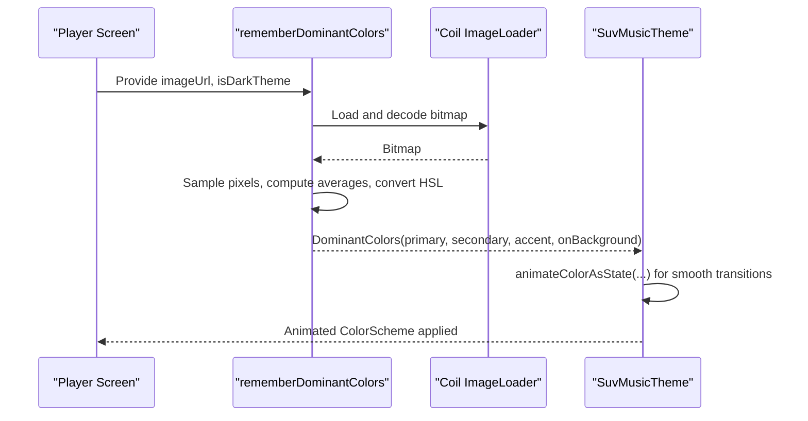
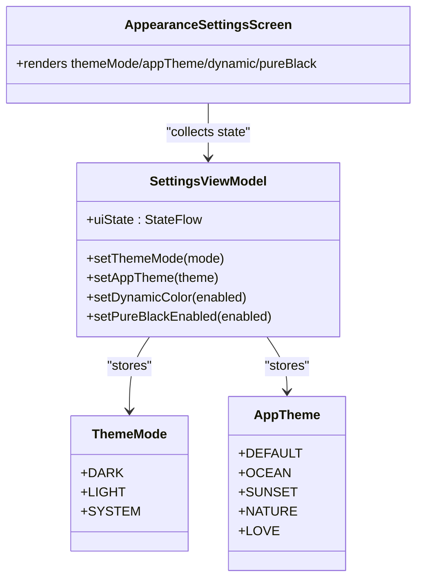
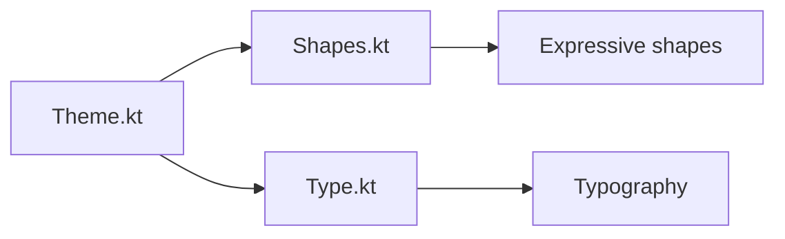
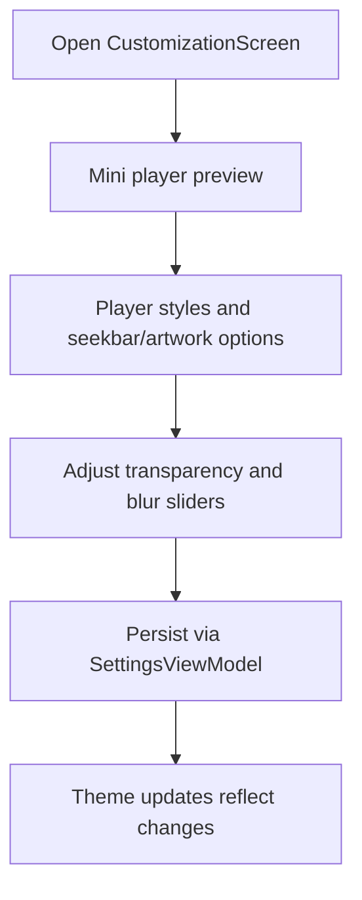
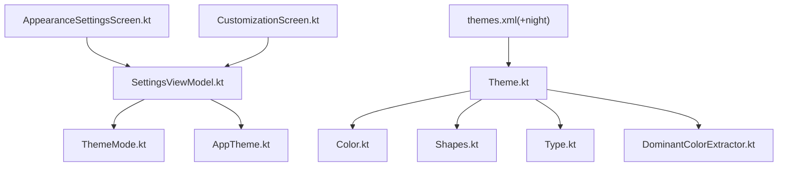

# Theming System

<cite>
**Referenced Files in This Document**
- [Theme.kt](file://app/src/main/java/com/suvojeet/suvmusic/ui/theme/Theme.kt)
- [Color.kt](file://app/src/main/java/com/suvojeet/suvmusic/ui/theme/Color.kt)
- [Shapes.kt](file://app/src/main/java/com/suvojeet/suvmusic/ui/theme/Shapes.kt)
- [Type.kt](file://app/src/main/java/com/suvojeet/suvmusic/ui/theme/Type.kt)
- [AppTheme.kt](file://app/src/main/java/com/suvojeet/suvmusic/data/model/AppTheme.kt)
- [ThemeMode.kt](file://app/src/main/java/com/suvojeet/suvmusic/data/model/ThemeMode.kt)
- [DominantColorExtractor.kt](file://app/src/main/java/com/suvojeet/suvmusic/ui/components/DominantColorExtractor.kt)
- [AppearanceSettingsScreen.kt](file://app/src/main/java/com/suvojeet/suvmusic/ui/screens/AppearanceSettingsScreen.kt)
- [CustomizationScreen.kt](file://app/src/main/java/com/suvojeet/suvmusic/ui/screens/CustomizationScreen.kt)
- [SettingsViewModel.kt](file://app/src/main/java/com/suvojeet/suvmusic/ui/viewmodel/SettingsViewModel.kt)
- [themes.xml](file://app/src/main/res/values/themes.xml)
- [themes.xml (night)](file://app/src/main/res/values-night/themes.xml)
</cite>

## Table of Contents
1. [Introduction](#introduction)
2. [Project Structure](#project-structure)
3. [Core Components](#core-components)
4. [Architecture Overview](#architecture-overview)
5. [Detailed Component Analysis](#detailed-component-analysis)
6. [Dependency Analysis](#dependency-analysis)
7. [Performance Considerations](#performance-considerations)
8. [Troubleshooting Guide](#troubleshooting-guide)
9. [Conclusion](#conclusion)

## Introduction
This document explains SuvMusic’s dynamic theming system built on Material Design 3. It covers:
- Five custom color palettes: Default Purple, Ocean Blue, Sunset Orange, Nature Green, and Love Pink
- Dynamic color extraction from album artwork with animated transitions
- Pure black mode for OLED displays
- Dynamic color support via Android system colors (Android 12+)
- Material 3 Expressive API integration
- Theme switching and persistence
- Accessibility and customization options

## Project Structure
The theming system is implemented primarily in the UI theme module and related screens and view models:
- Theme definition and selection logic
- Color palettes and expressive shapes/typography
- Dynamic color extraction and animation
- Settings UI and persistence

**Diagram sources**
- [Theme.kt:1-306](file://app/src/main/java/com/suvojeet/suvmusic/ui/theme/Theme.kt#L1-L306)
- [Color.kt:1-154](file://app/src/main/java/com/suvojeet/suvmusic/ui/theme/Color.kt#L1-L154)
- [Shapes.kt:1-74](file://app/src/main/java/com/suvojeet/suvmusic/ui/theme/Shapes.kt#L1-L74)
- [Type.kt:1-129](file://app/src/main/java/com/suvojeet/suvmusic/ui/theme/Type.kt#L1-L129)
- [DominantColorExtractor.kt:1-182](file://app/src/main/java/com/suvojeet/suvmusic/ui/components/DominantColorExtractor.kt#L1-L182)
- [AppearanceSettingsScreen.kt:1-664](file://app/src/main/java/com/suvojeet/suvmusic/ui/screens/AppearanceSettingsScreen.kt#L1-L664)
- [CustomizationScreen.kt:1-776](file://app/src/main/java/com/suvojeet/suvmusic/ui/screens/CustomizationScreen.kt#L1-L776)
- [SettingsViewModel.kt:1-800](file://app/src/main/java/com/suvojeet/suvmusic/ui/viewmodel/SettingsViewModel.kt#L1-L800)
- [ThemeMode.kt:1-11](file://app/src/main/java/com/suvojeet/suvmusic/data/model/ThemeMode.kt#L1-L11)
- [AppTheme.kt:1-10](file://app/src/main/java/com/suvojeet/suvmusic/data/model/AppTheme.kt#L1-L10)
- [themes.xml:1-12](file://app/src/main/res/values/themes.xml#L1-L12)
- [themes.xml (night):1-5](file://app/src/main/res/values-night/themes.xml#L1-L5)

**Section sources**
- [Theme.kt:1-306](file://app/src/main/java/com/suvojeet/suvmusic/ui/theme/Theme.kt#L1-L306)
- [Color.kt:1-154](file://app/src/main/java/com/suvojeet/suvmusic/ui/theme/Color.kt#L1-L154)
- [Shapes.kt:1-74](file://app/src/main/java/com/suvojeet/suvmusic/ui/theme/Shapes.kt#L1-L74)
- [Type.kt:1-129](file://app/src/main/java/com/suvojeet/suvmusic/ui/theme/Type.kt#L1-L129)
- [DominantColorExtractor.kt:1-182](file://app/src/main/java/com/suvojeet/suvmusic/ui/components/DominantColorExtractor.kt#L1-L182)
- [AppearanceSettingsScreen.kt:1-664](file://app/src/main/java/com/suvojeet/suvmusic/ui/screens/AppearanceSettingsScreen.kt#L1-L664)
- [CustomizationScreen.kt:1-776](file://app/src/main/java/com/suvojeet/suvmusic/ui/screens/CustomizationScreen.kt#L1-L776)
- [SettingsViewModel.kt:1-800](file://app/src/main/java/com/suvojeet/suvmusic/ui/viewmodel/SettingsViewModel.kt#L1-L800)
- [ThemeMode.kt:1-11](file://app/src/main/java/com/suvojeet/suvmusic/data/model/ThemeMode.kt#L1-L11)
- [AppTheme.kt:1-10](file://app/src/main/java/com/suvojeet/suvmusic/data/model/AppTheme.kt#L1-L10)
- [themes.xml:1-12](file://app/src/main/res/values/themes.xml#L1-L12)
- [themes.xml (night):1-5](file://app/src/main/res/values-night/themes.xml#L1-L5)

## Core Components
- Color palettes: Five predefined palettes plus expressive tokens for surfaces and gradients
- Theme composition: Selects palettes based on theme mode, dynamic color availability, and optional album-art-derived colors
- Dynamic color extraction: Computes dominant colors from album artwork and animates transitions
- Expressive theming: Uses Material 3 Expressive shapes and typography
- Settings and persistence: Exposes switches and selections for theme mode, dynamic colors, pure black, and player customization

**Section sources**
- [Theme.kt:30-306](file://app/src/main/java/com/suvojeet/suvmusic/ui/theme/Theme.kt#L30-L306)
- [Color.kt:1-154](file://app/src/main/java/com/suvojeet/suvmusic/ui/theme/Color.kt#L1-L154)
- [DominantColorExtractor.kt:25-182](file://app/src/main/java/com/suvojeet/suvmusic/ui/components/DominantColorExtractor.kt#L25-L182)
- [Shapes.kt:13-74](file://app/src/main/java/com/suvojeet/suvmusic/ui/theme/Shapes.kt#L13-L74)
- [Type.kt:14-129](file://app/src/main/java/com/suvojeet/suvmusic/ui/theme/Type.kt#L14-L129)
- [AppearanceSettingsScreen.kt:151-302](file://app/src/main/java/com/suvojeet/suvmusic/ui/screens/AppearanceSettingsScreen.kt#L151-L302)
- [SettingsViewModel.kt:40-137](file://app/src/main/java/com/suvojeet/suvmusic/ui/viewmodel/SettingsViewModel.kt#L40-L137)

## Architecture Overview
The theming pipeline integrates UI state, dynamic color extraction, and Material 3 theming:

**Diagram sources**
- [AppearanceSettingsScreen.kt:151-302](file://app/src/main/java/com/suvojeet/suvmusic/ui/screens/AppearanceSettingsScreen.kt#L151-L302)
- [SettingsViewModel.kt:565-726](file://app/src/main/java/com/suvojeet/suvmusic/ui/viewmodel/SettingsViewModel.kt#L565-L726)
- [Theme.kt:209-306](file://app/src/main/java/com/suvojeet/suvmusic/ui/theme/Theme.kt#L209-L306)
- [DominantColorExtractor.kt:35-91](file://app/src/main/java/com/suvojeet/suvmusic/ui/components/DominantColorExtractor.kt#L35-L91)
- [themes.xml:1-12](file://app/src/main/res/values/themes.xml#L1-L12)
- [themes.xml (night):1-5](file://app/src/main/res/values-night/themes.xml#L1-L5)

## Detailed Component Analysis

### Material 3 Theme Composition
- Palettes: Five custom palettes (Default Purple, Ocean Blue, Sunset Orange, Nature Green, Love Pink) plus expressive tokens for surfaces and gradients
- Dynamic color: On Android 12+, uses system wallpaper colors; otherwise falls back to selected AppTheme
- Pure black: Overrides background and surface variants to true black for OLED power savings
- Expressive theming: Shapes and typography integrate Material 3 Expressive APIs

**Diagram sources**
- [Theme.kt:209-306](file://app/src/main/java/com/suvojeet/suvmusic/ui/theme/Theme.kt#L209-L306)
- [Color.kt:1-154](file://app/src/main/java/com/suvojeet/suvmusic/ui/theme/Color.kt#L1-L154)
- [Shapes.kt:13-74](file://app/src/main/java/com/suvojeet/suvmusic/ui/theme/Shapes.kt#L13-L74)
- [Type.kt:14-129](file://app/src/main/java/com/suvojeet/suvmusic/ui/theme/Type.kt#L14-L129)

**Section sources**
- [Theme.kt:30-306](file://app/src/main/java/com/suvojeet/suvmusic/ui/theme/Theme.kt#L30-L306)
- [Color.kt:1-154](file://app/src/main/java/com/suvojeet/suvmusic/ui/theme/Color.kt#L1-L154)
- [Shapes.kt:13-74](file://app/src/main/java/com/suvojeet/suvmusic/ui/theme/Shapes.kt#L13-L74)
- [Type.kt:14-129](file://app/src/main/java/com/suvojeet/suvmusic/ui/theme/Type.kt#L14-L129)

### Dominant Color Extraction and Animation
- Extracts dominant colors from album artwork URLs using a sampling strategy and HSL manipulation
- Provides theme-aware defaults to prevent flicker during track changes
- Animates color transitions using Compose’s animateColorAsState with spring specs

**Diagram sources**
- [DominantColorExtractor.kt:35-182](file://app/src/main/java/com/suvojeet/suvmusic/ui/components/DominantColorExtractor.kt#L35-L182)
- [Theme.kt:218-247](file://app/src/main/java/com/suvojeet/suvmusic/ui/theme/Theme.kt#L218-L247)

**Section sources**
- [DominantColorExtractor.kt:25-182](file://app/src/main/java/com/suvojeet/suvmusic/ui/components/DominantColorExtractor.kt#L25-L182)
- [Theme.kt:218-247](file://app/src/main/java/com/suvojeet/suvmusic/ui/theme/Theme.kt#L218-L247)

### Theme Modes and Persistence
- ThemeMode: Light, Dark, System default
- AppTheme: Five custom palettes
- Settings UI exposes toggles and sheets to change preferences
- SettingsViewModel persists and streams preferences to UI

**Diagram sources**
- [ThemeMode.kt:6-10](file://app/src/main/java/com/suvojeet/suvmusic/data/model/ThemeMode.kt#L6-L10)
- [AppTheme.kt:3-9](file://app/src/main/java/com/suvojeet/suvmusic/data/model/AppTheme.kt#L3-L9)
- [SettingsViewModel.kt:40-137](file://app/src/main/java/com/suvojeet/suvmusic/ui/viewmodel/SettingsViewModel.kt#L40-L137)
- [AppearanceSettingsScreen.kt:151-302](file://app/src/main/java/com/suvojeet/suvmusic/ui/screens/AppearanceSettingsScreen.kt#L151-L302)

**Section sources**
- [ThemeMode.kt:1-11](file://app/src/main/java/com/suvojeet/suvmusic/data/model/ThemeMode.kt#L1-L11)
- [AppTheme.kt:1-10](file://app/src/main/java/com/suvojeet/suvmusic/data/model/AppTheme.kt#L1-L10)
- [AppearanceSettingsScreen.kt:151-302](file://app/src/main/java/com/suvojeet/suvmusic/ui/screens/AppearanceSettingsScreen.kt#L151-L302)
- [SettingsViewModel.kt:565-726](file://app/src/main/java/com/suvojeet/suvmusic/ui/viewmodel/SettingsViewModel.kt#L565-L726)

### Expressive Shapes and Typography
- Shapes: Standard rounded corners plus expressive shapes from Material 3 Expressive shapes
- Typography: System fonts with expressive sizing and spacing

**Diagram sources**
- [Shapes.kt:13-74](file://app/src/main/java/com/suvojeet/suvmusic/ui/theme/Shapes.kt#L13-L74)
- [Type.kt:14-129](file://app/src/main/java/com/suvojeet/suvmusic/ui/theme/Type.kt#L14-L129)
- [Theme.kt:300-305](file://app/src/main/java/com/suvojeet/suvmusic/ui/theme/Theme.kt#L300-L305)

**Section sources**
- [Shapes.kt:13-74](file://app/src/main/java/com/suvojeet/suvmusic/ui/theme/Shapes.kt#L13-L74)
- [Type.kt:14-129](file://app/src/main/java/com/suvojeet/suvmusic/ui/theme/Type.kt#L14-L129)
- [Theme.kt:300-305](file://app/src/main/java/com/suvojeet/suvmusic/ui/theme/Theme.kt#L300-L305)

### Customization Options
- Player styles, transparency, iOS liquid glass, and home sections visibility
- Sliders and switches to adjust mini-player alpha, navigation bar alpha/blur, and more

**Diagram sources**
- [CustomizationScreen.kt:65-367](file://app/src/main/java/com/suvojeet/suvmusic/ui/screens/CustomizationScreen.kt#L65-L367)
- [SettingsViewModel.kt:565-726](file://app/src/main/java/com/suvojeet/suvmusic/ui/viewmodel/SettingsViewModel.kt#L565-L726)

**Section sources**
- [CustomizationScreen.kt:65-367](file://app/src/main/java/com/suvojeet/suvmusic/ui/screens/CustomizationScreen.kt#L65-L367)
- [SettingsViewModel.kt:565-726](file://app/src/main/java/com/suvojeet/suvmusic/ui/viewmodel/SettingsViewModel.kt#L565-L726)

## Dependency Analysis
- Theme.kt depends on Color.kt for tokens, Shapes.kt and Type.kt for expressive assets
- DominantColorExtractor.kt depends on Coil for image loading and Android graphics utilities
- AppearanceSettingsScreen and CustomizationScreen depend on SettingsViewModel for state
- Android resource themes define base platform themes

**Diagram sources**
- [Theme.kt:1-306](file://app/src/main/java/com/suvojeet/suvmusic/ui/theme/Theme.kt#L1-L306)
- [Color.kt:1-154](file://app/src/main/java/com/suvojeet/suvmusic/ui/theme/Color.kt#L1-L154)
- [Shapes.kt:1-74](file://app/src/main/java/com/suvojeet/suvmusic/ui/theme/Shapes.kt#L1-L74)
- [Type.kt:1-129](file://app/src/main/java/com/suvojeet/suvmusic/ui/theme/Type.kt#L1-L129)
- [DominantColorExtractor.kt:1-182](file://app/src/main/java/com/suvojeet/suvmusic/ui/components/DominantColorExtractor.kt#L1-L182)
- [AppearanceSettingsScreen.kt:1-664](file://app/src/main/java/com/suvojeet/suvmusic/ui/screens/AppearanceSettingsScreen.kt#L1-L664)
- [CustomizationScreen.kt:1-776](file://app/src/main/java/com/suvojeet/suvmusic/ui/screens/CustomizationScreen.kt#L1-L776)
- [SettingsViewModel.kt:1-800](file://app/src/main/java/com/suvojeet/suvmusic/ui/viewmodel/SettingsViewModel.kt#L1-L800)
- [ThemeMode.kt:1-11](file://app/src/main/java/com/suvojeet/suvmusic/data/model/ThemeMode.kt#L1-L11)
- [AppTheme.kt:1-10](file://app/src/main/java/com/suvojeet/suvmusic/data/model/AppTheme.kt#L1-L10)
- [themes.xml:1-12](file://app/src/main/res/values/themes.xml#L1-L12)
- [themes.xml (night):1-5](file://app/src/main/res/values-night/themes.xml#L1-L5)

**Section sources**
- [Theme.kt:1-306](file://app/src/main/java/com/suvojeet/suvmusic/ui/theme/Theme.kt#L1-L306)
- [DominantColorExtractor.kt:1-182](file://app/src/main/java/com/suvojeet/suvmusic/ui/components/DominantColorExtractor.kt#L1-L182)
- [AppearanceSettingsScreen.kt:1-664](file://app/src/main/java/com/suvojeet/suvmusic/ui/screens/AppearanceSettingsScreen.kt#L1-L664)
- [CustomizationScreen.kt:1-776](file://app/src/main/java/com/suvojeet/suvmusic/ui/screens/CustomizationScreen.kt#L1-L776)
- [SettingsViewModel.kt:1-800](file://app/src/main/java/com/suvojeet/suvmusic/ui/viewmodel/SettingsViewModel.kt#L1-L800)
- [themes.xml:1-12](file://app/src/main/res/values/themes.xml#L1-L12)
- [themes.xml (night):1-5](file://app/src/main/res/values-night/themes.xml#L1-L5)

## Performance Considerations
- Dynamic color extraction uses a small sampled region and IO dispatcher to avoid blocking the main thread
- Animated transitions use spring specs tuned for bouncy yet smooth feedback
- Pure black mode reduces overdraw on OLED devices by forcing true black backgrounds
- Consider caching extracted colors per artwork URL to minimize recomputation when the same album is repeated

[No sources needed since this section provides general guidance]

## Troubleshooting Guide
- Dynamic colors not applying: Ensure device is Android 12+ and wallpaper colors are available
- Colors appear washed out in light mode: Accent saturation is adjusted for readability; confirm onBackground color remains dark
- Flicker on track change: DominantColorExtractor provides theme-aware defaults to mitigate; verify defaults align with current theme
- Pure black not taking effect: Confirm theme mode is Dark or System while dark, and the Pure Black switch is enabled

**Section sources**
- [Theme.kt:273-285](file://app/src/main/java/com/suvojeet/suvmusic/ui/theme/Theme.kt#L273-L285)
- [DominantColorExtractor.kt:42-56](file://app/src/main/java/com/suvojeet/suvmusic/ui/components/DominantColorExtractor.kt#L42-L56)
- [AppearanceSettingsScreen.kt:169-184](file://app/src/main/java/com/suvojeet/suvmusic/ui/screens/AppearanceSettingsScreen.kt#L169-L184)

## Conclusion
SuvMusic’s theming system blends Material 3 design with expressive visuals and deep customization. Users can choose from five custom palettes, enable dynamic colors from Android 12+ wallpapers, adapt themes to album artwork with animated transitions, and opt into pure black for OLED devices. The system is backed by robust settings UI and persistent state, ensuring a cohesive and accessible theming experience.