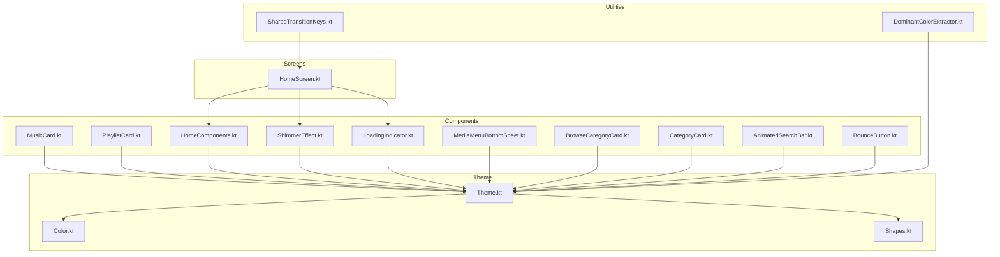
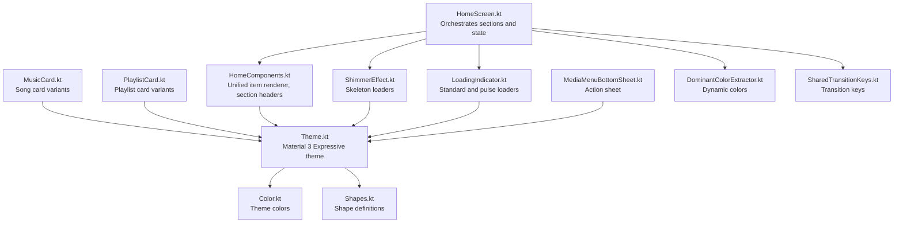
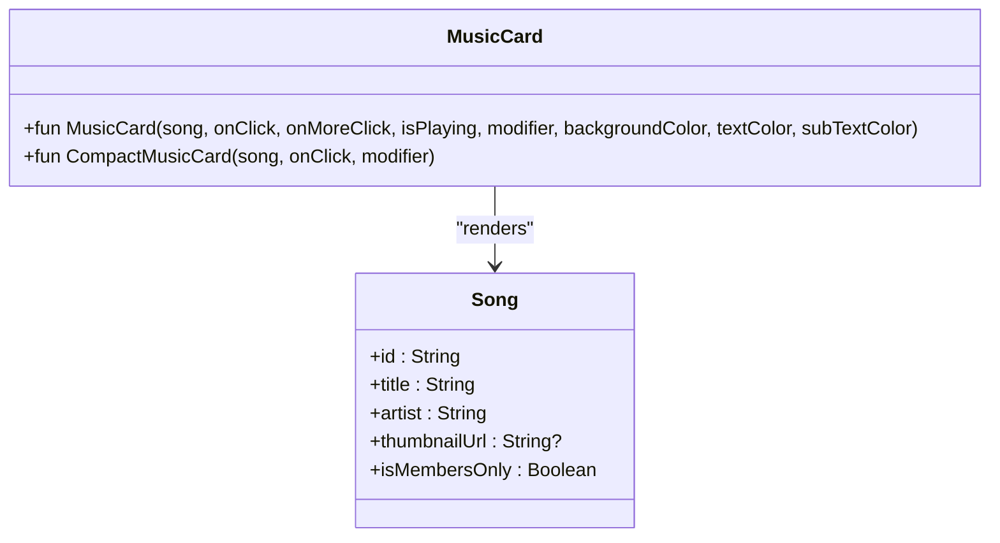
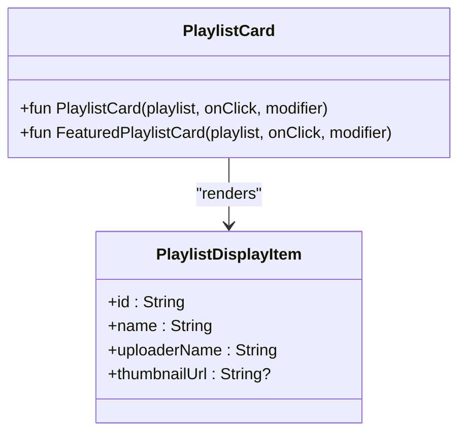
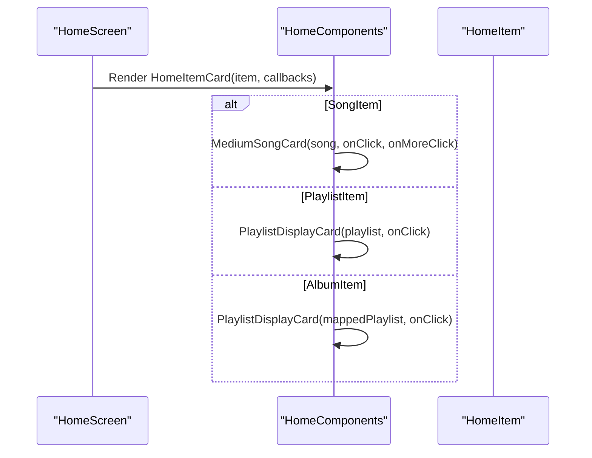
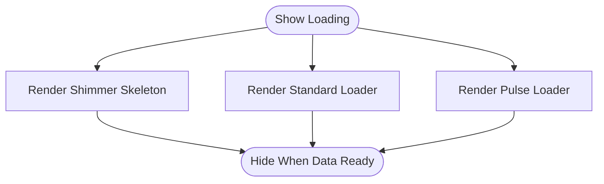
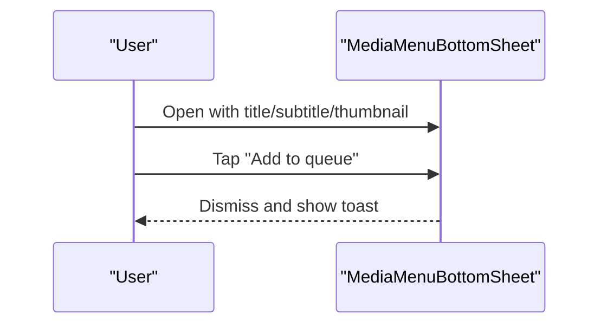
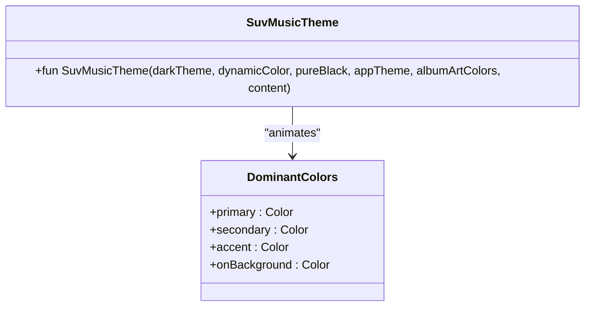
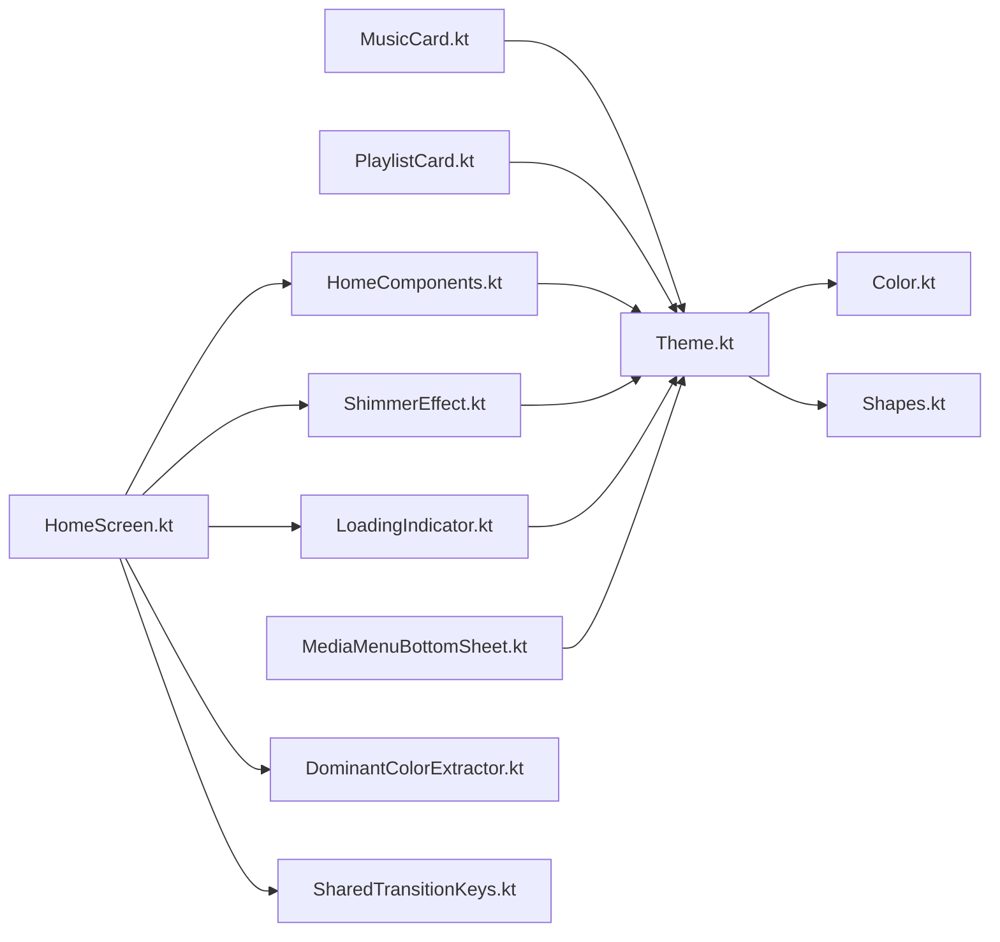

# UI Components

<cite>
**Referenced Files in This Document**
- [MusicCard.kt](file://app/src/main/java/com/suvojeet/suvmusic/ui/components/MusicCard.kt)
- [PlaylistCard.kt](file://app/src/main/java/com/suvojeet/suvmusic/ui/components/PlaylistCard.kt)
- [HomeComponents.kt](file://app/src/main/java/com/suvojeet/suvmusic/ui/components/HomeComponents.kt)
- [ShimmerEffect.kt](file://app/src/main/java/com/suvojeet/suvmusic/ui/components/ShimmerEffect.kt)
- [LoadingIndicator.kt](file://app/src/main/java/com/suvojeet/suvmusic/ui/components/LoadingIndicator.kt)
- [MediaMenuBottomSheet.kt](file://app/src/main/java/com/suvojeet/suvmusic/ui/components/MediaMenuBottomSheet.kt)
- [BrowseCategoryCard.kt](file://app/src/main/java/com/suvojeet/suvmusic/ui/components/BrowseCategoryCard.kt)
- [CategoryCard.kt](file://app/src/main/java/com/suvojeet/suvmusic/ui/components/CategoryCard.kt)
- [AnimatedSearchBar.kt](file://app/src/main/java/com/suvojeet/suvmusic/ui/components/AnimatedSearchBar.kt)
- [BounceButton.kt](file://app/src/main/java/com/suvojeet/suvmusic/ui/components/BounceButton.kt)
- [Theme.kt](file://app/src/main/java/com/suvojeet/suvmusic/ui/theme/Theme.kt)
- [Color.kt](file://app/src/main/java/com/suvojeet/suvmusic/ui/theme/Color.kt)
- [Shapes.kt](file://app/src/main/java/com/suvojeet/suvmusic/ui/theme/Shapes.kt)
- [DominantColorExtractor.kt](file://app/src/main/java/com/suvojeet/suvmusic/ui/components/DominantColorExtractor.kt)
- [SharedTransitionKeys.kt](file://app/src/main/java/com/suvojeet/suvmusic/ui/utils/SharedTransitionKeys.kt)
- [HomeScreen.kt](file://app/src/main/java/com/suvojeet/suvmusic/ui/screens/HomeScreen.kt)
</cite>

## Table of Contents
1. [Introduction](#introduction)
2. [Project Structure](#project-structure)
3. [Core Components](#core-components)
4. [Architecture Overview](#architecture-overview)
5. [Detailed Component Analysis](#detailed-component-analysis)
6. [Dependency Analysis](#dependency-analysis)
7. [Performance Considerations](#performance-considerations)
8. [Troubleshooting Guide](#troubleshooting-guide)
9. [Conclusion](#conclusion)
10. [Appendices](#appendices)

## Introduction
This document describes SuvMusic’s reusable UI component library with a focus on:
- Music and album cards for content presentation
- Playlist cards for collection management
- Home screen composition and skeletons
- Loading indicators and shimmer effects
- Interactive components such as buttons and bottom sheets
- Composition patterns, state management, prop interfaces, customization, theming, and accessibility

The goal is to help developers create consistent, performant, and accessible UI while following established patterns in the codebase.

## Project Structure
The UI components live primarily under app/src/main/java/com/suvojeet/suvmusic/ui/components and are complemented by theme definitions, utilities, and screen-level orchestrators.

**Diagram sources**
- [HomeScreen.kt](file://app/src/main/java/com/suvojeet/suvmusic/ui/screens/HomeScreen.kt)
- [MusicCard.kt](file://app/src/main/java/com/suvojeet/suvmusic/ui/components/MusicCard.kt)
- [PlaylistCard.kt](file://app/src/main/java/com/suvojeet/suvmusic/ui/components/PlaylistCard.kt)
- [HomeComponents.kt](file://app/src/main/java/com/suvojeet/suvmusic/ui/components/HomeComponents.kt)
- [ShimmerEffect.kt](file://app/src/main/java/com/suvojeet/suvmusic/ui/components/ShimmerEffect.kt)
- [LoadingIndicator.kt](file://app/src/main/java/com/suvojeet/suvmusic/ui/components/LoadingIndicator.kt)
- [MediaMenuBottomSheet.kt](file://app/src/main/java/com/suvojeet/suvmusic/ui/components/MediaMenuBottomSheet.kt)
- [BrowseCategoryCard.kt](file://app/src/main/java/com/suvojeet/suvmusic/ui/components/BrowseCategoryCard.kt)
- [CategoryCard.kt](file://app/src/main/java/com/suvojeet/suvmusic/ui/components/CategoryCard.kt)
- [AnimatedSearchBar.kt](file://app/src/main/java/com/suvojeet/suvmusic/ui/components/AnimatedSearchBar.kt)
- [BounceButton.kt](file://app/src/main/java/com/suvojeet/suvmusic/ui/components/BounceButton.kt)
- [Theme.kt](file://app/src/main/java/com/suvojeet/suvmusic/ui/theme/Theme.kt)
- [Color.kt](file://app/src/main/java/com/suvojeet/suvmusic/ui/theme/Color.kt)
- [Shapes.kt](file://app/src/main/java/com/suvojeet/suvmusic/ui/theme/Shapes.kt)
- [DominantColorExtractor.kt](file://app/src/main/java/com/suvojeet/suvmusic/ui/components/DominantColorExtractor.kt)
- [SharedTransitionKeys.kt](file://app/src/main/java/com/suvojeet/suvmusic/ui/utils/SharedTransitionKeys.kt)

**Section sources**
- [Theme.kt](file://app/src/main/java/com/suvojeet/suvmusic/ui/theme/Theme.kt)
- [Color.kt](file://app/src/main/java/com/suvojeet/suvmusic/ui/theme/Color.kt)
- [Shapes.kt](file://app/src/main/java/com/suvojeet/suvmusic/ui/theme/Shapes.kt)
- [HomeScreen.kt](file://app/src/main/java/com/suvojeet/suvmusic/ui/screens/HomeScreen.kt)

## Core Components
This section outlines the primary reusable components and their roles.

- Music cards
  - Full-width card with album art, title, artist, “now playing” overlay, and “members only” badge
  - Compact variant optimized for horizontal lists
  - Props include song model, click handlers, optional playing state, and override colors
- Playlist cards
  - Standard playlist card with gradient overlay and optional thumbnail
  - Large featured card for home banners
- Home screen composition
  - Unified item renderer for songs, playlists, and albums
  - Display helpers for section headers and bounce-click interactions
- Loading and shimmer
  - Shimmer skeletons for playlists, music cards, home cards, and full home screen
  - Standard and pulse loading indicators
- Interactive components
  - Bottom sheet for media actions
  - Animated search bar
  - Bounce button with press-scale animation
  - Category cards for browsing
- Theming and customization
  - Material 3 Expressive theme with dynamic color support
  - Shape and color palettes tailored for music apps
  - Dominant color extraction for dynamic theming

**Section sources**
- [MusicCard.kt](file://app/src/main/java/com/suvojeet/suvmusic/ui/components/MusicCard.kt)
- [PlaylistCard.kt](file://app/src/main/java/com/suvojeet/suvmusic/ui/components/PlaylistCard.kt)
- [HomeComponents.kt](file://app/src/main/java/com/suvojeet/suvmusic/ui/components/HomeComponents.kt)
- [ShimmerEffect.kt](file://app/src/main/java/com/suvojeet/suvmusic/ui/components/ShimmerEffect.kt)
- [LoadingIndicator.kt](file://app/src/main/java/com/suvojeet/suvmusic/ui/components/LoadingIndicator.kt)
- [MediaMenuBottomSheet.kt](file://app/src/main/java/com/suvojeet/suvmusic/ui/components/MediaMenuBottomSheet.kt)
- [BrowseCategoryCard.kt](file://app/src/main/java/com/suvojeet/suvmusic/ui/components/BrowseCategoryCard.kt)
- [CategoryCard.kt](file://app/src/main/java/com/suvojeet/suvmusic/ui/components/CategoryCard.kt)
- [AnimatedSearchBar.kt](file://app/src/main/java/com/suvojeet/suvmusic/ui/components/AnimatedSearchBar.kt)
- [BounceButton.kt](file://app/src/main/java/com/suvojeet/suvmusic/ui/components/BounceButton.kt)
- [Theme.kt](file://app/src/main/java/com/suvojeet/suvmusic/ui/theme/Theme.kt)
- [DominantColorExtractor.kt](file://app/src/main/java/com/suvojeet/suvmusic/ui/components/DominantColorExtractor.kt)

## Architecture Overview
The UI layer follows a composition-first pattern:
- Screens orchestrate state and render lists/sections
- Components encapsulate rendering and interactions
- Themes and shapes define consistent visuals
- Utilities handle dynamic colors and shared transitions

**Diagram sources**
- [HomeScreen.kt](file://app/src/main/java/com/suvojeet/suvmusic/ui/screens/HomeScreen.kt)
- [HomeComponents.kt](file://app/src/main/java/com/suvojeet/suvmusic/ui/components/HomeComponents.kt)
- [MusicCard.kt](file://app/src/main/java/com/suvojeet/suvmusic/ui/components/MusicCard.kt)
- [PlaylistCard.kt](file://app/src/main/java/com/suvojeet/suvmusic/ui/components/PlaylistCard.kt)
- [ShimmerEffect.kt](file://app/src/main/java/com/suvojeet/suvmusic/ui/components/ShimmerEffect.kt)
- [LoadingIndicator.kt](file://app/src/main/java/com/suvojeet/suvmusic/ui/components/LoadingIndicator.kt)
- [MediaMenuBottomSheet.kt](file://app/src/main/java/com/suvojeet/suvmusic/ui/components/MediaMenuBottomSheet.kt)
- [Theme.kt](file://app/src/main/java/com/suvojeet/suvmusic/ui/theme/Theme.kt)
- [Color.kt](file://app/src/main/java/com/suvojeet/suvmusic/ui/theme/Color.kt)
- [Shapes.kt](file://app/src/main/java/com/suvojeet/suvmusic/ui/theme/Shapes.kt)
- [DominantColorExtractor.kt](file://app/src/main/java/com/suvojeet/suvmusic/ui/components/DominantColorExtractor.kt)
- [SharedTransitionKeys.kt](file://app/src/main/java/com/suvojeet/suvmusic/ui/utils/SharedTransitionKeys.kt)

## Detailed Component Analysis

### Music Card Components
- Purpose: Display songs with album art, metadata, and contextual overlays
- Variants:
  - Full-width card with optional “now playing” animation and “members only” badge
  - Compact card optimized for horizontal scrolling
- Props and behavior:
  - Accepts a song model, click handler, optional “more” menu handler, playing state, and optional override colors
  - Resolves high-resolution thumbnails and handles local vs remote URLs
  - Uses Material 3 color scheme and custom squircle shape
- Accessibility:
  - Uses focusable wrappers for D-pad navigation
  - Descriptive content descriptions for images

**Diagram sources**
- [MusicCard.kt](file://app/src/main/java/com/suvojeet/suvmusic/ui/components/MusicCard.kt)

**Section sources**
- [MusicCard.kt](file://app/src/main/java/com/suvojeet/suvmusic/ui/components/MusicCard.kt)

### Playlist Card Components
- Purpose: Present playlists with image overlays and gradient text backgrounds
- Variants:
  - Standard card for grids/lists
  - Large featured card for home banners
- Props and behavior:
  - Accepts a playlist display item and click handler
  - Applies gradient overlays for readability and visual depth
  - Falls back to icons when no thumbnail is available

**Diagram sources**
- [PlaylistCard.kt](file://app/src/main/java/com/suvojeet/suvmusic/ui/components/PlaylistCard.kt)

**Section sources**
- [PlaylistCard.kt](file://app/src/main/java/com/suvojeet/suvmusic/ui/components/PlaylistCard.kt)

### Home Screen Composition
- Purpose: Unified rendering of mixed content (songs, playlists, albums) and section headers
- Features:
  - HomeItemCard dispatches to appropriate sub-components
  - MediumSongCard and PlaylistDisplayCard for grid/list presentations
  - HomeSectionHeader with “see all” action
  - Reusable bounce-click modifier for interactive cards

**Diagram sources**
- [HomeScreen.kt](file://app/src/main/java/com/suvojeet/suvmusic/ui/screens/HomeScreen.kt)
- [HomeComponents.kt](file://app/src/main/java/com/suvojeet/suvmusic/ui/components/HomeComponents.kt)

**Section sources**
- [HomeComponents.kt](file://app/src/main/java/com/suvojeet/suvmusic/ui/components/HomeComponents.kt)
- [HomeScreen.kt](file://app/src/main/java/com/suvojeet/suvmusic/ui/screens/HomeScreen.kt)

### Loading and Shimmer Effects
- Purpose: Provide immediate feedback during asynchronous loads
- Components:
  - Shimmer skeletons for playlists, music cards, home cards, and full home screen
  - Standard and pulse loading indicators
  - Overlay for artwork placeholders
- Implementation:
  - Animated gradient brushes for shimmer
  - Infinite transitions and tweened animations

**Diagram sources**
- [ShimmerEffect.kt](file://app/src/main/java/com/suvojeet/suvmusic/ui/components/ShimmerEffect.kt)
- [LoadingIndicator.kt](file://app/src/main/java/com/suvojeet/suvmusic/ui/components/LoadingIndicator.kt)

**Section sources**
- [ShimmerEffect.kt](file://app/src/main/java/com/suvojeet/suvmusic/ui/components/ShimmerEffect.kt)
- [LoadingIndicator.kt](file://app/src/main/java/com/suvojeet/suvmusic/ui/components/LoadingIndicator.kt)

### Interactive Components
- Bottom sheet for media actions
  - Provides quick actions (shuffle, radio), queue actions, playlist operations, and export/edit/delete for user playlists
  - Supports optional sharing
- Animated search bar
  - Expands on focus, supports clear and search IME action
- Bounce button
  - Press-scale animation with overlay, configurable size and shape

**Diagram sources**
- [MediaMenuBottomSheet.kt](file://app/src/main/java/com/suvojeet/suvmusic/ui/components/MediaMenuBottomSheet.kt)

**Section sources**
- [MediaMenuBottomSheet.kt](file://app/src/main/java/com/suvojeet/suvmusic/ui/components/MediaMenuBottomSheet.kt)
- [AnimatedSearchBar.kt](file://app/src/main/java/com/suvojeet/suvmusic/ui/components/AnimatedSearchBar.kt)
- [BounceButton.kt](file://app/src/main/java/com/suvojeet/suvmusic/ui/components/BounceButton.kt)

### Theming and Customization
- Theme
  - Material 3 Expressive theme with dynamic color support and multiple preset palettes
  - Optional pure black mode for OLED
- Colors and shapes
  - Centralized color tokens and shape definitions
  - Custom shapes for music-focused UI (squircles, pills, asymmetric cards)
- Dynamic colors
  - Extract dominant colors from album art and animate transitions

**Diagram sources**
- [Theme.kt](file://app/src/main/java/com/suvojeet/suvmusic/ui/theme/Theme.kt)
- [DominantColorExtractor.kt](file://app/src/main/java/com/suvojeet/suvmusic/ui/components/DominantColorExtractor.kt)

**Section sources**
- [Theme.kt](file://app/src/main/java/com/suvojeet/suvmusic/ui/theme/Theme.kt)
- [Color.kt](file://app/src/main/java/com/suvojeet/suvmusic/ui/theme/Color.kt)
- [Shapes.kt](file://app/src/main/java/com/suvojeet/suvmusic/ui/theme/Shapes.kt)
- [DominantColorExtractor.kt](file://app/src/main/java/com/suvojeet/suvmusic/ui/components/DominantColorExtractor.kt)

### Accessibility and Composition Patterns
- Focus handling
  - D-pad focus wrappers applied via modifiers to ensure keyboard/gamepad navigation
- Shared transitions
  - Transition keys for artwork/title/artist to maintain continuity across screens
- Composition
  - Stateless composables with explicit props for callbacks and models
  - Reuse of common layouts (rows/columns) and shapes across components

**Section sources**
- [MusicCard.kt](file://app/src/main/java/com/suvojeet/suvmusic/ui/components/MusicCard.kt)
- [HomeComponents.kt](file://app/src/main/java/com/suvojeet/suvmusic/ui/components/HomeComponents.kt)
- [SharedTransitionKeys.kt](file://app/src/main/java/com/suvojeet/suvmusic/ui/utils/SharedTransitionKeys.kt)

## Dependency Analysis
Key dependencies and relationships:
- Components depend on Material 3 theming and shapes
- HomeScreen composes multiple component families and manages state
- Dynamic colors depend on image loading and color extraction utilities
- SharedTransitionKeys coordinate transitions across screens

**Diagram sources**
- [HomeScreen.kt](file://app/src/main/java/com/suvojeet/suvmusic/ui/screens/HomeScreen.kt)
- [HomeComponents.kt](file://app/src/main/java/com/suvojeet/suvmusic/ui/components/HomeComponents.kt)
- [MusicCard.kt](file://app/src/main/java/com/suvojeet/suvmusic/ui/components/MusicCard.kt)
- [PlaylistCard.kt](file://app/src/main/java/com/suvojeet/suvmusic/ui/components/PlaylistCard.kt)
- [ShimmerEffect.kt](file://app/src/main/java/com/suvojeet/suvmusic/ui/components/ShimmerEffect.kt)
- [LoadingIndicator.kt](file://app/src/main/java/com/suvojeet/suvmusic/ui/components/LoadingIndicator.kt)
- [MediaMenuBottomSheet.kt](file://app/src/main/java/com/suvojeet/suvmusic/ui/components/MediaMenuBottomSheet.kt)
- [Theme.kt](file://app/src/main/java/com/suvojeet/suvmusic/ui/theme/Theme.kt)
- [Color.kt](file://app/src/main/java/com/suvojeet/suvmusic/ui/theme/Color.kt)
- [Shapes.kt](file://app/src/main/java/com/suvojeet/suvmusic/ui/theme/Shapes.kt)
- [DominantColorExtractor.kt](file://app/src/main/java/com/suvojeet/suvmusic/ui/components/DominantColorExtractor.kt)
- [SharedTransitionKeys.kt](file://app/src/main/java/com/suvojeet/suvmusic/ui/utils/SharedTransitionKeys.kt)

**Section sources**
- [HomeScreen.kt](file://app/src/main/java/com/suvojeet/suvmusic/ui/screens/HomeScreen.kt)
- [Theme.kt](file://app/src/main/java/com/suvojeet/suvmusic/ui/theme/Theme.kt)

## Performance Considerations
- Image loading
  - Prefer high-resolution thumbnails for crisp displays; cache and reuse requests
  - Use crossfade and appropriate sizes to balance quality and memory
- Animations
  - Shimmer and loading indicators use lightweight infinite transitions
  - Avoid heavy recompositions by passing stable callbacks and models
- Lists and skeletons
  - Use skeletons to reduce perceived latency and avoid jank during initial load
- Dynamic colors
  - Extract dominant colors off the main thread and cache results to minimize recomposition overhead

[No sources needed since this section provides general guidance]

## Troubleshooting Guide
- Shimmer not animating
  - Ensure infinite transitions are active and not blocked by parent scopes
- Images not appearing
  - Verify thumbnail URLs and network availability; confirm high-res URL generation
- Press animations not triggering
  - Confirm interaction sources and clickable modifiers are applied correctly
- Dynamic theme not updating
  - Ensure dominant color extraction completes and theme recomposition occurs

**Section sources**
- [ShimmerEffect.kt](file://app/src/main/java/com/suvojeet/suvmusic/ui/components/ShimmerEffect.kt)
- [LoadingIndicator.kt](file://app/src/main/java/com/suvojeet/suvmusic/ui/components/LoadingIndicator.kt)
- [BounceButton.kt](file://app/src/main/java/com/suvojeet/suvmusic/ui/components/BounceButton.kt)
- [DominantColorExtractor.kt](file://app/src/main/java/com/suvojeet/suvmusic/ui/components/DominantColorExtractor.kt)

## Conclusion
SuvMusic’s UI component library emphasizes consistency, performance, and expressiveness:
- Compose reusable cards and skeletons for efficient rendering
- Leverage Material 3 Expressive theming and dynamic colors for immersive experiences
- Use shared transitions and focus-safe interactions for accessibility
- Follow the documented patterns to add new components while preserving design coherence

[No sources needed since this section summarizes without analyzing specific files]

## Appendices

### Guidelines for Creating New Components
- Props-first design
  - Define a clear interface with minimal required props and optional overrides
- Composition over inheritance
  - Prefer small, focused composables and compose them into larger structures
- Theming integration
  - Use MaterialTheme colorScheme and shapes; avoid hardcoded colors
- Accessibility
  - Provide content descriptions for images; ensure focus order and D-pad navigation
- Performance
  - Memoize derived values; avoid unnecessary recompositions; use skeletons for async content

[No sources needed since this section provides general guidance]

### Maintaining Design Consistency
- Use centralized shapes and colors from theme modules
- Align typography scales and font weights with Material 3 guidelines
- Keep spacing and elevation consistent across similar components

**Section sources**
- [Theme.kt](file://app/src/main/java/com/suvojeet/suvmusic/ui/theme/Theme.kt)
- [Color.kt](file://app/src/main/java/com/suvojeet/suvmusic/ui/theme/Color.kt)
- [Shapes.kt](file://app/src/main/java/com/suvojeet/suvmusic/ui/theme/Shapes.kt)

### Customization and Extensibility
- Override colors and shapes per component via optional parameters
- Extend category and card families for specialized browsing experiences
- Add new skeletons for emerging layouts

**Section sources**
- [BrowseCategoryCard.kt](file://app/src/main/java/com/suvojeet/suvmusic/ui/components/BrowseCategoryCard.kt)
- [CategoryCard.kt](file://app/src/main/java/com/suvojeet/suvmusic/ui/components/CategoryCard.kt)
- [ShimmerEffect.kt](file://app/src/main/java/com/suvojeet/suvmusic/ui/components/ShimmerEffect.kt)