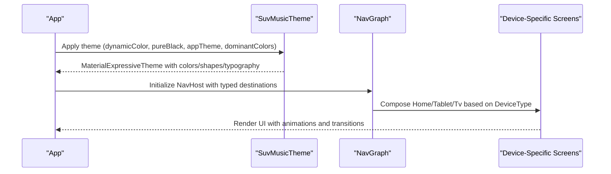
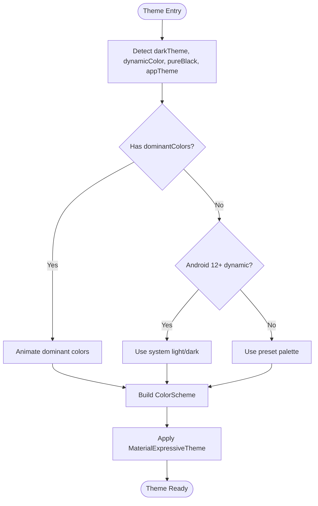
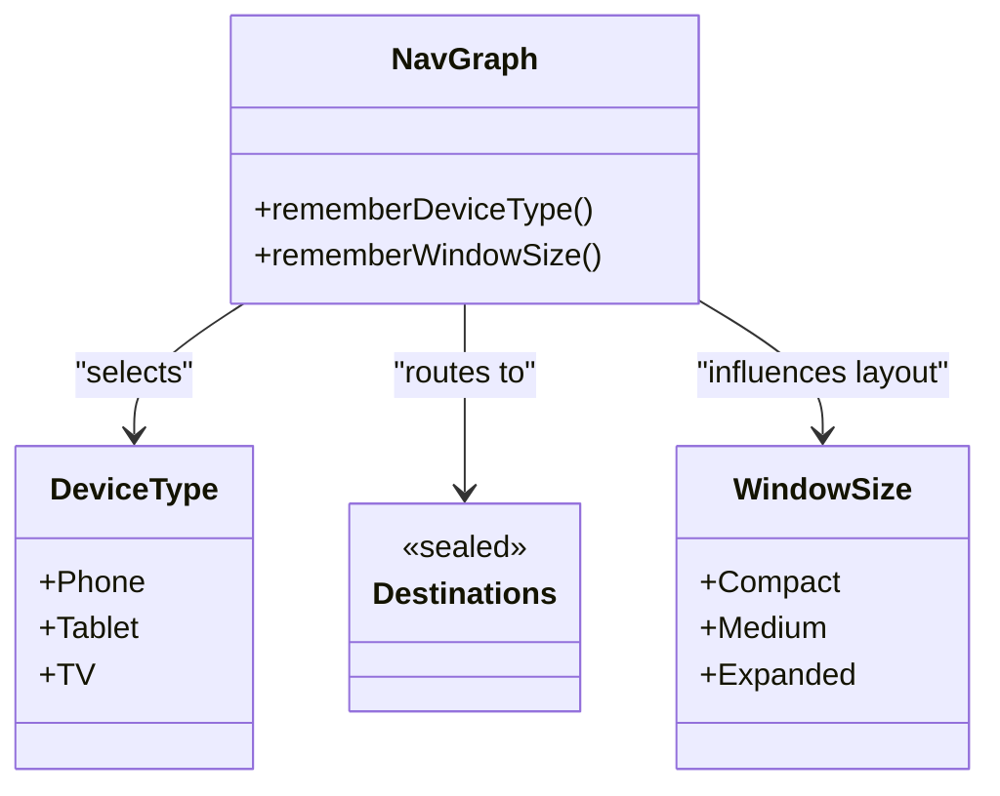
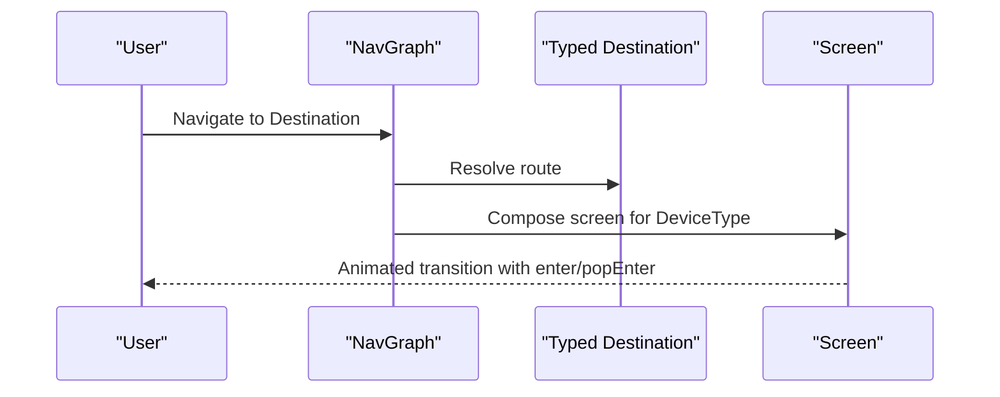
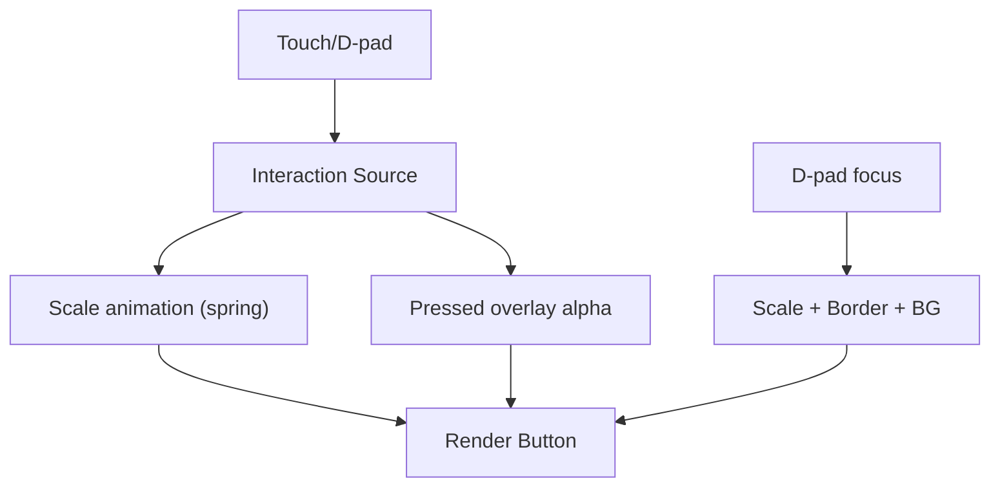
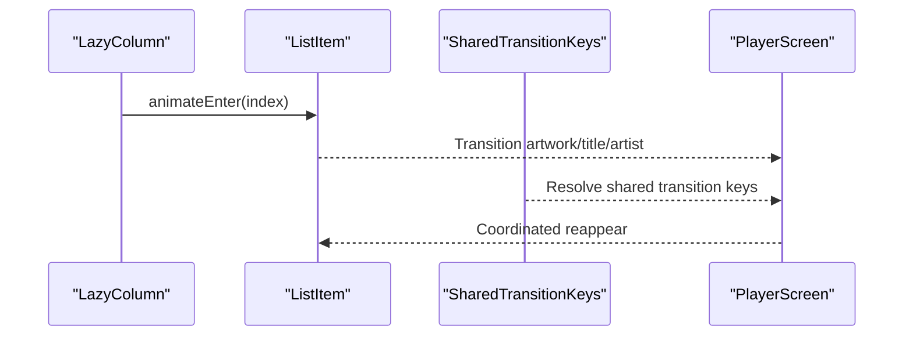
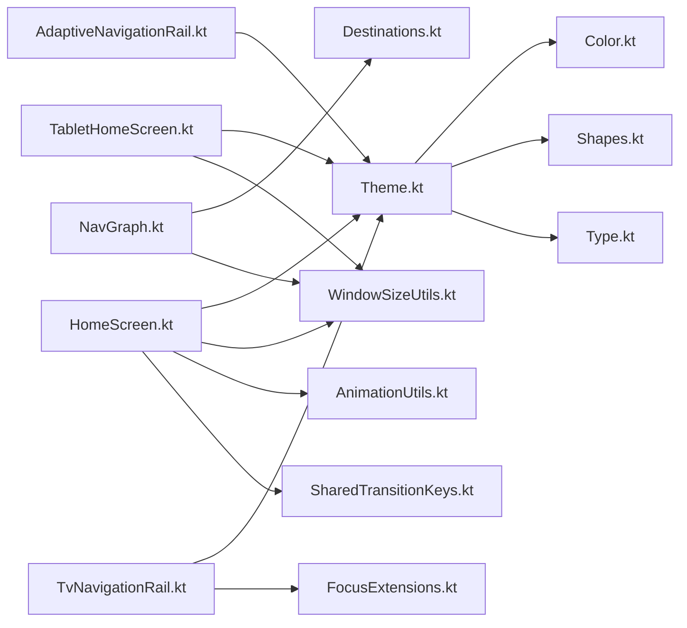

# UI/UX System

<cite>
**Referenced Files in This Document**
- [Theme.kt](file://app/src/main/java/com/suvojeet/suvmusic/ui/theme/Theme.kt)
- [Color.kt](file://app/src/main/java/com/suvojeet/suvmusic/ui/theme/Color.kt)
- [Shapes.kt](file://app/src/main/java/com/suvojeet/suvmusic/ui/theme/Shapes.kt)
- [Type.kt](file://app/src/main/java/com/suvojeet/suvmusic/ui/theme/Type.kt)
- [NavGraph.kt](file://app/src/main/java/com/suvojeet/suvmusic/navigation/NavGraph.kt)
- [Destinations.kt](file://app/src/main/java/com/suvojeet/suvmusic/navigation/Destinations.kt)
- [WindowSizeUtils.kt](file://app/src/main/java/com/suvojeet/suvmusic/ui/utils/WindowSizeUtils.kt)
- [AnimationUtils.kt](file://app/src/main/java/com/suvojeet/suvmusic/ui/utils/AnimationUtils.kt)
- [AdaptiveNavigationRail.kt](file://app/src/main/java/com/suvojeet/suvmusic/ui/components/AdaptiveNavigationRail.kt)
- [TvNavigationRail.kt](file://app/src/main/java/com/suvojeet/suvmusic/ui/components/TvNavigationRail.kt)
- [HomeScreen.kt](file://app/src/main/java/com/suvojeet/suvmusic/ui/screens/HomeScreen.kt)
- [TabletHomeScreen.kt](file://app/src/main/java/com/suvojeet/suvmusic/ui/screens/TabletHomeScreen.kt)
- [BounceButton.kt](file://app/src/main/java/com/suvojeet/suvmusic/ui/components/BounceButton.kt)
- [MeshGradientBackground.kt](file://app/src/main/java/com/suvojeet/suvmusic/ui/components/MeshGradientBackground.kt)
- [LoadingIndicator.kt](file://app/src/main/java/com/suvojeet/suvmusic/ui/components/LoadingIndicator.kt)
- [SharedTransitionKeys.kt](file://app/src/main/java/com/suvojeet/suvmusic/ui/utils/SharedTransitionKeys.kt)
- [FocusExtensions.kt](file://app/src/main/java/com/suvojeet/suvmusic/util/FocusExtensions.kt)
</cite>

## Table of Contents
1. [Introduction](#introduction)
2. [Project Structure](#project-structure)
3. [Core Components](#core-components)
4. [Architecture Overview](#architecture-overview)
5. [Detailed Component Analysis](#detailed-component-analysis)
6. [Dependency Analysis](#dependency-analysis)
7. [Performance Considerations](#performance-considerations)
8. [Troubleshooting Guide](#troubleshooting-guide)
9. [Conclusion](#conclusion)
10. [Appendices](#appendices)

## Introduction
This document describes SuvMusic’s UI/UX system built with Jetpack Compose. It covers the dynamic theming engine (including Material 3 and Material Expressive), adaptive layouts for phone, tablet, and TV, navigation and gestures, accessibility, responsive design patterns, animation systems, and performance optimizations. The goal is to help developers and designers understand how the design system is structured, how cross-device experiences are implemented, and how to extend or maintain the UI consistently.

## Project Structure
The UI layer is organized around:
- Theme definitions (colors, shapes, typography)
- Navigation graph and typed destinations
- Device-aware screens and components
- Utilities for responsiveness, animations, and focus handling
- Shared transition keys for coordinated animations

```mermaid
graph TB
subgraph "Theme Layer"
THEME["Theme.kt"]
COLOR["Color.kt"]
SHAPES["Shapes.kt"]
TYPE["Type.kt"]
end
subgraph "Navigation"
NAV["NavGraph.kt"]
DEST["Destinations.kt"]
end
subgraph "Responsive Utils"
WSIZE["WindowSizeUtils.kt"]
ANIM["AnimationUtils.kt"]
TRANSKEYS["SharedTransitionKeys.kt"]
end
subgraph "Components"
HOME["HomeScreen.kt"]
TABLET["TabletHomeScreen.kt"]
ARAIL["AdaptiveNavigationRail.kt"]
TVRAIL["TvNavigationRail.kt"]
BOUNCE["BounceButton.kt"]
MESH["MeshGradientBackground.kt"]
LOAD["LoadingIndicator.kt"]
FOCUS["FocusExtensions.kt"]
end
THEME --> HOME
THEME --> TABLET
THEME --> ARAIL
THEME --> TVRAIL
THEME --> MESH
THEME --> LOAD
NAV --> HOME
NAV --> TABLET
WSIZE --> HOME
WSIZE --> TABLET
WSIZE --> ARAIL
WSIZE --> TVRAIL
ANIM --> HOME
TRANSKEYS --> HOME
TRANSKEYS --> TABLET
BOUNCE --> HOME
FOCUS --> TVRAIL
FOCUS --> HOME
```

**Diagram sources**
- [Theme.kt:1-306](file://app/src/main/java/com/suvojeet/suvmusic/ui/theme/Theme.kt#L1-L306)
- [NavGraph.kt:1-692](file://app/src/main/java/com/suvojeet/suvmusic/navigation/NavGraph.kt#L1-L692)
- [WindowSizeUtils.kt:1-112](file://app/src/main/java/com/suvojeet/suvmusic/ui/utils/WindowSizeUtils.kt#L1-L112)
- [HomeScreen.kt:1-800](file://app/src/main/java/com/suvojeet/suvmusic/ui/screens/HomeScreen.kt#L1-L800)
- [TabletHomeScreen.kt:1-523](file://app/src/main/java/com/suvojeet/suvmusic/ui/screens/TabletHomeScreen.kt#L1-L523)
- [AdaptiveNavigationRail.kt:1-145](file://app/src/main/java/com/suvojeet/suvmusic/ui/components/AdaptiveNavigationRail.kt#L1-L145)
- [TvNavigationRail.kt:1-139](file://app/src/main/java/com/suvojeet/suvmusic/ui/components/TvNavigationRail.kt#L1-L139)
- [BounceButton.kt:1-103](file://app/src/main/java/com/suvojeet/suvmusic/ui/components/BounceButton.kt#L1-L103)
- [MeshGradientBackground.kt:1-178](file://app/src/main/java/com/suvojeet/suvmusic/ui/components/MeshGradientBackground.kt#L1-L178)
- [LoadingIndicator.kt:1-118](file://app/src/main/java/com/suvojeet/suvmusic/ui/components/LoadingIndicator.kt#L1-L118)
- [SharedTransitionKeys.kt:1-29](file://app/src/main/java/com/suvojeet/suvmusic/ui/utils/SharedTransitionKeys.kt#L1-L29)
- [FocusExtensions.kt:1-72](file://app/src/main/java/com/suvojeet/suvmusic/util/FocusExtensions.kt#L1-L72)

**Section sources**
- [Theme.kt:1-306](file://app/src/main/java/com/suvojeet/suvmusic/ui/theme/Theme.kt#L1-L306)
- [NavGraph.kt:1-692](file://app/src/main/java/com/suvojeet/suvmusic/navigation/NavGraph.kt#L1-L692)
- [WindowSizeUtils.kt:1-112](file://app/src/main/java/com/suvojeet/suvmusic/ui/utils/WindowSizeUtils.kt#L1-L112)

## Core Components
- Dynamic theming engine:
  - Material 3 color schemes with expressive spring animations for color transitions
  - Dynamic color support via Android 12+ dynamic schemes
  - Multiple preset palettes (Default/Purple, Ocean Blue, Sunset Orange, Nature Green, Love Pink)
  - Pure black mode for deep dark experiences
  - Dominant color extraction from album art with animated transitions
- Material 3 Expressive shapes and typography for consistent, expressive UI
- Navigation graph with typed destinations and device-aware routing
- Responsive utilities for orientation, tablet detection, and window size classes
- Cross-device navigation rails (tablet and TV) with expressive animations and focus handling
- Animation utilities for staggered entrances and shared element transitions
- Accessibility helpers for TV D-pad navigation and focus highlighting

**Section sources**
- [Theme.kt:1-306](file://app/src/main/java/com/suvojeet/suvmusic/ui/theme/Theme.kt#L1-L306)
- [Color.kt:1-154](file://app/src/main/java/com/suvojeet/suvmusic/ui/theme/Color.kt#L1-L154)
- [Shapes.kt:1-74](file://app/src/main/java/com/suvojeet/suvmusic/ui/theme/Shapes.kt#L1-L74)
- [Type.kt:1-129](file://app/src/main/java/com/suvojeet/suvmusic/ui/theme/Type.kt#L1-L129)
- [NavGraph.kt:1-692](file://app/src/main/java/com/suvojeet/suvmusic/navigation/NavGraph.kt#L1-L692)
- [WindowSizeUtils.kt:1-112](file://app/src/main/java/com/suvojeet/suvmusic/ui/utils/WindowSizeUtils.kt#L1-L112)
- [AdaptiveNavigationRail.kt:1-145](file://app/src/main/java/com/suvojeet/suvmusic/ui/components/AdaptiveNavigationRail.kt#L1-L145)
- [TvNavigationRail.kt:1-139](file://app/src/main/java/com/suvojeet/suvmusic/ui/components/TvNavigationRail.kt#L1-L139)
- [AnimationUtils.kt:1-81](file://app/src/main/java/com/suvojeet/suvmusic/ui/utils/AnimationUtils.kt#L1-L81)
- [SharedTransitionKeys.kt:1-29](file://app/src/main/java/com/suvojeet/suvmusic/ui/utils/SharedTransitionKeys.kt#L1-L29)
- [FocusExtensions.kt:1-72](file://app/src/main/java/com/suvojeet/suvmusic/util/FocusExtensions.kt#L1-L72)

## Architecture Overview
The UI architecture centers on a single theme entry point that composes the entire app UI. Navigation routes are strongly typed and mapped to device-specific screens. The theme adapts dynamically based on system settings, user preferences, and album art.

**Diagram sources**
- [Theme.kt:207-306](file://app/src/main/java/com/suvojeet/suvmusic/ui/theme/Theme.kt#L207-L306)
- [NavGraph.kt:109-131](file://app/src/main/java/com/suvojeet/suvmusic/navigation/NavGraph.kt#L109-L131)
- [WindowSizeUtils.kt:99-112](file://app/src/main/java/com/suvojeet/suvmusic/ui/utils/WindowSizeUtils.kt#L99-L112)

## Detailed Component Analysis

### Dynamic Theming Engine
- Color schemes:
  - Predefined palettes for Default/Purple, Ocean Blue, Sunset Orange, Nature Green, Love Pink
  - Dynamic color support on Android 12+ using system light/dark schemes
  - Pure black mode overrides surfaces to pure black
  - Album art–based dominant colors with animated transitions
- Shapes and typography:
  - Material 3 shapes with expressive variants
  - Music-focused typography scales and weights
- System bars:
  - Transparent status/navigation bars with appropriate light/dark icons

**Diagram sources**
- [Theme.kt:207-306](file://app/src/main/java/com/suvojeet/suvmusic/ui/theme/Theme.kt#L207-L306)
- [Color.kt:1-154](file://app/src/main/java/com/suvojeet/suvmusic/ui/theme/Color.kt#L1-L154)
- [Shapes.kt:1-74](file://app/src/main/java/com/suvojeet/suvmusic/ui/theme/Shapes.kt#L1-L74)
- [Type.kt:1-129](file://app/src/main/java/com/suvojeet/suvmusic/ui/theme/Type.kt#L1-L129)

**Section sources**
- [Theme.kt:1-306](file://app/src/main/java/com/suvojeet/suvmusic/ui/theme/Theme.kt#L1-L306)
- [Color.kt:1-154](file://app/src/main/java/com/suvojeet/suvmusic/ui/theme/Color.kt#L1-L154)
- [Shapes.kt:1-74](file://app/src/main/java/com/suvojeet/suvmusic/ui/theme/Shapes.kt#L1-L74)
- [Type.kt:1-129](file://app/src/main/java/com/suvojeet/suvmusic/ui/theme/Type.kt#L1-L129)

### Adaptive Layout System (Phone, Tablet, TV)
- Device detection:
  - Orientation, smallest width, and TV detection to choose device type
  - Window size classes (Compact, Medium, Expanded) for responsive grids
- Routing:
  - Typed destinations enable safe navigation and deep linking
  - Device-aware composable routing in NavGraph
- Components:
  - Phone: HomeScreen with sections, pull-to-refresh, and staggered animations
  - Tablet: Two-column layout with hero spotlight and quick-access grid
  - TV: Vertical navigation rail optimized for D-pad with focus scaling and borders

**Diagram sources**
- [WindowSizeUtils.kt:44-112](file://app/src/main/java/com/suvojeet/suvmusic/ui/utils/WindowSizeUtils.kt#L44-L112)
- [Destinations.kt:1-140](file://app/src/main/java/com/suvojeet/suvmusic/navigation/Destinations.kt#L1-L140)
- [NavGraph.kt:109-131](file://app/src/main/java/com/suvojeet/suvmusic/navigation/NavGraph.kt#L109-L131)

**Section sources**
- [WindowSizeUtils.kt:1-112](file://app/src/main/java/com/suvojeet/suvmusic/ui/utils/WindowSizeUtils.kt#L1-L112)
- [NavGraph.kt:1-692](file://app/src/main/java/com/suvojeet/suvmusic/navigation/NavGraph.kt#L1-L692)
- [HomeScreen.kt:1-800](file://app/src/main/java/com/suvojeet/suvmusic/ui/screens/HomeScreen.kt#L1-L800)
- [TabletHomeScreen.kt:1-523](file://app/src/main/java/com/suvojeet/suvmusic/ui/screens/TabletHomeScreen.kt#L1-L523)

### Navigation System
- Strongly typed destinations using Kotlin serialization
- Animated transitions between destinations with fade and slide effects
- Device-specific navigation:
  - AdaptiveNavigationRail for tablets
  - TvNavigationRail for TV with D-pad focus handling

**Diagram sources**
- [NavGraph.kt:109-131](file://app/src/main/java/com/suvojeet/suvmusic/navigation/NavGraph.kt#L109-L131)
- [Destinations.kt:1-140](file://app/src/main/java/com/suvojeet/suvmusic/navigation/Destinations.kt#L1-L140)
- [AdaptiveNavigationRail.kt:50-137](file://app/src/main/java/com/suvojeet/suvmusic/ui/components/AdaptiveNavigationRail.kt#L50-L137)
- [TvNavigationRail.kt:52-92](file://app/src/main/java/com/suvojeet/suvmusic/ui/components/TvNavigationRail.kt#L52-L92)

**Section sources**
- [NavGraph.kt:1-692](file://app/src/main/java/com/suvojeet/suvmusic/navigation/NavGraph.kt#L1-L692)
- [Destinations.kt:1-140](file://app/src/main/java/com/suvojeet/suvmusic/navigation/Destinations.kt#L1-L140)
- [AdaptiveNavigationRail.kt:1-145](file://app/src/main/java/com/suvojeet/suvmusic/ui/components/AdaptiveNavigationRail.kt#L1-L145)
- [TvNavigationRail.kt:1-139](file://app/src/main/java/com/suvojeet/suvmusic/ui/components/TvNavigationRail.kt#L1-L139)

### Gesture Controls and Accessibility
- Press feedback:
  - BounceButton provides a spring-scale press effect and optional click handling
- TV focus handling:
  - dpadFocusable applies scale, border, and background highlights for focused elements
- Pull-to-refresh:
  - Implemented in HomeScreen with a PullToRefreshBox

**Diagram sources**
- [BounceButton.kt:29-103](file://app/src/main/java/com/suvojeet/suvmusic/ui/components/BounceButton.kt#L29-L103)
- [FocusExtensions.kt:27-72](file://app/src/main/java/com/suvojeet/suvmusic/util/FocusExtensions.kt#L27-L72)
- [HomeScreen.kt:1-800](file://app/src/main/java/com/suvojeet/suvmusic/ui/screens/HomeScreen.kt#L1-L800)

**Section sources**
- [BounceButton.kt:1-103](file://app/src/main/java/com/suvojeet/suvmusic/ui/components/BounceButton.kt#L1-L103)
- [FocusExtensions.kt:1-72](file://app/src/main/java/com/suvojeet/suvmusic/util/FocusExtensions.kt#L1-L72)
- [HomeScreen.kt:1-800](file://app/src/main/java/com/suvojeet/suvmusic/ui/screens/HomeScreen.kt#L1-L800)

### Animation Systems and Transitions
- Staggered list entries:
  - animateEnter applies fade and slide-up with capped delays to avoid jank
- Shared element transitions:
  - SharedTransitionKeys centralize keys for artwork, title, and artist across screens
- Mesh gradient background:
  - Animated radial blobs with expressive color transitions synchronized to dominant colors
- Loading indicators:
  - Standard M3E loader and a custom pulsing indicator with glow and icon

**Diagram sources**
- [AnimationUtils.kt:26-81](file://app/src/main/java/com/suvojeet/suvmusic/ui/utils/AnimationUtils.kt#L26-L81)
- [SharedTransitionKeys.kt:8-29](file://app/src/main/java/com/suvojeet/suvmusic/ui/utils/SharedTransitionKeys.kt#L8-L29)
- [MeshGradientBackground.kt:27-178](file://app/src/main/java/com/suvojeet/suvmusic/ui/components/MeshGradientBackground.kt#L27-L178)
- [LoadingIndicator.kt:25-95](file://app/src/main/java/com/suvojeet/suvmusic/ui/components/LoadingIndicator.kt#L25-L95)

**Section sources**
- [AnimationUtils.kt:1-81](file://app/src/main/java/com/suvojeet/suvmusic/ui/utils/AnimationUtils.kt#L1-L81)
- [SharedTransitionKeys.kt:1-29](file://app/src/main/java/com/suvojeet/suvmusic/ui/utils/SharedTransitionKeys.kt#L1-L29)
- [MeshGradientBackground.kt:1-178](file://app/src/main/java/com/suvojeet/suvmusic/ui/components/MeshGradientBackground.kt#L1-L178)
- [LoadingIndicator.kt:1-118](file://app/src/main/java/com/suvojeet/suvmusic/ui/components/LoadingIndicator.kt#L1-L118)

### Reusable UI Elements and Design System Consistency
- Buttons and controls:
  - BounceButton for interactive elements with consistent press behavior
- Backgrounds and overlays:
  - MeshGradientBackground for immersive, album-art–driven visuals
  - LoadingArtworkOverlay for artwork placeholders
- Typography and shapes:
  - Typography and Shapes applied globally via SuvMusicTheme
- Navigation:
  - AdaptiveNavigationRail and TvNavigationRail enforce consistent navigation patterns across devices

**Section sources**
- [BounceButton.kt:1-103](file://app/src/main/java/com/suvojeet/suvmusic/ui/components/BounceButton.kt#L1-L103)
- [MeshGradientBackground.kt:1-178](file://app/src/main/java/com/suvojeet/suvmusic/ui/components/MeshGradientBackground.kt#L1-L178)
- [LoadingIndicator.kt:97-118](file://app/src/main/java/com/suvojeet/suvmusic/ui/components/LoadingIndicator.kt#L97-L118)
- [AdaptiveNavigationRail.kt:1-145](file://app/src/main/java/com/suvojeet/suvmusic/ui/components/AdaptiveNavigationRail.kt#L1-L145)
- [TvNavigationRail.kt:1-139](file://app/src/main/java/com/suvojeet/suvmusic/ui/components/TvNavigationRail.kt#L1-L139)
- [Theme.kt:207-306](file://app/src/main/java/com/suvojeet/suvmusic/ui/theme/Theme.kt#L207-L306)

## Dependency Analysis
- Theme depends on:
  - Color definitions, shapes, and typography
  - Dynamic color APIs and dominant color extraction
- Navigation depends on:
  - Typed destinations and device detection utilities
- Screens depend on:
  - Theme for colors/shapes/typography
  - Window size utilities for responsive layouts
  - Animation utilities for entrance effects
  - Focus extensions for TV accessibility

**Diagram sources**
- [Theme.kt:1-306](file://app/src/main/java/com/suvojeet/suvmusic/ui/theme/Theme.kt#L1-L306)
- [NavGraph.kt:1-692](file://app/src/main/java/com/suvojeet/suvmusic/navigation/NavGraph.kt#L1-L692)
- [WindowSizeUtils.kt:1-112](file://app/src/main/java/com/suvojeet/suvmusic/ui/utils/WindowSizeUtils.kt#L1-L112)
- [HomeScreen.kt:1-800](file://app/src/main/java/com/suvojeet/suvmusic/ui/screens/HomeScreen.kt#L1-L800)
- [TabletHomeScreen.kt:1-523](file://app/src/main/java/com/suvojeet/suvmusic/ui/screens/TabletHomeScreen.kt#L1-L523)
- [AdaptiveNavigationRail.kt:1-145](file://app/src/main/java/com/suvojeet/suvmusic/ui/components/AdaptiveNavigationRail.kt#L1-L145)
- [TvNavigationRail.kt:1-139](file://app/src/main/java/com/suvojeet/suvmusic/ui/components/TvNavigationRail.kt#L1-L139)
- [AnimationUtils.kt:1-81](file://app/src/main/java/com/suvojeet/suvmusic/ui/utils/AnimationUtils.kt#L1-L81)
- [SharedTransitionKeys.kt:1-29](file://app/src/main/java/com/suvojeet/suvmusic/ui/utils/SharedTransitionKeys.kt#L1-L29)
- [FocusExtensions.kt:1-72](file://app/src/main/java/com/suvojeet/suvmusic/util/FocusExtensions.kt#L1-L72)

**Section sources**
- [Theme.kt:1-306](file://app/src/main/java/com/suvojeet/suvmusic/ui/theme/Theme.kt#L1-L306)
- [NavGraph.kt:1-692](file://app/src/main/java/com/suvojeet/suvmusic/navigation/NavGraph.kt#L1-L692)
- [WindowSizeUtils.kt:1-112](file://app/src/main/java/com/suvojeet/suvmusic/ui/utils/WindowSizeUtils.kt#L1-L112)
- [HomeScreen.kt:1-800](file://app/src/main/java/com/suvojeet/suvmusic/ui/screens/HomeScreen.kt#L1-L800)
- [TabletHomeScreen.kt:1-523](file://app/src/main/java/com/suvojeet/suvmusic/ui/screens/TabletHomeScreen.kt#L1-L523)
- [AdaptiveNavigationRail.kt:1-145](file://app/src/main/java/com/suvojeet/suvmusic/ui/components/AdaptiveNavigationRail.kt#L1-L145)
- [TvNavigationRail.kt:1-139](file://app/src/main/java/com/suvojeet/suvmusic/ui/components/TvNavigationRail.kt#L1-L139)
- [AnimationUtils.kt:1-81](file://app/src/main/java/com/suvojeet/suvmusic/ui/utils/AnimationUtils.kt#L1-L81)
- [SharedTransitionKeys.kt:1-29](file://app/src/main/java/com/suvojeet/suvmusic/ui/utils/SharedTransitionKeys.kt#L1-L29)
- [FocusExtensions.kt:1-72](file://app/src/main/java/com/suvojeet/suvmusic/util/FocusExtensions.kt#L1-L72)

## Performance Considerations
- Hardware-accelerated drawing:
  - MeshGradientBackground uses graphicsLayer and drawWithCache to minimize overdraw
- Animation efficiency:
  - animateEnter caps index delays and reuses Animatable instances to avoid jank
  - animateColorAsState and spring animations keep transitions smooth and expressive
- Composition stability:
  - rememberDeviceType and rememberWindowSize memoize derived values
  - rememberDominantColors and rememberInfiniteTransition are scoped appropriately
- Lazy lists:
  - Pull-to-refresh and incremental loading reduce initial load and memory pressure
- TV focus handling:
  - dpadFocusable avoids redundant clickable nodes and applies lightweight focus visuals

[No sources needed since this section provides general guidance]

## Troubleshooting Guide
- Theme not applying:
  - Verify SuvMusicTheme wraps the root composable and receives correct parameters (darkTheme, dynamicColor, appTheme, dominantColors)
- Dynamic colors not working:
  - Ensure device is Android 12+ and dynamicColor is enabled
- Navigation issues:
  - Confirm destinations are properly annotated with @Serializable and used in NavHost
- TV focus problems:
  - Use dpadFocusable for focusable elements; avoid nested clickable modifiers
- Stuttering animations:
  - Prefer animateEnter for list items; avoid recomposition triggers inside heavy widgets

**Section sources**
- [Theme.kt:207-306](file://app/src/main/java/com/suvojeet/suvmusic/ui/theme/Theme.kt#L207-L306)
- [NavGraph.kt:109-131](file://app/src/main/java/com/suvojeet/suvmusic/navigation/NavGraph.kt#L109-L131)
- [FocusExtensions.kt:27-72](file://app/src/main/java/com/suvojeet/suvmusic/util/FocusExtensions.kt#L27-L72)
- [AnimationUtils.kt:26-81](file://app/src/main/java/com/suvojeet/suvmusic/ui/utils/AnimationUtils.kt#L26-L81)

## Conclusion
SuvMusic’s UI/UX system leverages a robust, dynamic theming engine grounded in Material 3 and Material Expressive, with expressive shapes and typography. The navigation is strongly typed and device-aware, enabling consistent experiences across phones, tablets, and TVs. The design system emphasizes performance and accessibility, with thoughtful animations, responsive layouts, and shared transition keys ensuring smooth, delightful interactions.

[No sources needed since this section summarizes without analyzing specific files]

## Appendices
- Design system assets:
  - Colors, shapes, and typography are centralized for consistency
- Navigation patterns:
  - Use typed destinations and device-aware routing for predictable UX
- Animation guidelines:
  - Prefer animateEnter for list items, and spring-based color transitions for theme changes

[No sources needed since this section provides general guidance]