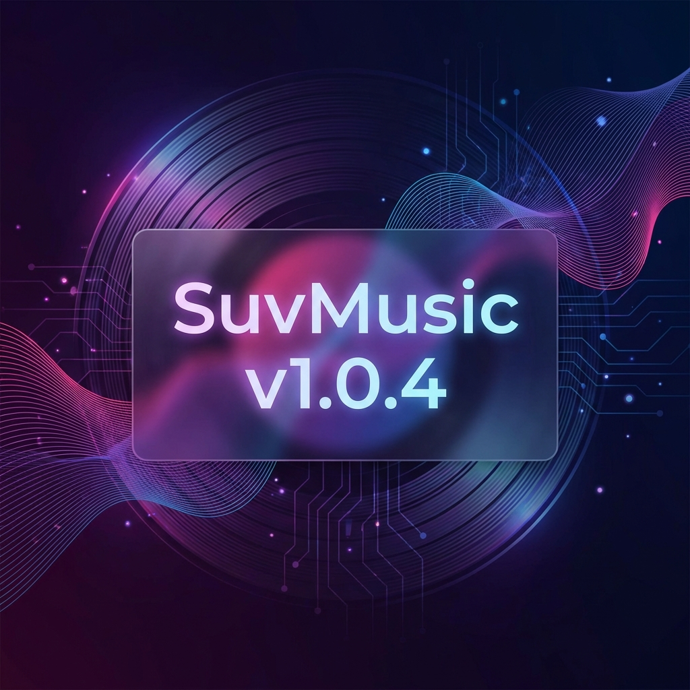

# SuvMusic v1.0.4 Release 🚀

We are excited to announce **SuvMusic v1.0.4**! This release brings a massive overhaul to the UI, introduces powerful new features like Music Haptics and Word-by-Word Lyrics, and includes improved stability and performance.

## ✨ New Features
*   **Music Haptics**: Experience your music with vibrations synchronized to the beat.
*   **Word-by-Word Lyrics**: Sing along with precise, time-synced lyrics and a new provider switcher.
*   **Instant Downloads**: Songs now download instantly if they are already buffered in the cache.
*   **Batch Downloads**: Queue multiple albums and playlists for download with background service support.
*   **Pitch & Speed Control**: Customize your listening experience with playback speed and pitch sliders.
*   **YouTube Integration**: functionality Explore and Community sections from YouTube Music are now integrated directly into the Home screen.
*   **Shared Element Transitions**: Smooth, cinematic animations when expanding the Mini Player.

## 🎨 UI/UX Enhancements
*   **Material 3 Redesign**: A fresh, modern look for the Library, Settings, Storage, and Welcome screens.
*   **Dynamic Homescreen**: A richer home screen with multiple section types and a "Pure Black" mode for OLED screens.
*   **Improved Player**: Better seekbar controls, marquee text for long titles, and polished playback controls.
*   **New Widgets**: Updated homescreen widgets with Glance support.

## 🔧 Improvements & Fixes
*   **Audio Quality**: Improved volume normalization and gapless playback.
*   **Performance**: Significant optimizations in session management and image loading.
*   **Stability**: Fixed critical crashes, memory leaks, and download reliability issues.
*   **Kotlin 2.3**: Under-the-hood updates for better performance and future-proofing.

---

## 📝 Full Changelog

Click to expand full list of changes

- added menus for songs and playlists so Buttons work now (15704da)
- Critical Fixes: SessionManager refactor (async), NewPipeDownloader OOM fix, TTMLParser crash fix (fcdabfb)
- redesign playlist UI, M3 create dialog & add connectivity checks (aa0936c)
- critical fixes for release 1.0.4: crashes, memory leaks & theme stuff (ccd2d5d)
- added mood and genres screen structure like yt music (ad88f4d)
- use pitch black bg for home screen in dark mode (9ee3a32)
- fix: use theme-aware background color on HomeScreen (0388148)
- enable video mode for all songs by searching youtube for matches (316f2fe)
- limit streaming and download quality to high (256kbps for yt, 320kbps for saavn) and remove very high option (fc02f7b)
- make download option dynamic in player sheet to show delete if already downloaded (8dc72df)
- fix download icon issue where it shows download instead of downloaded after restarting app (3af7e64)
- improved user profile photo extraction from account menu and login webview (a2a90f9)
- added marquee effect for long song names in mini player (42459c5)
- Make home screen background pure black in dark mode (55b33f0)
- Fix missing imports in CustomizationScreen (3aa83ff)
- Refactor Customization, Storage, and PlayerCache screens for Material 3 and light mode fixes (79805ac)
- fix: LibraryScreen imports and restored soft white light theme while keeping pitch black dark theme (4faf16b)
- updated theme background to pure black for dark mode and white for light mode (1579fb6)
- implemented player cache auto-clear logic with user preference (8d22d77)
- redesigned library screen with material 3 style (d99f668)
- added 'Made in India' and 'Open Source' branding to WelcomeScreen (b0ef754)
- updated audio source text to 'Music Source' and quality to '256kbps' (da67ce6)
- fix: missing offset import in WelcomeScreen (f9cad65)
- refined volume normalization parameters to fix stuttering (4d9070f)
- redesigned welcome screen with material 3 pitch-black theme (47086b2)
- improved volume normalization logic (cf2461c)
- added delete and edit options to 3-dot menu for user playlists (77db3d6)
- fixed receiver leak in MusicPlayer and cleaned up some imports (52fd618)
- changed home screen background to pitch black (84136cb)
- added explore screen logic. clicking on explore cards now opens a new screen fetching data from yt music. updated navigation and repo (bdf0a72)
- added save to library for playlists and albums. created local db tables for it and hooked up the UI buttons (f23fadf)
- fixed buttons in community cards - play, radio and save are now working (4ed79e9)
- fix: convert ic_waveform to vector to fix compose crash (f46ca83)
- added community and explore sections to home screen. fixed some layout issues and updated repository to handle the new section types from yt music api. (6d5d5e1)
- Implement dynamic homescreen UI with multiple section layouts and real data support (f9ce8e3)
- Implement auto-sync for Liked Music on library load (cad58e7)
- Fix missing imports for SharedElementTransition (2568859)
- Implement Shared Element Transition for MiniPlayer to PlayerScreen (aa56cdc)
- reduced gap between seekbar and time labels (68ab7f1)
- improved playback controls appearance (755ffd5)
- fixed material 3 seekbar long press bug (649af8d)
- fixed widget album art placeholder appearance (ffb3f0c)
- Ui update for widget to match user request (4dce64e)
- added homescreen widget with glance (2e0aaf4)
- impl auto update notification on startup (738a8ae)
- Implement Batch Download Queue Service and Album/Playlist Progress UI (d2cbac3)
- Implement Batch Delete and Batch Download Notification support (eef5978)
- updated album and playlist screens with new menu and actions (060fbd7)
- added song count and duration display to album/playlist (6e62744)
- add music haptics feature - vibrations sync with beats (64b4478)
- redesigned storage screen and added player cache settings (e07da06)
- fix sequential double tap seek issue by updating gesture state (4809810)
- fix download failure by using cached playback url and increase cache expiry to 3 hours (0de4b29)
- fix double tap seek issue by increasing swipe threshold (55b93f8)
- added caching logic for streaming and downloads (e690946)
- Feat: Dynamic lyrics provider disabling & Fix: Customization screen colors (184927f)
- CustomizationScreen now uses app theme colors instead of player dynamic colors (a2c752b)
- MiniPlayer UI refinement: reduced height and padding (3f7f10d)
- fixed shared lyrics long press (f9ece6e)
- fixed multiple downloads bug and player fallback stuff (dbcf6f8)
- add material 3 seekbar style and redesign customization screen with dynamic colors (98ef35d)
- resolve build errors due to duplicate parameters and syntax issues (bef739a)
- enhance lyrics screen with provider switcher and seek bar (6c51ef0)
- fix songs getting stuck at 0:00 sometimes (2f17885)
- added support for word by word lyrics sync, looks pretty cool now (6421f28)
- gave settings screen a facelift and added lyrics provider options (f6f23e4)
- ci: optimized workflow with comprehensive gradle caching (00b466c)
- build: increased heap size to 4g for R8 (2bf3a52)
- fix: added proguard rules for ktor and slf4j (8ce8e4b)
- fix: updated LyricsRepository DI with new providers (490f564)
- fix: corrected SessionManager import path (18f0b2f)
- cleaned up orphaned code in LyricsRepository (98c6445)
- added better lyrics providers, works pretty well now (bd37953)
- fix: duplicate songs in download screen after update (0c83498)
- separate player and download data sources to fix download issue (10611bf)
- fix bug where downloaded songs stuck at loading (a7f80a7)
- fix offline playback and thumbnail issues with UriTypeAdapter and metadata repair (d68c4a0)
- added speed & tempo sliders for pitch control (4640fe4)
- implemented shared cache so downloads are instant when playing (8d6b897)
- added download notification service + background download support (7c6a349)
- redesigned downloads screen + fixed save location to Music folder (c17c184)
- docs: comprehensive readme update with dependency map and refactored architecture (0db8cee)
- refactor: extract search service from youtube repo (c2ded82)
- refactor: extract streaming service from youtube repo (4d0eaa0)
- refactor: extract api client from youtube repo (95feb7b)
- refactor: extract json parsing utils from youtube repo (887025c)
- better lyrics matching logic (22d54a3)
- redesigned stats screen and added some charts (79b2370)
- Fix Artist Screen Action Buttons Layout (2d51b01)
- Fix Artist Screen Syntax & Navigation (aaf3e74)
- updated artist screen UI, added videos and related artists (b5c63ec)
- added full lyrics sharing and fixed file provider issue (66b6c64)
- added lyrics sharing feature (be5b1dc)
- added navigation bar transparency customization (6b394c9)
- fixed double tap seek issue so it stacks properly (4d1c01e)
- added swipe up feature in mini player (0f1d5fe)
- fixed account switching, now it saves cookies and email so you can swap accounts easily (a616ae7)
- implemented volume normalization feature (033a844)
- fixed rapid song skipping issues (2069531)
- added switch account option in settings (b28f2b6)
- fixed pagination issue where only first page of liked songs was showing (d312b48)
- added pagination for liked songs and a sync button in library, should fetch all songs now (a6e1afb)
- added double tap to seek feature with settings (03bc9fc)
- added predictive back animation support (0622dec)
- made opus info tag clickable with cool popup dialog (3bd9e69)
- added opus quality info in about screen and player (f315fd0)
- implemented see all navigation for artist albums and singles (7b48ad9)
- comments sheet now opens fully by default (ff0a046)
- removed explicit jiosaavn text from developer mode dialog (b7f5bf0)
- added copyright and dmca disclaimer to readme (fcfdcb2)
- added fallback for notification artwork (3c5b7a9)
- added transparency opacity control for miniplayer (0c60a1c)
- removed the grey bg behind miniplayer, its floating now (36fe016)
- show estimated bitrate for vbr streams like opus (73db600)
- fix login redirecting to play store (11cb9fc)
- show actual audio format and bitrate in credits screen (99483c1)
- improved create playlist dialog + empty state fix (a5002f2)
- add artwork size customization (small/medium/large) (8060ee9)
- fix floating player drag not working (9d956a6)
- rename dynamic island to floating player and make it draggable (b44227a)
- fix login crash on some devices with intent urls (3138add)
- fixed dynamic island crash and added custom playback speed option up to 5x (9a894f6)
- updated dynamic island controls to match player screen (a8938e8)
- added themed icon support (b27f483)
- docs: update README with professional layout and verified credits (067619f)
- added lyrics support with lrclib (7bfcca5)
- improving search to show uploads and videos too (beff808)
- fix missing thumbnails and some image loading improvements (7607b96)
- update app icon to use logo.webp (83a2ec6)
- bump hilt to 2.58 for kotlin 2.3 support (4b0fa2b)
- fix deprecated kotlinOptions for kotlin 2.3 (84fe9a7)
- update readme with kotlin 2.3 and sdk 36 (46a3d63)
- bump kotlin to 2.3.0 and gradle to 8.14 (6c86edf)
- update app icon with pink bg no white border (be08e14)
- restore drawable foreground for adaptive icon (3fe86d1)
- cleanup old launcher icon files (2483feb)
- fix app icon - remove white background (4a99871)
- update readme logo (62df299)
- update app icon with new logo (ec87457)
- fix volume slider toggle not working properly (6947b5e)
- Add settings toggle for in-app volume slider (#15) (9c54cf6)
- fix autoplay to keep playing after queue ends (401d94e)
- added seek time tooltip to seekbar (ac5a5ac)
- added comments pagination & optimistic posting ui (a073ddf)
- bump version to 1.0.4 (040ff74)

